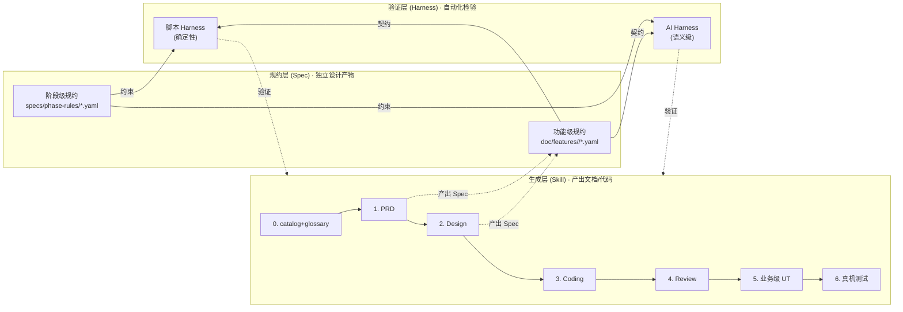
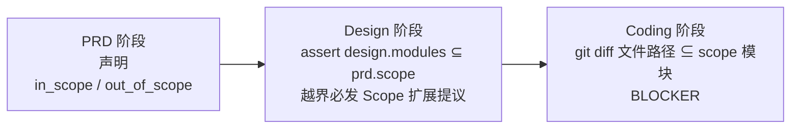

# HarmonyOS AI 研发框架全景介绍

> **文档角色**：面向没接触过本框架的同事 / 跨部门协作者的**宣传 + 快速认知**材料。
> **不是**：Skill 使用手册（使用手册见 [`framework/README.md`](../framework/README.md) 与各 [`framework/skills/*/SKILL.md`](../framework/skills/)）。
> **读完之后你会知道**：我们为什么要做这个框架、它解决了什么问题、如何接入、常见坑怎么躲、未来还会往哪走。
>
> **维护规则**：本文属于跨 feature 的综述性材料，不承担 feature 级变更日志；演进到下一大版本时整体刷一遍即可。
> 更细的阶段性复盘见 [`doc/业务级UT-实践复盘-PPT框架.md`](./业务级UT-实践复盘-PPT框架.md)、[`doc/自然语言到技术模块-演进路线图.md`](./自然语言到技术模块-演进路线图.md)、[`doc/archives/wave-1-2-framework-refactor/`](./archives/wave-1-2-framework-refactor/)。

---

## 目录

- [第一部分 · 为什么做这个框架](#一-为什么做这个框架)
- [第二部分 · 框架全貌与使用方式](#二-框架全貌与使用方式)
- [第三部分 · 常见问题与解决方案](#三-常见问题与解决方案)
- [第四部分 · 未尽事宜与未来演进](#四-未尽事宜与未来演进)
- [附录 · 关键文件索引](#附录-关键文件索引)

---

## 一、为什么做这个框架

### 1.1 背景：我们在解决什么问题

在真实钱包项目 + 内网模型的约束下，AI 辅助开发面临的不是"能不能用"，而是"**用起来能不能不出事故**"。具体表现为三重挑战：

| # | 挑战 | 典型表现 |
|---|------|---------|
| C1 | **弱模型** + 超大代码仓 | 内网 MiniMax 2.5/2.7 / GLM 4.5/4.7/5.1，200K 上下文；真实钱包工程 60 万 LOC，单个 02-Feature 模块就有 10 万 LOC；**一个模块都装不进上下文** |
| C2 | **业务专有术语** 的字面相似陷阱 | "卡中心"被误映射到 `CardManager`、"我的"被误认作"账号"、"卡包"被误认作"卡管理"——AI 没有业务先验，只能按字面相似度猜 |
| C3 | **过程产物质量抖动** | 同一个 Prompt + 同一份输入，不同模型产出质量差异大；弱模型还会 **吞字反转语义**（"不要覆盖"吞成"要覆盖"），语法仍通顺、语义完全相反 |

这三项叠加的直接后果：

- 需求 "卡中心改版" → AI 改到了 `CardManager`，PRD / design 都对得上，但整条链路都在错的方向上往下走；
- 写 ArkTS 时因上下文缺失频繁跑偏，到 code review 阶段才发现；
- UT 覆盖率看起来 80%+，线上一遇业务流程异常就炸（"声明覆盖"陷阱：`expect(list.length > 0)` 能过，业务流完全没跑）；
- 凭直觉"加强校验"而不控制边界，`doc/architecture.md` 被每一个 feature 改动污染成变更日志。

### 1.2 设计目标与核心约束

做框架时我们强行给自己画了几条红线，这些红线**反过来决定了框架的形态**：

1. **必须在 200K 上下文内可用**——所有辅助资源（规约、画像、样例）总 token 预算 ≤ 30K，给需求本体留足空间；任何"把整仓丢给 AI"的思路一开始就否决。
2. **必须可离线运行**——内网没有外部 API，没有 embedding 服务，所以不依赖向量检索。
3. **必须显式可审**——AI 的每一步决策过程都可以被人类快速复查，禁止"黑盒告诉你答案"。
4. **模型无关 / 厂商无关 / IDE 无关**——Spec 是 YAML、Prompt 是 Markdown、脚本是 TypeScript，不绑定 Cursor / Claude / 任何厂商；同一套资产可以在 Claude Code CLI、Cursor、内网 Claude、未来其他 agent 里跑。
5. **显式对抗字面相似 > 更强大的检索**——字面相似陷阱只能靠"显式枚举反例"对抗，不能靠相似度算掉（embedding 会把"卡中心"和"卡管理"算得很近，反而助长误映射）。

### 1.3 核心理念：三层分离



| 层 | 定位 | 物理位置 |
|---|------|---------|
| **Skill（生成层）** | 产出文档和代码；**生产者** | [`framework/skills/`](../framework/skills/) |
| **Spec（规约层）** | 定义契约 / 验收标准 / 边界用例；**独立于生成和验证** | [`framework/specs/phase-rules/`](../framework/specs/phase-rules/)（阶段级） + [`doc/features/<feature>/`](./features/)（功能级） |
| **Harness（验证层）** | 消费 Spec，自动化检验产出是否合规；**消费者** | [`framework/harness/`](../framework/harness/) |

**为什么非要拆三层？**
- **Spec 独立**：让"验收标准"可以在没有 Harness 时就供人工审查；而 Spec 本身又是 Skill 1/2 的**产物**（PRD 产 `acceptance.yaml` / design 产 `contracts.yaml`），同时是 Skill 3/5/6 的**输入**和 Harness 的**消费源**——一份数据三个方向使用。
- **生成与验证分离**：生成者和验证者**可以是不同模型**（甚至不同厂商），消除"考生自己批改试卷"的偏差。
- **机制 > 文字**：文字里的"应该 / 禁止"靠不住，要落到 `check-*.ts` + `verify-*.md` 可执行的硬门禁。

### 1.4 演进里程碑

按时间顺序，框架经历了这些关键阶段（每一波都留下了 plan 和自检报告，本节只做"为什么这样走"的快速回溯）：

| 波次 | 核心主题 | 主要交付 | 对应 plan |
|------|---------|---------|-----------|
| **初建** | 三层骨架 | `skills/` + `specs/phase-rules/` + `harness/` 首版；6 个阶段 Skill 打通 home-page | [全生命周期skill体系](../.cursor/plans/全生命周期skill体系_1939099a.plan.md) / [Spec-Harness 验证体系](../.cursor/plans/spec-harness验证体系_27975623.plan.md) |
| **第一波** | 弱模型友好 | **三阶段 Scope 守门**（PRD 声明 / design 继承 / coding diff 比对）；`arkts-pitfalls.md` + 逐文件 lint；Claude Code CLI 入口 + trace 回传 | [弱模型友好框架第一波改造](../.cursor/plans/弱模型友好框架第一波改造_ab0a6f11.plan.md) |
| **第二波** | 术语守门 | `module-catalog.yaml` + `glossary.yaml` 双 SSOT；PRD 新增术语映射表 Step 1.5；三道 BLOCKER 防线 | 见 [自然语言到技术模块-演进路线图](./自然语言到技术模块-演进路线图.md) WP6 |
| **第二三波** | Skill 0 自举 | `/catalog-bootstrap` / `/glossary-bootstrap` 建档流程；护栏 A–D；种子词技术词 allowlist | [累计自检报告](./archives/wave-1-2-framework-refactor/框架改造-沙盒自检报告-累计篇.md) |
| **通用化** | framework 脱耦 | 从钱包实例里剥离出 `framework/` 作为独立资产；架构 DSL 化（分层可配置）；agent adapter 插件化（generic/claude/cursor）；`00-framework-init` Skill | [framework-generalization-plan](../.cursor/plans/framework-generalization-plan_30295ca0.plan.md) |
| **Phase 9** | 产物收敛 | `specs/features/` 全部并入 `doc/features/`，`features_dir` 字段统一 | [Phase 9 合并 specs/features](../.cursor/plans/merge-feature-specs-into-doc_phase9.plan.md) |
| **架构文档收窄** | 边界划清 | `architecture.md` 改为**架构级契约文档**（只记 `dsl_change`/`module_set_change`/`responsibility_rewrite` 三类事件），不再承担 feature 级变更日志 | [架构文档变更门禁收窄](../.cursor/plans/架构文档变更门禁收窄_243f47d3.plan.md) |
| **UT 分层 v2 → v2.1** | 刻骨教训 | v2 强制抽 `UseCase` 类 + `Port` 接口 → home-page 试点翻车；v2.1 回退为**规约驱动**（UseCase 降级为 YAML 规约，代码形态 Skill 3 自选）；UI mock 绝对禁入 UT，全委派 Skill 6 | [UT 分层分工与门禁收紧](../.cursor/plans/ut_分层分工与门禁收紧_1c6f6036.plan.md) / [UT v2 修正 UseCase 去代码化](../.cursor/plans/ut_v2_修正_usecase去代码化.plan.md) |
| **进行中** | 弱模型吞字防护 | 把能机械推导的（adapter 拷贝、占位符替换、architecture.md 渲染）退出 LLM 文字流，改由脚本产出；三分区纪律（skeleton / data / narrative） | [弱模型吞字防护-framework-init](../.cursor/plans/弱模型吞字防护_framework-init.plan.md) |

**最重要的两条经验**（演进到今天才明白的）：

1. **"做框架最大的风险不是做不出来，是做多了"**——v2 把 Hexagonal Architecture 硬塞进简单 feature，`home-page`（一个"拉两个接口展示"的场景）被强抽出 `HomeLoadingUseCase + HomeDataPort`，framework 会**系统性地诱导后续 feature 重复犯错**。v2.1 删除 6 条硬规则，新增 3 条，才把路走正。
2. **"显式对抗字面相似" > "更强大的检索"**——在 L1（Domain Glossary）/L2（Module Catalog）/L3（Repo Map）/L4（Embedding RAG）/L5（Symbol Graph）五种方案里，真正解决术语误映射的是 L1+L2 而不是 L4+L5；embedding 会把字面相似词算得很近，反而助长错误。

---

## 二、框架全貌与使用方式

### 2.1 总览图

```
HarmonyOS 工程（实例）
├── framework/                      ← 通用资产（可作 git submodule 引入其他工程）
│   ├── skills/                     ← 生成层：8 个 Skill 正文（0 + 1~6，+ 初始化 Skill 00）
│   ├── specs/phase-rules/          ← 阶段级规约（8 份 YAML）
│   ├── harness/                    ← 验证层：check-*.ts 脚本 + verify-*.md prompt
│   │   ├── scripts/                  脚本 Harness（确定性）
│   │   ├── prompts/                  AI Harness prompt（语义级，模型无关）
│   │   ├── reports/                  验证报告输出
│   │   └── harness-runner.ts         统一入口
│   ├── agents/                     ← 可插拔 adapter：generic / claude / cursor
│   ├── templates/                  ← AGENTS.md.template 等实例化模板
│   └── docs/atomic-service-roadmap.md  元服务扩展位占位
│
├── CLAUDE.md 或 AGENTS.md          ← 由 adapter 生成的全局指令入口（本工程用 CLAUDE.md）
├── framework.config.json           ← 架构 DSL + 路径 + adapter 选择
├── doc/
│   ├── architecture.md             ← 架构级 SSOT（只记架构级变更）
│   ├── module-catalog.yaml         ← 模块画像 SSOT（职责 / NOT_responsible_for / easily_confused_with）
│   ├── glossary.yaml               ← 业务术语 SSOT（术语 ↔ 权威模块）
│   └── features/<feature>/         ← 一个需求一个目录（PRD / design / contracts / acceptance / 各类报告）
├── .claude/ 或 .cursor/            ← 由 adapter 实例化的路由 / 跳板 / 规则
└── 业务代码                         ← 按 architecture.md 的层级组织
```

### 2.2 全生命周期 Skill

| 阶段 | Skill | 职责 | 关键产物 | 主要门禁（BLOCKER） |
|------|-------|------|---------|---------------------|
| ★ | [`00-framework-init`](../framework/skills/00-framework-init/SKILL.md) | 接入 / 升级 framework | `framework.config.json` + agent 入口 + `doc/` 骨架 + adapter 产物 | 0.2.5 显式选定 adapter；Step 0.3 九项存在性体检 |
| 0 | [`0-catalog-bootstrap`](../framework/skills/0-catalog-bootstrap/SKILL.md) | 模块画像 + 术语表自举 | `module-catalog.yaml` / `glossary.yaml` | `easily_confused_with` 对称、`key_exports_fresh_vs_index`、种子技术词拦截 |
| 1 | [`1-prd-design`](../framework/skills/1-prd-design/SKILL.md) | PRD 撰写 | `PRD.md` + `acceptance.yaml` + `boundaries.yaml` | **术语映射表**（人工逐条确认）+ **Scope 声明** + 术语模块 ⊆ Scope |
| 2 | [`2-requirement-design`](../framework/skills/2-requirement-design/SKILL.md) | 技术设计 | `design.md` + `contracts.yaml` + `use-cases.yaml`（条件式） | Scope 继承一致性、`architecture_impact` 声明、`use-cases.yaml` schema |
| 3 | [`3-coding`](../framework/skills/3-coding/SKILL.md) | ArkTS 编码 | 源代码 + `contracts.yaml` 回填 | `diff_within_scope`、逐文件 Lint、分层 import、`named_business_handler`、**`coding_hvigor_build`**（v2.2：hvigor 真实编译） |
| 4 | [`4-code-review`](../framework/skills/4-code-review/SKILL.md) | 代码审查 | `review-report.md` | Review 结论一致性、BLOCKER 数量 |
| 5 | [`5-business-ut`](../framework/skills/5-business-ut/SKILL.md) | 业务级 UT（DAG） | `dag.yaml` + `*.test.ets` + `device-testing-todo.md` | `ut_import_whitelist`、`it_drives_flow`、`branch_coverage_full`、`acceptance_coverage`、**`ut_tsc_compiles`**、**`ut_hvigor_build`**、**`ut_hvigor_test`**、**`ut_no_src_mutation`**（v2.2：四道真实运行 / 改源码门禁） |
| 6 | [`6-device-testing`](../framework/skills/6-device-testing/SKILL.md) | 真机测试 | `test-plan.md` + `test-report.md` | P0/P1 通过率、device AC 追溯 |

**执行规则**：
- 任何阶段开始前**必须完整读完**对应 SKILL.md；其引用的 template / reference 也是强制阅读项。
- 每阶段产物**必须通过**：脚本 Harness（`framework/harness/harness-runner.ts --phase <phase> --feature <name>`，结构 + 规则级）+ AI Harness（`framework/harness/prompts/verify-<phase>.md`，语义级，独立 verifier 子 agent 执行）。
- 产物归档走 `doc/features/<feature>/` 扁平结构——一个需求一个目录，完整归档（MD + YAML 同级）。

### 2.3 三大支柱的细节

#### 2.3.1 Skill 层（生成）

- **双层目录**：实际内容放在 `framework/skills/<skill>/SKILL.md` + `templates/` + `reference/` + `examples/`；Cursor 通过 `.cursor/skills/<skill>/SKILL.md` 的**轻量跳板**（~17 行）发现并加载，Claude 通过 `.claude/commands/<slash>.md` 的 slash 触发。两处入口**都不复制内容**，避免双源不一致。
- **对话式确认**：所有关键决策（adapter 选定、术语映射确认、Scope 扩展提议）都是**显式等待用户明确字符串**，"好 / 继续 / ok"不构成决定。
- **staging + 确认后才落地**：大产物先 staging 展示 diff，用户 `y/e/s/q` 回复之后才落地，对弱模型尤其关键。

#### 2.3.2 Spec 层（规约）

**阶段级规约** [`framework/specs/phase-rules/*.yaml`](../framework/specs/phase-rules/)：8 份 YAML（prd / design / coding / review / ut / testing / catalog / glossary），每份声明三类约束：

- **structure_checks**：结构 / 语法 / 一致性（脚本可检）
- **semantic_checks**：业务逻辑 / 设计合理性（AI 检）
- **traceability_checks**：跨阶段追溯（脚本 + AI）

**功能级规约**（在 Skill 1/2 执行时同步产出，归档在 `doc/features/<feature>/`）：

| 文件 | 生产者 | 内容 |
|------|-------|------|
| `acceptance.yaml` | Skill 1 | 验收标准（AC-X），含 `priority` / `ut_layer` / `linked_branch` |
| `contracts.yaml` | Skill 2 | 接口签名、数据模型、文件清单（从 design.md 提取） |
| `boundaries.yaml` | Skill 1 + 2 | 边界用例、极端输入、性能指标 |
| `use-cases.yaml` | Skill 2（条件式） | 业务流程规约（仅复杂 feature 产出） |

#### 2.3.3 Harness 层（验证）

**双 Harness 组合拳**：

| 类型 | 特征 | 承担的检查 | 示例 |
|------|------|------------|------|
| **脚本 Harness**（`check-*.ts`） | 确定性、零误判、秒级反馈 | Schema / 一致性 / 符号禁用 / 覆盖率 | `ut_import_whitelist`（禁 UI 符号入 UT）、`diff_within_scope`（git diff 比对 Scope） |
| **AI Harness**（`verify-*.md`） | 语义级、概率性、由独立 verifier 子 agent 执行 | 业务逻辑正确性 / 设计合理性 / 端到端驱动 | `end_to_end_driving`（UT 是否真跑了业务流）、`state_model_completeness`（状态机是否漏态） |

**跑法**：

```bash
cd framework/harness
npm install                             # 首次或 package.json 变更后
# 全局 phase（无 --feature）：
npx ts-node harness-runner.ts --phase catalog
npx ts-node harness-runner.ts --phase glossary
# 功能 phase（必须带 --feature）：
npx ts-node harness-runner.ts --phase prd     --feature home-page
npx ts-node harness-runner.ts --phase design  --feature home-page
npx ts-node harness-runner.ts --phase coding  --feature home-page
# ...review / ut / testing 同理
```

输出到 `framework/harness/reports/<feature>/<phase>/` 下：
- `script-report.json` / `merged-report.md`：脚本检查报告
- `ai-prompt.md`：组装好的 AI prompt（**脚本不自动调模型**，由 verifier 子 agent 或你拷贝出去发给任意 AI 执行 —— 这是**完全模型无关性**的关键）

**AI Harness 为什么不直接调 API？**
因为 Spec / Prompt 是纯文本，把**"组装 prompt"和"调模型"解耦**，才能让用户在 Cursor / 内网 Claude / 未来任何 agent 中都能运行。脚本只生成 prompt，由 agent 层决定怎么调用。

### 2.4 可插拔 Agent Adapter

不同的 AI agent（Claude Code / Cursor / 未来的 XX）对"怎么加载指令、怎么触发命令"有不同约定，但 Skill 本身的**正文是一样的**。Adapter 层封装这些差异：

| adapter | 入口文件 | slash | skill 跳板 | rules |
|---------|---------|-------|-----------|-------|
| `generic` | `AGENTS.md` | — | — | — |
| `claude` | `CLAUDE.md` | `.claude/commands/*.md` + `.claude/agents/verifier.md` | — | — |
| `cursor` | `AGENTS.md` | — | `.cursor/skills/<skill>/SKILL.md` | `.cursor/rules/framework.mdc` |

**新增 adapter 只需**：在 `framework/agents/<name>/` 下建目录、按 `adapter-schema.yaml` 写 `adapter.yaml`、放模板。Skill 本身无需改一行。

### 2.5 关键能力拆解

#### A. 架构 DSL（可配置分层）

`framework.config.json → architecture` 声明你工程的分层（外层 + 内层）+ 依赖矩阵。示例（钱包工程）：

```json
"architecture": {
  "outer_layers": [
    { "id": "01-Product", "can_depend_on": ["02-Feature","03-CommonBusiness","04-BusinessBase","05-SystemBase"], "intra_layer_deps": "dag" },
    { "id": "02-Feature", "can_depend_on": ["03-CommonBusiness","04-BusinessBase","05-SystemBase"], "intra_layer_deps": "dag" },
    ...
    { "id": "05-SystemBase", "can_depend_on": [], "intra_layer_deps": "sublayer",
      "sublayers": [{ "id": "CommUI", "can_depend_on_sublayers": ["CommFunc"] }, { "id": "CommFunc", "can_depend_on_sublayers": [] }] }
  ],
  "module_inner_layers": ["shared","data","domain","presentation"],
  "inner_dependency_direction": "upward",
  "cross_module_exports_file": "Index.ets"
}
```

- `check-design.ts` / `check-coding.ts` / `check-catalog.ts` **全部从这里读**，不再硬编码"五层"或"四层"。
- 一个极简 3 层 App 只需把 `outer_layers` 改短、`module_inner_layers` 改成 `["data","domain","ui"]`，framework 代码一行不改。
- 元规则仍由 framework 守门（不可配）：依赖方向自上而下、层级图必须是 DAG、跨模块只许通过 `cross_module_exports_file`。

#### B. 术语表 + 模块画像（自然语言 → 技术模块）

解决"卡中心被误映射到 CardManager"这类事故的核心抓手：

- **`doc/module-catalog.yaml`**：每个模块的 `primary_responsibility` / `NOT_responsible_for` / `easily_confused_with` / `typical_business_terms` / `key_exports`
- **`doc/glossary.yaml`**：业务术语 ↔ 权威模块（含 `aliases` / `confidence_hint` / `easily_confused_with`）
- **PRD Step 1.5 术语映射表**：逐条列出"原始术语 → 权威模块"，**用户必须逐行把 `[ ]` 改成 `[x]` 才能往下走**，即便置信度 `high` 也不给 auto-approve

**三道 BLOCKER**：

| 防线 | 触发条件 |
|------|---------|
| ① 人工确认 | 任何一行「用户确认」≠ `[x]` |
| ② Catalog 对齐 | 权威模块不在 `module-catalog.yaml` |
| ③ Glossary 交叉 | 全部 `[x]` 但与 `glossary.yaml` 映射冲突 |

#### C. 三阶段 Scope 守门（防 scope creep）



任何"顺手改一下"都必须回到 design 阶段走**显式扩展提议**（`expansions_with_user_approval`），用户批准后才能写入。

#### D. 业务级 UT 分层分工

UT 是**既有代码的消费者**，不驱动架构。分工约定：

```
业务流 + 状态 + 数据边界 ─→ UT （禁 UI import，硬门禁拦截）
UI 交互 / 渲染 / 转场  ─→ Skill 6 真机（device-testing-todo.md 委派）
```

`acceptance.yaml` 每条 AC 带 `ut_layer ∈ {unit, device, both}`：
- `unit/both` → 进 UT
- `device/both` → 进 `device-testing-todo.md` → 交 Skill 6

复杂度阈值（三条件任一才产 `use-cases.yaml`）：
1. 多 UI 节点共享同一业务状态
2. 多步云调用串行（≥ 2 次云端接口顺序依赖）
3. 含回滚分支

**否则**：`acceptance.yaml` + `dag.yaml` + 针对 data 层的轻量 UT 足够。

#### E. 跨阶段追溯链

Spec 是追溯链的枢纽，每一环都由脚本 Harness 自动验证：

```
PRD.md ─→ acceptance.yaml (AC1, AC2, BD1, BD2...)
               │ prd_to_design_coverage
               ▼
design.md ─→ contracts.yaml (interfaces, data_models, files, linked: AC1→func1)
               │ design_to_code_coverage
               ▼
source code (func1.ets, func2.ets...)
               │ code_to_ut_coverage
               ▼
UT (DAG + *.test.ets, it() 标签 [BRANCH-x][AC-Y])
               │ prd_acceptance_to_test
               ▼
Test Plan / device-testing-todo.md
```

### 2.6 使用方式（三种场景）

#### 场景 1 · 全新工程接入 framework

```bash
# 1. 在目标工程根引入 submodule
git submodule add <framework-repo-url> framework
git submodule update --init --recursive

# 2. 在你的 AI agent 里触发初始化 Skill
#    - Claude Code：/framework-init
#    - Cursor / 其他：把下面这段话贴给 agent
```

**万能引导语**（贴给任何 AI agent 都管用）：

> 这个工程已经把 framework/ 作为 git submodule 引入（如果没有，请先 git submodule add <framework-repo-url> framework 再继续）。
> 请完整阅读 `framework/skills/00-framework-init/SKILL.md`，按里面的 Step 0 → Step 7 严格执行，完成 framework 在本工程的初始化。涉及架构 DSL、adapter 选择、产物路径等关键决策，必须停下来让我确认，不要静默写入。

初始化 Skill 会：扫描目录 → 识别架构特征 → 问你项目名 / 类型 / 架构 DSL / adapter → 一次性写出 `framework.config.json` + `CLAUDE.md`/`AGENTS.md` + `doc/` 骨架 + adapter 产物。

#### 场景 2 · 日常需求（一条 feature 完整流程）

假设需求是"首页加一个活动入口"：

```bash
# Step 0: 如果涉及新模块/新术语，先走 Skill 0
/catalog-bootstrap <新模块名>      # 或自然语言：为 X 模块建档
/glossary-bootstrap                # 按需扩充术语表

# Step 1: PRD
/prd-design 首页活动入口
# → 产出 doc/features/home-activity-entry/PRD.md + acceptance.yaml
# → harness --phase prd 验证 PASS

# Step 2: 技术设计
/requirement-design
# → 产出 design.md + contracts.yaml（可能含 use-cases.yaml）
# → harness --phase design 验证 PASS

# Step 3 ~ 6: 编码 / 审查 / UT / 真机
/coding / /code-review / /business-ut / /device-testing
```

每一步的脚本 Harness 结果 + AI Harness 语义审查都会落在 `framework/harness/reports/<feature>/<phase>/`，PASS 之前不要进入下一阶段。

#### 场景 3 · 升级 framework（已初始化过）

```bash
git submodule update --remote framework
/framework-init   # UPDATE 模式：展示 diff → 你确认 → 只改动需要改的
```

UPDATE 模式会对 `framework.config.json` 做字段级 diff；切 adapter 时不自动删旧文件，由你手动处理（防误删）。

### 2.7 为什么这个框架是"工程级资产"

用一句话收束第二部分：

> 你可以把它看成一套**给 AI 的"企业规约"**——把我们对 HarmonyOS 研发的经验、约定、红线、追溯要求，从"人脑隐性知识"转成了 **机器可读 + 机器可验 + 模型无关**的显式契约。新同事接手、新模型上线、新工程接入，都按同一套流程走，不会"每个 AI 一个风格"。

---

## 三、常见问题与解决方案

以下是实践中最频繁遇到的痛点 + 当前框架的解法。每一项都附有**症状**、**根因**和**落地机制**，方便你照着定位自己项目的问题。

### 3.1 Scope creep（AI 擅自扩大改动范围）

**症状**：你要 AI 改 BankCard，它顺手给 CardManager 加了接口；改 home-page，它把 03-CommonBusiness 也动了。Review 阶段才发现 git diff 范围远超预期。

**根因**：PRD 没有声明"只能改哪些"，AI 只能按"相关性"猜测，相关性越高越会被错误扩充。

**解法（三阶段 Scope 守门）**：
- PRD 必须声明 `in_scope_modules` / `out_of_scope_modules` / `rationale`
- design.md 必须继承 PRD scope；扩展走显式"Scope 扩展提议"流程
- coding 阶段 `diff_within_scope` BLOCKER：git diff 涉及的文件必须全部在 scope 内
- 落地文件：[`framework/harness/scripts/utils/scope-parser.ts`](../framework/harness/scripts/utils/scope-parser.ts) + [`check-coding.ts`](../framework/harness/scripts/check-coding.ts) 的 `checkDiffWithinScope`

### 3.2 术语误映射（"卡中心 vs 卡管理"）

**症状**：自然语言需求 "卡中心改版" → AI 选了 `CardManager` → 下游全部链路（PRD/design/coding/UT）内部一致 → 出口产物对的看起来，但方向是错的。

**根因**：AI 没有业务先验，只能靠字面相似；"第一波 Scope 守门"是输出后校验，防不了"输入端归属本身就错"。

**解法（术语 SSOT + 三道 BLOCKER）**：
- 建 `module-catalog.yaml`（14 个模块画像）和 `glossary.yaml`（15+ 条业务术语）
- PRD Step 1.5 强制列"术语映射表"，用户逐条 `[x]` 确认
- 三道防线：人工确认 / Catalog 对齐 / Glossary 交叉
- 详见 [自然语言到技术模块-演进路线图](./自然语言到技术模块-演进路线图.md)

### 3.3 UT 的"声明覆盖陷阱"

**症状**：UT 报告 80%+ 覆盖率，但线上一遇业务流异常就炸。打开一看，UT 写成了 `expect(repo.getList().length > 0)` —— 业务流程完全没跑。

**根因**：UT 变成了"数据接口测试"，而不是"业务流端到端驱动"。

**解法**：
- `it_drives_flow`（MAJOR）：每个 `it()` 必须有 ≥ 2 次 data_boundary 调用断言 + ≥ 2 次 state 断言
- `end_to_end_driving`（AI Harness BLOCKER）：语义复核 UT 是否真驱动了命名入口
- 分支 1:1 映射：`use-cases.yaml > branches[]` ↔ UT `it()` 标签 `[BRANCH-id][AC-X]`

### 3.4 UI mock 泥潭

**症状**：为了让 UT 能跑 onClick → Navigation → Toast 这一连串 UI 副作用，造了一堆 `FakeNavPathStack` / `FakePromptAction`。SDK 一升级全红，Mock 代码比业务代码还长。

**根因**：ArkTS 的 `@Component struct` 是编译期语法糖，hypium 下无法实例化；试图在 UT 里验证 UI 交互是反人性的。

**解法（彻底禁 UI import）**：
- `ut_import_whitelist`（BLOCKER）：UT 文件禁 import `@Component` / `NavPathStack` / `showToast` / `$r(` / `AppStorage` 等 15+ 模式
- 分层分工：`ut_layer ∈ {unit, both}` → UT；`device / both` → `device-testing-todo.md` → Skill 6 真机
- `device_ac_delegation`（MAJOR）：device AC 必须在 todo 或 Skill 6 计划中登记

### 3.4.1 v2.2 新增：UT "假 PASS" 三道护栏 + 改源码门禁

**症状**：弱模型生成的 UT 大量 `tsc` 编译不过、或 hvigor 报错、或在没设备的 CI 上"无设备 → SKIP → PASS"，但 harness 全绿。

**根因**：v2.1 之前 harness 只做静态结构扫描，缺少"真编译 / 真运行"出口。

**解法（v2.2）**：

| 规则 | 落点 | 严重度 | 触发逻辑 |
|------|------|--------|----------|
| `ut_tsc_compiles` | `check-ut.ts` + `utils/ts-compile.ts` | BLOCKER | 用 TypeScript Compiler API（`ts.createProgram`）对 `*.test.ets` 做 `noEmit` 扫描，零 Error 才通过；`.ets` 虚拟为 `.ts`，`@ohos/hypium` 走 ambient 声明，`noResolve: true` 不跟随 import |
| `coding_hvigor_build` | `check-coding.ts` + `utils/hvigor-runner.ts` | BLOCKER | 对每个业务模块跑 `hvigorw assembleHap`；exit_code != 0 或解析出 ArkTS:ERROR / TSxxxx 即 FAIL；工具链缺失 / `HARNESS_SKIP_HVIGOR=1` 都翻译为 FAIL（不 SKIP） |
| `ut_hvigor_build` | `check-ut.ts` | BLOCKER | 对 `<module>@ohosTest` 跑 `hvigorw assembleHap`；兜底 tsc 漏过的跨文件类型违约 |
| `ut_hvigor_test` | `check-ut.ts` | BLOCKER | 先 `hdc list targets` 探测设备，无设备**直接 FAIL**（不再 SKIP）；有设备则 `hvigorw test` 装机运行，解析 hypium `OHOS_REPORT_RESULT` 行；failed > 0 或 total = 0 都 FAIL；`HARNESS_SKIP_HVIGOR_TEST=1` 也是 FAIL |
| `ut_no_src_mutation` | `check-ut.ts` + `utils/git-diff.ts` | BLOCKER | git diff 检测 `02-Feature/**/src/main/**` 等业务源码改动；未在 `gap-notes.md > approved_src_mutations[]` 登记的一律 FAIL；baseRef 取 `trace.json > start_commit`，无则回退 `HEAD~1` |

**配套**：
- Skill 3 SKILL.md 新增 Step 6.5 "真实编译闭环"：agent 必须自己跑 hvigor、读日志、定位修复，不允许把编译失败标为"环境问题"。
- Skill 5 SKILL.md 新增 Step 7.5 / 7.6（UT 编译闭环 + 装机运行闭环），并把"约束 #12 不修改业务源码"升级为 HARD STOP（必须先问后改 + gap-notes 登记）。
- `verify-ut.md` prompt 顶部加 HARD STOP 等价条款，verifier 子 agent 检测疑似为"为 UT 便利新增的工具函数"时强制标 BLOCKER。
- `harness-runner.ts` 在每次进阶段时把 `git rev-parse HEAD` 写入 `reports/<feature>/<phase>/trace.json > start_commit`，作为 `ut_no_src_mutation` 的 git diff 起点。

**放宽 `named_business_handler`**：v2.1 的正则只识别 `function xxx` / 类方法 `xxx()`，误杀了 ArkTS 合法的类字段函数 `handleClick = async () => {}`。v2.2 新增 `reFieldFunc` 正则覆盖：
- `xxx = () => {}` / `xxx = async () => {}` / `xxx = function() {}`
- `xxx: () => void = async () => {}` / `xxx: MyType = () => {}`
- `const xxx = () => {}` / `let xxx: Func = () => {}`

仍然拦截**匿名**直接挂在 UI 事件上的 inline lambda（`.onClick(() => { ... })` 没有 `symbol =` 前缀，不匹配新正则）。

### 3.5 弱模型吞字反转语义

**症状**：同一份模板，弱模型落地后关键词"不 / 禁 / 严 / 仅"经常被吞掉，语法仍通顺，语义完全反转。

示例：

| 原文 | 落地 | 后果 |
|------|------|------|
| "本 Skill **不**会覆盖 catalog" | "本 Skill 会覆盖 catalog" | 下次重跑毁资产 |
| "**严禁**未确认前覆盖 config" | "未确认前覆盖 config" | 绕过人工门禁 |
| "**禁止**逆向依赖" | "允许逆向依赖" | 架构契约失效 |

**根因**：中文"不"字单字吞掉后语法仍然通顺，无法被语法校验发现；让 LLM "重写整段模板长文本"就会给它吞字机会。

**解法（进行中，见 [弱模型吞字防护 plan](../.cursor/plans/弱模型吞字防护_framework-init.plan.md)）**：
1. **Data-driven over LLM-driven**：adapter 字节拷贝 / 占位符替换 / architecture.md 渲染 → 退出 LLM 文字流，改由 `framework/harness/` 脚本产出
2. **三分区纪律**：受管文档划分 `<!-- framework:skeleton/data/narrative -->` 三区
   - skeleton 区（字节不变的规则文字） → sha256 比对，BLOCKER
   - data 区（结构化数据展开） → 脚本重渲染比对，BLOCKER
   - narrative 区（允许 AI 散文） → 极性词 WARN
3. **正向 over 负向**：能用白名单 / "仅 X" 表达的不用"不要 X"。"仅 X"吞字变"X"语义不变；"不要 X"吞字变"要 X"彻底反义
4. **negation-diff verifier**：独立 verifier 子 agent 逐句比对极性词翻转

### 3.6 过度架构化（v2 UseCase 翻车）

**症状**（历史）：v2 强制每个 feature 必须产出：
- `domain/usecase/XxxUseCase.ets`（独立类）
- `XxxPort` 接口（端口抽象）
- 构造器注入所有依赖

结果 `home-page`（一个"拉两个接口展示"的场景）被迫抽出 `HomeLoadingUseCase + HomeDataPort`；framework 的硬规则会**系统性诱导后续 feature 重复犯错**。

**解法（v2.1 回退）**：

| 反模式（v2） | 校正（v2.1） |
|---|---|
| UseCase 必须是 `.ets` 类 | UseCase = **YAML 规约文档** |
| 必须新造 Port 接口 | `data_boundaries[].type` 直接引用 `contracts.yaml` 既有类 |
| 所有 feature 都要产 use-cases.yaml | **复杂度阈值**（多 UI / 多步云 / 含回滚），任一满足才产 |
| UT 驱动架构设计 | UT 是消费者，若代码不可测 → 反馈 Skill 3 抽命名函数，**不要**反过来在 UT 里 new `@Component struct` |

**教训（值得记到墓志铭上）**：

> 做框架时最怕的不是功能不够，是把某种架构风格强塞进所有场景。

### 3.7 架构文档被 feature 级变更污染

**症状**：`doc/architecture.md` 被每一个 feature 改动拿来追加一行变更记录，几个月后 architecture.md 变成了 git blame 的彩色版——每一行都跟当前架构没关系。

**根因**：没有明确"架构文档承载什么 / 不承载什么"。

**解法（[架构文档变更门禁收窄](../.cursor/plans/架构文档变更门禁收窄_243f47d3.plan.md)）**：
- design.md 新增 **"架构影响声明"** 章节，必填 `architecture_impact ∈ {none, dsl_change, module_set_change, responsibility_rewrite}`
- 只有后三种才触发 architecture.md 更新；`impact: none` 是 90% 场景的缺省值
- `check-design.ts` 的 `checkDesignToArchitecture` 按 `impact` 字段条件式 SKIP
- architecture.md 定位收窄为**架构级契约文档**；模块职责 / 公共能力 / 易混点移到 `module-catalog.yaml`

### 3.8 ArkTS 弱模型易错点

**症状**：弱模型写 ArkTS 经常在 `@State/@Prop` reactivity、装饰器位置、`@Component.build()` 约束、`router` vs `NavPathStack` 混用、`$r()` 资源引用、HAR `Index.ets` 导出规则等地方跑偏，到 review 阶段才一锅出。

**解法**：
- [`framework/skills/3-coding/reference/arkts-pitfalls.md`](../framework/skills/3-coding/reference/arkts-pitfalls.md) 收录 10-15 条"错例 → 正例"对照
- Skill 3 Step 3 强制**逐文件 Lint 门禁**：单文件 `ReadLints` 零 error 才能写下一个；严禁批量生成后统一 lint

### 3.9 端到端"一键完成"的误区

**症状**：期望 `harness-runner` 能一键跑完 PRD→design→coding→review→UT→testing。

**正解**：Harness 是**每步归档后的质量门禁**，不是开发流水线。各阶段文档与代码仍需按 Skill 由 AI + 人工完成；Harness 的职责是**卡住错误不让往下传**。`AI Harness` 脚本只生成 `ai-prompt.md`，**不会自动调模型**——这是模型无关性的前提。

---

## 四、未尽事宜与未来演进

### 4.1 已知局限（当前版本）

| 类别 | 局限 | 影响 | 缓解 |
|------|------|------|------|
| **Glossary 覆盖** | 沙盒只有 15 条术语，真实工程估计需要 50-200 条 | 首轮移植需集中扩充 | Skill 0 `/glossary-bootstrap` 支持增量建档 |
| **弱模型吞字防护** | 计划已出，未全部落地；当前 SKILL 文档仍含部分负向表达 | UPDATE 模式重跑仍有反转风险 | [弱模型吞字防护 plan](../.cursor/plans/弱模型吞字防护_framework-init.plan.md) 推进中 |
| **design 启发式误报** | `file_structure_per_module` / `interface_signatures_complete` 用正则启发式，偶发误报 | 需要人工识别噪声 | 后续替换为 AST 精确分析 |
| **diff 基线** | `diff_within_scope` 依赖 `HARNESS_DIFF_BASE_REF` 环境变量 | CI 需显式指定基线 | 文档已注明 |
| **key_exports 不展开** | `key_exports_fresh_vs_index` 不展开 `export * from` | 重导出场景可能漏检 | 仅 WARN 级别 |
| **Skill 6 尚弱** | 真机 harness 脚本未完全搭起来，`device_ac_delegation` 仍为 MAJOR | device AC 闭环偏弱 | 计划升 BLOCKER（见下文） |
| **无真实复杂 feature** | 沙盒里最复杂的 feature 是 home-page（单点加载），不足以验证 v2.1 在"开卡级"复杂流程下的收益 | UT 架构的信心打折扣 | `framework/skills/5-business-ut/examples/card-opening/` 作纸面样例；等真实业务接入 |
| **分支组合爆炸** | `use-cases.yaml > branches[]` 显式列举，N×M 组合时膨胀快 | 需人工裁剪到 6-10 条关键分支 | `branch_coverage_semantic` AI 复核关键异常覆盖 |
| **架构漂移检测** | 大仓长期 drift 缺 `check-architecture` 类门 | 架构违规靠 code review 兜底 | 纳入后续议题 |

### 4.2 短期（1-2 个月）

- **完成弱模型吞字防护**：[`.cursor/plans/弱模型吞字防护_framework-init.plan.md`](../.cursor/plans/弱模型吞字防护_framework-init.plan.md) 的 9 个 todo 全落地，三分区哨兵 + `check-framework-init.ts` + negation-diff verifier
- **Skill 6 真机 harness 健全**：`check-testing.ts` + `verify-testing.md` 补齐；`device_ac_delegation` 升 BLOCKER
- **第一次真实复杂 feature 实战**：在开卡 / 转账 / 绑卡等真实场景做 v2.1 实战验证，按结果反哺 `use-cases.yaml` Schema
- **首次外部工程接入**：用完全不同架构（如 3 层 App）的 HarmonyOS 工程验证架构 DSL 化是否真的解耦
- **trace.json + gap-notes 回传闭环打通**：内网跑动 → commit `harness/reports/<feature>/<ts>/` 目录 → Cursor 侧接续

### 4.3 中期（3-6 个月）

- **WP7 · 分层 Repo Map**（见 [演进路线图](./自然语言到技术模块-演进路线图.md) §5）：当"术语归属已基本无错，但 contracts 签名错误偏多"时启动；`framework/harness/scripts/gen-repo-map.ts` 扫描各模块 `Index.ets` + 公共接口，按层级输出树；≤ 20K token 预算
- **参数化分支**：解决 branches 组合爆炸；v1 策划里提过，v2.1 未启用
- **元服务差异化规则**：`project_type: atomic_service` 扩展位已预留，待议题启动时按 [元服务扩展路线图](../framework/docs/atomic-service-roadmap.md) 逐条落地
  - 首包大小校验（≤ 10 MB）
  - 分包策略
  - 免安装入口限制
  - API 能力裁剪
  - 资源本地化与体积压缩
  - 权限清单收敛
  - 冷启动性能门禁
- **DAG 可视化工具**：Mermaid 自动渲染 + 覆盖率热图
- **`check-*.ts` 与 IDE 深度集成**：保存时跑门禁（PostToolUse hook）

### 4.4 长期（6+ 个月，视真实收益决定）

- **WP8 · 语义检索 / 符号图**（观望）：启动需同时满足：WP6+7 已运行 ≥ 1 个月；错误集中在"新兴业务 + 历史代码深度依赖"两类；内网有可用本地 embedding；有 ≥ 0.2 人月/月 的维护投入
- **明确的"不做"清单**：
  - ❌ 完整的 Kythe / Glean 系统（成本与收益严重不匹配）
  - ❌ 训练领域模型（数据不足、内网算力紧张）
  - ❌ 替换现有三层框架（增量演进优先）
- **AI Harness 专用小模型微调**：降低对通用大模型的依赖，特别是 verifier 子 agent 的语义复核
- **跨工程复用**：真正把 framework 变成内网可被多个 HarmonyOS 项目共享的基础设施，现在的 submodule 形态只是起点

### 4.5 决策里程碑

下一次启动某大议题前，建议回到这张表对号入座：

| 里程碑 | 触发条件 | 下一步 |
|--------|---------|--------|
| **M2** | 真实工程首次移植，建立初始 glossary（估计 50+ 条） | 收集 trace.json + gap-notes |
| **M3** | 真实工程跑 3 次需求 | 统计术语命中率 |
| **M4** | M3 显示术语归属基本无错，但 contracts 签名错误偏多 | 启动 WP7（Repo Map） |
| **M5** | WP7 运行 1 个月后 | 评估是否进入 WP8（语义检索） |

---

## 附录 · 关键文件索引

### 顶层入口
- [`framework/README.md`](../framework/README.md) · framework 静态使用说明
- [`framework/skills/README.md`](../framework/skills/README.md) · Skill 索引
- [`framework/MIGRATION.md`](../framework/MIGRATION.md) · 升级与迁移说明
- [`CLAUDE.md`](../CLAUDE.md) · 本工程的全局 agent 指令入口（由 claude adapter 生成）

### 核心 SSOT
- [`framework.config.json`](../framework.config.json) · 架构 DSL + 路径 + adapter
- [`doc/architecture.md`](./architecture.md) · 架构级契约文档
- [`doc/module-catalog.yaml`](./module-catalog.yaml) · 模块画像 SSOT
- [`doc/glossary.yaml`](./glossary.yaml) · 业务术语 SSOT

### Skill 正文
- [`framework/skills/00-framework-init/SKILL.md`](../framework/skills/00-framework-init/SKILL.md)
- [`framework/skills/0-catalog-bootstrap/SKILL.md`](../framework/skills/0-catalog-bootstrap/SKILL.md)
- [`framework/skills/1-prd-design/SKILL.md`](../framework/skills/1-prd-design/SKILL.md)
- [`framework/skills/2-requirement-design/SKILL.md`](../framework/skills/2-requirement-design/SKILL.md)
- [`framework/skills/3-coding/SKILL.md`](../framework/skills/3-coding/SKILL.md)
- [`framework/skills/4-code-review/SKILL.md`](../framework/skills/4-code-review/SKILL.md)
- [`framework/skills/5-business-ut/SKILL.md`](../framework/skills/5-business-ut/SKILL.md)
- [`framework/skills/6-device-testing/SKILL.md`](../framework/skills/6-device-testing/SKILL.md)

### 规约与门禁
- [`framework/specs/phase-rules/`](../framework/specs/phase-rules/) · 8 份阶段规约 YAML
- [`framework/harness/scripts/`](../framework/harness/scripts/) · 脚本 Harness
- [`framework/harness/prompts/`](../framework/harness/prompts/) · AI Harness prompt

### 演进背景阅读
- [`doc/自然语言到技术模块-演进路线图.md`](./自然语言到技术模块-演进路线图.md) · 核心思考 + 分阶段规划
- [`doc/业务级UT-实践复盘-PPT框架.md`](./业务级UT-实践复盘-PPT框架.md) · UT 分层的刻骨教训
- [`doc/业务级UT策划.md`](./业务级UT策划.md) · UT 方法论初衷（v1）
- [`doc/Harness全链路验证说明.md`](./Harness全链路验证说明.md) · 8 个 phase 脚本的操作手册
- [`doc/archives/wave-1-2-framework-refactor/`](./archives/wave-1-2-framework-refactor/) · 历次自检报告归档

### 关键 plan（按时间顺序）
- [`.cursor/plans/全生命周期skill体系_1939099a.plan.md`](../.cursor/plans/全生命周期skill体系_1939099a.plan.md)
- [`.cursor/plans/spec-harness验证体系_27975623.plan.md`](../.cursor/plans/spec-harness验证体系_27975623.plan.md)
- [`.cursor/plans/弱模型友好框架第一波改造_ab0a6f11.plan.md`](../.cursor/plans/弱模型友好框架第一波改造_ab0a6f11.plan.md)
- [`.cursor/plans/framework-generalization-plan_30295ca0.plan.md`](../.cursor/plans/framework-generalization-plan_30295ca0.plan.md)
- [`.cursor/plans/merge-feature-specs-into-doc_phase9.plan.md`](../.cursor/plans/merge-feature-specs-into-doc_phase9.plan.md)
- [`.cursor/plans/架构文档变更门禁收窄_243f47d3.plan.md`](../.cursor/plans/架构文档变更门禁收窄_243f47d3.plan.md)
- [`.cursor/plans/ut_分层分工与门禁收紧_1c6f6036.plan.md`](../.cursor/plans/ut_分层分工与门禁收紧_1c6f6036.plan.md)
- [`.cursor/plans/ut_v2_修正_usecase去代码化.plan.md`](../.cursor/plans/ut_v2_修正_usecase去代码化.plan.md)
- [`.cursor/plans/弱模型吞字防护_framework-init.plan.md`](../.cursor/plans/弱模型吞字防护_framework-init.plan.md) （进行中）

---

## 一句话总结

> **短期靠"显式枚举术语与模块的反例与混淆项 + 人工逐条确认"对抗字面相似陷阱；
> 中期靠"分层 Repo Map"让弱模型在不读完全仓的前提下看见真实接口；
> 长期看收益再决定是否引入语义级检索。
> 核心不变：任何时候模型的决策路径都必须是人类可审的显式对抗，而不是黑盒相似度。**
