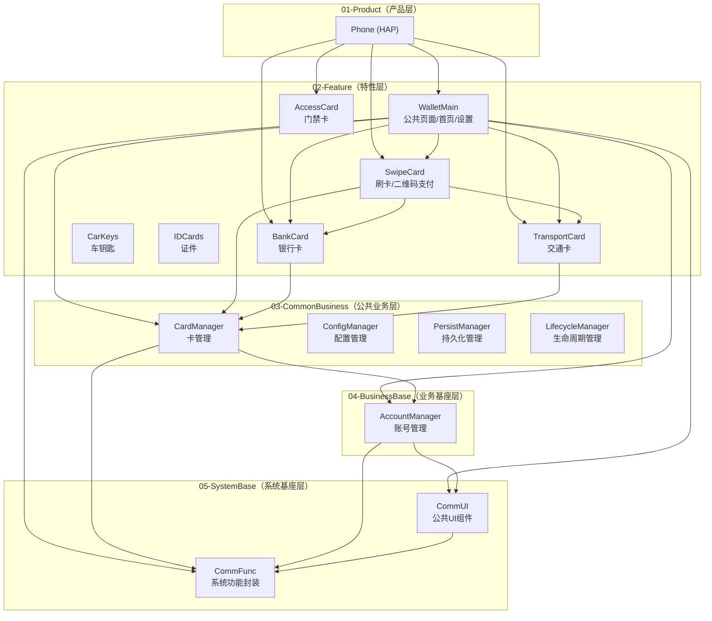

# 模拟华为钱包 — 项目模块架构

> **本文档是项目模块架构的唯一事实来源（Single Source of Truth）。**
> 每次完成需求设计（Skill 2）或编码落地（Skill 3）后，必须同步更新本文档。
> 任何 AI Agent 或 IDE 在进行需求设计、编码、Review 时，都应先读取本文档了解当前架构全貌。

---

## 五层模块架构

本项目采用 **5 层模块架构**，每层包含 1 到多个 Module。依赖方向**只能自上而下**，同层内按各层规则决定是否可互相依赖。模块命名统一采用**大驼峰（PascalCase）**。



> 上图展示了典型的依赖关系示例，非穷举。实际依赖按需添加，但必须遵循下文的依赖规则。

## 物理目录结构

模块按所属层级放置在对应的层目录下，层目录命名采用 `{序号}-{层名}` 格式：

```
SimulatedWalletForHmos/
├── 01-Product/
│   └── Phone/                    (HAP)
├── 02-Feature/
│   └── WalletMain/               (HAR, 按需新增更多)
├── 03-CommonBusiness/             (按需创建)
├── 04-BusinessBase/
│   └── AccountManager/            (HAR)
├── 05-SystemBase/
│   ├── CommFunc/                  (HAR)
│   └── CommUI/                    (HAR)
├── AppScope/
├── build-profile.json5            ← srcPath 引用层目录下的模块
├── oh-package.json5
└── ...
```

`build-profile.json5` 中 `modules[].srcPath` 格式示例：`"./01-Product/Phone"`、`"./02-Feature/WalletMain"`。

---

## 各层职责与依赖规则

### 01-Product（产品层）

| Module | 格式 | 职责 |
|--------|------|------|
| Phone | HAP | 唯一的 HAP 模块，应用主入口。仅包含各 Ability 的入口代码，集成所有 HAR 并打包最终产物 |

**依赖规则**：可依赖所有下层模块。本层不包含业务逻辑和页面 UI。

### 02-Feature（特性层）

特性层内部按依赖关系再分为 **3 个子层级**：

| 子层级 | Module | 职责 | 依赖规则 |
|--------|--------|------|----------|
| 顶层 | WalletMain | 公共页面（首页、设置页等）以及与具体业务无关的功能 | 可依赖 Feature 层其他所有模块 + 所有下层 |
| 中间层 | SwipeCard | 刷卡模块，管理所有卡种的刷卡/二维码支付行为 | 可依赖 Feature 层底层模块 + 所有下层。**不可依赖 WalletMain** |
| 底层 | BankCard, TransportCard, AccessCard, CarKeys, IDCards | 各业务特性模块，按卡种/功能领域划分 | **不可依赖 Feature 层任何模块**，只可依赖所有下层 |

**底层特性模块按需添加**：未来可新增更多模块（如 `MemberCard` 等），但在没有明确需求时不额外创建。

### 03-CommonBusiness（公共业务层）

存放跨 Feature 共享的**业务级**公共能力。

| Module（示例） | 职责 |
|---------------|------|
| CardManager | 卡管理公共能力（卡的增删改查、状态管理等） |
| ConfigManager | 配置管理 |
| PersistManager | 持久化管理 |
| LifecycleManager | 生命周期管理 |
| ...（按需添加） | 其他公共业务能力 |

**依赖规则**：
- 同层模块间**可以互相依赖**，但必须遵循 DAG（有向无环图），**禁止循环依赖**
- 可依赖所有下层模块

### 04-BusinessBase（业务基座层）

存放全应用级别的基础业务能力。

| Module | 职责 |
|--------|------|
| AccountManager | 华为账号管理：登录/登出行为管理、订阅登录状态变化、登录数据发布。封装华为账号登录 Kit API |

**依赖规则**：可依赖 05-SystemBase 层。**不可依赖** 03-CommonBusiness 或 02-Feature。

### 05-SystemBase（系统基座层）

最底层，提供与业务无关的系统级基础能力。

| Module | 职责 |
|--------|------|
| CommFunc | 系统功能封装：log 能力、LiveData 基础能力、状态机、决策树、通用 util 类等 |
| CommUI | 公共 UI 组件：NavDestination 基础页面组件、弹框、Toast、卡片组件、滑动组件等与业务无关的基础组件 |

**依赖规则**：
- CommUI 可依赖 CommFunc（如使用 log、util 等）
- CommFunc 不依赖任何其他模块（最底层）
- **不可依赖**任何上层模块

---

## 模块内部结构（统一四层）

**所有模块**统一采用 shared → data → domain → presentation 四层内部结构。不同层级的模块按实际需要填充对应层，允许省略不需要的层，但已有代码必须放在正确的层。

```
{ModuleName}/src/main/ets/
  shared/         — 共享层：constant/ | utils/ | client/ | components/ | log/ | theme/ 等
  data/           — 数据层：model/ | repository/
  domain/         — 领域层：usecase/ | service/（可选，简单业务可省略）
  presentation/   — 展示层：components/ | pages/
  Index.ets       — HAR 导出入口
```

内部依赖方向：shared ← data ← domain ← presentation（自底向上），**禁止反向依赖**。

### 各层模块的典型填充

| 模块类型 | shared | data | domain | presentation |
|----------|--------|------|--------|-------------|
| Feature（如 WalletMain） | constant/、utils/、client/、基础组件 | model/、repository/ | usecase/（可选） | components/、pages/ |
| BusinessBase（如 AccountManager） | constant/ | model/ | service/ | （通常省略） |
| CommonBusiness | constant/、utils/ | model/ | service/ | （通常省略） |
| CommUI | theme/ | （省略） | （省略） | components/ |
| CommFunc | log/、utils/、livedata/、statemachine/ 等 | （省略） | （省略） | （省略） |

---

## 依赖规则速查表

| 依赖方 ↓ \ 被依赖方 → | 01-Product | 02-Feature | 03-CommonBusiness | 04-BusinessBase | 05-SystemBase |
|----------------------|-----------|-----------|------------------|----------------|--------------|
| **01-Product** | — | ✅ | ✅ | ✅ | ✅ |
| **02-Feature** | ❌ | ⚠️ 按子层级规则 | ✅ | ✅ | ✅ |
| **03-CommonBusiness** | ❌ | ❌ | ⚠️ DAG，禁循环 | ✅ | ✅ |
| **04-BusinessBase** | ❌ | ❌ | ❌ | — | ✅ |
| **05-SystemBase** | ❌ | ❌ | ❌ | ❌ | ⚠️ CommUI→CommFunc 单向 |

---

## 模块清单（当前状态）

| 层 | Module | 格式 | 状态 | 说明 |
|----|--------|------|------|------|
| 01-Product | Phone | HAP | 已创建 | 应用主入口，位于 `01-Product/Phone/`，Tabs + Navigation |
| 02-Feature | WalletMain | HAR | 已创建 | 公共页面：首页/我的/卡包/添卡入口 |
| 02-Feature | SwipeCard | HAR | 未创建（规划中） | 刷卡/二维码支付 |
| 02-Feature | BankCard | HAR | 未创建（规划中） | 银行卡业务 |
| 02-Feature | TransportCard | HAR | 未创建（规划中） | 交通卡业务 |
| 02-Feature | AccessCard | HAR | 未创建（规划中） | 门禁卡业务 |
| 02-Feature | CarKeys | HAR | 未创建（规划中） | 车钥匙业务 |
| 02-Feature | IDCards | HAR | 未创建（规划中） | 证件业务 |
| 03-CommonBusiness | （按需添加） | HAR | — | 卡管理/配置管理/持久化管理等 |
| 04-BusinessBase | AccountManager | HAR | 已创建 | 华为账号登录管理（当前为模拟登录） |
| 05-SystemBase | CommFunc | HAR | 已创建 | 系统功能封装（log、格式化工具等） |
| 05-SystemBase | CommUI | HAR | 已创建 | 公共UI组件（Toast、列表项、卡片容器等） |

**状态说明**：
- `已存在（初始）` — 项目脚手架自带
- `已创建` — 代码已落地，模块已注册到 build-profile.json5
- `已设计` — design.md 已完成，代码未落地
- `未创建（规划中）` — 架构中已规划，但尚未设计和编码，**不代表一定会创建**——按需添加

## 各模块公共能力清单

> 记录已创建模块对外暴露的公共能力，供其他模块复用时查阅。

### 05-SystemBase / CommFunc

| 类别 | 名称 | 文件路径 | 说明 | 引入版本 |
|------|------|----------|------|----------|
| — | — | — | 模块尚未创建 | — |

### 05-SystemBase / CommUI

| 类别 | 名称 | 文件路径 | 说明 | 引入版本 |
|------|------|----------|------|----------|
| — | — | — | 模块尚未创建 | — |

### 04-BusinessBase / AccountManager

| 类别 | 名称 | 文件路径 | 说明 | 引入版本 |
|------|------|----------|------|----------|
| — | — | — | 模块尚未创建 | — |

### 03-CommonBusiness

| Module | 类别 | 名称 | 文件路径 | 说明 | 引入版本 |
|--------|------|------|----------|------|----------|
| — | — | — | — | 暂无模块 | — |

## 功能模块与 PRD/Design 对照

| 功能 | 主要涉及模块 | PRD | Design | 代码 | 说明 |
|------|-------------|-----|--------|------|------|
| 钱包首页 | WalletMain, AccountManager, CommUI, CommFunc | [PRD.md](features/home-page/PRD.md) | [design.md](features/home-page/design.md) | 已落地 | 首页/我的/卡包/添卡入口 |

---

## 变更记录

| 日期 | 变更内容 | 关联 Skill |
|------|----------|-----------|
| 2026-04-08 | 初始创建，确立5层模块架构 | — |
| 2026-04-09 | 新增物理目录结构规范；Phone 标记为"待迁移"；WalletMain/AccountManager/CommFunc/CommUI 标记为"已设计"；关联 home-page design.md | 2-requirement-design |
| 2026-04-09 | 新增"模块内部结构（统一四层）"章节：所有模块统一采用 shared/data/domain/presentation 四层结构，按需填充 | 2-requirement-design |
