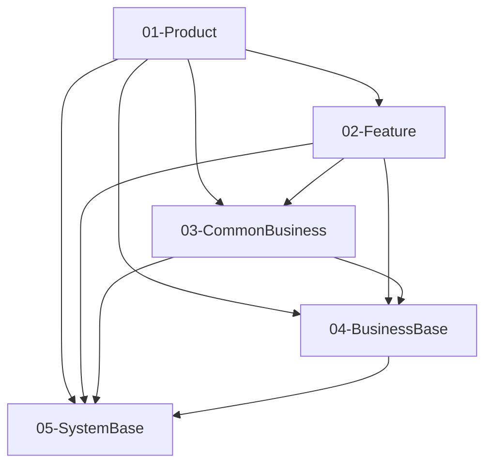

# SimulatedWalletForHmos — 模块与分层架构

> 本文档描述本工程的模块分层与依赖约定，是架构设计的单一事实源之一。  
> **机器可读结构**见工程根目录 [framework.config.json](../framework.config.json) 的 `architecture` 段；修改分层后请同步更新本文与 config。

---

## 生成说明

- 本文档由 **Skill `00-framework-init`** 基于 `framework` 模板首次生成。
- **后续仅架构级变更才更新本文**（`dsl_change` / `module_set_change` / `responsibility_rewrite` 三类，详见下方「变更触发条件」）；feature 级变更（既有模块内新增页面 / 接口 / 数据模型 / 修复）不写入本文，变更历史由 git 与 [doc/features/](features/) 承担。
- 若调整了外层 / 内层 / 出口文件名，必须同步 `framework.config.json` 并通过 harness 相关检查。

### 变更触发条件（写入/修改本文前先对号入座）

| impact 等级 | 触发场景 | 本文需同步的小节 |
|-------------|----------|------------------|
| `dsl_change` | `framework.config.json > architecture` 结构变化（分层 / 依赖边 / 同层策略 / 内层顺序 / 出口约定） | 外层架构 Mermaid、层间依赖表、模块内分层、物理目录 |
| `module_set_change` | 模块集合变化（新增 / 下线 / 迁层） | 业务模块清单增删一行、架构级变更记录 |
| `responsibility_rewrite` | [module-catalog.yaml](module-catalog.yaml) 中某模块 `primary_responsibility` 大幅重写 | 业务模块清单该模块的"一句话职责"、架构级变更记录 |
| `none` | 任何普通 feature 需求 | **不写入本文** |

---

## 外层架构（outer_layers）

依赖方向以 `framework.config.json` → `architecture.outer_layers` 为准：**仅允许声明过的层间依赖**，禁止逆向。

### 层间依赖表（摘录）

| 外层 id | 允许依赖的其它外层（can_depend_on） | 同层策略（intra_layer_deps） |
|---------|--------------------------------------|------------------------------|
| 01-Product | 02-Feature, 03-CommonBusiness, 04-BusinessBase, 05-SystemBase | dag |
| 02-Feature | 03-CommonBusiness, 04-BusinessBase, 05-SystemBase | dag |
| 03-CommonBusiness | 04-BusinessBase, 05-SystemBase | dag |
| 04-BusinessBase | 05-SystemBase | dag |
| 05-SystemBase | （无） | sublayer（CommUI → CommFunc） |

**05-SystemBase 子层**：`CommUI` 可依赖 `CommFunc`；`CommFunc` 不依赖 `CommUI`。成员模块见 `architecture.outer_layers[].sublayers`。

---

## 模块内分层（module_inner_layers）

模块代码目录内部采用以下分层（**数组顺序 = upward 依赖方向**，索引小的可被索引大的 import）：

`shared, data, domain, presentation`

跨模块引用必须通过各模块根目录下、与 `framework.config.json` → `architecture.cross_module_exports_file` 一致的导出入口（默认 **`index.ets`**）导出，禁止深路径 import 到其它模块内部实现。

---

## 物理目录与构建

`build-profile.json5` 中 `modules` 与源码路径对应关系（摘录）：

| 模块名 | srcPath |
|--------|---------|
| Phone | `./01-Product/Phone` |
| WalletMain | `./02-Feature/WalletMain` |
| AccountManager | `./04-BusinessBase/AccountManager` |
| CommUI | `./05-SystemBase/CommUI` |
| CommFunc | `./05-SystemBase/CommFunc` |

---

## 业务模块清单

> 本表仅作架构图的图例，**仅在 `module_set_change` 或 `responsibility_rewrite` 时更新**。
> 模块职责 / 公共能力 / 易混点 / `NOT_responsible_for` 等详情以 [module-catalog.yaml](module-catalog.yaml) 为 SSOT，**不要**在此重复复制。

| 模块名 | 所属外层 | 一句话职责 |
|--------|----------|-----------|
| CommFunc | 05-SystemBase（子层 CommFunc） | 系统侧通用能力：日志封装、脱敏/格式化等无 UI 工具 |
| CommUI | 05-SystemBase（子层 CommUI） | 公共 ArkUI 组件、主题色与 Toast 等可复用 UI 积木；依赖 CommFunc |
| AccountManager | 04-BusinessBase | 账号域：登录态、UserProfile、AccountService 等 |
| WalletMain | 02-Feature | 钱包主 feature：首页/我的/卡包/添卡等页面与路由 |
| Phone | 01-Product | 入口 HAP：PhoneAbility + 根页壳，聚合各 HAR |

---

## 架构级变更记录

> **准入条件**：仅记录 `dsl_change` / `module_set_change` / `responsibility_rewrite` 三类架构级事件。
> **禁入内容**：feature 级变更（页面新增 / 接口新增 / 数据模型扩展 / bug 修复 / 样式调整等）一律不记录，由 git history 与 [doc/features/](features/) 承担。

| 日期 | 影响等级 | 说明 |
|------|----------|------|
| （无） |  |  |
