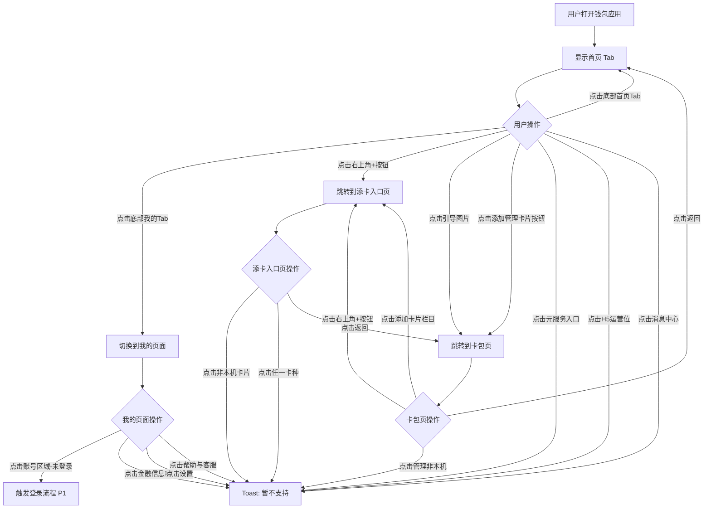
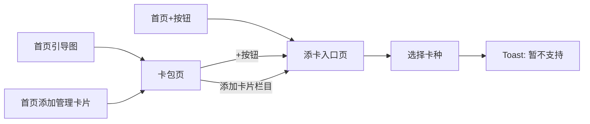

# 钱包首页模块 — 产品需求文档（PRD）

> **模块标识**: `home-page`
> **版本**: v1.0
> **创建日期**: 2026-04-01
> **最后更新**: 2026-04-01
> **状态**: 已确认

---

## 0. 术语映射表

> 第二波改造新增，所有映射以 `doc/glossary.yaml` 和 `doc/module-catalog.yaml` 为权威；
> 本 PRD 为**历史基线回填**，全部条目均已与维护者确认（`[x]`）。

| 原始术语 | 权威模块 | 所属层 | 置信度 | 易混项（必读） | 用户确认 |
|---------|---------|--------|--------|---------------|---------|
| 首页 | WalletMain | 02-Feature | high | — | [x] |
| 我的 | WalletMain | 02-Feature | medium | 账号 (AccountManager) — 我的是 UI Tab 页，账号是登录能力 | [x] |
| 卡包 | WalletMain | 02-Feature | medium | 卡管理 (CardManager) — 卡包是 UI 聚合页面，卡管理是后端 CRUD 能力 | [x] |
| 添卡入口 | WalletMain | 02-Feature | high | — | [x] |
| 设置 | WalletMain | 02-Feature | high | — | [x] |
| 账号 | AccountManager | 04-BusinessBase | medium | 我的 (WalletMain) — 账号是登录能力，我的是 Tab 页 | [x] |
| 登录 | AccountManager | 04-BusinessBase | high | — | [x] |
| Toast / 基础组件 | CommUI | 05-SystemBase | high | — | [x] |
| log / 通用方法 | CommFunc | 05-SystemBase | high | — | [x] |

**回写状态**：本表所用术语均已在 `doc/glossary.yaml` 首批种子中。

---

## 1. 功能概述

钱包首页模块作为模拟华为钱包应用的主入口框架，通过"首页"和"我的"双 Tab 结构承载卡包管理、元服务导航、运营内容展示、账户信息与设置功能，并提供卡包页和添卡入口页的完整无卡态浏览与添卡跳转链路。

---

## Scope 声明

> **本节是 Scope 守门机制的起点。**
> Skill 2（Design）必须继承本节的 `in_scope_modules`；
> Skill 3（Coding）的 git diff 不得越界到本节之外的模块。
> 若开发过程中确实需要扩展，必须发起 **scope 扩展提议**，等待用户明确确认后才能更新本节。

### Scope 模块清单

| 字段 | 取值 | 说明 |
|------|------|------|
| 本需求允许修改的模块 | `Phone`、`WalletMain`、`AccountManager`、`CommUI`、`CommFunc` | 首页主入口框架所需的最小模块集，均为构建首页/我的/卡包/添卡入口页必不可少的基础能力 |
| 本需求明确不修改的模块 | （见下方 `out_of_scope_modules`，仅列出已在 `doc/module-catalog.yaml` 建档的模块） | 沙盒 catalog 目前只建档 5 个模块，其它真实工程存在但沙盒尚未建档的卡种/公共业务模块不列入 out_of_scope_modules——等它们通过 `/catalog-bootstrap` 补档后再回来更新本节 |

### Scope 结构化字段（供 Spec 提取，必填）

```yaml
in_scope_modules:
  - Phone
  - WalletMain
  - AccountManager
  - CommUI
  - CommFunc
# 沙盒 catalog 目前只建档 5 个模块（CommFunc/CommUI/AccountManager/WalletMain/Phone），
# 全部已列入 in_scope_modules，因此本清单为空。
# 真实钱包工程移植后，这里应列出 SwipeCard/BankCard/CardManager 等**已建档但本需求不改**的模块。
# harness scope_matches_catalog 要求本字段所有值必须出现在 doc/module-catalog.yaml:modules[].name 里。
out_of_scope_modules: []
rationale: |
  本需求只构建"首页主入口框架 + 我的 Tab + 卡包页 + 添卡入口页"的浏览态与跳转链路：
  - Phone 提供 HAP 主入口 + Tabs/Navigation 主框架。
  - WalletMain 承载首页 / 我的 / 卡包 / 添卡入口四个公共页面 UI。
  - AccountManager 提供账号登录状态的读取（F7）与登录触发（F17）。
  - CommUI / CommFunc 提供 Toast、基础组件、Log、格式化等与业务无关的系统能力。
  关于 out_of_scope_modules 为空的说明：
  - 真实钱包工程会有 SwipeCard/BankCard/TransportCard/AccessCard/CarKeys/IDCards/CardManager
    /ConfigManager/PersistManager/LifecycleManager 等模块，按最小改动原则都属于"不改"的范畴。
  - 但 harness 的 `scope_matches_catalog` 要求 out_of_scope_modules 里的每个名字都必须已在
    `doc/module-catalog.yaml` 建档，沙盒当前只建档 5 个模块，全部已进 in_scope_modules。
  - 因此沙盒场景下本字段显式保持为空；卡种入口点击"暂不支持"的行为仍成立（由前端 Toast 直接处理，
    不依赖卡种业务模块的代码）。
  未来若新增卡种实际能力或 sandbox catalog 扩容到真实工程规模，再走 scope 扩展提议流程同步本节。
```

### 最小改动原则

1. **默认就地实现**：所有逻辑优先实现在 `in_scope_modules` 列出的最底层模块内。
2. **禁止默默扩展**：若 Skill 2/3 在执行中发现"似乎需要在公共模块新增接口"，**必须停下来先生成 scope 扩展提议**给用户确认，不能直接写入 design.md 或代码。
3. **公共能力优先复用**：能用 `doc/architecture.md > 各模块公共能力清单` 中已有能力解决的，不新增公共接口。

---

## 2. 目标用户与使用场景

### 2.1 目标用户

| 用户角色 | 描述 |
|----------|------|
| 新用户 | 首次打开钱包应用，尚未绑定任何卡片，需要被引导添加第一张卡 |
| 普通用户 | 使用钱包进行日常卡包管理、查看金融信息和使用生活服务的用户 |

### 2.2 使用场景

| 场景编号 | 场景名称 | 场景描述 | 前置条件 |
|----------|----------|----------|----------|
| S1 | 首页浏览 | 用户打开钱包应用，在首页查看卡包引导、元服务入口和运营内容 | 应用已安装 |
| S2 | 添加卡片 | 用户通过首页引导图/添加管理卡片按钮/+按钮进入卡包页，再进入添卡入口页添加卡片 | 已打开应用 |
| S3 | 查看个人信息 | 用户切换到"我的"Tab，查看账号登录状态和金融信息记录 | 已打开应用 |
| S4 | 设置与帮助 | 用户在"我的"页面进入设置或帮助与客服 | 已打开应用 |

---

## 3. 功能清单

| 编号 | 功能名称 | 优先级 | 描述 | 关联场景 |
|------|----------|--------|------|----------|
| F1 | 底部 Tab 导航 | P0 | 底部显示"首页"和"我的"两个 Tab，点击切换对应页面，当前选中 Tab 图标高亮变蓝 | S1, S3 |
| F2 | 首页-顶部添加按钮 | P0 | 首页右上角显示"+"按钮，点击跳转到添卡入口页 | S2 |
| F3 | 首页-无卡引导区 | P0 | 首页上方展示卡片类型引导图片（公交卡/钱包/门禁/证件风格的彩色卡片图），无卡时点击跳转卡包页 | S1, S2 |
| F4 | 首页-添加管理卡片按钮 | P0 | 引导图下方显示"卡包"标题、"集中管理您的卡证票券钥匙"副标题和"添加管理卡片"按钮，点击跳转卡包页 | S2 |
| F5 | 首页-元服务入口区 | P0 | 中部以横向可滑动宫格展示元服务入口（如 Huawei Card、信用卡还款、优惠加油等），带圆点指示器，点击任一入口弹出 Toast"暂不支持" | S1 |
| F6 | 首页-H5运营轮播区 | P0 | 下方"更多服务"标题下展示 H5 运营位轮播图，使用临时占位图片，带圆点指示器可左右滑动，点击弹出 Toast"暂不支持" | S1 |
| F7 | 我的-账号登录状态 | P0 | "我的"页面顶部展示账号信息卡片：未登录时显示"未登录"和默认头像；已登录时显示脱敏邮箱/手机号和头像 | S3 |
| F8 | 我的-金融信息区 | P0 | 中部以列表形式展示金融信息入口，当前包含"银行卡交易记录"和"交通卡退款记录"两项，预留扩展能力，点击弹出 Toast"暂不支持" | S3 |
| F9 | 我的-设置与帮助区 | P0 | 下方列表展示"设置"和"帮助与客服"两个入口，预留扩展能力，点击弹出 Toast"暂不支持" | S4 |
| F10 | 卡包页-整体框架 | P0 | 卡包页顶部显示返回箭头+"卡包"标题+右上角"+"按钮，"+"按钮点击跳转添卡入口页 | S2 |
| F11 | 卡包页-添加卡片栏目 | P0 | 卡包页上方显示"添加卡片"入口，附带说明"银行卡/交通卡/门禁卡等"，点击跳转添卡入口页（效果同右上角+按钮） | S2 |
| F12 | 卡包页-本设备卡片区 | P1 | 卡包页中部为"本设备卡片"区域，无卡时该区域不展示 | S2 |
| F13 | 卡包页-管理非本机入口 | P0 | 卡包页下方显示"管理非本机卡片"入口，点击弹出 Toast"暂不支持" | S2 |
| F14 | 添卡入口页-整体框架 | P0 | 添卡入口页顶部显示返回箭头+"添加卡片"标题 | S2 |
| F15 | 添卡入口页-非本机卡片入口 | P0 | 页面上方显示"非本机卡片"入口，右侧显示数量徽标和箭头，点击效果同卡包页"管理非本机卡片"（Toast"暂不支持"） | S2 |
| F16 | 添卡入口页-卡种添卡列表 | P0 | 下方以列表展示 5 类卡种添卡入口：交通卡、银行卡、门禁卡、车钥匙、证件，每项含图标+卡种名+描述语+箭头，点击弹出 Toast"暂不支持" | S2 |
| F17 | 我的-登录功能 | P1 | 点击未登录状态的账号区域可触发登录流程（具体登录方式由后续 PRD 定义） | S3 |
| F18 | 首页-消息中心入口 | P2 | 元服务区下方显示"欢迎使用钱包消息中心！"通知条目，点击弹出 Toast"暂不支持" | S1 |

---

## 4. 页面/界面描述

### 4.1 页面结构总览

本模块包含 4 个页面，页面间跳转关系如下：

```
┌──────────────────────────────────────────┐
│           主框架 (Tabs 容器)               │
│  ┌─────────────┐  ┌─────────────┐        │
│  │  首页 Tab    │  │  我的 Tab    │        │
│  └──────┬──────┘  └─────────────┘        │
│         │                                 │
│    ┌────┴─────┐                           │
│    │  卡包页   │ ←── 首页引导图/添加按钮    │
│    └────┬─────┘                           │
│         │                                 │
│    ┌────┴──────┐                          │
│    │ 添卡入口页 │ ←── 卡包页+按钮/添加栏目  │
│    └───────────┘                          │
└──────────────────────────────────────────┘
```

### 4.2 页面 A: 首页 Tab

**对应截图**: `1.首页-无卡.jpg`

```
┌─────────────────────────────────────┐
│ 钱包                 🔒  📷  [+]    │  ← 顶部标题栏
├─────────────────────────────────────┤
│  ┌───┐ ┌───┐ ┌───┐ ┌───┐          │
│  │🚌│ │💼│ │🏠│ │🪪│          │  ← 无卡引导图片区
│  └───┘ └───┘ └───┘ └───┘          │
│                                     │
│  卡包                               │
│  集中管理您的卡证票券钥匙             │
│                    [添加管理卡片]     │  ← 卡包引导 + 按钮
├─────────────────────────────────────┤
│  ○Huawei Card  ○信用卡还款  ○优惠加油│
│                 ● ○                 │  ← 元服务入口区（可滑动）
├─────────────────────────────────────┤
│  🔔 欢迎使用钱包消息中心！      >   │  ← 消息中心入口
├─────────────────────────────────────┤
│  更多服务                           │
│  ┌─────────────────────────────┐    │
│  │   📱 H5 运营轮播图           │    │  ← H5 运营轮播区
│  │   数字金融生活新方式          │    │
│  └─────────────────────────────┘    │
│                 ● ○                 │
├─────────────────────────────────────┤
│      [🏠首页]        [👤我的]       │  ← 底部 Tab 栏
└─────────────────────────────────────┘
```

#### 区域 1: 顶部标题栏

| 组件 | 类型 | 内容/数据 | 交互行为 |
|------|------|-----------|----------|
| 页面标题 | Text | "钱包" | 无交互 |
| 添加按钮 | Image (按钮) | "+" 图标，位于最右侧 | 点击跳转添卡入口页 |

> 截图中标题栏左侧还有锁形和扫码图标，本次模拟版不实现，仅保留"+"按钮。

#### 区域 2: 无卡引导图片区

| 组件 | 类型 | 内容/数据 | 交互行为 |
|------|------|-----------|----------|
| 引导图片 | Image | 展示 4 张彩色卡片风格的图片（公交/钱包/门禁/证件图标），模拟钱包效果 | 无卡时整个区域可点击，跳转到卡包页 |

#### 区域 3: 卡包引导 + 添加按钮

| 组件 | 类型 | 内容/数据 | 交互行为 |
|------|------|-----------|----------|
| 标题 | Text | "卡包" | 无交互 |
| 副标题 | Text | "集中管理您的卡证票券钥匙" | 无交互 |
| 添加管理卡片按钮 | Button (圆角边框样式) | "添加管理卡片" | 点击跳转卡包页 |

#### 区域 4: 元服务入口区

| 组件 | 类型 | 内容/数据 | 交互行为 |
|------|------|-----------|----------|
| 服务入口容器 | Swiper | 横向可滑动的元服务图标列表 | 左右滑动翻页 |
| 服务入口项 | Column (图标+文字) | 每项含圆形图标和服务名称 | 点击弹出 Toast"暂不支持" |
| 圆点指示器 | Swiper 指示器 | 蓝色圆点指示当前页 | 随滑动自动切换 |

写死的元服务入口项（参考截图）：

| 序号 | 名称 | 图标 |
|------|------|------|
| 1 | Huawei Card | huawei_card_icon |
| 2 | 信用卡还款 | credit_repay_icon |
| 3 | 优惠加油 | fuel_discount_icon |

> 可根据需要增加更多写死入口，分页展示。

#### 区域 5: 消息中心入口

| 组件 | 类型 | 内容/数据 | 交互行为 |
|------|------|-----------|----------|
| 通知图标 | Image | 铃铛图标 | 无独立交互 |
| 通知文字 | Text | "欢迎使用钱包消息中心！" | 无独立交互 |
| 箭头 | Image | ">" 箭头 | 整行可点击，弹出 Toast"暂不支持" |

#### 区域 6: H5 运营轮播区

| 组件 | 类型 | 内容/数据 | 交互行为 |
|------|------|-----------|----------|
| 区域标题 | Text | "更多服务" | 无交互 |
| 轮播容器 | Swiper | 多张 H5 运营占位图片（本地临时图片） | 自动轮播 + 手动滑动 |
| 运营卡片 | Image + Text | 每张含运营图片、标题文字和描述文字 | 点击弹出 Toast"暂不支持" |
| 圆点指示器 | Swiper 指示器 | 蓝色圆点 | 随滑动切换 |

#### 区域 7: 底部 Tab 栏

| 组件 | 类型 | 内容/数据 | 交互行为 |
|------|------|-----------|----------|
| Tab 容器 | Tabs (BarPosition.End) | 2 个 Tab 项 | 点击切换 |
| 首页 Tab | TabContent | 房屋图标 + "首页" 文字 | 选中态图标蓝色，文字蓝色 |
| 我的 Tab | TabContent | 人物图标 + "我的" 文字 | 选中态图标蓝色，文字蓝色 |

---

### 4.3 页面 B: 我的 Tab

**对应截图**: `2.我的.jpg`

```
┌─────────────────────────────────────┐
│ 我的                                │  ← 顶部标题
├─────────────────────────────────────┤
│  ┌─────────────────────────────┐    │
│  │ 👤  *****6790@**.com        │    │  ← 账号信息卡片
│  └─────────────────────────────┘    │
├─────────────────────────────────────┤
│  💳 银行卡交易记录             >    │
│  🚌 交通卡退款记录             >    │  ← 金融信息区
├─────────────────────────────────────┤
│  ⚙️ 设置                       >    │
│  ❓ 帮助与客服                  >    │  ← 设置与帮助区
├─────────────────────────────────────┤
│      [🏠首页]        [👤我的]       │  ← 底部 Tab 栏（共享）
└─────────────────────────────────────┘
```

#### 区域 1: 顶部标题

| 组件 | 类型 | 内容/数据 | 交互行为 |
|------|------|-----------|----------|
| 页面标题 | Text | "我的" | 无交互 |

> 截图中右上角有邮件图标（带红点），本次模拟版不实现。

#### 区域 2: 账号信息卡片

| 组件 | 类型 | 内容/数据 | 交互行为 |
|------|------|-----------|----------|
| 头像 | Image | 未登录时显示默认灰色头像；已登录时显示用户头像 | 整个卡片可点击，触发登录流程（P1） |
| 账号文字 | Text | 未登录时显示"未登录"；已登录时显示脱敏账号（如"\*\*\*\*\*6790@\*\*.com"） | 同上 |

**页面状态 — 登录前 vs 登录后**:

| 状态 | 头像 | 文字 | 点击行为 |
|------|------|------|----------|
| 未登录 | 默认灰色人形占位图 | "未登录" | 触发登录（P1 实现） |
| 已登录 | 用户头像 | 脱敏后的邮箱或手机号 | 暂无操作 |

#### 区域 3: 金融信息区

| 组件 | 类型 | 内容/数据 | 交互行为 |
|------|------|-----------|----------|
| 列表容器 | List (圆角白色卡片) | 金融信息入口列表 | — |
| 银行卡交易记录 | ListItem | 图标 + "银行卡交易记录" + ">" 箭头 | 点击弹出 Toast"暂不支持" |
| 交通卡退款记录 | ListItem | 图标 + "交通卡退款记录" + ">" 箭头 | 点击弹出 Toast"暂不支持" |

> 截图中还有"华为支付"和"银行电子账户"入口。本次需求仅实现"银行卡交易记录"和"交通卡退款记录"，其他项暂不展示。该区域数据源为数组，支持后续扩展更多入口。

#### 区域 4: 设置与帮助区

| 组件 | 类型 | 内容/数据 | 交互行为 |
|------|------|-----------|----------|
| 列表容器 | List (圆角白色卡片) | 设置相关入口列表 | — |
| 设置 | ListItem | ⚙️ 齿轮图标 + "设置" + ">" 箭头 | 点击弹出 Toast"暂不支持" |
| 帮助与客服 | ListItem | ❓ 问号图标 + "帮助与客服" + ">" 箭头 | 点击弹出 Toast"暂不支持" |

> 该区域数据源为数组，支持后续扩展。截图中文字为"帮助和反馈"，根据用户需求调整为"帮助与客服"。

---

### 4.4 页面 C: 卡包页

**对应截图**: `3.卡包-无卡.jpg`

```
┌─────────────────────────────────────┐
│  < 卡包                        [+]  │  ← 导航栏
├─────────────────────────────────────┤
│  ┌─────────────────────────────┐    │
│  │ ⊕ 添加卡片   银行卡/交通卡…  > │    │  ← 添加卡片栏目
│  └─────────────────────────────┘    │
│  ┌─────────────────────────────┐    │
│  │ 📋 管理非本机卡片           >  │    │  ← 管理非本机入口
│  └─────────────────────────────┘    │
│                                     │
│           （空白区域）               │  ← 无卡时本设备卡片区不展示
│                                     │
└─────────────────────────────────────┘
```

#### 区域 1: 导航栏

| 组件 | 类型 | 内容/数据 | 交互行为 |
|------|------|-----------|----------|
| 返回按钮 | Image (按钮) | "<" 左箭头 | 点击返回上一页（首页） |
| 页面标题 | Text | "卡包" | 无交互 |
| 添加按钮 | Image (按钮) | "+" 图标 | 点击跳转添卡入口页 |

#### 区域 2: 添加卡片栏目

| 组件 | 类型 | 内容/数据 | 交互行为 |
|------|------|-----------|----------|
| 加号图标 | Image | 蓝色圆形"⊕"图标 | 整行可点击 |
| 标题 | Text | "添加卡片" | 整行可点击 |
| 描述 | Text | "银行卡/交通卡/门禁卡等" | 整行可点击 |
| 箭头 | Image | ">" 箭头 | 整行可点击，跳转添卡入口页 |

#### 区域 3: 本设备卡片区（条件展示）

| 状态 | 展示 |
|------|------|
| 无卡 | 整个区域不展示 |
| 有卡 | 展示本设备卡片列表（后续 PRD 定义） |

#### 区域 4: 管理非本机卡片入口

| 组件 | 类型 | 内容/数据 | 交互行为 |
|------|------|-----------|----------|
| 图标 | Image | 卡片管理图标 | 整行可点击 |
| 标题 | Text | "管理非本机卡片" | 整行可点击 |
| 箭头 | Image | ">" 箭头 | 整行可点击，弹出 Toast"暂不支持" |

---

### 4.5 页面 D: 添卡入口页

**对应截图**: `4.添卡入口.jpg`

```
┌─────────────────────────────────────┐
│  < 添加卡片                          │  ← 导航栏
├─────────────────────────────────────┤
│  ┌─────────────────────────────┐    │
│  │ 📋 非本机卡片          (5) > │    │  ← 非本机卡片入口
│  └─────────────────────────────┘    │
│  ┌─────────────────────────────┐    │
│  │ 💳 银行卡      双击电源键…  > │    │
│  │ 🚌 交通卡      一张卡可刷…  > │    │
│  │ 🏠 门禁卡      手机就是门…  > │    │  ← 卡种添卡列表
│  │ 🔑 车钥匙      手机秒变车…  > │    │
│  │ 📄 证件        随时随地查…  > │    │
│  └─────────────────────────────┘    │
│                                     │
└─────────────────────────────────────┘
```

#### 区域 1: 导航栏

| 组件 | 类型 | 内容/数据 | 交互行为 |
|------|------|-----------|----------|
| 返回按钮 | Image (按钮) | "<" 左箭头 | 点击返回上一页（卡包页） |
| 页面标题 | Text | "添加卡片" | 无交互 |

#### 区域 2: 非本机卡片入口

| 组件 | 类型 | 内容/数据 | 交互行为 |
|------|------|-----------|----------|
| 图标 | Image | 蓝色卡片图标 | 整行可点击 |
| 标题 | Text | "非本机卡片" | 整行可点击 |
| 数量徽标 | Text (圆形灰色背景) | 显示非本机卡片数量（模拟写死） | 无独立交互 |
| 箭头 | Image | ">" 箭头 | 整行可点击，弹出 Toast"暂不支持" |

#### 区域 3: 卡种添卡列表

| 组件 | 类型 | 内容/数据 | 交互行为 |
|------|------|-----------|----------|
| 列表容器 | List (圆角白色卡片) | 5 类卡种入口 | — |

各卡种入口项配置：

| 序号 | 卡种名 | 图标颜色 | 描述语 | 点击行为 |
|------|--------|----------|--------|----------|
| 1 | 银行卡 | 橙色卡片图标 | "双击电源键便捷支付" | Toast"暂不支持" |
| 2 | 交通卡 | 蓝色公交图标 | "一张卡可刷全国" | Toast"暂不支持" |
| 3 | 门禁卡 | 绿色房屋图标 | "手机就是门禁卡" | Toast"暂不支持" |
| 4 | 车钥匙 | 绿色钥匙图标 | "手机秒变车钥匙" | Toast"暂不支持" |
| 5 | 证件 | 黄色证件图标 | "随时随地查看证件" | Toast"暂不支持" |

每项布局：左侧彩色圆形图标 + 卡种名文字 + 右侧描述语 + ">" 箭头。

---

### 4.6 各页面状态汇总

| 页面 | 状态 | 描述 | 触发条件 |
|------|------|------|----------|
| 首页 | 默认(无卡) | 展示引导图片、添加管理卡片按钮、元服务、运营轮播 | 用户未绑定任何卡片 |
| 我的 | 未登录 | 账号区显示默认头像+"未登录" | 用户未登录 |
| 我的 | 已登录 | 账号区显示用户头像+脱敏账号信息 | 用户已登录 |
| 卡包 | 无卡 | 仅显示添加卡片栏目和管理非本机入口，本设备卡片区隐藏 | 无已绑定卡片 |
| 添卡入口 | 默认 | 展示非本机卡片入口和 5 类卡种列表 | 始终如此展示 |

---

## 5. 业务流程图

### 5.1 主导航与页面跳转流程



### 5.2 添卡跳转链路



---

## 6. 异常/边界场景处理

| 编号 | 异常场景 | 触发条件 | 处理方式 | 用户提示 |
|------|----------|----------|----------|----------|
| E1 | 网络断开 | 设备无网络连接 | 首页元服务和运营轮播使用本地写死数据，不依赖网络；我的页面金融信息为入口列表无需网络 | 无需额外提示（当前版本数据均为本地） |
| E2 | 卡包为空 | 用户未绑定任何卡片 | 首页展示无卡引导图+添加管理卡片按钮；卡包页隐藏本设备卡片区域 | 通过引导图和按钮引导用户添卡 |
| E3 | 未登录状态 | 用户未登录华为账号 | 我的页面账号区显示"未登录"+默认头像 | 点击账号区域提示登录（P1） |
| E4 | 功能暂不支持 | 点击元服务/H5运营/金融信息/设置等暂未实现功能 | 弹出 Toast 提示后消失 | Toast: "暂不支持" |
| E5 | 页面返回边界 | 在首页 Tab 按返回键 | 退出应用（系统默认行为） | 无 |
| E6 | Tab 重复点击 | 已在首页 Tab 再次点击首页 | 无操作，保持当前状态 | 无 |

---

## 7. 非功能性需求

### 7.1 性能要求

| 指标 | 要求 | 说明 |
|------|------|------|
| 页面首屏加载 | ≤ 1.5 秒 | 从 Ability 启动到首页内容完全可见 |
| Tab 切换响应 | ≤ 300ms | 首页与我的之间切换的响应时间 |
| 页面跳转响应 | ≤ 500ms | 从首页到卡包页/添卡入口页的跳转时间 |
| 轮播滑动帧率 | ≥ 54 FPS | 元服务和 H5 运营轮播的滑动流畅度 |
| 内存占用增量 | ≤ 25 MB | 整个首页模块（含所有4个页面）驻留时的内存增量 |

### 7.2 兼容性要求

| 维度 | 要求 |
|------|------|
| 系统版本 | HarmonyOS 4.0 (API 10) 及以上 |
| 设备类型 | 手机 |
| 屏幕适配 | 支持 360dp ~ 432dp 宽度范围 |
| 深色模式 | 首期不要求，后续可扩展 |

### 7.3 安全性要求

| 要求 | 说明 |
|------|------|
| 账号信息脱敏 | 我的页面登录后显示的账号信息必须脱敏处理（如 \*\*\*\*\*6790@\*\*.com） |
| 无敏感数据存储 | 当前版本所有数据为本地写死，不涉及用户真实数据存储 |

---

## 8. 验收标准

### P0 功能验收标准

- [ ] **AC-1** (F1): 应用启动后显示底部 Tab 栏，包含"首页"和"我的"两个 Tab，点击可切换页面，当前 Tab 图标和文字变为蓝色高亮
- [ ] **AC-2** (F2): 首页右上角显示"+"按钮，点击后跳转到添卡入口页
- [ ] **AC-3** (F3): 首页上方显示无卡引导图片（4 张彩色卡片风格），点击跳转到卡包页
- [ ] **AC-4** (F4): 引导图下方显示"卡包"标题、副标题和"添加管理卡片"按钮，点击按钮跳转到卡包页
- [ ] **AC-5** (F5): 首页中部展示元服务入口区（至少 3 个写死入口），支持左右滑动，点击任一入口弹出 Toast"暂不支持"
- [ ] **AC-6** (F6): 首页下方"更多服务"区域展示 H5 运营轮播图（至少 2 张占位图），支持滑动和自动轮播，点击弹出 Toast"暂不支持"
- [ ] **AC-7** (F7): 我的页面顶部展示账号卡片，未登录时显示默认头像和"未登录"文字
- [ ] **AC-8** (F8): 我的页面中部展示"银行卡交易记录"和"交通卡退款记录"两个列表项，点击弹出 Toast"暂不支持"
- [ ] **AC-9** (F9): 我的页面下方展示"设置"和"帮助与客服"两个列表项，点击弹出 Toast"暂不支持"
- [ ] **AC-10** (F10): 卡包页顶部显示返回箭头、"卡包"标题、右上角"+"按钮，点击返回回到首页，点击"+"跳转添卡入口页
- [ ] **AC-11** (F11): 卡包页显示"添加卡片"栏目，附带"银行卡/交通卡/门禁卡等"描述，点击跳转添卡入口页
- [ ] **AC-12** (F13): 卡包页显示"管理非本机卡片"入口，点击弹出 Toast"暂不支持"
- [ ] **AC-13** (F14): 添卡入口页顶部显示返回箭头和"添加卡片"标题，点击返回回到卡包页
- [ ] **AC-14** (F15): 添卡入口页显示"非本机卡片"入口，带数量徽标和箭头，点击弹出 Toast"暂不支持"
- [ ] **AC-15** (F16): 添卡入口页展示 5 类卡种（银行卡、交通卡、门禁卡、车钥匙、证件），每项含图标、名称、描述语和箭头，点击弹出 Toast"暂不支持"

### P1 功能验收标准

- [ ] **AC-16** (F12): 卡包页无卡时"本设备卡片"区域不展示，页面布局正常
- [ ] **AC-17** (F17): 我的页面点击未登录状态的账号区域可触发登录流程
- [ ] **AC-18** (F7): 我的页面登录后显示脱敏账号信息，头像更新为用户头像

### P2 功能验收标准

- [ ] **AC-19** (F18): 首页元服务区下方显示消息中心入口"欢迎使用钱包消息中心！"，点击弹出 Toast"暂不支持"

### 通用验收标准

- [ ] **AC-G1**: 所有 4 个页面在 HarmonyOS 4.0 及以上设备上正常显示，无布局错乱
- [ ] **AC-G2**: 所有点击交互响应时间 ≤ 300ms，Toast 正常弹出并自动消失
- [ ] **AC-G3**: 页面跳转（首页→卡包→添卡入口）和返回链路完整，无死循环或闪退
- [ ] **AC-G4**: Tab 切换时页面状态保持（如从我的切回首页，首页状态不重置）

---

## 附录

### A. 术语表

| 术语 | 解释 |
|------|------|
| 卡包 | 用户在钱包中管理的各类卡片（银行卡、交通卡、门禁卡等）的集合入口 |
| 元服务 | 华为生态中的轻量化服务，如 Huawei Card、信用卡还款等 |
| 非本机卡片 | 绑定在其他设备上的卡片，可在当前设备上查看和管理 |
| H5 运营位 | 通过 H5 页面承载的运营推广内容区域 |
| Toast | 短暂显示在屏幕中下方的文字提示，几秒后自动消失 |

### B. 参考截图

| 截图文件 | 对应页面 |
|----------|----------|
| `doc/原始需求/1.首页/1.首页-无卡.jpg` | 首页 Tab（无卡状态） |
| `doc/原始需求/1.首页/2.我的.jpg` | 我的 Tab |
| `doc/原始需求/1.首页/3.卡包-无卡.jpg` | 卡包页（无卡状态） |
| `doc/原始需求/1.首页/4.添卡入口.jpg` | 添卡入口页 |

### C. 变更记录

| 日期 | 版本 | 变更内容 | 变更人 |
|------|------|----------|--------|
| 2026-04-01 | v1.0 | 初始版本，基于 4 张华为钱包截图 + 用户文字需求生成 | AI |
