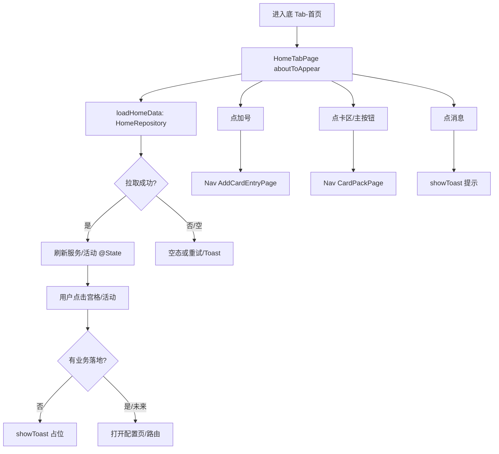

> **模块标识**: `home-page`  
> **版本**: v1.0  
> **创建日期**: 2026-04-22  
> **状态**: 评审中  

# 钱包首页（Home）— 产品需求文档（PRD）

---

## 0. 术语映射表

> 本节是 BLOCKER：原始需求与截图见 `doc/原始需求/1.首页`（多终端路径编码时以资源管理器实际路径为准）。  
> 下列术语已对照 `doc/glossary.yaml`；「用户确认」为 `[x]` 表示本 PRD 定稿时作者已按 SSOT 核对，**若你作为评审方有异议请改表并重新跑 harness。**

| 原始术语 | 权威模块 | 所属层 | 置信度 | 易混项 | 用户确认 |
|----------|----------|--------|--------|--------|----------|
| 首页 | WalletMain | 02-Feature | high | 主应用 (Phone) — 双 Tab 壳与 HAP 入口，非本 Tab 内业务数据 | [x] |
| 钱包主功能 | WalletMain | 02-Feature | high | 主应用 (Phone) — 主 feature 业务编排 vs 产品壳 | [x] |
| 服务宫格 | WalletMain | 02-Feature | high | 公共 UI 组件 (CommUI) — 带业务名状的宫格与卡种入口在 feature | [x] |
| 活动 / 轮播 / 更多服务 | WalletMain | 02-Feature | medium | 主应用 (Phone) / 启屏 — 与壳层、冷启闪屏动效 | [x] |
| 卡包 | WalletMain | 02-Feature | high | 系统功能封装 (CommFunc) — 卡种展示与流程 vs 无界面工具 | [x] |
| 添卡 | WalletMain | 02-Feature | high | 公共 UI 组件 (CommUI) — 无卡种语义的纯按钮/列表行在 CommUI | [x] |
| 底 Tab | Phone | 01-Product | high | 钱包主功能 (WalletMain) — 壳上 Tab 位 vs Tab 内 `HomeTabPage` 内容 | [x] |
| 消息 / 消息中心（首页入口） | WalletMain | 02-Feature | high | 账号管理 (AccountManager) — 会话/Profile 域 API vs 本页仅入口与提示 | [x] |
| Toast / 轻提示 | CommUI | 05-SystemBase | high | 钱包主功能 (WalletMain) — 与界面上下文绑定的短反馈，非 feature 数据 | [x] |
| 主应用 | Phone | 01-Product | high | 钱包主功能 (WalletMain) — 同上「底 Tab」行 | [x] |
| 启屏 | Phone | 01-Product | high | 钱包主功能 (WalletMain) — 与首页内活动/轮播 | [x] |
| 公共 UI 组件 | CommUI | 05-SystemBase | high | 钱包主功能 (WalletMain) — 无业务名状积木在 CommUI | [x] |
| 系统功能封装 | CommFunc | 05-SystemBase | high | 钱包主功能 (WalletMain) — 纯工具/hilog 等无界面能力 | [x] |
| 脱敏 | CommFunc | 05-SystemBase | high | 钱包主功能 (WalletMain) — 工具 API vs 首屏展示 | [x] |
| 账号管理 | AccountManager | 04-BusinessBase | high | 钱包主功能 (WalletMain) — 领域 API 与 Session | [x] |
| 登录 | AccountManager | 04-BusinessBase | high | 钱包主功能 (WalletMain) | [x] |
| 未登录 | AccountManager | 04-BusinessBase | high | 钱包主功能 (WalletMain) | [x] |

**回写约定**：上表为「正文中**出现且命中 glossary 的**术语行」，用于清 harness WARN；不表示本需求改 AccountManager/CommFunc 等模块。若后续评审改名，需同步 `doc/glossary.yaml`。  

---

## 1. 功能概述

在「首页」Tab 为钱包用户提供**卡引导、服务宫格、活动/营销轮播**的可浏览与可跳转能力，与头部「消息 / 添卡」快捷入口，支撑进入卡包、添卡等二级路径；数据与页面编排权威在 `WalletMain`，宿主壳与底 Tab 在 `Phone`（本需求不改）。本工程为**模拟钱包**，不承诺与生产支付/实卡发行业务等效。

---

## 2. Scope 声明

| 字段 | 取值 | 说明 |
|------|------|------|
| 本需求允许修改的模块 | `WalletMain` | 首页子页、卡引导区、服务宫格、活动区及 `HomeRepository` 等本 feature 内读模型与 presentation |
| 本需求明确不修改的模块 | `Phone`、`CommUI`、`CommFunc`、`AccountManager` | 壳/Ability/底 Tab、通用 Toast/主题、纯工具、账号域 API 不扩展；仅**消费**已导出能力（如 `showToast`） |

```yaml
in_scope_modules:
  - WalletMain
out_of_scope_modules:
  - Phone
  - CommUI
  - CommFunc
  - AccountManager
rationale: |
  本需求仅扩展或调整「首页」在 WalletMain 内的页面结构、数据与交互；
  双 Tab 壳、HAP 入口、loadContent、多模块装配属 Phone，不在本需求修改范围。
  活动/服务入口若需使用 Toast，只调用 CommUI 已有 API，不新增公共组件能力至 CommUI。
  账号登录态/Profile 的真理来源在 AccountManager；首页只展示与跳转，不新增账号域逻辑。
  若产品后续要求改底 Tab/Ability，须另开需求并显式扩 scope。
```

```yaml
# Visual Handoff（脚本 harness 读取：须单独 yaml 块，根字段含 ui_change）
ui_change: new_or_changed
visual_handoff:
  kind: repo_assets
  authoritative_refs:
    - id: home_ux_index
      path: doc/features/home-page/ux-reference/README.md
```

### 最小改动原则

1. 优先在 `WalletMain` 的 `HomeTabPage` 及同 feature 的 `presentation` / `data` 中实现。  
2. 复用 `CommUI.showToast`、既有 ArkUI 模式；不复制第二套设计系统。  
3. 需要 `Phone` 改 `pages/index` 或导航契约时，**先**走 scope 扩展，**不**在本 PRD 中假设已批准。  

---

## 3. 目标用户与使用场景

### 3.1 目标用户

| 用户角色 | 描述 |
|----------|------|
| 普通钱包用户 | 已安装本应用、使用双 Tab 主框架进入「首页」查看服务与活动 |
| 产品/设计评审方 | 对照 `doc/原始需求/1.首页` 截图与本 PRD 做走查 |

### 3.2 使用场景

| 场景编号 | 场景名称 | 场景描述 | 前置条件 |
|----------|----------|----------|----------|
| S1 | 浏览首页 | 用户打开 app，在底 Tab 选中「首页」，浏览卡区、服务宫格与活动 | 主入口已由 Phone 完成 loadContent |
| S2 | 去卡包/添卡 | 用户点击卡区或「加号」等入口，进入卡包或添卡 | S1、导航栈可用 |
| S3 | 点宫格/活动 | 用户点击服务项或活动卡，**当前实现**为占位或 Toast | 已加载 `HomeRepository` 数据 |
| S4 | 点消息 | 用户点击消息图标，获得轻量反馈（如 Toast） | 无 |

---

## 4. 功能清单

| 编号 | 功能名称 | 优先级 | 描述 | 关联场景 |
|------|----------|--------|------|----------|
| F1 | 首页信息架构与加载 | P0 | 进入首页 Tab 时拉取/展示 `HomeRepository` 的服务与活动数据，布局不崩溃 | S1 |
| F2 | 卡引导与「添加/管理卡」 | P0 | 展示卡引导区，支持进入卡包；主按钮进入卡包（与现实现一致） | S1, S2 |
| F3 | 顶部：消息与添卡 | P0 | 右侧消息入口反馈可预期；加号进入添卡页 | S2, S4 |
| F4 | 服务宫格 | P1 | 3×1 或等价栅格+Swiper 指示，点击策略与文案符合 PRD/验收 | S3 |
| F5 | 活动/更多服务轮播 | P1 | 轮播标题区 + 可滑动卡片，支持自动轮播与指示器，点击策略可预期 | S3 |
| F6 | 无网/空数据可接受表现 | P1 | 无网或空列表时不白屏死锁，有降级或重试空间（可 Toast） | S1, S3 |

---

## 5. 页面/界面描述

> **版面基线**：以归档原始截图与仓库内 UX 导出（含 `doc/features/home-page/ux-reference/`、`doc/原始需求/1.首页`）为准；与当前实现对齐的差异须记入验收或明示为模拟工程占位。Markdown 插图仅为扫读，非像素真相。

### 5.1 页面总览

- **整体**：全屏 `Column`：上为标题行，下为 `Scroll` 内纵向区块（卡引导 → 服务宫格 → 活动/更多服务）。  
- **底 Tab / 系统状态栏**：由 `Phone` 的根页面提供，不属本页修改范围。  

### 5.2 区域：标题与顶部操作

| 组件 | 类型 | 交互行为 |
|------|------|----------|
| 标题「华为钱包 / home_title」 | 文本 | 无跳转 |
| 消息图标 | Symbol/图标 | 点击触发轻提示（如欢迎/占位文案） |
| 加号 | Symbol/图标 | 点击 `navPathStack` 进 `AddCardEntryPage` |

### 5.3 区域：卡引导与「添加/管理卡」

| 组件 | 类型 | 交互行为 |
|------|------|----------|
| 卡面/引导区（CardImageBanner） | 可点击区 | 点击进入卡包 |
| 「添加/管理卡」主按钮 | 胶囊按钮 | 点击进入卡包（与现实现一致） |

### 5.4 区域：服务宫格

| 组件 | 类型 | 交互行为 |
|------|------|----------|
| 服务图标 + 文案 | 栅格项 | 点击当前为「暂不支持」类 Toast 或产品定义策略 |
| Swiper 指示 | 系统指示器 | 多页时滑动切换（若单页可弱化） |

### 5.5 区域：更多服务 / 活动轮播

| 组件 | 类型 | 交互行为 |
|------|------|----------|
| 区域标题 | 文本 | 无 |
| 活动卡片 | 轮播项 | 自动轮播、指示器、点击为占位/Toast/产品定义 H5 预留 |

### 5.6 页面状态

> 下表为「状态」的组件化描述，满足 harness 的组件表检查。

| 组件 | 类型 | 交互行为 |
|------|------|----------|
| 默认/已载内容 | 布局态 | 展示 Mock/正常数据、可滚动与点击 |
| 加载/占位 | 过渡态 | 首版可与数据同帧到达，不强制全屏 loading |
| 无网/空数据提示 | 反馈 | 空 list + 可选 `showToast`；不阻塞返回 |

| 状态 | 描述 | 触发条件 |
|------|------|----------|
| 默认 | 拉取到 Mock/本地数据后展示 | 网络正常、aboutToAppear 完成 |
| 加载中 | 可优化为不闪屏；首版可与数据同步到齐 | 冷启动快路径 |
| 无网 | 可 Cache 或空态 + Toast | 无网络 |
| 空活动/空服务 | 轮播/宫格隐藏或空态 | Repository 返回空 |

---

## 6. 业务流程图



---

## 7. 异常/边界场景处理

| 编号 | 异常场景 | 触发条件 | 处理方式 |
|------|----------|----------|----------|
| E1 | 网络断开 | 设备无网 | 展示缓存或空态；`showToast` 说明；不保证远程数据 |
| E2 | 服务/活动为空 | Repository 空数组 | 宫格/轮播不展示或展示占位；不崩溃 |
| E3 | 无导航上下文 | 极端拆页导致无 `navPathStack` | 不 push；可 Toast 提示（开发自检） |
| E4 | 未登录/权限 | 本模拟钱包不强制 | 不阻塞首页浏览；真登录策略另需求 |

---

## 8. 非功能性需求

### 8.1 性能

| 指标 | 要求 |
|------|------|
| 首屏可交互 | 冷启进入首页后 **≤ 2 秒** 内可见主布局（与 Mock 数据一致，非生产 SLA） |
| 列表/轮播滑动 | 目标 **≥ 55 FPS** 可感知流畅（鸿蒙真机以实践为准） |

### 8.2 兼容

- HarmonyOS 版本与真机以工程 `build-profile` / 产品要求为准。  
- 双 Tab 宽屏/折叠屏在壳层 `Phone` 处理；本需求在 WalletMain 内用常规宽度约束。  

### 8.3 安全

- 不在首页日志打印完整卡号/明文 PII。  
- 外跳 URL 需产品白名单后实现（本模拟版可仅 Toast）。  

---

## 9. 验收标准

### P0

- [ ] **AC-1** (F1): 在双 Tab 下切到「首页」，`HomeTabPage` 能展示标题区、可滚动主区域，**无**未捕获崩溃。  
- [ ] **AC-2** (F1): `getServiceEntries` 与 `getPromoList` 返回数据后，服务宫格与活动区有可见条目（与 `HomeRepository` 一致，至少各 **1** 条）。  
- [ ] **AC-3** (F2): 点击卡引导区可进入**卡包**页（`CardPackPage` 路由名）。  
- [ ] **AC-4** (F2): 点击「添加/管理卡」可进入**卡包**（与当前实现：与 F3 的跳卡包一致，若产品要改为仅添卡须另开变更）。  
- [ ] **AC-5** (F3): 点击加号进入 **添卡入口** 页（`AddCardEntryPage`）。  
- [ ] **AC-6** (F3, F4): 点击任一会话类消息入口，有**可观察**的 Toast 或等价反馈（不白屏）。  

### P1

- [ ] **AC-7** (F4): 服务宫格为 **3 列 × 1 行** 栅格（可 Swiper 多页），与 `ServiceGridSwiper` 体现一致。  
- [ ] **AC-8** (F5): 活动区有「更多服务」类标题、轮播 **≥ 1** 张卡片、自动轮播开关与 **indicator** 与实现可对应。  
- [ ] **AC-9** (F5): 点击活动卡有**可观察**处理（如 Toast 或占位，与代码策略一致）。  
- [ ] **AC-10** (F6): 飞行模式下进入首页不崩溃，允许空数据 + Toast/降级。  

### 通用

- [ ] **AC-G1** (F1): 在目标 HarmonyOS 设备上**无**布局显著错位。  
- [ ] **AC-G2** (F1): 主要按钮点击在 **300 ms** 内有视觉或导航反馈。  

---

## 附录

### A. 原始需求与截图

- 目录：`doc/原始需求/1.首页`（若仓库路径显示乱码，以本地资源管理器为准）。  
- 覆盖：无卡/有卡、服务与活动等界面，**与**本 PRD 可并行对照。  

### B. 变更记录

| 日期 | 版本 | 变更内容 |
|------|------|----------|
| 2026-04-22 | v1.0 | 首版，基于实现与原始截图目录起稿 |
