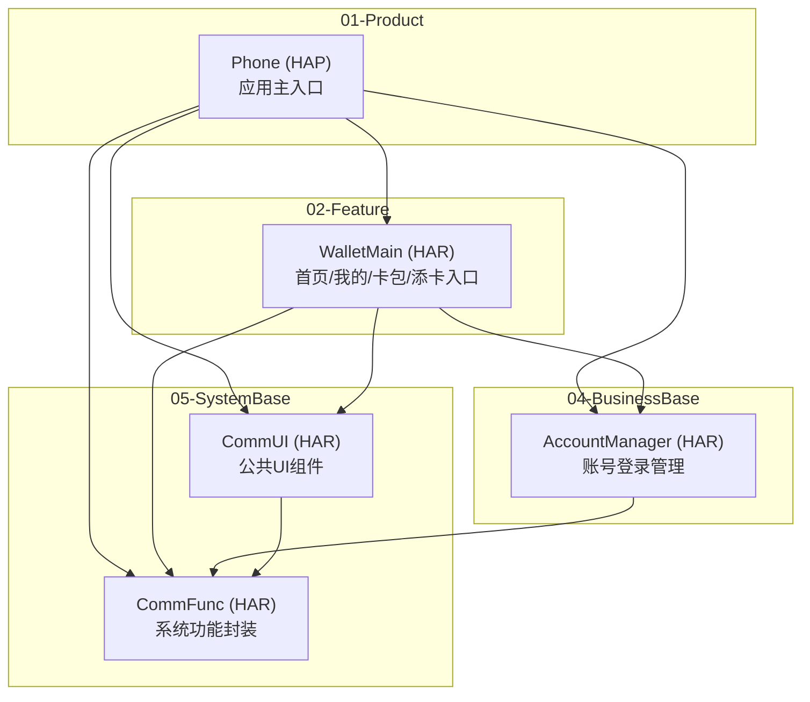
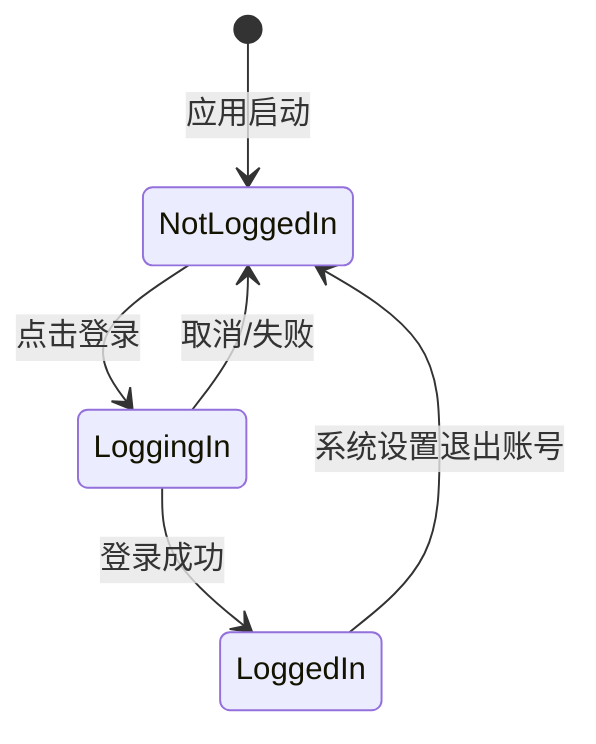
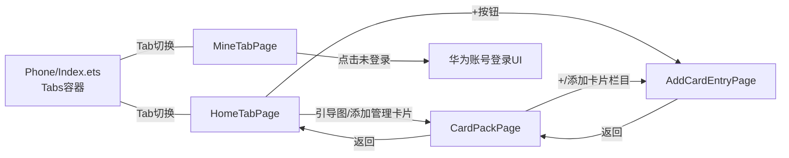

# 钱包首页模块 — 技术设计文档

> **模块标识**: `home-page`
> **对应 PRD**: `doc/features/home-page/PRD.md`
> **版本**: v1.0
> **创建日期**: 2026-04-09
> **最后更新**: 2026-04-09
> **状态**: 草稿

---

## 0. 功能拆分到模块

### 0.1 PRD 功能点 → 模块映射

| PRD 编号 | 功能名称 | 分配模块 | 所属层 | 拆分理由 |
|----------|----------|----------|--------|----------|
| F1 | 底部 Tab 导航 | Phone + WalletMain | 01-Product + 02-Feature | Tabs 框架在 Phone/Index.ets，Tab 内容页由 WalletMain 提供 |
| F2 | 首页-顶部添加按钮 | WalletMain | 02-Feature | 首页 UI 交互 |
| F3 | 首页-无卡引导区 | WalletMain | 02-Feature | 首页 UI 交互 |
| F4 | 首页-添加管理卡片按钮 | WalletMain | 02-Feature | 首页 UI 交互 |
| F5 | 首页-元服务入口区 | WalletMain | 02-Feature | 首页 UI + 模拟数据 |
| F6 | 首页-H5运营轮播区 | WalletMain | 02-Feature | 首页 UI + 模拟数据 |
| F7 | 我的-账号登录状态（UI） | WalletMain | 02-Feature | 我的页面 UI 渲染 |
| F7 | 我的-账号登录状态（能力） | AccountManager | 04-BusinessBase | 华为账号登录/登出/状态订阅 |
| F8 | 我的-金融信息区 | WalletMain | 02-Feature | 我的页面 UI |
| F9 | 我的-设置与帮助区 | WalletMain | 02-Feature | 我的页面 UI |
| F10 | 卡包页-整体框架 | WalletMain | 02-Feature | 公共页面 |
| F11 | 卡包页-添加卡片栏目 | WalletMain | 02-Feature | 公共页面 |
| F12 | 卡包页-本设备卡片区 | WalletMain | 02-Feature | 条件展示（P1） |
| F13 | 卡包页-管理非本机入口 | WalletMain | 02-Feature | 公共页面 |
| F14 | 添卡入口页-整体框架 | WalletMain | 02-Feature | 公共页面 |
| F15 | 添卡入口页-非本机卡片入口 | WalletMain | 02-Feature | 公共页面 |
| F16 | 添卡入口页-卡种添卡列表 | WalletMain | 02-Feature | 公共页面 |
| F17 | 我的-登录功能（P1） | AccountManager | 04-BusinessBase | 拉起华为账号登录 UI |
| F18 | 首页-消息中心入口（P2） | WalletMain | 02-Feature | 内联构建 |
| — | Toast 提示 | CommUI | 05-SystemBase | 与业务无关的基础 UI |
| — | 通用列表项组件 | CommUI | 05-SystemBase | 多处复用 |
| — | 通用卡片容器组件 | CommUI | 05-SystemBase | 多处复用 |
| — | Log 工具 | CommFunc | 05-SystemBase | 基础调试能力 |
| — | 格式化工具 | CommFunc | 05-SystemBase | 账号脱敏等 |

### 0.2 需要创建/修改的模块

| 模块 | 所属层 | 物理目录 | 格式 | 变更类型 |
|------|--------|----------|------|----------|
| Phone | 01-Product | `01-Product/Phone/` | HAP | 迁移 + 修改（从根目录 `phone/` 迁移并重命名） |
| WalletMain | 02-Feature | `02-Feature/WalletMain/` | HAR | 新增 |
| AccountManager | 04-BusinessBase | `04-BusinessBase/AccountManager/` | HAR | 新增 |
| CommUI | 05-SystemBase | `05-SystemBase/CommUI/` | HAR | 新增 |
| CommFunc | 05-SystemBase | `05-SystemBase/CommFunc/` | HAR | 新增 |

### 0.3 不创建的模块

| 模块 | 理由 |
|------|------|
| BankCard / TransportCard / AccessCard / CarKeys / IDCards | PRD 中卡种入口仅展示 Toast，不涉及实际业务 |
| SwipeCard | 无刷卡/二维码支付需求 |
| 03-CommonBusiness 层任何模块 | 无跨 Feature 共享的业务能力需求 |

---

## 1. 模块架构图



### 1.1 模块变更摘要

| Module | 所属层 | 物理路径 | 格式 | 变更类型 | 说明 |
|--------|--------|----------|------|----------|------|
| Phone | 01-Product | `01-Product/Phone/` | HAP | 迁移+修改 | 从 `phone/` 迁移到层级目录，改为 Tabs + Navigation 主框架 |
| WalletMain | 02-Feature | `02-Feature/WalletMain/` | HAR | 新增 | 首页 Tab、我的 Tab、卡包页、添卡入口页 |
| AccountManager | 04-BusinessBase | `04-BusinessBase/AccountManager/` | HAR | 新增 | 华为账号登录/登出、状态订阅、登录数据发布 |
| CommUI | 05-SystemBase | `05-SystemBase/CommUI/` | HAR | 新增 | Toast、通用列表项、通用卡片容器等基础 UI |
| CommFunc | 05-SystemBase | `05-SystemBase/CommFunc/` | HAR | 新增 | Log 工具、格式化工具等基础能力 |

### 1.2 依赖关系

```
Phone (01-Product)
  ├── → WalletMain (02-Feature)
  ├── → AccountManager (04-BusinessBase)
  ├── → CommUI (05-SystemBase)
  └── → CommFunc (05-SystemBase)

WalletMain (02-Feature)
  ├── → AccountManager (04-BusinessBase)
  ├── → CommUI (05-SystemBase)
  └── → CommFunc (05-SystemBase)

AccountManager (04-BusinessBase)
  └── → CommFunc (05-SystemBase)

CommUI (05-SystemBase)
  └── → CommFunc (05-SystemBase)

CommFunc (05-SystemBase)
  └── （无依赖，最底层）
```

---

## 2. 目录/文件结构规划

### 2.0 工程根目录 — 层级目录 + Phone 迁移

现有的 `phone/` 目录迁移到 `01-Product/Phone/`，同时将模块名从小写 `phone` 改为大驼峰 `Phone`。需同步更新 `module.json5` 中的模块名和 `build-profile.json5` 中的 srcPath。

```
SimulatedWalletForHmos/
├── 01-Product/
│   └── Phone/                          ← 原 phone/ 迁移至此
├── 02-Feature/
│   └── WalletMain/                     ← 新建
├── 04-BusinessBase/
│   └── AccountManager/                 ← 新建
├── 05-SystemBase/
│   ├── CommFunc/                       ← 新建
│   └── CommUI/                         ← 新建
├── AppScope/                           ← 不变
├── build-profile.json5                 ← 修改 srcPath
├── oh-package.json5                    ← 修改 dependencies
├── hvigorfile.ts                       ← 不变
└── ...
```

> 03-CommonBusiness 层目录暂不创建（本次无需求），后续按需添加。

### 2.1 Module: CommFunc (05-SystemBase)

```
05-SystemBase/CommFunc/
  src/main/ets/
    shared/
      log/
        Logger.ets                      — 日志工具封装
      utils/
        FormatUtil.ets                  — 格式化工具（账号脱敏等）
    Index.ets                           — HAR 导出入口
  src/main/module.json5
  src/main/resources/
    base/element/
      string.json
  oh-package.json5
  build-profile.json5
  hvigorfile.ts
```

> CommFunc 为纯工具模块，仅使用 shared 层。

### 2.2 Module: CommUI (05-SystemBase)

```
05-SystemBase/CommUI/
  src/main/ets/
    shared/
      theme/
        CommColors.ets                  — 公共颜色常量（可选，配合 color.json）
    presentation/
      components/
        ToastUtil.ets                   — Toast 弹窗工具
        ActionListItem.ets              — 通用可点击列表项（图标+文字+箭头）
        SectionCard.ets                 — 通用圆角白底卡片容器
    Index.ets                           — HAR 导出入口
  src/main/module.json5
  src/main/resources/
    base/element/
      string.json
      color.json                        — 公共颜色资源
      float.json                        — 公共尺寸资源
  oh-package.json5                      — 声明依赖 CommFunc
  build-profile.json5
  hvigorfile.ts
```

> CommUI 使用 shared（主题常量）+ presentation（公共 UI 组件）两层。

### 2.3 Module: AccountManager (04-BusinessBase)

```
04-BusinessBase/AccountManager/
  src/main/ets/
    shared/
      constant/
        AccountConstants.ets            — 账号相关常量
    data/
      model/
        UserProfile.ets                 — 用户账号信息模型
        LoginState.ets                  — 登录状态枚举
    domain/
      service/
        AccountService.ets              — 账号核心服务（登录/登出/订阅状态变化）
    Index.ets                           — HAR 导出入口
  src/main/module.json5
  src/main/resources/
    base/element/
      string.json
  oh-package.json5                      — 声明依赖 CommFunc
  build-profile.json5
  hvigorfile.ts
```

> AccountManager 使用 shared（常量）+ data（模型）+ domain（服务）三层，无 presentation。

### 2.4 Module: WalletMain (02-Feature)

```
02-Feature/WalletMain/
  src/main/ets/
    shared/
      constant/
        HomeConstants.ets               — 首页模块常量
      components/
        CardImageBanner.ets             — 卡片引导图基础组件
    data/
      model/
        ServiceEntry.ets                — 元服务入口数据模型
        PromoInfo.ets                   — 运营轮播数据模型
        FinanceEntry.ets                — 金融信息入口模型
        SettingEntry.ets                — 设置项模型
        CardCategory.ets                — 卡种添卡入口模型
      repository/
        HomeRepository.ets              — 首页数据仓库（元服务+运营）
        MineRepository.ets              — 我的页面数据仓库（金融+设置）
        CardRepository.ets              — 卡包/添卡数据仓库
    presentation/
      components/
        CardGuideSection.ets            — 无卡引导区复杂组件
        ServiceGridSwiper.ets           — 元服务入口 Swiper
        PromoSwiper.ets                 — H5 运营轮播
        AccountCard.ets                 — 账号信息卡片（调用 AccountManager）
        CardCategoryList.ets            — 卡种添卡列表
      pages/
        HomeTabPage.ets                 — 首页 Tab
        MineTabPage.ets                 — 我的 Tab
        CardPackPage.ets                — 卡包页 (NavDestination)
        AddCardEntryPage.ets            — 添卡入口页 (NavDestination)
    Index.ets                           — HAR 导出入口
  src/main/module.json5
  src/main/resources/
    base/
      element/
        string.json                     — 文本资源
        color.json                      — 颜色资源
        float.json                      — 尺寸资源
      media/                            — 图标和图片
      profile/
        main_pages.json                 — 页面注册
        route_map.json                  — 路由表
    zh_CN/element/
      string.json
  oh-package.json5                      — 声明依赖 AccountManager, CommUI, CommFunc
  build-profile.json5
  hvigorfile.ts
```

### 2.5 Module: Phone (01-Product) — 迁移 + 修改

```
01-Product/Phone/
  src/main/ets/
    phoneability/
      PhoneAbility.ets                  — 保留，启动后加载主页面
    phonebackupability/
      PhoneBackupAbility.ets            — 保留
    pages/
      Index.ets                         — 修改：改为 Tabs + Navigation 主框架
  src/main/module.json5                 — 修改：确认模块名
  src/main/resources/
    base/
      element/
        string.json                     — 追加 Tab 文本等
        color.json                      — 追加主题色
      profile/
        main_pages.json                 — 保留
  oh-package.json5                      — 修改：声明依赖 WalletMain 等
  build-profile.json5
  hvigorfile.ts
```

### 2.6 根目录配置变更

#### build-profile.json5

```json5
{
  "modules": [
    { "name": "Phone", "srcPath": "./01-Product/Phone" },
    { "name": "WalletMain", "srcPath": "./02-Feature/WalletMain" },
    { "name": "AccountManager", "srcPath": "./04-BusinessBase/AccountManager" },
    { "name": "CommUI", "srcPath": "./05-SystemBase/CommUI" },
    { "name": "CommFunc", "srcPath": "./05-SystemBase/CommFunc" }
  ]
}
```

> 仅展示 modules 部分，其余字段（app/signing 等）保持不变。

#### oh-package.json5（根目录）

```json5
{
  "dependencies": {
    "@aspect/wallet-main": "file:./02-Feature/WalletMain",
    "@aspect/account-manager": "file:./04-BusinessBase/AccountManager",
    "@aspect/comm-ui": "file:./05-SystemBase/CommUI",
    "@aspect/comm-func": "file:./05-SystemBase/CommFunc"
  }
}
```

#### 各模块 oh-package.json5 依赖声明

| 模块 | dependencies |
|------|-------------|
| Phone | `"@aspect/wallet-main": "file:../02-Feature/WalletMain"`, `"@aspect/account-manager": "file:../04-BusinessBase/AccountManager"`, `"@aspect/comm-ui": "file:../05-SystemBase/CommUI"`, `"@aspect/comm-func": "file:../05-SystemBase/CommFunc"` |
| WalletMain | `"@aspect/account-manager": "file:../../04-BusinessBase/AccountManager"`, `"@aspect/comm-ui": "file:../../05-SystemBase/CommUI"`, `"@aspect/comm-func": "file:../../05-SystemBase/CommFunc"` |
| AccountManager | `"@aspect/comm-func": "file:../../05-SystemBase/CommFunc"` |
| CommUI | `"@aspect/comm-func": "file:../CommFunc"` |
| CommFunc | 无依赖 |

> 包名前缀 `@aspect/` 为约定命名空间，可根据项目需要调整。

---

## 3. 数据模型定义

### 3.1 UserProfile — 用户账号信息

**所在模块**: AccountManager · **文件**: `04-BusinessBase/AccountManager/src/main/ets/data/model/UserProfile.ets`

```typescript
export class UserProfile {
  isLoggedIn: boolean = false
  displayAccount: string = ''
  avatar: Resource | null = null

  constructor(params?: Partial<UserProfile>) {
    if (params) { Object.assign(this, params) }
  }

  get accountText(): string {
    return this.isLoggedIn ? this.displayAccount : '未登录'
  }
}
```

| 字段 | 类型 | 必填 | 默认值 | 说明 |
|------|------|------|--------|------|
| isLoggedIn | boolean | ✅ | false | 登录状态 |
| displayAccount | string | ✅ | '' | 脱敏账号 |
| avatar | Resource \| null | ❌ | null | 头像，null 用默认头像 |

### 3.2 LoginState — 登录状态枚举

**所在模块**: AccountManager · **文件**: `04-BusinessBase/AccountManager/src/main/ets/data/model/LoginState.ets`

```typescript
export enum LoginState {
  NOT_LOGGED_IN = 'not_logged_in',
  LOGGING_IN = 'logging_in',
  LOGGED_IN = 'logged_in',
  LOGIN_FAILED = 'login_failed',
}
```

### 3.3 ServiceEntry — 元服务入口

**所在模块**: WalletMain · **文件**: `02-Feature/WalletMain/src/main/ets/data/model/ServiceEntry.ets`

```typescript
export interface ServiceEntry {
  id: string
  name: string
  icon: Resource
}
```

### 3.4 PromoInfo — 运营轮播

**所在模块**: WalletMain · **文件**: `02-Feature/WalletMain/src/main/ets/data/model/PromoInfo.ets`

```typescript
export interface PromoInfo {
  id: string
  title: string
  description: string
  image: Resource
}
```

### 3.5 FinanceEntry / SettingEntry — 列表入口项

**所在模块**: WalletMain

```typescript
// data/model/FinanceEntry.ets
export interface FinanceEntry {
  id: string
  name: string
  icon: Resource
}

// data/model/SettingEntry.ets
export interface SettingEntry {
  id: string
  name: string
  icon: Resource
}
```

### 3.6 CardCategory — 卡种添卡入口

**所在模块**: WalletMain · **文件**: `02-Feature/WalletMain/src/main/ets/data/model/CardCategory.ets`

```typescript
export interface CardCategory {
  id: string
  name: string
  description: string
  icon: Resource
}
```

---

## 4. 页面组件树

### 4.1 首页 Tab — HomeTabPage

**文件**: `02-Feature/WalletMain/src/main/ets/presentation/pages/HomeTabPage.ets`

```
HomeTabPage
├── CardGuideSection (presentation/components/)
│   └── CardImageBanner (shared/components/)
├── ServiceGridSwiper (presentation/components/)
├── 消息中心入口 (内联构建，P2)
└── PromoSwiper (presentation/components/)
```

| 组件 | 所属模块/层 | Props | 事件回调 | 说明 |
|------|-----------|-------|----------|------|
| CardGuideSection | WalletMain/presentation | — | onGoCardPack, onGoAddCard | 无卡引导区 |
| CardImageBanner | WalletMain/shared | — | onTap | 引导图片 |
| ServiceGridSwiper | WalletMain/presentation | @Prop services: ServiceEntry[] | — | 元服务 Swiper |
| PromoSwiper | WalletMain/presentation | @Prop promos: PromoInfo[] | — | 运营轮播 |

### 4.2 我的 Tab — MineTabPage

**文件**: `02-Feature/WalletMain/src/main/ets/presentation/pages/MineTabPage.ets`

```
MineTabPage
├── AccountCard (presentation/components/)
│   └── 内部调用 AccountManager.AccountService
├── SectionCard (CommUI) — 金融信息
│   └── ActionListItem × N (CommUI)
└── SectionCard (CommUI) — 设置
    └── ActionListItem × N (CommUI)
```

| 组件 | 所属模块/层 | Props | 事件回调 |
|------|-----------|-------|----------|
| AccountCard | WalletMain/presentation | @Prop user: UserProfile | onLoginTap |
| SectionCard | CommUI | — | — |
| ActionListItem | CommUI | @Prop icon: Resource, @Prop title: string | onTap |

### 4.3 卡包页 — CardPackPage

**文件**: `02-Feature/WalletMain/src/main/ets/presentation/pages/CardPackPage.ets`

```
CardPackPage (NavDestination)
├── ActionListItem (CommUI) — "添加卡片"
└── ActionListItem (CommUI) — "管理非本机卡片"
```

### 4.4 添卡入口页 — AddCardEntryPage

**文件**: `02-Feature/WalletMain/src/main/ets/presentation/pages/AddCardEntryPage.ets`

```
AddCardEntryPage (NavDestination)
├── ActionListItem (CommUI) — "非本机卡片"
└── CardCategoryList (presentation/components/)
    └── ActionListItem × 5 (CommUI)
```

---

## 5. 状态管理方案

### 5.1 状态分类

| 数据 | 作用域 | 装饰器/机制 | 持有者 | 所属模块 |
|------|--------|------------|--------|----------|
| 当前 Tab 索引 | Phone 主页面 | @State | Index.ets | Phone |
| 元服务列表 | 首页 Tab | @State | HomeTabPage | WalletMain |
| 运营轮播列表 | 首页 Tab | @State | HomeTabPage | WalletMain |
| 金融信息列表 | 我的 Tab | @State | MineTabPage | WalletMain |
| 设置项列表 | 我的 Tab | @State | MineTabPage | WalletMain |
| 用户登录状态 | 全应用 | AppStorage + 事件订阅 | AccountService | AccountManager |
| 卡种列表 | 添卡入口页 | @State | AddCardEntryPage | WalletMain |
| NavPathStack | 跨页面 | @Provide/@Consume | Index.ets | Phone |

### 5.2 账号状态流转



AccountService 负责：
1. 调用华为账号 Kit API 拉起登录 UI（模拟阶段直接返回写死数据）
2. 监听系统级账号退出事件（`@ohos.account.osAccount` 的 `on('change')`）
3. 通过 AppStorage 将 `LoginState` 和 `UserProfile` 广播给 UI 层

---

## 6. 服务层接口定义

### 6.1 AccountService (04-BusinessBase / AccountManager)

**文件**: `04-BusinessBase/AccountManager/src/main/ets/domain/service/AccountService.ets`

```typescript
export class AccountService {
  async getUserProfile(): Promise<UserProfile>
  async login(): Promise<UserProfile>
  async logout(): Promise<void>
  onLoginStateChanged(callback: (state: LoginState) => void): void
  offLoginStateChanged(callback: (state: LoginState) => void): void
}
```

| 方法 | 入参 | 出参 | 异步 | 说明 |
|------|------|------|------|------|
| getUserProfile | — | Promise\<UserProfile\> | ✅ | 获取当前用户信息 |
| login | — | Promise\<UserProfile\> | ✅ | 拉起华为账号登录 UI（模拟阶段返回写死数据） |
| logout | — | Promise\<void\> | ✅ | 登出清理 |
| onLoginStateChanged | callback | void | ❌ | 订阅状态变更 |
| offLoginStateChanged | callback | void | ❌ | 取消订阅 |

> **华为账号登录开发细节**：
> - 使用 `@kit.AccountKit` 的 `authentication` 模块
> - 调用 `createAuthorizationWithHuaweiIDRequest()` 创建授权请求
> - 通过 `AuthenticationController.executeRequest()` 拉起登录 UI
> - 模拟阶段：`login()` 直接返回模拟 UserProfile，不实际调 API
> - 系统账号变化监听：`@ohos.account.osAccount` 的 `on('change')`

### 6.2 HomeRepository (02-Feature / WalletMain)

**文件**: `02-Feature/WalletMain/src/main/ets/data/repository/HomeRepository.ets`

```typescript
export class HomeRepository {
  async getServiceEntries(): Promise<Array<ServiceEntry>>
  async getPromoList(): Promise<Array<PromoInfo>>
}
```

| 方法 | 出参 | 数据来源 | 说明 |
|------|------|----------|------|
| getServiceEntries | Promise\<Array\<ServiceEntry\>\> | 模拟数据 | 至少 3 项 |
| getPromoList | Promise\<Array\<PromoInfo\>\> | 模拟数据 | 至少 2 项 |

### 6.3 MineRepository (02-Feature / WalletMain)

**文件**: `02-Feature/WalletMain/src/main/ets/data/repository/MineRepository.ets`

```typescript
export class MineRepository {
  async getFinanceEntries(): Promise<Array<FinanceEntry>>
  async getSettingEntries(): Promise<Array<SettingEntry>>
}
```

### 6.4 CardRepository (02-Feature / WalletMain)

**文件**: `02-Feature/WalletMain/src/main/ets/data/repository/CardRepository.ets`

```typescript
export class CardRepository {
  async getCardCategories(): Promise<Array<CardCategory>>
  async getNonLocalCardCount(): Promise<number>
}
```

### 6.5 关于 domain 层

WalletMain 当前业务逻辑简单（各页面数据独立，无跨 Repository 编排），**省略 domain/usecase 层**。AccountCard 直接调用 AccountManager 的 AccountService。

---

## 7. 路由/导航设计

### 7.1 页面跳转关系



### 7.2 Navigation 配置

Phone/Index.ets 使用 `Tabs` + 内嵌 `Navigation` 处理页面跳转。

| 页面 | NavDestination 名称 | 所属模块 | 路由参数 |
|------|---------------------|----------|----------|
| HomeTabPage | 内嵌于 Tabs | WalletMain | — |
| MineTabPage | 内嵌于 Tabs | WalletMain | — |
| CardPackPage | "CardPackPage" | WalletMain | — |
| AddCardEntryPage | "AddCardEntryPage" | WalletMain | — |

### 7.3 NavPathStack 使用

```typescript
// Phone/Index.ets
@Entry
@Component
struct Index {
  @Provide('navPathStack') navPathStack: NavPathStack = new NavPathStack()
  @State currentTabIndex: number = 0

  build() {
    Navigation(this.navPathStack) {
      Tabs({ barPosition: BarPosition.End, index: this.currentTabIndex }) {
        TabContent() { HomeTabPage() }.tabBar(/* 首页 */)
        TabContent() { MineTabPage() }.tabBar(/* 我的 */)
      }
    }
    .navDestination(/* 注册 CardPackPage、AddCardEntryPage */)
  }
}
```

### 7.4 路由注册

| 配置文件 | 变更 |
|----------|------|
| `02-Feature/WalletMain/src/main/resources/base/profile/main_pages.json` | 注册 4 个页面 |
| `02-Feature/WalletMain/src/main/resources/base/profile/route_map.json` | CardPackPage、AddCardEntryPage 路由映射 |

---

## 8. PRD 功能映射表

| PRD 编号 | 功能名称 | 优先级 | 所属层 | 实现模块 | 模块内层级 | 关键文件 | 实现说明 |
|----------|----------|--------|--------|----------|-----------|----------|----------|
| F1 | 底部 Tab 导航 | P0 | 01-Product | Phone | pages | Index.ets | Tabs + BarPosition.End |
| F2 | 首页-顶部添加按钮 | P0 | 02-Feature | WalletMain | presentation | HomeTabPage.ets | 标题栏右侧"+"按钮 |
| F3 | 首页-无卡引导区 | P0 | 02-Feature | WalletMain | presentation | CardGuideSection.ets, CardImageBanner.ets | 点击跳转卡包 |
| F4 | 首页-添加管理卡片按钮 | P0 | 02-Feature | WalletMain | presentation | CardGuideSection.ets | 按钮跳转卡包 |
| F5 | 首页-元服务入口区 | P0 | 02-Feature | WalletMain | pres+data | ServiceGridSwiper.ets, HomeRepository.ets | Swiper+模拟数据 |
| F6 | 首页-H5运营轮播区 | P0 | 02-Feature | WalletMain | pres+data | PromoSwiper.ets, HomeRepository.ets | 自动轮播 |
| F7(UI) | 我的-账号登录状态 | P0 | 02-Feature | WalletMain | presentation | AccountCard.ets | 条件渲染 |
| F7(能力) | 我的-账号登录状态 | P0 | 04-BusinessBase | AccountManager | domain/service | AccountService.ets | 登录状态+订阅 |
| F8 | 我的-金融信息区 | P0 | 02+05 | WalletMain+CommUI | presentation | MineTabPage.ets, ActionListItem.ets | CommUI 列表项 |
| F9 | 我的-设置与帮助区 | P0 | 02+05 | WalletMain+CommUI | presentation | MineTabPage.ets, ActionListItem.ets | CommUI 列表项 |
| F10 | 卡包页-整体框架 | P0 | 02-Feature | WalletMain | presentation | CardPackPage.ets | NavDestination |
| F11 | 卡包页-添加卡片栏目 | P0 | 02+05 | WalletMain+CommUI | presentation | CardPackPage.ets, ActionListItem.ets | 跳转添卡入口 |
| F12 | 卡包页-本设备卡片区 | P1 | 02-Feature | WalletMain | presentation | CardPackPage.ets | 条件渲染 |
| F13 | 卡包页-管理非本机入口 | P0 | 02+05 | WalletMain+CommUI | presentation | CardPackPage.ets | Toast |
| F14 | 添卡入口页-整体框架 | P0 | 02-Feature | WalletMain | presentation | AddCardEntryPage.ets | NavDestination |
| F15 | 添卡入口页-非本机入口 | P0 | 02-Feature | WalletMain | pres+data | AddCardEntryPage.ets, CardRepository.ets | 数量徽标 |
| F16 | 添卡入口页-卡种列表 | P0 | 02-Feature | WalletMain | pres+data | CardCategoryList.ets, CardRepository.ets | 5 类卡种 |
| F17 | 我的-登录功能 | P1 | 04-BusinessBase | AccountManager | domain/service | AccountService.ets | 华为账号 Kit |
| F18 | 首页-消息中心入口 | P2 | 02-Feature | WalletMain | presentation | HomeTabPage.ets | 内联+Toast |

**覆盖率检查**：
- P0 功能映射覆盖率: 15/15 = 100% ✅
- P1 功能映射覆盖率: 2/2 = 100% ✅
- P2 功能: 1 项，已标注方案

---

## 附录

### A. 资源文件规划

#### CommUI — 公共颜色

| 资源 Key | 色值 | 说明 |
|----------|------|------|
| comm_primary_blue | #0A59F7 | 主题色 / Tab 选中态 |
| comm_text_primary | #182431 | 主要文字 |
| comm_text_secondary | #99182431 | 次要文字 |
| comm_bg_page | #F1F3F5 | 页面背景 |
| comm_bg_card | #FFFFFF | 卡片背景 |
| comm_tab_unselected | #99182431 | Tab 未选中 |

#### WalletMain — 文本

| 资源 Key | 中文值 | 使用位置 |
|----------|--------|----------|
| tab_home | "首页" | 底部 Tab |
| tab_mine | "我的" | 底部 Tab |
| home_title | "钱包" | 首页标题 |
| mine_title | "我的" | 我的标题 |
| card_pack_title | "卡包" | 卡包页标题 |
| add_card_title | "添加卡片" | 添卡入口页标题 |
| card_guide_subtitle | "集中管理您的卡证票券钥匙" | 首页引导 |
| add_manage_cards | "添加管理卡片" | 首页按钮 |
| more_services | "更多服务" | 运营区标题 |
| not_supported | "暂不支持" | Toast |
| not_logged_in | "未登录" | 我的页面 |
| add_card_desc | "银行卡/交通卡/门禁卡等" | 卡包页 |
| manage_non_local | "管理非本机卡片" | 卡包页 |
| non_local_cards | "非本机卡片" | 添卡入口页 |
| msg_center_welcome | "欢迎使用钱包消息中心！" | 消息入口 |

### B. Phone 模块迁移检查清单

`phone/` → `01-Product/Phone/` 迁移时需确认：

| 检查项 | 说明 |
|--------|------|
| `build-profile.json5` srcPath | 改为 `"./01-Product/Phone"` |
| `01-Product/Phone/src/main/module.json5` | 确认 `name` 字段与 build-profile 一致 |
| `01-Product/Phone/oh-package.json5` | name 改为 `Phone`，添加 HAR 依赖 |
| AppScope/app.json5 | 确认 bundleName 不受影响（它引用的是 module name，不是路径） |
| hvigor 构建 | 迁移后执行一次完整构建验证 |
| `.gitignore` | 确认 build/oh_modules 等忽略规则仍有效 |

### C. 设计决策记录

| 编号 | 决策点 | 可选方案 | 选定方案 | 理由 |
|------|--------|----------|----------|------|
| D1 | 账号管理放哪个模块 | A: WalletMain 内部 / B: 独立 AccountManager | B | 全应用级基础能力，系统退出账号需全局响应 |
| D2 | Toast 组件放哪个模块 | A: WalletMain/shared / B: CommUI | B | 与业务无关，未来所有模块都会用 |
| D3 | 是否需要 domain 层 | A: 有 UseCase / B: 无 | B | 当前无跨 Repository 编排需求 |
| D4 | 是否创建卡种 Feature 模块 | A: 创建 / B: 不创建 | B | PRD 卡种入口仅 Toast，按需添加原则 |
| D5 | 层级目录结构 | A: 扁平放根目录 / B: 按层级建子目录 | B | 物理目录反映架构层级，结构清晰 |

### D. 变更记录

| 日期 | 版本 | 变更内容 | 变更人 |
|------|------|----------|--------|
| 2026-04-09 | v1.0 | 初始版本，基于 home-page PRD v1.0 + 五层架构设计 | AI |
