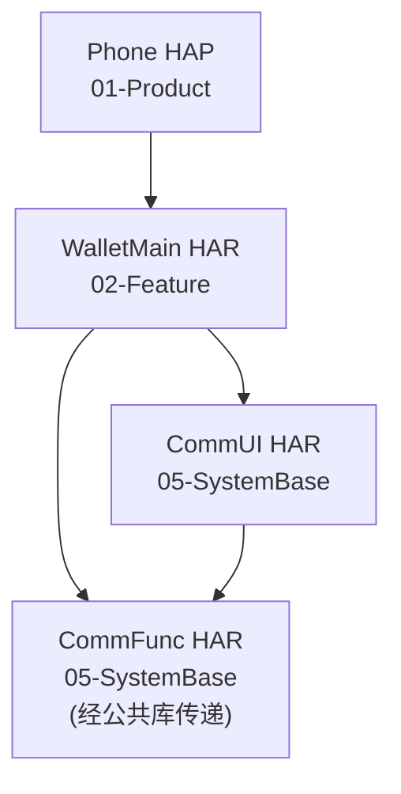
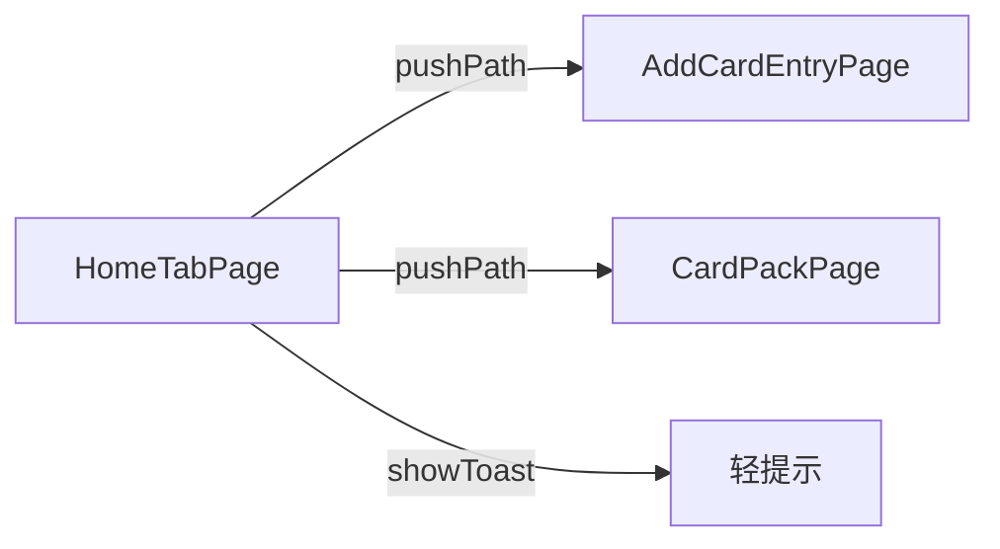

> **模块标识**: `home-page`  
> **对应 PRD**: `doc/features/home-page/PRD.md`  
> **版本**: v1.1  
> **创建日期**: 2026-04-22  
> **状态**: 已确认  

# 钱包首页（Home）— 技术设计

---

## Scope 声明与继承

本设计继承 PRD `in_scope_modules` / `out_of_scope_modules`，未扩大至 `Phone`、`CommUI`、`CommFunc`、`AccountManager` 的代码修改；其中 **CommUI** 的 `showToast` 与 **Phone** 提供的 `navPathStack` 仅作为已存在能力被 **消费**，不属本需求改动范围。

### Scope 结构化字段（供 Harness 校验）

```yaml
inherited_from_prd: true
in_scope_modules:
  - WalletMain
out_of_scope_modules:
  - Phone
  - CommUI
  - CommFunc
  - AccountManager
rationale: |
  首页信息架构、卡引导、服务宫格、活动轮播与 HomeRepository 读模型均在 WalletMain 内实现；
  双 Tab 壳与 NavDestination 注册由 Phone 持有，本设计不修改 Phone 源码。
  Toast 仅调用 CommUI 已导出 API；账号域逻辑由 AccountManager 持有，首页不扩展。
expansions_with_user_approval: []
```

### 架构影响声明 (architecture_impact)

> 本功能仅在既有模块 `WalletMain` 内落地（新增首页页面/组件/读模型），不改变模块集合、分层、依赖边或任一模块的 `primary_responsibility`，属于典型 feature 级变更，`impact = none`，不写入 `doc/architecture.md`。

```yaml
architecture_impact:
  impact: none
  affected_items: []
  architecture_md_updates: []
  catalog_updates: []
```

---

## 模块架构图

WalletMain 依赖系统基座的 CommUI（Toast）与 CommFunc 隐式经 CommUI；数据在 feature 内由 `HomeRepository` 提供模拟数据。Phone 装配 `Navigation` 与 `navPathStack`，首页子页通过 `@Consume('navPathStack')` 入栈到 `CardPackPage` / `AddCardEntryPage`。



### 模块变更摘要

| 模块 | 所属层 | 物理路径 | 格式 | 变更类型 |
|------|--------|----------|------|----------|
| WalletMain | 02-Feature | `02-Feature/WalletMain` | HAR | 修改 |

---

## 目录/文件结构规划

本需求主要落在 `WalletMain` 既有首页链路；不新增模块与不新增 HAR。

### WalletMain

```text
02-Feature/WalletMain/
└── src/main/ets/
    ├── index.ets
    ├── data/
    │   ├── model/
    │   │   ├── PromoInfo.ets
    │   │   └── ServiceEntry.ets
    │   └── repository/
    │       └── HomeRepository.ets
    ├── presentation/
    │   ├── pages/
    │   │   └── HomeTabPage.ets
    │   └── components/
    │       ├── CardGuideSection.ets
    │       ├── PromoSwiper.ets
    │       └── ServiceGridSwiper.ets
    └── shared/
        ├── components/
        │   └── CardImageBanner.ets
        └── constant/
            └── HomeConstants.ets
```

**完整路径索引（与「PRD 功能映射表 — 关键文件」一致，供追溯校验）**：

- `02-Feature/WalletMain/src/main/ets/presentation/pages/HomeTabPage.ets`
- `02-Feature/WalletMain/src/main/ets/data/repository/HomeRepository.ets`
- `02-Feature/WalletMain/src/main/ets/presentation/components/CardGuideSection.ets`
- `02-Feature/WalletMain/src/main/ets/presentation/components/ServiceGridSwiper.ets`
- `02-Feature/WalletMain/src/main/ets/presentation/components/PromoSwiper.ets`
- `02-Feature/WalletMain/src/main/ets/shared/components/CardImageBanner.ets`

**说明**：`HomeTabPage` 为首页 Tab 根组件；`CardGuideSection` / `ServiceGridSwiper` / `PromoSwiper` 为首页纵向区块；`HomeRepository` 提供 `ServiceEntry` / `PromoInfo` 列表；`CardImageBanner` 为卡引导区卡面展示。

---

## 数据模型定义

下列类型与 `02-Feature/WalletMain` 内实现一致，字段类型均为 ArkTS 合法类型（含 `Resource` 系统类型）。

```typescript
/** 服务宫格单项 */
export interface ServiceEntry {
  /** 稳定键，用于 ForEach */
  id: string;
  /** 展示名称（`string.json`，`Text` 可直接绑 `Resource`） */
  name: Resource;
  /** 宫格图标资源 */
  icon: Resource;
}

/** 活动/更多服务轮播卡片 */
export interface PromoInfo {
  id: string;
  title: Resource;
  description: Resource;
  image: Resource;
}
```

---

## 页面组件树

### HomeTabPage（钱包首页 Tab）

```text
HomeTabPage
├─ Row（标题栏：标题 + 消息 + 加号）
├─ Scroll
│  └─ Column
│     ├─ CardGuideSection
│     │  ├─ CardImageBanner
│     │  └─ Button「添加/管理卡」
│     ├─ ServiceGridSwiper
│     └─ PromoSwiper
```

---

## 状态管理方案

| 数据 | 作用域 | 装饰器 / 机制 | 持有者 |
|------|--------|----------------|--------|
| `navPathStack` | 自 Phone 根页面向下注入 | `@Provide` / `@Consume` | `Phone` 根 `pages/index` 提供；`HomeTabPage` 消费 |
| 服务宫格列表 `services` | 首页 Tab 内 | `@State` | `HomeTabPage` |
| 活动轮播列表 `promos` | 首页 Tab 内 | `@State` | `HomeTabPage` |
| `ServiceEntry[]` / `PromoInfo[]` 子项展示 | 子组件只读 | `@Prop` 传入 | `ServiceGridSwiper` / `PromoSwiper` |

---

## 服务层接口定义

首页无独立 domain 用例；读模型由 `data/repository/HomeRepository` 直接暴露。方法签名为真实 ArkTS/异步约定（实现可为 `async` 方法返回 `Promise`）。

```typescript
export class HomeRepository {
  getServiceEntries(): Promise<ServiceEntry[]>
  getPromoList(): Promise<PromoInfo[]>
}
```

**数据来源**：当前为模块内模拟列表；失败与空表策略由 presentation 在 `loadHomeData` 中处理（不阻塞布局，可配合 Toast）。

---

## 路由/导航设计

宿主在 `01-Product/Phone` 的 `Navigation` + `navDestination` 中注册 `CardPackPage`、`AddCardEntryPage` 名称。首页内仅通过**路由名**与 `NavPathStack.pushPath` 一致。

| 来源 UI | 动作 | 路由名 | 目标说明 |
|---------|------|--------|----------|
| 消息图标 | `onClick` | — | 仅 `showToast`，不压栈 |
| 加号 | `onClick` | `AddCardEntryPage` | 添卡入口 |
| 卡面 / 主按钮 | 回调 | `CardPackPage` | 与 PRD「卡包」一致 |
| 宫格项 / 活动卡 | 占位策略 | — | 当前为 Toast 等可观察反馈，与 PRD 一致 |



---

## Visual Handoff 与版面真源

本设计与 PRD 中 **Visual Handoff** 机器可读块一致：`ui_change: new_or_changed`，`visual_handoff.kind: repo_assets`。

| 项 | 说明 |
|----|------|
| **权威索引（`id: home_ux_index`）** | `doc/features/home-page/ux-reference/README.md`：仓库内版面与导出路径的索引；后续产品可在该 README 中增补 `authoritative_refs` 子路径。 |
| **补充走查** | `doc/原始需求/1.首页`（与 PRD 附录 A 一致）；与当前实现对齐的差异须在验收或 README 中明示为模拟工程占位。 |

**相对真源的允许偏差**：

- Mock 数据、占位卡图、未入库高清导出：**允许**，直至资产落入 `ux-reference/` 或 PRD 更新引用。  
- 服务条数、活动条数与截图不完全一致：**允许**，以不崩溃、`AC-2`/`AC-7`/`AC-8` 语义满足为准。  
- **禁止**仅以 PRD Markdown 内嵌缩略图作为唯一像素真源（与 PRD §5 一致）。

**契约下沉**：可测的资源 key、栅格列数、轮播行为等见本 feature `contracts.yaml` 中 `visual_parity_contract`。

---

## PRD 功能映射表

| PRD 编号 | 功能名称 | 优先级 | 实现模块 | 关键文件 |
|----------|----------|--------|----------|----------|
| F1 | 首页信息架构与加载 | P0 | WalletMain | `02-Feature/WalletMain/src/main/ets/presentation/pages/HomeTabPage.ets`, `02-Feature/WalletMain/src/main/ets/data/repository/HomeRepository.ets` |
| F2 | 卡引导与「添加/管理卡」 | P0 | WalletMain | `02-Feature/WalletMain/src/main/ets/presentation/components/CardGuideSection.ets`, `02-Feature/WalletMain/src/main/ets/shared/components/CardImageBanner.ets` |
| F3 | 顶部：消息与添卡 | P0 | WalletMain | `02-Feature/WalletMain/src/main/ets/presentation/pages/HomeTabPage.ets` |
| F4 | 服务宫格 | P1 | WalletMain | `02-Feature/WalletMain/src/main/ets/presentation/components/ServiceGridSwiper.ets` |
| F5 | 活动/更多服务轮播 | P1 | WalletMain | `02-Feature/WalletMain/src/main/ets/presentation/components/PromoSwiper.ets` |
| F6 | 无网/空数据可接受表现 | P1 | WalletMain | `02-Feature/WalletMain/src/main/ets/presentation/pages/HomeTabPage.ets`, `02-Feature/WalletMain/src/main/ets/data/repository/HomeRepository.ets` |

---

## 设计备注（与实现基线一致）

- **Visual Handoff**：版面真源与可测项见上文「Visual Handoff 与版面真源」及 `contracts.yaml` 的 `visual_handoff` / `visual_parity_contract`。  
- **卡区与主按钮**：`CardGuideSection` 中卡面与「添加/管理卡」主按钮均回调 **卡包**（`CardPackPage`），与 PRD AC-3/AC-4 及当前代码一致。  
- **加号**：标题栏加号进入 `AddCardEntryPage`（与 PRD AC-5 一致）。  
- **F6**：无网场景若仍为本地 Mock 数据，以不崩溃、可扩展 Toast/空态分支为满足；具体网络探测若后续产品要求再迭代。
