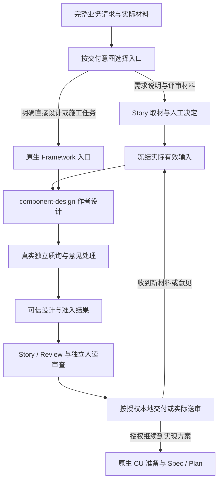

# 2.0.1 优化总览与裁定

状态：**维护设计者提出，待用户审核；未实施。** 本目录承接 2.0.0 实跑暴露的未闭环职责，不表示 2.0.0 已发布。版本名暂按用户允许的 2.0.1 组织评测与优化，正式发布版本另由用户决定。2.0.0 文档与历史记录保留，不继续往旧分册叠加互相覆盖的条款。

必读：[本轮分析](00-返修与双Case实跑分析.md)、根 `AGENTS.md`、`test/TEST.md`、2.0.0 总览及对应实施分册。发生冲突时，本方案经用户批准后仅替换下表列出的职责，其余既有合同继续有效。

## 1. 目标与保留能力

目标是正常业务请求完整到达消费模型，进入正确入口，形成来源真实、经过实际质询的蓝图，再交付可读、可追溯的 Story/Review；需要实现方案时交原生 CU/Spec/Plan；update 使用实际有效输入闭合。

保留：两层一桥、三类知识、开发源与 demo 隔离、原生 manifest/materialize、材料/会议/图片导入、人签、冻结输入、蓝图单一权威、零 CU 成文、直接 Framework 入口、章节提交与人工区保护、原生审查与授权边界。**不恢复 Spec 附属 Story，不另造 Extension 阶段调度或独立 verifier。**

| 失效职责 | 正确承担者 | 退出内容 |
|---|---|---|
| CLI 请求无损送达 | 维护 CLI 的原生进程启动 | CMD 直接传多行 prompt、靠单行化规避 |
| 业务意图入口发现 | Framework 物化保留 Skill 用途；Extension 清楚声明职责 | 泛化成“实例 Skill 名称”的描述；拟议 Spec hook 强转 Story |
| 设计作者/质询分工 | 原生 component-design；扩展要求随任务送达 | 作者自己填写“独立完成”、通过 provider 字符串充当调用证据 |
| 接口与知识权威 | 原始来源 + 有据设计决定 + canonical | 推断标 SE 权威、无真实范围调整的 future 缺口迁移 |
| 人读精确设计 | canonical 设计内容 + 定向投影 | Story 中另写精确设计、递归对象摊平作为人读正文 |
| 当前成文依据 | 现有 flow.input / story_basis / 冻结版本 | 采用新材料却登记旧输入摘要 |
| 审查报告 | 原生独立产物 request/check 与真实原件 | 无关 JSON 引用、改业务结论迎合报告解析 |
| 测试完成与证据 | Case 唯一终点 + 实际业务结果 | 送审前截停却称送审完成、未执行 update 的回流后缀 |

## 2. 正常路径

图中每个节点均用全称，不使用未定义字母。直接原生维护任务按 Framework 自身路由，图不强制其创建 Story 或新蓝图。未满足当前设计前提时停在对应来源/设计责任，可交明确标注未决的评审草稿，不能冒充准入完成。

## 3. 四个工作包与开工条件

| 包 | 文件 | 交回结果 | 依赖 |
|---|---|---|---|
| P1 输入与业务入口 | [02](02-输入入口与测试终点.md) | 无损传输、真实用途可见、Case 业务终点一致 | 本地传输可先做；自然入口完整验收需 U2 |
| P2 真实设计与知识责任 | [03](03-真实设计与知识承接.md) | 来源忠实、真实独立质询、知识落入 canonical | 当前原生正常质询先核；需要的上游调整按 U3 合同交付 |
| P3 人读交付与更新依据 | [04](04-成文审查与更新依据.md) | 可读投影、正确来源更新、真实审查报告 | P2 的权威输入；审查正式验收需 U1 |
| P4 联合验证 | [05](05-验证交接与退出核对.md) | 离线证据、授权双 Case 实跑、比较及评分 | P1–P3 定向验收，用户授权 CLI |

U1/U2/U3 的含义、证据和退出条件只在 [Framework 报告](06-Framework协作问题报告.md) 定义；它们不是现成的新接口名。实施者不修改 vendored Framework，不复制上游能力到 Extension。明确上游缺陷不意味着所有本仓工作都停；本地输入、更新、投影可先收敛。**现版不能仅靠再跑 CLI 就宣告已知审查缺陷不阻塞。**

## 4. 预算与审批边界

按根 AGENTS §5 唯一口径。当前交回累计新增 4,439、退出 4,740，原基线 13,993，当前总量 13,692，初始新增预算 3,100，R=143.2%。这些是本轮交回计量，执行开始时须用现有计量器复核。测试、CLI 工具及上游修改不计 Extension 交付预算，不另设预算域。

| 包 | 预计 Extension 新增 | 预计退出 | 必要职责 |
|---|---:|---:|---|
| P1 | 60 | 30 | 入口用途、输入和交付说明替换 |
| P2 | 180 | 140 | 作者/质询实际输入、来源与知识落点合同收敛 |
| P3 | 330 | 600 | 更新输入接线、明确附录投影，退出递归摊平和重复合同 |
| P4 | 30 | 80 | 当前指引同步与失效消费要求退出 |
| 合计 | **600** | **850** | 预计净减 250 |

完成估计 13,442，施工峰值估计当前总量 +350，即 14,042；先替换再接线，不保留两套路径。估算不是删功能指标，也不是已实施测量。

这是原适配未闭环职责，**不能借 2.0.1 目录重置分母**。若按上述估算，累计新增 5,039，R=162.5%，超过 150%。本方案连同保留/替换与预算建议交用户审核；未经人工确认，不扩大实现或宣告完成，仍可做删减、定位与必要验证。预算获准也不豁免来源、独立性与旧机制退场。

## 5. 交接纪律

每包交回：实际修改、正常输入走通的证据、关键相关失败、退出消费者核对、预算差额及尚未验证项。实施者负责实现与验证；设计者只修改方案和评审。真实 CLI 由用户单独启动，不自动续跑，不改原 run 结果，不发布 demo。

本目录是可审的优化方案；上游尚未定案的公共接口不伪装为可调用能力。若 U3 核实只需使用现有调度便可正确完成，就直接复用并关闭“需新接口”的提议；只有现有公开输入/输出确实不足时，设计者根据上游答复补齐明确接线合同后再交相关实现。
