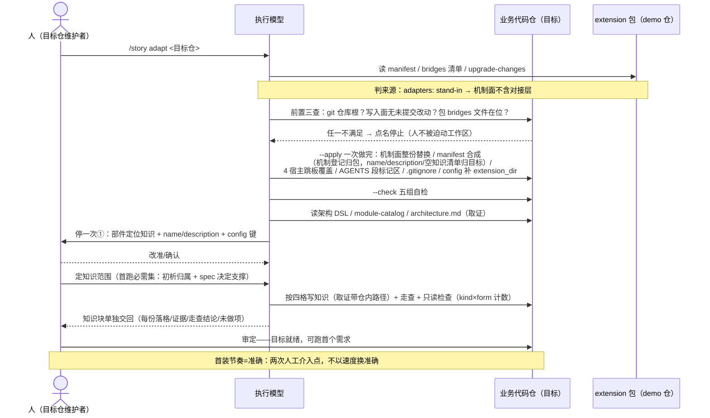
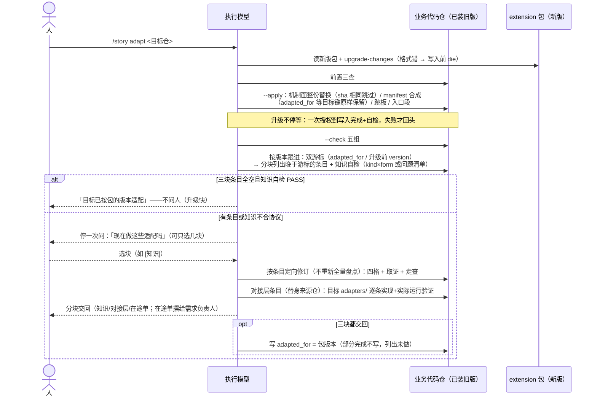

# 1.9.9 场景交互时序

> 目的：记录 adapt 按现行设计，在不同场景下**人（U）、执行模型（M）、业务代码仓（目标 T）、extension 包（demo 仓 P）**的交互时序，作为 [00-版本范围](00-版本范围.md) §2 推进节奏（首装准/升级快/知识层变更才介入）的行为参照与 T1 显式化的基准。图中行为以 2026-09-27 盘点的现行实现为准；1.9.8 D6 落地后 bridges 登记形态变化不改变本图的交互结构。

## 参与者

| 参与者 | 角色 | 交互特征 |
|---|---|---|
| 人（U） | 目标仓维护者 / 需求负责人（在途单） | 只出现在语义决策点：画像确认、知识范围、适配选择、在途单处置 |
| 执行模型（M） | 跑 `/story adapt` 的模型 | 唯一的"手"：对 T 与 P 的全部读写经它；语义工作（知识、描述改准）的承担者 |
| 业务代码仓（T） | 目标 | git 仓库根；`knowledge/` 与 `adapters/`（替身来源）对写入面只读 |
| extension 包（P） | demo 仓（stand-in）或已适配业务仓 | **全程被动**：adapt 对包只读（manifest/bridges/演进记录），包不执行任何动作 |

## 交互不变量

1. **M 是唯一的"手"**：T 与 P 之间零直接交互——adapt 不建立仓间通道，包的产物经 M 落进 T。
2. **介入点 = 准确性需要处**：U 的每次被叫（画像、范围、适配选择、在途单）都是脚本无法确定计算的语义决策；纯确定性路径（机制写入/自检/条目枚举）从不打断人。

## 场景 A：首次移植（demo 仓 = stand-in 包 → 全新业务仓）

## 场景 B：业务仓 → 业务仓复刻（与 A 的差异）

P = 已适配的业务仓（manifest 无 `adapters` 键）。唯一结构差异：`--apply` 时 `adapters/` **整份换入**目标（真实现随包走），后续升级跟进**不列 `[对接层]` 块**。知识仍 fresh 空清单、从新仓自己的代码出发——知识不跨仓复制（所有权红线）。

## 场景 C：升级已适配仓（节奏准则的分野）

## 场景 D：版本相同

`--apply` 无文件可写 → 报「当前适配仍有效」退出 0（机制不重装）；upgrade 态仍打印 followUp——版本相同但 `adapted_for` 落后时，积压的知识/在途单条目照常浮出。知识仍按方法页核一遍（机制有效 ≠ 知识适配完成）。

## 场景 E：失败与中断（横切所有场景）

| 失败点 | 行为 | 谁接 |
|---|---|---|
| 目标非 git 根 / 写入面脏 | 点名脏路径停止，**不 stash 不提交** | 人先存档 |
| 包 bridges 登记了却没有文件 | 先于目标检查报「包坏了」，目标一字节未写 | 维护者修包 |
| 目标 harness 缺依赖 | die 并给 `npm install` 指引 | 人 |
| 演进记录格式错（缩进子项/无块标签） | 写入**之前** die | 维护者修包 |
| 机制成功、知识部分完成 | 分开交回，不回滚机制，不笼统称升级完成；`adapted_for` 不写 | 人定剩余范围 |
| 会话中断 | 从当前文件重新看，已完成保留；优先恢复激活清单可读性 | 模型续做 |
