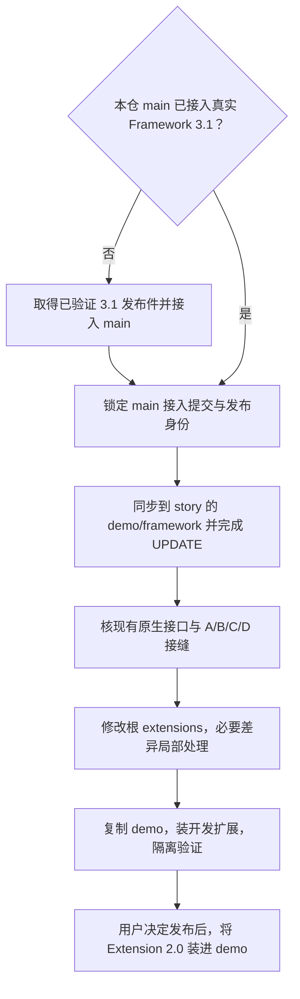
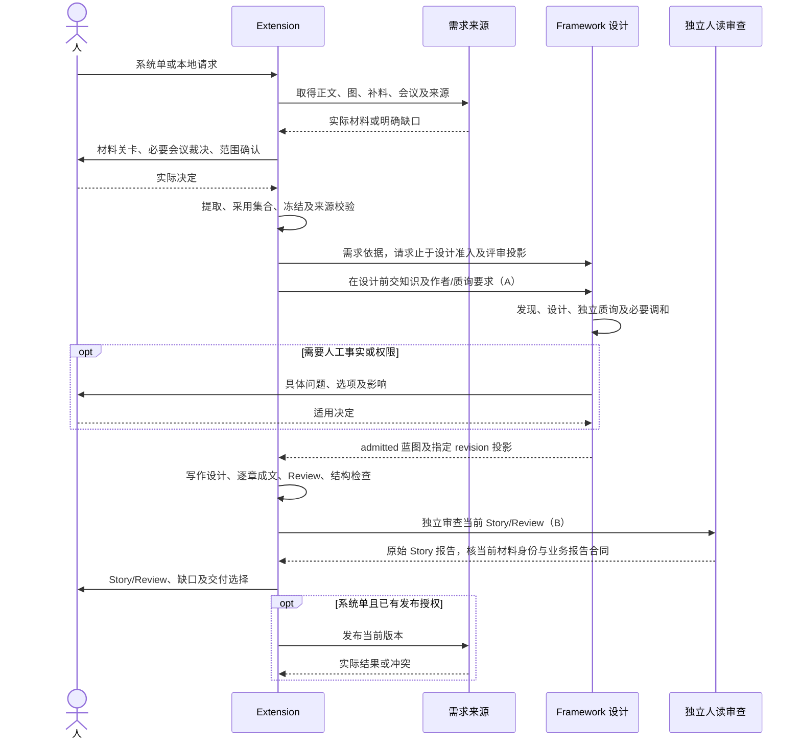
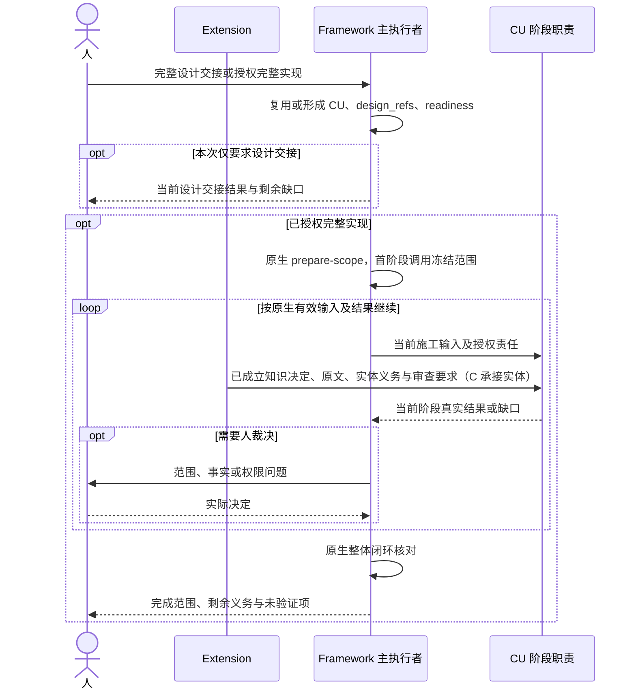
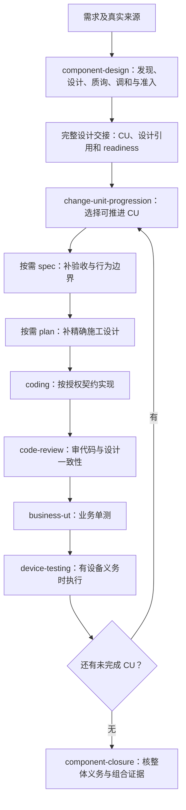

# Story 1.x 与 2.0.0 交互时序

行为依据[目标规格](02-目标规格.md)，实际协议及接缝验收见[协作与验收](03-Framework协作与验收.md)。泳道表示职责，不增加进程或 Agent 层级。实跑后当前整改按 [2.0.1 总览](../../plan/2.0.1/01-优化总览与裁定.md)，图表示产品协作目标，不代表全部能力已验证。

## 阅读图前：谁在调用，A/B/C/D 是什么

当前主模型读取 Skill 指令、调用工具、消费结果，再按请求与已有授权调用下一 Skill。图中 Framework/Extension 是职责泳道，不意味着另起两个常驻 Agent。2.0 仍可从 `/story` 连续推进，用户无需逐个手工输入 Skill 命令。

A/B/C/D 是四项适配接缝的核对编号，不是用户操作、Skill、运行阶段或必须先实现的新 API。先接入本仓 main 的 Framework 3.1，再核哪些已有能力能完成这些职责；实际调用及局部缺口由[实施总览 §3](../../plan/2.0.0/01-实施总览与协作合同.md#3-适配接缝-abcd-的核对与裁定)维护。

| 标记 | 含义 | 生效环节及完整合同 |
|---|---|---|
| A | 设计作者与独立质询者取得 Extension 的知识和任务要求 | 蓝图发现/设计/质询前；[核对项 A](../../plan/2.0.0/01-实施总览与协作合同.md#a设计作者和独立质询的知识输入) |
| B | 不绑定 Spec 阶段的独立人读产物审查 | Story/Review 结构检查之后；现行采用[宿主隔离执行与 Story 业务报告](../../plan/2.0.1/04-成文审查与更新依据.md)，不套代码审查 request |
| C | 文件级知识实体进入原生契约引用、授权及派生检查 | 蓝图内容承接到 CU 施工输入时；[核对项 C](../../plan/2.0.0/01-实施总览与协作合同.md#c施工输入中的知识职责) |
| D | 安装预检、原生入口物化及人工内容保护 | 安装/升级扩展时，不是每个需求都执行；[核对项 D](../../plan/2.0.0/01-实施总览与协作合同.md#d安装入口物化及目标人工保护) |

下面的 Extension 2.0 图描述目标协作，不表示四项接缝已经通过实际验证。A 的独立质询审设计，B 的独立审查审人读交付；各自问题回对应作者修正。现成能力足够就直接接线，必要局部差异才交其责任方修复。

## 实施顺序与用户流程

本仓 main、story 是同一个仓的分支。维护实施先建立实际 Framework 基线，之后才让消费模型运行本页的 Story 流程。

本轮 main=025d1b6b 的 Framework 3.1 已同步 story/demo 并通过基线评审，当前进入四项接缝核对；不能把它与“全部新增接口先就绪”混为一谈。具体文件范围和交回条件见[基线接入分册](../../plan/2.0.0/06-Framework基线接入与能力核对.md)。

## 1. 职责变化

| 活动 | 1.9.8 | 2.0.0 |
|---|---|---|
| 需求确认 | 材料、会议、范围和提取 | 保留，形成可引用的冻结输入 |
| 整体设计 | Spec 承接，Plan 细化 | 蓝图设计与准入；CU 承接施工 |
| Story | Spec 阶段内成文和审查 | 从需求及有效蓝图成文，独立产物审查 |
| 知识 | Spec 判断、Plan 选型、实体落实 | 按设计责任判断，原生引用传给实际施工输入 |
| 完整开发 | 已有授权下交互推进 | Framework 无 run 交互路径，范围与证据由原生机制维护 |
| 更新恢复 | 与平铺 Spec/Plan 及整树快照耦合 | 变化回权威来源，只恢复自有工作件 |
| 安装 | 自有 bridges 与 story-ext 段 | manifest 1.1、原生入口物化 |

## 2. 默认人读交付

零 CU 不阻止该链完成。直接 component-design 同样按 A 核定的真实原生输入方式取得知识，不创建上述需求流程。纯查看不修订蓝图，纯表达更新不增加 revision。

## 3. 设计交接及交互开发

本图不创建 Goal run；已有实施授权不重复询问。CU 推进与整体结果由 Framework 决定，Extension 不维护私有循环或完成状态。交付选择新增“实现方案”：在原生范围内完成适用 Spec/Plan 或合法复用，止于 Plan、不进入 Coding；它区别于仅 CU/readiness 的完整设计交接，也不要求执行完整实现图中的整体施工闭环。

## 4. 更新和恢复

update 取得当前来源与人工意见，完成本轮材料关卡后由模型区分表达、需求和设计变化。表达在 Extension 修改；范围由人裁定；设计意见经原生 feedback 交负责方，读取接受结果及当前 revision 后同步人读件和必要审查。

本地恢复按自有文件三方比较执行，冲突保留，人工 Review 原话保存；冻结输入、蓝图、CU 和发布记录保持。设计撤回经原生修订，远程恢复按外部授权独立处理。资料更新未形成 Story 时只完成资料请求，不为了关闭 update 自动设计或施工。

## 5. 没有 Extension 时的完整 Framework 流程

以下依据上游 `7753c18f` 的 skills.index、component-design、change-unit-progression、component-closure、project-entry 及各 Feature Skill。前置工程准备按需执行，不随每项需求重做。

| 工程准备 Skill/入口 | 输入 | 输出与职责 |
|---|---|---|
| framework-init | 发布件、工程事实、技术栈、宿主选择 | 工程配置、宿主物化和运行前置 |
| catalog-bootstrap / glossary 入口 | 模块源码、职责与业务术语 | 模块画像、术语与权威模块对应关系 |
| code-graph | 指定模块源码及画像 | 代码关系图及必要策展结果 |
| conventions-bootstrap | 工程惯例、真实依据和人工确认 | 适用工程规约 |
| component-catalog-bootstrap | 既有共享组件及使用事实 | 可复用组件台账与边界 |

正式需求从 component-design 开始；非正式维护按其真实请求进入相应原生职责，不强造蓝图。

图表示职责依赖顺序，原生范围及有效输入决定哪些动作要执行或复用；不要求每次重写六阶段文档。

| Skill | 输入 | 结果及停止点 |
|---|---|---|
| component-design | 请求、来源、工程事实、现有设计/规约 | 蓝图整体边界、契约、关系、运行流程、决定及准入；局部请求到相应终点 |
| change-unit-progression：设计准备段 | 已准入蓝图 | 提议并经原生接受 CU，建立 design_refs/readiness；由 component-design 调用该段完成交接 |
| change-unit-progression：施工段 | CU、依赖、当前范围和有效完成事实 | 选择可推进的 CU，交原生开发路径，完成后重新判断剩余工作 |
| spec | CU、需求及已有验收输入 | 补清行为、预期、边界、验收分层；形成 acceptance，按实际 required_outputs 写 spec.md |
| plan | CU、有效验收及已有设计 | 精确文件、类型、接口、运行生命周期和用例；形成 contracts，按实际 required_outputs 写 plan.md |
| coding | 有效契约、验收、授权文件集合 | 实现代码及编译等真实验证结果 |
| code-review | 当前代码、契约、验收及来源 | 代码审查结果、缺陷与修复责任 |
| business-ut | 业务实现、契约和单测责任 | 单测代码、执行与覆盖证据 |
| device-testing | 验收设备责任、应用及环境 | 适用测试计划、实际设备/视觉证据及报告 |
| component-closure | 蓝图、相关 CU、有效完成及组合证据 | 当前部件演进的整体结果与缺口；不等同于发布上线或跨部件端到端完成 |

Framework 原生负责输入解析、阶段检查、独立验证与完成证据。goal-mode 是另一个运行载体入口，本版选用无 run 的交互路径；extension 管理 Skill 则服务扩展安装/物化，不属于无扩展需求链。

上游仍有部分 Skill 文案将施工写成必须 Goal，而 project-entry 和 change-unit-completion 已支持无 run 的 Feature 载体。接入验收须核交互指令、CU 推进和完成消费一致；这项不能靠 Extension 私有推进循环补齐。当前这里只报告已核差异，不声称上游整套交互链已实跑通过。

## 6. 有 Extension 时的输入输出与主动调用

| 环节 | Extension 的职责和交出内容 | Framework 的职责和交回内容 |
|---|---|---|
| 材料与范围 | 获取正文/图片/会议，记录真实决定和采用版本 | 此时无需创建 CU 或施工阶段 |
| 进入设计 | 原始依据、提取分析、确认范围、人签及可核来源 | component-design 形成蓝图或报告事实/权限缺口 |
| 知识设计 | 在决定前给作者与质询者原文和要求（A） | 将有据判断、设计落点和共同取舍写入蓝图 |
| Story/Review | 组织整项需求叙事、精确附录、人工议题 | 提供有效 canonical 蓝图及其原生评审投影 |
| 人读审查 | 当前人读件、来源、设计、读者判据与材料指纹；核专属业务报告 | 使用宿主已有隔离子代理，不借 Feature 或代码审查 request（B） |
| 后续开发 | 相关知识、既定决定和本 CU 实体/验证要求 | 原生 CU/阶段输入、代码、证据与缺口（C 承接文件实体） |
| 设计反馈 | 原话、被评版本、目标和反馈类别 | 资格与接受分别处理，交回当前设计及有效性 |

从 `/story` 开始，主模型依次执行 Extension 的材料/范围动作，主动调用 `/component-design`，再回到 Story 成文和交付。默认到人读交付停止；已授权完整设计或实现时，继续完成相应 CU 准备并调用原生后续 Skill，无需重复请求同一授权。

1.x 的常见链是 `/story → /spec 内成文 → 按授权 /plan → 后续开发`；2.0 为 `/story → /component-design → Story/Review及独立审查 → 按授权 CU 设计准备 → 按需 /spec、/plan 和后续开发 → /component-closure`。Story 始终不依赖 Plan；2.0 替换的是设计来源与交付资格。

Story **不以 CU 为前置**，并不禁止读取已经存在的合法 CU。默认送审可先在零 CU 时完成；用户明确要求完整设计交接时，CU/readiness 属于该请求的后续结果。多个 CU 仍共用需求级 Story/Review，各自形成施工产物。

## 7. component-design、materials 与 materialize

component-design 是设计 Skill：正式需求开始设计、继续草稿、处理设计反馈或修订时调用；输入是需求与事实，输出是权威设计及本次请求的交接结果。它自身不启动编码。

当前已核蓝图源码没有名为 `/material` 的独立 Skill。容易混淆的对象如下：

| 名称 | 做什么 | 何时触发 |
|---|---|---|
| materials | 正文、图、会议等需求材料及其登记 | Story 取材、补料和 update |
| requirement-source-materialization | 将外部需求保存为项目内可引用、可核来源及说明 | 外部来源交设计之前；本地文件可由原生 builder 直接规范化，无需额外 provider 清单 |
| prepare-blueprint-design | 将 CU 引用的蓝图内容派生/物化为验收、契约等施工输入 | 蓝图和 CU 已存在，后续需要这些施工输入时；不产生 spec.md/plan.md 或阶段完成凭证 |
| extension materialize | 根据 manifest 和宿主配置生成扩展入口 | 安装、升级或登记变化时，按 D 核定的实际预检和所有权保护 |

需求来源物化处理“设计依据如何可引用”，蓝图设计处理“需求应怎样实现”，施工输入物化处理“有效设计如何供下游使用”，宿主物化处理“用户怎样进入这些能力”。

## 8. CU 产物与测试应看哪里

Story/Review 先交付不意味着 Extension 随后退出：知识仍进入每个 CU 的作者任务、实体契约、post_check 和独立阶段审查。各阶段产物、模板及机制变化的唯一定义见[步骤 3 §2.4](../../plan/2.0.0/04-步骤3-知识承接与更新恢复.md#24-cu-各阶段产物模板与扩展作用)。

两个既有业务 Case 按原验证目的迁移：自动充值到人读定稿送审，车钥匙分享到施工设计上限，并各自保留 update。具体检查点、完成条件及直接入口/复用/多 CU 的补充安排见[步骤 4 §4.1](../../plan/2.0.0/05-步骤4-验证与收口.md#41-两个既有-case-的-20-迁移)。
