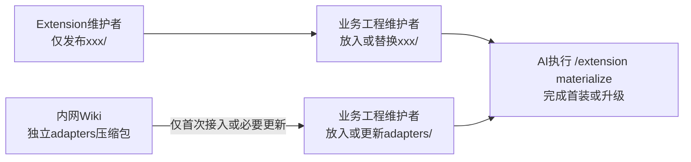

# R2 三目录分发、Demo 来源与原生接入

承接 T1–T5、T9、B1–B6。用户操作、实施依赖和预算见[总览](../00-版本范围.md)，成本口径由 R4 维护。以下是目标设计，未实施物理目录迁移。

## 1. 固定交付流程



日常主线只经过机制发布、业务仓替换 xxx/ 和原生接入；Wiki 分支用于首次接入或 adapters 确需更新。没有“内网每版改包、重发整套 Extension”的中转步骤，也不引入组合包管理系统。

| 场景 | 业务维护者操作 |
|---|---|
| 首次接入 | 取得机制包，另从内网 Wiki 获取 adapters，放入各自目录；执行 /extension materialize |
| 日常升级 | 只替换 xxx/，保留 adapters、knowledge 和目标信息；执行同一原生入口 |
| 对接更新 | 按内网说明独立更新 adapters，并执行同一入口完成必要核验；不重组或重发机制包 |

内网 Wiki 提供 adapters 压缩包、放置位置、适用契约和必要更新说明。真实实现由内网统一维护，接口契约未变且自身无修复时通常不更新；机制内部重构不应迫使更新。依现有协议、演进说明及必要检查判断适用性，不建设复杂兼容矩阵或多版本运行分支。

目标已准备 Framework 是既有前置，不要求先有 Story Skill。xxx 使用稳定目录名，版本记录在包内；AI 内部执行所需机械动作，业务维护者不运行独立 Story 安装、查询或完成标记命令。无变化重跑幂等，不重复知识调查和有效审查。

## 2. 目录与唯一维护源

### 2.1 本仓目标结构

```text
extensions/
└─ xxx/                         机制开发源、唯一发布来源

demo/doc/extensions/
├─ xxx/                         安装生成的机制副本，不手工维护
├─ knowledge/                   Demo 自有知识的唯一维护源
└─ adapters/                    外网本地替身的唯一维护源
```

目标身份、知识清单和适配记录仍位于 xxx/ 替换范围之外；具体登记载体沿 F1 的上游契约，不复制包的已适配状态。

| 对象 | 唯一维护者/来源 | 发布与更新边界 |
|---|---|---|
| 机制、指令、包声明 | 根 extensions/xxx | 只从该源发布 xxx/；不携带 adapters、知识、业务代码或 Framework |
| Demo 机制副本 | 由接入流程从明确机制版本安装生成 | 更新示例基线时安装，不手工维护第二份机制源 |
| Demo 知识 | demo/doc/extensions/knowledge | 原 extensions/knowledge 的有效样板迁入；按 Demo 工程事实和规范维护，不分发给其他业务仓 |
| 外网本地替身 | demo/doc/extensions/adapters | 原机制内 adapters 的有效替身实现迁入；按本地需求系统与对接契约维护 |
| 内网真实 adapters | 内网统一维护源，经 Wiki 独立分发 | 与本仓替身分开；首次接入、契约变化或自身修复时取得/更新 |
| 其他业务仓知识 | 业务仓自身 knowledge 及实际规范/代码 | 不由机制包或 Demo 样板覆盖 |
| 宿主入口与目标登记 | Framework 原生接入维护 | 保留目标身份、知识激活及适配事实，按原有所有权物化 |

首次迁移要逐份核根开发样板/替身与 Demo 已有版本的有效差异，保全应保留内容并交到唯一维护源，不能直接整目录覆盖现有 Demo 目标内容。调用和验证接通后原位置退出，不以副本或旧路径长期兼容。

当前 manifest 和 adaptation.yaml 与机制根耦合，先移出目标信息再形成可替换目录；不允许先删混合根再猜登记。测试冻结夹具保留证据用途，不成为另一套持续编辑的知识或 adapters 正本。

### 2.2 Demo 维护规则

Demo 保留示例工程和测试底座职责，不再担任对外机制发布源；不要求每次机制开发或每个机制版本发布都更新 Demo。

- xxx/ 只在更新示例基线时由接入流程安装已验证版本，日常开发只改根机制源。
- knowledge/ 在 Demo 工程事实、规范或知识要求变化时维护。
- adapters/ 在外网本地替身需修复或适配协议时维护；不能据替身通过宣称内网真实接口已验证。
- Demo 自有内容依赖新机制协议时，同步到相容机制版本并验证组合，不留下无法使用的示例工程。

这要求未来按内容所有权修正“Demo 只在正式发布时更新”的笼统规约。干净、可追溯的测试基线与不向 Demo 写运行产物的要求继续保留，本轮不修改这些运行规约文件。

### 2.3 开发测试装配

使用现有装配能力：复制干净且可追溯的 Demo → 只替换隔离模板的 xxx/ 为开发源 → 原生接入 → 执行对应测试。复制取得的知识、替身和目标信息保留，不向 Demo 装开发版或回写运行结果。

机制同源检查仅比较 extensions/xxx 与模板中安装的 xxx/，不再要求整个 doc/extensions 与机制源相等。knowledge 和 adapters 按各自来源及适配后的预期核查，不能当多余文件删除。核 Demo 源未被测试修改；知识在授权接入中确需适配时只修改隔离目标，来源与变化要可追溯。

## 3. 单一入口和职责交接

| 承担者 | 取得的输入 | 动作与输出消费者 |
|---|---|---|
| Framework 的 extension Skill | 包声明、目标事实、扩展接入要求 | 在同一次请求内组织必要动作并汇报结果；业务维护者只使用这一个入口 |
| Framework 确定性工具 | 有效路径、登记、宿主及实际文件 | 读取、物化、清理、检查及结果报告，交给当前执行模型 |
| Story 接入要求页 | 当前协议、版本演进和目标知识方法 | 提供何时做什么、需什么依据、如何检查及何时完成，供原生入口消费 |
| 执行模型 | 目标代码/规范、已有知识、当前有效要求 | 取证、判断适用性、修改必要知识并交回；语义不塞入物化脚本 |
| 业务工程维护者 | 模型已调查的真实缺口与冲突 | 决定目标范围或规范权威，模型按决定继续 |

由原生入口取得并执行接入要求，再完成必要物化与核验；不会把“桥接文件已经写出”当成整个接入成功。要求必须在相关模型行动前进入上下文，而不是物化结束后才留一个“请再运行 adapt”的建议。

三类正常请求：

- **首装**：业务仓分别放入机制与 Wiki 对接包，没有 Story 入口也能先进入 Framework extension；knowledge 未创建时进入目标调查，按已确认范围生成必要知识、登记并检查。本仓隔离测试使用 Demo 的本地替身，不混用内网包。
- **升级**：日常只替换机制，保留已有 adapters、知识及目标信息，按有效增量处理实际事项；只有协议变化或对接自身修复才更新独立 adapters，不逐仓重新实现。
- **无变化重跑**：复用有效登记与结果，只做必要核对并报告无须再做的部分，不固定调用一遍全流程。

接入结果一次讲清本次完成内容及仍需谁处理的实际事项。完成版本由确定性能力按当前包身份记录，模型不手填版本；部分完成不记全成。记录和查询复用 Framework 的目标级接入信息，不再建独立 Story 状态命令、任务台账或用户标记步骤。

## 4. Framework 两项最小协作合同

以下是明确的能力请求，不是现有可调用接口承诺。依据见[独立审查](../01-独立审查与证据.md)：当前 materialize 只刷新桥接和根入口，加载器仍以同一个扩展根解析 Skill 与知识。

### F1 分离机制与目标内容的读取

- 输入需能明确定位机制包根、目标知识/登记及独立 adapters 位置，不强迫它们都在可替换目录中。Framework 提供通用定位与接入，Story 消费对接契约，不把内网实现写进 Framework。
- Skill、Hook 和机制资产按包内声明解析；目标知识及适配信息按其唯一目标真源读取。更新机制后旧目标信息仍有效，不要求手工合并 manifest。
- 首装允许目标知识与登记尚未建立；已登记却缺失/损坏的目标内容沿既有检查报告，不能静默清空登记混为首装。
- 一次性迁移沿现有配置和已保存的旧登记进行；上游需交付实际配置/存储契约和检查结果，不能用放宽任意越界路径、复制知识或自建旁路满足布局。

验收：首装独立取得机制和 adapters、无知识时正常进入；日常替换 xxx 后知识、adapters 和目标信息保持；新路径参与实际 Skill/知识/对接消费；旧重复真源及固定目录层数假设退出。

### F2 原生 extension Skill 消费扩展接入要求

- 复用现有 `provides.skill_assets` 声明面，为原生 `extension` Skill 登记接入要求页。现有加载器能接受资产声明，但原生 Skill 还须增加真正的消费动作，不能把登记成功称为流程已接通。
- 要求页包含首装、升级、无变化的输入、动作、责任、完成条件；原生入口在相应行动前将其交给执行模型，并在同一次请求中完成必要核验。
- 确定性 materialize 工具继续承担其机械职责；语义适配由执行模型做，不由脚本猜知识或替用户定规范。
- 没有扩展接入要求时保持原生正常物化；声明存在却读不到则按既有输入错误处理，不悄悄跳过后报全成。

验收：无 Story Skill 时仅用原生入口完成首装；升级读取当前要求；无变化不重做知识；修改知识后经过必要检查；用户不用转到另一条指令。

Framework 维护者负责通用协议、实际字段/调用、上游实现和发布；本仓设计者核它与上述合同相符，再锁到具体实施方案。用户只需批准业务选择，不承担协议设计。未锁实际接入件前不启动 R2 产品接线，不先在本仓自造看似可调用的 API。

本需求不新增通用安装状态机、第二套调度器或 Story 物化框架。本轮只在 spec 内提出协作合同，不改 vendored Framework，不修改另一组 2.0 文件。

## 5. Story 保留的方法与最少检查

首装知识仍从目标决定空间出发：部件边界、已有能力、规约、模式与专项方法、实际施工和验证责任；每个相关决定有依据或明确缺口/不适用，不要求固定份数，不抄 Demo 主题结构。

升级按有效演进条目和真实相关缺口处理；没有旧知识时旧写法迁移可不适用，不为了版本相同重新全仓盘点。整体设计判断归蓝图，CU 按范围承接，不能恢复 1.x 的全需求 Spec/Plan 旧职责。

必要知识结构检查和独立语义审查复用既有能力，在实际知识工作需要时执行；无变化不重复审查，也不建立日常报告新鲜度巡检。必须独立核的语义不能靠作者自证或结构 PASS 替代；原生工具缺口如实报告，不能绕过。

已有人工入口、脏文件、依赖和实际写入失败保护直接复用。新增检查只覆盖目录分离与接入要求是否送达、执行和核验。失败报告具体未完成部分与责任；不添加独立恢复状态机，不让正常用户记额外子命令。

## 6. 新旧交接与 1.x 有效优化

| 对象/行为 | 新承担者 | 退场与保留 |
|---|---|---|
| 独立 /story adapt、story-adaptation Skill 与宿主跳板 | Framework /extension 的接入编排 | 路由、独立登记和入口退出，/story 的需求业务保留 |
| 复制机制和重复物化编排 | 用户按目录替换；Framework 原生工具接入 | 不再由另一个 Story 安装流程重装已换好的机制；有效保护由其新承担者覆盖 |
| B1：脚本记录完成版本 | 接入内部确定性能力 | 保留非人工写版本，退出用户完成标记步骤 |
| B2：没有待办即可完成 | 原生入口的必要核对与结果 | 保留无变化低成本路径；不再以“完全不进 AI”为目标，用户已选择统一 AI 入口 |
| B3/B6：基线主题调查、目标取证和交回 | Story 接入要求及知识方法 | 方法迁移有直接消费者，不复制 Demo 正文，不因撤 Skill 丢知识能力 |
| B4：首装无旧在途、对接按真实来源处理 | 接入要求与当前工程事实 | 内网真实 adapters 独立分发；Demo 替身独立维护，首装和升级仍按实际义务处理 |
| B5/T5：机制与适配结果分开 | Framework 本次结果及已有检视能力 | 保留不误报完成，撤回新增 --status 用户入口 |
| 升级演进与必要检查 | 随包要求与现有检查能力 | 保留唯一迁移要求来源，删除无人调用的旧 helper 和说明 |

1.x 来源为 `origin/story-1.0=304c6777` 的 a0627c9c、8f60778f，只承接有效行为，不保留独立命令形式。方法页移动不算删除收益。执行前核全部实际消费者；原有共用发布/检查调用须迁到明确新承担者后，才能删旧实现，不能因用户入口撤销而误删有效发布能力。

完成条件是旧路由、登记、跳板、重复实现和失效指路一起退出，新方法确被原生入口消费且原有保护仍成立；不是只删一个 Skill 文件。

## 7. 未来实施必须同步的消费者

| 责任面 | 具体动作与退出范围 |
|---|---|
| 对接调用与工程根 | Story 各动作和 token 入口改到独立 adapters；需要工程根的调用显式传 --project-root，退出 dirs.js 按旧目录上溯六级的假设；内网实现核同一调用契约 |
| 知识加载与测试来源 | 激活清单、知识路径及读取知识的离线测试转到目标/Demo 真源；不重新复制一套开发知识留在机制源 |
| 发布枚举与 Demo 安装 | 发布只枚举根 xxx/；示例机制由该包安装；停止对整个 doc/extensions 做整份替换或同源比较 |
| 模板装配与检查 | DEV_SOURCE 指向 extensions/xxx，机制检查定位模板 xxx/；保留目标知识/替身来源和 Demo 不受写入的检查 |
| 计量根与分类 | 计量根随机制源调整到 extensions/xxx，保持有效行算法和同口径分类；知识/对接本已排除，移动不计净删除、不重置累计新增账 |
| 规约与文档 | 未来同步 AGENTS、TEST、README 及实际引用中关于目录、唯一源、Demo 更新和分发来源的说明；本轮只登记任务，不修改目录外文件 |

至少核现有 publish_to_demo、run_multi_case、ext_workspace、知识/对接测试和脚本入口等实际消费者；查找结果还须按职责判断，不能只替换字符串。迁移验证证明机制包干净、唯一维护源成立、接入能调用独立对接、模板不删目标内容，才删除原位置及专用旧分支。
