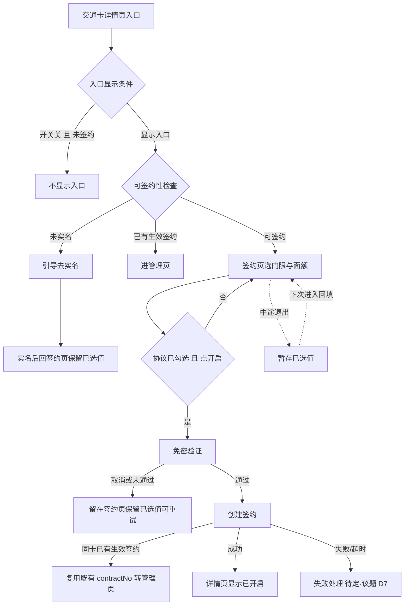
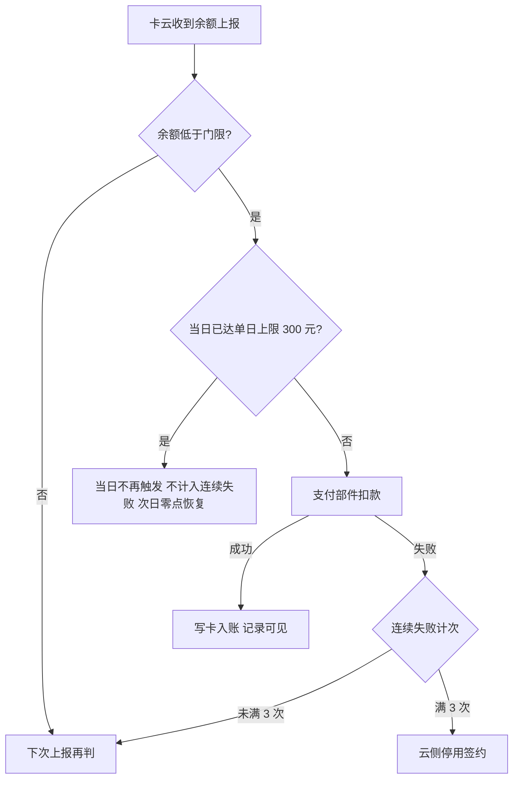

# 交通卡自动充值（钱包端）— 需求规格（Spec）

<!--
  ══════════════════════════════════════════════════════════════════
  金样标注（分析写作物，非真实运行产物）
  - 单号/业务：AR90006 交通卡自动充值（钱包端）；写作日期：2026-09-29。
  - 判据：analysis-b5-spec-draft.md §1 C1–C4；逐章最佳来源见 factbase-AR90006.md §8「来源映射」。
  - 材料代：v0.5（单日充值上限 300 元代）；全部数值带三标法来源标签，见 factbase §3。
  - 事实唯一真源：factbase-AR90006.md（口径、F 清单、议题 D1–D12、编号体系、契约实体）。
  - 9.2/9.3 投影标记按现行形态书写、省略 sha256（写作物未经 render）；落位形态对应档案退步项修正清单（factbase §7）。
  ══════════════════════════════════════════════════════════════════
-->

> **模块标识**: `AR90006`
> **版本**: v1.0
> **创建日期**: 2026-09-29
> **最后更新**: 2026-09-29
> **状态**: 评审中

---

## 0. 术语映射表（Terminology Mapping Table）

> **本节是本 spec 的第一道 BLOCKER**：
> 所有来自原始需求正文的业务名词，必须映射到 `doc/module-catalog.yaml` 中真实存在的模块名；
> 所有行的「用户确认」列必须为 `[x]`；
> 置信度 `high` 也必须人工逐条确认（本项目不启用 auto-approve）。

| 原始术语 | 权威模块 | 所属层 | 置信度（high / medium / low） | 易混项（必须亮出） | 用户确认 | 解释 |
|---------|---------|--------|-------------------------------|-------------------|---------|------|
| 自动充值 | WalletMain | 02-Feature | high | 交通卡余额提醒（RR90007，另一单，不共用门限档位） | [x] | 用户签约后余额低于门限时由系统自动充值的能力；端侧只做入口、签约交互与状态展示 |
| 触发门限 | WalletMain | 02-Feature | high | 单日充值上限（300 元，另一规则） | [x] | 余额低于多少元触发充值（5/10/20/30 元四档），用户单选、签约后可修改 |
| 单笔面额 | WalletMain | 02-Feature | high | 免密扣款单笔额度（随面额设置） | [x] | 每次自动充入多少元（20/50/100 元三档），用户单选、签约后可修改 |
| 签约 | WalletMain | 02-Feature | high | 签约关系真源是交通卡云；端侧只承担签约交互与入口展示 | [x] | 用户一次确认建立的自动充值关系，长期生效直到关闭或停用 |
| 免密验证 | WalletMain | 02-Feature | high | 验证界面由支付部件拉起，钱包端只承接拉起动作与授权结果 | [x] | 首次签约时由支付能力拉起的一次授权验证，通过后取得协议号 |
| 未实名 / 实名认证 | AccountManager | 04-BusinessBase | high | 账号能力现仅提供登录态，实名结果为新增消费（议题 D8） | [x] | 未实名用户入口可见，点入引导完成实名，完成实名前签不成 |
| 管理页 / 停用态 | WalletMain | 02-Feature | high | 停用判定与原因由卡云返回，端侧只展示 | [x] | 承载签约状态、记录与改约/解约/重签入口的页面；停用态顶部为停用横幅 |
| 卡号脱敏 | CommFunc | 05-SystemBase | high | 记录展示复用公共脱敏能力，不在业务内手写算法 | [x] | 充值记录里卡号按规则脱敏展示所复用的公共能力 |
| 未登录 | AccountManager | 04-BusinessBase | high | 登录态查询走 AccountService + AppStorage 键，端侧只读消费 | [x] | 登录态查询能力来源，本需求只读消费不修改 |

**回写约定**：所有新增 / 修正的条目在用户批准后必须同步追加到 `doc/glossary.yaml`。

---

## 1. 功能概述

交通卡自动充值让用户一次签约之后，余额低于自设门限时由系统（交通卡云）自动完成充值，把「想起来充值」移出用户操作。产品目标（上游约束：RR90006 目标）：签约用户的闸机余额不足发生率下降到万分之五以下；签约转化率不低于交通卡月活的 8%。

本 AR 承担钱包端部分：交通卡详情页的自动充值入口、签约页（门限/面额/协议）、免密验证拉起、建约/改约/解约、管理页与充值记录展示、停用态呈现与重新签约，以及端侧缓存与中途离开暂存。判定与扣款全部在服务端，端侧不存在「发起自动充值」的动作；**判定输入是服务端记录的余额，不是手机显示的余额**——离线刷卡后手机余额长时间不准，按它判定会扣出用户预期之外的钱。

---

## Scope 声明

> plan（Design）必须继承本节的 `in_scope_modules`；coding 的 git diff 不得越界到本节之外的模块。

### Scope 模块清单

| 字段 | 取值 | 说明 |
|------|------|------|
| 本需求允许修改的模块 | `WalletMain`、`Phone` | WalletMain 承载入口/签约页/管理页/端侧缓存与暂存/自动充值仓库；Phone 仅做新增页面的宿主路由登记 |
| 本需求明确不修改的模块 | `AccountManager`、`CommUI`、`CommFunc` | 只读消费既有能力（登录态/组件/导航/日志/脱敏），不加改动 |

### Scope 结构化字段（供 Spec 提取，必填）

```yaml
in_scope_modules:
  - WalletMain
  - Phone
out_of_scope_modules:
  - AccountManager
  - CommUI
  - CommFunc
rationale: |
  自动充值入口、签约页、管理页与端侧 Repository 承载在钱包主 feature（WalletMain）。
  Phone 必须在 in_scope：宿主 Phone/src/main/ets/pages/index.ets 的 navDestinationMap 是硬编码
  if/else 分支（现仅登记 CardPackPage/AddCardEntryPage），新增页面必须在该分支加名字映射；
  工程惯例为新增页面改三处——页面 builder、模块 index.ets 导出、宿主 navDestinationMap。
  AccountManager 只提供登录/实名结果消费（现无实名字段暴露，属新增消费，见议题 D8），
  CommUI/CommFunc 只做组件与工具复用（NavPathContext/Logger/MaskUtil），三者均不改。
  若下游想把逻辑提到公共模块，须先发起 scope 扩展提议。
```

### Visual Handoff（视觉交接，供 check-spec 读取）

```yaml
ui_change: new_or_changed
visual_handoff:
  kind: repo_assets
  fidelity_target: semantic_layout
  asset_acquisition_mode: approximate
  authoritative_refs:
    - id: detail_entry
      path: doc/features/AR90006/ux-reference/detail-entry.png
      caption: 交通卡详情页的自动充值入口（图1）：余额行之下、充值记录之上的一整行入口
    - id: signup_page
      path: doc/features/AR90006/ux-reference/signup-page.png
      caption: 自动充值签约页（图2）：门限/面额单选、协议勾选后开启才可点
    - id: verify_page
      path: doc/features/AR90006/ux-reference/verify-page.png
      caption: 免密验证页（图3）：首次签约需过一次免密验证，单笔额度说明清楚
    - id: manage_page
      path: doc/features/AR90006/ux-reference/manage-page.png
      caption: 自动充值管理页与记录列表（图4）：顶部签约状态、下方最近记录、失败展示原因
    - id: disabled_state
      path: doc/features/AR90006/ux-reference/disabled-state.png
      caption: 停用态（图5）：连续失败停用后顶部为停用横幅并给出失败原因
```

### 最小改动原则

1. **默认就地实现**：自动充值逻辑优先实现在 WalletMain 内（页面、仓库、暂存与缓存），新能力不向上提公共层。
2. **禁止默默扩展**：若发现需在 AccountManager/CommUI/CommFunc 新增公共接口，必须停下发起 scope 扩展提议给用户确认。
3. **公共能力优先复用**：导航取栈用 CommFunc `NavPathContext`、日志用 `Logger`、脱敏用 `MaskUtil`、组件与主题色用 CommUI 既有资产，不新增公共接口。

---

## 2. 目标用户与使用场景

### 2.1 目标用户

| 用户角色 | 描述 |
|----------|------|
| 交通卡持卡人 | 已持有钱包内可刷乘交通卡、厌烦余额用尽时才被迫手工充值的用户 |
| 未实名用户 | 钱包端已登录但账号未完成实名的用户；可看到入口，完成实名前签不成 |
| 已签约用户 | 已建立自动充值签约的持卡人，需要查看记录、改档或关闭 |

### 2.2 使用场景

| 场景编号 | 场景名称 | 场景描述 | 前置条件 |
|----------|----------|----------|----------|
| S1 | 入口可见与引导 | 用户在交通卡详情页看到「自动充值」入口；未实名点入被引导去实名，完成后回签约页 | 打开交通卡详情页 |
| S2 | 首次签约 | 选门限（5/10/20/30 元）与面额（20/50/100 元）、同意免密扣款协议后过验证、创建签约 | 已实名、无生效签约、开关开 |
| S3 | 自动充值发生 | 余额低于门限时系统自动完成充值，用户无需操作，记录可见 | 已签约、余额低于门限、未达单日上限、未停用 |
| S4 | 管理签约 | 修改门限/面额（走更新，原签约不断）、查看记录、关闭自动充值 | 已签约进入管理页 |
| S5 | 已签约再进入 | 已有生效签约时再点入口，进入管理页而非重新签约 | 已有生效签约 |
| S6 | 停用后查看与重签 | 连续失败被停用后查看失败原因，从停用横幅直接重新签约 | 签约已停用（连续 3 次扣款失败，上游约束：RR90006 产品规则） |
| S7 | 验证中断与重试 | 支付验证取消或未通过，留在签约页保留已选值，可直接再试 | 已进入签约页并点开启 |
| S8 | 开关关闭 | 运营关闭开关后新签约暂停（入口对新用户不显示）；已签约用户照常进入管理页、自动充值照常 | 运营侧关闭功能开关 |

---

## 3. 功能清单

| 编号 | 功能名称 | 优先级 | 描述 | 关联场景 |
|------|----------|--------|------|----------|
| F1 | 详情页自动充值入口 | P0 | 交通卡详情页余额行之下、充值记录之上的一整行「自动充值」入口；显示条件=功能开关开 或 该卡已有生效签约；已签约直达管理页，未实名可见（点入引导实名），开关关且未签约不显示 | S1, S5, S8 |
| F2 | 签约页 | P0 | 门限单选（5/10/20/30 元）、面额单选（20/50/100 元）、协议勾选后「开启」才可点；返回暂存已选值 | S2, S7 |
| F3 | 免密验证 | P0 | 点「开启」拉起支付部件验证（协议文案含单日上限 300 元（上游约束：RR90006 产品稿 v0.5）与免密单笔上限随所选面额）；协议号只透传不持久化 | S2, S7 |
| F4 | 创建签约 | P0 | 验证通过后调 `createAutoTopupContract`；成功显示「已开启」；同卡已有生效签约返回既有 contractNo、转管理页不重复建约 | S2, S5 |
| F5 | 未实名引导 | P0 | 入口可见，点入引导去账号能力完成实名，完成实名前签不成；实名后回签约页保留已选值 | S1, S6 |
| F6 | 已选值暂存 | P1 | 验证失败/取消/中途退出时保留已选门限面额，重试或回来继续；本账号本卡有效、退出登录清除 | S2, S7 |
| F7 | 管理页 | P0 | 顶部签约状态、当前门限面额、最近自动充值记录（失败展示原因）、停用态横幅 | S3, S4, S6 |
| F8 | 修改门限/面额 | P0 | 走 `updateAutoTopupContract` 更新，原签约不断；只改门限与面额下调不验证；面额上调验证与否待支付/风控结论（议题 D3） | S4 |
| F9 | 关闭自动充值 | P0 | 调 `cancelAutoTopupContract`，不再触发自动充值；不回滚进行中订单、不撤销已完成订单 | S4 |
| F10 | 停用态查看与重签 | P1 | 停用后管理页展示停用横幅（横幅内置重新签约入口）与失败原因，从横幅可直接重新签约（议题 D9） | S6 |
| F11 | 端侧缓存 | P1 | `wallet_auto_topup_contract` 缓存 contractNo/门限/面额/状态，免网展示；账号隔离、退出登录清除、不参与备份恢复、缓存缺失以云侧为准 | S3, S4 |
| F12 | 记录卡号脱敏 | P1 | 充值记录卡号按现有规则脱敏展示（采集处脱敏） | S3, S4 |

> **新增端云域声明**：F1（详情页承载）、F3/F4/F8/F9/F10/F11 依赖的端云接口（`getAutoTopupPolicy`/`createAutoTopupContract`/`getAutoTopupStatus`/`cancelAutoTopupContract`/`updateAutoTopupContract`）与支付部件免密拉起为本需求新增的端云交互域；工程当前无网络层封装（检索 HTTP/RPC 于 in_scope 模块零命中）、无交通卡详情页实现、无实名结果暴露，上游材料默认其为既有能力。承载方式（自建网络层与数据仓库 / 联调期本地模拟过渡）按议题 D8 裁决后在 plan 落定；接口契约按系统设计定义，不因承载方式改变。

---

## 4. 页面/界面描述

视觉规范沿用交通卡详情页现有样式（白卡片分隔、顶栏返回、系统图标、主色强调），不新增控件类型；参考图见 `ux-reference/` 五屏，以语义布局为准；小屏机型参照 `signup-page-small.png`（同一页面的另一分辨率，仅适配参考）。

### 4.1 页面总览

```
详情页（入口区，F1）: [余额行] / [自动充值入口行] / [充值记录]
签约页（F2/F3/F5/F6）: [门限单选组] / [面额单选组] / [协议勾选] / [开启按钮]
免密验证页（支付部件拉起，F3）: [单笔额度说明] / [确认/取消]
管理页（F7/F8/F9/F10）: [签约状态区/停用横幅] / [最近记录列表] / [修改/关闭/重签入口]
```

### 4.2 UI 组件详细描述

#### 区域 1: 交通卡详情页入口区（F1，图 1 detail-entry）

| 组件 | 类型 | 内容/数据 | 交互行为 |
|------|------|-----------|----------|
| 自动充值入口行 | 列表行 | 「自动充值」+ 行内状态（未开启/已开启·当前门限面额/停用） | 点击去向按入口条件矩阵判定（见 §4.3）；防重入 |
| 余额行 | 展示 | 服务端记录余额（离线可能失真，本需求不以此判定） | 无 |
| 充值记录 | 列表 | 最近自动充值记录，卡号脱敏 | 点击进管理页看全部 |

#### 区域 2: 自动充值签约页（F2/F3/F5/F6，图 2 signup-page）

| 组件 | 类型 | 内容/数据 | 交互行为 |
|------|------|-----------|----------|
| 返回 | 图标按钮 | 系统符号 | 返回详情页；**暂存已选门限面额** |
| 门限单选组 | 单选（四选一） | 5 / 10 / 20 / 30 元（来自 `getAutoTopupPolicy`） | 选择生效，高亮选中项 |
| 面额单选组 | 单选（三选一） | 20 / 50 / 100 元（来自 `getAutoTopupPolicy`） | 选择生效，高亮选中项 |
| 免密扣款协议 | 勾选框 | 协议文案（写明单日最多充 300 元（上游约束：RR90006 产品稿 v0.5）、免密单笔上限随所选面额） | 勾选后「开启」才可点 |
| 开启按钮 | 按钮 | 「开启」 | 门限、面额已选且协议勾选后可用；点击把协议文案与协议号交给支付部件拉起验证；处理中态防重复提交 |
| 实名引导提示 | 展示/导航 | 「请先完成实名认证」 | 未实名点入出现；点击去实名，返回后回填此前选择 |

#### 区域 3: 免密验证页（支付部件拉起，F3，图 3 verify-page）

| 组件 | 类型 | 内容/数据 | 交互行为 |
|------|------|-----------|----------|
| 验证页 | 外部能力页 | 单笔额度说明 + 确认/取消 | 确认返回授权结果给钱包；取消返回签约页并保留已选值 |

#### 区域 4: 自动充值管理页（F7/F8/F9/F10，图 4 manage-page）

| 组件 | 类型 | 内容/数据 | 交互行为 |
|------|------|-----------|----------|
| 签约状态区 | 展示 | 「自动充值已开启」+ 当前门限与面额；停用态替换为停用横幅 | 无 |
| 停用横幅 | 展示/入口 | 「自动充值已停用」+ 失败原因 | **横幅内置重新签约入口**，点击直接进入重新签约流程（议题 D9） |
| 最近记录列表 | 列表 | 最近自动充值记录；失败展示失败原因；卡号脱敏 | 滚动查看 |
| 修改门限/面额 | 入口 | 当前门限与面额 | 进入修改；提交调 `updateAutoTopupContract`，原签约不断 |
| 关闭自动充值 | 入口/按钮 | 「关闭自动充值」 | **二次确认后**调 `cancelAutoTopupContract`；不回滚进行中订单、不撤销已完成订单 |

### 4.3 页面状态

| 状态 | 描述 | 触发条件 |
|------|------|----------|
| 详情页-默认 | 入口按显示条件出现，行内展示当前签约摘要 | 打开交通卡详情页 |
| 详情页-入口隐藏 | 「自动充值」入口不显示 | 开关关闭且该卡未签约（议题 D5） |
| 签约页-默认/回填 | 展示门限面额档位；有暂存时回填此前选择 | 进入签约页（含实名返回、中途退出后再进） |
| 签约页-验证中 | 「开启」处理中态，不重复提交 | 已点开启、验证进行中 |
| 签约页-验证失败/取消 | 保留已选门限面额，可重试 | 支付取消或验证未通过 |
| 签约页-创建失败 | 展示失败、已选值保留、可重试 | `createAutoTopupContract` 失败/超时（重试策略待定，议题 D7） |
| 管理页-默认 | 展示签约状态与记录 | 进入管理页 |
| 管理页-缓存缺失 | 以云侧查询结果展示 | `wallet_auto_topup_contract` 被清除或首次进入 |

---

## 5. 业务流程图

### 5.1 签约路径（主路径 + 分支）



分支说明：

- 未实名分支：完成实名前签不成；
- 已签约分支：不重复建立；
- 验证取消/未通过：不产生任何签约记录；
- 创建签约失败/超时：恢复方式为待定项，图内不作已定表达（议题 D7）；
- 中途退出：暂存、下次进入回填（对应 F6）。

### 5.2 服务端触发子流程（自动充值发生，端侧无感）



端侧在子流程中的职责只有承接结果：

- 记录与状态经 `getAutoTopupStatus`/缓存展示；
- 停用态横幅呈现失败原因；
- 判定、扣款、计次、停用全部在卡云。

### 5.3 不建模声明

端侧监测余额并直接发起扣款的做法不采用（离线刷卡后端侧余额失真，且扣款职责在服务端）；本 spec 的业务流程图只建模签约与管理两条用户路径，服务端触发子流程仅作端侧承接结果的对照，不建模卡云内部实现。

---

## 6. 异常/边界场景处理

| 编号 | 异常场景 | 触发条件 | 处理方式 | 用户提示 | 关联功能 |
|------|----------|----------|----------|----------|----------|
| E1 | 网络断开/接口超时 | 策略/创建/状态/更新/解约请求失败或超时 | 管理页免网展示走 `wallet_auto_topup_contract` 缓存；无缓存时停当前步骤 | 数据不可用、请稍后再试；已选值保留可重试 | F1, F2, F4, F7, F11 |
| E2 | 未实名 | `getAutoTopupPolicy` 返回不可签约（未实名） | 入口可见，点入引导去账号能力完成实名；实名前签不成，实名后回签约页保留已选值 | 请先完成实名认证 | F1, F5 |
| E3 | 已有生效签约 | 该卡已有生效签约再点入口 / 创建签约返回既有 contractNo | 复用既有签约，直接进管理页，不重复建约 | 已开启自动充值，进入管理页 | F1, F4 |
| E4 | 免密验证取消/失败 | 用户取消验证或验证未通过 | 不创建签约关系、不留半签约状态，保留已选值可直接重试 | 留在签约页，可直接再次开启 | F3, F6 |
| E5 | 已达单日上限 | 当日累计充值达 300 元（上游约束：RR90006 产品稿 v0.5） | 当日不再触发，不计入连续失败，次日零点恢复 | 记录/状态正常展示，不显示为失败 | F7 |
| E6 | 连续失败停用 | 连续 3 次扣款失败（上游约束：RR90006 产品规则） | 云侧停用签约；管理页展示停用横幅与失败原因，横幅内置重签入口 | 停用态 + 失败原因，可从横幅重新签约 | F7, F10 |
| E7 | 开关关闭 | 功能开关关闭（议题 D5 口径） | 新签约暂停：开关关且未签约不显示入口；已签约用户入口照常、自动充值照常 | 已签约用户无感知 | F1 |
| E8 | 清除数据/缓存 | 用户清除应用数据或缓存 | 缓存与已选值暂存清空，重进入口以云侧结果重建，不崩溃不死循环 | 回默认档位 / 未签约态 | F6, F11 |
| E9 | 重复快速点击 | 入口/开启按钮被快速多次触发 | 防重入防抖：不重复弹窗、不重复调创建/关闭/改档 | 单次响应 | F1, F2, F4 |
| E10 | 扣款成功但写卡未完成 | 服务端扣款成功、写卡中断 | 订单保持「充值中」，卡云下次读卡补写；端侧不提供重试也不重复下单 | 记录显示充值中 | F7 |
| E11 | 创建签约失败/超时 | 验证通过但建约失败或超时 | 端侧停在签约页、不丢已选门限面额；**待定（议题 D7）**：重试策略与协议号复用等支付与卡云对齐后再定，当前不按「十分钟复用」写死 | 展示失败、可重试 | F3, F4 |
| E12 | 支付部件能力不可用 | 免密验证能力异常 | 隐藏新签约入口，已签约用户照常 | 入口对新用户不显示 | F1, F3 |
| E13 | 面额上调验证口径未定 | 用户在管理页把面额调高（议题 D3） | 已定部分：只改门限、面额下调不验证；上调是否重验证待支付与风控结论，正文不写死 | 按结论落地后提示 | F8 |
| E14 | 功能暂不支持 | 本期不做预约充值/多卡共用一份签约/家庭成员代充/充值记录按月筛选与导出（议题 D12）/发票开具入口（议题 D10） | 不提供入口 | 不展示 | F1, F7 |

---

## 7. 非功能性需求

### 7.1 性能要求

| 指标 | 要求 | 说明 |
|------|------|------|
| 端云请求触发频次 | 用户操作触发，每条用户操作路径按需 1 次（本工程设定，无上游依据；与规约 DFX-01 对齐），无定时/开机/后台高频轮询 | `getAutoTopupPolicy`（进入入口/签约页）、`createAutoTopupContract`（点开启）、`getAutoTopupStatus`（进管理页/缓存缺失）、`updateAutoTopupContract`/`cancelAutoTopupContract`（用户显式操作）各按需一次；状态展示优先走缓存 |
| 签约页首屏可见 | ≤ 1500 ms（本工程设定，无上游依据；议题 D11） | 从点击入口到签约页主体可见 |
| 交互响应 | ≤ 300 ms（本工程设定，无上游依据；议题 D11） | 单选、勾选、按钮反馈 |
| 创建签约响应 | 云侧结果返回即可交互 | 端侧不设额外等待；超时按 E11 处理 |

### 7.2 兼容性要求

| 维度 | 要求 |
|------|------|
| 系统版本 | HarmonyOS API 12 及以上（满足系统 RTL 能力前提，平台基线） |
| 设备类型 | 手机形态；签约页参照小屏机型截图适配（同一页面另一分辨率，仅适配参考） |
| 屏幕适配 | 沿用交通卡详情页现有样式与尺寸资源，不新增控件类型 |
| RTL | 新页面方向性参数用 start/end，语言切换（含阿语）镜像正确（平台基线） |
| 数据兼容 | 新增接口 `getAutoTopupPolicy`/`createAutoTopupContract`/`getAutoTopupStatus`/`cancelAutoTopupContract`/`updateAutoTopupContract` 均为纯新增，不删除旧版依赖字段，新增出参字段可空/缺省处理；已有生效签约复用 contractNo 时旧版端侧不受影响（COMPAT-01） |

### 7.3 安全性要求

| 要求 | 说明 |
|------|------|
| 敏感数据采集处脱敏 | 卡号在记录展示的采集处以 `MaskUtil.maskAccount` 脱敏后展示，不在输出端过滤；任何出口（日志/埋点/页面）不落卡号明文（SEC-01） |
| 协议号不持久化 | `agreementNo` 只透传调用创建签约接口，不写入 AppStorage/日志/埋点（SEC-01） |
| 事件去标识 | 端侧事件只含去标识账号、卡片类型、阶段、结果分类；不含卡号、金额明细、支付参数（SEC-01） |
| 缓存最小化 | `wallet_auto_topup_contract`/`wallet_auto_topup_draft` 值结构不含卡号、支付参数、协议号；缓存按账号隔离、退出登录清除、不参与备份恢复 |

---

## 8. 验收标准

### P0 功能验收标准

- [ ] **AC-1** (F1): 交通卡详情页在满足入口条件（开关开 或 已签约）时显示「自动充值」入口，开关关且未签约不显示（对应上游 AC-R4）；已签约直达管理页、未实名可见并引导实名（对应上游 AC-R9 的入口侧）。
- [ ] **AC-2** (F2): 签约页门限四档（5/10/20/30 元）、面额三档（20/50/100 元）单选；协议未勾选时「开启」不可点，勾选后可点。
- [ ] **AC-3** (F3): 点「开启」拉起免密验证；协议文案写明单日最多充 300 元（上游约束：RR90006 产品稿 v0.5）与免密单笔上限随所选面额；验证取消返回签约页、已选值保留（对应上游 AC-R7 的拉起侧）。
- [ ] **AC-4** (F4): 创建签约成功后详情页显示「已开启」与当前门限面额；余额低于门限时用户无操作即完成充值且记录可见（对应上游 AC-R2）；同卡已有生效签约返回既有 contractNo 并转管理页，不重复建约（对应上游 AC-R9 的复用分支）。
- [ ] **AC-5** (F5): 未实名用户入口可见，点入被引导去实名，完成实名前无法完成签约；实名后回签约页、已选值仍在，可继续签约（对应上游 AC-R1 按澄清会改写口径、AC-R8）。
- [ ] **AC-6** (F7、F12): 管理页展示签约状态与最近记录；失败记录展示失败原因；卡号按现有规则脱敏（对应上游 AC-R5）。
- [ ] **AC-7** (F8): 修改门限/面额按新值生效、原签约不断；只改门限与面额下调不重新验证（澄清会已定）；面额上调验证按议题 D3 结论验收，落地前不写死（对应上游 AC-R6）。
- [ ] **AC-8** (F9): 关闭自动充值后不再触发；进行中订单不回滚、已完成订单不撤销（对应上游 AC-R6）。
- [ ] **AC-9** (F10): 连续 3 次扣款失败（上游约束：RR90006 产品规则）被停用后，管理页展示停用横幅与失败原因，用户从横幅能直接重新签约（对应上游 AC-R3；AC-R10 为议题 D9 补充验收）。

### P1 功能验收标准

- [ ] **AC-10** (F6): 验证失败/取消或中途退出签约页后，已选门限面额保留；下次进入回填，可直接再次开启（对应上游 AC-R7）。
- [ ] **AC-11** (F11): 断网进入管理页以端侧缓存展示签约状态；退出登录后缓存清除、不参与备份恢复；缓存缺失以云侧查询为准。
- [ ] **AC-12** (F6): 清除应用数据/缓存后重进入口可自恢复（回默认档位/未签约态），不崩溃、不死循环。

### P2 规约与合规验收标准

- [ ] **AC-13** (F2/F7): 新页面方向性参数用 start/end、文本对齐用 TextAlign.Start/End，不出现 left/right；阿语下镜像正确（UX-01）。
- [ ] **AC-14** (F3/F12): 卡号任何出口脱敏、`agreementNo` 不持久化不入日志埋点、事件去标识四要素成立（SEC-01）。
- [ ] **AC-15** (F11): 端云调用频次符合 7.1 约定，无定时轮询与并发突发；缓存命中不重复查询（DFX-01）。
- [ ] **AC-16** (F6/F11): 清除数据/缓存后自恢复路径成立（ENV-01）。
- [ ] **AC-17** (F1/F4): 入口与「开启」防重入，重复点击不重复提交；已生效签约再进不重复建立（ENV-02）。
- [ ] **AC-18** (F4): 五接口字段纯新增兼容旧版；错误码不改既有含义，未知新码按通用失败兜底（COMPAT-01/COMPAT-02）。
- [ ] **AC-19** (F2/F7): 图标取系统符号与既有资源；文案经资源键定义引用、中英文齐备（RES-01/RES-02）。
- [ ] **AC-20** (F3): 关键步骤定位记录随统一日志入口；统计点覆盖完整、同次尝试只记一次、上报字段来源准确、事件编码无冲突（OBS-02/OBS-03/OBS-05/OBS-06）。
- [ ] **AC-21** (F2/F7): 新增文案梳理成待翻译字符串清单并跟踪回稿合入（DLV-01）。

### 通用验收标准

- [ ] **AC-G1**: 页面在 HarmonyOS API 12+ 设备上正常显示，无布局错乱。
- [ ] **AC-G2**: 交互响应 ≤ 300 ms（本工程设定，无上游依据；议题 D11），重复快速点击被防抖。
- [ ] **AC-G3**: 创建签约失败/超时展示失败并允许重试、不自动复用协议号；端侧重试策略按议题 D7 结论验收，落地前不按「协议号十分钟可复用」写死。
- [ ] **AC-G4**: 网络异常有明确提示，不出现白屏或崩溃。
- [ ] **AC-G5**: 支付部件能力不可用时新签约入口隐藏，已签约用户入口与自动充值照常。

### 上游验收编号承接

- AC-R2 → AC-4；AC-R3 → AC-9；AC-R4 → AC-1；AC-R5 → AC-6；AC-R6 → AC-7、AC-8；AC-R7 → AC-3、AC-10；AC-R8 → AC-5；AC-R9 → AC-1、AC-4；AC-R10（议题 D9 补充）→ AC-9。
- 不承接：RR AC-R1 原文「未实名看不到签约入口」——已按澄清会 T3 改写为 AC-5（入口可见、点入引导实名、完成实名前签不成），见议题 D4。
- 不承接：RR「不做什么」三项（按日期/行程预约充值、多卡共用一份签约、家庭成员代充）——范围外。
- 不承接：充值记录按月筛选与导出（议题 D12，未立单）、发票开具入口（议题 D10，暂缓）——范围外，E14 显式不做。

---

## 9. 宿主扩展治理项

| 扩展项 | 是否涉及 | 承载位置 |
|---|---|---|
| 技术契约 | 是（走 /story） | 9.1 |
| 规约 | 是 | 9.2 |
| 设计模式 | 是 | 9.3 |
| 埋点 | 是（走 /story） | 9.4 |
| 单日上限取值与协议文案（settled） | 是 | 《决策与评审记录》D6 |
| 面额上调重新验证（open） | 是 | 《决策与评审记录》D3 |
| 创建签约失败重试与协议号复用（open） | 是 | 《决策与评审记录》D7 |
| 端云承载方式：自建网络层或本地模拟过渡（open） | 是 | 《决策与评审记录》D8 |
| 端侧性能阈值认可（open） | 是 | 《决策与评审记录》D11 |

### 9.1 技术契约

#### 9.1.1 端云接口

现状依据：公共能力模块 `05-SystemBase/CommFunc/src/main/ets/` 仅导出导航取栈、日志、脱敏与工具类能力；in_scope 模块（`WalletMain`、`Phone`）内检索 HTTP/RPC 封装零命中——端云交互为新增域（议题 D8）。数据来源策略：接口契约按下表与 SR 定义为准；承载方式（自建网络层与数据仓库 / 联调期本地模拟过渡）按议题 D8 裁决后在 plan 落定，不因承载方式改变接口语义。

| 云侧接口 | 新增·复用·变更 | 入参 → 出参 | 错误码 | 代码现状 |
|---|---|---|---|---|
| `getAutoTopupPolicy` | 新增 | 账号、卡片 → 可签约性、门限档位、面额档位、单日限额、协议文案 | 无新增 | 检索端云接口封装于 in_scope 模块零命中，云侧交互为新增域 |
| `createAutoTopupContract` | 新增 | 账号、卡片、`agreementNo`、门限、面额 → `contractNo`（同卡已有生效签约返回既有 contractNo） | 新增错误码：不可签约、未实名、开关关闭、已达单日上限等语义类；未识别码按通用失败处理 | 同上 |
| `getAutoTopupStatus` | 新增 | 账号、卡片 → 签约状态、当前门限面额、最近记录、连续失败次数、停用状态 | 无新增 | 同上 |
| `cancelAutoTopupContract` | 新增 | `contractNo` → 解约结果（不回滚进行中订单） | 无新增 | 同上 |
| `updateAutoTopupContract`（议题 D2 新增） | 新增 | `contractNo`、门限、面额 → 更新结果，原签约不断 | 无新增 | 同上 |

#### 9.1.2 数据存储

schema 三问结论并入 §7.2 数据兼容行；加密要求归 §7.3。

| 键名/表名 | 介质 | 值结构 | 有效期 | 用途 | 代码现状 |
|---|---|---|---|---|---|
| `wallet_auto_topup_contract` | AppStorage（会话态） | `{ contractNo, threshold, amount, status }` | 会话内；按账号隔离，退出登录清除，不参与备份恢复 | 免网展示签约状态；缓存缺失以云侧查询为准 | 检索该类持久化封装于 in_scope 模块零命中；键于 WalletMain 常量新增 |
| `wallet_auto_topup_draft` | AppStorage（会话态） | `{ threshold, amount }` | 会话内；本账号本卡有效，退出登录清除 | 签约失败/取消/中途退出后回填已选值 | 同上 |

#### 9.1.3 配置项

| 配置项 | 默认值 | 关闭态行为 | 历史版本兼容 | 代码现状 |
|---|---|---|---|---|
| `auto_topup_signup_enabled`（运营功能开关，云侧下发、经 `getAutoTopupPolicy` 可签约性承载） | 开（可签约） | 新签约暂停：开关关且未签约不显示入口；已签约用户入口照常、自动充值照常（议题 D5） | 旧版本读不到开关值按关闭处理，只影响新签约入口 | 端侧不新增本地常量开关；入口显示读策略可签约性；本地常量先例参照 `WalletMain/src/main/ets/shared/constant/HomeConstants.ets`（`SHOW_LOCAL_CARD_SECTION`）形态 |
| 门限档位 / 面额档位 / 单日上限 | 5/10/20/30、20/50/100、300 元 | 由策略接口下发，直接影响签约页选项与协议文案 | 由策略接口下发，端侧不作第二真源 | 同上（经策略接口承载，本地无对应常量） |

#### 9.1.4 依赖变更

| 依赖 | 变更 | 体积影响 | 兼容风险 | 代码现状 |
|---|---|---|---|---|
| 编排 SDK（framework.har） | 复用（已在 WalletMain/Phone 依赖声明） | 无新增 | 无 | 既有 `oh-package.json5` 不变 |
| 支付能力（免密验证拉起） | 复用（既有跨应用交互面，只用不改） | 无 | 能力不可用时隐藏新签约入口（SR 口径）；协议号有效期对齐全参议题 D7 | 无独立 HAR 变更 |

Scope 内模块依赖声明无新增边（`WalletMain`→`AccountManager`/`CommUI`/`CommFunc` 均为既有只读复用）。

### 9.2 规约

<!-- knowledge-use:begin 规约 · 由 spec/knowledge-use.yaml 生成，手改会被门禁拒绝 -->
| 编号 | 强制力 | 本需求的要求 | 落点 | 验法 |
|---|---|---|---|---|
| UX-01 | 基线 | 新增的签约页、管理页、详情页入口双向排布使用 HorizontalAlign.Start/End 与 TextAlign.Start/End，不使用 left/right 与文本 Left/Right | 影响 · AutoTopupSignupPage、AutoTopupManagePage、TransitCardDetailPage | 模型 / 实机 |
| UX-01 | 基线 | 页面内不自绘 Canvas 镜像逻辑，图标/文案方向性跟随系统 RTL 切换，阿语下镜像正确 | 影响 · AutoTopupSignupPage、AutoTopupManagePage、TransitCardDetailPage | 模型 / 实机 |
| SEC-01 | 红线 | 充值记录展示时卡号在采集处用 MaskUtil.maskAccount 脱敏后展示，不得以明文卡号进入任何输出出口 | 影响 · AutoTopupManagePage、TransitCardDetailPage | 模型 / 实机 |
| SEC-01 | 红线 | agreementNo 只透传调用创建签约接口，不持久化、不写入 AppStorage/日志/上报字段 | 技术契约 · wallet_auto_topup_contract | 模型 / 实机 |
| SEC-01 | 红线 | 端侧事件只含去标识账号、卡片类型、阶段、结果分类，不得含卡号、金额明细或支付参数 | 埋点 · 签约流程 / 创建签约 | 模型 / 实机 |
| SEC-01 | 红线 | 签约页、管理页本地日志不打印卡号、协议号或支付凭据 | 影响 · AutoTopupSignupPage、AutoTopupManagePage | 模型 / 实机 |
| DFX-01 | 基线 | getAutoTopupPolicy/getAutoTopupStatus 仅在进入入口与进入管理页各查询一次（本工程设定，无上游依据），不设定时拉取或后台轮询 | 技术契约 · getAutoTopupPolicy、getAutoTopupStatus | 模型 |
| DFX-01 | 基线 | 端侧以 wallet_auto_topup_contract 缓存承担免网展示，缓存命中时不调 getAutoTopupStatus | 技术契约 · wallet_auto_topup_contract | 模型 |
| DFX-01 | 基线 | 签约/管理流程端云接口调用次数按用户动作（点开启/改档/关闭）为 1 次（本工程设定，无上游依据），无并发重复调用 | 技术契约 · createAutoTopupContract | 模型 |
| OBS-02 | 基线 | 签约、创建、改档、关闭、停用五个关键业务步骤用 CommFunc.Logger 记录步骤与关键状态，复用既有统一入口，不另造日志封装 | 影响 · AutoTopupSignupPage、AutoTopupManagePage | 模型 / 实机 |
| OBS-02 | 基线 | 统计点位的定位信息（失败原因、远端返回状态）随统计事件描述带，不单独记定位事件 | 埋点 · 签约流程 / 创建签约 | 模型 / 实机 |
| OBS-03 | 基线 | 签约成功/失败、创建签约各结果、改档/关闭各结果落实为流程级统计点，同一次尝试只记一次 | 埋点 · 签约流程 / 策略查询 | 模型 / 实机 |
| OBS-03 | 基线 | 重试是新尝试，未进入的步骤不记，页面进入与点击不进统计 | 埋点 · 签约流程 / 免密验证 | 模型 / 实机 |
| OBS-05 | 基线 | 上报事件的身份（模板/流程/步骤）、结果分类、内码、描述按项目协议落实，各字段取值来源明确 | 埋点 · 管理流程 / 关闭自动充值 | 模型 / 实机 |
| OBS-05 | 基线 | 描述中的关键值取自对应响应或回调的实际返回，不虚构远端未发生的结果 | 埋点 · 管理流程 / 关闭自动充值 | 模型 / 实机 |
| OBS-06 | 基线 | 新增事件编码核对既有登记，复用同语义已有值；新内码唯一且不与既有编码冲突 | 埋点 · 管理流程 / 修改门限面额 | 模型 / 实机 |
| OBS-06 | 基线 | 沿用既有上报模板（模板枚举 Wallet_COMMON），变更时保持既有含义与消费方兼容 | 埋点 · 签约流程 / 创建签约 | 模型 / 实机 |
| RES-01 | 基线 | 签约页、管理页、详情页入口图标取自系统符号，不新引入图片资源；界面参考图仅作视觉参考不进运行资源 | 影响 · AutoTopupSignupPage、AutoTopupManagePage、TransitCardDetailPage | 模型 |
| RES-01 | 基线 | 如需新增图片须逐张说明来源级别与实际体积（单张不超过 10KB） | 影响 · AutoTopupSignupPage、AutoTopupManagePage | 模型 |
| RES-02 | 基线 | 新页面用户可见文案优先复用工程已有 string 资源中中文完全一致的条目；确需新增的按项目惯例定义并引用，中英文齐备 | 影响 · AutoTopupSignupPage、AutoTopupManagePage 用户可见文案 | 模型 |
| RES-02 | 基线 | 新增文案清单与 DLV-01 翻译跟踪一致 | 影响 · AutoTopupSignupPage、AutoTopupManagePage 用户可见文案 | 模型 |
| COMPAT-01 | 基线 | 新增接口 getAutoTopupPolicy/createAutoTopupContract/getAutoTopupStatus/cancelAutoTopupContract/updateAutoTopupContract 均为纯新增，不删除或改写旧版依赖字段 | 技术契约 · createAutoTopupContract | 模型 |
| COMPAT-01 | 基线 | 新增出参字段（门限档位、面额档位、单日上限、协议文案、连续失败次数、停用状态）兼容旧版缺失场景，端侧按可空/缺省处理 | 技术契约 · getAutoTopupStatus | 模型 |
| COMPAT-02 | 基线 | 新增错误码（不可签约、未实名、开关关闭、已达单日上限等）不修改既有码的编号与含义 | 技术契约 · createAutoTopupContract | 模型 |
| COMPAT-02 | 基线 | 端侧收到未知新错误码时按通用失败处理，不对旧码语义做假设 | 技术契约 · createAutoTopupContract | 模型 |
| ENV-01 | 基线 | 清除数据/缓存后 wallet_auto_topup_contract 与 wallet_auto_topup_draft 清空，重进入口以云侧查询结果重建，不崩溃不死循环 | 技术契约 · wallet_auto_topup_contract | 模型 / 实机 |
| ENV-01 | 基线 | 暂存缺失时签约页回到默认档位，管理页按未签约态处理 | 技术契约 · wallet_auto_topup_draft | 模型 / 实机 |
| ENV-02 | 基线 | 详情页入口与签约页「开启」按钮防重入：重复点击同一入口不重复弹窗、不重复调创建 | 影响 · TransitCardDetailPage、AutoTopupSignupPage | 模型 / 实机 |
| ENV-02 | 基线 | createAutoTopupContract 对同卡已有生效签约幂等复用既有 contractNo，不重复建立签约 | 技术契约 · createAutoTopupContract | 模型 / 实机 |
| ENV-02 | 基线 | 关闭/改档操作防重复提交，进行中态禁用对应按钮 | 影响 · AutoTopupManagePage | 模型 / 实机 |
| DLV-01 | 基线 | 新增用户可见文案梳理成待翻译字符串清单，跟踪翻译回稿并合入资源 | 影响 · AutoTopupSignupPage、AutoTopupManagePage 用户可见文案 | 模型 / 人工 |
| DLV-01 | 基线 | 新增字符串资源与清单一一对应，中英文齐备 | 影响 · AutoTopupSignupPage、AutoTopupManagePage 用户可见文案 | 模型 / 人工 |

不命中的依据：
- DFX-02：命中条件是新增预置资源或 SDK 依赖；本需求新增页面沿用交通卡详情页既有视觉规范，界面图标走系统符号，不新增预置图片资源；无 SDK 新增或升级（编排 SDK 已在 WalletMain/Phone 声明）
- OBS-07：命中条件是有独立运营采集诉求或方案拟新增 BI 事件；本需求统计设计为运维指标（流程成功率，经项目统一上报入口），材料（RR/SR/澄清会）未提出运营采集诉求，不新增 BI 事件
- DLV-02：命中条件是新增或改动对外开放的页面入口或接口；本需求新增页面均为钱包端内部 NavDestination（入口在详情页内部），云接口为本部件作为客户端去调云端，不构成对外开放面，无要求归档的对外说明
<!-- knowledge-use:end -->

### 9.3 设计模式

<!-- knowledge-use:begin 设计模式 · 由 spec/knowledge-use.yaml 生成，手改会被门禁拒绝 -->
| 适用单元 | 候选 | 命中信号或反证 |
|---|---|---|
| 签约建立流程（详情页入口 → 策略查询 → 实名判断 → 选档 → 免密验证 → 创建签约） | decision-tree | 签约链路含未实名/已有签约/验证失败或取消/验证超时/创建失败/单日已达上限等多个分支，各分支多步且各自失败处理，符合流程分支编排的命中信号 |
| 签约页交互（选门限/面额 → 勾协议 → 点开启 → 拉起验证 → 结果回到页面） | page-interaction | 页面内交互有先后依赖并由业务结果驱动下一动作（验证通过才创建，验证取消停留页面），符合页面交互编排的命中信号 |
| 管理页（修改门限/关闭/停用查看三入口） | 无候选 | 三个操作入口相互独立、无先后依赖，也没有业务结果驱动的跨动作编排，不满足页面交互编排与流程分支编排的命中条件 |
<!-- knowledge-use:end -->

### 9.4 埋点

本需求观察签约与管理的业务结果，为签约成功/失败定位与运营复盘提供口径。项目既有上报入口为公共能力模块导出的 Chart/VOC 上报封装（模板枚举当前仅 Wallet_COMMON），仓内目前无业务调用（建设差距）；本需求在既有封装之上新增流程级统计点，不另造上报通道，实现层的取值由 plan 落实。统计边界：页面进入与点击不进统计；验证取消按用户主动取消计；重试是新尝试；一次创建尝试只结算一次（settle 防重）；云侧扣款后写卡补写由云侧统计，端侧不虚构结果。

#### 签约流程成功率

衡量一次完整签约（入口 → 选档 → 验证 → 创建 → 展示已开启）走到成功终态的比例：创建成功的尝试 / 进入签约页的首次尝试；每次上报带失败原因（验证取消、接口失败、未实名等，取自接口响应错误码或验证取消来源）与走的路径。打点在签约流程的策略查询、免密验证、创建签约三个必要步骤；停用后的重新签约走本指标（重签即再次签约）。

| 统计点 | 业务动作 | 实际适用结果 | 本端获知时机 | 已有覆盖或新增 | 代码现状 |
|---|---|---|---|---|---|
| 签约流程 / 策略查询 | 查询可签约性与档位 | 成功 / 不可签约 / 请求失败 | 策略查询响应或通信失败 | 新增 | 检索 Chart/VOC 调用于 in_scope 模块零命中，建设差距 |
| 签约流程 / 免密验证 | 拉起免密授权 | 授权成功 / 用户取消 / 验证失败 | 验证回调 | 新增 | 同上 |
| 签约流程 / 创建签约 | 提交 createAutoTopupContract | 成功（含复用既有 contractNo）/ 用户方失败 / 云侧失败 / 请求失败 | 创建响应或通信失败回包 | 新增 | 同上 |

#### 管理操作成功率

衡量管理路径（修改门限面额、关闭自动充值）按用户显式操作完成的比例：成功操作次数 / 全部管理操作次数；每次上报带失败原因（取自更新/解约接口响应错误码）。连续失败停用的判定发生在卡云，端侧只记载用户操作结果。

| 统计点 | 业务动作 | 实际适用结果 | 本端获知时机 | 已有覆盖或新增 | 代码现状 |
|---|---|---|---|---|---|
| 管理流程 / 修改门限面额 | 提交 updateAutoTopupContract | 成功 / 云侧失败 / 请求失败 | 更新响应 | 新增 | 同一建设差距 |
| 管理流程 / 关闭自动充值 | 提交 cancelAutoTopupContract | 成功 / 云侧失败 / 请求失败 | 解约响应 | 新增 | 同上 |

---

## 附录

### A. 术语表

业务名词解释见 §0 术语映射表的「解释」列。

### B. 参考资料

- 产品需求：RR90006《交通卡自动充值 产品需求》（`doc/features/AR90006/RR/prd.md`，v1.0 归档版）
- 产品稿 v0.5：《交通卡自动充值 产品需求说明》v0.5 改版（单日上限 300 元、验收意图条列）
- 系统设计：SR90006《交通卡自动充值 系统设计》（`doc/features/AR90006/SR/design.md`）
- 开发需求：AR90006《交通卡自动充值（钱包端）开发需求》（`doc/features/AR90006/AR/design.md`）
- 澄清纪要：交通卡相关需求澄清会（第 2 次，2026-09-03）（`doc/features/AR90006/AR/story-src/meetings/交通卡澄清会记录-0903/23fdc64d/raw.md`）
- 界面参考：`doc/features/AR90006/ux-reference/`（入口/签约/验证/管理/停用五屏 + 小屏适配参考）

### C. 变更记录

| 日期 | 版本 | 变更内容 | 变更人 |
|------|------|----------|--------|
| 2026-09-29 | v1.0 | 初始版本（v0.5 材料代：单日上限 300 元；含澄清会 T1/T3/T5/T6 采纳、T2/T7 open、评审回稿 D9 采纳；议题 D1–D12 登记状态见《决策与评审记录》） | AI |
