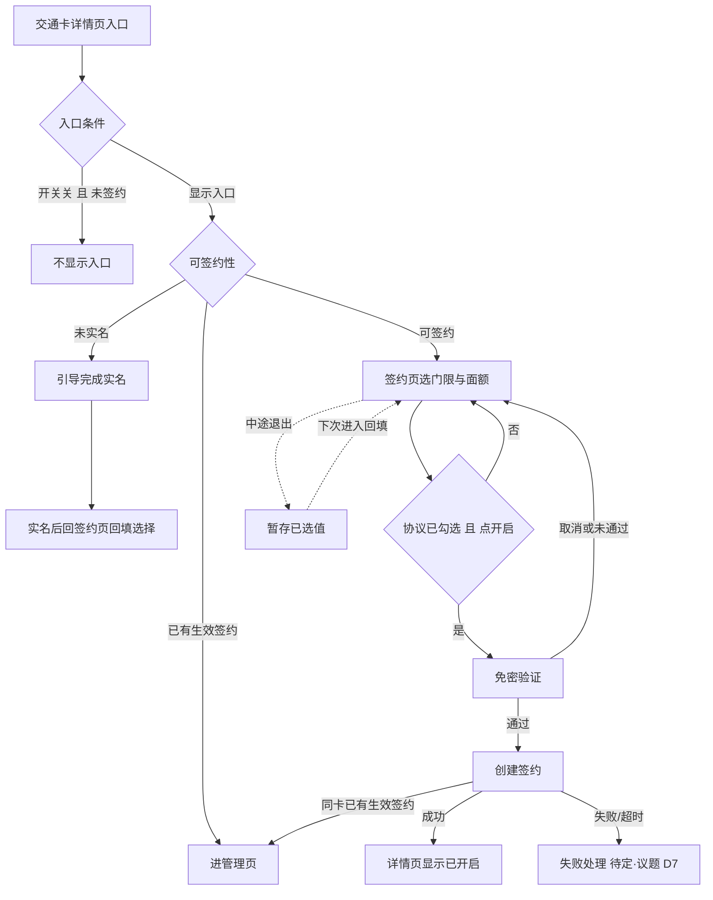
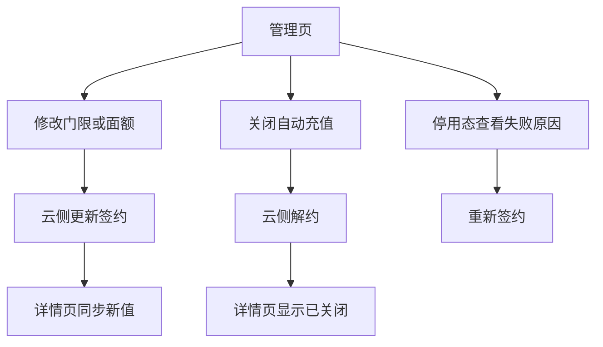
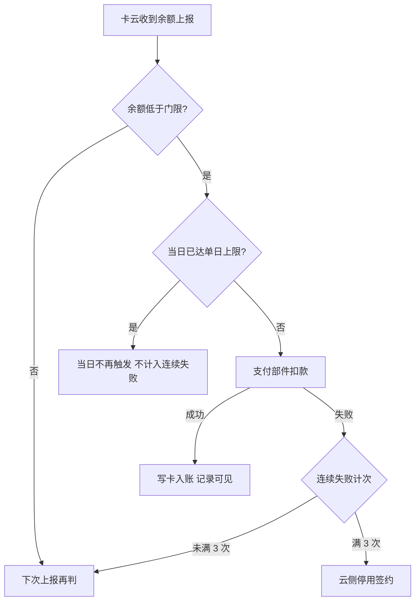
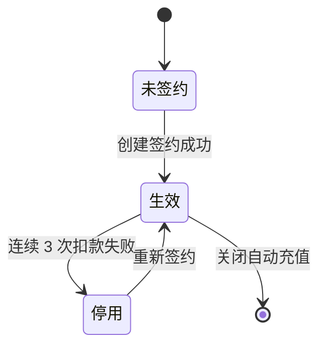

# AR90006 交通卡自动充值（钱包端）

<!--
  ══════════════════════════════════════════════════════════════════
  金样标注（分析写作物，非真实运行产物）
  - 单号/业务：AR90006 交通卡自动充值（钱包端）；写作日期：2026-09-29。
  - 判据：analysis-b5-ar90006-story-review.md（C1–C4）+ story-chapters.json 十章合同；逐章最佳来源见 factbase-AR90006.md §8。
  - 材料代：v0.5（单日充值上限 300 元代）；事实唯一真源 factbase-AR90006.md（F1–F12、AC-R1～R10、议题 D1–D12、契约实体）。
  - 归档件红线自查：主叙事零工程标识（接口/键/模块/规约编号只在附录与图源标记）；数值不带来源括注，来源归属用业务语言；议题一律 D 编号。
  - 附录投影机器区按现行形态书写、省略 sha256（写作物未经渲染）；投影标记内的表由规格技术契约投影生成，作者说明只写投影区外。
  ══════════════════════════════════════════════════════════════════
-->

## 1. 背景

交通卡余额用尽只有在闸机前才会被发现，用户被迫在人流中完成充值，这是当前交通卡投诉量最高的场景。手工充值本身并不复杂，问题在于触发时机——用户没有理由在余额还够的时候主动打开钱包。

本需求把这个时序倒过来：用户一次签约之后，余额低于自己设定的门限时由系统自动完成充值，把「想起来充值」这件事从用户身上移走。自动充值的判定与扣款全部发生在服务端，用户侧无感。这里有一条决定端侧设计的边界：判定的输入是服务端记录的余额，不是手机上显示的余额——用户离线刷卡后手机上的余额会长时间不准，按它判定会扣出用户预期之外的钱。因此触发只能由交通卡云在余额上报后决定，钱包端不存在「发起自动充值」这个动作。

### 1.1 怎样算成功

| 指标 | 目标值 | 说明 |
|------|--------|------|
| 闸机余额不足发生率 | 下降到万分之五以下 | 签约用户刷卡时余额不足的比例 |
| 签约转化率 | 不低于交通卡月活的 8% | 看到入口的用户里完成签约的比例 |

两个目标都来自产品需求，是上游给出的业务目标；钱包端用签约入口的露出与签约流程的顺畅度支撑前者、用签约转化支撑后者，但端侧不直接承诺这两个线上数值——它们依赖服务端的完整能力，是全局指标。

### 1.2 钱包端承担哪一段

自动充值这件事分散在五个参与方之间，本需求只交付钱包端的那一部分：

1. 交通卡云：持有签约关系、余额门限与充值订单，负责门限判定、订单创建与失败停用，是签约与扣款结论的唯一真源；
2. 支付部件：提供免密签约与扣款能力，拉起验证界面并执行扣款；
3. 账号能力：提供登录与实名结果，未实名不放行签约；
4. 运营管理台：下发功能开关与门限、面额档位配置；
5. 钱包端（本需求）：收集用户确认、拉起签约、展示状态与结果；不判断是否该扣款，不保存支付凭据。

钱包端要交付的能力覆盖：交通卡详情页的自动充值入口、签约页（门限与面额选择、协议勾选）、免密验证拉起、创建签约/改约/解约、管理页与充值记录展示、停用态呈现与重新签约，以及端侧缓存与中途离开的暂存。

## 2. 术语

### 2.1 术语表

| 术语 | 在本需求里的意思 | 判别边界 |
|------|------------------|----------|
| 自动充值 | 签约之后，余额低于门限时由系统自动完成充值的一整件事 | 判定与扣款在服务端；钱包端不「发起充值」，只做入口、签约交互与状态展示 |
| 签约 | 用户在钱包端完成选择、验证授权后建立的自动充值关系 | 签约关系由交通卡云持有、以合约编号标识；同卡已有生效签约时不重复建立 |
| 触发门限 | 余额低于多少元时自动充值，用户从四档中单选 | 5 / 10 / 20 / 30 元四档，与「每月固定充值」无关；也和单日充值上限是两条规则 |
| 单笔面额 | 每次自动充入多少元，用户从三档中单选 | 20 / 50 / 100 元三档，同时决定免密扣款的单笔上限 |
| 免密验证 | 首次签约时，把免密扣款授权交给支付部件并由用户当场确认的一步 | 拉起的验证界面归支付部件；钱包端只承接拉起动作与授权结果 |
| 协议号 | 支付部件在用户确认授权后返回的免密协议标识，创建签约时交给交通卡云 | 在钱包端只透传、不持久化、不进日志与埋点；与标识签约关系的合约编号是两个东西 |
| 管理页 | 开启后承载状态展示、记录列表与改约/解约入口的页面 | 已签约或停用态的卡从入口直达该页，不再重新签约 |
| 停用 | 扣款连续失败三次后，交通卡云将签约置为停用 | 停用后需重新签约；管理页能看到停用状态与失败原因 |
| 充值记录 | 自动充值成功后产生的记录 | 卡号按现有规则脱敏展示；失败记录展示失败原因 |

### 2.2 容易读混的概念

| 概念 A | 概念 B | 怎么分 |
|--------|--------|--------|
| 触发门限 | 单日充值上限 | 门限是「余额低到多少就充」（5/10/20/30 元）；单日上限是「一天最多充多少」（300 元，达到当日不再触发、次日零点恢复）。两条规则互不换算 |
| 入口可见 | 可签约 | 未实名用户能看到入口并被引导去实名，但完成实名前签不成；开关关闭时新用户入口隐藏，但已签约用户入口照常、自动充值照常。入口显示与能不能签是两件事 |
| 未实名口径（新） | 未实名口径（旧） | 本需求按已确认口径：未实名用户入口可见，点进去被引导完成实名，完成实名前签不成（旧文本「看不到入口」是早期版本残留，不采用） |
| 自动充值（后台能力） | 自动充值（钱包端交付） | 「自动充值」这个词也指交通卡云侧的判定、扣款、写卡那一整套后台能力；本需求交付的只是钱包端的签约交互与状态展示，同一词的两层含义按上下文区分 |
| 交通卡余额提醒（RR90007） | 交通卡自动充值 | 余额提醒是兄弟单 RR90007，余额低于档位时推送提醒；它与自动充值不共用门限档位，另单交付，与本需求无关 |
| 手工充值 | 自动充值 | 手工充值由用户主动触发、走普通充值流程；自动充值没有端侧触发动作，全部由服务端判定执行 |

## 3. 范围

### 3.1 本需求做什么

本需求按当前范围整体承载，不拆两份（已确认，议题 D1）。钱包端承载交通卡自动充值的完整端侧范围：签约入口、签约交互（选门限面额、免密验证、创建签约、暂存）、管理/关闭/记录（状态查询、改档、解约、停用态）、端侧缓存；判定与扣款在服务端。范围来源：开发需求标题（钱包端）加开发需求提取件预填。系统设计给出的「策略查询与创建签约」「状态查询与解约」拆法是候选方向，范围确认时已裁决整体承载、不拆分，拆分说明仅作为交付顺序参考保留。

### 3.2 参与方分工

| 参与方 | 做什么 | 不做什么 |
|--------|--------|----------|
| 钱包端（本部件） | 签约入口、签约页、免密验证拉起、管理页、改档/关闭/记录/停用展示、已选值暂存与端侧缓存 | 不判定是否该扣款、不保存支付凭据、不发起充值 |
| 交通卡云 | 门限判定、订单创建、签约/解约/更新、连续失败停用、写卡入账 | 不依赖端侧上下文的余额判断 |
| 支付部件 | 免密签约验证、扣款 | 不改变签约关系、不重复扣款 |
| 账号能力 | 登录实名结果、未实名引导 | 不定签约规则 |
| 运营管理台 | 功能开关、门限面额档位、单日上限下发 | 配置页面不属钱包端，本需求不交付其界面 |

### 3.3 本期不做什么

- 按日期或按行程预约充值、多张卡共用一份签约、家庭成员代充——三项都需要新的账户模型，不在本期范围（产品需求「不做什么」章）；
- 交通卡余额提醒（RR90007）——另单交付，与自动充值不共用门限档位；
- 充值记录按月份筛选与导出——客诉核对诉求尚未走需求流程，归属单待产品组定（议题 D12），本期只展示管理页内的最近记录；
- 充值发票开具入口——税务口径未回，评审明确暂缓、不阻塞本单（议题 D10）；
- 运营管理台的开关配置页面——属管理台，不属钱包端交付；
- 签约页小屏截图是同一页面的另一分辨率，仅作适配参考；产品稿随稿留档的旧版签约页（门限当时用输入框，评审后改四档单选）与友商三步向导式签约均不采用，本需求按现行签约页一屏内完成。

### 3.4 未实名口径

未实名用户的入口口径，以需求澄清会结论为准（议题 D4）：**未实名用户能看到自动充值入口**，点进去被引导完成实名；完成实名之前签不成。验收意图旧版文字「未实名用户看不到签约入口」与产品情形表矛盾，澄清会上已确认前者是早期版本遗留、没改掉，按情形表执行。验收按「入口可见、点入引导实名、实名前签不成」来测。

### 3.5 端侧承载边界

端侧两个常被误判为「该做判定」的点要澄清：自动充值的触发只可能在服务端余额上报后由交通卡云决定，端侧不存在「发起自动充值」的接口；用户离线刷卡后手机显示余额会失真，判定输入一律用服务端记录的余额。除此之外，本需求的端云接口、交通卡详情页入口与实名结果消费在工程内都是新增能力（工程现状无网络层封装、无交通卡详情页实现、无实名结果暴露），承载方式在计划期落定（议题 D8）。

## 4. 业务方案

### 4.1 谁说了算

自动充值拆成签约、触发、扣款、入账、停用五段，其中触发、扣款、入账全部发生在服务端。业务结果以交通卡云为准：签约关系、余额门限、充值订单都归它，钱包端展示的每一个状态都以云侧查询或缓存为来源。参与方各自的输入、输出、责任与失败边界：

| 参与方 | 输入 | 输出 | 责任 | 失败边界 |
|--------|------|------|------|----------|
| 钱包端 | 用户动作、卡片与云侧状态 | 签约请求、状态页与提示 | 收集确认、拉起签约、展示结果 | 不判断是否该扣款，不保存支付凭据 |
| 交通卡云 | 卡片、账号、余额上报、协议号 | 签约、触发、订单与扣款结果 | 门限判定、订单创建、失败停用 | 是签约与扣款结论的唯一真源 |
| 支付部件 | 协议号、订单与金额 | 签约与扣款结果 | 免密协议与扣款 | 不改变签约关系，不重复扣款 |
| 账号能力 | 登录实名请求与回跳上下文 | 合格身份或失败结果 | 提供既有身份能力 | 未实名不允许签约 |
| 运营管理台 | 运营配置 | 开关、门限与面额档位 | 配置下发 | 配置不可用按关闭处理 |

### 4.2 关键取舍

| 取舍 | 结论 | 为什么否掉另一条路 |
|------|------|--------------------|
| 改门限/面额怎么改 | 交通卡云新增更新签约接口，钱包改动时调用它，原签约关系不断（议题 D2） | 先解约再重新签约会有空窗——那几分钟余额掉下去就不会充，还要再拉一次免密验证 |
| 触发放在哪端 | 服务端判定与扣款，端侧无发起动作 | 端侧监测余额直接扣款不可行：余额真源在服务端，且扣款职责在云端，离线刷卡后端侧余额失真，会扣出用户预期之外的钱 |
| 功能开关管什么 | 只管新签约；已签约用户入口照常、自动充值照常（议题 D5） | 把开关当成整体停用会误伤存量：已签约用户的入口与管理被关掉、自动充值中断，而运营要收住的只是新增签约 |
| 验证取消/中断怎么处理 | 保留已选门限面额，可直接再试或下次续办 | 清空选择让用户从头再来是这类页面最招人烦的做法；用户取消往往只是换支付方式或临时有事，不是不想签了 |
| 端侧交付怎么切 | 整体承载一份交付（议题 D1） | 按系统设计拆两份分阶段交付会把一条签约链切成两半，联调与开放互相等待；拆分说明仅作交付顺序参考 |

### 4.3 业务规则

| 规则项 | 取值 | 说明 |
|--------|------|------|
| 触发门限档位 | 5 / 10 / 20 / 30 元 | 产品规则给定；用户签约时单选，签约后可修改 |
| 单笔充值面额 | 20 / 50 / 100 元 | 产品规则给定；与免密单笔额度绑定——单笔上限随所选面额设置，不设固定值 |
| 单日充值上限 | 300 元 | 新版产品稿由 200 元调整为 300 元（议题 D6）；达到上限当日不再触发、不计入连续失败、次日零点恢复；协议文案写明这个上限 |
| 连续失败停用 | 连续 3 次扣款失败自动停用 | 产品规则给定；停用后需用户重新签约，失败原因要能看到 |
| 功能开关语义 | 只管新签约 | 澄清会定（议题 D5）：入口显示条件是开关开或已签约；关闭时新签约暂停、已签约用户记录/改档/关闭/自动充值照常 |

### 4.4 风险

| 风险 | 触发条件 | 影响 | 已有控制 |
|------|----------|------|----------|
| 面额上调验证口径未定 | 用户在管理页把面额调高 | 交互行为可能在风控结论出来后调整 | 本期只写已定分支：只改门限与面额下调不验证；上调行为标待定、不落地（议题 D3） |
| 创建失败协议号复用未定 | 验证通过但创建签约失败/超时 | 端侧不能承诺自动复用协议号 | 回到可重试状态，用户手动重试；重试策略不写死（议题 D7） |
| 端云能力需本地承载 | 工程现状无真实卡云、网络层与实名结果暴露 | 端云接口与验证无法端到端真连 | 接口与存储按键按真实契约建模，数据层留可替换点；承载方式在计划期落定（议题 D8） |
| 配置不可用 | 运营配置拉取失败 | 入口显示与档位不可用 | 配置不可用按关闭处理，只影响新签约入口；已签约用户不受影响 |

## 5. 业务流程

自动充值两条主路径：从交通卡详情页入口到签约完成，和签约后的管理（改档、关闭、停用查看）。两条路径的触发都是用户动作；自动触发的充值本身发生在服务端、用户无感，它的过程单独立在服务端触发小节。

### 5.1 签约路径

用户在交通卡详情页点「自动充值」入口。入口的显示条件是功能开关开、或这张卡已有生效签约；都不满足时不显示。显示入口之后，端侧取一次可签约策略：确认档位、协议文案与可签约性。未实名用户被引导去完成实名，完成实名前签不成；已实名用户进入签约页，选门限与面额、勾选免密协议，点「开启」时把协议交给支付部件拉起免密验证，验证通过拿到协议号再去创建签约。

- 入口条件：开关关且未签约时不显示；其余组合都显示（已签约时入口显示、进管理页）。
- 引导实名：完成实名前签不成，实名后回到签约页，此前选的门限面额还在。
- 免密验证结果：验证通过才继续；取消或失败留在签约页，已选值保留可直接再试。
- 创建签约：同卡已有生效签约时复用既有合约编号转管理页，不重复建签；失败/超时的重试策略尚未定稿（议题 D7），在结论落地前不按固定的协议号复用时长写死。
- 中途退出：已选值暂存，下次从入口进入回填。

### 5.2 管理路径

签约建立之后，用户从入口进入管理页可以做三件事：修改门限或面额、关闭自动充值、停用后查看失败原因并重新签约。三条都从管理页出发，改档和关闭由云侧更新与解约完成。

- 修改门限或面额：走更新签约，原签约关系不断；只改门限不用重新验证，调高面额是否需要验证待支付侧敲定（议题 D3）。
- 关闭自动充值：解除后不再触发自动充值；不会回滚进行中的订单，也不会撤销已经完成的订单。
- 停用态：签约因连续扣款失败被停用后，管理页展示停用横幅与失败原因，横幅内置重新签约入口，从横幅直接重新签约（议题 D9）。
- 开关关闭：已签约用户入口照常显示、进管理页，自动充值由云侧照常执行。

### 5.3 服务端触发与扣款

签约建立后，触发与扣款都在交通卡云侧发生，用户无操作。卡云收到余额上报后判定：余额低于门限且当日未达单日上限才发起扣款；扣款失败按连续失败计次，满三次停用签约。

端侧在子流程里的职责只有承接结果：记录与状态经状态查询或签约缓存展示，停用态横幅呈现失败原因；判定、扣款、计次、停用全部由卡云完成，扣款成功但写卡未完成时订单保持「充值中」、卡云下次读卡补写，端侧不提供重试也不重复下单。

签约关系本身有一段生命周期，状态全部由交通卡云记录与改变：创建签约成功进入生效；扣款连续失败由卡云停用；停用后用户重新签约，回到生效；用户在管理页关闭自动充值则解约终结。钱包端不改变签约状态，只在状态查询与签约缓存里承接展示。

- 计次口径：扣款失败按连续失败计次，满 3 次自动停用，产品规则给定；当日已达单日上限时不再触发、不计入连续失败，次日零点恢复。
- 停用态：管理页顶部换成停用横幅并展示失败原因，横幅内置重新签约入口（议题 D9）。
- 重新签约：从停用横幅进入签约流程、建立新签约；重签即再次签约。

## 6. 功能说明

### 6.1 详情页自动充值入口

交通卡详情页上「自动充值」是一整行入口，位于余额行之下、充值记录之上。显示与去向由开关和签约状态组合决定：

| 入口条件 | 是否显示 | 点入去哪 | 受限时去向 |
|----------|----------|----------|------------|
| 开关开 且 未签约 | 显示 | 签约流程 | 未实名先引导实名 |
| 开关开 且 已签约 | 显示 | 管理页 | — |
| 开关关 且 已签约 | 显示 | 管理页 | 自动充值照常 |
| 开关关 且 未签约 | 不显示 | — | 新签约暂停（议题 D5） |
| 已停用 | 显示 | 管理页查看原因 | 从停用横幅重新签约 |

### 6.2 签约页

签约页一屏内完成签约选择：门限单选（5/10/20/30 元）、面额单选（20/50/100 元）、免密扣款协议勾选。「开启」按钮在两项都选好且协议勾选后才可点；返回详情页时已选值暂存。视觉沿用详情页现有样式；小屏机型截图仅作适配参考，不是另一个页面。

### 6.3 免密验证

用户点「开启」后，钱包把协议文案与授权协议号交给支付部件，由它拉起验证界面；单笔额度即所选面额，协议文案写明单日最多充 300 元。用户当场确认后，支付部件把授权结果返回钱包。验证通过才用协议号去创建签约；取消或验证未通过时云侧不产生任何签约记录，用户停留在签约页，已选的门限与面额保留，可直接再次开启。

### 6.4 创建签约

拿到授权协议号后，钱包调云侧创建签约，入参为账号、卡片、协议号、门限、面额。同一个卡片已经有生效签约时，接口返回既有合约编号，钱包据此转到管理页，不重复建立签约。创建成功后详情页显示「自动充值已开启」与当前门限、面额。

### 6.5 未实名引导

未实名用户能看到入口，点入后不是进签约页，而是被引导去账号能力完成实名。完成实名之前签不成；实名完成后回到签约页，此前选的门限与面额还在，可以接着往下签。

### 6.6 已选值暂存

签约过程中验证失败、取消或用户中途退出时，已选的门限与面额暂存在本账号本卡的范围内，退出登录即清除。下次从入口进来时按暂存值回填，不必从头选一遍。

### 6.7 管理页与记录

管理页顶部展示当前签约状态（自动充值已开启）与当前门限、面额；下方是最近的自动充值记录，失败记录要展示失败原因；卡号按现有规则脱敏。连续扣款失败停用之后，管理页顶部换成停用横幅并给出失败原因。

### 6.8 修改门限或面额

管理页修改门限或面额走云侧更新签约，入参为合约编号、新的门限、面额，原签约关系不断。只改门限不涉及额度、不需要重新验证（澄清会已定）；调高面额时免密额度变大，是否需要重新验证待支付侧与风控确认（议题 D3），面额下调的处理同样待口径。结论出来前，正文只承诺已明确的部分。

### 6.9 关闭自动充值

管理页关闭自动充值调用云侧解约。解除后不再触发自动充值；不会撤销进行中的订单，也不会回滚已经完成的订单——这是不可逆的用户动作，关闭前有二次确认。

### 6.10 停用态查看与重新签约

签约因连续扣款失败被服务端停用后，管理页展示停用横幅与失败原因，横幅内置重新签约入口。用户从横幅点击即可进入签约流程，建立新签约（议题 D9）。

### 6.11 端侧缓存与暂存

| 数据项 | 存什么 | 何时清除 | 用途 |
|--------|--------|----------|------|
| 签约缓存 | 合约编号、门限、面额、状态 | 退出登录、清除应用数据 | 免网展示签约状态；缺失时以云侧查询为准 |
| 已选值暂存 | 已选门限、已选面额 | 退出登录、清除应用数据 | 验证失败/退出后回填 |

两处存储都按账号隔离、退出登录清除、不参与备份恢复；缓存缺失或失效时以云侧查询结果为准。清除应用数据后功能回到未签约展示，入口仍在，重新走签约页即可，不崩溃、不死循环。

## 7. 异常与恢复

### 7.1 设计内的受限结果

这些是正常业务中受到限制的结果，不是失败，不改业务去向：

| 受限结果 | 触发条件 | 用户看到什么 | 后续 |
|----------|----------|--------------|------|
| 已达单日上限 | 当日累计充值达 300 元 | 记录/状态正常展示，不显示为失败 | 当日不再触发、不计入连续失败，次日零点恢复 |
| 开关关闭 | 运营关闭功能开关 | 新用户看不到入口；已签约用户无感知 | 已签约用户入口照常、自动充值照常 |
| 扣款成功但写卡未完成 | 服务端扣款成功、写卡中断 | 记录显示「充值中」 | 卡云下次读卡补写，端侧不重试、不重复下单 |
| 不可签约（实名外原因） | 策略返回不可签约 | 不拉起免密协议 | 停在当前去向 |

### 7.2 真正的异常与恢复

| 异常 | 触发条件 | 影响 | 用户看到什么 | 恢复方式 |
|------|----------|------|--------------|----------|
| 网络断开/接口超时 | 策略/状态/创建/更新/解约请求失败或超时 | 本次动作未完成 | 「数据不可用、请稍后再试」；管理页断网时用签约缓存展示 | 重试；不重复下单 |
| 未实名 | 账号未完成实名 | 无法建签 | 引导去完成实名 | 实名后回签约页，选择仍在 |
| 免密验证取消/失败 | 用户取消验证或验证未通过 | 不创建签约关系，不留半签约状态 | 留在签约页 | 已选值保留，直接再次开启 |
| 创建签约失败/超时 | 验证通过但创建失败或超时 | 云侧无签约记录 | 展示失败、可重试 | 重试（重走验证流程）；协议号复用时长待两端对齐，端侧不承诺自动复用（议题 D7） |
| 连续失败停用 | 连续 3 次扣款失败 | 签约被服务端停用 | 管理页停用横幅与失败原因 | 从横幅直接重新签约 |
| 清除数据/缓存 | 用户或系统清除应用数据 | 签约缓存与已选值被清空 | 回默认档位/未签约态 | 以云侧结果重建，不崩溃不死循环 |
| 重复快速点击 | 入口/开启/关闭被连续点击 | 重复请求 | 单次响应 | 防重入防抖，不重复弹窗不下单 |

### 7.3 恢复路径

- **清除数据后**：签约缓存与暂存同时清空，重新进入入口时以云侧查询结果重建展示，签约页回到默认档位，不需要用户做任何修复动作。
- **签约过程中断**：验证取消、验证失败或中途退出都不清空已选值；回来时按暂存回填，从上一步继续，不重走整个签约。
- **防重复**：对一个在途的创建签约请求不做二次提交，同时依靠云侧「同卡已有生效签约返回既有合约编号」的幂等行为，重复进入最终都收敛到管理页。

### 7.4 尚未决定的口径

两处口径还没有结论，正文只写已确定的部分。其一，调高面额是否要重新免密验证：已确定的是只改门限不动面额、以及面额下调都不需要验证；未确定的是面额上调——支付侧要与风控确认（议题 D3），在结论出来之前不落地任何一种上调交互。其二，创建签约失败/超时后的收口：已确定的是端侧停在签约页、不丢已选门限与面额；未确定的是能否复用同一个协议号重试以及协议号的有效期规则——支付侧提示协议号有效期可能跟随验证会话而不是固定时长，需要与卡云对齐（议题 D7）。在结论出来之前，不按「十分钟可复用」写死；结论补齐前，失败即视为本次未完成，留在签约页由用户再试。

## 8. 验收

产品需求给了九条可测的口径，其中未实名口径已在需求澄清会改写（议题 D4）；评审补充了一条停用横幅重签验收（议题 D9，沿用上游编号顺延为 AC-R10）。下面按「要验的事」分组，每条给可观察的通过条件与主责。

### 8.1 入口与实名

| 编号 | 验收点 | 可观察的通过条件 | 主责 |
|------|--------|------------------|------|
| AC-R1（改写后） | 未实名用户 | 入口可见；点入被引导去实名；完成实名前无法完成签约 | 产品 / 测试 |
| AC-R9 | 已签约再进入 | 已有生效签约的卡再点入口，进入的是管理页而不是重新签约 | 测试 |
| AC-R4 | 功能开关关闭 | 关闭后新签约暂停：开关关且未签约的用户看不到入口；已签约用户入口仍显示、直达管理页，记录、改档与关闭照常，自动充值照常发生 | 测试 |

### 8.2 签约与重试

| 编号 | 验收点 | 可观察的通过条件 | 主责 |
|------|--------|------------------|------|
| AC-R2 | 签约后自动充值 | 余额低于门限时用户不做任何操作即完成充值，并能在记录里看到这笔 | 测试 |
| AC-R7 | 验证取消后重试 | 用户在支付验证界面取消，回到签约页时刚才选的门限与面额仍在，可直接再次开启 | 测试 |
| AC-R8 | 实名后续办 | 未实名用户被引导去实名，完成后回到签约页，此前的选择仍在，可继续签约 | 测试 |

### 8.3 管理、修改与关闭

| 编号 | 验收点 | 可观察的通过条件 | 主责 |
|------|--------|------------------|------|
| AC-R6 | 修改与关闭 | 签约后可修改门限面额并按新值生效、原签约不断；关闭后不再触发自动充值 | 测试 |
| AC-R5 | 记录展示 | 充值记录中的卡号按现有规则脱敏展示；失败记录展示失败原因 | 测试 |

### 8.4 停用

| 编号 | 验收点 | 可观察的通过条件 | 主责 |
|------|--------|------------------|------|
| AC-R3 | 连续失败停用 | 扣款连续失败三次后自动停用，用户打开管理页能看到停用状态与失败原因 | 测试 |
| AC-R10 | 停用后重签（议题 D9 补充） | 停用横幅内置重新签约入口，用户从横幅能直接重新签约 | 测试 |

### 8.5 未决项的条件验收

面额上调验证的验收只覆盖已明确的分支：只改门限不动面额不需要验证、面额下调不需要验证；依赖「上调是否重验证」的行为不接受先写成一种而不留余地，待支付侧与风控结论补齐后按结论补验收条件（议题 D3）。创建签约失败重试的验收保持条件式：已验收的部分是「失败/超时后停留在签约页、不丢已选门限与面额」；协议号复用与重试策略在结论补齐前不写入通过条件（议题 D7）。

### 8.6 上线后观察什么

按埋点设计（附录「签约流程成功率」「管理操作成功率」），上线后观察两个比率：从进入签约页的首次尝试走到创建签约成功的比例，以及按用户显式操作发起的管理操作成功比例；失败原因随上报带上，作为定位入口。页面进入与点击不进统计；验证取消按用户主动取消计，重试是新尝试。签约页首屏 1500 毫秒内可见的阈值是本轮自设的工程要求，上游材料没有给过数值，已登记议题请评审人认可（议题 D11）。闸机余额不足发生率与签约转化率两个业务目标来自产品需求，为服务端全局指标，不等同于钱包端验收。

## 9. 交付与上线

### 9.1 依赖与开放顺序

端云接口的联调与开放按依赖先后排：合约编号在创建签约成功之后才产生，状态查询与解约都以它为前提，所以签约链路先行、管理链路随后。

运营配置与本需求同版本上线：功能开关、门限与面额档位、单日上限需可下发才开放签约入口。支付部件免密验证能力在签约链路联调期对齐；能力不可用时隐藏新签约入口，不阻塞已签约用户。

### 9.2 开关与回退

| 控制对象 | 怎样启用/关闭 | 控制到哪为止 | 进行中业务 |
|----------|---------------|--------------|------------|
| 自动充值功能开关 | 运营管理台下发，经策略接口的可签约性承载 | 只控制新签约：关闭时未签约用户入口不显示 | 已签约用户的入口与自动充值照常，记录/改档/关闭不受影响 |
| 配置不可用兜底 | 配置拉取失败按关闭处理 | 同上，只影响新签约入口 | 已签约用户不受影响 |
| 版本回退 | 端侧版本回退到上线前 | 回退版本无自动充值能力 | 云侧已有签约不因端侧回退受影响，重新进入功能以云侧查询为准 |

### 9.3 交付物

| 交付物 | 给谁 | 做什么用 | 什么时候要 |
|--------|------|----------|------------|
| 免密扣款协议文案（写明单日最多充 300 元、单笔上限随所选面额） | 钱包端签约页 | 用户勾选前阅读确认 | 与功能同版本上线 |
| 界面（详情页入口/签约页/验证/管理页/停用态五屏） | 产品与测试 | 上线展示与验收 | 与功能同版本发布 |
| 端云接口字段清单（五个接口） | 交通卡云与支付侧 | 联调创建签约、更新、解约、策略与状态查询 | 联调前对齐 |
| 运营配置（开关/档位/单日上限） | 运营管理台 | 覆盖本期取值 | 与本需求同版本上线 |
| 待翻译字符串清单 | 翻译 | 回稿后合入资源 | 随文案定稿 |

### 9.4 回退点与不可逆结果

本需求随版本发布，无独立部署动作；接口按开放顺序开放，状态查询与解约联调异常时可退回只保留签约链路。不可逆的结果要明说：关闭自动充值不撤销已完成的充值订单、不回滚进行中的订单；已完成的自动充值记录与已解约的签约不随端侧回退撤销，云侧已有签约继续执行。

## 10. 附录

这一章把正文里用到的精确名称（端云接口、数据存储、配置项、统计点）与规约判断集中在一起，供查阅与核对；正文读到的接口、缓存键与测点都能在这里找到定义。

### 10.1 技术契约

这一节能查到本需求新引入的端云接口、存储键、配置项与依赖的精确名称，正文用中文业务名，这里是对应。

#### 10.1.1 端云接口

<!-- story-build:begin 技术契约·端云接口 · 由spec 「宿主扩展治理项 › 技术契约 › 端云接口」生成，改它请改真源 -->
| 接口 | 性质 | 输入 → 输出 | 错误码 |
|---|---|---|---|
| `getAutoTopupPolicy` | 新增 | 账号、卡片 → 可签约性、门限档位、面额档位、单日限额、协议文案 | 无新增 |
| `createAutoTopupContract` | 新增 | 账号、卡片、`agreementNo`、门限、面额 → `contractNo`（同卡已有生效签约返回既有 contractNo） | 新增错误码（不可签约、未实名、开关关闭、已达单日上限等语义类） |
| `getAutoTopupStatus` | 新增 | 账号、卡片 → 签约状态、当前门限面额、最近记录、连续失败次数、停用状态 | 无新增 |
| `cancelAutoTopupContract` | 新增 | `contractNo` → 解约结果（不回滚进行中订单） | 无新增 |
| `updateAutoTopupContract` | 新增（议题 D2） | `contractNo`、门限、面额 → 更新结果，原签约不断 | 无新增 |
<!-- story-build:end -->

主叙事里的「策略查询、创建签约、状态查询、更新签约、解约」对应端云五个接口，均为新增，纯新增字段、不删旧字段；新增错误码不修改既有码。

#### 10.1.2 数据存储

<!-- story-build:begin 技术契约·数据存储 · 由spec 「宿主扩展治理项 › 技术契约 › 数据存储」生成，改它请改真源 -->
| 键名/表名 | 介质 | 值结构 | 有效期 | 用途 |
|---|---|---|---|---|
| `wallet_auto_topup_contract` | AppStorage | `{ contractNo, threshold, amount, status }` | 会话内；按账号隔离，退出登录清除，不参与备份恢复 | 免网展示签约状态，缓存缺失以云侧为准 |
| `wallet_auto_topup_draft` | AppStorage | `{ threshold, amount }` | 会话内；本账号本卡有效，退出登录清除 | 签约失败/取消/中途退出后回填已选值 |
<!-- story-build:end -->

主叙事里的「签约缓存」与「已选值暂存」对应上面两个键；均按账号隔离、退出登录清除、不参与备份恢复，值结构不含卡号、支付参数与协议号。

#### 10.1.3 配置项

<!-- story-build:begin 技术契约·配置项 · 由spec 「宿主扩展治理项 › 技术契约 › 配置项」生成，改它请改真源 -->
| 配置项 | 默认值 | 关闭态行为 | 历史版本兼容 |
|---|---|---|---|
| `auto_topup_signup_enabled`（运营功能开关，云侧下发经 `getAutoTopupPolicy` 可签约性承载） | 开（可签约） | 新签约暂停：开关关且未签约不显示入口；已签约用户入口与自动充值照常（议题 D5） | 旧版本读不到开关值按关闭处理，只影响新签约入口 |
| 门限档位 / 面额档位 / 单日上限 | 5/10/20/30、20/50/100、300 元 | 由策略接口下发，直接影响签约页选项与协议文案 | 由策略接口下发，端侧不作第二真源 |
<!-- story-build:end -->

主叙事里的「功能开关」「门限档位/面额档位/单日上限」由运营管理台经策略接口下发；开关关闭只影响新签约入口，已签约用户照常。

#### 10.1.4 依赖变更

<!-- story-build:begin 技术契约·依赖变更 · 由spec 「宿主扩展治理项 › 技术契约 › 依赖变更」生成，改它请改真源 -->
不涉及：Scope 内模块依赖声明无需变更（编排 SDK 已由既有模块按项目惯例声明，无新增 SDK/组件；支付部件免密验证为既有跨应用交互面、只用不改，能力不可用时隐藏新签约入口）。
<!-- story-build:end -->

### 10.2 规约

这一节列出命中与未命中的规约条目及其依据；正文用中文规约名，编号在这里。

<!-- story-build:begin 规约 · 由spec/knowledge-use.yaml生成，改它请改真源 -->
| 规约域 | 编号 | 判定 | 依据 |
|---|---|---|---|
| UX 一致性 | UX-01 | 命中 | 新增签约页、管理页、详情页入口的方向性参数一律用 start/end，文本对齐用 TextAlign.Start/End，不得出现 left/right 定位 |
|  | UX-01 |  | 页面内不自绘 Canvas 镜像逻辑，图标/文案方向性跟随系统 RTL 切换，阿语下镜像正确 |
| 安全隐私 | SEC-01 | 命中 | 充值记录展示时卡号在采集处用 MaskUtil.maskAccount 脱敏后展示，不得以明文卡号进入任何输出出口 |
|  | SEC-01 |  | agreementNo 只透传调用创建签约接口，不持久化、不写入 AppStorage/日志/上报字段 |
|  | SEC-01 |  | 端侧事件只含去标识账号、卡片类型、阶段、结果分类，不得含卡号、金额明细或支付参数 |
|  | SEC-01 |  | 签约页、管理页本地日志不打印卡号、协议号或支付凭据 |
| DFX 基线（性能/功耗/ROM/RAM） | DFX-01 | 命中 | getAutoTopupPolicy/getAutoTopupStatus 仅在进入入口与进入管理页各查询一次（本工程设定，无上游依据），不设定时拉取或后台轮询 |
|  | DFX-01 |  | 端侧以 wallet_auto_topup_contract 缓存承担免网展示，缓存命中时不调 getAutoTopupStatus |
|  | DFX-01 |  | 签约/管理流程端云接口调用次数按用户动作（点开启/改档/关闭）为 1 次（本工程设定，无上游依据），无并发重复调用 |
| DFX 基线（性能/功耗/ROM/RAM） | DFX-02 | 不命中 | 命中条件是新增预置资源或 SDK 依赖；本需求新增页面沿用交通卡详情页既有视觉规范，界面图标走系统符号，无新增图片资源或 hap 包，无新增 SDK 依赖 |
| 可观测性 | OBS-02 | 命中 | 签约、创建、改档、关闭、停用五个关键业务步骤用 CommFunc.Logger 记录步骤与关键状态，复用既有统一入口，不另造日志封装 |
|  | OBS-02 |  | 统计点位的定位信息（失败原因、远端返回状态）随统计事件描述带，不单独记定位事件 |
| 可观测性 | OBS-03 | 命中 | 签约成功/失败、创建签约各结果、改档/关闭各结果落实为流程级统计点，点位按业务动作划分，同一次尝试只记一次 |
|  | OBS-03 |  | 重试是新尝试，未进入的步骤不记，页面进入与点击不进统计 |
| 可观测性 | OBS-05 | 命中 | 上报事件的身份（模板/流程/步骤）、结果分类、内码、描述按项目协议落实，各字段取值来源明确 |
|  | OBS-05 |  | 描述中的关键值取自对应响应或回调的实际返回，不虚构远端未发生的结果 |
| 可观测性 | OBS-06 | 命中 | 新增事件编码核对既有登记，复用同语义已有值；新内码唯一且不与既有编码冲突 |
|  | OBS-06 |  | 沿用既有上报模板（模板枚举 Wallet_COMMON），变更时保持既有含义与消费方兼容 |
| 可观测性 | OBS-07 | 不命中 | 命中条件是有独立运营采集诉求或方案拟新增 BI 事件；本需求统计设计为运维指标（流程成功率，经项目统一上报入口），材料未提出运营采集诉求，不新增 BI 事件 |
| 资源使用 | RES-01 | 命中 | 签约页、管理页、详情页入口图标取自系统符号，不新引入图片资源；界面参考图仅作视觉参考不进运行资源 |
|  | RES-01 |  | 如需新增图片须逐张说明来源级别与实际体积（单张不超过 10KB） |
| 资源使用 | RES-02 | 命中 | 新页面用户可见文案优先复用工程已有 string 资源中中文完全一致的条目；确需新增的按项目惯例定义并引用，中英文齐备 |
|  | RES-02 |  | 新增文案清单与 DLV-01 翻译跟踪一致 |
| 兼容性检查表 | COMPAT-01 | 命中 | 新增接口 getAutoTopupPolicy/createAutoTopupContract/getAutoTopupStatus/cancelAutoTopupContract/updateAutoTopupContract 均为纯新增，不删除或改写旧版依赖字段 |
|  | COMPAT-01 |  | 新增出参字段（门限档位、面额档位、单日上限、协议文案、连续失败次数、停用状态）兼容旧版缺失场景，端侧按可空/缺省处理 |
| 兼容性检查表 | COMPAT-02 | 命中 | 新增错误码（不可签约、未实名、开关关闭、已达单日上限等）不修改既有码的编号与含义 |
|  | COMPAT-02 |  | 端侧收到未知新错误码时按通用失败处理，不对旧码语义做假设 |
| 环境异常标准场景库 | ENV-01 | 命中 | 清除数据/缓存后 wallet_auto_topup_contract 与 wallet_auto_topup_draft 清空，重进入口以云侧查询结果重建，不崩溃不死循环 |
|  | ENV-01 |  | 暂存缺失时签约页回到默认档位，管理页按未签约态处理 |
| 环境异常标准场景库 | ENV-02 | 命中 | 详情页入口与签约页「开启」按钮防重入：重复点击同一入口不重复弹窗、不重复调创建 |
|  | ENV-02 |  | createAutoTopupContract 对同卡已有生效签约幂等复用既有 contractNo，不重复建立签约；关闭/改档防重复提交，进行中态禁用按钮 |
| 资料交付 | DLV-01 | 命中 | 新增用户可见文案梳理成待翻译字符串清单，跟踪翻译回稿并合入资源 |
|  | DLV-01 |  | 新增字符串资源与清单一一对应，中英文齐备 |
| 资料交付 | DLV-02 | 不命中 | 命中条件是新增或改动对外开放的页面入口或接口；本需求新增页面均为钱包端内部页面（入口在详情页内部），云接口为本部件作为客户端去调云端，不构成对外开放面，无要求归档的对外说明 |
<!-- story-build:end -->

### 10.3 埋点

这一节列出自动充值相关统计指标、统计点与结果定义，实现层取值由实施与联调落实。

<!-- story-build:begin 埋点 · 由spec 「宿主扩展治理项 › 埋点」生成，改它请改真源 -->
本需求观察签约与管理的业务结果，为签约成功/失败定位与运营复盘提供口径。项目既有上报入口为公共能力模块导出的 Chart/VOC 上报封装（模板枚举当前仅 Wallet_COMMON），仓内目前无业务调用（建设差距），本需求在既有封装之上新增流程级统计点，不另造上报通道。统计边界：页面进入与点击不进统计；验证取消按用户主动取消计；重试是新尝试；一次创建尝试只结算一次（settle 防重）；云侧扣款后写卡补写由云侧统计，端侧不虚构结果。

#### 10.3.1 签约流程成功率

衡量一次完整签约走到成功终态的比例：创建成功的尝试 / 进入签约页的首次尝试；每次上报带失败原因（验证取消、接口失败、未实名等）与走的路径。打点在签约流程的策略查询、免密验证、创建签约三个必要步骤；停用后的重新签约走本指标（重签即再次签约）。

| 统计点 | 业务动作 | 实际适用结果 | 本端获知时机 | 已有覆盖或新增 |
|---|---|---|---|---|
| 签约流程 / 策略查询 | 查询可签约性与档位 | 成功 / 不可签约 / 请求失败 | 策略查询响应或通信失败 | 新增 |
| 签约流程 / 免密验证 | 拉起免密授权 | 授权成功 / 用户取消 / 验证失败 | 验证回调 | 新增 |
| 签约流程 / 创建签约 | 提交 createAutoTopupContract | 成功（含复用既有 contractNo）/ 用户方失败 / 云侧失败 / 请求失败 | 创建响应或通信失败回包 | 新增 |

#### 10.3.2 管理操作成功率

衡量管理路径按用户显式操作完成的比例：成功操作次数 / 全部管理操作次数；每次上报带失败原因（取自更新/解约接口响应错误码）。连续失败停用的判定发生在卡云，端侧只记载用户操作结果。

| 统计点 | 业务动作 | 实际适用结果 | 本端获知时机 | 已有覆盖或新增 |
|---|---|---|---|---|
| 管理流程 / 修改门限面额 | 提交 updateAutoTopupContract | 成功 / 云侧失败 / 请求失败 | 更新响应 | 新增 |
| 管理流程 / 关闭自动充值 | 提交 cancelAutoTopupContract | 成功 / 云侧失败 / 请求失败 | 解约响应 | 新增 |
<!-- story-build:end -->

### 10.4 改动边界

本需求改动面为钱包主 feature（页面、仓库、缓存与暂存）与宿主路由登记两个位置；账号能力、公共组件与公共工具只做只读复用。云侧、支付、账号能力与运营管理台为实现方各自能力，非本部件交付。

<!-- story-build:begin 改动边界 · 由spec 的 Scope 声明生成，改它请改真源 -->
| 模块 | 本单怎么动 |
|---|---|
| WalletMain | 改动 |
| Phone | 改动 |
| AccountManager | 不改 |
| CommUI | 不改 |
| CommFunc | 不改 |
<!-- story-build:end -->

主叙事里「钱包端承载」对应 WalletMain；「宿主路由登记」对应 Phone 的导航映射分支——新增页面必须在该分支加名字映射，这是 Phone 入围改动范围的原因。若下游想把逻辑提到公共模块，须先发起 scope 扩展提议。

### 10.5 材料清单

- 产品需求：[prd.md](../RR/prd.md)——背景目标、用户旅程、界面设计、签约情形表、产品规则、验收意图（AC-R1～AC-R9 编号来源），是范围与验收章的主依据
- 系统设计：[design.md](../SR/design.md)——整体协作分工、本轮拆分建议、端云接口与数据、失败与恢复、数据保护与交付，是业务方案与技术契约的主依据
- 开发需求：[design.md](design.md)——本单承载边界、交互方分工索引与上游已声明线索
- 会议原件：[交通卡澄清会记录-0903.docx](../inbox/交通卡澄清会记录-0903.docx)——改档走更新接口、未实名口径改写、开关只管新签约、单日上限与协议文案、面额上调与协议号复用两条未决口径、记录筛选导出归属未定的结论来源
- 产品原稿：[交通卡自动充值-v2.docx](../inbox/交通卡自动充值-v2.docx)——v0.5 改版稿：界面参考图（入口/签约/验证/管理/停用五屏）、单日上限由 200 元调整为 300 元、协议文案同步与验收意图条列
