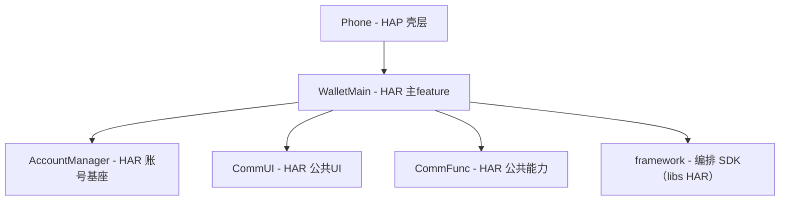
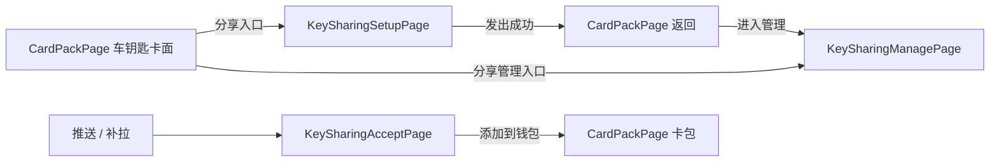

# 数字车钥匙分享（钱包端）— 实现计划（plan）

<!--
  金样标注（分析写作物，非真实运行产物）：
  - 本文是 1.9.9 B5 分析按「逐章最佳写法档案 + 事实基线」写出的金样，非某次真实运行的原生产物；
  - 写作日期 2026-09-29；判据 C1–C4 与材料代指见 factbase-ISSUE-206.md 头部；
  - §2 按现行 core 模板取「路径 | 职责 | 新增/修改」三列表（该形态在历史快照中从未出现，金样按现行模板定为正确形态）；
  - §9 按现行「宿主扩展」四节固定序：9.1 项目知识 / 9.2 规约 / 9.3 设计模式 / 9.4 埋点；
  - 埋点逐点表按 event-tracking 知识九列（统计点/结果/责任方法/事件 ID/内码/结果分类/描述/外码来源/去重与验证）。
-->

> **模块标识**: `ISSUE-206`
> **对应 spec**: `doc/features/ISSUE-206/spec/spec.md`
> **版本**: v1.0
> **创建日期**: 2026-09-29
> **最后更新**: 2026-09-29
> **状态**: 草稿
>
> **真源说明**：`plan.md` = 契约草案/来源（ephemeral）；`contracts.yaml` / `use-cases.yaml` = **机器契约真源**（coding / review / UT / harness 优先读取）。

---

## Scope 声明与继承

> **本节继承自 spec 的 Scope 声明。**
> coding 的 git diff 不得越界到 `in_scope_modules` 之外的模块。

### Scope 概览

| 字段 | 取值 | 说明 |
|------|------|------|
| 继承自 spec | `true` | 直接继承 spec 的 in/out_of_scope_modules，plan 阶段无新增扩展 |
| 本计划允许修改的模块 | `WalletMain`、`Phone` | WalletMain 承载分享业务；Phone 仅 navDestinationMap 新增 3 个分享页名字分支（spec 已限定仅此注册动作） |
| 明确不修改的模块 | `CommFunc`、`CommUI`、`AccountManager` | 只读用既有导出（MaskUtil/Logger/WalletHAManager、通用组件、登录态），不新增跨模块接口 |
| 已获用户批准的扩展 | 无（`expansions_with_user_approval: []`） | 新增页面的宿主注册已在 spec 范围内（三处登记工程惯例），plan 未引入新的范围扩展 |

### Scope 结构化字段（供 Harness 校验，必填）

```yaml
inherited_from_prd: true
in_scope_modules:
  - WalletMain
  - Phone
out_of_scope_modules:
  - CommFunc
  - CommUI
  - AccountManager
rationale: |
  WalletMain 承载全部分享业务（页面、交互编排、领域、数据、埋点责任方法）；Phone 仅为
  新增分享页面在宿主 navDestinationMap 注册名字分支（spec Scope 已限定仅此注册动作，
  三处登记工程惯例），不改动任何业务实现。CommFunc/CommUI/AccountManager 列为
  out_of_scope 消费面：只读用既有导出（MaskUtil/Logger/WalletHAManager、
  SectionCard/ActionListItem/showToast/Maison* 组件、AccountService/AppStorage 键），
  不新增这些模块的对外接口。若后续发现需要新增跨模块接口，属 scope 扩展，须停下再走提议。
expansions_with_user_approval: []
```

### 架构影响声明 (architecture_impact)

```yaml
architecture_impact:
  impact: none
  affected_items: []
  architecture_md_updates: []
  catalog_updates: []
```

> 判定注：所有功能点落入既有模块集合内，不新增/下线模块、不改外层依赖与内层顺序，属既有模块内新增页面/接口/数据模型，`impact: none`。

---

## 1. 模块架构图



| 模块 | 所属层 | 格式 | 变更类型 | 说明 |
|--------|--------|------|----------|------|
| WalletMain | 02-Feature | HAR | 修改 | 新增分享设置页、分享管理页、接受页、入口卡片与卡片详情、页面交互编排、领域服务、Repository（本地模拟六接口）、草稿存取、统计编码登记与埋点责任方法 |
| Phone | 01-Product | HAP | 修改 | navDestinationMap 新增「KeySharingSetupPage」「KeySharingManagePage」「KeySharingAcceptPage」3 个名字分支（用 WalletMain 导出的 builder 渲染，无业务实现） |
| AccountManager | 04-BusinessBase | HAR | 不改（仅消费） | 消费登录态与账号标识（AppStorage 既有键、AccountService） |
| CommUI | 05-SystemBase | HAR | 不改（仅消费） | 消费 SectionCard/ActionListItem/showToast、MaisonPrimaryButton/MaisonNavBar/MaisonDetailSection/MaisonSelector |
| CommFunc | 05-SystemBase | HAR | 不改（仅消费） | 消费 MaskUtil.maskAccount、Logger、WalletHAManager（Chart/VOC 上报）与 NavPathContext |

依赖方向：01-Product → 02-Feature → 04-BusinessBase/05-SystemBase；跨模块 import 一律走各模块 index.ets 出口，禁深路径 import。编排 SDK 以 oh 包名 `framework` 引用（libs HAR，WalletMain oh-package 已声明）。

---

## 2. 目录/文件结构规划

| 路径 | 职责 | 新增/修改 |
|------|------|-----------|
| 02-Feature/WalletMain/src/main/ets/index.ets | 导出分享各页面 builder（宿主 navDestinationMap 消费的出口） | 修改 |
| 02-Feature/WalletMain/src/main/ets/shared/constant/KeySharingConstants.ets | 开关、草稿键、幂等前缀、脱敏/事件常量 | 新增 |
| 02-Feature/WalletMain/src/main/ets/shared/utils/KeySharingChartCodes.ets | 分享四统计点流程/步骤/内码登记（先立文件与常量，编码登记见 9.4.3） | 新增 |
| 02-Feature/WalletMain/src/main/ets/data/model/KeySharingStatus.ets | 分享六态枚举 | 新增 |
| 02-Feature/WalletMain/src/main/ets/data/model/KeySharingQuota.ets | 配额模型（剩余可分享数、满额原因） | 新增 |
| 02-Feature/WalletMain/src/main/ets/data/model/GrantablePermission.ets | 权限档位模型与查询结果（含档位文案、不可分享原因） | 新增 |
| 02-Feature/WalletMain/src/main/ets/data/model/KeySharingDraft.ets | 发起草稿模型（对象/权限/有效期/幂等标识） | 新增 |
| 02-Feature/WalletMain/src/main/ets/data/model/KeySharingEntry.ets | 分享列表条目模型（对象脱敏标识、状态六态） | 新增 |
| 02-Feature/WalletMain/src/main/ets/data/model/KeySharingOperationResult.ets | 创建/接受/撤销操作结果（状态收窄与失败分类） | 新增 |
| 02-Feature/WalletMain/src/main/ets/data/model/ShareRecipient.ets | 对方脱敏标识承载（昵称+打码账号） | 新增 |
| 02-Feature/WalletMain/src/main/ets/data/repository/KeySharingRepository.ets | 端云六接口 + 草稿本地存取（本期 mock 承载，替换点集中在此） | 新增 |
| 02-Feature/WalletMain/src/main/ets/domain/service/KeySharingService.ets | 业务编排：创建/接受/撤销/列表/草稿恢复；扛统计结算（settle*） | 新增 |
| 02-Feature/WalletMain/src/main/ets/domain/service/KeySharingCloudGateway.ets | 端云接口网关（抽象，mock 实现） | 新增 |
| 02-Feature/WalletMain/src/main/ets/domain/flow/ShareSetupPageOperates.ets | page-interaction 动作表 + 动作枚举（选对象→查权限→权限区→有效期→发出可用） | 新增 |
| 02-Feature/WalletMain/src/main/ets/domain/flow/ShareSetupContext.ets | page-interaction 上下文（继承 DefaultPageInteractionContext） | 新增 |
| 02-Feature/WalletMain/src/main/ets/domain/flow/ShareSetupPageInteraction.ets | page-interaction 交互封装（PageInteractionBuilderV3 构建，对外 doOperator） | 新增 |
| 02-Feature/WalletMain/src/main/ets/presentation/components/GrantInfoSection.ets | 接受页车辆信息卡 | 新增 |
| 02-Feature/WalletMain/src/main/ets/presentation/components/ShareListRow.ets | 管理页分享行（含撤销动作） | 新增 |
| 02-Feature/WalletMain/src/main/ets/presentation/pages/KeySharingSetupPage.ets | 分享设置页（三段式；page-interaction 页面组件角色） | 新增 |
| 02-Feature/WalletMain/src/main/ets/presentation/pages/KeySharingManagePage.ets | 分享管理页 | 新增 |
| 02-Feature/WalletMain/src/main/ets/presentation/pages/KeySharingAcceptPage.ets | 接受页 | 新增 |
| 02-Feature/WalletMain/src/main/ets/presentation/pages/KeySharingOuterCard.ets | 车钥匙卡片卡面「分享」入口组件与卡片详情展示（挂 CardPackPage 车钥匙卡种） | 新增 |
| 02-Feature/WalletMain/src/main/resources/base/element/string.json | 新增分享页用户可见文案键（中英齐备要求与工程现状差异见 9.1 项目知识） | 修改 |
| 01-Product/Phone/src/main/ets/pages/index.ets | navDestinationMap 新增 3 个分享页名字分支 + import WalletMain 导出 builder | 修改 |

> `contracts.files` 是唯一文件授权集合：本表与 contracts.yaml 的 files 逐条对应，coding 不写表外文件；新页面 builder 导出在 WalletMain index.ets、宿主分支在 Phone index.ets（spec Scope 的「三处登记」工程惯例）。

---

## 3. 数据模型定义

```typescript
export enum KeySharingStatus {
  PENDING_ACCEPT = '待接受',
  ACTIVE = '生效',
  VOIDED = '已作废',
  EXPIRED = '已到期',
  REVOKING = '撤销中',
  REVOKED = '已撤销'
}

export interface KeySharingQuota {
  vehicleId: string;
  remainingCount: number;        // 剩余可分享数 = 5 - (生效 + 待接受)
  isQuotaFull: boolean;
  reason: string;                // 满额可读原因（取配额接口返回，端侧不编造）
}

export type GrantablePermission = 'FULL' | 'UNLOCK_ONLY';

export interface GrantablePermissionResult {
  granteeMaskedAccount: string;  // 打码账号（MaskUtil.maskAccount 采集处脱敏后）
  availablePermissions: GrantablePermission[];
  permissionText: string[];      // 档位文案，随查询接口返回（云侧配置下发口径）
  shareable: boolean;
  reason: string;                // 对象不可分享原因（shareable=false 时，如对方未开通车钥匙）
}

export interface KeySharingDraft {
  vehicleId: string;
  granteeMaskedAccount: string;
  permissionLevel: GrantablePermission;
  expireDays: number;            // 7 / 30 / 自定义（≤180）
  idemKey: string;               // 幂等标识：草稿与创建请求同源传递，保证不发出第二条
}

export interface ShareRecipient {
  nickname: string;
  maskedAccount: string;         // MaskUtil.maskAccount 脱敏后
}

export interface KeySharingEntry {
  shareId: string;
  recipient: ShareRecipient;
  permissionLevel: GrantablePermission;
  validDays: number;
  status: KeySharingStatus;
}

export interface KeySharingOperationResult {
  shareId: string;
  status: KeySharingStatus;      // 结果状态收窄到合法集合：创建成功仅 PENDING_ACCEPT、
                                 // 撤销返回 REVOKED | REVOKING（失败不留关系，无半生效中间态）
  success: boolean;
  errorCode?: string;            // 失败分类，取自响应或回滚提示
}
```

字段名与 spec §9.1.1 六个接口的入参出参语义一致；类型为 ArkTS 合法类型（string/number/boolean/枚举/接口），不使用 any。

---

## 4. 页面组件树

### 4.1 分享设置页（KeySharingSetupPage）

```
KeySharingSetupPage (NavDestination)
├── MaisonNavBar (title 分享车钥匙, showBack)
├── SectionCard: 给谁
│   ├── 通讯录选择行 (ActionListItem) — 拉起系统联系人选择器，不申请联系人读权限
│   └── 对方账号输入行 (TextInput)
├── SectionCard: 权限区（随对象重查；ShareSetupPageInteraction 编排）
│   ├── 全功能行 (MaisonSelector 单选，仅车云返回含 FULL 时可选)
│   └── 仅解闭锁行
│   └── 档位失效提示（换对象后已选档不可用 → 请重选，不静默降级）
├── SectionCard: 有效期
│   ├── 7 天行 / 30 天行 / 自定义行（≤180 天）
└── 主按钮「发出」(MaisonPrimaryButton) — 三项选齐且配额未满才 enabled；请求中 disabled 防重复提交
```

交互编排：页面动作经 `ShareSetupPageInteraction.doOperator` 触发（见 6. 服务层接口定义），选对象→查权限→权限区重建→有效期→发出可用由业务结果驱动下一个交互。

### 4.2 分享管理页（KeySharingManagePage）

```
KeySharingManagePage (NavDestination)
├── MaisonNavBar
├── 顶部信息卡 (SectionCard): 车辆信息 + 剩余可分享数
├── 列表 (List)
│   └── ShareListRow (每行)
│       ├── 对方昵称 + 打码账号（采集处已脱敏）
│       ├── 权限 / 有效期 / 状态（六态；撤销中显示「正在收回」）
│       └── 撤销按钮（生效态可点；提交中 disabled）
├── 空态 (MaisonResultState)
└── 失败态（可重试）
```

### 4.3 接受页（KeySharingAcceptPage）

```
KeySharingAcceptPage (NavDestination)
├── GrantInfoSection 车辆信息卡 (MaisonDetailSection)
│   ├── 车型
│   ├── 车主昵称
│   ├── 权限范围（人话表达：「能开门、能开走」）
│   └── 有效期到哪天
└── 主按钮「添加到钱包」(MaisonPrimaryButton) — 唯一主动作；提交中 disabled；无拒绝按钮
```

### 4.4 车钥匙卡片与入口（KeySharingOuterCard）

```
KeySharingOuterCard（嵌入 CardPackPage 车钥匙卡种卡面）
├── 卡片「分享」入口行（卡片存在 + 登录态 + 开关 均成立才显示）
└── 卡片详情态：权限范围与有效期展示（权限之外功能不呈现，非置灰）
```

---

## 5. 状态管理方案

| 数据 | 作用域 | 装饰器/机制 | 持有者 | 生命周期 | 说明 |
|------|--------|-------------|--------|----------|------|
| 登录态 | 全局 | AppStorage（AccountManager 既有键）+ AccountService 监听 | AccountManager（既有） | 会话 | 分享入口门槛（AC-K9） |
| 功能开关 | 全局 | `key_sharing_feature_enabled` 常量（实现方式见 spec 9.1.3：本地常量先例） | KeySharingConstants | 版本 | 默认 false；只拦新发起，不影响已生效分享 |
| 设置页选择（对象/权限/有效期/配额） | 页面内 | `@State` + PageInteractionContext | KeySharingSetupPage | 页面 | 换对象触发权限重查；配额原因取接口返回 |
| 设置页动作编排状态 | 页面编排会话 | PageInteraction `operateSequence` | ShareSetupPageInteraction | 一次进入设置页的编排会话 | 动作表驱动；等待用户点停机、回调恢复 |
| 发起草稿 | 进程内（按账号隔离） | KeySharingRepository 草稿存取（页面级内存实现，议题 D5；评审引入持久化则换 Preferences） | KeySharingRepository | 发起成功清除；退出登录清除；进程被杀丢失（D5 建议口径） | 中断续办与幂等同源（AC-K6） |
| 分享列表 / 配额 / 失败态 | 页面内 | `@State` | KeySharingManagePage | 进页拉取，不落盘 | 六态与车云一致（AC-K7）；空/失败态可重试 |
| 接受页信息卡 / 添加中状态 | 页面内 | `@State` | KeySharingAcceptPage | 页面 | 提交中防重复点击 |

> 表尾边界声明：页面导航栈（NavPathStack，经 CommFunc.NavPathContext）与轻提示（showToast）属 UI 运行时能力，不进本表的状态管理面，随真机验收覆盖。

---

## 6. 服务层接口定义

### KeySharingCloudGateway（端云网关，抽象 + mock 承载）

```typescript
export class KeySharingCloudGateway {
  queryKeySharingQuota(vehicleId: string): Promise<KeySharingQuota>;
  queryGranteePermission(vehicleId: string, granteeAccount: string): Promise<GrantablePermissionResult>;
  createKeySharing(draft: KeySharingDraft): Promise<KeySharingOperationResult>;
  acceptKeySharing(shareId: string): Promise<KeySharingOperationResult>;
  revokeKeySharing(shareId: string): Promise<KeySharingOperationResult>;
  queryKeySharingList(vehicleId: string): Promise<KeySharingEntry[]>;
}
```

### KeySharingService（业务编排 + 统计结算）

```typescript
export class KeySharingService {
  createShare(draft: KeySharingDraft): Promise<KeySharingOperationResult>;
  acceptShare(shareId: string): Promise<KeySharingOperationResult>;
  revokeShare(shareId: string): Promise<KeySharingOperationResult>;
  refreshList(vehicleId: string): Promise<KeySharingEntry[]>;
  settleCreateResult(result: KeySharingOperationResult): void;   // 分享发起流程 / 创建分享
  settleAcceptResult(result: KeySharingOperationResult): void;   // 分享接受流程 / 接受凭据下发
  settleRevokeResult(result: KeySharingOperationResult): void;   // 分享撤销流程 / 撤销
  settleExpireListResult(entries: KeySharingEntry[]): void;      // 分享失效流程 / 状态回读
}
```

### KeySharingRepository（数据仓库：端云 + 草稿本地）

```typescript
export class KeySharingRepository {
  queryKeySharingQuota(vehicleId: string): Promise<KeySharingQuota>;
  queryGranteePermission(vehicleId: string, granteeAccount: string): Promise<GrantablePermissionResult>;
  createKeySharing(draft: KeySharingDraft): Promise<KeySharingOperationResult>;
  acceptKeySharing(shareId: string): Promise<KeySharingOperationResult>;
  revokeKeySharing(shareId: string): Promise<KeySharingOperationResult>;
  queryKeySharingList(vehicleId: string): Promise<KeySharingEntry[]>;
  saveDraft(draft: KeySharingDraft): Promise<void>;
  loadDraft(accountKey: string): Promise<KeySharingDraft | null>;
  clearDraft(accountKey: string): Promise<void>;
}
```

### ShareSetupPageInteraction（page-interaction 交互封装）

```typescript
export class ShareSetupPageInteraction {
  doOperator(action: ShareSetupActions, ctx?: ShareSetupContext): Promise<ShareSetupActions | void>;
  selectGrantee(grantee: ShareRecipient): Promise<ShareSetupActions | void>;
  selectPermission(permission: GrantablePermission): Promise<ShareSetupActions | void>;
  selectValidity(days: number): Promise<ShareSetupActions | void>;
}
```

接口一览（人读版）：

| 接口 | 入参（摘要） | 出参（摘要） | 说明 |
|------|--------------|--------------|------|
| `KeySharingRepository.queryKeySharingQuota` | `vehicleId: string` | `Promise<KeySharingQuota>` | 配额查询；进设置/管理页触发（DFX-01） |
| `KeySharingRepository.queryGranteePermission` | `vehicleId: string, granteeAccount: string` | `Promise<GrantablePermissionResult>` | 对象可用权限档位与文案；换对象重查（DFX-01） |
| `KeySharingRepository.createKeySharing` | `draft: KeySharingDraft` | `Promise<KeySharingOperationResult>` | 带幂等标识创建（ENV-02）；签发失败回滚可重试（COMPAT-01/COMPAT-02）；成功即清草稿 |
| `KeySharingRepository.acceptKeySharing` | `shareId: string` | `Promise<KeySharingOperationResult>` | 凭据下发；失败保持待接受，重试不产生新分享 |
| `KeySharingRepository.revokeKeySharing` | `shareId: string` | `Promise<KeySharingOperationResult>` | 在线即时失效 / 离线撤销中（AC-K5 口径） |
| `KeySharingRepository.queryKeySharingList` | `vehicleId: string` | `Promise<KeySharingEntry[]>` | 列表；不落盘每次拉取（DFX-01），失效状态回读入口 |
| `KeySharingRepository.saveDraft` / `loadDraft` / `clearDraft` | `draft` / `accountKey` | `Promise<void>` / `Promise<KeySharingDraft \| null>` | 草稿续办；按账号隔离，发出成功与退出登录清除（ENV-01） |
| `KeySharingService.createShare` / `acceptShare` / `revokeShare` | 同仓储对应方法 | `Promise<KeySharingOperationResult>` | 业务编排；决定结果后调对应 settle 方法结算统计（OBS-03） |
| `KeySharingService.refreshList` | `vehicleId: string` | `Promise<KeySharingEntry[]>` | 列表拉取 + 失效状态回读（按列表状态首次得知计一次） |
| `KeySharingService.settleCreateResult` / `settleAcceptResult` / `settleRevokeResult` / `settleExpireListResult` | 结果对象 | `void` | 四个统计点的结算方法：一次尝试只结算一个结果，重复回调不重报，重试为新尝试（OBS-03/OBS-05） |
| `ShareSetupPageInteraction.doOperator / selectGrantee / selectPermission / selectValidity` | 动作与上下文 | `Promise<ShareSetupActions \| void>` | page-interaction 动作入口；等待用户时停机，回调恢复 |

> 责任方法即上表 `settle*` 四个结算方法，已挂对应规约 must（OBS-03），并在 `contracts.yaml` 的 `interfaces[].methods[]` 声明。

---

## 7. 路由/导航设计



| 页面 | NavDestination / 路由名 | 参数 | 说明 |
|------|-------------------------|------|------|
| CardPackPage（既有） | `CardPackPage` | — | 宿主已注册；在车钥匙卡面加分享入口与卡片详情态 |
| KeySharingSetupPage | `KeySharingSetupPage` | — | 宿主 navDestinationMap 新增分支；从卡面入口进入 |
| KeySharingManagePage | `KeySharingManagePage` | `vehicleId` | 宿主 navDestinationMap 新增分支；从卡面/设置页返回流进入 |
| KeySharingAcceptPage | `KeySharingAcceptPage` | `shareId` | 宿主 navDestinationMap 新增分支；推送或补拉带参进入 |

> 注册链（工程惯例四步）：① 页面末尾导出 `@Builder`；② WalletMain `index.ets` 追加导出；③ Phone `index.ets` 追加 import；④ Phone `navDestinationMap` 新增 else-if 名字分支。Phone 是消费侧装配动作，仅追加分支，记入 contracts files。

---

## 8. spec 功能映射表

| spec 编号 | 功能名称 | 优先级 | 实现模块 | 实现层级 | 关键文件 | 实现说明 |
|-----------|----------|--------|----------|----------|----------|----------|
| F1 | 分享入口 | P0 | WalletMain | presentation | KeySharingOuterCard.ets | 卡面分享入口；可见性 = 登录态 ∧ 持卡 ∧ 开关 |
| F2 | 分享设置页 | P0 | WalletMain | presentation/domain | KeySharingSetupPage.ets, ShareSetupPageOperates.ets, ShareSetupPageInteraction.ets | 三段式（page-interaction 编排）；三项选齐才可发出；进页查配额 |
| F3 | 权限随对象定 | P0 | WalletMain | domain | KeySharingService.ets | 换对象重查；已选档不可用请重选，不静默降级 |
| F4 | 配额校验 | P1 | WalletMain | domain | KeySharingService.ets | 满 5 置灰 + 可读原因（取接口返回，不编造） |
| F5 | 创建分享 | P0 | WalletMain | domain | KeySharingService.ets | 幂等标识；签发失败回滚可重试；成功清草稿 |
| F6 | 草稿续办 | P1 | WalletMain | data | KeySharingRepository.ets | 页面级内存续办（议题 D5）；按账号隔离；续办不重发 |
| F7 | 分享管理页 | P0 | WalletMain | presentation | KeySharingManagePage.ets, ShareListRow.ets | 顶部配额 + 六态列表 + 单条撤销 |
| F8 | 撤销 | P0 | WalletMain | domain | KeySharingService.ets | 在线即时 / 离线撤销中；车辆侧拒绝只消费不裁决 |
| F9 | 接受页 | P0 | WalletMain | presentation | KeySharingAcceptPage.ets, GrantInfoSection.ets | 车辆信息卡 + 添加到钱包；无拒绝按钮 |
| F10 | 添加后卡片详情 | P0 | WalletMain | presentation | KeySharingOuterCard.ets | 权限与有效期展示；权限外功能不呈现 |
| F11 | 状态同步与补拉 | P1 | WalletMain | domain | KeySharingService.ets | 列表每次拉取、六态一致；补拉兜底推送丢失 |
| F12 | 隐私 | P0 | WalletMain | data | ShareRecipient.ets, KeySharingRepository.ets | 采集处 maskAccount 脱敏；日志/事件无完整账号 |
| F13 | 功能开关 | P1 | WalletMain | shared | KeySharingConstants.ets | 默认关闭；关闭态不发起、不影响已生效 |
| F14 | 事件上报 | P1 | WalletMain | shared/domain | KeySharingChartCodes.ets, KeySharingService.ets | 四类统计点上报，settle* 结算（见 9.4） |

**覆盖率检查**：
- P0: 9/9（F1、F2、F3、F5、F7、F8、F9、F10、F12）
- P1: 5/5（F4、F6、F11、F13、F14）

> 关键文件列仅列文件名（完整路径见「2. 目录/文件结构规划」，两者一一对应）。

---

## 9. 宿主扩展

### 9.1 项目知识

| 新增能力 | 复用了什么 | 未复用的理由 | 与登记不符之处 |
|---|---|---|---|
| 分享入口可见性判定 | `AccountService` 登录态（AppStorage 既有键）、`CardRepository` 卡种列表（车钥匙 c4） | — | 卡片本体为模拟承载（议题 D6），卡种列表只有类别枚举 |
| 对方账号脱敏 | `CommFunc.MaskUtil.maskAccount` | — | — |
| 关键步骤定位日志 | `CommFunc.Logger` | — | — |
| 四类流程统计上报 | `CommFunc.WalletHAManager.chartBuilder` + `WalletFuncResult` | 仓内无既有业务 Chart 调用，属新增上报域 | 事件模板仅 `Wallet_COMMON`，流程/步骤/内码须新增登记（KeySharingChartCodes） |
| 设置页交互编排 | framework 编排 SDK（`PageInteractionBuilderV3`、`DefaultPageInteractionContext`） | — | — |
| 通用组件 | `CommUI.SectionCard` / `ActionListItem` / `showToast` / `MaisonPrimaryButton` / `MaisonNavBar` / `MaisonDetailSection` / `MaisonSelector` | — | — |
| 草稿存储 | — | WalletMain 无 Preferences 引用（检索零命中），KeySharingRepository 新增草稿存取封装；是否引入持久化待议题 D5 裁决 | 现状无持久化，属新增域 |
| 语言资源 | WalletMain `string.json`（base 目录） | — | 工程基线无 zh_CN/en 分目录；规约 RES-02 中英齐备与工程现状有差异，本需求沿用 base 单目录落新文案，en 资源待资料交付域，冲突在此登记 |

### 9.2 规约

| 条目编号 | 本次要落实成什么 | 落点实体 | 承载设计章 |
|---|---|---|---|
| UX-01 | 分享各页对齐与方向参数用 start/end，文本对齐 TextAlign.Start/End，禁 left/right | `KeySharingSetupPage`/`KeySharingManagePage`/`KeySharingAcceptPage`/`KeySharingOuterCard` 布局 | 4. 页面组件树 |
| SEC-01 | 对方账号在采集处用 MaskUtil.maskAccount 脱敏，日志/事件只出现脱敏形态；凭据不落盘不写日志 | `ShareRecipient.maskedAccount`、`KeySharingRepository` 脱敏位、Logger 调用 | 3. 数据模型定义、6. 服务层接口定义 |
| DFX-01 | 配额/权限/列表接口低频单次触发，无轮询定时；重试由用户触发 | `KeySharingRepository.queryKeySharingQuota`/`queryGranteePermission`/`queryKeySharingList` | 6. 服务层接口定义 |
| DFX-02 | 新增资源以字符串与复用系统符号为主，不新增图片；有新增须量化 | WalletMain `string.json`、分享页图标 | 2. 目录/文件结构规划 |
| OBS-02 | 发起/接受/撤销/列表加载关键过程有 Logger 定位记录，复用统一入口；定位信息随统计事件描述带 | `KeySharingService` 关键方法 + Logger | 6. 服务层接口定义、9.4 埋点 |
| OBS-03 | 四统计点各记录实际适用结果与触发条件，同点位同次尝试不重复 | `KeySharingService.settleCreateResult`/`settleAcceptResult`/`settleRevokeResult`/`settleExpireListResult` | 6. 服务层接口定义、9.4 埋点 |
| OBS-05 | 事件身份/结果分类/参数取值来源明确，描述只带车型类别、阶段与结果分类，不含账号车牌位置 | `KeySharingChartCodes` + settle 描述 | 9.4 埋点 |
| OBS-06 | 四事件编码新增唯一，登记 KeySharingChartCodes，不改变既有 Wallet_COMMON | `KeySharingChartCodes` | 9.4 埋点 |
| OBS-07 | 不补造运营点位，仅按四类事件上报；运营目标指标由云端统计 | `KeySharingService` 上报范围 | 9.4 埋点 |
| RES-01 | 页面图标取系统符号→既有资源→新引入顺序，新引入单张 ≤10KB 并给依据 | 分享页图标 | 4. 页面组件树 |
| RES-02 | 复用既有中文一致文案，新增定义 string.json 中英齐备 | WalletMain `string.json` 新增条目 | 2. 目录/文件结构规划 |
| COMPAT-01 | 六接口为全新契约，不删旧字段、不改既有含义，新字段默认值/可空 | `KeySharingCloudGateway` 接口定义 | 6. 服务层接口定义 |
| COMPAT-02 | 新增错误码不改既有编号与含义，老版本新码走通用失败兜底 | `KeySharingOperationResult.errorCode` 映射 | 6. 服务层接口定义 |
| ENV-01 | 清除数据/缓存后草稿丢失可自恢复（从头发起），列表不落盘照常拉取 | `KeySharingRepository` 草稿与列表 | 6. 服务层接口定义 |
| ENV-02 | 创建分享靠幂等标识幂等，发出按钮防抖，不重复创建 | `KeySharingService.createShare` 防抖 + 幂等 | 6. 服务层接口定义 |
| DLV-01 | 分享新增文案列入待翻译清单，跟踪回稿合入 | WalletMain `string.json` 新增条目 | 2. 目录/文件结构规划 |

### 9.3 设计模式

| 适用单元 | 候选 | 选 / 不选 | 实例名 | 理由 |
|---|---|---|---|---|
| 分享设置页三段交互（选对象→权限随对象→选有效期→发出） | page-interaction | 选 | `ShareSetupPageInteraction`（动作表 `ShareSetupPageOperates`、动作枚举 `ShareSetupActions`、交互封装 `ShareSetupPageInteraction`、上下文 `ShareSetupContext`、页面 `KeySharingSetupPage`） | 页内交互由业务结果驱动下一个交互：选对象→权限重查→档位限制→选有效期→发出可用，动作链可编排；等待用户（选对象、有效期）点停机、回调恢复 |
| 发起分享主链路（入口→设置页→创建→签发结果回滚） | decision-tree | 不选 | — | 反证：端侧发起链路的分支（配额满、对象不可分享、签发失败）都是前置校验或单次提交的结果判断，每支一步即收敛，不构成「每个分支自身多步、各有失败处理」的编排需求；草稿续办与幂等由 `KeySharingService` 方法承担。理由基于业务过程本身的复杂度而非承载方式，接入真实车云后仍成立 |

> 投影说明（采用模式的每个角色文件投到契约，与 contracts.files 的 pattern/role 逐条对应）：`ShareSetupPageOperates.ets`（pattern=page-interaction，role=动作表；动作枚举 `ShareSetupActions` 同文件）、`ShareSetupPageInteraction.ets`（role=交互封装）、`ShareSetupContext.ets`（role=上下文）、`KeySharingSetupPage.ets`（role=页面组件）；`ShareSetupPageInteraction` 的方法（doOperator 与三个动作方法）已声明进 `contracts.interfaces[].methods[]`。

### 9.4 埋点

本节实现 spec 9.4 的四个指标：分享发起成功率、分享接受成功率、分享撤销结果分布、分享失效（自然到期）。上报统一走 Chart 渠道（`WalletHAManager.chartBuilder` + `WalletFuncResult` + `setWalletEventDesc`），定位信息随描述带、不另记定位事件；VOC 仅用于不进统计的过程点定位。

#### 9.4.1 共同约定

| 项 | 约定 |
|---|---|
| 事件模板 | `Wallet_COMMON`（复用既有枚举；不新增模板，不改变既有语义） |
| 流程/步骤号 | 流程、步骤三位，从 `001` 起；步骤 `000` 表示流程整体；本特性登记进 `KeySharingChartCodes` |
| 内码 | 十位「模块→流程→节点→子节点→结果」，本特性统一前缀 `01`；新值在父范围升序取未用号；结果 `00` 成功、`10` 主动取消、其余失败 |
| 结果分类 | `SUCCESS`（流程整体成功）/ `STEP_SUCCESS`（步骤成功）/ `STEP_ERROR_BY_ERROR`（普通失败）/ `STEP_ERROR_BY_USER`（用户主动取消），一次尝试一条 |
| 外码来源 | 取自对应接口响应或回滚提示的 errorCode；拿不到写「无」 |
| 描述 | 固定说法 + 本次关键值（失败原因、走了哪条分支、远端返回状态），不含账号/车牌/位置；关键值取自响应字段 |
| 去重与验证 | 每个统计点结果在结算方法里报一次；重复回调不重报；重试算新尝试 |

#### 9.4.2 逐点实现

| 统计点 | 结果 | 责任方法 | 事件 ID | 内码 | 结果分类 | 描述 | 外码来源 | 去重与验证 |
|---|---|---|---|---|---|---|---|---|
| 分享发起流程 / 创建分享 | 成功（分享已建立） | `KeySharingService.settleCreateResult` | `Wallet_COMMON` / `001` / `001` | `0101000000`（候选，待登记：KeySharingChartCodes） | SUCCESS | 「分享发起成功，已建立待接受」 | 无 | 每次发起一次尝试，创建结果只结算一次；重试为新尝试；重复回调不重报 |
| 分享发起流程 / 创建分享 | 签发失败可重试 | `KeySharingService.settleCreateResult` | `Wallet_COMMON` / `001` / `001` | `0101010001`（候选，待登记：KeySharingChartCodes） | STEP_ERROR_BY_ERROR | 「车厂云签发失败，分享关系已回滚，可重试」 | 创建响应 errorCode | 同上 |
| 分享发起流程 / 创建分享 | 配额满不可发 | `KeySharingService.settleCreateResult` | `Wallet_COMMON` / `001` / `000` | `0101000002`（候选，待登记：KeySharingChartCodes） | STEP_ERROR_BY_ERROR | 「同类配额已满，不可发起」，关键值取配额接口返回原因 | 无（配额为业务原因，无独立错误码） | 同上 |
| 分享接受流程 / 接受凭据下发 | 成功（凭据下发） | `KeySharingService.settleAcceptResult` | `Wallet_COMMON` / `002` / `001` | `0102000000`（候选，待登记：KeySharingChartCodes） | SUCCESS | 「分享接受成功，凭据下发」 | 无 | 每次接受一次尝试，结果只结算一次；重试为新尝试 |
| 分享接受流程 / 接受凭据下发 | 失败保持待接受 | `KeySharingService.settleAcceptResult` | `Wallet_COMMON` / `002` / `001` | `0102010001`（候选，待登记：KeySharingChartCodes） | STEP_ERROR_BY_ERROR | 「接受时凭据下发失败，保持待接受可重试」 | 接受响应 errorCode | 同上 |
| 分享撤销流程 / 撤销 | 已撤销（在线） | `KeySharingService.settleRevokeResult` | `Wallet_COMMON` / `003` / `001` | `0103000000`（候选，待登记：KeySharingChartCodes） | STEP_SUCCESS | 「撤销成功，对方在线即时失效」 | 无 | 每次撤销一次尝试，结果只结算一次 |
| 分享撤销流程 / 撤销 | 撤销中（离线） | `KeySharingService.settleRevokeResult` | `Wallet_COMMON` / `003` / `001` | `0103000001`（候选，待登记：KeySharingChartCodes） | STEP_SUCCESS | 「对方离线进入撤销中，车辆侧已拒绝」 | 无 | 同上 |
| 分享撤销流程 / 撤销 | 撤销失败 | `KeySharingService.settleRevokeResult` | `Wallet_COMMON` / `003` / `001` | `0103010002`（候选，待登记：KeySharingChartCodes） | STEP_ERROR_BY_ERROR | 「撤销失败，可重试」 | 撤销响应 errorCode | 同上 |
| 分享失效流程 / 状态回读 | 已作废 | `KeySharingService.settleExpireListResult` | `Wallet_COMMON` / `004` / `001` | `0104000000`（候选，待登记：KeySharingChartCodes） | STEP_SUCCESS | 「列表回读：72 小时未接受自动作废」 | 无 | 按列表状态首次得知计一次；端侧不自己计时，不虚构已发生的结果 |
| 分享失效流程 / 状态回读 | 已到期 | `KeySharingService.settleExpireListResult` | `Wallet_COMMON` / `004` / `001` | `0104000001`（候选，待登记：KeySharingChartCodes） | STEP_SUCCESS | 「列表回读：有效期满自动到期」 | 无 | 同上 |

#### 9.4.3 待登记与缺依据

- 本特性事件编码（流程/步骤号 `001`–`004`、内码各值）为候选值，落地前须写进 `KeySharingChartCodes` 并在 `CommFunc` 既有事件登记处核冲突后定稿；`KeySharingChartCodes.ets` 先立文件与常量占位。
- 各结果行的「责任方法」对应 `KeySharingService` 的结算方法，均已在 contracts `interfaces[].methods[]` 声明；`OBS-03` 的统计义务挂在四个 settle 方法的 must 上。
- 撤销中在列表回读收敛为已撤销的迁移，spec 未设独立统计点：随列表状态展示、不单独计数（显式不适用）。
- 缺依据项：单一统计点内码的具体号段分配规则以 `CommFunc` 事件登记现状为准，编码前由该侧确认；提交评审裁决，不把点位留给编码。
- 业务扩展字段含义（`setChannel`/`setSource` 等）本仓无依据，本需求不启用，只用标准字段。

---

## 附录

### A. 变更记录

| 日期 | 版本 | 变更内容 | 变更人 |
|------|------|----------|--------|
| 2026-09-29 | v1.0 | 初始版本：继承 spec Scope（in=[WalletMain, Phone]，无扩展）；设计模式选 page-interaction（设置页）、decision-tree 不选（业务反证）；四个统计点事件编码以候选值登记，落地前写进 KeySharingChartCodes | AI 作者 |
