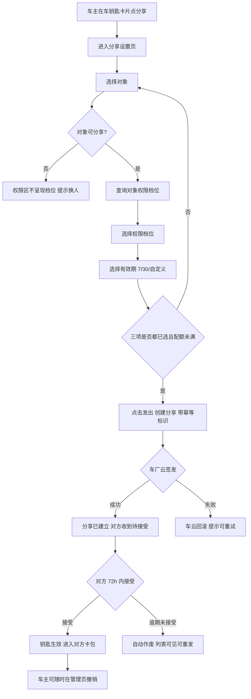
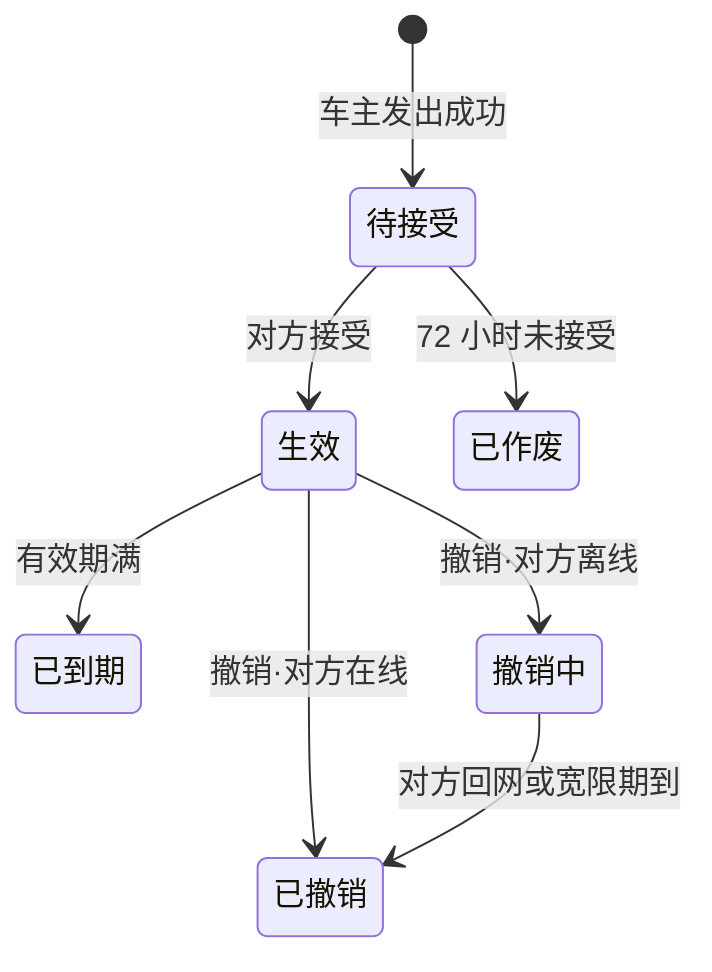
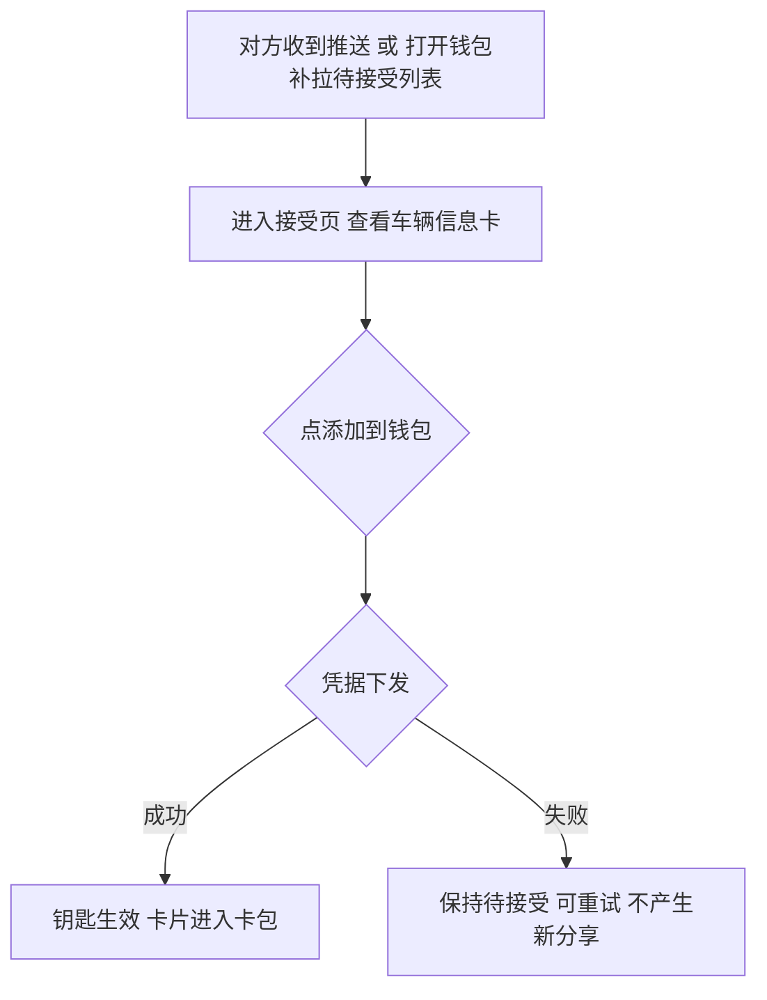
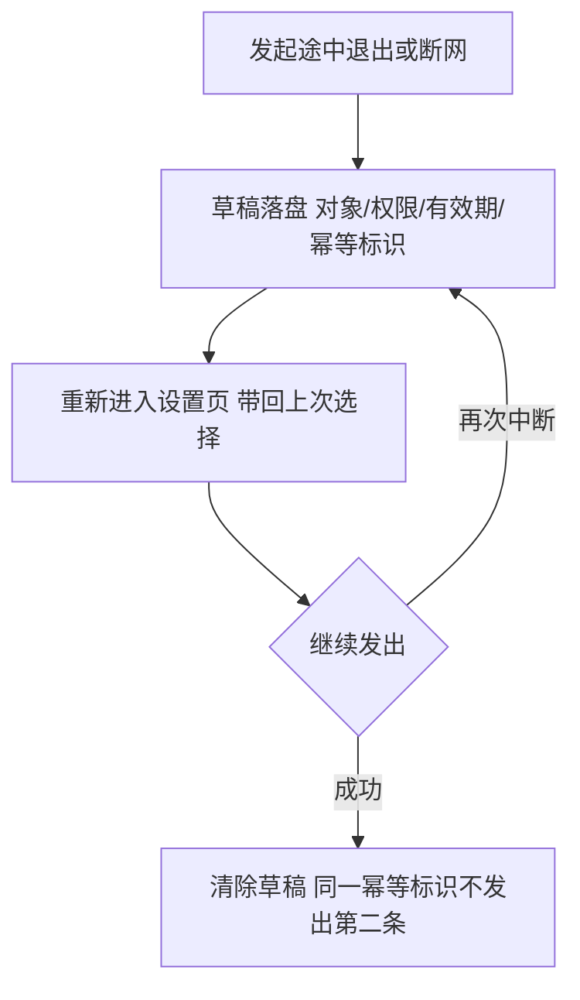

# 数字车钥匙分享（钱包端）— 需求规格（Spec）

<!--
  金样标注（分析写作物，非真实运行产物）：
  - 本文是 1.9.9 B5 分析按「逐章最佳写法档案 + 事实基线」写出的金样，非某次真实运行的原生产物；
  - 写作日期 2026-09-29；判据 C1–C4 与材料代指见 factbase-ISSUE-206.md 头部；
  - 「材料代」：上游材料取回灌版 RR/prd.md（产品稿 v0.4 + 接受侧界面说明合并正文）与 SR/design.md，
    工程事实取 demo 仓已核来源（factbase §6.5）；图片相对路径按消费工程材料布局书写，
    参考图由 Visual Handoff 承载（正文不嵌图）；图片实体已入本目录 ux-reference/（登记见 factbase §9）；
  - 生成区标记（knowledge-use:begin/end）为现行形态示意，真实运行中校验值由装置生成，金样省略。
-->

> **模块标识**: `ISSUE-206`
> **版本**: v1.0
> **创建日期**: 2026-09-29
> **最后更新**: 2026-09-29
> **状态**: 草稿

---

## 0. 术语映射表（Terminology Mapping Table）

所有行经用户逐条确认 [x]（2026-09-29）。

| 原始术语 | 权威模块 | 所属层 | 置信度（high / medium / low） | 易混项（必须亮出） | 用户确认 | 解释 |
|---------|---------|--------|-------------------------------|-------------------|---------|------|
| 车钥匙卡片 | WalletMain | 02-Feature | high | 添卡页「车钥匙」卡种——只是添卡类别枚举项（CardRepository c4），没有卡片本体；本期以一张模拟卡片承载入口（议题 D6） | [x] | 钱包卡包里的车钥匙卡种，本需求的分享入口挂在此卡片上 |
| 分享管理页 | WalletMain | 02-Feature | high | 卡包页——管理页是分享条目列表专页（逐条撤销），不是卡包 | [x] | 展示各条分享状态、剩余可分享数、可单独撤销的 feature 页面 |
| 分享设置页 | WalletMain | 02-Feature | high | 分享管理页——设置页是发起时的三段式表单，管理页是发出后的列表 | [x] | 发起分享的三段式设置页：给谁、什么权限、多长时间 |
| 已登录/未登录 | AccountManager | 04-BusinessBase | high | CommFunc——登录态是账号域数据（AppStorage 键），非纯工具 | [x] | 账号域的登录状态；未登录时分享入口不可见 |
| 对方账号/打码账号 | AccountManager | 04-BusinessBase | high | CommFunc.MaskUtil——脱敏算法是纯函数；账号语义在账号域，展示形态由本需求在采集处决定 | [x] | 被分享人的账号标识；页面与日志只展示打码形态 |
| 分享草稿 | WalletMain | 02-Feature | medium | AccountManager——草稿是分享业务本地状态，按账号隔离；非账号域数据 | [x] | 发起途中未完成的分享选择，本地保留用于续办，按账号隔离 |
| 权限档位 | WalletMain | 02-Feature | high | 功能开关——档位是车云按对象与车辆关系下发的业务取值，不是本地配置项 | [x] | 全功能（解闭锁、启动、后备箱）/ 仅解闭锁两档，随对象由车云给出 |
| 卡包 | WalletMain | 02-Feature | high | CommUI——卡包是 feature 专页/卡种入口，非通用列表容器 | [x] | 钱包卡包页，钥匙接受后被分享人卡片进入此处 |
| 首页 | WalletMain | 02-Feature | high | Phone——首页 Tab 壳在 Phone，本文「首页」指首页 Tab 内的业务内容 | [x] | 钱包首页 Tab 的业务内容，本文用它说明入口位置 |
| 脱敏 | CommFunc | 05-SystemBase | high | AccountManager——脱敏是纯算法能力（MaskUtil.maskAccount），非账号域 | [x] | 对账号/手机号做打码处理的纯算法能力，本需求在采集处调用 |
| Toast | CommUI | 05-SystemBase | high | WalletMain——无业务名状的底部轻提示归 CommUI | [x] | 全局通用底部轻提示组件，本需求用于失败与提示 |

**回写约定**：本表所列新增 / 修正条目在用户批准后须同步追加到 `doc/glossary.yaml`。其中「车钥匙卡片」「分享设置页」「分享管理页」「分享草稿」为新增业务词，见 glossary 回写条目。

---

## 1. 功能概述

车主可以在手机钱包中把数字车钥匙安全地分享给家人或联系人：选定对象、权限与有效期后发出，对方的钱包里直接多出一把能用的钥匙，72 小时内接受即生效，用完车主随时收回。端侧承担分享的设置、创建、状态展示与撤销；车云维护分享关系、车厂云签发凭据并裁决钥匙可用性、消息推送送达通知。目标是把「借车送钥匙」的线下动作数字化：分享能力上线三个月内，车钥匙用户中发起过分享的比例不低于 15%，「借车送钥匙」类客服咨询量下降一半（上游约束：产品需求稿）。未接真实车云服务前，端云交互以本地模拟数据按接口语义承载（议题 D4）。

---

## Scope 声明

> **本节是 Scope 守门机制的起点。**
> plan（Design）必须继承本节的 `in_scope_modules`；coding（Coding）的 git diff 不得越界到本节之外的模块。

### Scope 模块清单

| 字段 | 取值 | 说明 |
|------|------|------|
| 本需求允许修改的模块 | `WalletMain`、`Phone` | WalletMain 承载分享业务全部实现（页面、领域、数据、埋点责任方法）；Phone 仅按工程惯例为新增页面注册 NavDestination 名字分支，不实现业务 |
| 本需求明确不修改的模块 | `AccountManager`、`CommFunc`、`CommUI` | 只读复用既有导出（登录态；MaskUtil/Logger/WalletHAManager；SectionCard/ActionListItem/showToast/Maison* 组件），不新增这些模块的对外接口 |

### Scope 结构化字段（供 Spec 提取，必填）

```yaml
in_scope_modules:
  - WalletMain
  - Phone
out_of_scope_modules:
  - AccountManager
  - CommFunc
  - CommUI
rationale: |
  分享业务（入口、设置页、管理页、接受页、卡片详情、领域服务、Repository、草稿存储、幂等、
  埋点责任方法）全部落在 02-Feature/WalletMain，是钱包卡包 feature 的延伸。新增页面的既有
  工程惯例是「三处登记：页面文件导出 builder → WalletMain index.ets 导出 → Phone 宿主
  navDestinationMap 加路由分支」——新增页面必须改 Phone 的硬编码映射，因此 Phone 在
  in_scope 内，且仅限该注册动作、不改动任何业务实现。AccountManager（登录态）、
  CommFunc（MaskUtil/Logger/WalletHAManager）、CommUI（通用组件）只读用既有导出，
  不新增跨模块接口；若后续发现需要新增，属 scope 扩展，须停下发起提议，不能直接改。
```

### Visual Handoff（视觉交接，供 check-spec 读取）

```yaml
ui_change: new_or_changed
fidelity_target: semantic_layout
asset_acquisition_mode: approximate
visual_handoff:
  kind: repo_assets
  authoritative_refs:
    - id: share_setup
      path: doc/features/ISSUE-206/ux-reference/share-setup.png
      caption: 分享设置页（图1）：给谁、权限、有效期三段，三项选齐「发出」才可点
    - id: share_manage
      path: doc/features/ISSUE-206/ux-reference/share-manage.png
      caption: 分享管理页（图2）：顶部车辆与剩余可分享数，下方逐条分享并可单独撤销
    - id: accept_page
      path: doc/features/ISSUE-206/ux-reference/accept-page.png
      caption: 接受页：车辆信息卡 + 「添加到钱包」唯一主按钮，无拒绝按钮
    - id: key_card_detail
      path: doc/features/ISSUE-206/ux-reference/key-card-detail.png
      caption: 添加后的钥匙卡片详情：权限范围与有效期
```

视觉证据声明：四张参考图按结构语义档（semantic_layout）使用，像素级样式未经逐像素核对（verified: unverified）；像素项由 device-testing 阶段截图复核兜底，验收里的对应项按结构可观察条件先行。

### 最小改动原则

1. **默认就地实现**：分享逻辑优先落在 `WalletMain` feature 内（shared/data/domain/presentation 四层），不新增公共模块接口。
2. **禁止默默扩展**：若 plan 阶段发现需要在 `AccountManager`/`CommFunc`/`CommUI` 新增对外接口，必须停下生成 scope 扩展提议交给用户确认。
3. **公共能力优先复用**：脱敏用 `CommFunc.MaskUtil.maskAccount`、日志用 `CommFunc.Logger`、通用组件用 `CommUI` 既有组件，不重复造轮子。

---

## 2. 目标用户与使用场景

### 2.1 目标用户

| 用户角色 | 描述 |
|----------|------|
| 车主 | 已持有车钥匙的 WalletMain 用户，要把钥匙临时或长期分享给家人/联系人 |
| 被分享人 | 收到待接受钥匙的对方，接受后自己的钱包卡包多出一把能用的钥匙 |
| 其他联系人 | 临时借车的非家庭成员，只能拿到仅解闭锁的最小权限（权限随对象与车辆关系由车云给出） |

### 2.2 使用场景

| 场景编号 | 场景名称 | 场景描述 | 前置条件 |
|----------|----------|----------|----------|
| S1 | 发起分享 | 车主在车钥匙卡片点「分享」，选对象、权限、有效期后发出，对方收到待接受钥匙 | 已登录、持车钥匙卡片、功能开关开启、配额未满 |
| S2 | 接受生效 | 被分享人收到推送（或打开钱包补拉）进入接受页，点「添加到钱包」，钥匙卡片进入卡包并生效 | 分享处于待接受状态、72 小时内 |
| S3 | 管理查看 | 车主在分享管理页查看每条分享的对象、权限、有效期、状态 | 已登录、持车钥匙卡片 |
| S4 | 撤销 | 车主撤销一条分享；对方在线立即失效，离线进入撤销中后宽限期内收敛 | 分享处于生效状态 |
| S5 | 中断续办 | 发起途中退出或断网，回来接着上次的选择继续发 | 已产生未完成草稿，账号未切换 |
| S6 | 配额已满 | 生效+待接受合计达 5 后车主想再发起，入口置灰并给原因 | 已登录、持车钥匙卡片、配额已满 |
| S7 | 对象不可分享 | 选定的对象没有开通车钥匙等，权限区不呈现档位并提示换人 | 已进入设置页、选定对象、权限查询返回不可分享 |

---

## 3. 功能清单

> 六支分享接口与本地模拟：F2/F3/F4/F5/F6/F7/F8/F9/F10/F11 依赖车云侧六个新增接口，接口契约见「9. 宿主扩展治理项」的端云接口表。工程现状无端云封装（检索网络请求于 in_scope 模块零命中），联调前以本地模拟数据按接口语义承载，随车云/车厂云就绪切换真实接口；模拟阶段不改业务状态机语义，只换数据来源（议题 D4）。

| 编号 | 功能名称 | 优先级 | 描述 | 关联场景 |
|------|----------|--------|------|----------|
| F1 | 分享入口 | P0 | 车钥匙卡片上「分享」入口；未登录或没有车钥匙的用户看不到入口；功能开关关闭后入口不可发起新分享 | S1 |
| F2 | 分享设置页 | P0 | 三段式：给谁（通讯录/输入账号）、权限档位、有效期（7/30 天/自定义≤180 天）；三项选齐「发出」才可点击；进入时查配额 | S1 |
| F3 | 权限随对象定 | P0 | 选定对象后调用权限档位接口按返回档位呈现；换对象重查；已选档位不可用时请车主重选，不静默降级 | S1, S7 |
| F4 | 配额校验 | P1 | 生效+待接受合计满 5 后发起入口置灰并显示可读原因；原因按配额接口返回展示，不端侧编造 | S1, S6 |
| F5 | 创建分享 | P0 | 带幂等标识创建；成功后对方收到待接受钥匙；车厂云签发失败提示可重试，车云回滚不留半生效 | S1 |
| F6 | 草稿续办 | P1 | 发起途中退出/断网回来接着办，同一幂等标识不发出第二条；按账号隔离，退出登录清除 | S5 |
| F7 | 分享管理页 | P0 | 顶部车辆与剩余可分享数；按条列对象（昵称+打码账号）、权限、有效期、状态；可单独撤销 | S3 |
| F8 | 撤销 | P0 | 对方在线立即失效返回已撤销；离线的进入撤销中，宽限期内收敛；车辆侧自撤销起拒绝 | S4 |
| F9 | 接受页 | P0 | 车辆信息卡（车型、车主昵称、权限范围、有效期）+「添加到钱包」；不设拒绝按钮 | S2 |
| F10 | 添加后卡片详情 | P0 | 钥匙卡进卡包，详情可见权限范围与有效期；权限之外功能不呈现而非置灰 | S2 |
| F11 | 状态同步与补拉 | P1 | 列表状态与实际一致（六态）；推送未到达时对方打开钱包按待接受列表补拉兜底 | S3 |
| F12 | 隐私 | P0 | 页面/日志/事件全程只显示对方昵称与打码账号，不出现完整账号或手机号 | S1,S2,S3 |
| F13 | 功能开关 | P1 | 默认关闭；关闭后不能发起新分享，已生效分享不受影响 | S1 |
| F14 | 事件上报 | P1 | 分享发起/接受/撤销/失效四类事件；只带车型类别、阶段与结果分类，不带车牌/账号/位置；上报失败不改变分享关系 | S1,S2,S3,S4 |

---

## 4. 页面/界面描述

### 4.1 页面总览

本需求共四处新界面，入口挂既有车钥匙卡片：

- 分享设置页：给谁、什么权限、多长时间三段，三项选齐才能发出（参考图 share_setup）；
- 分享管理页：顶部车辆与剩余可分享数，下方逐条分享并可单独撤销（参考图 share_manage）；
- 接受页：车辆信息卡 + 「添加到钱包」唯一主按钮（参考图 accept_page）；
- 钥匙卡片详情：添加后卡片进卡包，详情见权限与有效期（参考图 key_card_detail）。

### 4.2 UI 组件详细描述

#### 区域 1: 分享设置页（share_setup，图 1）

| 组件 | 类型 | 内容/数据 | 交互行为 |
|------|------|-----------|----------|
| 导航栏 | 产品组件 | 标题「分享车钥匙」、返回 | 复用 MaisonNavBar（title/showBack） |
| 给谁（对象选择） | 列表/输入 | 通讯录联系人或对方账号输入 | 点击选择对象；选定后触发权限档位查询 |
| 权限档位区 | 单选组 | 按对象返回的档位：家庭成员=全功能/仅解闭锁，其他联系人=仅解闭锁 | 选择一项；换对象重查后已选不可用则提示重选 |
| 有效期 | 单选组 | 7 天 / 30 天 / 自定义（≤180 天） | 选择一项 |
| 发出按钮 | 主按钮 | 文案「发出」 | 三项选齐才可点；请求中禁用防重复提交；点击创建分享 |
| 草稿恢复 | 文本/表单态 | 上次未完成的对象、权限、有效期与幂等标识 | 进入设置页带回上次选择，发出成功即清除 |
| 配额提示 | 文本/置灰 | 满 5 人提示不可发原因 | 配额已满时发出入口置灰并给原因 |

#### 区域 2: 分享管理页（share_manage，图 2）

| 组件 | 类型 | 内容/数据 | 交互行为 |
|------|------|-----------|----------|
| 顶部信息卡 | 文本 | 车辆信息 + 剩余可分享数（来自配额接口） | 展示 |
| 分享列表 | 列表 | 每条：对象（昵称+打码账号）、权限、有效期、状态（六态之一） | 拉取展示；无本地缓存，每次进页拉取 |
| 撤销动作 | 按钮（每行） | 文案「撤销」；撤销中的条目显示「正在收回」 | 点击撤销该条分享 |
| 空状态 | 文本 | 无分享记录提示 | 列表为空时展示 |
| 网络失败态 | 文本/重试 | 断网时提示 | 展示网络失败态，可重试加载 |

#### 区域 3: 接受页（accept_page，图 3）

| 组件 | 类型 | 内容/数据 | 交互行为 |
|------|------|-----------|----------|
| 车辆信息卡 | 卡片 | 车型、车主昵称、给到的权限范围、有效期到哪天 | 展示 |
| 添加到钱包 | 主按钮 | 唯一主动作 | 点击调接受接口并添加卡包 |
| （无拒绝按钮） | — | 不设「拒绝」 | 不想要就放着，72 小时后自动作废 |

#### 区域 4: 钥匙卡片详情（key_card_detail，图 4）

| 组件 | 类型 | 内容/数据 | 交互行为 |
|------|------|-----------|----------|
| 钥匙卡片 | 卡片 | 进入对方钱包卡包 | 展示 |
| 卡片详情 | 文本 | 权限范围与有效期 | 权限之外功能不出现在操作面（非置灰） |

### 4.3 页面状态

| 状态 | 描述 | 触发条件 |
|------|------|----------|
| 设置页-加载 | 对象选定后权限档位查询中 | 选定对象后 |
| 设置页-档位失效 | 已选档位在新对象不可用，提示重选 | 换对象后权限重查 |
| 设置页-配额满 | 发出按钮置灰并显示满额原因 | 生效+待接受达到 5 |
| 管理页-加载 | 列表与配额拉取中 | 进管理页 |
| 管理页-空 | 无分享记录空态 | 列表为空 |
| 管理页-失败 | 网络失败态，可重试 | 断网或云侧失败 |
| 接受页-处理中 | 添加中防重复点击 | 点「添加到钱包」后凭据下发期间 |
| 接受页-失败 | 保持待接受并提示可重试 | 凭据下发失败 |

---

## 5. 业务流程图

### 5.1 发起主路径



- 主路径从入口走到钥匙生效。
- 对象不可分享：停在设置页并提示换人。
- 三项未选齐：停在设置页。
- 签发失败：回滚，可重试。
- 逾期未接受：自动作废。
- 配额满：在发出前拦截（原因取配额接口返回）。
- 撤销与自然失效的流转见 5.2 状态机。

### 5.2 分享状态机（六态）

一条分享从发出到终结只经过以下六个互斥状态，任一时刻只处于其中一种：



状态与动作对照（迁移全集；备注只写图上没有的语义）：

| 当前状态 | 动作 / 事件 | 迁移到 | 备注 |
|---|---|---|---|
| 待接受 | 对方接受 | 生效 | 凭据下发成功才生效（时序见 5.1） |
| 待接受 | 72 小时未接受 | 已作废 | 时间驱动；已作废条目列表可见，可重新发起 |
| 生效 | 有效期满 | 已到期 | 有效期由发起时选择的权限档位决定 |
| 生效 | 车主撤销（对方在线） | 已撤销 | 即时生效 |
| 生效 | 车主撤销（对方离线） | 撤销中 | 车辆侧从发起起即不认这把钥匙 |
| 撤销中 | 对方回网或宽限期到 | 已撤销 | 宽限窗时长口径见议题 D1 |
| 已撤销 / 已作废 / 已到期 | — | 终态 | 不再迁出；仅已作废可重新发起新分享 |

- 进入「撤销中」之后，车辆侧从撤销发起那一刻起就不再认这把钥匙；宽限窗只影响对方设备上钥匙卡片的消失时间，不影响车辆侧已经产生的拒绝（上游约束：系统设计说明）。
- 宽限窗时长产品稿与系统设计分别写 24 与 48 小时，端侧只展示车云返回的状态、不裁决时长，口径见议题 D1。
- 已作废与已到期由时间驱动：端侧不自行计时，管理页按车云返回的状态展示；已作废条目在列表可见，可重新发起。

### 5.3 接受子流程



- 接受只认「添加到钱包」一个主动作。
- 凭据下发失败：保持待接受，重试不产生新分享（上游约束：系统设计说明的接口语义）。

### 5.4 中断续办子流程



- 草稿按账号隔离，退出登录清除；发出成功即清除。
- 回到设置页时若配额已满，按配额满处理——不会出现「有草稿就忽略配额」的假捷径。

---

## 6. 异常/边界场景处理

| 编号 | 异常场景 | 触发条件 | 处理方式 | 用户提示 |
|------|----------|----------|----------|----------|
| E1 | 网络断开 | 进设置页/管理页断网 | 页面对应展示网络失败态；草稿保留不丢 | 「网络异常，请检查网络后重试」 |
| E2 | 数据为空 | 管理页无分享记录 | 展示空态文案 | 「暂无分享」 |
| E3 | 功能暂不支持 | 未登录 / 无车钥匙 / 开关关闭 | 不显示分享入口；已生效分享不受开关影响 | 无入口（不提示） |
| E4 | 配额已满 | 生效+待接受合计达 5 | 发起入口置灰并不发请求 | 「已达分享上限」+ 可读原因（取配额接口返回） |
| E5 | 车厂云签发失败 | createKeySharing 返回失败 | 车云回滚分享关系，端侧提示可重试，不留半生效 | 「暂未成功，请重试」 |
| E6 | 接受时凭据下发失败 | acceptKeySharing 失败 | 保持待接受态可重试；不产生新分享 | 重试提示 |
| E7 | 撤销时对方离线 | revokeKeySharing 返回撤销中 | 宽限期内对方回网即失效；车辆侧自撤销起拒绝 | 显示「正在收回」 |
| E8 | 发起中断（退出/断网） | 发起途中退出 | 草稿续办，同一幂等标识 | 回来接着上次选择 |
| E9 | 对象不可分享 | queryGranteePermission 返回不可分享 | 权限区不呈现档位，提示换一个人 | 「对方暂不可分享」+ 原因 |
| E10 | 换对象后已选档位不可用 | 换对象后权限档位重查 | 已选档位无效则请车主重选，不静默降级 | 「请重新选择权限」 |
| E11 | 账号切换 | 登录账号变更 | 草稿清空、列表按新账号拉取，不跨账号带出 | 无（直接呈现新账号数据） |
| E12 | 清除数据/缓存 | 用户清除应用数据 | 草稿丢失可自恢复：再进分享流程从头发起，不崩溃不死循环；列表照常从云侧拉取（规约 ENV-01） | 无 |
| E13 | 重复提交 | 发出按钮快速重复点击 | 幂等标识去重（同标识返回同一条）+ 提交期禁用防抖，不重复弹窗 | 无（按钮置为处理中） |
| E14 | 推送未到达 | 待接受通知送达失败 | 对方主动打开钱包时补拉待接受列表兜底；推送失败不改变分享关系 | 无 |

---

## 7. 非功能性需求

### 7.1 性能要求

| 指标 | 要求 | 说明 |
|------|------|------|
| 页面首屏可交互 | 首次进入 ≤ 1.5 秒 | 进分享设置/管理/接受页首帧可交互（本工程设定，无上游依据，登记议题 D2） |
| 本地选择反馈 | ≤ 300 ms | 选择项、按钮可用态等本地 UI 更新（本工程设定，无上游依据；与首屏时延同批登记，见议题 D2） |
| 列表滚动帧率 | ≥ 54 FPS | 分享管理页长列表滚动（本工程设定，无上游依据；与首屏时延同批登记，见议题 D2） |
| 撤销离线失效 | 车辆侧自撤销发起即拒绝 | 设备侧卡片消失的宽限窗：产品稿写最长 24 小时，系统设计按 48 小时计（上游约束：产品需求稿；系统设计按 48 小时计，两值冲突见议题 D1），端侧只展示车云返回状态、不裁决时长 |
| 端云请求触发频次 | 用户操作触发，每条路径按需 1 次 | 进设置页配额查询 1 次、选定对象权限查询 1 次（换对象重查 1 次）、进管理页列表查询 1 次，无轮询/定时任务，失败按用户重试触发（接口语义为上游约束：系统设计说明；频次上限为本工程设定） |

### 7.2 兼容性要求

| 维度 | 要求 |
|------|------|
| 系统版本 | 目标 SDK 6.0.2（API 22），兼容 SDK 6.0.1（API 21）（本工程配置，来源于 build-profile） |
| 设备类型 | 手机 |
| 新页面注册 | 四个分享页面经 Phone navDestinationMap 注册（工程惯例：页面导出 builder → WalletMain index.ets 导出 → 宿主映射加分支） |
| RTL | 分享相关页方向参数用 start/end，文本对齐 TextAlign.Start/End，RTL 镜像下布局正确（规约 UX-01） |
| 深色与大字体 | 深色主题与大字体下车辆信息与主按钮保持可读可点（上游约束：接受侧界面说明的可读性要求） |

### 7.3 安全性要求

| 要求 | 说明 |
|------|------|
| 对方账号脱敏 | 页面/日志/事件只显示昵称与打码账号，用 `CommFunc.MaskUtil.maskAccount` 在采集处脱敏，不在输出端过滤兜底（规约 SEC-01） |
| 凭据边界 | 车钥匙凭据不经端侧存储、不写入日志；端侧仅持有至内存用于页面展示；钱包端不签发凭据、不裁决钥匙可用性 |
| 权限与有效期边界 | 端侧不得自行扩大权限或有效期上限；权限与有效期以车主所选与车云返回为准 |
| 调用方校验 | 未登录不得发起或接受分享（上游约束：系统设计说明的参与方失败边界） |
| 草稿按账号隔离 | 草稿按账号隔离，退出登录清除 |
| 列表不缓存 | 钥匙类数据不落盘，每次进页从云侧拉取 |

---

## 8. 验收标准

编号行首为 AC-K1–AC-K11（承接上游 PRD 既有验收编号，全部承接、无不承接项）。

### P0 功能验收标准

- **AC-K1** (F1, F2, F5): 已登录且持车钥匙的用户在车钥匙卡片上点「分享」，三项选齐后发出，对方钱包收到一条待接受的钥匙；任意一项未选时「发出」不可点击。
- **AC-K2** (F9, F10): 被分享人接受后钥匙生效可用，权限与车主所选一致；权限之外功能不出现在对方操作面。
- **AC-K3** (F11): 72 小时未接受自动作废，作废条目在列表可见、可重新发起。
- **AC-K5** (F8): 车主撤销时对方在线立即失效（已撤销）；离线的宽限期内失效（撤销中），期间车辆不认这把钥匙。
- **AC-K7** (F7, F11): 列表状态与实际一致：待接受、生效、已作废、已到期、撤销中、已撤销六态。
- **AC-K8** (F12): 全程页面与日志/事件不出现对方完整账号或手机号，只显示昵称与打码账号。
- **AC-K9** (F1): 未登录或没有车钥匙的用户看不到分享入口。
- **AC-K11** (F3): 选家庭成员时全功能可选；换其他联系人后全功能不可选，已选的全功能请车主重选；换回家庭成员又可选。

### P1 功能验收标准

- **AC-K4** (F4): 生效+待接受合计到 5 后不能再发起，能看到原因。
- **AC-K6** (F6): 发起途中退出或断网，回来接着办，不发出第二条。
- **AC-K10** (F13): 开关关闭后不能发起新分享，已生效分享不受影响。
- **AC-F14** (F14): 分享发起/接受/撤销/失效四类事件按系统设计的事件约定字段约束上报，失败不改变分享关系。

### 通用验收标准

- **AC-G1** (F2): 页面在 HarmonyOS 设备上正常显示，无布局错乱；深色主题与大字体下车辆信息与主按钮可读可点（规约 UX-01）。
- **AC-G2** (F2): 本地交互操作响应 ≤ 300 ms（本工程设定，无上游依据，见议题 D2）；网络请求期间显示处理中且不可重复提交。
- **AC-G3**: 网络异常/云侧失败有明确错误提示与重试路径，不白屏不崩溃。
- **AC-G4**: 端云新增接口与错误码不破坏既有（规约 COMPAT-01/COMPAT-02）。

说明：AC-K5 的「宽限期」产品稿与系统设计分别写 24 与 48 小时（议题 D1），端侧只展示车云返回的状态、不裁决时限；验收按「能观察到撤销中→已撤销流转」口径执行，不对窗口长度单独设判定项。

另有知识规约派生验收（AC-RES01/AC-RES02、AC-DFX01/AC-DFX02、AC-OBS02/AC-OBS05/AC-OBS06/AC-OBS07、AC-COMPAT01/AC-COMPAT02、AC-ENV01/AC-ENV02、AC-DLV01，逐条挂对应规约编号）登记于 acceptance.yaml，不在本节重复展开。

---

## 9. 宿主扩展治理项

| 扩展项 | 是否涉及 | 承载位置 |
|--------|----------|---------|
| 技术契约 | 是（走 /story） | 9.1 |
| 规约 | 是 | 9.2 |
| 设计模式 | 是 | 9.3 |
| 埋点 | 是（走 /story） | 9.4 |
| 撤销宽限窗口径（产品稿 24h vs 系统设计 48h） | 是 | 《决策与评审记录》议题 D1 |
| 自设性能指标登记（首屏 1.5 秒等） | 是 | 《决策与评审记录》议题 D2 |
| 六接口本地模拟承载与替换条件 | 是 | 《决策与评审记录》议题 D4 |
| 发起草稿持久化边界 | 是 | 《决策与评审记录》议题 D5 |
| 分享入口挂点（模拟车钥匙卡片承载） | 是 | 《决策与评审记录》议题 D6 |
| 转赠与长期不联网强制下线（本期不结论） | 是 | 《决策与评审记录》议题 D9 |
| 翻译回稿 | 是 | 《决策与评审记录》DLV-01 |

### 9.1 技术契约

#### 9.1.1 端云接口

> 数据来源策略：工程现状无端云调用封装（检索网络请求于 in_scope 模块零命中），以下六支接口联调前以本地模拟数据按接口语义承载（议题 D4）；接口名、入参与出参按系统设计约定，真实服务联调按接口名、字段与车云错误码补齐，接口契约不变。

| 云侧接口 | 新增·复用·变更 | 入参 → 出参 | 错误码 | 代码现状 |
|---|---|---|---|---|
| `queryKeySharingQuota` | 新增 | `{ vehicleId }` → `{ remainingCount, summary[] }` | 无新增（网络/通用失败） | 检索端云调用封装于 in_scope 模块零命中；现有仓储（CardRepository 等）均为本地模拟数据 |
| `queryGranteePermission` | 新增 | `{ vehicleId, granteeAccount }` → `{ availablePermissions[], permissionText[] }`；对象不可分享返回原因 | 无新增（不可分享为业务原因） | 同上 |
| `createKeySharing` | 新增 | `{ vehicleId, granteeAccount, permission, expireAt, idempotencyKey }` → `{ shareId, state=PENDING_ACCEPT }` | 签发失败/配额满以失败分类返回 | 同上 |
| `acceptKeySharing` | 新增 | `{ shareId }` → `{ credentialState }` | 凭据下发失败（保持待接受可重试） | 同上 |
| `revokeKeySharing` | 新增 | `{ shareId }` → `{ state=REVOKED \| REVOKING }` | 无新增 | 同上 |
| `queryKeySharingList` | 新增 | `{ vehicleId }` → `{ shares[] }` | 无新增 | 同上 |

#### 9.1.2 数据存储

| 键名/表名 | 介质 | 值结构 | 有效期 | 用途 | 代码现状 |
|---|---|---|---|---|---|
| `key_sharing_draft` | 待 plan 定（候选：页面级内存 / Preferences；见议题 D5） | `{ vehicleId, granteeMaskedAccount, permissionLevel, expireDays, idemKey }` | 发起成功即清除；退出登录清除 | 发起途中中断/断网续办，同一幂等不重发第二条；按账号隔离 | 现有 WalletMain 无本地草稿持久化（检索 Preferences 于 WalletMain 零命中），属新增域 |
| 分享列表 | 不落本地 | — | — | 车钥匙类数据不缓存，每次进页从云侧拉取 | 仓内无分享列表缓存，检索零命中 |

#### 9.1.3 配置项

| 配置项 | 默认值 | 关闭态行为 | 历史版本兼容 | 代码现状 |
|---|---|---|---|---|
| `key_sharing_feature_enabled`（功能开关） | `false` | 未登录/无车钥匙/开关关闭不显示分享入口；开关关闭不能发起新分享，已生效分享不受影响 | 旧版本读不到该键时视为关闭态 | 既有开关常量先例 `HomeConstants.SHOW_LOCAL_CARD_SECTION`（模块 shared/constant 下 static readonly 布尔），本次新增于 WalletMain 同名常量区；实现方式（云侧下发或本地常量）待 plan 定 |
| 权限档位文案 | 云侧配置下发 | 端侧不写死档位名 | — | 本期随 `queryGranteePermission` 返回承载（见 9.1.1 注） |

#### 9.1.4 依赖变更

不涉及：Scope 内模块（WalletMain/Phone）依赖声明无需变更——分享所需 `@aspect/AccountManager`、`@aspect/CommUI`、`@aspect/CommFunc`、编排 SDK `framework` 均已在 WalletMain 的 oh-package.json5 声明，本期不新增、不升级任何 SDK 或模块依赖。

### 9.2 规约

<!-- knowledge-use:begin 规约 · 由 spec/knowledge-use.yaml 生成，手改会被门禁拒绝（金样示意：真实运行中由装置渲染） -->
| 编号 | 强制力 | 本需求的要求 | 落点契约名 | 验法 |
|---|---|---|---|---|
| UX-01 | 基线 | 分享设置页/管理页/接受页/卡片详情的对齐与方向参数一律用 start/end（API 12+ Localized 系列），文本对齐用 TextAlign.Start/End，禁止 left/right 硬编码 | 影响 · 分享设置页、分享管理页、接受页、钥匙卡片详情各页布局与文案对齐 | 模型 / 实机 |
| SEC-01 | 红线 | 对方账号、手机号属敏感字段：任何离开进程的出口（页面展示、Logger 日志、事件上报字段）都只出现脱敏形态，脱敏在采集处用 MaskUtil.maskAccount 完成，不在输出端过滤 | 影响 · 分享管理页列表、接受页车辆信息卡（车主昵称）、Logger 日志、埋点描述（不含账号/车牌/位置） | 模型 / 实机 |
| SEC-01 | 红线 | 车钥匙凭据不经端侧落盘、不写入日志；端侧仅持有至内存用于页面展示 | 影响 · 分享管理页列表、接受页车辆信息卡（车主昵称）、Logger 日志、埋点描述（不含账号/车牌/位置） | 模型 / 实机 |
| DFX-01 | 基线 | 端云接口均为低频触发：进分享设置页配额查询 1 次、选定对象权限查询 1 次（换对象重查 1 次）、进管理页列表查询 1 次，均进入页面或换对象时单次触发，无定时任务、不做定时轮询，接口失败按用户重试触发而非自动循环（接口语义为上游约束：系统设计说明）；频次上限为本工程设定 | 技术契约 · queryKeySharingQuota | 模型 |
| DFX-02 | 基线 | 新增资源以字符串与复用系统符号为主，不引入新图片资产；若须新增图标资源须给体积数值且单张不超过 10KB | 影响 · 分享页面图标与文案资源（string.json） | 模型 |
| OBS-02 | 基线 | 分享发起、接受、撤销、列表加载关键业务过程有定位记录，复用 CommFunc 的 Logger 统一入口；定位信息随统计事件的描述带，不另记定位事件 | 埋点 · 分享发起流程 / 创建分享 | 模型 / 实机 |
| OBS-03 | 基线 | 分享发起/接受/撤销/失效四个统计点按流程落到必要步骤，每个点记录实际适用结果（成功/失败各分支）与触发条件，同点位同次尝试不重复上报 | 埋点 · 分享发起流程 / 创建分享 | 模型 / 实机 |
| OBS-05 | 基线 | 事件的身份、结果分类与参数取值来源明确：结果取自接口响应或错误码（外码来源写响应字段），描述只带车型类别、阶段与结果分类，不含账号/车牌/位置；字段缺省条件写清 | 埋点 · 分享发起流程 / 创建分享 | 模型 / 实机 |
| OBS-06 | 基线 | 四个分享事件编码为新增且唯一，登记进本特性 ChartCodes；不改变既有 Wallet_COMMON 模板语义与其他事件，接受/撤销/失效与发起共用同一事件模板与流程/步骤号规则 | 埋点 · 分享发起流程 / 创建分享 | 模型 / 实机 |
| OBS-07 | 基线 | 不自行补造运营点位：按系统设计的事件约定四类事件（发起/接受/撤销/失效）上报，仅带车型类别、阶段与结果分类；发起占比等运营目标指标由云端以关系数据统计，端侧不新增 BI 事件 | 埋点 · 分享发起流程 / 创建分享 | 模型 |
| RES-01 | 基线 | 分享相关页面图标按优先级取：系统符号（sys.symbol）→ 项目已归档图片 → 新引入；新引入的单张不超过 10KB 并给依据 | 影响 · 分享设置页、管理页、接受页、卡片详情图标 | 模型 |
| RES-02 | 基线 | 分享页用户可见文案优先复用项目已有、中文完全一致的字符串；新增的按项目惯例定义在 string.json 并中英齐备，代码不写用户可见中文字面量 | 影响 · 分享设置/管理/接受/卡片详情的 string.json 文案 | 模型 |
| COMPAT-01 | 基线 | 新增六个端云接口字段均为新契约，不删除旧版依赖字段、不改既有字段含义；新增字段有默认值或可空，类型变更两端可处理，不触发服务端对旧字段的新校验 | 技术契约 · createKeySharing | 模型 |
| COMPAT-02 | 基线 | 新增错误码（配额满、对象不可分享、签发失败等）不改动任何既有错误码的编号与含义；接收方对新错误码按可读提示兜底，老版本识别不了新码时走通用失败处理 | 技术契约 · createKeySharing | 模型 |
| ENV-01 | 基线 | 发起草稿（key_sharing_draft）清除数据/缓存后丢失可自恢复：再进分享流程从头发起，不崩溃不死循环；分享列表不落盘，清除数据后照常从云侧拉取 | 技术契约 · key_sharing_draft | 模型 / 实机 |
| ENV-02 | 基线 | 分享入口可重复进入或重复触发时防重入：创建分享靠幂等标识幂等（同一幂等标识返回同一条分享），发出按钮快速重复点击防抖，不接受重复创建 | 技术契约 · createKeySharing | 模型 / 实机 |
| DLV-01 | 基线 | 新增的用户可见文案列入待翻译字符串清单，跟踪翻译回稿后合入 | 影响 · 分享页面新增 string.json 文案 | 模型 / 人工 |

不命中的依据：
- DLV-02：分享设置/管理/接受页与车云接口均为钱包内部页面与本部件作为客户端调云端服务，不构成「其他部件/应用/第三方使用本部件这一面」的对外开放面（联网不等于对外开放）；无对外文档归档义务，处置为评审动作不需产出代码。
<!-- knowledge-use:end -->

### 9.3 设计模式

<!-- knowledge-use:begin 设计模式 · 由 spec/knowledge-use.yaml 的 patterns 段生成（金样示意）；只登记候选，不做选型（选型归 plan） -->
| 适用单元 | 候选 | 命中信号或反证 |
|---|---|---|
| 分享设置页三段交互（选对象→权限随对象→选有效期→发出） | page-interaction | 页面内交互由业务结果驱动下一个交互：选定对象后权限档位才确定并重查，换对象要重选已选档位，满额置灰发起入口，符合动作表编排信号 |
| 发起分享主链路（入口→设置页→创建→签发结果回滚） | decision-tree | 创建分享有多个分支（签发成功/签发失败回滚/失败可重试），且分支各有失败处理，符合节点表编排信号；草稿续办与幂等为上篇恢复用例 |
<!-- knowledge-use:end -->

### 9.4 埋点

> 责任方与协议见项目上报知识的统计上报封装（统一 Chart/VOC 出口）。本需求为首次在仓内落业务运维统计：仓内模板仅 `Wallet_COMMON`，四个流程点的流程/步骤/内码须新增登记（本特性 ChartCodes）。

分享链路需要观察四条业务结果：发起、接受、撤销、失效。四者均为跨端状态变更，本端只在收到对应接口响应或状态查询时获知结果；失败原因（签发失败/配额满/凭据下发失败）随事件描述带，不另记定位事件。敏感字段（对方账号、车牌、位置）不入事件。上报失败不改变分享关系。

#### 分享发起成功率

衡量什么：发起创建分享并拿到建立结果。怎么算：创建成功的分享 / 全部发起尝试，分母含车厂云签发失败的回滚尝试。每次上报带：失败分类（签发失败 / 配额满）。在哪打点：发起流程的创建步骤。

| 统计点 | 业务动作 | 实际适用结果 | 本端获知时机 | 已有覆盖或新增 | 代码现状 |
|---|---|---|---|---|---|
| 分享发起流程 / 创建分享 | 车主点「发出」创建分享 | 成功（分享已建立）/ 签发失败可重试 / 配额满不可发 | 创建接口响应或失败回滚提示 | 新增 | 检索 Chart 于 in_scope 模块零命中，属新增上报域 |

#### 分享接受成功率

衡量什么：接受待接受分享并成功下发凭据。怎么算：凭据下发成功的接受 / 全部接受尝试。每次上报带：失败分类（凭据下发失败）。在哪打点：接受流程。

| 统计点 | 业务动作 | 实际适用结果 | 本端获知时机 | 已有覆盖或新增 | 代码现状 |
|---|---|---|---|---|---|
| 分享接受流程 / 接受凭据下发 | 被分享人点「添加到钱包」 | 成功（凭据下发）/ 失败保持待接受 | 接受接口响应 | 新增 | 同上 |

#### 分享撤销结果分布

衡量什么：撤销动作的终态。怎么算：已撤销（对方在线即时）/ 撤销中（离线待宽限）/ 失败的构成。每次上报带：远端返回状态。在哪打点：撤销流程；撤销中是否完成失效由车云终态决定，本端在列表状态变化时回读，不自行计时。

| 统计点 | 业务动作 | 实际适用结果 | 本端获知时机 | 已有覆盖或新增 | 代码现状 |
|---|---|---|---|---|---|
| 分享撤销流程 / 撤销 | 车主撤销一条分享 | 已撤销 / 撤销中 / 撤销失败 | 撤销接口响应 | 新增 | 同上 |

#### 分享失效（自然到期）

衡量什么：分享自然走向作废/到期的分布，属状态推进（非单次动作结果）。怎么算：已作废 / 已到期的构成。每次上报带：状态与触发（72 小时未接受 / 有效期满）。在哪打点：本端不在主动动作中触发，随列表查询回读状态，按列表状态首次得知计一次，不虚构已发生的结果。

| 统计点 | 业务动作 | 实际适用结果 | 本端获知时机 | 已有覆盖或新增 | 代码现状 |
|---|---|---|---|---|---|
| 分享失效流程 / 状态回读 | 列表查询状态 | 已作废 / 已到期 | 列表查询响应 | 新增 | 同上 |

统计边界：页面进入与点击不进统计；远端状态按首次得知计一次；自然到期与动作失败分别判断；进统计的终态走 Chart、给人读的定位记录走 VOC，同一统计终态二选一。

---

## 附录

### A. 术语表

业务名词解释见 §0 术语映射表的「解释」列与 glossary 回写条目。

### B. 参考资料

- 产品需求：`doc/features/ISSUE-206/RR/prd.md`——产品稿 v0.4 与接受侧界面说明的合并正文；提供业务背景、用户旅程、产品规则、验收意图（AC-K1–AC-K11 原编号出处）
- 系统设计：`doc/features/ISSUE-206/SR/design.md`——车云侧系统设计说明；提供三方分工、发起时序、状态机、六支接口约定与失败处理
- 开发需求：`doc/features/ISSUE-206/AR/design.md`——钱包端提取件；界定本 AR 范围、功能点与上游索引
- 参考图：`doc/features/ISSUE-206/ux-reference/`（share-setup / share-manage / accept-page / key-card-detail 四张，另有 README 承载接受侧界面说明文字）

### C. 变更记录

| 日期 | 版本 | 变更内容 | 变更人 |
|------|------|----------|--------|
| 2026-09-29 | v1.0 | 初始版本：按产品稿 v0.4 与系统设计说明成稿；撤销宽限窗两稿数值冲突按披露式处理并登记议题 D1；自设性能指标（首屏 1.5 秒、300ms、54 FPS）标注本工程设定并登记议题 D2；Scope 取 in=[WalletMain, Phone]（Phone 限路由注册，三处登记工程惯例） | AI 作者 |
