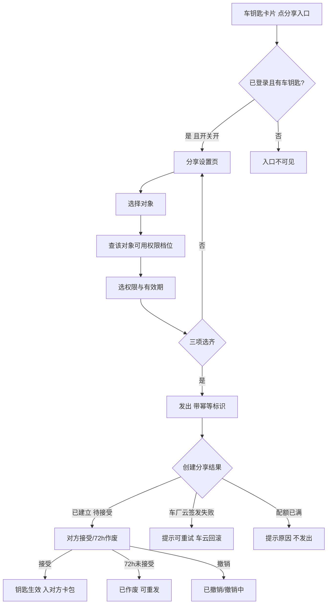
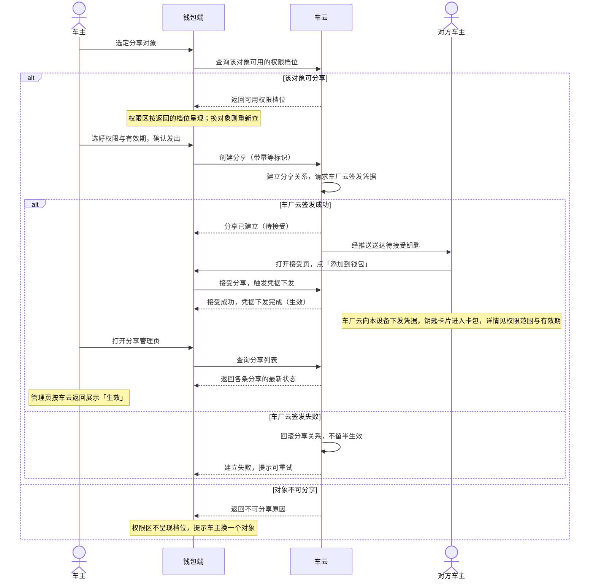
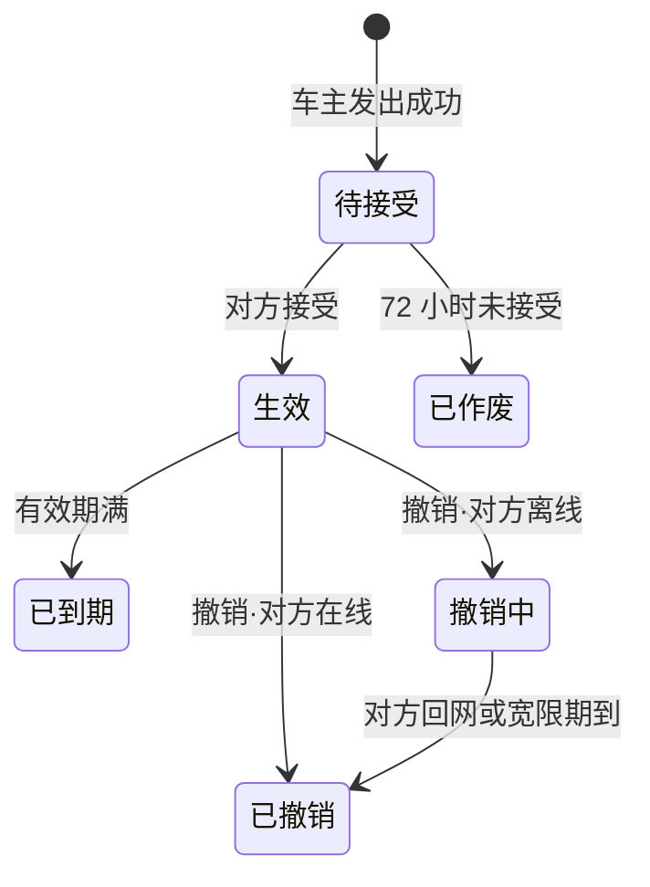
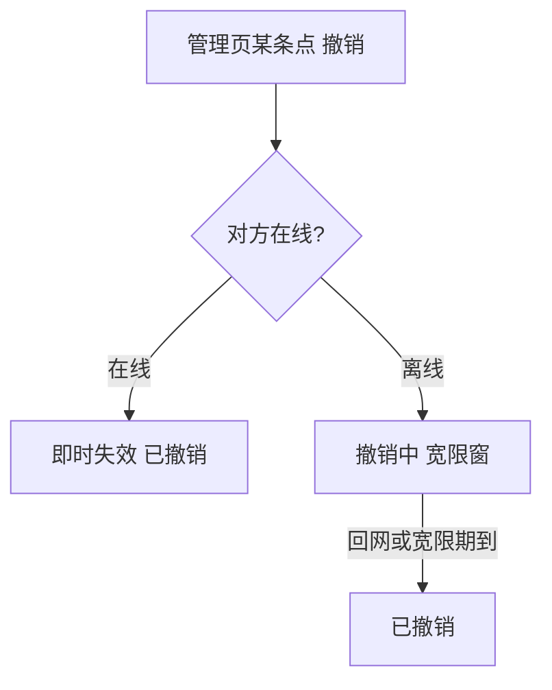

# ISSUE-206 数字车钥匙分享（钱包端）

<!--
  金样标注（分析写作物，非真实运行产物）：
  - 本文是 1.9.9 B5 分析按「逐章最佳写法档案 + 事实基线」写出的金样，非某次真实运行的原生产物；
  - 写作日期 2026-09-29；判据 C1–C4 与材料代指见 factbase-ISSUE-206.md 头部；
  - 十章骨架与红线按 story-chapters.json：主叙事（第 1–9 章）零工程标识、零来源括注、零文档坐标；
    接口、存储、配置、统计点与规约判断的精确名称只在第 10 章附录；
  - 附录投影区（story-build 标记）为现行形态示意，真实运行中由装置按 spec 生成并带校验值，金样省略；
  - 图片相对路径按消费工程材料布局书写；图片实体已入本目录 assets/（来源快照 Story-Features-20260928-214925，登记见 factbase §9）。
-->

## 1. 背景

### 1.1 现状与问题

一辆车全家一起用是常态，但实体钥匙通常只有一两把。家人临时要用车，车主要么专程跑一趟送钥匙，要么提前把钥匙藏在车里某个位置——这是数字车钥匙用户反馈最集中的一条。车钥匙本人使用的能力已经上线：车主自己的手机已经可以把手机当作车钥匙。唯一的短板，是把钥匙交给别人这一环。

### 1.2 成功怎么衡量

本需求补齐这一环：车主把车钥匙分享给家人，对方的钱包里直接多出一把能用的钥匙，用完了车主随时收回。产品侧给出两个可衡量的目标：

| 指标 | 目标 |
|---|---|
| 车钥匙用户中发起过分享的比例 | 上线三个月内不低于 15% |
| 「借车送钥匙」类客服咨询量 | 下降一半 |

这两条业务指标由云侧以分享关系数据统计，钱包端不为此新增独立的运营采集，只上报分享发起、接受、撤销、失效四类流程结果事件（见附录「埋点」）。

### 1.3 钱包端承担哪一段

分享涉及钱包、车云、车厂云三方协同：车云负责建立和维护分享关系，车厂云负责给接受方签发钥匙凭据，钱包端负责收集信息、展示状态、发起动作。本需求落在钱包端这一侧，覆盖车主发出与管理、被分享人接受与持有两条链路；车云、车厂云、账号和消息推送是外部依赖，不在本需求内实现。

### 1.4 尚未定案的事

三件事在方案里不当作已定的事写：一是被分享人能不能把钥匙再转给第三人、二是撤销后对方设备与车辆长期不联网要不要请车厂强制下线——产品稿明说这两件本期都不结论（议题 D9）；三是撤销后离线失效的宽限时长，产品稿与系统设计分别写 24 和 48 小时（议题 D1）。自设性能指标的登记见业务方案与验收。

## 2. 术语

全篇有两处概念最容易读混：分享对象与登录账号是两回事——分享对象是被分享的那个人，登录账号是当前用钱包的人；「撤销中」与「已撤销」也是两个状态——前者是车主撤销后对方离线、正在等失效完成的过渡态，后者是失效已经完成的终态。

### 2.1 核心概念

| 术语 | 在本需求里的意思 |
|---|---|
| 车钥匙分享 | 车主把数字车钥匙分享给家人/联系人的能力，本需求主体 |
| 分享设置页 | 发起分享的三段式设置页（给谁/什么权限/多长时间） |
| 分享管理页 | 展示分享列表、剩余可分享数、按条撤销的页面 |
| 接受页 | 被分享人收到的待接受钥匙确认页（添加进钱包） |
| 卡包 / 钥匙卡片 | 卡包页及其中添加后的车钥匙卡片（本期模拟卡片承载） |
| 权限档位 | 全功能 / 仅解闭锁两档，随对象与车辆关系由车云给出 |
| 发起草稿 | 已选对象、权限、有效期与幂等标识的进行中草稿 |
| 配额 | 生效+待接受合计上限（5 人），满额置灰并给原因 |
| 功能开关 | 分享功能总控开关（默认关闭，关闭后不能发起新分享） |

### 2.2 分享状态六态

分享过程的全部中间与终局状态只有这六种，任一时间一条分享只处于其中一种。钱包端看到某态时的交互见功能说明与验收；这里给出判别条件与谁发起的。

| 状态 | 判别条件 | 谁发起的 |
|---|---|---|
| 待接受 | 车主发出成功，对方尚未接受 | 车主发出 |
| 生效 | 对方已接受，钥匙可正常使用 | 对方接受 |
| 已作废 | 发出后 72 小时对方未接受，自动作废 | 时间到期 |
| 已到期 | 生效后有效期届满，自动失效 | 时间到期 |
| 撤销中 | 车主撤销时对方离线，宽限窗内等待失效完成 | 车主撤销 |
| 已撤销 | 车主撤销后（在线立即，离线在宽限窗内收敛）完成失效 | 车主撤销 |

需要分清的一点：进入「撤销中」之后，车辆侧从撤销发起那一刻起就不再认这把钥匙；宽限窗只影响对方设备上钥匙卡片的消失时间，不影响车辆侧已经产生的拒绝。这一语义是系统设计的既定口径。

## 3. 范围

### 3.1 本需求做什么

一次性承载钱包端的数字车钥匙分享全链路，被分享人接受侧已定并入本单一起交付（议题 D8），分两条：

- **车主发起与管理**：车钥匙卡片上的分享入口、分享设置页（选对象、权限、有效期）、发起分享（带幂等标识）、发起草稿续办、分享管理页（列表、剩余可分享数、单条撤销）、配额判定、功能开关、隐私脱敏、事件上报。
- **被分享人接受与持有**：接受页（车辆信息卡 + 添加到钱包，无拒绝按钮）、接受后钥匙卡片进卡包、卡片详情展示权限与有效期、分享状态六态展示。

发起时一成一败必须回滚，不允许出现「关系建了、凭据没发」的半生效状态（机制见业务方案）。

### 3.2 参与方边界

| 参与方 | 输入 | 输出 | 责任 | 失败边界 |
|---|---|---|---|---|
| 钱包端（本需求） | 用户动作、车辆与联系人选择 | 分享请求、状态展示、撤销请求 | 收集分享三要素、展示状态、发起撤销 | 不签发凭据、不裁决钥匙可用性 |
| 账号能力 | 登录请求 | 登录态与账号标识 | 提供既有身份能力 | 未登录不允许发起或接受 |
| 车云 | 分享三要素、幂等标识 | 分享关系、状态、配额 | 分享关系的建立、状态维护与配额判定 | 分享关系的唯一真源 |
| 车厂云 | 车云的签发请求 | 钥匙凭据、失效指令 | 凭据签发与车辆侧失效下发 | 钥匙可用性的最终裁决方 |
| 消息推送 | 分享与撤销事件 | 到达接受方的通知 | 送达待接受与失效通知 | 推送失败不改变分享关系 |

### 3.3 明确的承载与依赖

本阶段工程里没有真实车端服务，也没有车钥匙本人生成能力，有几处以明确的方式承载，评审需要过目：

| 事 | 本期怎么承担 | 换成正式能力的条件 |
|---|---|---|
| 六支分享接口 | 以本地模拟数据按接口语义承载（议题 D4） | 车云接口就绪后替换模拟仓储 |
| 车钥匙卡片与分享入口 | 以一张模拟车钥匙卡片承载入口（议题 D6） | 车钥匙本人能力上线后接入真实卡片 |
| 发起草稿 | 页面级内存续办，进程被杀后重新填写（议题 D5） | 评审引入持久化后跨重启恢复 |
| 撤销宽限时限 | 端侧不裁决、只展示车云返回的状态，时限口径待定（议题 D1） | 联调时与车云对齐 |

这些承载在功能说明与验收各处按同一口径表述，不当作真实能力承诺。

### 3.4 本部件不负责什么

- 不做权限修改——要换权限就撤销这条重新分享（产品稿明确本期不做改权限）。
- 不签发钥匙凭据、不裁决钥匙能不能开车——那是车厂云。
- 不做分享关系的真源判断、不自行判断谁算家庭成员——那份关系在车云。
- 不做转赠、不做长期不联网的强制下线——这两件事产品稿明示本期不结论，正文不当作已定能力写（议题 D9）。

## 4. 业务方案

### 4.1 四方协作与结果真源

分享以「车云建关系 + 车厂云签凭据」两方同时点头完成：车云记录这条分享关系并维护状态与配额，车厂云给接受方签发真正能开车的钥匙凭据。两边必须同时成功，发起才成立；任一失败则已建成的部分一并回滚，绝不留下「关系建了、凭据没发」的半生效状态。

业务结果以谁为准，分两层：分享关系以车云为准，钥匙最终能不能开车以车厂云为准——车辆只认车厂云签发的凭据。钱包端在这一背景下只承担消费者角色：收集信息、调用接口、展示状态、发起撤销，不在本地裁决钥匙可用性，也不把分享列表缓存在本地。

发起一条分享的关键时序：车主选定对象后，钱包端先向车云查询该对象在车辆上可用的权限档位；权限区按返回档位呈现，换对象则重新查询、上一次的结果不再作数。三项（对象、权限、有效期）选齐后以幂等标识发起，车云建关系、车厂云签发，成功后对方钱包收到一把待接受的钥匙。

### 4.2 关键取舍

1. **端侧不判断谁算家庭成员**——对象与车辆的关系由车云维护，钱包端只呈现车云按关系算出的权限档位。端侧判关系会与车云对不齐，也拿不到对方是否开通车钥匙的事实。
2. **不做「改权限」**——产品稿明确本期不做改权限：要换权限就撤销这条、重新分享。避免为一条需求引入权限变更的状态机复杂度。
3. **分享列表不做本地缓存**——车钥匙类数据不落盘，每次进入管理页从车云拉取；断网时给网络失败态，而不是给一份可能过期的本地列表。
4. **撤销时限不在端侧落地**——撤销后车辆侧立即拒绝该钥匙，宽限窗只影响对方卡片消失时间；宽限窗长度是车云侧状态机内部事实，端侧只展示车云返回的状态，不当时间的裁决者（议题 D1，待出行产品负责人评审）。
5. **六个分享接口以本地模拟仓储承载**（议题 D4，待端侧负责人评审确认）——工程现状无端云封装，按接口语义建模拟仓储让四条用户旅程在端上完整走通，接口就绪后只替换仓储实现。这是工程现实的降级承载，不是需求减配。

### 4.3 风险

全篇风险只在此处成表，其他章节不重复。

| 风险 | 触发条件 | 影响 | 已有控制 |
|---|---|---|---|
| 模拟数据与真实联调的口径差 | 以本地模拟承载接口阶段 | 状态流转、配额、时限与真实车云可能不一致 | 仓储按接口语义对齐，验收据此口径执行；真实联调列为后续（议题 D4） |
| 车钥匙卡片为模拟承载 | 工程无车钥匙本人能力 | 分享入口的前提（有车钥匙）是模拟有卡 | 恰好可验证「无卡无入口」的门槛；接真实卡片时换数据源（议题 D6） |
| 草稿仅页面级 | 发起途中进程被杀 | 已填选择丢失，需重新填写 | 验收口径明确为「退出页面/断网恢复」，进程被杀重填（议题 D5） |
| 幂等失效 | 幂等标识未贯穿重试路径 | 同一次发起发出第二条分享 | 幂等标识在草稿与创建请求间同源传递；重复请求返回同一条分享 |
| 推送未接 | 接受侧依赖推送送达 | 对方可能收不到待接受通知 | 对方主动打开钱包时补拉待接受列表兜底；到达率不作本需求验收项 |
| 首屏时延指标自设 | 进入分享相关页面 | 指标判定基线是自设值 | 自设验收线并登记议题（D2），后续对齐工程基线 |

## 5. 业务流程

分享的全流程从车主入口开始，到接受生效、作废或撤销为止。下面的总览图给出主线与主要分流：

入口分支（已登录、有一张车钥匙卡片、开关打开三者同时成立才可见）、设置页三段选齐才可发出、发出后按创建结果分叉（待接受 / 签发失败回滚 / 配额满拦截），是后面各节的索引。下面分别展开车主发起、接受与持有、撤销与失效、中断续办四条路线。

### 5.1 车主发起分享

车主在车钥匙卡片上打开分享入口，进入分享设置页。选定对象后，钱包端向车云查询该对象在这辆车上可用的权限档位；对象与车辆的关系在车云，因此权限区要等查询结果才能定。换对象要重新查询，上一次的结果作废，若新对象用不了已选档位则请车主重选。权限与有效期都选好后（7 天 / 30 天 / 自定义至多 180 天），点击「发出」。

发出时以幂等标识调用创建分享：车云建立分享关系，随即请求车厂云签发凭据。签发成功则分享进入「待接受」，车云经推送把待接受钥匙送达对方钱包；签发失败则车云回滚分享关系、钱包端提示可重试，不留半生效状态。总览流程图讲主线分支与去向，下面这张时序图讲端云多方交互的先后顺序、等待与失败归属。

- 对象不可分享是权限查询返回的业务原因：权限区不呈现档位并提示换人；权限查询本身失败（如断网）时，对象与权限区呈现网络失败态，可重试——业务不可分享与查询失败是两种去向。
- 发出后到对方接受前，分享停在「待接受」：72 小时内对方随时可接受，逾期自动作废、车主可重新发起；到期判定不在钱包端，按车云返回的状态展示，不自行计时。
- 待接受钥匙依赖推送送达；推送未到达时，对方打开钱包按待接受列表补拉兜底，推送失败不改变分享关系。
- 接受时凭据下发失败：分享保持「待接受」，可重试，不产生新分享。
- 同一幂等标识的重复创建请求返回同一条分享，不重复建立；发出按钮在请求中禁用，防重复提交。
- 车主侧的「生效」不经实时通知：以管理页进页拉取的车云列表状态为准。

### 5.2 接受侧走通

被分享人收到推送或主动打开钱包补拉待接受列表后，看到接受页：一张车辆信息卡，写明车型、车主昵称、给到的权限范围和有效期到哪天，唯一的主按钮是「添加到钱包」，页面不设「拒绝」按钮——不想要就放着，72 小时后自动作废。

点「添加到钱包」后，钱包端调用接受接口，触发车厂云向接受方设备下发凭据。下发成功则钥匙生效，卡片进入对方钱包的卡包，卡片详情显示权限范围与有效期；权限之外的功能不出现在对方的操作面上，而不是置灰。凭据下发失败时分享保持「待接受」，可重试，不产生新的分享。

### 5.3 撤销与失效

一条分享的生命周期有六个互斥状态，由车主发出、对方接受、时间到期与车主撤销驱动：

各迁移的触发与处理：车主在管理页撤销时，对方在线则立即进入「已撤销」，车辆侧即刻拒绝该钥匙；对方离线则进入「撤销中」，车辆侧同样自撤销发起即拒绝，宽限窗内对方设备回网即完成失效，或宽限窗到期后转入「已撤销」。72 小时未接受作废与有效期满都是时间驱动的自然迁移，管理页只要按车云返回的状态展示即可——状态真源在车云，钱包端不自己计时。

撤销是唯一需要分在线/离线两个去向的动作：

在线撤销即时完成；离线撤销经宽限窗收敛为已撤销，车辆侧自撤销发起即拒绝该钥匙。宽限窗时长口径见议题 D1，端侧只展示状态。

### 5.4 中断续办

发起途中退出页面或断网，已选的对象、权限、有效期与幂等标识保存在发起草稿里；重新进入分享设置页时带回上次的选择继续，同一个幂等标识不发出第二条。发出成功即清除草稿；草稿按账号隔离，退出登录会清除。回到设置页时若配额已满，按配额满处理——不会出现「有草稿就忽略配额」的假捷径。

## 6. 功能说明

### 6.1 分享入口

入口什么时候可见，按四个条件判断，各一行：

- 未登录：入口不可见，不出现引导文字。
- 没有车钥匙卡片：入口不可见（本期以模拟卡片承载，有卡才有入口，见议题 D6）。
- 功能开关关闭：入口不可见；已经生效的分享不受影响、照常可用。
- 以上都满足：卡片上显示「分享」入口，点进分享设置页。

### 6.2 分享设置页

设置页分三段：给谁、什么权限、多长时间。**先选给谁，权限区才定得下来**——对象没有选定前，权限区不渲染档位；选定后按车云返回的可用档位呈现。

| 区段 | 可选内容 | 规则 |
|---|---|---|
| 给谁 | 从通讯录选，或直接输入对方账号 | 选定后触发权限档位查询；用于查权限 |
| 什么权限 | 全功能 / 仅解闭锁 | 随对象与车辆关系由车云给出；换对象重查，冲突档请车主重选 |
| 多长时间 | 7 天 / 30 天 / 自定义（至多 180 天） | 选一项；自定义超 180 天被拒绝或钳制 |
| 发出 | 三项选齐后可用 | 满额时置灰并给原因；请求中禁用防重复提交 |

三项都选齐，「发出」才可点击；缺任一项则按钮置灰。对象不可分享时（例如对方没有开通车钥匙），权限区不呈现任何档位，并提示车主换一个对象。

各段按车云的档位与有效期选项渲染；换对象时权限段随新的查询结果重建，这是设置页响应对象变化的关键。

### 6.3 权限随对象定

家庭成员可以选全功能（解闭锁、启动、后备箱）或仅解闭锁；其他联系人只能选仅解闭锁——临时借车的人拿到启动权限，车主往往不是本意。能选哪档由对象与这辆车的关系决定，这份关系在车云，钱包端不自行判断；对象不可分享时权限区不呈现任何档位，并提示车主换一个人。

### 6.4 创建分享与幂等

发出时带一个幂等标识调创建分享：同一个幂等标识重复请求返回同一条分享，不重复建立；车厂云签发失败时车云回滚分享关系，车主可重试。创建成功对方收到一条待接受的钥匙。

### 6.5 草稿续办

发起途中退出或断网，回来重新进入设置页时接着上次的选择继续。草稿按账号隔离本地保留，发出成功即清除，退出登录清除；同一幂等标识不发出第二条。草稿为页面级承载，进程被杀后重新填写（议题 D5）。

### 6.6 管理页与配额

管理页顶部展示当前车辆与剩余可分享数，下方按条列出每条分享的对象、权限、有效期与状态，每条可以单独撤销。

| 条目信息 | 内容 | 限制 |
|---|---|---|
| 对象 | 昵称与打码后的账号 | 不出现完整账号或手机号 |
| 权限 | 分享时给定的档位 | 只读 |
| 有效期 | 截止日期 | 只读 |
| 状态 | 六态之一；撤销中的条目显示「正在收回」 | 与车云一致 |
| 撤销 | 每条一个撤销动作 | 在线立即失效；离线进入撤销中 |

配额按「生效 + 待接受」合计判定，同车上限 5 人；满额时发起入口置灰并展示原因，不发请求，原因按配额接口返回展示，不端侧编造。列表不做本地缓存，每次进页从车云拉取；拉取成功展示列表，无数据给空态，失败给网络失败态并可重试。

### 6.7 撤销

车主在管理页撤销一条分享：对方在线，撤销即时生效、状态变为已撤销；对方离线，状态进入撤销中（用户可见文案为「正在收回」），宽限期内对方回网即完成失效，车辆侧自撤销发起起就拒绝这把钥匙。宽限窗时长端侧不裁决（议题 D1），钱包端只展示车云返回的状态。

### 6.8 接受页与卡片

被分享人进入接受页看到一张车辆信息卡，先讲清这是谁分享的、能用到什么时候，再给主按钮：

| 区块 | 内容 | 交互 |
|---|---|---|
| 车辆信息卡 | 车型、车主昵称、权限范围、有效期 | 只读 |
| 添加到钱包 | 唯一主按钮 | 接受成功钥匙入卡包 |
| （无拒绝按钮） | 不设「拒绝」 | 不想要就放着，72 小时作废 |

接受成功后钥匙卡片进入对方钱包卡包，卡片详情里能看到权限和有效期：

卡片详情展示权限范围与有效期，权限之外的功能不出现（非置灰）；「权限范围」用可读的人话表达（「能开门、能开走」），不用档位代号。深色主题与大字体下，车辆信息与主按钮保持可读可点。

### 6.9 隐私与事件

全程页面与记录只展示对方昵称与打码后的账号，不出完整账号或手机号，脱敏在采集处完成。统计事件覆盖发起、接受、撤销、失效四类，只带车型类别、阶段与结果分类，不带车牌、账号与位置；上报失败不改变分享关系。分享功能开关默认关闭，随版本放开。

### 6.10 模拟承载说明

工程当前没有真实车端服务，也没有车钥匙本人生成能力，本期按以下方式承载：六支分享接口以本地模拟数据按接口语义返回（议题 D4）；分享入口挂在一张模拟车钥匙卡片上，有卡才有入口（议题 D6）；发起草稿为页面级内存续办（议题 D5）。换真实能力的条件在各节对应的承载位置写明——接口就绪后替换模拟仓储、车钥匙本人能力上线后接真实卡片、评审引入持久化后跨重启恢复草稿。这些承载按同一口径表述，不被当作真实能力承诺。

## 7. 异常与恢复

### 7.1 设计内的受限结果

以下几类是正常路径已经覆盖的受限分支，不是故障：用户的动作被合理拦截或按既定规则结束，界面给出原因或走向既定终态，无需特殊恢复。

| 情形 | 用户看到什么 | 接下来能做什么 |
|---|---|---|
| 配额已满（生效+待接受合计 5 人） | 发起入口置灰并显示原因 | 撤销或等已有分享到期后再发起 |
| 对象不可分享（如未开通车钥匙） | 权限区不呈现档位，提示换一个对象 | 更换分享对象 |
| 换对象后已选档位不可用 | 提示重新选择权限 | 重选权限档位 |
| 发出后 72 小时未接受 | 该分享显示已作废 | 重新发起 |
| 有效期满 | 该分享显示已到期 | 需要的话重新发起 |
| 撤销时对方离线 | 显示「正在收回」 | 等待对方回网或宽限窗到期后收敛为已撤销 |

最后一条的特殊点：进入「撤销中」后车辆侧即刻拒绝该钥匙，宽限窗只影响对方设备上卡片的消失时间；用户不需要做任何事。

### 7.2 可恢复异常

真正的异常有两类来源——请求链路失败与用户操作中断，都给出可观察的提示并可重试，不留死路。

| 异常 | 触发条件 | 用户表现 | 恢复方式 |
|---|---|---|---|
| 车厂云签发失败 | 创建时车厂云侧失败 | 发出失败，提示可重试 | 车云回滚分享关系，不产生待接受分享；车主重试 |
| 接受时凭据下发失败 | 接受接口返回失败 | 保持待接受，提示可重试 | 重试不产生新分享 |
| 网络断开 | 设备无网络 | 管理页显示网络失败态，可重试 | 列表不缓存、不发重复请求；草稿保留 |
| 发起中断（退出/断网） | 设置页中途离开 | 回来接着上次的选择 | 草稿续办，同一幂等标识，不发出第二条 |
| 请求超时 | 接口超时无响应 | 对应失败提示 | 重试 |
| 推送失败 | 待接受通知未送达 | 对方当时没有看到通知 | 对方主动打开钱包时补拉待接受列表，把丢的那条补回来 |

### 7.3 环境异常

用户调整设备环境导致的场景，不崩溃、不死循环、可重新开始：

- **清除数据/退出登录后**：发起草稿随之消失，重新进入分享设置页可以重新填写发起；分享列表不落盘，管理页照常从车云重新拉取。
- **账号切换**：草稿按账号隔离、清空，不跨账号带出；管理页列表按新账号拉取。
- **进程被杀**：草稿为页面级承载，进程被杀后已填选择丢失，重新填写即可；这不影响已生效的分享。

兜底小结：创建分享靠幂等标识防重复，中断靠草稿恢复，清除数据后草稿可自恢复、列表靠重拉，推送丢失靠打开钱包补拉——四条恢复路径互不依赖，各自独立成立。

## 8. 验收

验收按产品稿的十一个原始验收编号逐条给可观察的通过条件，按要验的事分四组；每一项写主责，界面与交互类由钱包端测试走真机，业务流程类由业务测试验。

### 8.1 发起分享

| 编号 | 验收点 | 可观察的通过条件 | 主责 |
|---|---|---|---|
| AC-K1 | 发起分享 | 三项选齐后发出成功，对方收到待接受的钥匙；任意一项未选时「发出」不可点击 | 业务测试 |
| AC-K6 | 中断续办 | 发起途中退出或断网，回来接着办，不会发出第二条 | 业务测试 |
| AC-K4 | 配额 | 生效加待接受合计到 5 后不能再发起，能看到原因 | 业务测试 |
| AC-K11 | 权限随对象定 | 选家庭成员时全功能可选；换成其他联系人后全功能不再可选，已选的全功能请车主重选；换回家庭成员又可选 | 业务测试 |

### 8.2 接受与生效

| 编号 | 验收点 | 可观察的通过条件 | 主责 |
|---|---|---|---|
| AC-K2 | 接受生效 | 对方接受后钥匙可用，权限与车主所选一致；权限之外功能不出现在操作面 | 业务测试+钱包端真机 |
| AC-K3 | 逾期作废 | 72 小时未接受自动作废，列表可见，可重新发起 | 业务测试 |

### 8.3 管理、状态与撤销

| 编号 | 验收点 | 可观察的通过条件 | 主责 |
|---|---|---|---|
| AC-K5 | 撤销 | 对方在线立即失效（已撤销）；离线的宽限期内失效（撤销中），期间车辆不认这把钥匙 | 业务测试+钱包端真机 |
| AC-K7 | 状态一致 | 列表状态与实际一致：待接受、生效、已作废、已到期、撤销中、已撤销 | 业务测试 |

### 8.4 入口门槛、隐私与开关

| 编号 | 验收点 | 可观察的通过条件 | 主责 |
|---|---|---|---|
| AC-K8 | 隐私 | 全程页面与记录不出现对方完整账号或手机号，只显示昵称与打码账号 | 安全评审+钱包端真机 |
| AC-K9 | 入口门槛 | 未登录或没有车钥匙的用户看不到分享入口 | 钱包端真机 |
| AC-K10 | 功能开关 | 开关关闭后不能发起新分享，已生效的分享不受影响 | 钱包端真机 |

说明：AC-K5 中「宽限期」的具体时长，产品稿与系统设计给出的数值不一致（24 小时与 48 小时），端侧只展示车云返回的状态、不裁决时限，验收按「能观察到撤销中→已撤销流转」口径执行，时限口径待产品与车云对齐（议题 D1）。AC-K1 的验收在模拟承载期覆盖交互与状态逻辑；依赖对端的端到端项（对方实际收到、凭据实际下发）在联调批次补充执行。

### 8.5 上线后观察

上线后按附录「埋点」的四个指标观察分享链路，每个指标的可算口径如下，这些指标为「发起分享比例」类运营目标提供分母，不是为凑数新造点位：发起成功率（成功进入待接受的创建 ÷ 全部创建尝试）、接受成功率（添加成功 ÷ 全部接受尝试）、撤销执行结果分布（在线即时撤销与离线撤销中的占比）、失效发生（已作废/已到期的构成）。数值的来源与口径标注见需求规格的非功能要求与埋点设计。

## 9. 交付与上线

### 9.1 联调与开放顺序

1. 联调创建与接受两条链路：查权限档位、创建分享、车厂云签发、对方接受生效、凭据下发。
2. 再联调撤销与失效：在线撤销、离线撤销中、72 小时作废与到期，确认状态流转与车辆侧失效。
3. 全程在功能开关关闭下联调；放开开关前观察四类流程结果事件的失败分类，确认无异常再逐步放开。

### 9.2 功能开关与回退

| 开关/控制 | 启用 | 关闭/回退时进行中的业务 | 控制到哪为止 |
|---|---|---|---|
| 分享功能开关 | 版本放开时置开（默认关闭） | 已生效分享不受影响：查看、撤销、接受照常；只拦新发起 | 控制「能否发起新分享」为止 |
| 模拟承载 | 联调期启用本地模拟数据 | 切真实接口时页面与交互不变，替换点集中在仓储层 | 控制数据来源，不改业务状态机语义 |
| 推送兜底 | 推送能力未接入期间 | 对方打开钱包补拉待接受列表兜底收到钥匙 | 到达率不作验收项 |

补充两条边界：打开开关不逐个放量——默认全体放开，若有分阶段放量需求另作安排；撤销是终态动作不可回退——撤销后的分享不会因开关回退而恢复。真要整体停掉一条分享，走撤销。

### 9.3 交付物

| 交付物 | 给谁 | 做什么用 | 什么时候要 |
|---|---|---|---|
| 四个分享页面与分享入口 | 钱包应用 | 车主发起与撤销、被分享人接受与查看的直接载体 | 开发完成并验收前 |
| 分享功能开关（默认关闭） | 钱包应用 | 控制分享能力放量 | 上线放量节点 |
| 模拟分享接口数据 | 钱包端测试 | 无真实车端服务期间支撑全流程走通 | 开发测试阶段 |
| 新增文案的待翻译清单 | 翻译侧 | 跟踪新增分享文案翻译回稿合入 | 上线前合入 |
| 四类分享统计事件与编码登记 | 数据分析侧 | 上线后观察分享链路质量 | 上线前埋点就绪 |

副作用说明：本需求新增的用户可见文案需要列入待翻译字符串清单并跟踪回稿合入。分享各页面与车云接口均为钱包内部页面与本部件作为客户端调用云服务，不构成对外开放面，无对外文档归档义务。

## 10. 附录

接口、数据、配置、统计点与规约判断的精确名称集中在这一章，正文用中文业务名表达，这里的每一条对应到真实落点。以下小节由装置按当前契约生成；材料清单说明本需求依据哪些材料写成。

### 10.1 技术契约

#### 10.1.1 端云接口

<!-- story-build:begin 技术契约·端云接口 · 由spec 「宿主扩展治理项 › 技术契约 › 端云接口」生成，改它请改真源（金样示意，真实运行中由装置渲染并带校验值） -->
| 接口 | 性质 | 输入 → 输出 | 错误码 |
|---|---|---|---|
| `queryKeySharingQuota` | 新增 | `{ vehicleId }` → `{ remainingCount, summary[] }` | 无新增 |
| `queryGranteePermission` | 新增 | `{ vehicleId, granteeAccount }` → `{ availablePermissions[], permissionText[] }` / 不可分享原因 | 无新增 |
| `createKeySharing` | 新增 | `{ vehicleId, granteeAccount, permission, expireAt, idempotencyKey }` → `{ shareId, state }`（state=PENDING_ACCEPT） | 签发失败/配额满 |
| `acceptKeySharing` | 新增 | `{ shareId }` → `{ credentialState }` | 凭据下发失败 |
| `revokeKeySharing` | 新增 | `{ shareId }` → `{ state }`（state=REVOKED / REVOKING） | 无新增 |
| `queryKeySharingList` | 新增 | `{ vehicleId }` → `{ shares[] }` | 无新增 |
<!-- story-build:end -->

分享链路共六支接口，均由钱包端调用车云：查询剩余可分享数与分享摘要、查询对象可用权限档位（含档位文案）、创建分享（带幂等标识）、接受分享、撤销分享、查询分享列表。本期以本地模拟数据承载，接口名、入参与出参按系统设计约定，详细字段见系统设计说明。

#### 10.1.2 数据存储

<!-- story-build:begin 技术契约·数据存储 · 由spec 「宿主扩展治理项 › 技术契约 › 数据存储」生成，改它请改真源（金样示意） -->
| 键名/表名 | 介质 | 值结构 | 有效期 | 用途 |
|---|---|---|---|---|
| `key_sharing_draft` | 待 plan 定（页面级内存 / Preferences，议题 D5） | `{ vehicleId, granteeMaskedAccount, permissionLevel, expireDays, idemKey }` | 发起成功即清除；退出登录清除 | 发起途中中断/断网续办，同一幂等不重发第二条；按账号隔离 |
| 分享列表 | 不落盘 | — | — | 车钥匙类数据不缓存，每次进页拉取 |
<!-- story-build:end -->

需要存储的只有发起草稿：保存对象、权限、有效期与幂等标识，供发起途中续办，有效期到发出成功为止；按账号隔离，退出登录清除。分享列表不做本地缓存，每次进页从车云拉取。

#### 10.1.3 配置项

<!-- story-build:begin 技术契约·配置项 · 由spec 「宿主扩展治理项 › 技术契约 › 配置项」生成，改它请改真源（金样示意） -->
| 配置项 | 默认值 | 关闭态行为 | 历史版本兼容 |
|---|---|---|---|
| `key_sharing_feature_enabled`（功能开关） | `false` | 不显示分享入口、不能发起新分享；已生效分享不受影响 | 旧版本读不到该键时视为关闭态 |
| 权限档位文案 | 云侧配置下发（本期随档位查询接口返回承载） | 端侧不写死档位名 | — |
<!-- story-build:end -->

分享功能开关默认关闭，关闭后不能发起新分享，已生效分享不受影响。权限档位文案由云侧下发，端侧不写死。

#### 10.1.4 依赖变更

<!-- story-build:begin 技术契约·依赖变更 · 由spec 「宿主扩展治理项 › 技术契约 › 依赖变更」生成，改它请改真源（金样示意） -->
不涉及：分享所需依赖（`@aspect/AccountManager`、`@aspect/CommUI`、`@aspect/CommFunc`、编排 SDK `framework`）均已在 WalletMain 的 oh-package.json5 声明，本期不新增、不升级任何 SDK 或模块依赖。
<!-- story-build:end -->

本期不新增、不升级任何 SDK 或模块依赖；新增页面与仓储所用依赖均在钱包端的既有声明范围内。

### 10.2 规约

本需求触及的安全、性能、可观测性、资源使用、兼容性与环境类规约，逐条的适用判断与要求见下方投影表；不命中的条目也列有依据。

<!-- story-build:begin 规约 · 由spec/knowledge-use.yaml生成，改它请改真源（金样示意） -->
| 规约域 | 编号 | 判定 | 依据 |
|---|---|---|---|
| UX 一致性 | UX-01 | 命中 | 分享设置页/管理页/接受页/卡片详情的对齐与方向参数一律用 start/end（API 12+ Localized 系列），文本对齐用 TextAlign.Start/End，禁止 left/right 硬编码 |
| 安全隐私 | SEC-01 | 命中 | 对方账号、手机号属敏感字段：任何离开进程的出口（页面展示、Logger 日志、事件上报字段）都只出现脱敏形态，脱敏在采集处用 MaskUtil.maskAccount 完成，不在输出端过滤 |
|  | SEC-01 |  | 车钥匙凭据不经端侧落盘、不写入日志；端侧仅持有至内存用于页面展示 |
| DFX 基线（性能/功耗/ROM/RAM） | DFX-01 | 命中 | 端云接口均为低频触发：进分享设置页配额查询 1 次、选定对象权限查询 1 次（换对象重查 1 次）、进管理页列表查询 1 次，均进入页面或换对象时单次触发，无定时任务、不做定时轮询，接口失败按用户重试触发而非自动循环 |
| DFX 基线（性能/功耗/ROM/RAM） | DFX-02 | 命中 | 新增资源以字符串与复用系统符号为主，不引入新图片资产；若须新增图标资源须给体积数值且单张不超过 10KB |
| 可观测性 | OBS-02 | 命中 | 分享发起、接受、撤销、列表加载关键业务过程有定位记录，复用 CommFunc 的 Logger 统一入口；定位信息随统计事件的描述带，不另记定位事件 |
| 可观测性 | OBS-03 | 命中 | 分享发起/接受/撤销/失效四个统计点按流程落到必要步骤，每个点记录实际适用结果（成功/失败各分支）与触发条件，同点位同次尝试不重复上报 |
| 可观测性 | OBS-05 | 命中 | 事件的身份、结果分类与参数取值来源明确：结果取自接口响应或错误码（外码来源写响应字段），描述只带车型类别、阶段与结果分类，不含账号/车牌/位置；字段缺省条件写清 |
| 可观测性 | OBS-06 | 命中 | 四个分享事件编码为新增且唯一，登记进本特性 ChartCodes；不改变既有 Wallet_COMMON 模板语义与其他事件，接受/撤销/失效与发起共用同一事件模板与流程/步骤号规则 |
| 可观测性 | OBS-07 | 命中 | 不自行补造运营点位：按系统设计的事件约定四类事件（发起/接受/撤销/失效）上报，仅带车型类别、阶段与结果分类；发起占比等运营目标指标由云端以关系数据统计，端侧不新增 BI 事件 |
| 资源使用 | RES-01 | 命中 | 分享相关页面图标按优先级取：系统符号（sys.symbol）→ 项目已归档图片 → 新引入；新引入的单张不超过 10KB 并给依据 |
| 资源使用 | RES-02 | 命中 | 分享页用户可见文案优先复用项目已有、中文完全一致的字符串；新增的按项目惯例定义在 string.json 并中英齐备，代码不写用户可见中文字面量 |
| 兼容性检查表 | COMPAT-01 | 命中 | 新增六个端云接口字段均为新契约，不删除旧版依赖字段、不改既有字段含义；新增字段有默认值或可空，类型变更两端可处理，不触发服务端对旧字段的新校验 |
| 兼容性检查表 | COMPAT-02 | 命中 | 新增错误码（配额满、对象不可分享、签发失败等）不改动任何既有错误码的编号与含义；接收方对新错误码按可读提示兜底，老版本识别不了新码时走通用失败处理 |
| 环境异常标准场景库 | ENV-01 | 命中 | 发起草稿（key_sharing_draft）清除数据/缓存后丢失可自恢复：再进分享流程从头发起，不崩溃不死循环；分享列表不落盘，清除数据后照常从云侧拉取 |
| 环境异常标准场景库 | ENV-02 | 命中 | 分享入口可重复进入或重复触发时防重入：创建分享靠幂等标识幂等（同一幂等标识返回同一条分享），发出按钮快速重复点击防抖，不接受重复创建 |
| 资料交付 | DLV-01 | 命中 | 新增的用户可见文案列入待翻译字符串清单，跟踪翻译回稿后合入 |
| 资料交付 | DLV-02 | 不命中 | 分享设置/管理/接受页与车云接口均为钱包内部页面与本部件作为客户端调云端服务，不构成「其他部件/应用/第三方使用本部件这一面」的对外开放面（联网不等于对外开放）；无对外文档归档义务，处置为评审动作不需产出代码 |
<!-- story-build:end -->

### 10.3 埋点

四类分享统计事件为分享链路的观察通道，指标与统计点定义见下方投影；正文各章使用中文指标名，统计点精确名与内码登记由 plan 落实（本特性 ChartCodes）。

<!-- story-build:begin 埋点 · 由spec 「宿主扩展治理项 › 埋点」生成，改它请改真源（金样示意） -->
本需求为首次在仓内落业务运维统计：仓内模板仅 `Wallet_COMMON`，四个流程点的流程/步骤/内码须新增登记（本特性 ChartCodes）。上报复用工程统一出口（`WalletHAManager`，模板 `Wallet_COMMON`），每类事件一个指标；上报失败不改变分享关系，失败只记本地日志。

#### 10.3.1 分享发起成功率

衡量发起创建分享并拿到建立结果的比例：创建成功的分享 / 全部发起尝试。分母含车厂云签发失败的回滚尝试；重试算新尝试。打点在发起流程的创建步骤。

| 统计点 | 业务动作 | 实际适用结果 | 本端获知时机 | 已有覆盖或新增 |
|---|---|---|---|---|
| 分享发起流程 / 创建分享 | 车主点「发出」创建分享 | 成功（分享已建立）/ 签发失败可重试 / 配额满不可发 | 创建接口响应或失败回滚提示 | 新增 |

#### 10.3.2 分享接受成功率

衡量接受待接受分享并成功下发凭据的比例：凭据下发成功的接受 / 全部接受尝试。失败保持在待接受态可重试，重试算新尝试。

| 统计点 | 业务动作 | 实际适用结果 | 本端获知时机 | 已有覆盖或新增 |
|---|---|---|---|---|
| 分享接受流程 / 接受凭据下发 | 被分享人点「添加到钱包」 | 成功（凭据下发）/ 失败保持待接受 | 接受接口响应 | 新增 |

#### 10.3.3 分享撤销结果分布

衡量撤销动作的终态：已撤销（对方在线即时）/ 撤销中（离线待宽限）/ 失败。撤销中是否完成失效由车云终态决定，本端在列表状态变化时回读，不自行计时。

| 统计点 | 业务动作 | 实际适用结果 | 本端获知时机 | 已有覆盖或新增 |
|---|---|---|---|---|
| 分享撤销流程 / 撤销 | 车主撤销一条分享 | 已撤销 / 撤销中 / 撤销失败 | 撤销接口响应 | 新增 |

#### 10.3.4 分享失效（自然到期）

衡量分享自然走向作废/到期的分布：本端不在主动动作中触发，随列表查询回读状态，按列表状态首次得知计一次，不虚构已发生的结果。

| 统计点 | 业务动作 | 实际适用结果 | 本端获知时机 | 已有覆盖或新增 |
|---|---|---|---|---|
| 分享失效流程 / 状态回读 | 列表查询状态 | 已作废 / 已到期 | 列表查询响应 | 新增 |
<!-- story-build:end -->

### 10.4 改动边界

本次改动范围：钱包端新增分享相关页面、入口与分享能力；应用壳按工程惯例为新增页面注册路由分支；账号、通用组件、公共能力等既有模块只复用、不改动。车云、车厂云、消息推送为外部依赖，本需求不包含其实现。

<!-- story-build:begin 改动边界 · 由spec 的 Scope 声明生成，改它请改真源（金样示意） -->
| 模块 | 本单怎么动 |
|---|---|
| WalletMain | 改动 |
| Phone | 改动 |
| CommFunc | 开发视图不变 |
| CommUI | 开发视图不变 |
| AccountManager | 开发视图不变 |
<!-- story-build:end -->

### 10.5 材料清单

- 产品需求：[prd.md](../RR/prd.md)——产品稿 v0.4 与接受侧界面说明的合并正文，提供业务背景、用户旅程、界面与规则、验收意图（AC-K1–AC-K11 原编号出处）
- 系统设计：[design.md](../SR/design.md)——车云侧整理的系统设计说明，提供四方分工、发起时序、状态机、接口与失败处理
- 开发需求：[design.md](design.md)——钱包端提取件，界定本需求范围、功能点与上游索引
- 原件：[数字车钥匙分享.docx](../inbox/数字车钥匙分享.docx)——产品需求稿 v0.4 原件，含分享设置页与管理页界面图（提供方：出行产品组）
- 原件：[车钥匙接受侧界面说明.docx](../inbox/车钥匙接受侧界面说明.docx)——接受侧界面与交互说明原件，含接受页与卡片详情界面图（提供方：出行产品组）
- 界面参考：[ux-reference/](../ux-reference/README.md)——四张界面参考图与接受侧界面说明文字
