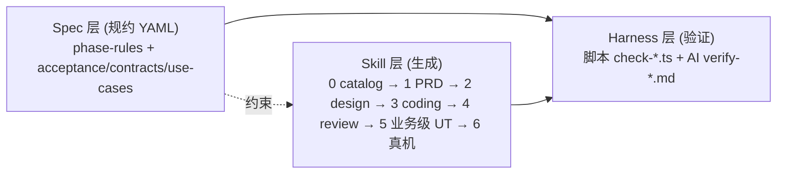

# 业务级 UT 实践复盘 — PPT 大纲（11 页）

> 供演讲用 PPT 的内容骨架。每节 = 一张幻灯片。聚焦 UT 阶段，真机/Skill 6 部分不展开。
>
> 三条输入线：
> - **初衷**：`doc/业务级UT策划.md`
> - **演进**：`.cursor/plans/ut_分层分工与门禁收紧_1c6f6036.plan.md` → `.cursor/plans/ut_v2_修正_usecase去代码化.plan.md`
> - **结果**：`framework/skills/5-business-ut/**`、`framework/specs/phase-rules/ut-rules.yaml`、`framework/harness/scripts/check-ut.ts`、`framework/harness/prompts/verify-ut.md`

---

## P1 · 封面

- **标题**：业务级 UT — 从"写更多测试"到"让业务真正可测"
- **副标题**：一次关于规约、门禁与方法论取舍的复盘
- **项目 / 日期**：SimulatedWalletForHmos · 2026-04
- **视觉**：左侧三阶段时间轴（策划 v1 → 分层 v2 → 规约 v2.1），右侧"规约 YAML + 双 Harness + 样例"三件套示意

---

## P2 · 整体定位：framework 的价值 + 业务级 UT 的不可替代性

> 专家反馈：先讲清整个 framework 在做什么，再讲 UT 才不会跳。本页一页讲清两件事。

### 一、framework 解决什么大问题

> **让 AI 在「弱模型 + 超大代码仓 + 业务专有术语」三重压力下，写出"真的能上线"的代码 —— 而不是看起来能上线。**

| # | 挑战 | 典型表现 |
|---|---|---|
| C1 | **弱模型** + 超大代码仓 | 200K 上下文装不下单个一级模块；几十万行代码靠相似度检索抓不准 |
| C2 | **业务专有术语**字面相似陷阱 | 自然语言术语（"刷卡 / 卡管理 / 我的"）与模块名字面相近但归属不同；AI 没有业务先验只能猜 |
| C3 | **过程产物质量抖动 + 假 PASS** | 同一份 prompt 不同模型产出差异大；UT 覆盖率 80% 看起来漂亮，业务流可能根本没跑过 |

### 二、framework 的核心架构（一句话）

**三层分离 · 七步流水线** —— 生产者 / 验证者 / 契约三方独立，禁止考生自己批改试卷。



- **Skill** 产出文档和代码（PRD / design / 业务代码 / UT / 测试报告）
- **Spec** 沉淀阶段规则与功能契约（`acceptance.yaml` / `contracts.yaml` / `use-cases.yaml`）
- **Harness** 双层守门：脚本做确定性结构检查，AI 做语义级裁判，且 **裁判与生产者必须不是同一个 agent**

### 三、为什么本场聚焦 Skill 5（business UT 的差异化价值）

UT 在整条流水线里 **价值密度最高、最容易被假 PASS 骗过**，是 framework 方法论最具代表性的战场：

| 维度 | business UT 的特殊性 |
|---|---|
| **上下游闸门** | 编译过 + Review 看着对 + 接口级 UT 跑通 **≠ 业务流真的跑通**；UT 是上线前最后一道业务逻辑闸门 |
| **门禁密度全 Skill 之最** | 16 项脚本 Harness + 8 项 AI Harness = **24 项门禁**，整套 framework 里 UT 阶段密度最高 |
| **反模式最集中** | 声明覆盖陷阱 / UI 符号入侵 / inline lambda 不可测，三类典型坑都在 UT 阶段被显式拦下 |
| **唯一三向追溯闭环** | `acceptance.yaml > AC` ↔ `use-cases.yaml > branches[]` ↔ UT `it()` 双标签 `[AC-X][BRANCH-id]`，可机械校验"AC-3 被哪条 UT 覆盖" |

**讲述重点**：framework 的设计哲学（规约驱动 / 双 Harness / 显式门禁）最容易被验真假的就是 Skill 5 —— 后续每一页讲的具体痛点和解法，都是这套方法论在 UT 战场上的具体落地。

---

## P3 · 背景：痛点与解决效果

### 一句话问题定义

> **鸿蒙应用功能复杂、手写 UT 成本极高，而传统 UT 又测不出真正的业务风险。**

### 五大痛点 → 解决对照

| # | 痛点 | 是否解决 | 关键手段 |
|---|---|---|---|
| P1 | 多机型 / 多场景 / 多入口组合爆炸 | ✅ 收敛 | `use-cases.yaml > branches[]` 显式列举，DAG/UT 1:1 映射 |
| P2 | 手写 UT 成本极高 | ✅ 基本解决 | Skill 5 机械翻译 + 样例驱动 + Spy 模板 |
| P3 | **"声明覆盖"陷阱**（调 repo 查 length 就 80% 覆盖率，业务流没跑通） | ✅ 硬门禁 | `it_drives_flow`：≥2 次 boundary callLog 断言 + ≥2 次 state 断言 |
| P4 | **UI 符号入侵 UT**（mock NavPathStack / showToast 疲于奔命） | ✅ 彻底禁 | `ut_import_whitelist` BLOCKER，15+ UI 模式一律拦截 |
| P5 | UT 与业务需求脱节，无法回答"AC-3 被哪条 UT 覆盖" | ✅ 三向追溯 | `acceptance.yaml` ↔ `use-cases.yaml > branches` ↔ UT `it()` 标签 `[AC-X][BRANCH-id]` |

**讲述重点**：P3 / P4 是"伪覆盖"陷阱——数字漂亮但实际为零，是做业务级 UT 的根本动因。

---

## P4 · 方法论总览

### 流水线：PRD → 规约 → 代码 → UT

```
PRD.md
  ▼
acceptance.yaml                  (AC + priority)
  ▼
use-cases.yaml  (仅复杂 feature)（coordinator + ui_bindings + data_boundaries + branches）
  ▼
业务编排代码                     (由 Skill 3 自选形态：Page 方法 / Flow 类 / 导出函数)
  ▼
DAG (test/dag/*.yaml)            (按 branches 展开)
  ▼
UT (*.test.ets)                  (1 branch = 1 it；[AC-X][BRANCH-id] 双标签)
```

### 复杂度阈值：什么时候才写 `use-cases.yaml`

三条件 **任一** 触发，否则用轻量 `acceptance.yaml` + `dag.yaml` 足够：

1. 多 UI 节点（页面+组件 ≥ 2）共享同一业务状态
2. 多步云调用串行（≥ 2 次云端接口顺序依赖）
3. 含回滚分支

### 核心原则

> **UT 是消费者，不驱动架构**。发现代码不可测，反馈 Skill 3 抽命名函数，不在 UT 里造架构。

---

## P5 · 核心机制：规约驱动 + 两条 UT 路径

### `use-cases.yaml` 三大关键字段（以开卡为例）

| 字段 | 价值 | 举例 |
|---|---|---|
| `coordinator` | 指向真实代码符号（类名/方法/函数），**不强制代码形态** | `"CardOpenFlow"` |
| `ui_bindings[]` | UI 事件 ↔ 命名函数映射表，UT 的"导航图" | `{trigger: "点击开卡", calls: "flow.chooseCard"}` |
| `data_boundaries[]` | 打桩对象 = 既有 data 层类，**不造 Port** | `{name: "api", type: "CardOpenApi", kind: "cloud"}` |

### 路径 A：有 `use-cases.yaml`（复杂 feature，如开卡）

```typescript
api = new SpyCardOpenApi()            // 子类化既有 CardOpenApi
flow = new CardOpenFlow(api, store)   // 构造注入既有类

it('[BRANCH-sms_fail_rollback][AC-3] 短验失败回滚', 0, async () => {
  api.whenVerifySmsCode.returns({ ok: false, code: 'SMS_ERR' })
  await flow.chooseCard({...})
  await flow.confirmSms('999999')
  expect(flow.state.phase).assertEqual(Phase.Failed)
  expect(store.callLog).assertDeepEquals(['save', 'rollback'])  // 调用序列
})
```

### 路径 B：无 `use-cases.yaml`（简单 feature，如 home-page）

```typescript
it('[AC-1] 首页服务入口数据契约完整', 0, async () => {
  const entries = await repo.getServiceEntries()
  expect(entries.length > 0).assertTrue()
  expect(entries[0].id).not.assertUndefined()
})
```

**讲述重点**：路径 B 是 v2.1 克制的证据——简单场景不硬套 UseCase。

---

## P6 · 双 Harness 门禁 + 实效

### 脚本 Harness（`check-ut.ts`，16 项确定性检查）

| 类别 | 代表规则 |
|---|---|
| Schema | `usecase_spec_schema` · `dag_schema_compliance` · `dag_node_type_valid` |
| 质量（BLOCKER） | **`ut_import_whitelist`** · **`boundaries_all_stubbed`** · `it_name_has_ac_or_branch_tag` |
| 驱动力 | `it_drives_flow`：每个 `it()` ≥ 2 次 boundary 调用 + ≥ 2 次 state 断言 |
| 追溯（BLOCKER） | `ut_case_per_unit_ac` · `branch_coverage_full` · `acceptance_coverage` |

### AI Harness（`verify-ut.md`，8 项语义检查）

| 检查 | 回答什么问题 |
|---|---|
| **`end_to_end_driving` (BLOCKER)** | UT 是否真端到端驱动，而不是数据接口测试？ |
| `state_model_completeness` | 状态机是否漏态？ |
| `handler_reachable` | `calls` 目标是命名函数还是空壳转发？ |
| `branch_coverage_semantic` | 分支是否覆盖 PRD 异常路径？ |
| `stub_reasonableness` / `test_isolation` | Spy 预设值与 model 吻合？beforeEach 重建？ |

### 开卡样例 实效（`examples/card-opening/`）

- 6 个分支（happy / validate_fail / apply_fail / persist_fail / sms_fail_rollback / user_cancel）
- UT `unit/both` AC 覆盖率 **100%**，分支覆盖 **100%**
- 生成物 9 个文件（use-cases / DAG / UT / 2 个 Spy / Flow / README / device-todo / design 片段）

---

## P7 · 演进全景：v1 → v2 → v2.1 的代价

| 版本 | 核心动作 | 结果 |
|---|---|---|
| **v1** `doc/业务级UT策划.md` | 定义 DAG + AI 生成 + 修正循环 | ✅ 明确抓手；但回答不了"测什么对应什么" |
| **v2** `ut_分层分工与门禁收紧` | 强制抽 `UseCase` 代码类 + `Port` 接口 + 构造注入 | ❌ 把 Hexagonal 硬塞进简单 feature，home-page 试点翻车 |
| **v2.1** `ut_v2_修正_usecase去代码化` | UseCase 降级为 **YAML 规约**；代码形态 Skill 3 自选 | ✅ 规约驱动、复杂度阈值、门禁收紧，范式锁定 |

### 两次升级的澄清点（来自 plan 表）

- 轮 1：UT 不应只统计"声明覆盖"；纯 UI 替身不要做
- 轮 2：但 UT **必须能跑完一条业务流程**（云侧 / 本地 / 用户事件串联），多用例覆盖成功 / 校验失败 / 短验失败 / 持久化失败

**核心矛盾**：业务流程要端到端地测 **且** 不 mock UI —— 唯一出路是把业务流程从页面里抽出来变成独立符号，UT 只测这个符号。

**讲述重点**：v2 → v2.1 是本次复盘最重要的教训：**做框架最大的风险不是做不出来，是做多了**。

---

## P8 · 坑 1 / 2 / 3：三个 UT 反模式的解法

### 坑 1：声明覆盖陷阱

```typescript
// 反面教材：80% 覆盖率，业务流完全没跑
it('测试开卡', async () => {
  const r = await cardRepo.getCardList()
  expect(r.length).assertLargerThan(0)
})
```

- **解法**：`it_drives_flow`（MAJOR）+ `end_to_end_driving`（BLOCKER）
- **量化门槛**：≥ 2 次 boundary callLog 断言 + ≥ 2 次 state 断言
- **证据**：`verify-ut.md` 第 110-125 行将该反例显式列为 verdict=FAIL

### 坑 2：UI 符号入侵 UT

为 mock `NavPathStack` / `showToast` 造 Fake 类，SDK 一升级就全红。

- **解法**：`ut_import_whitelist` (BLOCKER)，UT 禁 import 15+ UI 模式（`@Component` / `@Entry` / `NavPathStack` / `showToast` / `$r(` / `$rawfile(` / `AppStorage` / `LocalStorage` / `@kit.ArkUI` …）
- **证据**：`check-ut.ts` 第 30-72 行 `UI_FORBIDDEN_PATTERNS` + `scanForbiddenImports`

### 坑 3：业务逻辑藏在 inline lambda

```typescript
// 反例：UT 无法直调
Button('开卡').onClick(async () => {
  const r = await validateCard(...)
  if (!r.ok) { showToast(...); return }
  // ...
})
```

- **解法**：`named_business_handler` (BLOCKER) —— `ui_bindings.user_actions.calls` 指向的符号必须是命名函数/方法，不能只是 inline lambda
- **正例**：`Button('开卡').onClick(() => this.flow.chooseCard(bankInfo))`，`flow.chooseCard` 为命名方法 → UT 可直接 await

---

## P9 · 重点坑：v2 过度架构化翻车

### 症状（来自 `ut_v2_修正_usecase去代码化.plan.md` 开头）

v2 要求所有 feature 必须产出：
- `domain/usecase/XxxUseCase.ets`（独立类）
- `XxxPort` 接口（端口抽象）
- 构造器注入所有依赖

实操翻车：
- **home-page**（单点加载）被迫抽出 `HomeLoadingUseCase` + `HomeDataPort`
- 一个"拉两个接口展示"的简单场景被套进 Hexagonal Architecture
- framework 的硬规则（`usecase_spec_exists` / `usecase_class_pure`）会**系统性诱导**后续 feature 重复犯错

### v2 → v2.1 的校正

| 反模式（v2） | 校正（v2.1） |
|---|---|
| UseCase 必须是 `.ets` 类 | UseCase = YAML 规约文档 |
| 必须新造 Port 接口 | `data_boundaries[].type` 直接引用 `contracts.yaml` 既有类 |
| 所有 feature 都要产 use-cases.yaml | 三复杂度条件任一触发才产 |
| UT 驱动架构设计 | UT 是消费者，不可测反馈 Skill 3 抽命名函数 |

### 现态证据

- plan 回退任务：`revert-home-page-usecase` + `drop-code-form-rules`
- home-page 现态：`home_page_ut.test.ets` 仅 34 行，直接针对 `HomeRepository`，无 UseCase/Port 残留

### 教训

> **做框架最大的风险不是做不出来，是把某种架构风格强塞进所有场景。**
>
> v2 → v2.1 删除 6 条硬规则，新增 3 条（`named_business_handler` / `ut_import_whitelist` / 复杂度阈值 WARN）。

---

## P10 · 未解的坑与思路

### 坑 A：弱模型吞字反转语义

**现象**：中低端模型把模板里的"**不**要 X"吞成"要 X"，中文单字吞掉后语法通顺、语义反转。

| 原文 | 落地 | 后果 |
|---|---|---|
| "本 Skill **不**会覆盖 catalog" | "本 Skill 会覆盖 catalog" | 下次重跑毁资产 |
| "**严禁**在未确认前覆盖 config" | "在未确认前覆盖 config" | 绕过人工门禁 |

**思路**（`.cursor/plans/弱模型吞字防护_framework-init.plan.md`）：
- Data-driven over LLM-driven：能机械渲染的退出 LLM 文字流
- 三分区纪律：`skeleton` 禁改 / `data` 可重算 / `narrative` 允许 AI
- 正向 over 负向：白名单替代"不要 X"
- negation-diff verifier 兜底

**状态**：计划已出，UT SKILL 的负向表达待按此计划滚一遍。

### 坑 B：ArkTS `@Component struct` 在 hypium 下不可 new

- **不解决，接受约束**：把它变成原则红线 —— `ut_import_whitelist` 禁所有 UI 符号，业务编排必须抽成可直调的命名符号
- **剩余风险**：依赖"UI 副作用委派出去"的闭环能被下游消化

### 坑 C：分支组合爆炸

- `use-cases.yaml > branches[]` 显式列举是收敛手段，但 N × M 组合仍可能膨胀
- 当前靠 `branch_coverage_semantic` (MAJOR) AI 复核 + 人工裁剪兜底
- 未来可能引入参数化节点（v1 策划里提过，v2.1 未启用）

### 坑 D：无真实复杂模块可压测方法论

- 当前仓里最复杂的是 home-page，不足以验证 v2.1 在开卡级复杂流程下的真实收益
- `examples/card-opening/` 作为纸面样例沉淀方法论，等真实接入时再实战检验

---

## P11 · 总结

### 四条核心原则

1. **UT 是消费者，不驱动架构** — 发现不可测，反馈 Skill 3 抽命名函数
2. **规约先于代码** — `use-cases.yaml` 让 AI 机械翻译，比让 AI "理解"稳定
3. **门禁胜过规范** — 文字里的"应该 / 禁止"靠不住，要落到 `check-ut.ts` + `verify-ut.md` 可执行
4. **量入为出** — 三复杂度条件任一才用重装武器，简单场景走轻量路径

### 阶段性成果

| 维度 | 交付件 |
|---|---|
| Skill 定义 | `framework/skills/5-business-ut/SKILL.md` 490 行（v2.1） |
| 结构门禁 | `framework/specs/phase-rules/ut-rules.yaml` 16 项 |
| 脚本 Harness | `framework/harness/scripts/check-ut.ts` ~2180 行 |
| AI Harness | `framework/harness/prompts/verify-ut.md` 8 项语义检查 |
| 规范样例 | `framework/skills/5-business-ut/examples/card-opening/` 9 文件 |
| 真实试点 | `02-Feature/WalletMain` home-page UT + DAG |

### 一句话结论

> **业务级 UT 的本质不是写更多测试，而是让业务流程"可被 UT 调用"——这件事的成本一半在代码可测性，一半在门禁与追溯。**

---

> **演讲节奏建议**
> - P7 演进全景 + P9 v2 翻车 是全场 highlight，合计时间占 30%
> - P6 双 Harness 是技术干货高峰，建议现场演示一次 `check-ut.ts` 运行截图
> - P10 未解的坑可作为开放话题，邀请提问思路
