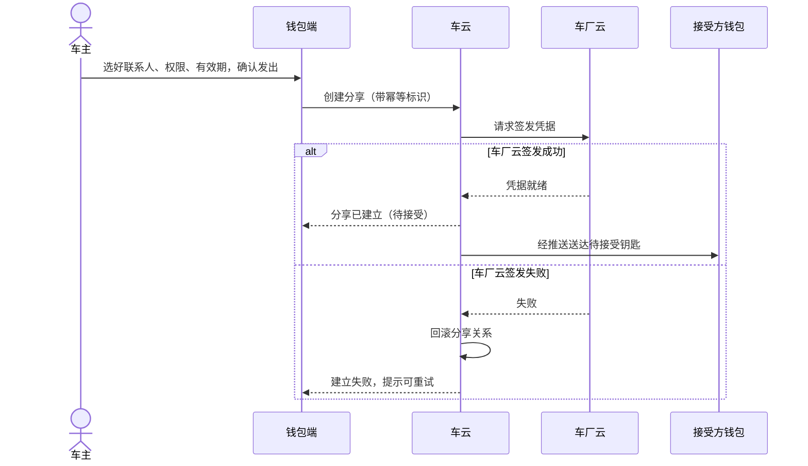
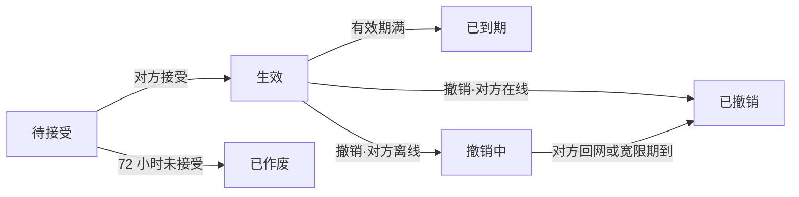

# 数字车钥匙分享 系统设计说明

> 车云侧整理，配合产品需求稿一起看。分享链路涉及钱包、车云、车厂云三方，
> 本说明约定各方分工、接口与失败处理。

## 1. 整体协作

分享关系的**真源在车云**；钥匙最终能不能开车，裁决在**车厂云**——车辆只认车厂云签发的凭据。
发起一条分享要两边都点头：车云建立分享关系，车厂云给接受方签发凭据。**一成一败必须回滚**，
不允许出现「关系建了、凭据没发」的半生效状态。

| 参与方 | 输入 | 输出 | 责任 | 失败边界 |
|---|---|---|---|---|
| 钱包端 | 用户动作、车辆与联系人选择 | 分享请求、状态展示、撤销请求 | 收集分享三要素、展示状态、发起撤销 | 不签发凭据，不裁决钥匙可用性 |
| 账号能力 | 登录请求 | 登录态与账号标识 | 提供既有身份能力 | 未登录不允许发起或接受 |
| 车云 | 分享三要素、幂等标识 | 分享关系、状态、配额 | 分享关系的建立、状态维护与配额判定 | 分享关系的唯一真源 |
| 车厂云 | 车云的签发请求 | 钥匙凭据、失效指令 | 凭据签发与车辆侧失效下发 | 钥匙可用性的最终裁决方 |
| 消息推送 | 分享与撤销事件 | 到达接受方的通知 | 送达待接受与失效通知 | 推送失败不改变分享关系 |

## 2. 发起分享的时序

## 3. 分享状态机

六个状态互斥；「撤销中」期间车辆侧已按车厂云下发的失效指令拒绝该钥匙，
宽限窗口只影响对方设备上钥匙卡片的消失时间，不影响车辆侧的拒绝。

## 4. 接口约定

### 4.1 `queryKeySharingQuota`

入参车辆标识；返回剩余可分享数与现有分享清单摘要。进入分享设置页与管理页时调用。
配额按「生效 + 待接受」合计判定，满额时返回不可发起及原因。

### 4.2 `createKeySharing`

入参车辆标识、对方账号标识、权限档、有效期、**幂等标识**；返回分享标识与「待接受」状态。
同一幂等标识重复请求返回同一条分享，不重复建立。车厂云签发失败时本接口返回失败且不留关系。

### 4.3 `acceptKeySharing`

入参分享标识；触发车厂云向接受方设备下发凭据，返回凭据状态。凭据下发失败保持「待接受」，可重试。

### 4.4 `revokeKeySharing`

入参分享标识；对方在线时即时失效返回「已撤销」；离线时返回「撤销中」，
宽限窗按 48 小时计，窗内对方设备回网即完成失效。车辆侧的拒绝自撤销发起即生效。

### 4.5 `queryKeySharingList`

入参车辆标识；返回每条分享的状态、权限、有效期与对方脱敏标识，供管理页展示。

## 5. 数据与存储

- `key_sharing_draft`：发起草稿——联系人、权限档、有效期、幂等标识。发起途中退出或断网，
  回来凭它接着办；发出成功即清除。按账号隔离，退出登录清除。
- 分享列表**不做本地缓存**：钥匙类数据不落盘，每次进页从云侧拉取；断网时管理页给网络失败态。
- 对方标识全程只以脱敏形态出现在端侧页面、日志与事件里。

## 6. 配置与事件

| 项 | 约定 |
|---|---|
| 分享功能开关 | 默认关闭，随版本放开；关闭后不能发起新分享，已生效分享不受影响 |
| 权限档位文案 | 云侧配置下发，端侧不写死 |
| 事件 | 分享发起、接受、撤销、失效四类；只带车型类别、阶段与结果分类，不带车牌、账号、位置；上报失败不改变分享关系 |

## 7. 失败与恢复

| 异常 | 用户表现 | 系统处理 | 要点 |
|---|---|---|---|
| 车厂云签发失败 | 发出失败，可重试 | 车云回滚分享关系 | 不留半生效 |
| 接受时凭据下发失败 | 保持待接受，可重试 | 不改变分享关系 | 重试不产生新分享 |
| 撤销时对方离线 | 显示撤销中 | 宽限窗内对方回网即失效 | 车辆侧自撤销起即拒绝该钥匙 |
| 发起中断（退出 / 断网） | 回来接着上次的选择 | 草稿续办，同一幂等标识 | 不发出第二条 |
| 配额已满 | 发起入口置灰并给原因 | 不发请求 | 原因来自配额接口返回 |
| 账号切换 | 草稿清空，列表按新账号拉取 | 按账号隔离 | 不跨账号带出草稿或列表 |

## 8. 交付

先联调创建与接受两条链路，再联调撤销与失效；开关放开前观察四类事件的失败分类。
推送到达率不作为本需求的验收项——推送失败由对方主动打开钱包时补拉待接受列表兜底。
