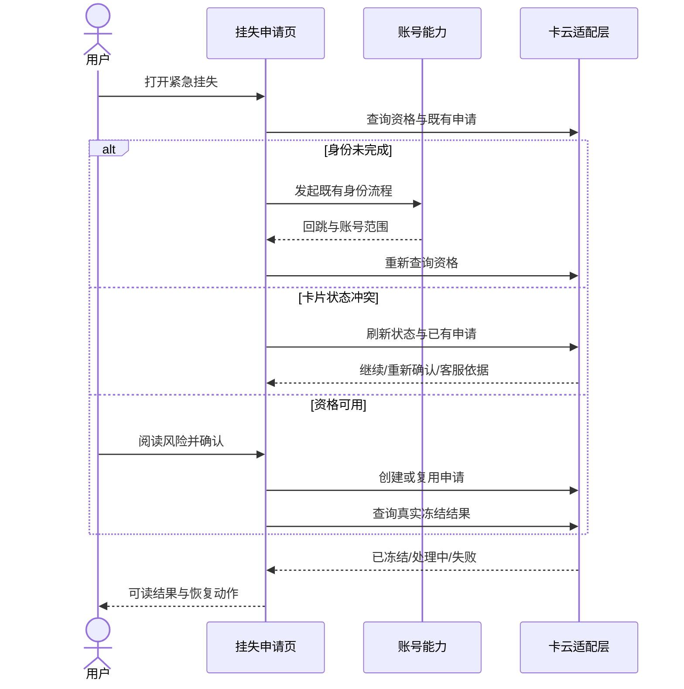

# SR90004 交通卡紧急挂失与补卡 — 系统设计

> 关联 RR90004。

## 0. 开发单拆分

本设计**拆成两张开发单**下发：

| 开发单 | 承载 | 交出 |
|---|---|---|
| AR90004 | 钱包端的挂失页面、业务编排、上下文保存和卡云适配 | `freezeTicketId` 与最终冻结状态 |
| AR90005 | 补卡地址收集、费用确认、订单创建、支付恢复与制卡跟踪 | 补卡订单结果 |

两单共享挂失上下文与 `freezeTicketId`；执行顺序固定为挂失成功后再补卡。
AR90004 未完成会阻塞 AR90005 的联调与正式开放；AR90005 的支付或通知失败不反向改变冻结结果。
账号能力与通用 UI 以既有出口被两单消费，不在本次修改范围内。

## 1. 全局方案

钱包端以云侧资格和申请状态为事实源，将一次挂失处理划为“加载资格、等待风险确认、身份恢复、冲突恢复、
创建或复用申请、确认冻结结果”几个业务阶段。页面根据每一步的业务结果决定下一项操作；需要用户阅读、
确认或完成身份时停止自动推进，由新的用户动作继续。

资格可用、身份不完整、卡片状态冲突和已存在申请不是同一个简单返回分支。每条路径都包含自己的查询、
上下文校验、外部能力调用、恢复与失败收敛，最终统一映射为用户可理解的页面状态。

## 2. 责任矩阵

| 参与方 | 输入 | 输出 | 责任 | 失败边界 |
|---|---|---|---|---|
| 钱包主应用 | 用户动作、脱敏卡片上下文、外部结果 | 页面状态、挂失请求、恢复动作 | 组织页面交互与业务路径，保存安全检查点 | 不绕过身份，不自行认定冻结成功 |
| 账号能力 | 身份请求与回跳上下文 | 登录实名结果、当前账号范围 | 提供既有身份能力 | 失败时返回明确结果，不持有挂失申请 |
| 交通卡云适配层 | 脱敏映射后的卡片标识、账号范围、幂等键 | 资格、既有申请、创建结果、冻结状态 | 承接本需求所需云侧协议并保持幂等 | 是资格和冻结结果的唯一事实源 |
| AR90005 补卡单 | `freezeTicketId`、最终冻结状态 | 补卡订单、支付与制卡进度 | 承担费用确认、支付恢复、制卡跟踪和客服交接 | 不复制挂失或自行改变冻结状态 |
| 支付与通知能力 | 补卡订单、云侧状态事件 | 支付结果、状态提醒 | 由 AR90005 调用既有能力 | 支付中断不重复建单；通知失败不改变业务结果 |
| 通用 UI | 页面状态与可读文案 | 通用加载、提示、按钮和结果组件 | 提供现有视觉与交互基础 | 不承载挂失业务状态 |

## 3. 端到端时序

## 4. 接口约定

### 4.1 `queryLossEligibility`

输入脱敏映射后的 `cardId` 与 `accountScope`，返回 `eligible`、`identityRequired`、`cardState`、
`existingApplication` 和可读原因。打开页面、身份回跳、冲突恢复时调用；无后台轮询。

### 4.2 `createOrReuseLossApplication`

输入卡片标识、账号范围、用户确认和稳定幂等键。存在有效申请时返回原 `applicationId`；否则创建并返回
`submitted` 状态。响应丢失后再次调用也不得创建第二份申请。

### 4.3 `queryFreezeResult`

输入 `applicationId`，返回 `frozen`、`processing` 或 `failed` 及可读原因。只有 `frozen` 能驱动成功页面。

## 5. 数据、状态与恢复

`loss_report_recovery_context` 保存 `maskedCardId`、`accountScopeHash`、`checkpoint`、`idempotencyKey`、
`applicationIdDigest` 和更新时间。它按账号隔离，不随备份恢复；最终成功、明确失败、账号变化或超过有效期时清理。

云侧确认冻结后，AR90004 将 `freezeTicketId` 和最终冻结状态交给 AR90005。共享挂失上下文保留到补卡完成或取消；
补卡完成后清理，补卡取消后仍保留旧卡冻结结果。

页面对外状态为：资格加载、等待风险确认、等待身份、状态冲突、提交中、结果确认中、已冻结、处理中、失败。
内部执行步骤不直接作为 UI 状态。每条失败只有一个收敛位置，由页面状态给出重试或客服动作。

## 6. 配置、质量与安全

| 项目 | 约定 |
|---|---|
| 功能开关 | `traffic_card_emergency_loss_enabled` 默认关闭；关闭或读取失败时隐藏入口。 |
| 调用频次 | 只由打开、身份回跳、用户重试和重新进入触发；页面停留期间无轮询和后台任务。 |
| 防重入 | 请求期间同一业务动作只执行一次；回调到达已销毁页面时只更新安全上下文。 |
| 兼容 | 读到旧版或损坏上下文时清理并从资格查询开始，不根据旧缓存展示成功。 |
| 隐私 | 日志和埋点只记录阶段、结果类型与匿名入口，不记录完整卡号、账号、申请号或认证参数。 |
| 界面适配 | 使用资源文案、语义色和方向性布局；大字体、深色主题和 RTL 下保持主要动作可见。 |
| 业务事件 | `loss_flow_start`、`loss_flow_result`、`loss_flow_recovery` 只带匿名入口、阶段和结果分类；上报失败不改变挂失结果。 |

## 7. 异常与交付协同

| 异常场景 | 用户表现 | 系统处理 | 验收重点 |
|---|---|---|---|
| 身份取消或失败 | 停留在身份说明，可重新发起或退出 | 清理一次性认证参数，保留脱敏卡片检查点 | 不调用创建接口 |
| 状态冲突 | 展示最新状态与可选动作 | 先刷新资格和既有申请，再决定继续、重确认或客服 | 不用本地缓存覆盖云侧 |
| 创建响应丢失 | 展示处理中并允许确认结果 | 以同一幂等键查询或复用申请 | 不重复创建 |
| 结果查询失败 | 展示未确认状态和重试 | 保留申请摘要，不标记已冻结 | 失败不伪装成功 |
| 页面销毁/重新进入 | 恢复到安全检查点或重新开始 | 校验账号、上下文版本和有效期 | 不跨账号恢复 |

钱包主应用负责两单的端侧实现与端到端验收；账号与通用 UI 维护者只需确认既有出口的使用方式；
卡云接口由本仓适配层提供可控结果，用于覆盖正常、身份、冲突、响应丢失和失败路径。

交付时先联调资格、创建/复用和冻结结果，再由 AR90005 联调补卡支付与通知；开关默认关闭，
观察错误分类和恢复结果后开放。回退只关闭新入口并保留查询既有申请的能力，不删除处理中上下文，
也不把通知失败解释为冻结失败。
