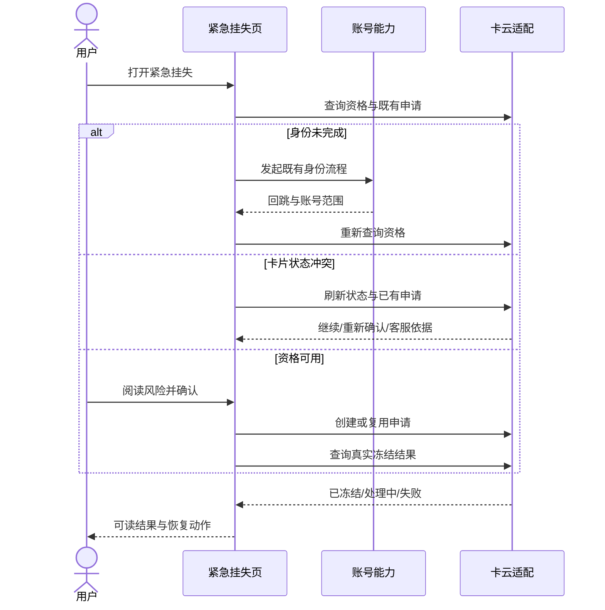

# AR90004 交通卡紧急挂失恢复

## 背景与目标

用户遗失实体交通卡时，最迫切的是尽快让旧卡失效。现在的卡包只能展示卡片：遇到账号未验证、
卡片状态冲突或网络中断，用户只能离开钱包去找线下渠道；等回来重开应用，也不记得上一轮已经处理到哪一步。

本需求在钱包内补上一条**在线紧急挂失路径**，并且这条路可以被中断后继续。正常用户能快速完成
申请并看到真实结果；身份没完成、卡片状态冲突或提交被中断的用户，能看到明确原因、做完必要的
操作后回到原来的处理位置。

做成什么算成功，看四个口径。风险控制上，端侧任何分支都不许把「已提交」或缓存状态当成「已冻结」。
连续体验上，身份校验、冲突确认和网络恢复后，用户能回到有意义的检查点继续。防重上，响应丢失、
重复点击和重新进入都不会创建重复申请。可审查上，正常、身份、冲突、响应丢失和失败这些路径，
都能从需求追到实现与验证。

> 本需求不是孤立的：完整特性还包含兄弟单据 AR90005 承担补卡费用支付、制卡进度、领取通知和客服交接。
> 本 AR 在云侧确认冻结后交出 `freezeTicketId` 与最终冻结状态，那之后 AR90005 才开始它的部分。

## 术语

这一章把后文会反复出现的名词先定下来，避免每个读者自己猜。

| 术语 | 含义 |
|---|---|
| 紧急挂失 | 用户在钱包内发起的交通卡封锁动作：申请云侧冻结旧卡。 |
| 资格检查 | 进入挂失流程前的准入判断：云侧返回能不能挂失、要不要先补身份、卡片当前状态与是否已有申请。 |
| 身份回跳恢复 | 身份未完成时，保留脱敏上下文走既有身份能力，成功后回到原检查点继续。 |
| 卡片状态冲突 | 云侧卡片状态与本地申请上下文不一致，需要先刷新云侧再决定下一步。 |
| 挂失上下文 | 中断后恢复用的本地留存：脱敏卡片标识、账号范围哈希、检查点、幂等键、申请号摘要。 |
| 交接 | 云侧确认冻结后，把 `freezeTicketId` 与最终冻结状态交给兄弟特性 AR90005。 |
| 卡云适配层 | 本仓数据层里模拟云侧协议的适配：提供资格、既有申请、创建结果与冻结状态，保持幂等。 |

容易混淆的两组：**紧急挂失**是申请冻结旧卡，**补卡**是后来的制卡与支付，两者分属本 AR 与兄弟 AR90005。
**资格检查**回答「能不能申请」，**状态冲突**是申请过程中卡片当前状态与上下文不符的另一类分支。

## 范围与边界

本特性在钱包端做五件事：资格与风险确认、身份回跳恢复、状态冲突恢复、创建或复用挂失申请、
以及查询并展示真实冻结结果。所有交互都发生在**紧急挂失这一个页面**内，页面根据云侧返回的
业务结果决定下一块内容与可操作项。

**不做什么**：端侧不自行宣称冻结成功——「已提交」与「已冻结」是两个事实，前者不代表后者。
身份能力不新建，只复用既有登录/实名出口；挂失上下文不保存完整卡号、实名信息、完整申请号或认证参数。

**与本单无关、但需要其他设施完成的事**：卡片状态冲突后的线下客服处理不在本 AR 内；
冻结成功的补卡费用支付、制卡进度、领取通知与客服交接全归兄弟 AR90005。

**依赖关系**：本 AR 用到的身份能力来自既有账号能力，通用 UI 组件与脱敏工具来自系统基座，都是已在用的出口。
本 AR 不阻塞任何独立排期项；反过来，**AR90005 依赖本 AR 的交接结果**——没有有效的 `freezeTicketId`
与最终冻结状态，补卡不得开始。本 AR 未完成会阻塞 AR90005 的联调与正式开放。

**场景索引**（对应需求规格的使用场景）：S1 正常用户提交、S2 身份未完成恢复、S3 卡片状态冲突恢复、
S4 响应丢失/中断后恢复——四条场景都落在本 AR 的钱包端页面内。

## 业务方案

端侧以云侧资格与申请状态为事实源，把一次挂失处理划成几个业务阶段：加载资格、等待风险确认、
身份恢复、冲突恢复、创建或复用申请、确认冻结结果。页面按每一步的业务结果决定下一项操作；
需要用户阅读、确认或完成身份时停止自动推进，由新的用户动作继续。

**参与方与分工**：

| 参与方 | 承担什么 | 失败边界 |
|---|---|---|
| 钱包主 feature（本 AR） | 组织页面交互与业务路径，保存安全检查点 | 不绕过身份，不自行认定冻结成功 |
| 账号能力 | 提供既有登录/实名结果与当前账号范围 | 失败返回明确结果，不持有挂失申请 |
| 卡云适配（本仓数据层） | 提供资格、既有申请、创建结果、冻结状态，保持幂等 | 是资格与冻结结果的唯一事实源 |
| 兄弟 AR90005 | 承接 `freezeTicketId`，做补卡订单、支付、制卡与客服 | 不复制挂失，不改动冻结状态 |
| 通用 UI / 通用能力 | 提供加载、提示、按钮、结果组件与脱敏工具 | 不承载挂失业务状态 |

**端到端过程**：用户打开紧急挂失 → 页面查询资格与既有申请 → 按结果分支（身份未完成走既有身份
流程后重查资格；状态冲突先刷新云侧；资格可用则展示风险说明）→ 用户确认后创建或复用申请 →
页面查询真实冻结结果 → 只有 `frozen` 才展示成功。本部件处在链路的用户入口一侧，身份、冲突、
网络中断这些分支都在这一侧被接住。

**关键取舍**：三条接口约定直接反映「云侧是唯一事实源」——资格、创建/复用、结果查询三件事都定义成
独立的查询/动作，端侧只在确认冻结后接管交接字段。被否掉的方案是「端侧缓存持卡状态再自行判定」：
缓存可能过期或损坏，一旦把「已提交」当成功演给用户，就违背了本需求最核心的风险控制口径。

**数据约定**：挂失上下文（存储键 `loss_report_recovery_context`）保存脱敏字段，按账号隔离、不随备份恢复；
成功、明确失败、账号变化或超过有效期时清理。云侧确认冻结后交出 `freezeTicketId` 与最终冻结状态，
共享挂失上下文保留到补卡完成或取消：完成后清理；取消只结束补卡办理，旧卡仍保持冻结。

## 业务流程

整个挂失过程从卡包入口开始，到用户看到真实冻结结果结束。示意如下：

**主路径**：入口 → 资格可用 → 阅读风险确认 → 创建申请（幂等键）→ 查询真实冻结结果 → 展示已冻结，
云侧确认冻结后把 `freezeTicketId` 交给补卡方 AR90005。

**分支去向**：

- **身份未完成**：保存脱敏卡片上下文 → 走既有身份能力 → 回跳后重查资格 → 回到确认位置；
  回跳到的账号不同则清空上下文、重新选卡。
- **卡片状态冲突**：先刷新云侧资格与既有申请 → 给「继续既有申请 / 重新确认 / 转客服」。
- **响应丢失**：以同一幂等键查询既有申请 → 复用原 `applicationId`，不重复创建。
- **查询结果中**：展示处理中状态，允许重新确认结果；`processing` 保持可恢复，`failed` 展示失败页。
- **网络中断（资格/提交/结果任一步）**：保留最近安全检查点，用户重试后从该检查点继续。

**终态**只有三种用户可见的口径：已冻结、仍在处理（处理中）、处理失败。中间的执行步骤不作为
界面状态对外展示；每条失败只有一个收敛位置，由页面状态给出重试或客服动作。

## 功能说明

挂失功能在**一个页面**内完成全部确认、恢复与结果查看（参考图见下）。业务返回决定下一块内容和可操作项；
用户尚未确认风险、尚未完成身份或正在读冲突说明时，页面停留在等待操作，不自动越步。

图里三块从左到右分别是：资格与风险确认（正在核对卡片与账号 → 冻结影响与数据说明 → 确认并继续）、
恢复处理（身份未完成去验证/回跳后重校核验，状态冲突先刷新云侧再给继续/重确认/客服，以及安全停留并重试）、
云侧结果（仅云侧确认后显示已冻结，失败时保留重试/客服）。

**功能与状态一览**：

| 功能 | 触发条件 | 预期结果 | 页面状态 |
|---|---|---|---|
| 入口与开关 | 卡包选择紧急挂失 | `traffic_card_emergency_loss_enabled` 开启时入口可见，关闭或读取失败隐藏 | 资格加载 |
| 资格检查 | 打开页面/身份回跳/冲突恢复 | 展示资格、既有申请与卡片状态；确认前不提交 | 等待风险确认 / 等待身份 / 状态冲突 |
| 风险确认 | 资格可用 | 用户阅读并确认后才进入提交 | 提交中 |
| 身份回跳恢复 | 身份未完成 | 保留脱敏上下文，回跳重查资格回确认位置 | 等待风险确认 |
| 冲突恢复 | 状态冲突 | 刷新云侧后给继续/重确认/客服 | 状态冲突 |
| 创建/复用申请 | 确认后提交 | 幂等创建或复用原申请，不重复建 | 提交中 |
| 结果确认 | 云侧受理 | 查询真实冻结结果 | 结果确认中 |
| 已冻结/处理中/失败 | 结果返回 | 仅 frozen 展示成功；其余给可读原因与动作 | 已冻结 / 处理中 / 失败 |

页面对外状态集合：资格加载、等待风险确认、等待身份、状态冲突、提交中、结果确认中、已冻结、处理中、失败。
内部执行步骤不直接映射为 UI 状态；每条失败只有一个收敛位置。

**功能索引**（对应需求规格的功能清单）：F1 入口与开关、F2 资格检查与风险确认、F3 身份回跳恢复、
F4 状态冲突恢复、F5 创建或复用申请、F6 结果确认与交接、F7 挂失上下文保存与恢复、F8 防重入与失败提示。

## 异常与恢复

挂失路径有六类主要异常，每一类都要给用户可读原因、恢复动作，且不误报成功、不重复创建。

| 异常 | 用户看到 | 系统处理 | 恢复方式 |
|---|---|---|---|
| 身份取消或失败 | 停留在身份说明，可重新发起或退出 | 清理一次性认证参数，保留脱敏卡片检查点 | 重新发起身份或退出 |
| 卡片状态冲突 | 展示最新状态与可选动作 | 先刷新资格和既有申请，再决定继续/重确认/客服 | 继续申请或转客服 |
| 创建响应丢失 | 展示处理中并允许确认结果 | 以同一幂等键查询或复用申请 | 重试确认结果 |
| 结果查询失败 | 展示未确认状态和重试 | 保留申请摘要，不标记已冻结 | 重试查询 |
| 页面销毁/重新进入 | 恢复到安全检查点或重新开始 | 校验账号、上下文版本与有效期 | 不跨账号恢复 |
| 上下文损坏/旧版本 | 重新走资格流程 | 清理并从资格查询开始，不按旧缓存展示成功 | 重来 |

**风险排序**：最要紧的是「不把已提交当已冻结」——创建成功但结果未确认时若展示成功，用户会误以为
旧卡已停用。其次是重复创建——响应丢失或重复点击若产生第二份申请，会带来不可控的后续处置成本。
这两类风险用统一手段兜底：**只有 `queryFreezeResult` 明确返回 `frozen` 才驱动成功页**，**所有创建
都带稳定幂等键**并用它复用既有申请。其余异常都收敛到「可读原因 + 重试/客服」，不进入业务成功分支。

观察失败也不改变业务：记录或上报失败时，挂失的流程、结果、分支与重试都不受影响——上报是旁路，
不是业务判断的一部分。

**异常索引**（对应需求规格的异常/边界场景）：E1 资格检查失败、E2 身份取消或失败、E3 卡片状态冲突、
E4 创建响应丢失、E5 结果查询失败、E6 页面销毁/重新进入、E7 上下文损坏/旧版本、E8 重复点击。

## 验收

验收按十条产品场景和一轮质量指标展开。产品场景来自产品需求的验收意图，端侧逐条可测：

| 编号 | 验收什么 | 预期 | 质量属性 |
|---|---|---|---|
| AC-1 | 功能开关 | 默认关闭时卡包不展示入口，开启后可见 | 入口管控 |
| AC-2 | 资格确认顺序 | 先资格后风险，确认前不可提交，无轮询 | 流程正确 |
| AC-3 | 身份回跳恢复 | 回跳回到同一卡片和原检查点，重核验后继续 | 断点续做 |
| AC-4 | 冲突恢复 | 刷新云侧后给继续/重确认/客服，不误报成功 | 真源为准 |
| AC-5 | 防重创建 | 只创建一次，响应丢失重试复用原申请 | 幂等 |
| AC-6 | 防重点击 | 请求期间重复点击不产生第二次创建 | 防重入 |
| AC-7 | 结果准确性 | 仅 frozen 展示成功；处理中/失败给可读原因与动作 | 真源为准 |
| AC-8 | 失败提示 | 每阶段失败都有原因、重试入口与安全停留 | 可恢复 |
| AC-9 | 重新进入恢复 | 有效期内恢复检查点，账号变化或失效则清空重来 | 断点续做 |
| AC-10 | 交接与制动 | 只有有效 `freezeTicketId` 和最终冻结状态才能进入补卡 | 跨特性 |

质量指标三条：资格检查从进入页面到结果可见 ≤ 1500 毫秒（资格检查从进入页面到结果可见 ≤ 1500 毫秒；提交与结果确认 ≤ 200…（待 开发确认 确认，见《决策与评审记录》））；提交与结果确认 ≤ 2000 毫秒
（资格检查从进入页面到结果可见 ≤ 1500 毫秒；提交与结果确认 ≤ 200…（待 开发确认 确认，见《决策与评审记录》））；资格查询只由打开、回跳、重试、重进触发，页面停留无轮询（资格查询只由打开页面、身份回跳、用户重试和重新进入触发；页面停留期间无轮询和…（已定，见《决策与评审记录》））。
前两条是本工程设定、无上游依据；触发频次口径是上游约束。

另外两条产品级验收：界面参考图保留在归档件中、替代文本可读且本地链接有效（AC-G1 相关）；
页面上不出现完整卡号、实名信息、完整申请号或认证参数（AC-G2 相关）。通用口径 AC-G1 页面在
HarmonyOS 5.0 设备正常显示无布局错乱、深色模式与大字体下主要动作可见；AC-G2 页面/日志/埋点
不出现完整卡号、实名信息、完整申请号或认证参数；AC-G3 通知失败不改变云侧冻结结果、补卡订单确认前
不扣费、支付中断不重复建单（AC-G3 的支付/通知部分属于兄弟 AR90005 联调侧，本 AR 只保证自身
不把通知失败解释为冻结失败）。支付与通知对业务结果的影响不在本 AR 验收范围——那属于兄弟 AR90005
（付款前不扣费、支付中断不重复建单、通知失败不改变云侧业务结果，都在兄弟单据侧验收）。

## 交付与上线

上线涉及钱包主 feature、卡云适配（本仓数据层）、既有账号能力与兄弟 AR90005 补卡特性，外加账号与
通用组件维护方。分工如下：

| 团队/部件 | 负责哪一段 |
|---|---|
| 钱包主 feature（本 AR） | 本轮实现：页面、状态、数据协作与端到端验收 |
| 卡云适配（本仓） | 提供资格/创建/结果的可控结果，覆盖正常、身份、冲突、响应丢失与失败路径 |
| 账号与通用组件维护方 | 核对既有出口的使用方式即可，不改实现 |

**端云与跨部件配套**：交付先联调资格、创建/复用与冻结结果三条路径，稳定后开放挂失入口给用户；
之后 AR90005 才能联调补卡支付与通知。开关 `traffic_card_emergency_loss_enabled` 默认关闭
（入口受 traffic_card_emergency_loss_enable…（已定，见《决策与评审记录》）），观察错误分类与恢复结果后再正式开放。

**功能关闭策略**：需要下线时只关闭新入口，保留「查询既有申请」的能力；不删除处理中的上下文，也不把
通知失败解释为冻结失败。这样就算关闭入口，正在挂失的用户也不会丢状态或看到错误的成功结论。

## 附录

评审者核对完备性时来查这两张表：兼容性逐项过没过，各应用域约束涉不涉及，命中项怎么落实。
编号在这里逐个列出，正文其它章节只写中文规约名。

### 兼容性自检

| 条目 | 命中与否 | 分析与兼容方案 |
|---|---|---|
| COMPAT-01 | 否 | 本需求三个新增接口 `queryLossEligibility` / `createOrReuseLossApplication` / `queryFreezeResult` 均为**新增**接口，无旧版依赖字段被删除；新增字段均在新增接口内，读取端对缺失字段给默认值、对未知字段忽略即可 |
| COMPAT-02 | 否 | 未改动既有错误码：接口无新增/变更错误码，不需处理旧码语义 |

未命中类别汇总：本需求**不涉及既有数据结构变更与错误码改动**——接口全部新增，旧缓存路径一律
清理并从资格查询开始（读到旧版或损坏的挂失上下文不算格式兼容，属恢复路径，已列入异常章）。

### 应用域约束符合性

| 约束域 | 是否命中 | 一句话结论 | 规约编号 |
|---|---|---|---|
| UX 一致性 | 是 | 需求含新页面，方向与对齐用 start/end，主要动作在大字体/深色/RTL 下保持可见 | UX-01 |
| 安全与隐私 | 是 | 页面/日志/埋点不出现完整卡号与实名信息，敏感字段经脱敏工具处理后再打印；不采集新增个人数据 | SEC-01 |
| 基线 DFX | 是 | 三个新增接口的触发频次已评估（只由打开/回跳/重试/重进触发，无轮询）；无新增资源与依赖，体积无增量 | DFX-01、DFX-02 |
| 诊断与度量 | 是 | 业务事件 `loss_flow_start` / `loss_flow_result` / `loss_flow_recovery` 三点点位已声明，仅匿名入口/阶段/结果分类；观测失败不进入业务分支 | DM-01、DM-03、DM-04、DM-05 |
| 兼容性 | 否 | 无既有数据结构与错误码改动（见上方兼容性自检表） | COMPAT-01、COMPAT-02 |
| 环境异常 | 是 | 挂失上下文属本地状态：清除数据后自资格查询重建（已列入异常章）；多入口/重复点击有幂等与防重入 | ENV-01、ENV-02 |
| 交付物 | 是 | 新增界面与文案进入翻译回稿跟踪；无对外开放页面与接口需文档归档 | DLV-01、DLV-02 |

命中六项细节：

- **UX 一致性** UX-01（RTL 语言下界面镜像正确）：新挂失页使用方向性布局与 `start/end` 参数，
  语义色与大字体下主要动作可见，切阿语走查无镜像错乱。
- **安全与隐私** SEC-01（敏感数据打印：日志不得输出明文敏感数据，须脱敏）：挂失上下文只保存
  `maskedCardId`、账号范围哈希等最小化字段；打印与上报前一律经脱敏工具。不采集新增个人数据。
- **基线 DFX** DFX-01（功耗-高频场景频次评估）：三个接口都只在用户动作触发，页面停留无轮询、无后台任务。
  DFX-02（ROM 体积增量量化）：无新增预置资源与依赖，体积无增量。
- **诊断与度量** DM-01（三渠道可对应）：业务执行用匿名入口与阶段结果可串联。DM-03（Chart 每步单个终态）：
  每个业务步骤终态互斥（已冻结/处理中/失败）。DM-04（秘密字段不入渠道）：完整卡号、申请号、认证参数
  不进日志/VOC/Chart。DM-05（观测失败不改变业务）：上报失败侧路吞掉，不进业务分支判断。
- **环境异常** ENV-01（清除数据后自恢复）：清除数据后从资格查询重建，不崩溃。ENV-02（多入口防重入）：
  创建/复用申请带幂等键、请求期间按钮禁重入，快速重复触发无重复建单。
- **交付物** DLV-01（翻译字符串）：新页面文案已梳理进翻译回稿跟踪。DLV-02（文档归档）：无对外
  开放页面与接口，不涉及。

### 编号速查

| 编号 | 标题与含义 | 本需求中的结论或落点 |
|---|---|---|
| UX-01 | UX 一致性 · RTL 语言下界面镜像正确：方向性参数用 start/end（节奏/语义合规，基线） | 新挂失页方向与对齐使用 start/end，主要动作在大字体/深色/RTL 下保持可见 |
| SEC-01 | 安全隐私 · 敏感数据打印：日志不得输出明文敏感数据，须经脱敏工具处理（红线） | 页面/日志/埋点不出现完整卡号、实名、申请号与认证参数；不采集新增个人数据 |
| DFX-01 | DFX 基线 · 功耗-高频场景：IO/网络等调用要有频次评估，无必要高频调用（基线） | 三个挂失接口只由用户动作触发，页面停留无轮询无后台任务 |
| DFX-02 | DFX 基线 · ROM：新增预置资源/依赖/升级的体积引入已量化（基线） | 无新增预置资源与依赖，ROM 无增量 |
| DM-01 | 诊断与度量 · 同一次业务执行在三条渠道里可对应：共用流程标识与步骤标识（红线） | 业务事件以匿名入口/阶段/结果分类可串联同一次执行 |
| DM-03 | 诊断与度量 · Chart 每个业务步骤只有一个终态（红线） | 挂失步骤终态互斥：已冻结/处理中/失败 |
| DM-04 | 诊断与度量 · 秘密字段不入任何一条渠道（红线） | 完整卡号、申请号、认证参数不进日志/VOC/Chart |
| DM-05 | 诊断与度量 · 观测失败不改变业务：上报失败不影响流程与结果（红线） | 上报失败侧路吞掉，不进业务分支判断 |
| COMPAT-01 | 兼容性 · 数据结构变更新旧两端都能处理（基线） | 本需求接口全部新增，无旧版依赖字段变更 |
| COMPAT-02 | 兼容性 · 错误码定义与含义不被修改或删除（基线） | 未改动既有错误码 |
| ENV-01 | 环境异常 · 清除缓存或数据后功能可自恢复或引导重建，不崩溃（基线） | 清除数据后从资格查询重建，不崩溃不死循环 |
| ENV-02 | 环境异常 · 多入口重复进入或深链重复触发时防重入（基线） | 幂等键 + 请求期间按钮禁重入，快速重复触发无重复建单 |
| DLV-01 | 交付物 · 新增/修改文案已梳理并跟踪翻译回稿后合入（基线） | 挂失页文案进入翻译回稿跟踪 |
| DLV-02 | 交付物 · 对外开放页面/接口的说明文档已按要求归档（基线） | 无对外开放页面与接口，不涉及 |

<!-- assembled-by: story-build.mjs | fingerprint: 98a65e24d2cbaadc83afcebfdbad356a0d2814db33d184ec024c6631eeba997f | sources: design=dafdaf1a370a771e prd=c674ac15d2ce5658 se=4ec7b2c05d383f93 spec=cd81d17f774ae43f -->
