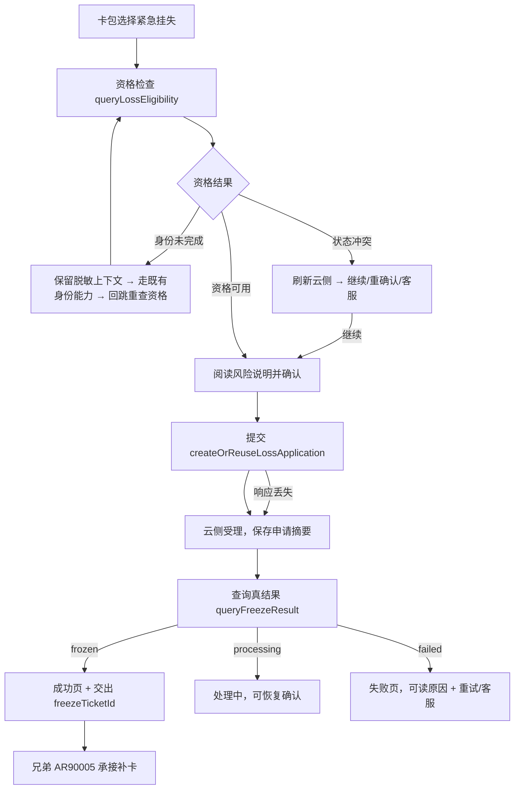

# 交通卡紧急挂失恢复 — 需求规格（Spec）

> **模块标识**: AR90004
> **版本**: v1.0
> **创建日期**: 2026-08-24
> **最后更新**: 2026-08-24
> **状态**: 评审中

---

## 0. 术语映射表（Terminology Mapping Table）

| 原始术语 | 权威模块 | 所属层 | 置信度（high / medium / low）| 易混项（必须亮出）| 用户确认 | 解释 |
|---------|---------|--------|-------------------------------|-------------------|---------|---------|
| 卡包 | WalletMain | 02-Feature | high | 账号管理 — 卡包是页面/数据编排，不是账号会话 API | [x] | 钱包卡包 feature：卡列表、添卡入口、卡种入口 |
| 交通卡 | WalletMain | 02-Feature | medium | 银行卡/门禁卡/车钥匙 — 同属 WalletMain 卡包分类，均为卡种品类 | [x] | 本需求挂失对象，钱包内卡种品类 |
| 紧急挂失 | WalletMain | 02-Feature | medium | 补卡（AR90005 承担）— 挂失是申请冻结，补卡是后续制卡 | [x] | 在线封锁旧卡使用的业务动作（本 AR 核心） |
| 资格检查 | WalletMain | 02-Feature | medium | 状态冲突 — 资格查询是准入判断，状态冲突是许可后仍可进行中的卡片状态核对 | [x] | 云侧返回是否可申请挂失及其原因 |
| 状态冲突 | WalletMain | 02-Feature | low | 登录冲突 — 本术语指卡片云侧状态与申请上下文不符，非账号态 | [x] | 卡片状态与申请上下文不一致的恢复场景 |
| 身份校验 | AccountManager | 04-BusinessBase | medium | 登录态展示 — 两者同域，但校验走 AccountService 能力、展示是 UI | [x] | 复用既有登录/实名能力完成身份回跳恢复 |
| 通用 UI 组件 | CommUI | 05-SystemBase | high | 系统功能封装 — CommUI 是 ArkUI 组件/主题/Toast，CommFunc 是纯工具 | [x] | 本 AR 复用 CommUI 基础组件 |
| 脱敏 | CommFunc | 05-SystemBase | high | 账号管理 — 脱敏是纯工具算法，账号是与会话相关 | [x] | 挂失上下文/日志/埋点先脱敏再输出 |
| 卡云适配层 | WalletMain | 02-Feature | low | 云侧微服务 — 本仓适配层是钱包端模拟云侧协议的部分，非独立云服务 | [x] | 本 AR 内数据层适配，提供资格/申请/结果接口 |

**回写约定**：新增术语（交通卡 / 紧急挂失 / 资格检查 / 状态冲突 / 卡云适配层）在用户批准后追加到 `doc/glossary.yaml` 对应权威模块条目下。

---

## 1. 功能概述

本需求在钱包端提供一条**可中断后继续的在线紧急挂失路径**：用户从卡包发起紧急挂失，页面查询
资格与风险说明，用户确认后提交；身份未完成时保留脱敏上下文走既有身份能力并回跳恢复；卡片状态
冲突时先刷新云侧再给出继续/重确认/客服动作；已存在申请时复用而非重复创建；最终以云侧真实冻结
结果为准展示「已冻结 / 仍在处理 / 处理失败」，只有云侧确认冻结才展示成功。云侧确认冻结后，
本特性交出 `freezeTicketId`，兄弟特性 AR90005 凭其启动补卡支付、制卡与客服交接。

---

## Scope 声明

### Scope 模块清单

| 字段 | 取值 | 说明 |
|------|------|------|
| 本需求允许修改的模块 | `WalletMain` | 页面、状态机、上下文保存、卡云适配（本仓数据层） |
| 本需求明确不修改的模块 | `AccountManager`、`CommUI`、`CommFunc`、`Phone` | 复用既有的身份能力、通用组件与工具；入口壳不动 |

### Scope 结构化字段（供 Spec 提取，必填）

```yaml
in_scope_modules:
  - WalletMain
out_of_scope_modules:
  - AccountManager
  - CommUI
  - CommFunc
  - Phone
rationale: |
  本需求是钱包端挂失业务（页面 + 状态 + 数据协作），全部落在 WalletMain 内：紧急挂失页、
  挂失上下文保存、卡云适配（本仓数据层）都是 WalletMain 的 feature 职责。
  AccountManager 与 CommUI 只是被消费的既有出口（身份能力 / 基础组件），不改动；
  功能开关复用 WalletMain shared/constant 的常量开关形态，无远程配置。
  Phone 入口壳不改：紧急挂失页作为 WalletMain 新增的 NavDestination 子页暴露。
  若下游要将挂失上下文存储逻辑提升到公共模块，需经 scope 扩展提议确认后再动。
```

### Visual Handoff（视觉交接，供 check-spec 读取）

```yaml
ui_change: new_or_changed
visual_handoff:
  kind: repo_assets
  authoritative_refs:
    - id: loss_report_recovery
      path: doc/features/AR90004/RR/assets/loss-report-recovery.svg
  fidelity_target: semantic_layout
  asset_acquisition_mode: approximate
```

### 最小改动原则

1. 所有逻辑实现在 `WalletMain` 内：新增挂失页、状态机、上下文与卡云适配（本仓 data 层）。
2. 身份能力、通用组件、脱敏工具只消费既有出口，不新建公共接口。
3. 若需要新的存储介质而提升公共模块，先发起 scope 扩展提议。

---

## 2. 目标用户与使用场景

### 2.1 目标用户

| 用户角色 | 描述 |
|----------|------|
| 已登录并实名的交通卡用户 | 遗失交通卡后要立即发起挂失、看到确认真实冻结结果 |
| 登录或实名未完成的用户 | 完成身份校验后要回到原申请继续，不带失已填上下文 |
| 卡片状态冲突的用户 | 想看懂冲突、取得最新云侧状态并继续申请处理 |

### 2.2 使用场景

| 场景编号 | 场景名称 | 场景描述 | 前置条件 |
|----------|----------|----------|----------|
| S1 | 正常用户提交 | 打开挂失页 → 资格可用 → 阅读风险说明并确认 → 提交 → 看到云侧冻结结果 | 已登录已实名、卡状态无冲突、功能开关开启 |
| S2 | 身份未完成恢复 | 提交前发现身份未校验 → 保留脱敏卡片上下文 → 完成既有身份流程 → 回跳重查资格并回到确认位置 | 卡包进入挂失、登录或实名未完成 |
| S3 | 卡片状态冲突恢复 | 打开或提交时卡片状态冲突 → 刷新云侧 → 得到继续/重确认/客服建议 | 云侧状态与本地申请上下文不一致 |
| S4 | 响应丢失/中断后恢复 | 提交响应丢失或网络中断 → 保存检查点 → 重试先查既有申请 → 继续确认真实结果 | 前一次申请已创建或提交中被中断 |

---

## 3. 功能清单

| 编号 | 功能名称 | 优先级 | 描述 | 关联场景 |
|------|----------|--------|------|----------|
| F1 | 紧急挂失入口与功能开关 | P0 | 卡包提供「紧急挂失」入口，受 `traffic_card_emergency_loss_enabled` 开关控制；开关默认关闭、读取失败即隐藏入口 | S1-S4 |
| F2 | 资格检查与风险确认 | P0 | 打开页面、身份回跳、冲突恢复时查询资格（eligible/identityRequired/cardState/existingApplication），展示冻结影响与数据说明，用户确认前不推进；停留期间不轮询 | S1, S2, S3 |
| F3 | 身份回跳恢复 | P0 | 身份未完成时仅保存脱敏卡片标识、入口与检查点，调 AccountManager 既有身份能力；回跳成功后重查资格并回到确认位置；回跳账号不同则清空上下文重新选卡 | S2 |
| F4 | 卡片状态冲突恢复 | P0 | 冲突时先刷新云侧资格与既有申请，再给出继续既有申请/重新确认/转客服；不用端侧缓存覆盖云侧事实 | S3 |
| F5 | 创建或复用挂失申请 | P0 | 调 `createOrReuseLossApplication` 携带稳定幂等键；存在有效申请时复用原 applicationId；请求期间提交按钮不可重复触发 | S1, S4 |
| F6 | 结果确认与交接 | P0 | 保存申请号摘要，调 `queryFreezeResult`；仅 frozen 驱动成功页；云侧确认冻结后交出 `freezeTicketId` 与最终冻结状态给 AR90005 | S1, S4 |
| F7 | 挂失上下文保存与恢复 | P1 | `loss_report_recovery_context` 按账号隔离保存脱敏字段，页面销毁/网络中断后校验账号、版本与有效期恢复检查点 | S2, S4 |
| F8 | 防重入与失败提示 | P0 | 请求期间同一业务动作只执行一次；每个失败阶段展示可读原因、重试与安全停留状态，不把「已提交」画成「已冻结」 | S1-S4 |

---

## 4. 页面/界面描述

### 4.1 页面总览

```
┌─────────────────────────────────────┐
│  紧急挂失（NavDestination 子页）       │
├─────────────────────────────────────┤
│  A. 资格与风险确认区                   │
│     正在核对卡片与账号 / 冻结影响与     │
│     数据使用说明（等待用户阅读确认）     │
│  B. 恢复处理区（条件出现）             │
│     身份未完成：去验证（回跳后重校）     │
│     状态冲突：刷新云侧 → 继续/重确认/    │
│     客服                             │
│  C. 云侧结果区                        │
│     已冻结（仅云侧确认后）/ 处理中 /     │
│     失败（保留重试与客服）              │
└─────────────────────────────────────┘
```

参考图：`RR/assets/loss-report-recovery.svg`（三态：资格与风险确认 · 恢复处理 · 云侧结果）。

### 4.2 UI 组件详细描述

#### 区域 A: 资格与风险确认

| 组件 | 类型 | 内容/数据 | 交互行为 |
|------|------|-----------|----------|
| 资格加载指示 | 状态区 | 正在核对卡片与账号 | 打开页面/回跳时展示，直至资格结果返回 |
| 风险说明卡片 | 内容卡 | 冻结影响与数据使用说明 | 仅展示，等待用户阅读 |
| 确认并继续按钮 | 主按钮 | 无 | 用户确认后进入提交；请求期间禁用防重复触发 |

#### 区域 B: 恢复处理（条件出现区）

| 组件 | 类型 | 内容/数据 | 交互行为 |
|------|------|-----------|----------|
| 身份未完成条目 | 动作列表项 | 去验证（回跳后重新核验资格） | 点击发起既有身份流程；回跳后重查资格回确认位置 |
| 状态冲突条目 | 动作列表项 | 先刷新云侧 → 继续/重确认/客服 | 刷新后按建议动作继续 |
| 安全停留重试 | 按钮 | 重试 | 失败/中断时展示，重试从最近检查点继续 |

#### 区域 C: 云侧结果

| 组件 | 类型 | 内容/数据 | 交互行为 |
|------|------|-----------|----------|
| 结果图标与文案 | 状态展示 | 已冻结（对勾）/ 处理中 / 失败 | 仅 frozen 显示成功态 |
| 查看详情按钮 | 主按钮 | 无 | 进入冻结详情/结果确认 |
| 失败重试/客服 | 动作区 | 重试或转客服 | 失败状态保留的出口 |

### 4.3 页面状态

| 组件 | 类型 | 状态 | 交互行为 | 触发条件 |
|------|------|------|----------|----------|
| 资格加载态 | 状态展示 | 资格加载 | 被动展示「正在核对卡片与账号」 | 打开页面/身份回跳/冲突恢复触发资格查询 |
| 风险确认态 | 状态展示 | 等待风险确认 | 展示冻结影响，确认按钮解锁提交 | 资格可用返回 |
| 身份等待态 | 状态展示 | 等待身份 | 点击发起既有身份流程 | 资格返回 identityRequired=true |
| 冲突展示态 | 状态展示 | 状态冲突 | 刷新后按建议动作继续 | 资格返回存在状态冲突 |
| 提交中态 | 状态展示 | 提交中 | 按钮禁用防重入 | 用户确认并继续 |
| 结果确认态 | 状态展示 | 结果确认中 | 等待结果回显 | 申请已受理 |
| 成功态 | 状态展示 | 已冻结 | 查看详情/交接 | queryFreezeResult 返回 frozen |
| 处理中态 | 状态展示 | 处理中 | 可恢复确认 | queryFreezeResult 返回 processing |
| 失败态 | 状态展示 | 失败 | 重试或转客服 | queryFreezeResult 返回 failed 或阶段失败 |

---

## 5. 业务流程图



---

## 6. 异常/边界场景处理

| 编号 | 异常场景 | 触发条件 | 处理方式 | 用户提示 |
|------|----------|----------|----------|----------|
| E1 | 资格检查失败/网络中断 | 打开或重查资格时网络异常 | 保留最近安全检查点，重试从该检查点继续；已存在申请时复用 | 可读失败原因 + 重试 |
| E2 | 身份取消或失败 | 身份流程被取消或失败 | 清理一次性认证参数，保留脱敏卡片检查点，不调用创建接口 | 停留身份说明，可重新发起或退出 |
| E3 | 卡片状态冲突 | 云侧状态与申请上下文不符 | 先刷新资格与既有申请再决定继续/重确认/客服，不用本地缓存覆盖 | 展示最新状态与可选动作 |
| E4 | 创建响应丢失 | 提交响应丢失 | 以同一幂等键查询或复用申请，不重复创建 | 展示处理中并允许确认结果 |
| E5 | 结果查询失败 | 结果确认中网络异常 | 保留申请摘要，不标记已冻结 | 展示未确认状态和重试 |
| E6 | 页面销毁/重新进入 | 页面被销毁后再次进入 | 校验账号、上下文版本与有效期，恢复检查点或重来；不跨账号恢复 | 恢复到安全检查点或重新开始 |
| E7 | 上下文损坏/旧版本 | 读到旧版或损坏上下文 | 清理并从资格查询开始，不按旧缓存展示成功 | 重新走资格流程 |
| E8 | 重复点击 | 请求期间重复点击提交 | 同一业务动作只执行一次，提交按钮禁用 | 无重复创建提示（按钮已禁用） |

---

## 7. 非功能性需求

### 7.1 性能要求

| 指标 | 要求 | 说明 |
|------|------|------|
| 资格检查响应 | ≤ 1500 ms（本工程设定，无上游依据） | 从进入页面到资格结果可见 |
| 提交/结果确认响应 | ≤ 2000 ms（本工程设定，无上游依据） | 请求发出到结果回显 |
| 触发频次 | `queryLossEligibility` 只由打开、身份回跳、重试、重新进入触发，页面停留期间无轮询（对照功耗高频基线 DFX-01） | 无后台任务，无周期性调用 |

### 7.2 兼容性要求

| 维度 | 要求 |
|------|------|
| 系统版本 | HarmonyOS 5.0 及以上（平台基线） |
| 设备类型 | 手机 |
| 存储兼容 | 新增挂失上下文键独立命名、无旧数据迁移；读取到旧版/损坏上下文时清理并从资格查询开始，不用旧缓存展示成功（对照兼容性基线 COMPAT-01） |

### 7.3 安全性要求

| 要求 | 说明 |
|------|------|
| 敏感数据脱敏 | 页面、日志与埋点不出现完整卡号、实名信息、完整申请号或认证参数；日志打印前先经脱敏工具处理（安全隐私基线 SEC-01） |
| 不绕过身份 | 身份未完成不得进入创建，端侧任何分支不把「已提交」或缓存状态当作「已冻结」 |
| 调用方校验 | 无对外暴露面；跨模块入口仅经 WalletMain index.ets 出口 |
| 个人数据采集 | 不采集新增个人数据：上下文仅保存脱敏卡片标识（maskedCardId）、账号范围哈希等最小化字段，且不随备份恢复（安全隐私基线 SEC-01 覆盖） |
| 观测侧旁路 | 流程记录与上报失败不得进入业务分支判断：上报（事件 `loss_flow_start` / `loss_flow_result` / `loss_flow_recovery`）失败时，挂失的流程、结果、分支与重试不受影响（诊断与度量基线 DM-05） |

### 7.4 UX 适配要求

| 维度 | 要求 |
|------|------|
| RTL 与方向性布局 | 页面方向与边距使用 start/end 参数，文本对齐用 Start/End（UX 一致性 UX-01） |
| 大字体/深色主题 | 主要动作按钮、结果状态与文案在大字体、深色主题下保持可见与可读 |
| 阅读与等待 | 风险说明、身份校验和冲突确认需用户操作，等待期间不自动越过下一步 |

---

## 8. 验收标准

### P0 功能验收标准

- [ ] **AC-1** (F1): 功能开关默认关闭时卡包不展示「紧急挂失」入口；开启后入口可见。
- [ ] **AC-2** (F2): 打开页面先展示资格结果与风险说明，确认前不能提交；停留期间无轮询请求。
- [ ] **AC-3** (F3, F7): 身份未完成时保留脱敏上下文，完成既有身份流程回跳后回到同一卡片和原检查点，再核验资格后继续。
- [ ] **AC-4** (F4): 卡片状态冲突时先刷新云侧，再给出继续/重新确认/客服动作，不误报成功。
- [ ] **AC-5** (F5): 提交只创建一次申请；响应丢失后重试先查既有申请，不重复创建，能继续确认冻结结果。
- [ ] **AC-6** (F5, F8): 请求期间重复点击提交不产生第二次创建请求。
- [ ] **AC-7** (F6): 只有云侧返回 frozen 才展示成功；处理中与失败展示可读原因、重试或客服动作。
- [ ] **AC-8** (F8): 查询、提交或结果确认任一步失败都有可读原因、重试入口与安全停留状态。

### P1 功能验收标准

- [ ] **AC-9** (F7): 页面销毁后重新进入，在有效期内恢复安全检查点；账号变化或上下文失效时清空后重新开始。
- [ ] **AC-10** (F6): 云侧确认冻结后交出 `freezeTicketId` 与最终冻结状态；AR90005 无有效交接结果不得开始补卡。

### 通用验收标准

- [ ] **AC-G1**: 页面在 HarmonyOS 5.0 设备上正常显示，无布局错乱；深色模式与大字体下主要动作可见。
- [ ] **AC-G2**: 页面、日志与埋点不出现完整卡号、实名信息、完整申请号或认证参数。
- [ ] **AC-G3**: 通知失败不改变云侧冻结结果；补卡订单确认前不扣费、支付中断不重复建单。

---

## 9. 技术契约

### 9.1 端云接口

| 云侧接口 | 新增·复用·变更 | 入参 → 出参 | 错误码 | 代码现状 |
|---|---|---|---|---|
| `queryLossEligibility` | 新增 | 入 `cardId`(脱敏映射)-`accountScope` → 出 `eligible`/`identityRequired`/`cardState`/`existingApplication`/可读原因 | 无新增 | 检索 `@ohos.net.http`/`http`/`rcp`/`axios` 于 02-Feature/WalletMain 零命中，本需求云侧交互为新增域 |
| `createOrReuseLossApplication` | 新增 | 入 卡片标识-账号范围-用户确认-稳定幂等键 → 出 原 `applicationId`（复用）或 `submitted` | 无新增 | 同上，均为新增接口域 |
| `queryFreezeResult` | 新增 | 入 `applicationId` → 出 `frozen`/`processing`/`failed` 及可读原因 | 无新增 | 同上 |

### 9.2 数据存储

| 键名/表名 | 介质 | 值结构 | 有效期 | 用途 | 代码现状 |
|---|---|---|---|---|---|
| `loss_report_recovery_context` | Preferences | maskedCardId、accountScopeHash、checkpoint、idempotencyKey、applicationIdDigest、更新时间 | 需求有效期（≤ 24h，本工程设定，无上游依据）；成功/明确失败/账号变化/超期清理 | 挂失申请中断后恢复检查点 | 检索 `preferences` 于 02-Feature/WalletMain 零命中，本需求引入持久化为新增域；介质按账号隔离、不随备份恢复 |

### 9.3 配置项

| 配置项 | 默认值 | 关闭态行为 | 历史版本兼容 | 代码现状 |
|---|---|---|---|---|
| `traffic_card_emergency_loss_enabled` | false | 隐藏紧急挂失入口 | 旧版本读不到时按关闭处理 | 常量开关形态见 02-Feature/WalletMain/src/main/ets/shared/constant/*Constants.ets（新增 `static readonly` 布尔）；无远程配置封装 |

### 9.4 埋点

| 事件 | 触发节点 | 归属 | 报表影响 | 代码现状 |
|---|---|---|---|---|
| `loss_flow_start` | 进入挂失流程 | 运营 | 新增维度 | 检索 `hiAnalytics`/`hiAppEvent` 于 in_scope 模块零命中；可观测面仅有日志与 HA 上报（Chart/VOC），埋点为新增域 |
| `loss_flow_result` | 流程终态（已冻结/处理中/失败） | 运营 | 新增维度 | 同上 |
| `loss_flow_recovery` | 从检查点恢复 | 运营 | 新增维度 | 同上 |

> 埋点内容仅带匿名入口、阶段与结果分类，不包含完整卡号、账号、申请号或认证参数。

### 9.5 依赖变更

| 依赖 | 变更 | 体积影响 | 兼容风险 | 代码现状 |
|---|---|---|---|---|
| 不涉及 | Scope 内模块的依赖声明无需变更——本需求仅消费 WalletMain 既有依赖（AccountManager / CommUI / CommFunc），不新增 SDK/TA | — | — | 检索模块 `oh-package.json5` dependencies，无新增项 |

---

## 10. 设计模式候选登记

| 设计单元 | 候选模式 | 依据 | 备选与排除理由 |
|---|---|---|---|
| 紧急挂失申请页（含资格-风险-身份-冲突-提交-结果多分支） | `page-interaction` | 单页面内用户交互多，且交互之间由业务结果驱动先后顺序（用户旅程第 1-6 步均在页内流转） | 未启用其它模式；本页是典型「业务结果驱动下一步」编排 |
| 挂失申请/恢复流程（多分支：身份未完成/状态冲突/响应丢失/失败收敛） | `decision-tree` | 业务流程有多个分支，每个分支自身是复杂功能（多步云侧调用、恢复、回归检查点） | 若 plan 判定分支较浅可回落直接写，此处仅登记候选 |
| 页面静态展示与仅剩余按钮 | 无候选 | 单一展示结构、各按钮彼此独立，无跨步骤状态 | 判定不适用，直接写即可 |

---

## 宿主扩展治理项

> 本需求的治理项行动（管理台排期 / 打点归档 / 翻译回稿 / TA 联调 / Demo）落《决策与评审记录》
> 的上线决策与跨团队协同，此处不重复列举。

---

## 附录

### A. 术语表

> 业务名词解释见 §0 术语映射表的「解释」列。

### B. 参考资料

- RR90004 产品需求（doc/features/AR90004/RR/prd.md）
- SR90004 系统设计（doc/features/AR90004/SR/design.md）
- AR90004 开发需求（doc/features/AR90004/AR/design.md）

### C. 变更记录

| 日期 | 版本 | 变更内容 | 变更人 |
|------|------|----------|--------|
| 2026-08-24 | v1.0 | 初始版本 | AI（据 RR/SR/AR 四源生成） |