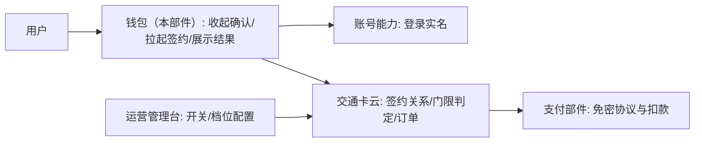
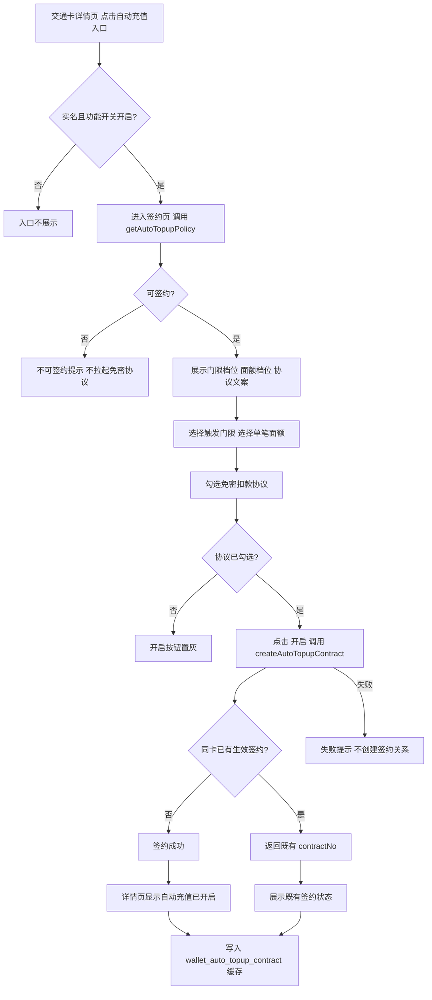
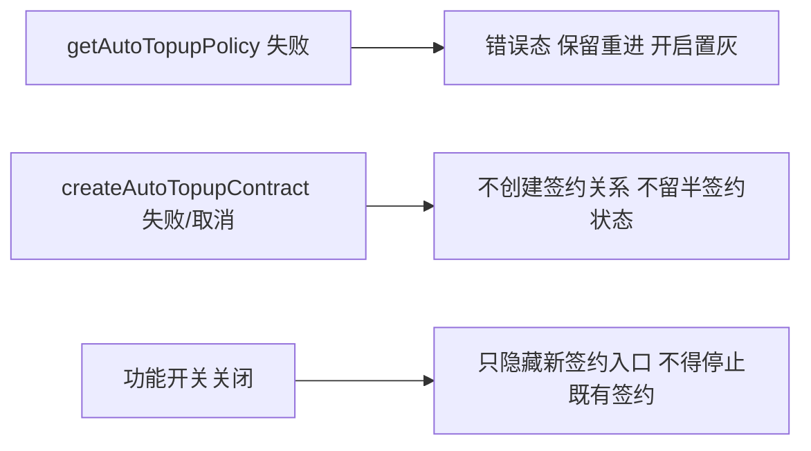

# AR90006 — 需求评审叙事

## 背景与目标

### 现状：用户为什么会在人流中充值

交通卡余额用尽只有走到闸机前才能发现——卡片不会主动提醒余额低了。用户被迫在人流中完成充值，这是当前交通卡投诉量最高的场景。

手工充值本身并不复杂，问题在**触发时机**：没有理由在余额还够的时候就主动打开钱包。用户不会为「将来可能不够」这件事提前去做一次充值操作，于是每次都是被闸机拦住才想起来。

### 本需求改变什么

一次签约，长期自动。用户签约之后，余额低于自己设定的门限时由系统自动完成充值，把「想起来充值」这整件事从用户身上移走。签约用户此后不需要再考虑「卡里还有没有钱」——判定、扣款都由服务端在余额上报后触发。

### 成功怎么衡量

产品目标给出两个硬指标：

| 指标 | 目标 |
|---|---|
| 签约用户闸机余额不足发生率 | 下降到**万分之五**以下 |
| 签约转化率 | 不低于交通卡月活的 **8%** |

### 端侧在这段链路里的位置

判定与扣款全部在服务端，端侧无感知、也不该有感知——本需求不引入任何端侧发起自动充值的能力。端侧只承担签约入口、签约交互与签约成功态展示；本文档的叙事范围也按此收敛：只讲策略查询与创建签约这一段（拆分第 1 份），状态查询与解约由兄弟单据承载。

## 术语

| 术语 | 含义 |
|---|---|
| 交通卡自动充值（自动充值） | 交通卡余额低于门限时由服务端自动充值的功能；本 AR 只做端侧策略查询与创建签约 |
| 自动充值签约页（签约页） | 用户选择门限/面额、勾选免密协议并开启自动充值的页面 |
| 交通卡详情页 | 展示交通卡信息并承载自动充值入口的页面 |
| 触发门限（门限） | 余额低于该档位时触发自动充值；档位 5/10/20/30 元 |
| 单笔充值面额（充值面额） | 每次自动充值的金额档位；20/50/100 元 |
| 免密扣款协议（免密协议） | 签约页内向用户展示并由其同意的扣款协议，勾选后「开启」按钮才可点击 |
| 功能开关（运营开关） | 运营侧控制签约入口是否可见的开关；关闭后**只隐藏新签约入口、不得停止既有签约**，已签约用户照常执行 |
| 自动充值管理页（管理页） | 展示签约状态、记录与失败原因的页面——本 AR 范围外（拆分第 2 份） |
| 充值记录 | 自动充值的成功/失败记录——本 AR 范围外 |
| 连续失败停用 | 连续 3 次扣款失败后服务端将自动充值置为停用——本 AR 范围外，但停用语义影响验收意图 |
| 签约关系 | 本 AR 创建签约成功后的产物，以 `contractNo` 标识；同卡已有生效签约时返回既有 `contractNo` |
| 主应用 | 应用入口 HAP（PhoneAbility/根导航壳），不承载本 feature 页面内容 |
| 账号管理 | 提供登录实名态（未实名不显示签约入口），本 AR 不新增其内容 |
| 公共 UI 组件 | 可复用列表项/卡片/Toast 等通用组件，不实现签约业务 |
| 通用列表项 | 可复用列表行 UI 积木 |
| Toast | 交互提示信息展示 |
| 系统功能封装 | 通用工具（日志/脱敏/导航上下文），不拥有充值规则 |
| 脱敏 | 记录中卡号等敏感字段按现有规则脱敏；本 AR 不存卡号/金额明细 |
| 登录 | 登录实名态是入口门控前置；本 AR 仅消费登录态结果 |
| 功能入口 | 交通卡详情页上承载「自动充值」跳转的入口组件，受实名与开关门控 |

容易混淆的两组：**自动充值签约页**与**自动充值管理页**——前者是本 AR 新建的签约入口页（策略查询与创建签约），后者是展示/管理既有签约的页面（状态查询与解约，第 2 份）；**触发门限**与**单笔充值面额**——前者决定「什么时候充」，后者决定「每次充多少」，两者都在签约页单选。

## 完整用户旅程

### 主流用户旅程（已实名、开关开启、首次签约）

| 步骤 | 用户动作 | 系统动作 | 用户看到什么 |
|---|---|---|---|
| 1 | 打开交通卡详情页 | 读取登录实名态与功能开关状态 | 详情页出现「自动充值」入口 |
| 2 | 点击「自动充值」入口 | 校验实名与开关通过后进入签约页；调用 getAutoTopupPolicy 拉取可签约性与策略 | 进入自动充值签约页 |
| 3 | 选择触发门限 | 单选组选中态写入 | 选中档位高亮；可选择 5/10/20/30 元 |
| 4 | 选择单笔充值面额 | 单选组选中态写入 | 选中档位高亮；可选择 20/50/100 元 |
| 5 | 勾选《免密扣款协议》 | 勾选状态驱动按钮可用性 | 「开启」按钮由置灰变为可点击 |
| 6 | 点击「开启」 | 调用 createAutoTopupContract 创建签约 | 签约成功；返回详情页显示「自动充值已开启」与门限面额 |
| 7 | （签约完成） | 端侧写入 wallet_auto_topup_contract 缓存 | 详情页持续展示自动充值已开启 |

### 各类用户分别怎么走

| 用户情况 | 路径 | 结果 |
|---|---|---|
| 已实名 + 开关开启 + 首次 | 详情页入口 → 签约页 → 选门限/面额/协议 → 开启 → 签约成功 | 完成自动充值签约 |
| 已实名 + 开关开启 + 已有生效签约 | 详情页入口 → 签约页 → 已存在签约 | 展示既有 contractNo 与既有门限面额，不重复创建 |
| 未实名 | 详情页看不到「自动充值」入口 | 无法通过任何路径完成签约 |
| 实名但功能开关关闭 | 只隐藏新签约入口，签约入口不可见 | 已签约用户自动充值不得停止，照常执行 |

### 从触发到终态的完整闭环（本 AR 视角）

入口（门控）→ 进入签约页拉取策略 → 选择门限/面额 → 勾选协议 → 点击开启创建签约 → 成功态与缓存写入 → 结束。签约成功不等于自动充值立即发生——后续触发（余额低于门限）由服务端在余额上报后执行，端侧不参与，也不再在本 AR 的用户旅程里出现（那是状态查询/记录展示的世界，归第 2 份）。

## 全局方案与参与方

### 这条需求的整体玩法

自动充值不是端侧自己判断、自己扣钱的——那样离线刷卡后余额失真，会扣出用户预期之外的钱。判定的正确姿势是：**端侧只负责签约入口与状态展示，服务的判定与扣款全部发生在服务端**，由交通卡云在余额上报后决定是否触发。这是一个端云协同的链路。

### 参与方与职责

| 参与方 | 输入 | 输出 | 责任 | 失败边界 |
|---|---|---|---|---|
| 钱包（本部件） | 用户动作、卡片和云侧状态 | 签约请求、状态页与提示 | 收集确认、拉起签约、展示结果 | 不判断是否该扣款，不保存支付凭据 |
| 账号能力 | 登录实名请求、回跳上下文 | 合格身份或失败结果 | 提供既有身份能力 | 未实名不允许签约 |
| 交通卡云 | 卡片、账号、余额上报、协议号 | 签约、触发、订单和扣款结果 | 门限判定、订单创建、失败停用 | 是签约与扣款结论的唯一真源 |
| 支付部件 | 协议号、订单和金额 | 签约与扣款结果 | 免密协议和扣款 | 不改变签约关系，不重复扣款 |
| 运营管理台 | 运营配置 | 开关、门限和面额档位 | 配置下发 | 配置不可用按关闭处理 |

### 本部件在链路中的位置

本 AR 处在链路的最前段：端侧发起签约。整体协作可以这样看：



三方的责任边界在这里切得干净：交通卡云「是签约与扣款结论的唯一真源」，钱包「不判断是否该扣款、不保存支付凭据」，支付部件「不改变签约关系、不重复扣款」。谁都不越界，端侧就不存在「发起自动充值」的能力——这个边界也是本期最重要的安全护栏。运营配置不可用时按关闭处理，**只隐藏新签约入口，不得停止既有签约**，本 AR 已签约用户自动充值照常执行。

## 范围、边界与依赖

### 整个需求不做什么

本需求开启自动充值这条产品链路，但显式排除了三件事——按日期或按行程预约充值、多张卡共用一份签约、家庭成员代充。这三项都需要新的账户模型，不在本期范围。

另外，端侧不做任何判定：不采用端侧监测余额并直接发起扣款（离线刷卡后余额会失真），端侧不存在「发起自动充值」的接口。

### 本部件不负责、但其他部件仍需完成什么

| 事项 | 由谁完成 | 说明 |
|---|---|---|
| 门限判定、订单创建、失败停用 | 交通卡云 | 签约关系与充值订单的唯一真源 |
| 免密协议与扣款执行 | 支付部件 | 不改变签约关系、不重复扣款 |
| 登录实名结果 | 账号能力 | 未实名不允许签约 |
| 运营开关/门限/面额档位配置 | 运营管理台 | 配置不可用按关闭处理 |

### 拆分与承载（本 AR 的边界）

本需求按**端侧业务链路**切分为两份，先弄清谁承载什么、先后依赖是什么：

| 序 | 承载 | 范围 | 依赖 |
|---|---|---|---|
| 1 | **本 AR（AR90006）** | 策略查询与创建签约：入口门控、签约页策略查询（`getAutoTopupPolicy`）、门限/面额选择、协议勾选、创建签约（`createAutoTopupContract`）与成功态 | — |
| 2 | 待立项（兄弟单据） | 状态查询与解约：管理页状态/记录/失败原因（`getAutoTopupStatus`）、修改门限面额、解约（`cancelAutoTopupContract`）、停用呈现 | 依赖 1（共享 `contractNo`） |

- **本 AR 承载第 1 份**；第 2 份交 **待立项** 兄弟单据（无兄弟单号，保持待立项）。
- 两份共享签约标识 `contractNo`：创建成功后状态查询才能开始。
- **先后依赖**：第 1 份未完成会**阻塞**第 2 份的联调和开放——`contractNo` 没就绪，状态查询无从谈起。

### Scope 声明

- 本需求允许修改的模块：**WalletMain**。
- 明确不修改的模块：**Phone**（入口壳）、**AccountManager**（登录实名态）、**CommUI**（通用组件）、**CommFunc**（工具/日志/脱敏）——只被消费，不改实现。

端云接口作为新增域落在 WalletMain 数据层，不新增公共网络封装；`agreementNo` 只透传、不在端侧持久化。

## 场景与功能

### 目标用户

| 用户角色 | 描述 |
|---|---|
| 已实名交通卡用户 | 希望「想起来充值」不再需要自己操作；进入签约页完成一次签约 |
| 未实名交通卡用户 | 看不到自动充值入口，也无法完成签约（实名是签约前提） |

### 使用场景

| 场景编号 | 场景名称 | 场景描述 | 前置条件 |
|---|---|---|---|
| S1 | 首次开启自动充值 | 用户在交通卡详情页点击「自动充值」入口，进入签约页选择门限与面额、勾选免密协议后点击「开启」，完成签约 | 已实名登录；功能开关开启；卡片存在 |
| S2 | 已开启后再次进入 | 用户再次进入签约页，看到既有生效签约（返回既有 contractNo） | 该卡片已有生效签约 |
| S3 | 受限用户进入 | 未实名用户或功能开关关闭时，入口不出现 | — |

### 功能与场景的关系

每项功能解决场景里的哪一步，逐项对应：

| 编号 | 功能名称 | 优先级 | 描述 | 关联场景 |
|---|---|---|---|---|
| F1 | 自动充值入口（门控） | P0 | 交通卡详情页提供「自动充值」入口；未实名用户不可见，功能开关关闭时新用户不可见 | S1, S3 |
| F2 | 策略查询与展示 | P0 | 进入签约页调用 `getAutoTopupPolicy` 拉取可签约性、门限档位（5/10/20/30 元）、面额档位（20/50/100 元）、单日限额（200 元）与协议文案并展示；不可签约时不拉起免密协议 | S1 |
| F3 | 门限/面额选择 | P0 | 签约页提供门限单选与面额单选；门限与面额均为单选，选中后高亮 | S1 |
| F4 | 协议勾选与开启按钮 | P0 | 展示《免密扣款协议》并提供勾选控件；协议勾选后「开启」按钮才可点击，未勾选时置灰 | S1 |
| F5 | 创建签约 | P0 | 点击「开启」调用 `createAutoTopupContract`（入参账号、卡片、`agreementNo`、门限、面额）；同一卡片已有生效签约时返回既有 `contractNo`，端侧展示既有签约而非重复创建 | S1, S2 |
| F6 | 签约成功态与缓存写入 | P0 | 签约成功后详情页显示「自动充值已开启」及当前门限与面额；写入端侧缓存 `wallet_auto_topup_contract`（`contractNo`/门限/面额/状态） | S1 |
| F7 | 签约链路端侧埋点 | P1 | 端侧事件记录去标识账号、卡片类型、阶段与结果分类；不记录卡号、金额明细或支付参数 | S1, S2 |

优先级口径：P0 是核心功能、缺失则本 AR 不可用；F7 为 P1（应当实现，影响核心体验的可观测性）。

每个 P0 场景都能落到一条完整链路：S1 由 F1→F2→F3→F4→F5→F6 串起，S2 由 F5 的既有签约分支承接，S3 由 F1 门控承接。

## 页面、组件与状态

### 自动充值签约页（本 AR 新增页面）

布局与关键组件（视觉规范沿用交通卡详情页现有样式，不新增控件类型）：

```
┌─────────────────────────────┐
│  顶部导航（返回）自动充值      │
├─────────────────────────────┤
│  触发门限（单选组）           │
│    5 元 / 10 元 / 20 元 / 30 元 │
├─────────────────────────────┤
│  单笔充值面额（单选组）        │
│    20 元 / 50 元 / 100 元      │
├─────────────────────────────┤
│  ☐ 我已阅读并同意《免密扣款协议》│
├─────────────────────────────┤
│  [ 开 启 ]（勾选协议后可点）    │
└─────────────────────────────┘
```

签约页参考图由产品提供（图 1 自动充值签约页），作为视觉依据归档：


图 2 自动充值管理页与记录列表的产品参考图同样归档（该页属拆分第 2 份范围，本 AR 不构建，仅存档）：


| 组件 | 类型 | 内容/数据 | 交互行为 |
|---|---|---|---|
| 返回 | 图标按钮 | 返回箭头 | 点击返回上一页（复用 `NavPathContext.stack().pop()`） |
| 标题 | 文字 | 「自动充值」 | — |
| 门限标题 | 文字 | 「触发门限」 | — |
| 门限选项 | 单选组 | 5 元 / 10 元 / 20 元 / 30 元 | 单选，选中高亮 |
| 面额标题 | 文字 | 「单笔充值面额」 | — |
| 面额选项 | 单选组 | 20 元 / 50 元 / 100 元 | 单选，选中高亮 |
| 协议勾选 | 勾选框 | 免密扣款协议 | 勾选驱动「开启」可用性 |
| 开启按钮 | 主按钮 | 「开启」 | 未勾选协议时置灰；点击触发创建签约 |

### 交通卡详情页（既有页面 + 新增入口）

| 组件 | 类型 | 内容/数据 | 交互行为 |
|---|---|---|---|
| 自动充值入口 | 文字/按钮入口 | 「自动充值」 | 未实名/开关关闭时不可见；可见时点击进入签约页 |
| 自动充值状态区 | 文字 | 「自动充值已开启」+ 门限面额 | 本 AR 完成签约后展示 |
| 入口门控依据 | 逻辑条件 | 实名态 + 功能开关 | 不入库，只决定入口可见性 |

### 页面状态与切换

签约页（含与详情页联动）的完整状态机：

| 状态 | 描述 | 触发条件 |
|---|---|---|
| 策略加载中 | 档位/协议加载中，开启置灰 | 进入签约页，请求 `getAutoTopupPolicy` |
| 默认状态 | 档位/协议展示完成，未选门限面额、未勾协议，开启置灰 | 策略加载完成 |
| 待提交状态 | 门限、面额已选且协议已勾，开启可点 | 选择完成 |
| 签约成功 | 展示「自动充值已开启」与门限面额 | `createAutoTopupContract` 成功 |
| 已有生效签约 | 展示既有 `contractNo` 与门限面额，不重复创建 | 返回既有 `contractNo` |
| 不可签约 | 不拉起免密协议，提示原因 | `getAutoTopupPolicy` 返回不可签约 |
| 错误状态 | 请求失败，保留重试 | 接口异常 |

（自动充值管理页的组件与状态属第 2 份范围；本 AR 叙事止于签约成功态，管理页仅作参考图存档。）

## 业务流程与状态变化

### 签约主流程



### 异常分支



### 关键状态与终态

签约链路的状态随业务结果推进：**策略加载中 → 默认 → 待提交 → 签约成功**（或穿插不可签约/错误/失败分支）。创建环节的终态互斥且穷尽：

| 终态 | 含义 |
|---|---|
| 签约成功 | 新签成，返回新 `contractNo`，落缓存 |
| 已有生效签约 | 同卡已签，返回既有 `contractNo`，不重复创建 |
| 失败/取消 | 不创建签约关系、不留半签约状态 |

终态之外的所有中间状态都只在页内停留，不构成对外已落库的业务状态——判定与扣款的终态在服务端侧，本 AR 端侧不触碰。

## 方案取舍

### 关键取舍一：是谁决定触发自动充值

**选**：触发判定放在服务端（交通卡云在余额上报后决定）。
**否**：端侧监测余额、余额低于门限时端侧直接发起扣款。

端侧直发的致命缺陷是**离线刷卡后余额失真**——手机长期不同步，按手机上的余额判定，会扣出用户预期之外的钱。交通卡云以余额上报为准，是签约与扣款结论的唯一真源；因此端侧不存在「发起自动充值」的接口，本 AR 端侧只做签约。

### 关键取舍二：本阶段到底拆不拆

**选**：按端侧业务链路拆两份，本 AR 只做策略查询与创建签约。
**否**：一个 AR 承载全部端侧能力（策略查询+创建签约+状态查询+解约）。

不拆的理由也存在（端侧能力可控），但用户已在范围关卡明示按端侧特性切开；且两份共享 `contractNo`，创建成功是状态查询的前提，天然有明确切口。第 1 份未完成会阻塞第 2 份的联调和开放——这不是堆料，是交付顺序的决定。

### 关键取舍三：端云接口现状与落地

**选**：在 WalletMain 数据层新增调用域（`getAutoTopupPolicy` / `createAutoTopupContract`）。
**否**：把端云调用下沉到公共数据层或新增网络封装。

工程现状没有任何端云封装（http/rcp/axios 在 in_scope 模块检索零命中），全部数据来自本地 mock 仓储层。把端云调用下沉到公共模块是「为未来架构美感」预先铺路，会立刻触发 scope 扩展——本 AR 只在 WalletMain 内新增，最小改动，也不破坏现有「零网络」基线（当前以接口声明 + 本地 mock 数据先行，云侧就绪后替换）。

### 关键取舍四：免密单笔上限

**选**：按用户选择的面额设置单笔上限，不设固定值。
**否**：固定一个口径（如一律 100 元）。

选 20 元面额却签出 100 元免密额度是说不通的——上限跟着面额走，符合产品直觉也避免超额授权。这条是产品规则的硬约束，不是端侧在画蛇添足。

## 技术与数据约定

### 端云接口（本 AR 新增域）

本 AR 引入两个端云调用，都是新增域——工程现状没有任何网络封装，搜索 `@ohos.net.http`、`rcp`、`axios` 于 in_scope 模块零命中，数据均来自本地 mock 仓储（`CardRepository` 为 mock）。本 AR 在 WalletMain 数据层新增调用域：

| 接口 | 入参 → 出参 | 触发时机 | 说明 |
|---|---|---|---|
| `getAutoTopupPolicy` | 账号/卡片 → 可签约性、门限档位、面额档位、单日限额、协议文案 | 进入签约页时一次 | 不可签约时不拉起免密协议 |
| `createAutoTopupContract` | 账号、卡片、`agreementNo`、门限、面额 → `contractNo` | 点击「开启」时一次 | 同卡已有生效签约返回既有 `contractNo` |

`getAutoTopupStatus` / `cancelAutoTopupContract` 属第 2 份范围，本 AR 不消费。

### 数据与缓存

| 项 | 约定 |
|---|---|
| 端侧缓存 `wallet_auto_topup_contract` | 缓存 `contractNo`、门限、面额、状态；签约成功时写入 |
| 值结构 | `{ contractNo, threshold, amount, status }` |
| 介质倾向 | `relationalStore` 关系型持久化（工程现状：D 层 RdbHelper 封装）或 `AppStorage` 内存态，免网展示够用则轻量化 |
| 用途 | 仅用于免网展示 |
| 隔离 | 按账号隔离，退出登录清除 |
| 备份恢复 | 不参与备份恢复；缓存缺失时以云侧查询为准 |
| `agreementNo` | 只透传，不在钱包持久化 |

### 配置与开关

| 配置 | 默认 | 关闭态行为 |
|---|---|---|
| 功能开关 | 开启 | 新用户不可见签约入口；只隐藏新签约入口，不得停止既有签约 |
| 门限档位 | 5/10/20/30 元 | —（云侧下发改档经 `getAutoTopupPolicy` 见效） |
| 面额档位 | 20/50/100 元 | — |
| 单日限额 | 200 元 | 达限额当日不触发（云侧判定，次日恢复） |

### 打点与观测

签约链路为新增业务流程，可观测性三渠道齐备，全部走 `CommFunc` 提供的能力：

| 渠道 | 封装 | 用途 |
|---|---|---|
| 日志 | `CommFunc` 的 `Logger` | 记流程每一步进入/结果/分支/异常，可还原一次操作 |
| VOC | `WalletHAManager.vocBuilder` | 关键路径事件：策略查询完成、创建签约成功/失败/已有签约 |
| Chart | `WalletHAManager.chartBuilder` | 创建签约到达终态各记一条，终态互斥穷尽 |

埋点事件命名约定：**自动充值策略查询**（进入签约页拉取 `getAutoTopupPolicy` 完成/失败）、**自动充值创建签约**（`createAutoTopupContract` 成功/失败/返回既有 `contractNo`）。

端侧事件只记录去标识账号、卡片类型、阶段与结果分类，不记录卡号、金额明细或支付参数。依赖面无新增：`WalletMain` 已按既有结构消费 `CommUI` 提供的列表项/卡片/Toast，编排 SDK `framework` 已是模块既有依赖，本 AR 不新增依赖边。

## 异常、恢复与风险

### 异常场景与处置

| 异常 | 系统行为 | 用户可见结果 | 恢复方式 |
|---|---|---|---|
| 策略查询失败（网络） | 展示错误态，开启置灰，不拉起免密协议 | 签约页提示加载失败 | 保留重进/重试；再次进入重拉 `getAutoTopupPolicy` |
| 不可签约 | 进入不可签约分支 | 提示不可签约原因 | 解除前置后再次进入 |
| 创建签约失败/用户取消 | 不创建签约关系、不留半签约状态 | 失败提示 | 可重试 |
| 同卡已有生效签约 | 返回既有 `contractNo` | 展示既有自动充值状态 | 直接进入既有态，不重复下单 |
| 功能开关关闭 | 只隐藏新签约入口，不得停止既有签约 | 新用户入口不出现；已签约自动充值照常 | 开关重新开启后可见 |
| 单日达到限额 | 当日不再触发自动充值（云侧判定） | 本 AR 签约链路不受影响 | 次日零点恢复（第 2 份展示） |
| 数据为空/无策略档位 | 不进入创建流程 | 提示暂无可用档位 | 待运营配置可用后重试 |
| 重复触发创建 | 前端防抖 + 幂等（返回既有 `contractNo`） | 无重复下单、无重复弹窗 | 自动收敛 |
| 缓存清除/退出登录 | 以云侧查询为准重建，不崩溃不死循环 | 正常恢复 | 自动 |

### 风险与影响

| 风险 | 影响 | 缓解 |
|---|---|---|
| 云侧接口未就绪 | 端侧联调受阻（本 AR 真实现依赖 `getAutoTopupPolicy`/`createAutoTopupContract`） | 先以接口声明+本地 mock 数据联调 UI，云侧就绪后替换；属已知交付依赖而非缺陷 |
| 第 2 份（状态查询与解约）未立项 | 签约后的状态展示/修改/解约缺口，用户已签约后无处管理 | 拆分已明示依赖：本 AR 先交付 `contractNo` 语义与缓存，留给待立项兄弟单据 |
| 离线余额失真被误用 | 若错误端侧判定会扣错钱 | 判定权明确归服务端，端侧不触碰触发逻辑 |

端到端异常的另一半（扣款失败连续 3 次停用等）由服务端执行、第 2 份展示，本 AR 不重复实现——这是边界，不是遗漏。

## 影响面与合规

### 本需求触到的合规面

**安全隐私**是本 AR 最直接的影响面：涉及账号、卡片这类个人数据，且新增了两个端云接口与一处端侧缓存。各出口（日志、VOC、Chart、埋点、缓存）都不能放明文敏感字段，`agreementNo` 只透传不落库。维护约定已在下表第 6 行登记。

**可观测性**是新增业务流程的必然面：签约链路每一步都要能还原（日志）、关键节点要能定位用户卡点（VOC）、终态要能统计（Chart）。这条不打折——请留意「记录但不上报敏感字段」这条纪律要同时满足两件事，不能为了观测更全把敏感字段带出去。

### 影响面明细（逐面整理）

| 面 | 要求 | 本需求结论 |
|---|---|---|
| 性能：签约页首屏可交互 | ≤ 1500ms（本工程设定，无上游依据） | 端云策略查询一次拉取，缓存降频 |
| 性能：按钮点击响应 | ≤ 300ms（本工程设定，无上游依据） | 选择/勾选即时反馈 |
| 性能：端云调用频次 | 无轮询（上游约束：SE 设计文档） | `getAutoTopupPolicy` 进入一次、`createAutoTopupContract` 创建一次 |
| 兼容：系统版本 | HarmonyOS NEXT 及以上（与工程基线一致） | 沿用工程基线，无新增兼容面 |
| 兼容：设备类型 | 手机 | 跟随钱包页面适配 |
| 兼容：屏幕适配 | 沿用交通卡详情页样式，不新增控件类型（上游约束：产品需求说明） | 签约页不引入新控件体系 |
| 安全：敏感数据脱敏 | 账号、卡片等敏感字段各出口不得明文输出（上游约束：SE 设计文档） | 埋点字段去标识、缓存按账号隔离、日志不落卡号金额 |
| 安全：agreementNo 只透传 | 端侧不持久化（上游约束：SE 设计文档） | `agreementNo` 仅透传云侧 |
| 安全：缓存隔离 | 按账号隔离、退出登录清除、不参与备份恢复（上游约束：SE 设计文档） | `wallet_auto_topup_contract` 严格按账号隔离 |
| 安全：未实名拦截 | 未实名不可见入口、不可签约（上游约束：产品需求说明） | 入口门控复用登录实名态 |
| 打点 | 端侧事件只记录去标识信息 | 不记录卡号/金额明细/支付参数 |
| 非功能支撑 | 日志/VOC/Chart 三渠道 | `Logger`、`WalletHAManager.vocBuilder`、`chartBuilder` 齐备 |
| 数据保护 | 端侧事件不上报敏感明细 | 缓存与埋点都不含敏感字段 |

### 需要读者留意的点（已登记决策，评审时点按表表态）

1. **端云接口的『无封装现状』**：这不是缺陷，是当前工程的既成事实。本 AR 选择在 WalletMain 内新增调用域，未下沉公共层——边界取舍见《决策与评审记录》。
2. **可观测数值的口径**：首屏与点击响应时延是工程设定值（无上游基线），待真机基线就绪后收紧。
3. **拆分承诺**：第 2 份（状态查询与解约）要复用本 AR 落下的 `contractNo`，接口字段不能随意改——这是隐性兼容义务。

完整的逐条目判定见附录「规约符合性」单表——本章只讲影响与取舍，不复述其中的行。

## 质量与验收

### 验收标准与场景

| 编号 | 关联 | 验收场景与预期结果 |
|---|---|---|
| AC-1 | F1 | 未实名用户进入交通卡详情页看不到「自动充值」入口；功能开关关闭后新用户同样不可见 |
| AC-2 | F2 | 已实名且开关开启用户进入签约页后，门限档位（5/10/20/30 元）、面额档位（20/50/100 元）、单日限额（200 元）与《免密扣款协议》文案在 ≤1500ms（本工程设定，无上游依据）内展示完成；不可签约时不展示协议且无法进入创建 |
| AC-3 | F2/F4 | 勾选协议前「开启」按钮置灰不可点击；勾选后按钮可点击；门限与面额均为单选 |
| AC-4 | F3/F4 | 门限与面额各自单选中互斥；重新选择生效（不残留旧选择） |
| AC-5 | F5 | 点击「开启」完成签约；同一卡片已有生效签约时返回既有 contractNo 且展示既有签约状态，不重复创建 |
| AC-6 | F5 | 创建签约失败或用户取消时不创建签约关系、不留半签约状态，给出失败提示 |
| AC-7 | F6 | 签约成功后台面展示「自动充值已开启」及当前门限与面额；写入 `wallet_auto_topup_contract` 缓存（`contractNo`、门限、面额、状态） |
| AC-8 | F7 | 签约链路事件已埋点：只记录去标识账号、卡片类型、阶段与结果分类；不含卡号、金额明细或支付参数（`agreementNo` 也只在入参链路透传，不出现在上报字段） |
| AC-G1 | 通用 | 签约页在真机正常显示，无布局错乱；视觉沿用交通卡详情页样式 |
| AC-G2 | 通用 | 页面状态切换（策略加载中→默认→待提交→签约成功/已有生效签约/错误）与流程图一致 |
| AC-G3 | 通用 | 网络异常时给出明确错误提示，不白屏不崩溃 |
| AC-G4 | 通用 | 端云调用无轮询；策略展示依赖 wallet_auto_topup_contract 缓存降频 |

### 质量指标

性能指标分两种来源，评审时可分辨哪些是硬约束、哪些是可议的默认值：

| 指标 | 阈值 | 来源 |
|---|---|---|
| 签约页首屏可交互时延 | ≤1500ms | 本工程设定，无上游依据（上游 DFX 基线标「以内网性能基线为准」） |
| 端云调用频次 | 无轮询：策略查询一次、创建一次 | 上游约束（SE 设计文档声明端侧不轮询、价格以上报后决定） |

真机层相关验收（AC-G1 布局、AC-G2 交互链路）须走设备验证；业务逻辑/缓存/埋点字段走单元验证——验收分层按验收规格文件的 ut_layer 标注执行。

## 上线与协同

### 上线涉及的团队与部件

| 参与方 | 负责哪一段 |
|---|---|
| 钱包（本部件） | 自动充值签约入口、签约页、策略/签约数据层、端侧缓存与埋点 |
| 交通卡云 | `getAutoTopupPolicy` / `createAutoTopupContract` 服务端实现与后续触发判定 |
| 支付部件 | 免密协议与扣款能力 |
| 账号能力 | 登录实名（既有能力，无需变更） |
| 运营管理台 | 功能开关、门限档位、面额档位、单日限额配置下发 |

### 端云与跨部件配套

- 运营配置与本需求**同版本上线**；配置不可用按关闭处理，只隐藏新签约入口。
- 支付部件能力不可用时隐藏新签约入口——本 AR 建在「支付可用」的假设上，能力下线端侧要能感知并收敛入口。
- 判定与扣款由交通卡云在余额上报后执行，端侧无感知；端侧不存在「发起自动充值」的接口——上线时云侧触发逻辑是必要配套，缺了它签约功能没有后半段。

### 依赖与先后

两份拆分的先后关系是硬依赖：本 AR（第 1 份，策略查询与创建签约）先行，状态查询与解约（第 2 份，待立项兄弟单据）依赖本 AR 落下的 `contractNo`，第 1 份未完成会阻塞第 2 份的联调和开放。

端云联调节奏：先联调策略查询与创建签约，再开放状态查询与解约相关能力（后者不在本 AR 交付）。端侧事件上报与运营埋点归档属跨团队行动项，落《决策与评审记录》的上线决策与跨团队协同，此处不铺陈。

## 附录：规约符合性

| 域 | 编号 | 要求 | 命中 | 结论或落点 |
|---|---|---|---|---|
| UX 一致性 | UX-01 | RTL 语言下界面镜像正确 | 是 | 自动充值签约页的方向性布局参数（对齐/边距）用 start/end，文本对齐用 Start/End，禁 Left/Right——RTL 语言下镜像正确 |
| 安全隐私 | SEC-01 | 敏感数据不得以明文离开进程：任何出口都须先脱敏 | 是 | 账号、卡片类敏感字段在签约链路各出口（日志/VOC/Chart/埋点/缓存）不得明文输出；端侧不持久化 agreementNo |
| DFX 基线（性能/功耗/ROM/RAM） | DFX-01 | 功耗-高频场景：IO、IPC、网络、文件、数据库、三方 SDK 调用有频次评估，无必要高频调用 | 是 | getAutoTopupPolicy 仅签约页进入时一次、createAutoTopupContract 仅创建动作一次，无轮询、无定时任务——频次收敛 |
| DFX 基线（性能/功耗/ROM/RAM） | DFX-02 | ROM：新增预置资源、新增 SDK 依赖、SDK 升级、新增 hap 包的体积引入已量化 | 否 | 本 AR 无新增预置资源、无 SDK 依赖、无新 hap 包；新增仅界面文案 string 资源且复用既有图标体系，无体积引入 |
| 可观测性 | OBS-01 | 日志记流程每一步的进入与结果、每个分支走向、每个异常 | 是 | 签约流程每一步（拉策略/选门限面额/勾协议/创建/成功/失败/返回既有）记日志进入/结果/分支/异常 |
| 可观测性 | OBS-02 | VOC 记关键路径事件：关键步骤的进入与完成、重要状态标记的变更、用户中止与失败 | 是 | 关键路径事件记 VOC：策略查询完成、创建签约成功/失败/已有签约 |
| 可观测性 | OBS-03 | Chart 在每个业务步骤到达终态时记一条，终态互斥且穷尽 | 是 | 创建签约到达终态记 Chart，终态互斥穷尽：签约成功/已有生效签约/失败 |
| 资源使用 | RES-01 | 图片按优先级取：系统图标 → 项目已归档图片 → 新引入；新引入的单张不超过 10KB | 否 | 本 AR 无新引入图片/图标素材：界面沿用交通卡详情页现有样式，参考图仅作视觉依据不引入为资源 |
| 资源使用 | RES-02 | 字符串优先复用项目已有、中文完全一致的资源；确需新增的按项目惯例定义并引用，中英文齐备 | 是 | 新增用户可见文案（自动充值相关标题、门限/面额说明、协议提示、开启等）按项目惯例定义 string 资源并中英文齐备 |
| 兼容性检查表 | COMPAT-01 | 数据结构变更新旧两端都能处理 | 是 | getAutoTopupPolicy/createAutoTopupContract 为全新接口：无删除旧字段、无类型变更、新增字段随接口同版本发布、不改变既有字段含义 |
| 兼容性检查表 | COMPAT-02 | 错误码定义与含义不被修改或删除 | 否 | 本 AR 无错误码新增/改动；上游未声明错误码枚举，失败走通用处理 |
| 环境异常标准场景库 | ENV-01 | 清除缓存或清除数据后功能可自恢复或引导重建，不崩溃不死循环 | 是 | wallet_auto_topup_contract 缓存被清除/退出登录后以云侧查询为准自恢复，不崩溃不残留 |
| 环境异常标准场景库 | ENV-02 | 多入口重复进入或深链重复触发时防重入，无重复下单、重复弹窗 | 是 | 签约入口与「开启」按钮防重入/幂等：同卡已有生效签约返回既有 contractNo，前端提交防抖，不重复下单 |
| 资料交付 | DLV-01 | 翻译字符串：新增或修改的字符串已梳理，跟踪到翻译回稿后合入 | 是 | 新增用户可见字符串梳理待翻译清单并跟踪回稿合入 |
| 资料交付 | DLV-02 | 文档归档：对外开放页面与对外开放接口的说明文档已按要求归档 | 否 | 本 AR 无新增对外开放页面或接口文档的归档需求（签约页为应用内页面、端云接口无对外文档承载） |

## 附录：设计模式候选

| 适用单元 | 候选 | 命中信号或反证 |
|---|---|---|
| 签约流程段（策略查询→选择→协议→创建→成功/失败/既有） | decision-tree | 多分支（可签约/不可签约、已有签约/新签约、成功/失败/取消）各分支自身多步且有各自失败处理，if/else 串难维护；但分支多为两三级、部分仅一两步，最终选型归 plan |
| 自动充值签约页（交互） | page-interaction | 门限选择、面额选择、协议勾选与「开启」可用性由业务结果驱动先后顺序；页内交互存在先后依赖——最终选型归 plan |
| 门限/面额单选组 | 无候选 | 每组单选独立、选完即结束，无跨步骤状态；不满足 page-interaction 的「交互由业务结果驱动」信号——零候选 |

## 附录：编号速查

| 编号 | 标题与含义 |
|---|---|
| S1 | 首次开启自动充值 |
| S2 | 已开启后再次进入 |
| S3 | 受限用户进入（未实名/开关关闭） |
| F1 | 自动充值入口（门控） |
| F2 | 策略查询与展示（getAutoTopupPolicy） |
| F3 | 门限/面额选择 |
| F4 | 协议勾选与开启按钮 |
| F5 | 创建签约（createAutoTopupContract） |
| F6 | 签约成功态与缓存写入 |
| F7 | 签约链路端侧埋点 |
| E1 | 策略查询失败（网络） |
| E2 | 不可签约 |
| E3 | 创建签约失败/用户取消 |
| E4 | 同卡已有生效签约 |
| E5 | 功能开关关闭 |
| E6 | 单日达到限额 |
| E7 | 数据为空/无策略档位 |
| E8 | 重复触发创建 |
| AC-1 | 未实名用户看不到签约入口；功能开关关闭后新用户同样不可见 |
| AC-2 | 签约页可拉取并展示策略档位；不可签约时不展示协议且无法进入创建 |
| AC-3 | 勾选协议前「开启」按钮置灰；勾选后可点击；门限与面额单选 |
| AC-4 | 门限与面额各自单选互斥，重新选择生效 |
| AC-5 | 点击「开启」完成签约；同卡已有生效签约返回既有 contractNo 不重复创建 |
| AC-6 | 创建签约失败或取消时不创建签约关系、不留半签约状态 |
| AC-7 | 签约成功展示「自动充值已开启」及门限面额；写入 wallet_auto_topup_contract 缓存 |
| AC-8 | 签约链路埋点只记录去标识字段，不含卡号/金额明细/支付参数 |
| AC-G1 | 签约页在真机正常显示，视觉沿用交通卡详情页样式 |
| AC-G2 | 页面状态切换与流程图一致 |
| AC-G3 | 网络异常有明确提示，不白屏不崩溃 |
| AC-G4 | 端云调用无轮询，依赖缓存降频 |

<!-- assembled-by: story-build.mjs | fingerprint: 2e4c2235f36ed1a55f66e978bcc7bbdb87edd14ebb7d6b9b6913bf8252e2034d | sources: design=8c628f4d2665d77b prd=ad4e8eb73e30438b se=0da37518fd99c443 spec=2ffcc2380b97d225 -->
