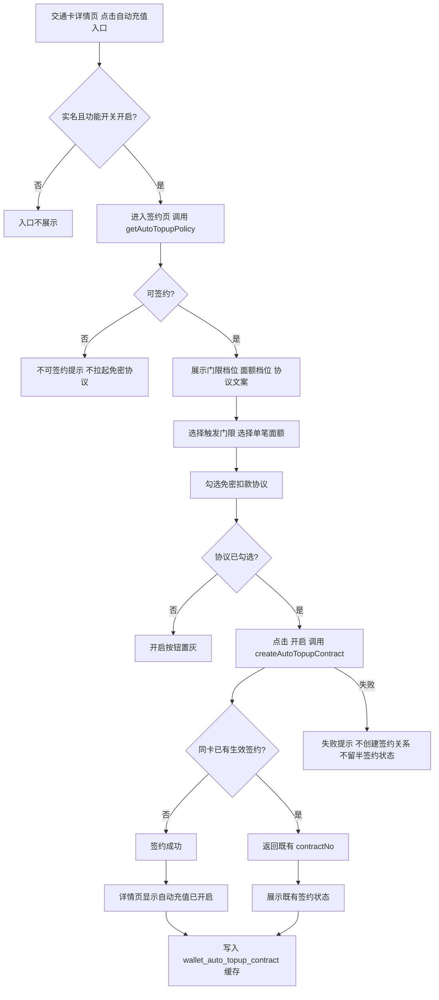
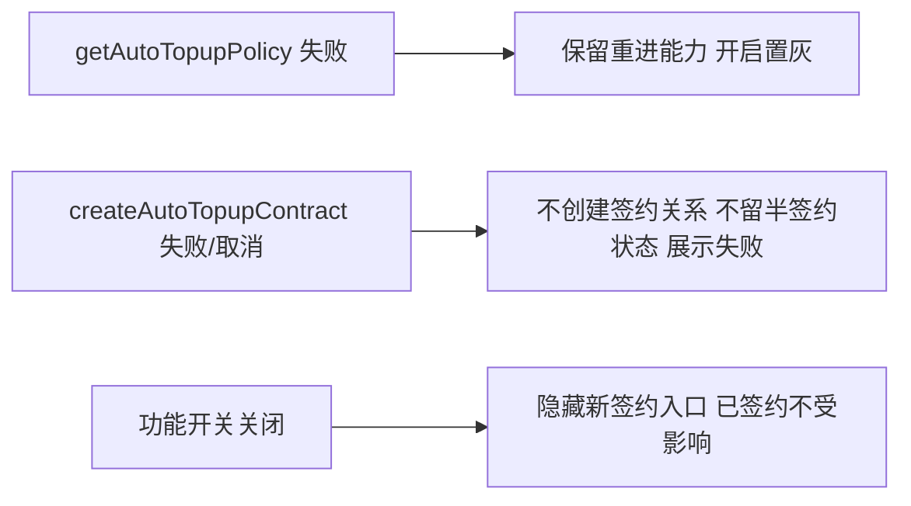

# 交通卡自动充值·策略查询与创建签约 — 需求规格（Spec）

> **模块标识**: `AR90006`
> **版本**: v1.0
> **创建日期**: 2026-08-25
> **最后更新**: 2026-08-25
> **状态**: 草稿

---

## 0. 术语映射表

| 原始术语 | 权威模块 | 所属层 | 置信度 | 易混项 | 用户确认 | 解释 |
|---|---|---|---|---|---|---|
| 交通卡自动充值 | WalletMain | 02-Feature | medium | Phone—只做入口壳不承载业务页；AccountManager—不负责充值规则/记录 | [x] | 交通卡余额低于门限时由服务端自动充值的功能；本 AR 只做端侧策略查询与创建签约 |
| 交通卡详情页 | WalletMain | 02-Feature | medium | Phone—入口壳不承载业务页；CommUI—公共积木不拥有业务语义 | [x] | 展示交通卡信息的页面，含自动充值入口 |
| 自动充值签约页 | WalletMain | 02-Feature | medium | CommUI—只提供可复用组件，不实现签约流程 | [x] | 用户选择门限/面额、勾选免密协议并开启自动充值的页面 |
| 触发门限 | WalletMain | 02-Feature | medium | CommFunc—通用工具，不拥有充值规则 | [x] | 余额低于该档位时触发自动充值；档位 5/10/20/30 元 |
| 单笔充值面额 | WalletMain | 02-Feature | medium | AccountManager—不负责充值业务规则 | [x] | 每次自动充值的金额档位；20/50/100 元 |
| 免密扣款协议 | WalletMain | 02-Feature | medium | Phone—不负责业务协议页面 | [x] | 签约页内向用户展示并由其同意的扣款协议 |
| 功能开关 | WalletMain | 02-Feature | medium | Phone—不拥有自动充值业务开关 | [x] | 运营侧控制签约入口是否可见的开关 |
| 自动充值管理页 | WalletMain | 02-Feature | medium | AccountManager—不负责自动充值状态 | [x]（范围外·第2份） | 展示签约状态、记录与失败原因的管理页面；本 AR 范围外 |
| 充值记录 | WalletMain | 02-Feature | medium | AccountManager—不负责充值记录数据 | [x]（范围外·第2份） | 自动充值的成功/失败记录；本 AR 范围外 |
| 连续失败停用 | WalletMain | 02-Feature | medium | AccountManager—是自动充值生命周期态，不是账号登录态 | [x]（范围外·第2份） | 连续 3 次扣款失败后云侧停用；本 AR 范围外 |
| 主应用 | Phone | 01-Product | medium | — | [x] | 应用入口 HAP（PhoneAbility/根导航壳），不承载本 feature |
| 应用入口 | Phone | 01-Product | medium | — | [x] | 应用 Ability 与入口壳，不承载本 feature 内容 |
| 账号管理 | AccountManager | 04-BusinessBase | medium | — | [x] | 提供登录实名态（未实名不显示签约入口），本 AR 不新增其内容 |
| 公共 UI 组件 | CommUI | 05-SystemBase | medium | — | [x] | 可复用 UI 积木（列表项/卡片/Toast），不实现签约业务 |
| 系统功能封装 | CommFunc | 05-SystemBase | medium | — | [x] | 通用工具（日志/脱敏/导航上下文），不拥有充值规则 |
| 脱敏 | CommFunc | 05-SystemBase | medium | — | [x] | 记录中卡号等敏感字段按现有规则脱敏；本 AR 不存卡号/金额明细 |
| 登录 | AccountManager | 04-BusinessBase | medium | — | [x] | 登录实名态是入口门控前置；本 AR 仅消费登录态结果 |
| 公共 UI 组件 | CommUI | 05-SystemBase | medium | — | [x] | 可复用列表项/卡片/Toast |
| 通用列表项 | CommUI | 05-SystemBase | medium | — | [x] | 可复用列表项 UI 积木 |
| Toast | CommUI | 05-SystemBase | medium | — | [x] | 交互提示信息展示 |

---

## 1. 功能概述

为交通卡用户提供「签约一次、余额不足自动充值」的端侧第一步：在交通卡详情页提供自动充值入口（受实名与功能开关门控），进入签约页后拉取可签约性与策略档位，让用户选择门限与单笔面额、同意免密扣款协议后创建签约并展示成功态。判定与扣款由服务端执行，本 AR 只承载策略查询与创建签约这一段。

---

## Scope 声明

### Scope 模块清单

| 字段 | 取值 | 说明 |
|------|------|------|
| 本需求允许修改的模块 | `WalletMain` | 自动充值入口、签约页与策略/签约数据层全部落在该模块 |
| 本需求明确不修改的模块 | `Phone`、`AccountManager`、`CommUI`、`CommFunc` | 仅作为入口壳/登录态/通用组件/工具被消费，本需求不改其实现 |

### Scope 结构化字段（供 Spec 提取，必填）

```yaml
in_scope_modules:
  - WalletMain
out_of_scope_modules:
  - Phone
  - AccountManager
  - CommUI
  - CommFunc
rationale: |
  自动充值入口、签约页 UI、策略/签约数据层（AutoTopupRepository、端侧缓存）全部落在 WalletMain 的交通卡业务 feature——
  它已是交通卡生命周期管理的权威模块（glossary canonical_module）。
  Phone/AccountManager/CommUI/CommFunc 只被消费：Phone 提供页面壳，AccountManager 提供登录实名态
  （未实名不显示入口），CommUI 提供通用列表项/卡片/Toast，CommFunc 提供日志/脱敏/导航上下文——
  均无需改动实现。
  若未来需要把端云调用下沉到公共数据层或去公共模块新增网络封装，须先发起 scope 扩展提议。
```

### Visual Handoff（视觉交接，供 check-spec 读取）

```yaml
ui_change: new_or_changed
visual_handoff:
  kind: repo_assets
  authoritative_refs:
    - id: auto_topup_subscribe_page_img
      path: doc/features/AR90006/ux-reference/auto-topup-subscribe-page.png
  fidelity_target: semantic_layout
  asset_acquisition_mode: approximate
```

### 最小改动原则

1. **默认就地实现**：签约页、入口与数据层全部在 `WalletMain` 内实现，不上提公共模块。
2. **禁止默默扩展**：若需在 `CommFunc`/`CommUI`/`AccountManager` 新增公共能力，须先发起 scope 扩展提议。
3. **公共能力优先复用**：Toast/列表项用 `CommUI`，日志/VOC/Chart/脱敏用 `CommFunc`，登录态用 `AccountManager`。

---

## 2. 目标用户与使用场景

### 2.1 目标用户

| 用户角色 | 描述 |
|----------|------|
| 已实名交通卡用户 | 希望「想起来充值」不再需要自己操作；进入签约页完成一次签约 |
| 未实名交通卡用户 | 看不到自动充值入口，也无法完成签约（实名是签约前提） |

### 2.2 使用场景

| 场景编号 | 场景名称 | 场景描述 | 前置条件 |
|----------|----------|----------|----------|
| S1 | 首次开启自动充值 | 用户在交通卡详情页点击「自动充值」入口，进入签约页选择门限与面额、勾选免密协议后点击「开启」，完成签约 | 已实名登录；功能开关开启；卡片存在 |
| S2 | 已开启后再次进入 | 用户再次进入签约页，看到既有生效签约（返回既有 contractNo） | 该卡片已有生效签约 |
| S3 | 受限用户进入 | 未实名用户或功能开关关闭时，入口不出现 | — |

---

## 3. 功能清单

| 编号 | 功能名称 | 优先级 | 描述 | 关联场景 |
|------|----------|--------|------|----------|
| F1 | 自动充值入口（门控） | P0 | 交通卡详情页提供「自动充值」入口；未实名用户不可见，功能开关关闭时新用户不可见 | S1, S3 |
| F2 | 策略查询与展示 | P0 | 进入签约页调用 `getAutoTopupPolicy` 拉取可签约性、门限档位（5/10/20/30 元）、面额档位（20/50/100 元）、单日限额（200 元）与协议文案并展示；不可签约时不拉起免密协议 | S1 |
| F3 | 门限/面额选择 | P0 | 签约页提供门限单选与面额单选；门限与面额均为单选，选中后高亮 | S1 |
| F4 | 协议勾选与开启按钮 | P0 | 展示《免密扣款协议》并提供勾选控件；协议勾选后「开启」按钮才可点击，未勾选时置灰 | S1 |
| F5 | 创建签约 | P0 | 点击「开启」调用 `createAutoTopupContract`（入参账号、卡片、`agreementNo`、门限、面额）；同一卡片已有生效签约时返回既有 `contractNo`，端侧展示既有签约而非重复创建 | S1, S2 |
| F6 | 签约成功态与缓存写入 | P0 | 签约成功后详情页显示「自动充值已开启」及当前门限与面额；按 SR 写入端侧缓存 `wallet_auto_topup_contract`（`contractNo`/门限/面额/状态），供第 2 份状态查询共享 `contractNo` | S1 |
| F7 | 签约链路端侧埋点 | P1 | 端侧事件记录去标识账号、卡片类型、阶段与结果分类；不记录卡号、金额明细或支付参数 | S1, S2 |

---

## 4. 页面/界面描述

### 4.1 页面总览

```
┌─────────────────────────────┐
│  顶部导航（返回）自动充值      │
├─────────────────────────────┤
│  触发门限（单选组）           │
│    5 元 / 10 元 / 20 元 / 30 元 │
├─────────────────────────────┤
│  单笔充值面额（单选组）        │
│    20 元 / 50 元 / 100 元      │
├─────────────────────────────┤
│  ☐ 我已阅读并同意《免密扣款协议》│
├─────────────────────────────┤
│  [ 开 启 ]（勾选协议后可点）    │
└─────────────────────────────┘
```

### 4.2 UI 组件详细描述

#### 区域 1: 顶部导航

| 组件 | 类型 | 内容/数据 | 交互行为 |
|------|------|-----------|----------|
| 返回 | 图标按钮 | 返回箭头 | 点击返回上一页（复用 `NavPathContext.stack().pop()`） |
| 标题 | 文字 | 「自动充值」 | — |

#### 区域 2: 触发门限选择

| 组件 | 类型 | 内容/数据 | 交互行为 |
|------|------|-----------|----------|
| 门限标题 | 文字 | 「触发门限」 | — |
| 门限选项 | 单选组 | 5 元 / 10 元 / 20 元 / 30 元 | 单选，选中高亮；与面额选择相互独立 |
| 门限说明 | 文字 | 余额低于该档位时自动充值 | — |

#### 区域 3: 单笔充值面额选择

| 组件 | 类型 | 内容/数据 | 交互行为 |
|------|------|-----------|----------|
| 面额标题 | 文字 | 「单笔充值面额」 | — |
| 面额选项 | 单选组 | 20 元 / 50 元 / 100 元 | 单选，选中高亮 |

#### 区域 4: 协议勾选与开启按钮

| 组件 | 类型 | 内容/数据 | 交互行为 |
|------|------|-----------|----------|
| 协议勾选 | 勾选框 | 「我已阅读并同意《免密扣款协议》」 | 勾选后方可点击「开启」；勾选状态驱动按钮可用性 |
| 开启按钮 | 主按钮 | 「开启」 | 未勾选协议/策略未就绪时置灰；点击触发创建签约 |

### 4.3 页面状态

| 组件 | 类型 | 交互行为 | 状态 | 描述 | 触发条件 |
|------|------|----------|------|------|----------|
| 开启按钮 | 主按钮 | 置灰/可点随协议勾选切换 | 策略加载中 | 档位/协议加载中，开启置灰 | 进入签约页，请求 `getAutoTopupPolicy` |
| 页面容器 | 内容展示 | 档位/协议展示 | 默认状态 | 未选门限面额、未勾协议，开启置灰 | 策略加载完成 |
| 页面容器 | 内容展示 | 选择状态回写 | 待提交状态 | 门限/面额已选且协议已勾，开启可点 | 策略就绪 + 选择完成 |
| 页面容器 | 结果展示 | 成功态展示 | 签约成功 | 展示「自动充值已开启」与门限面额 | `createAutoTopupContract` 成功 |
| 页面容器 | 结果展示 | 既有态展示 | 已有生效签约 | 展示既有 `contractNo` 与门限面额，不重复创建 | 返回既有 `contractNo` |
| 页面容器 | 提示展示 | 不可签约提示 | 不可签约 | 不拉起免密协议，提示原因 | `getAutoTopupPolicy` 返回不可签约 |
| 页面容器 | 错误展示 | 失败重试 | 错误状态 | 请求失败，保留重试 | 接口异常 | 

---

## 5. 业务流程图

### 5.1 签约主流程



### 5.2 异常分支



---

## 6. 异常/边界场景处理

| 编号 | 异常场景 | 触发条件 | 处理方式 | 用户提示 |
|------|----------|----------|----------|----------|
| E1 | 策略查询失败（网络） | 无网络或 `getAutoTopupPolicy` 接口异常 | 展示错误态，保留再次进入/重试能力；不拉起免密协议 | 提示加载失败，可重试 |
| E2 | 不可签约 | `getAutoTopupPolicy` 返回不可签约（实名等前置不满足） | 不拉起免密协议，不进入创建流程 | 提示不可签约原因 |
| E3 | 创建签约失败/用户取消 | `createAutoTopupContract` 失败或用户在免密协议环节中止 | 不创建签约关系，不留半签约状态 | 失败提示，可重试 |
| E4 | 同卡已有生效签约 | 重复进入签约/重复触发创建 | 返回既有 `contractNo`，展示既有签约状态，不重复下单 | 展示既有自动充值状态 |
| E5 | 功能开关关闭 | 运营侧关闭签约入口 | 新用户不可见入口；已签约用户自动充值照常 | 入口不出现 |
| E6 | 单日达到限额 | 当日累计充值达 200 元 | 当日不再触发（云侧判定）；本 AR 签约链路不受影响 | 记录中体现正常受限（第 2 份展示） |
| E7 | 数据为空/无策略档位 | 接口返回空档位 | 展示空态，不进入创建流程 | 提示暂无可用档位 |
| E8 | 重复触发创建（快速连续点击） | 用户双击「开启」 | 前端提交防抖/幂等：以既有 `contractNo` 兜底，不重复下单 | — |

---

## 7. 非功能性需求

### 7.1 性能要求

| 指标 | 要求 | 说明 |
|------|------|------|
| 签约页首屏可交互 | ≤ 1500 ms（本工程设定，无上游依据） | 进入签约页到策略展示可交互 |
| 按钮点击响应 | ≤ 300 ms（本工程设定，无上游依据） | 选择门限/面额/勾选协议的即时反馈 |
| 端云调用频次 | 策略查询仅签约页进入时一次、创建签约一次，无轮询（本工程设定，无上游依据——域基线 DFX-01 无必要高频调用） | 结合 `wallet_auto_topup_contract` 缓存降频 |

### 7.2 兼容性要求

| 维度 | 要求 |
|------|------|
| 系统版本 | HarmonyOS NEXT 及以上（与工程基线一致） |
| 设备类型 | 手机 |
| 屏幕适配 | 跟随现有钱包页面适配，视觉规范沿用交通卡详情页现有样式，不新增控件类型（上游约束：交通卡自动充值产品需求说明） |

### 7.3 安全性要求

| 要求 | 说明 |
|------|------|
| 敏感数据脱敏 | 账号、卡片信息等敏感字段在各出口（日志、VOC、Chart、埋点、缓存）不得明文输出；记录不存卡号、金额明细或支付参数（上游约束：SE 设计文档·数据保护与交付） |
| `agreementNo` 只透传 | 端侧不持久化 `agreementNo`，仅透传给云侧（上游约束：SE 设计文档·接口与数据） |
| 缓存按账号隔离 | `wallet_auto_topup_contract` 按账号隔离，退出登录清除，不参与备份恢复（上游约束：SE 设计文档·接口与数据） |
| 未实名拦截 | 未实名用户看不到入口，也无法通过任何路径完成签约（上游约束：交通卡自动充值产品需求说明·验收意图） |

---

## 8. 验收标准

### P0 功能验收标准

- [ ] **AC-1** (F1): 未实名用户进入交通卡详情页看不到「自动充值」入口；功能开关关闭后新用户同样不可见（本工程设定，无上游依据——本 AR 依开关结果隐藏入口）。
- [ ] **AC-2** (F2): 已实名且开关开启用户进入签约页后，门限档位（5/10/20/30 元）、面额档位（20/50/100 元）、单日限额（200 元）与《免密扣款协议》文案在 ≤1500ms（本工程设定，无上游依据）内展示完成；策略返回不可签约时不展示协议且无法进入创建。
- [ ] **AC-3** (F2, F4): 勾选协议前「开启」按钮置灰不可点击；勾选后按钮可点击。门限与面额均为单选。
- [ ] **AC-4** (F3, F4): 门限与面额各自单选中互斥；重新选择生效（不残留旧选择）。
- [ ] **AC-5** (F5): 点击「开启」完成签约；同一卡片已有生效签约时返回既有 `contractNo` 且端侧展示既有签约状态，不重复创建。
- [ ] **AC-6** (F5): 创建签约失败或用户取消时不创建签约关系、不留半签约状态，给出失败提示。
- [ ] **AC-7** (F6): 签约成功后台面上展示「自动充值已开启」及当前门限与面额；端侧写入 `wallet_auto_topup_contract` 缓存（含 `contractNo`、门限、面额、状态）。

### P1 功能验收标准

- [ ] **AC-8** (F7): 签约链路事件已埋点：记录去标识账号、卡片类型、阶段与结果分类；不含卡号、金额明细或支付参数。

### 通用验收标准

- [ ] **AC-G1**: 签约页在 HarmonyOS NEXT 真机上正常显示，无布局错乱；视觉沿用交通卡详情页样式。
- [ ] **AC-G2**: 页面状态切换（策略加载中→默认→待提交→签约成功/已有生效签约/错误）与流程图一致。
- [ ] **AC-G3**: 网络异常时给出明确错误提示，不白屏不崩溃。
- [ ] **AC-G4**: 端云调用无轮询；策略展示依赖 `wallet_auto_topup_contract` 缓存降频。

---

## 9. 技术契约

### 9.1 端云接口

| 云侧接口 | 新增·复用·变更 | 入参 → 出参 | 错误码 | 代码现状 |
|---|---|---|---|---|
| `getAutoTopupPolicy` | 新增 | 账号/卡片 → 可签约性、门限档位、面额档位、单日限额、协议文案；不可签约不拉起免密协议 | 上游未声明错误码枚举，失败走通用处理 | 现状无端云封装（检索 `@ohos.net.http`/`rcp`/`axios` 于 in_scope 模块零命中）；本 AR 为新增调用域 |
| `createAutoTopupContract` | 新增 | 账号、卡片、`agreementNo`、门限、面额 → `contractNo`（同卡已有生效签约返回既有 `contractNo`） | 同左 | 同上，新增调用域 |

> 范围外：`getAutoTopupStatus` / `cancelAutoTopupContract` 属第 2 份（状态查询与解约），本 AR 不消费。

### 9.2 数据存储

| 键名/表名 | 介质 | 值结构 | 有效期 | 用途 | 代码现状 |
|---|---|---|---|---|---|
| `wallet_auto_topup_contract` | 关系型存储（`relationalStore`；现状无交通卡存储，本 AR 新增） | `{ contractNo, threshold, amount, status }` | 签约有效期内；退出登录清除，不参与备份恢复（上游约束：SE 设计文档·接口与数据） | 免网展示 + 供第 2 份状态查询共享 `contractNo` | 现状无既有交通卡存储（`CardRepository` 为 mock，无 RdbHelper），本键为新增 |

### 9.3 配置项

| 配置项 | 默认值 | 关闭态行为 | 历史版本兼容 | 代码现状 |
|---|---|---|---|---|
| 功能开关（自动充值入口） | 开启 | 新用户不可见签约入口，已签约自动充值照常 | 旧版本读不到开关时按关闭处理新入口 | 现状无远程配置下发（检索管理台/云侧下发于 in_scope 模块零命中）；开关结果经 `getAutoTopupPolicy` 返回呈现，端侧不新增常量开关 |

> 门限档位、面额档位、单日限额为云侧运营配置，经 `getAutoTopupPolicy` 返回，端侧不本地固化。

### 9.4 埋点

| 事件 | 触发节点 | 归属 | 报表影响 | 代码现状 |
|---|---|---|---|---|
| 自动充值策略查询 | 进入签约页拉取 `getAutoTopupPolicy` 完成/失败 | 运营 | 新增维度 | 现状 `CommFunc` 有 `WalletHAManager`（`vocBuilder`/`chartBuilder`）+ `Logger`；签约链路事件为本 AR 新增 |
| 自动充值创建签约 | `createAutoTopupContract` 成功/失败/返回既有 `contractNo` | 运营 | 新增维度 | 同上 |

> 埋点内容约束：只记录去标识账号、卡片类型、阶段与结果分类；不记录卡号、金额明细或支付参数（上游约束：SE 设计文档·数据保护与交付）。

### 9.5 依赖变更

| 依赖 | 变更 | 体积影响 | 兼容风险 | 代码现状 |
|---|---|---|---|---|
| 不涉及 | 无新增/升级依赖 | 无 | 无 | `WalletMain/oh-package.json5` dependencies 已含 `@aspect/AccountManager`/`CommUI`/`CommFunc`/`framework`；本 AR 无新依赖边 |

---

## 10. 规约约束要求

| 编号 | 本需求的要求 | 落点契约名 |
|---|---|---|
| UX-01 | 自动充值签约页的方向性布局参数（对齐/边距）使用 start/end 语义，文本对齐用 Start/End，禁 Left/Right——RTL 语言下镜像正确 | 自动充值签约页 `subscribe-*` 节点 |
| SEC-01 | 账号、卡片类敏感字段在签约链路各出口（日志/VOC/Chart/埋点/缓存）不得以明文输出；端侧不持久化 `agreementNo` | `wallet_auto_topup_contract`、自动充值埋点事件 |
| DFX-01 | 端云调用频次收敛：`getAutoTopupPolicy` 仅签约页进入时一次、`createAutoTopupContract` 仅创建动作一次，无轮询、无定时任务 | `getAutoTopupPolicy`、`createAutoTopupContract` |
| OBS-01 | 签约流程每一步（拉策略/选门限面额/勾协议/创建/成功/失败/返回既有）记日志进入与结果、分支与异常 | `Logger`（`CommFunc`） |
| OBS-02 | 关键路径事件记 VOC：策略查询完成、创建签约成功/失败/已有签约 | `WalletHAManager.vocBuilder` |
| OBS-03 | 创建签约到达终态记 Chart，终态互斥且穷尽：签约成功 / 已有生效签约 / 失败 | `WalletHAManager.chartBuilder` |
| RES-02 | 新增用户可见文案（「自动充值」相关标题、门限/面额说明、协议提示、开启等）按项目惯例定义为 string 资源并中英文齐备，不写中文字面量 | 自动充值 `string` 资源集合 |
| COMPAT-01 | 新增端云接口字段须新旧两端可处理：`getAutoTopupPolicy`/`createAutoTopupContract` 为全新接口，无既有字段删除/类型变更/含义改变；新增字段随接口同版本发布 | `getAutoTopupPolicy`、`createAutoTopupContract` |
| ENV-01 | `wallet_auto_topup_contract` 缓存被清除/退出登录后，以云侧查询为准自恢复，不崩溃不残留 | `wallet_auto_topup_contract` |
| ENV-02 | 签约入口与「开启」按钮可防重入/幂等：同一卡片已有生效签约时返回既有 `contractNo`，不重复下单 | `createAutoTopupContract` |
| DLV-01 | 新增用户可见字符串梳理待翻译清单并跟踪回稿合入 | 自动充值 `string` 资源集合 |

> 说明：DLV-02（对外开放面文档归档）处置标（评审动作），不产生代码要求，见《决策与评审记录》。

---

## 11. 设计模式候选登记

| 适用单元 | 候选 | 命中信号或反证 |
|---|---|---|
| 签约流程段（策略查询→选择→协议→创建→成功/失败/既有签约） | `decision-tree` | 占优候选：签约链路含多个分支（可签约/不可签约、已有签约/新签约、成功/失败/取消），每个分支自身多步且有各自失败处理，`if/else` 串子树会难以维护；但分支多为两三级且部分分支仅一两步，最终选型归 plan |
| 自动充值签约页（交互） | `page-interaction` | 候选：门限选择、面额选择、协议勾选与「开启」可用性由业务结果驱动先后顺序（勾选后才能提交），页内交互存在先后依赖；但当前页单选组+单按钮独立触发居多，交互间是否足够富足由 plan 判 |
| 单一入口筛选·门限/面额单选 | 无候选 | 每组单选各自独立、选后即结束，无跨步骤状态——不满足 page-interaction「交互由业务结果驱动」信号 |

---

## 宿主扩展治理项

本需求的治理项行动（管理台排期 / 打点归档 / 翻译回稿 / TA 联调 / Demo）落《决策与评审记录》的上线决策与跨团队协同，此处不重复列举。

---

## 附录

### A. 术语表

业务名词解释见 §0 术语映射表的「解释」列。

### B. 参考资料

| 文档 | 单号 |
|------|------|
| Product Requirement | RR90006（doc/features/AR90006/RR/prd.md） |
| System Design | SR90006（doc/features/AR90006/SR/design.md） |
| AR 提取件 | AR90006（doc/features/AR90006/AR/design.md） |

### C. 变更记录

| 日期 | 版本 | 变更内容 | 变更人 |
|------|------|----------|--------|
| 2026-08-25 | v1.0 | 初始版本（拆分第 1 份：策略查询与创建签约） | AI（起草） |