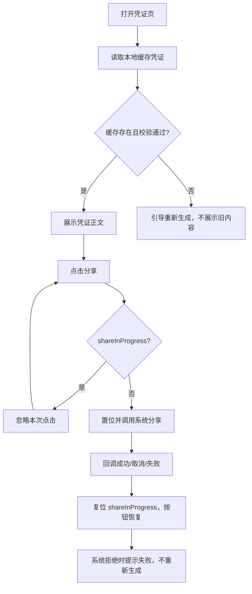

# ISSUE-410 — 需求说明

## 背景

交易凭证是交易完成后生成并保存在设备本地的数字凭证。用户在需要核对或留档时会打开凭证查看，也可能把它分享给他人。本特性要解决两类问题：一是凭证只在有网络时才能打开，断网后即使设备上已有校验通过的缓存也无法查看，离线场景用户拿不到凭证；二是分享按钮连续点击会拉起多个系统分享面板，误触会造成重复分享，打开失败后按钮也不会恢复。

完整需求的目标是：凭证在有可用缓存（已校验）时即可打开并查看，网络不可用时不再阻止；缓存缺失或校验失败时提示重新生成，不展示旧内容；分享做到防重入，处理中只允许一个分享面板，回调（成功/取消/失败）后按钮恢复，系统拒绝打开时提示失败且不重新生成凭证。

当前特性处在凭证「已生成并保存在设备本地」之后的查看与分享环节，负责离线查看、缓存校验与异常提示、分享防重入与失败恢复。凭证的生成、上传、撤销等其它环节不在本需求范围。共享同一系统分享能力，消费方为凭证页本身，无其它兄弟特性参与本环节。

## 术语

| 术语 | 在本需求中的含义 |
|------|------------------|
| 交易凭证 | 交易成功后生成并保存在设备本地的凭证，打开后展示凭证正文 |
| 凭证查看（断网/离线查看） | 用户打开凭证页查看正文的行为；断网时只要缓存有效仍可查看 |
| 凭证缓存（本地缓存/校验） | 设备本地保存的凭证文件；查看前须读取并校验通过才展示 |
| 分享 / 分享按钮 | 凭证页内把既有凭证分享给他人的入口与动作 |
| 断网 / 离线 | 设备无网络连接；本需求中断网仍可打开已校验缓存凭证 |
| 分享面板 | 系统提供的分享界面；凭证页通过调用系统分享能力拉起 |
| shareInProgress | 凭证页的分享请求处理中状态，用于连续点击防重入 |

## 范围

### 当前特性起止

本 AR 整体承载全部需求，无拆分。范围 = 离线交易凭证查看与分享修复：缓存凭证校验通过即可离线打开并查看；缓存缺失/损坏时提示重新生成；分享按钮防重入（单面板）与失败恢复。

### 范围内与范围外

- **范围内**：凭证页离线打开并展示正文；缓存缺失/校验失败时不展示旧内容并引导重新生成；分享按钮防重入与失败恢复；分享只读既有凭证文件。
- **范围外**：凭证生成、上传、撤销等环节；不同登录账号之间是否允许复用缓存、设备备份恢复后是否继续保留缓存——两项本轮尚未确认，保持 open，不写入当前方案与验收。

### 相关特性与交接

同一 SR 下无兄弟 AR；系统分享能力为外部系统级能力，凭证页为其调用方，仅定义「调用 → 回调」的交互边界，不涉及对方内部实现。无联调阻塞。

## 业务方案

### 采用的方案

凭证打开以其本地缓存为唯一前置：凭证页打开时读取并校验本地缓存凭证，有可用缓存即可展示（断网场景同样允许），无有效缓存则不展示正文并引导重新生成。分享通过 `shareInProgress` 状态防重入：首次点击置 `true` 后再调用系统分享能力，回调（成功/取消/失败）后复位为 `false`，处理中重复点击直接忽略；系统拒绝打开分享面板时提示失败，不重新生成凭证。分享只读取既有凭证文件，不修改文件、不新增持久化状态。

### 被否方案与理由

原始设计曾要求「凭证页每次打开都必须先访问服务端确认交易状态，网络不可用时一律阻止查看」。这与产品意图冲突——断网且本地缓存有效时应当允许打开凭证。经产品确认，采纳「有可用缓存即可查看」，原「必须联网」的要求被修正，网络状态不再是打开凭证的前置。

> **当前处置：** 允许：凭证页有可用缓存（已校验）即可打开查看，网络不可用时同样允许，服务端确认不再是打开前置。产品需求单允许断网查看已校验缓存；系统设计原要求「必须联网」与产品意图冲突。产品已确认离线时也允许打开已校验缓存凭证，系统设计已按「有可用缓存即可」修正。无被否方案（是本需求原始冲突的核心处置）。影响范围：CONFLICT-AC-01、CONFLICT-AC-02。
### 参与方与结果真源

| 参与方 | 输入 | 输出 / 失败影响 |
|--------|------|------------------|
| 凭证页（本特性） | 打开凭证动作、分享点击 | 展示正文或引导重新生成；分享面板拉起/失败提示 |
| 系统分享能力 | 分享请求 | 成功/取消/失败回调；拒绝打开时以失败回报页面 |
| 服务端 | 无（冲突处置后不再是打开前置） | 不参与打开判定 |

业务结果真源：能否展示凭证以本地缓存校验结果为准；分享按钮状态以 `shareInProgress` 为准。

## 业务流程

### 查看凭证

用户在凭证页执行打开动作，页面读取本地缓存凭证并校验。校验通过即展示凭证正文（断网场景同样允许）；缓存缺失或校验失败则不展示正文，进入「重新生成引导」。重新生成本身不在本需求范围，仅提供入口。

### 分享凭证

用户在展示正文后点击分享按钮。按钮处理中（`shareInProgress=true`）期间重复点击被忽略；首次有效点击触发系统分享能力，拉起分享面板。回调（成功/取消/失败）后 `shareInProgress` 复位为 `false`，按钮恢复可用。系统拒绝打开分享面板时，页面提示分享失败，不重新生成凭证。

## 功能说明

### 凭证页

凭证页为二级页面，展示交易凭证。页面状态包括展示正文、重新生成引导、分享处理中、分享恢复与分享失败。

### 离线打开凭证

断网时，凭证页读取本地缓存并校验；校验通过即展示凭证正文——网络不可用不阻止查看。有可用缓存即可查看，缓存有效性以本地校验为准。

### 缓存异常与重新生成引导

缓存文件不存在或校验失败时，凭证页不展示旧正文，展示重新生成引导；用户点击引导入口可发起重新生成（重新生成流程不在本需求交付范围）。

### 分享上报与防重入

分享按钮以 `shareInProgress` 控制防重入：首次点击置 `true` 并调用系统分享能力，处理中按钮禁用、重复点击直接忽略，确保连续点击只出现一个分享面板。回调（成功/取消/失败）后复位为 `false`，按钮恢复可用。

> **当前处置：** 用 shareInProgress 防重入：首次点击置 true 后调用系统分享，回调（成功/取消/失败）后复位；处理中重复点击忽略，不创建第二个请求。上游系统设计（SE）已定义 shareInProgress 防重入方案；分享只读取既有凭证文件，不修改文件、不新增持久化状态。影响范围：LOCAL-AC-01、LOCAL-AC-02。
### 分享失败提示

系统拒绝打开分享面板时，页面提示分享失败，不重新生成凭证；按钮保持可用，用户可再次尝试。分享只读取既有凭证文件，不修改文件内容，不新增持久化状态。本需求不涉及外部 SDK 或 TA 的新增依赖，仅复用宿主既有系统分享能力。

## 异常与恢复

| 异常情况 | 用户看到什么 | 业务结果 | 恢复方式 |
|----------|--------------|----------|----------|
| 网络断开 | 凭证正文正常展示 | 查看成功（断网不阻止） | — |
| 缓存不存在 | 正文区不显示旧内容，出现重新生成引导 | 不展示凭证 | 点击引导重新生成 |
| 缓存校验失败 | 不显示旧正文，出现重新生成引导 | 不泄露损坏内容 | 点击引导重新生成 |
| 系统拒绝打开分享面板 | 分享失败提示 | 不重新生成凭证，按钮已恢复 | 再次点击分享按钮尝试 |
| 分享回调（成功/取消/失败） | 按结果提示或不提示 | shareInProgress 复位、按钮恢复 | 可再次分享 |

## 验收

### 离线查看

| 编号 | 通过条件 | 主责 |
|------|----------|------|
| CONFLICT-AC-01 | 断网且本地缓存有效时，可以打开凭证 | 凭证页 |
| CONFLICT-AC-02 | 缓存不存在或校验失败时，不显示凭证正文 | 凭证页 |

### 分享防重入

| 编号 | 通过条件 | 主责 |
|------|----------|------|
| LOCAL-AC-01 | 连续点击只出现一个分享面板 | 凭证页 |

### 分享失败恢复

| 编号 | 通过条件 | 主责 |
|------|----------|------|
| LOCAL-AC-02 | 打开失败后按钮恢复，用户可以再次尝试 | 凭证页 |

### 整体质量要求

| 编号 | 要求 | 来源 | 通过条件 |
|------|------|------|----------|
| AC-G1 | 分享处理中按钮禁用、重复点击被忽略 | 上游 SR（`shareInProgress`） | 处理中再次点击不产生新请求 |
| AC-G2 | 分享只读（不改文件、不新增持久化状态） | 上游 SR | 分享后凭证文件与持久化状态不变 |

## 交付与上线

本特性为 WalletMain 内页面行为修复，不涉及云侧接口、不开新开关、无外部依赖变更，随应用版本发布。

上线前须完成以下自测（脚本门禁 + 真机/模拟验证）：离线打开已校验缓存凭证、缓存缺失/校验失败引导重新生成、连续点击分享单面板、分享失败后按钮恢复；分享只读校验（不修改文件、不新增持久化状态）。

发布与观察：本特性无方案级开关；如离线查看或分享防重入出现回归，通过恢复旧版本表现处理，不引入额外迁移步骤。跨账号缓存复用、备份迁移后缓存保留两项未确认前，不推动相关验收与上线依赖。

## 附录

### 端云接口

本需求不涉及端云接口：凭证打开以本地缓存为前置（冲突处置后「有可用缓存即可」），不访问服务端。

### 数据与存储

| 数据 | 介质 | 结构 | 生命周期 | 清除与升级行为 |
|------|------|------|----------|----------------|
| 交易凭证缓存文件 | 设备本地文件 | 凭证正文 | 生成后保存在设备上；查看/分享只读 | 缺失/损坏时不展示，引导重新生成；分享不新增持久化状态 |
| shareInProgress | 页面状态 | 布尔 | 首次点击置 true，回调复位 | 页面重建随状态重置 |

### 工程范围与追溯

- 权威模块：WalletMain（02-Feature），Scope 内模块为 WalletMain；范围外模块为 Phone、AccountManager、CommUI、CommFunc。
- 来源追溯：产品需求（RR-LOCAL-41）、系统设计（SR-LOCAL-41，冲突处置后修正版）、需求规格（Spec）、验收标准（acceptance）。
- 冲突与处置记录：产品验收 CONFLICT-AC-01（断网可查已校验缓存）与系统设计原「必须联网」互斥 → 产品确认离线允许打开已校验缓存 → 系统设计修正为「有可用缓存即可」；处置记录见需求初始化分析与流程契约 basis。

### Spec 编号 ↔ 故事落点

| Spec 编号 | 故事落点 |
|-----------|----------|
| S1 | 查看凭证（离线打开已校验缓存凭证） |
| S2 | 缓存异常与重新生成引导 |
| S3 | 分享上报与防重入 |
| S4 | 分享失败提示 |
| F1 | 离线打开凭证 |
| F2 | 缓存异常与重新生成引导 |
| F3 | 分享上报与防重入 |
| F4 | 分享失败提示 |
| F5 | 分享只读 |
| E1 | 异常表·网络断开 |
| E2 | 异常表·缓存不存在 |
| E3 | 异常表·缓存校验失败 |
| E4 | 异常表·系统拒绝打开分享面板 |
| E5 | 异常表·分享回调异常 |
| AC-1 | 验收·CONFLICT-AC-01 |
| AC-2 | 验收·CONFLICT-AC-02 |
| AC-3 | 验收·LOCAL-AC-01 |
| AC-4 | 验收·LOCAL-AC-02 |

### 技术契约标识 ↔ 故事落点

| 技术契约标识 | 故事落点 |
|--------------|----------|
| 分享处理中状态 | 功能说明·分享上报与防重入 |
| 断网打开凭证 | 背景·功能说明·离线打开凭证 |
| 分享面板打开失败 | 功能说明·分享失败提示 · 异常表 |
| 本需求不涉及外部 SDK/TA 新增 | 附录·端云接口与依赖（无新依赖） |

### 维持 open 的事项

- 不同登录账号之间是否允许复用缓存（未确认，保持 open）。
- 设备备份恢复后是否继续保留缓存（未确认，保持 open）。

### 规约与检查项编号速查

| 编号 | 标题与含义 | 本需求中的结论或落点 |
|---|---|---|
| CONFLICT-AC-01 | 断网且本地缓存有效时，可以打开凭证 | 本题故事验收·离线查看 |
| CONFLICT-AC-02 | 缓存不存在或校验失败时，不显示凭证正文 | 本题故事验收·离线查看 |
| LOCAL-AC-01 | 连续点击只出现一个分享面板 | 本题故事验收·分享防重入 |
| LOCAL-AC-02 | 打开失败后按钮恢复，用户可以再次尝试 | 本题故事验收·分享失败恢复 |

<!-- assembled-by: story-build.mjs | fingerprint: d195ac9031b19554a1c96b1024e13e41ad9a807882770d5524470e1ed63939a4 | sources: acceptance=571b69141babd2f7 design=f261b6bf08f42781 prd=d60ff729c11b385c se=6bb145d5faa553a4 spec=2c0fc08405822f2b -->
