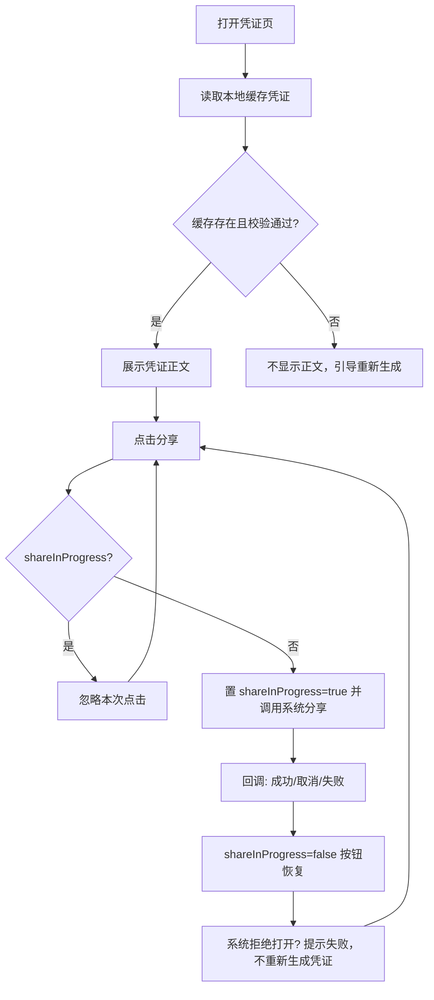

# 离线交易凭证查看与分享修复 — 需求规格（Spec）

> **模块标识**: `ISSUE-410`
> **版本**: v1.0
> **创建日期**: 2026-08-21
> **最后更新**: 2026-08-21
> **状态**: 草稿

---

## 0. 术语映射表（Terminology Mapping Table）

> 出处：`RR/prd.md` + `SR/design.md`（冲突处置后）+ `AR/design.md`（整体承载）。
> 权威模块均取自 `doc/module-catalog.yaml`（新术语，未命中 glossary，故标注 medium）。

| 原始术语 | 权威模块 | 所属层 | 置信度（high / medium / low） | 易混项（必须亮出） | 用户确认 |
|---------|---------|--------|-------------------------------|-------------------|---------|
| 交易凭证 | WalletMain | 02-Feature | medium | CommUI — 凭证是业务数据视图，非通用 UI 积木 | [x] |
| 凭证查看（断网/离线查看） | WalletMain | 02-Feature | medium | CommFunc — 查看是业务页面行为，非工具类封装 | [x] |
| 凭证缓存（本地缓存/校验） | WalletMain | 02-Feature | medium | CommFunc — 缓存策略属 feature 数据面，非通用工具 | [x] |
| 分享 / 分享按钮 | WalletMain | 02-Feature | medium | CommUI — 分享入口属业务页，非通用组件/Toast | [x] |
| 系统分享面板 | WalletMain | 02-Feature | medium | Phone — 面板是系统能力；调用编排与页面状态归 WalletMain | [x] |
| 重新生成凭证 | WalletMain | 02-Feature | medium | AccountManager — 重新生成是交易凭证动作，非账号会话 | [x] |

**回写约定**：以上术语均为本需求语境新术语；用户确认后（2026-08-21 口头确认），
已按 `confidence_hint: "user-approved on 2026-08-21"` 处理，见本术语节确认列 `[x]`。

---

## 1. 功能概述

修复离线交易凭证的查看与分享：断网时仍可用设备上已校验的缓存凭证打开并查看交易凭证正文，
缓存缺失或校验失败时提示重新生成；分享按钮防重入，连续点击只出现一个系统分享面板，
失败后按钮恢复以便重试。

---

## Scope 声明

> **本节是 Scope 守门机制的起点。**
> plan（Design）必须继承本节的 `in_scope_modules`；
> coding（Coding）的 git diff 不得越界到本节之外的模块。

### Scope 模块清单

| 字段 | 取值 | 说明 |
|------|------|------|
| 本需求允许修改的模块 | `WalletMain` | 交易凭证查看/分享页面与相关数据面（PascalCase，与 `doc/architecture.md` 一致） |
| 本需求明确不修改的模块 | `Phone`、`AccountManager`、`CommUI`、`CommFunc` | 纯消费/不触碰；`FinancialCard` 为未登记工程残件（不在 catalog/build/architecture），不进入 Scope |

### Scope 结构化字段（供 Spec 提取，必填）

```yaml
in_scope_modules:
  - WalletMain
out_of_scope_modules:
  - Phone
  - AccountManager
  - CommUI
  - CommFunc
rationale: |
  交易凭证的查看、缓存读取与分享交互均发生在钱包 feature 页面（当前我的-金融入口/卡包页均归
  WalletMain），故本需求只改 WalletMain。
  Phone（入口 HAP 壳）、AccountManager（账号域）、CommUI（通用 UI 积木）、CommFunc（工具/日志）
  均为消费侧或无关域，无需改动。
  若下游希望将凭证缓存读写抽象为公共能力，应属新模块决策，不在本需求范围，须另行评估。
  FinancialCard 未在 catalog/build/architecture 登记（untracked 残件），本需求不触碰。
```

### Visual Handoff（视觉交接）

> 本需求为行为修复，无参考图、不涉及逐图保真比对（fidelity-intent 判定 semantic_layout）；
> 本 profile spec.visual_handoff 脚本守门为 SKIP，故不撰写 ui_change 块 / ui-spec。

### 最小改动原则

1. **默认就地实现**：凭证查看与分享逻辑优先实现在 `WalletMain` 内（不新增公共接口）。
2. **禁止默默扩展**：若 plan 阶段发现需在公共模块新增接口，先停下走 scope 扩展提议，不直接写入。
3. **公共能力优先复用**：提示反馈复用 `CommUI.showToast`，导航沿用 `CommFunc.NavPathContext` 既有惯例。

---

## 2. 目标用户与使用场景

### 2.1 目标用户

| 用户角色 | 描述 |
|----------|------|
| 钱包用户（凭证查看者） | 需要查看交易凭证，包括离线（无网络）场景 |
| 钱包用户（凭证分享者） | 需要把已生成的交易凭证分享给他人，但不希望误触多次拉起多个分享面板 |

### 2.2 使用场景

| 场景编号 | 场景名称 | 场景描述 | 前置条件 |
|----------|----------|----------|----------|
| S1 | 离线查看已缓存凭证 | 网络不可用时，用户打开此前成功生成并保存在设备上的交易凭证，看到正文内容 | 凭证在设备上存在且校验通过 |
| S2 | 缓存异常引导重生 | 缓存文件缺失或损坏，用户打开凭证页时不显示旧内容而看到重新生成提示 | 缓存不存在或校验失败 |
| S3 | 分享防重入 | 用户连续点击分享按钮，系统只出现一个分享面板 | 分享处理中 |
| S4 | 分享失败可重试 | 系统拒绝打开分享面板时，用户看到失败提示且按钮恢复，可再次尝试 | 系统分享能力拒绝打开 |

---

## 3. 功能清单

| 编号 | 功能名称 | 优先级 | 描述 | 关联场景 |
|------|----------|--------|------|----------|
| F1 | 离线打开已校验缓存凭证 | P0 | 断网时，凭证页读取本地缓存并校验；校验通过即可展示凭证正文（有可用缓存即可查看） | S1 |
| F2 | 缓存异常处理 | P0 | 缓存不存在或校验失败时，不显示正文，引导重新生成 | S2 |
| F3 | 分享防重入 | P0 | 首次点击进入处理中后暂时禁用分享按钮；处理期间重复点击直接忽略，不创建第二个请求 | S3 |
| F4 | 分享失败提示与恢复 | P0 | 系统拒绝打开分享面板时提示失败，不重新生成凭证；成功/取消/失败回调后按钮恢复可再次尝试 | S4 |
| F5 | 分享只读 | P1 | 分享只读取既有凭证文件，不修改文件内容，不新增持久化状态 | S3, S4 |

---

## 4. 页面/界面描述

### 4.1 页面总览

凭证页为 WalletMain 下二级页面（沿用 `NavDestination` 惯例，从「我的-银行卡交易记录 / 卡包」入口进入）。
页面按行为修复描述，无逐图保真比对（无参考图）。

```
┌─────────────────────────────┐
│         顶部区域（返回 + 标题） │
├─────────────────────────────┤
│       主内容区（凭证正文）      │
│       或 重新生成引导          │
├─────────────────────────────┤
│        底部操作区（分享按钮）   │
└─────────────────────────────┘
```

### 4.2 UI 组件详细描述

#### 区域 1: 顶部区域

| 组件 | 类型 | 内容/数据 | 交互行为 |
|------|------|-----------|----------|
| 返回 | 图标按钮 | 返回上一级 | 点击返回（沿用 `NavPathContext.pop`） |
| 页面标题 | 文本 | 交易凭证 | — |

#### 区域 2: 主内容区

| 组件 | 类型 | 内容/数据 | 交互行为 |
|------|------|-----------|----------|
| 凭证正文 | 文本/内容展示 | 已校验缓存中的凭证正文 | 仅展示；离线可查看 |
| 重新生成引导 | 文本/按钮 | 缓存缺失/失败的提示文案与引导 | 点击引导重新生成凭证 |

#### 区域 3: 底部操作区

| 组件 | 类型 | 内容/数据 | 交互行为 |
|------|------|-----------|----------|
| 分享按钮 | 按钮（可禁用态） | 分享 | 首次点击进入处理中并禁用；处理中重复点击忽略；成功/取消/失败回调后恢复；系统拒绝打开时提示失败 |

### 4.3 页面状态

| 状态 | 描述 | 触发条件 |
|------|------|----------|
| 展示凭证正文 | 显示已校验缓存中的正文 | 缓存存在且校验通过（含断网） |
| 重新生成引导 | 不显示旧内容，提示重新生成 | 缓存缺失或校验失败 |
| 分享处理中 | 分享按钮禁用 | 首次点击分享后、回调返回前 |
| 分享恢复 | 分享按钮可用 | 回调成功/取消/失败返回 |
| 分享失败 | 提示失败，按钮已恢复 | 系统拒绝打开分享面板 |

| 组件 | 类型 | 交互行为 |
|------|------|----------|
| 凭证正文视图 | 文本/内容展示 | 展示状态显示正文；缺失/失败态不显示 |
| 重新生成入口 | 文本/按钮 | 缓存异常态可点击引导重新生成 |
| 分享按钮 | 按钮（可禁用） | 处理中禁用；其余状态可点击触发分享 |

---

## 5. 业务流程图

### 5.1 核心业务流（主路径）



### 5.2 子流程（如有）

无独立子流程；异常分支见第六章。

---

## 6. 异常/边界场景处理

| 编号 | 异常场景 | 触发条件 | 处理方式 | 用户提示 |
|------|----------|----------|----------|----------|
| E1 | 网络断开 | 断网时打开凭证页 | 不阻止查看：本地缓存校验通过仍展示正文（冲突处置后行为） | 无需特定提示（可正常查看） |
| E2 | 缓存不存在 | 凭证文件缺失 | 不显示正文，引导重新生成 | 提示缓存不存在、请重新生成 |
| E3 | 缓存校验失败 | 凭证文件损坏/校验不一致 | 不显示正文，引导重新生成 | 提示缓存校验失败、请重新生成 |
| E4 | 系统分享面板被拒 | 系统拒绝打开分享面板 | 提示失败，不重新生成凭证 | 提示分享失败 |
| E5 | 分享回调异常 | 回调成功/取消/失败返回 | 一律复位 shareInProgress，按钮恢复 | 按结果提示或不提示 |

---

## 7. 非功能性需求

### 7.1 性能要求

| 指标 | 要求 | 说明 |
|------|------|------|
| 凭证打开响应 | ≤ 2 秒 | 从进入凭证页到展示正文（本地缓存读取+校验） |
| 分享状态复位 | ≤ 1 秒 | 分享面板回调返回后按钮恢复可点 |

### 7.2 兼容性要求

| 维度 | 要求 |
|------|------|
| 系统版本 | HarmonyOS 6.0.1(21) 及以上（与工程 compatibleSdkVersion 一致） |
| 设备类型 | 手机 |
| 屏幕适配 | 与 WalletMain 现有页面一致 |

### 7.3 安全性要求

| 要求 | 说明 |
|------|------|
| 缓存只读 | 分享只读取既有凭证文件，不修改文件、不新增持久化状态 |
| 不泄露损坏内容 | 缓存校验失败时不展示任何旧正文 |

---

## 8. 验收标准

<!-- 每条标准与功能清单功能项一一对应；原始编号见 `RR/prd.md`（CONFLICT-/LOCAL-） -->

### P0 功能验收标准

- [ ] **AC-1** (F1): 断网且本地缓存有效时，可以打开凭证（原始编号 `CONFLICT-AC-01`）。
- [ ] **AC-2** (F2): 缓存不存在或校验失败时，不显示凭证正文（原始编号 `CONFLICT-AC-02`）。
- [ ] **AC-3** (F3, F5): 连续点击只出现一个分享面板（原始编号 `LOCAL-AC-01`）。
- [ ] **AC-4** (F4, F5): 分享面板打开失败后按钮恢复，用户可以再次尝试（原始编号 `LOCAL-AC-02`）。

### 通用验收标准

- [ ] **AC-G1** (F3): 分享处理中按钮为禁用态，重复点击被忽略。
- [ ] **AC-G2** (F4): 系统拒绝打开分享面板时提示失败，且不重新生成凭证。

---

## 9. 技术契约

### 9.1 端云接口

| 接口 | 新增·复用·变更 | 请求 | 响应 | 错误语义 | 当前能力依据 |
|---|---|---|---|---|---|
| 本需求不涉及 | 不涉及 | — | — | — | `RR/prd.md`+`SR/design.md` 均无端云接口；凭证打开以本地缓存为前置（冲突处置后「有可用缓存即可」），不访问服务端 |

### 9.2 数据存储

| 数据 | 介质 | 结构 | 生命周期 | 清除与升级行为 | 当前能力依据 |
|---|---|---|---|---|---|
| 交易凭证缓存文件 | 设备本地文件 | 凭证正文（字段以既有实现为准） | 生成后保存在设备上；查看/分享只读 | 缺失/损坏时不展示，引导重新生成；分享不新增持久化状态 | `RR/prd.md`「此前成功生成并保存在设备上」；`SR/design.md`「分享只读取既有凭证文件，不修改文件，也不新增持久化状态」 |
| 分享处理中状态 | 页面状态（`shareInProgress`） | 布尔 | 首次点击置 true，回调（成功/取消/失败）复位 | 页面重建随状态重置 | `SR/design.md` |

### 9.3 配置项

| 配置 | 控制方 | 默认值 | 关闭态行为 | 开放与下线处置 | 当前能力依据 |
|---|---|---|---|---|---|
| 本需求不涉及 | 不涉及 | — | — | — | `RR/prd.md`+`SR/design.md` 无相关配置管控条目 |

### 9.4 诊断与业务度量意图

Spec 只写业务意图，不提前决定 API、事件名、字段或调用点。

| 对象 | 类型 | 要回答的问题 | 触发业务边界 | 数据边界 |
|---|---|---|---|---|
| 断网打开凭证 | 业务度量意图 | 离线可查是否达成 | 断网且缓存校验通过时展示正文 | 仅记录行为类别，不记录凭证正文内容 |
| 分享面板打开失败 | 业务度量意图 | 系统拒绝分享的频次与恢复路径是否有效 | 系统拒绝打开分享面板 | 不记录失败详情之外的敏感字段 |

### 9.5 依赖变更

| 依赖 | 变更 | 消费模块 | 体积影响 | 兼容与失败语义 | 当前能力依据 |
|---|---|---|---|---|---|
| 本需求不涉及外部 SDK/TA 新增 | 新增/升级均无 | WalletMain | 无 | 系统分享能力由宿主提供，调用失败按 E4 处理 | `SR/design.md`「调用系统分享能力」；无新依赖声明 |

---

## 10. 设计模式候选

| 适用单元 | 业务事实 | 候选 pattern_id | Spec 证据 |
|---|---|---|---|
| 凭证页·分享防重入 | 首次点击置 shareInProgress=true 并调用系统分享，回调（成功/取消/失败）复位；处理中重复点击忽略，按钮状态由业务结果驱动先后 | page-interaction | 场景 S3/S4、功能 F3/F4、§5 主路径分支、§8 AC-3/AC-4 |
| 凭证页·缓存校验分支 | 打开即按缓存校验结果分叉：通过→展示正文；缺失/失败→引导重新生成。分支仅一两步、条件为纯数据校验 | 无候选 | 场景 S1/S2、功能 F1/F2、§5 主路径分支、§8 AC-1/AC-2、DEC-001 |

---

## 宿主扩展治理项

| 扩展项 | 是否涉及 | 宿主模板/检查来源 |
|--------|----------|-------------------|
| 跨账号缓存复用 | 否（保持 open，未确认，不写方案） | `RR/prd.md`「本轮尚未决定」 |
| 备份迁移后缓存保留 | 否（保持 open，未确认，不写方案） | `RR/prd.md`「本轮尚未决定」 |

---

## 附录

### A. 术语表

| 术语 | 解释 |
|------|------|
| 交易凭证 | 交易成功后生成并保存在设备上的凭证，含可展示正文 |
| 凭证缓存 | 设备本地上保存的凭证文件，查看前须通过校验 |
| shareInProgress | 页面分享请求处理中状态，用于防重入 |

### B. 参考资料

- `RR/prd.md`（RR-LOCAL-41）：产品需求与验收意图
- `SR/design.md`（SR-LOCAL-41）：系统设计（冲突处置后修正版）
- `AR/design.md`：本 AR 提取件（整体承载）

### C. 变更记录

| 日期 | 版本 | 变更内容 | 变更人 |
|------|------|----------|--------|
| 2026-08-21 | v1.0 | 初始版本：Story volSW 初始化收口 + spec 初稿 | AI（Story/spec 阶段） |