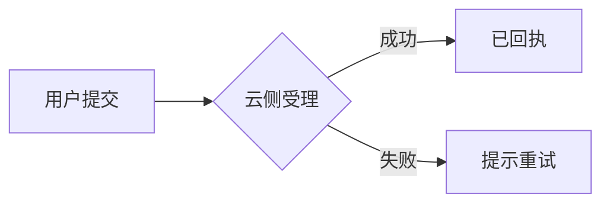

# 甲需求 PRD

用户提交申请后要能看到回执，接口 createBusinessOrder 超时阈值 3 秒。

| 状态 | 触发条件 |
|---|---|
| 待提交 | 用户点了提交但未收到回执 |
| 已回执 | 云侧返回 applicationId |

处理流程如下：

```mermaid
flowchart LR
    A[用户提交] --> B{云侧受理}
    B -->|成功| C[已回执]
    B -->|失败| D[提示重试]
```
