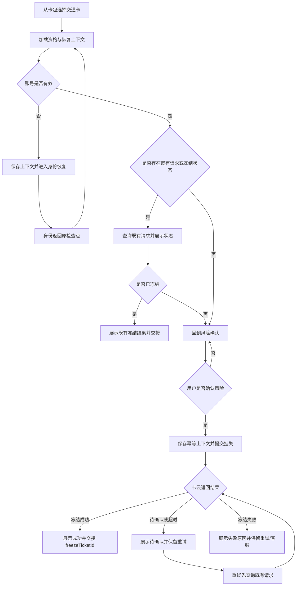

# AR90004 交通卡紧急挂失需求规格

> **模块标识**：`AR90004`
> **版本**：v1.0
> **创建日期**：2026-08-29
> **最后更新**：2026-08-29
> **状态**：草稿

## 0. 术语映射表

| 原始术语 | 权威模块 | 所属层 | 置信度 | 易混项 | 用户确认 | 解释 |
|---|---|---|---|---|---|---|
| 交通卡 | WalletMain | 02-Feature | 中 | FinancialCard：金融卡开卡域；Phone：宿主壳 | [x] | 本单要处理的钱包内交通卡及其挂失状态，不指金融卡开卡流程。 |
| 紧急挂失 | WalletMain | 02-Feature | 高 | 补卡：AR90005 后续流程；AccountManager：账号域 | [x] | 用户发起的交通卡失卡保护流程，负责提交挂失并确认卡云冻结结果。 |
| 冻结结果 | WalletMain | 02-Feature | 高 | 补卡结果：AR90005；本地卡包展示：仅卡片展示 | [x] | 卡云返回的最终冻结状态及 `freezeTicketId`，作为本单对外交付。 |
| 卡云 | WalletMain | 02-Feature | 中 | FinancialCard：金融卡域；Phone：应用宿主 | [x] | 由 WalletMain 自己实现的卡服务适配层，不代表当前仓库已有真实网络实现。 |
| 补卡 | WalletMain | 02-Feature | 高 | 紧急挂失：本单前置流程；AR90005：补卡实现单 | [x] | 仅作为边界词出现；地址、费用、订单、支付、制卡和跟踪均不在 AR90004 实现。 |
| 钱包主功能 | WalletMain | 02-Feature | 高 | 公共 UI 组件：CommUI；系统功能封装：CommFunc | [x] | 承载卡包入口、挂失页面与页面级业务编排的 feature。 |
| 卡包 | WalletMain | 02-Feature | 高 | 交通卡数据服务：本单新增挂失能力 | [x] | 用户查看卡片并进入紧急挂失的现有钱包页面入口。 |
| 账号管理 | AccountManager | 04-BusinessBase | 高 | 脱敏：CommFunc 工具能力；页面编排：WalletMain | [x] | 提供登录态和账号展示真理，本单只调用其现有出口，不修改其职责。 |
| 登录 | AccountManager | 04-BusinessBase | 高 | 宿主入口：Phone；挂失页面：WalletMain | [x] | 挂失流程所依赖的账号登录/身份状态，不新增独立登录流程。 |
| 公共 UI 组件 | CommUI | 05-SystemBase | 高 | 系统功能封装：CommFunc；业务页面：WalletMain | [x] | 可复用的卡片、列表、主题和 Toast 等界面基础能力。 |
| 脱敏 | CommFunc | 05-SystemBase | 高 | 账号管理：AccountManager；公共 UI：CommUI | [x] | 对卡号或账号展示值做不可逆的界面掩码处理。 |
| 系统功能封装 | CommFunc | 05-SystemBase | 高 | 公共 UI 组件：CommUI；账号管理：AccountManager | [x] | 本单复用的日志、脱敏等无界面通用能力。 |

## 1. 功能概述

为已登录用户提供交通卡紧急挂失能力：用户从卡包选择交通卡后，查看挂失影响并确认，完成身份或状态冲突恢复，提交一次挂失请求，展示卡云返回的冻结结果，并向后续 AR90005 交付 `freezeTicketId` 与最终冻结状态。卡云当前在本仓库以 WalletMain 自己实现的适配层和模拟数据承载，生产服务协议由后续 plan/实现阶段接入。

## Scope 声明

### Scope 模块清单

| 字段 | 取值 | 说明 |
|---|---|---|
| 本需求允许修改的模块 | `WalletMain` | 新增挂失入口、挂失页面、状态编排、恢复上下文和卡云适配层。 |
| 本需求明确不修改的模块 | `AccountManager`、`CommUI`、`CommFunc`、`Phone` | 分别作为账号、公共 UI、工具和宿主能力的既有提供方；不在这些模块复制挂失业务。 |

```yaml
in_scope_modules:
  - WalletMain
out_of_scope_modules:
  - AccountManager
  - CommUI
  - CommFunc
  - Phone
rationale: |
  AR90004 是 WalletMain 内的交通卡紧急挂失流程，允许改动范围只覆盖从卡包进入到冻结结果交接。
  AccountManager、CommUI、CommFunc 和 Phone 只提供既有出口或宿主装配，本需求不同意为了挂失逻辑把业务提到这些模块；
  若发现必须修改它们的公共接口，应先提交 scope 扩展提议并取得确认。补卡地址、费用、订单、支付、制卡、跟踪及补卡客服交接属于 AR90005，不能因两单有关联而纳入本单。
```

```yaml
ui_change: new_or_changed
visual_handoff:
  kind: repo_assets
  fidelity_target: semantic_layout
  asset_acquisition_mode: approximate
  authoritative_refs:
    - id: loss_page_layout
      path: doc/features/AR90004/ux-reference/README.md
    - id: loss_page_wireframe
      path: doc/features/AR90004/assets/紧急挂失界面原型说明/image1.png
    - id: loss_page_state_flow
      path: doc/features/AR90004/assets/紧急挂失界面原型说明/image2.png
```

### UI 规格确认

- [x] loss_entry
- [x] identity_checkpoint
- [x] submit_progress
- [x] loss_result

### 最小改动原则

- 页面、状态编排、恢复上下文和卡云适配均落在 `WalletMain`。
- 账号、公共 UI、日志和脱敏只复用既有模块出口，不新增公共模块接口。
- 页面只交付挂失和冻结结果，不展示或发起补卡流程；补卡由 AR90005 独立承接。

## 2. 目标用户与使用场景

### 2.1 目标用户

| 用户角色 | 描述 |
|---|---|
| 已登录钱包用户 | 持有已绑定交通卡，发现卡片遗失或存在失控风险，需要立即保护卡片。 |
| 返回恢复用户 | 在身份校验、系统返回或页面销毁后重新进入挂失流程，需要从上次检查点继续。 |

### 2.2 使用场景

| 场景编号 | 场景名称 | 场景描述 | 前置条件 |
|---|---|---|---|
| S1 | 发起紧急挂失 | 用户从卡包选择交通卡，查看卡片状态、冻结影响和风险说明，确认后提交挂失。 | 已登录；卡片属于当前账号；资格检查完成。 |
| S2 | 身份恢复后继续 | 身份状态失效或需要系统返回时，系统保存挂失上下文；用户完成登录后返回原检查点。 | 已产生未完成的挂失上下文。 |
| S3 | 状态冲突恢复 | 卡片已有挂失请求、正在冻结或已冻结时，用户重进或点击重试，系统先查询既有请求。 | 存在同账号同卡的既有请求或状态变化。 |
| S4 | 结果确认与交接 | 卡云返回冻结终态后，用户看到可读结果，系统交付冻结凭证和最终状态。 | 提交请求已返回卡云结果。 |

## 3. 功能清单

| 编号 | 功能名称 | 优先级 | 描述 | 关联场景 |
|---|---|---|---|---|
| F1 | 挂失资格与风险确认 | P0 | 加载当前卡片上下文、资格、卡片状态、冻结影响和风险说明；用户明确确认后才能提交。 | S1 |
| F2 | 身份与状态冲突恢复 | P0 | 保存账号隔离的恢复上下文；身份返回或状态冲突后回到检查点，不重复创建请求。 | S2、S3 |
| F3 | 幂等提交挂失 | P0 | 以同一恢复上下文生成稳定幂等标识；提交中禁用重复操作，重试先查询既有请求。 | S1、S3 |
| F4 | 冻结结果展示 | P0 | 展示冻结成功、结果待确认、冻结失败三类结果；只有卡云确认冻结时才显示成功。 | S3、S4 |
| F5 | 冻结结果交接 | P0 | 对外提供 `freezeTicketId`、卡片标识和最终冻结状态；不创建补卡订单、不改变补卡状态。 | S4 |
| F6 | 失败恢复入口 | P1 | 失败或结果待确认时保留重试和联系客服入口，并显示失败原因及下一步。 | S2、S3 |

## 4. 页面/界面描述

### 4.1 页面总览

挂失流程使用一个页面承载三段内容，并随流程状态切换内容：

1. 资格与风险确认区：显示交通卡脱敏信息、当前卡片状态、冻结影响、风险解释和确认控件。
2. 身份与状态恢复区：显示当前检查点、身份返回后的继续说明、既有请求或状态冲突处理结果。
3. 卡云结果区：显示提交中、冻结成功、结果待确认或冻结失败；失败状态保留重试与联系客服。

原型只约束区域、层级和交互含义，颜色与间距以现有主题资源为准。主操作、状态结果和恢复入口在深色主题下保持清晰可见，主要操作在从右到左布局下仍处于可达位置。

### 4.2 UI 组件与交互

| 区域 | 组件 | 类型 | 内容/数据 | 交互行为 |
|---|---|---|---|---|
| 页面头部 | 导航栏 | 页面标题、返回操作 | 返回时保留未完成上下文；不清除未终结的挂失请求。 |
| 资格与风险确认区 | 卡片详情区 | 卡片名称、脱敏卡号、卡片状态、可用性 | 只展示当前账号和当前卡片信息；禁止展示完整卡号。 |
| 资格与风险确认区 | 风险说明区 | 冻结影响、不可逆提示、操作后果 | 提交按钮在用户完成明确确认前不可用。 |
| 资格与风险确认区 | 主操作按钮 | `确认挂失` | 进入提交中；提交中禁用重复点击。 |
| 身份与状态恢复区 | 检查点状态卡 | 身份校验、状态冲突、既有请求状态 | 身份返回后回到原检查点；状态冲突先展示查询结果。 |
| 卡云结果区 | 结果状态组件 | 成功、待确认、失败的标题、原因和下一步 | 成功展示凭证；待确认和失败不得伪装成已冻结。 |
| 卡云结果区 | 重试按钮 | `重试` | 先查询既有请求，再决定是否继续；禁止直接重复创建。 |
| 卡云结果区 | 客服按钮 | 操作控件 | `联系客服` | 进入既有客服能力；不转入或创建补卡订单。 |

### 4.3 页面状态
| 组件 | 类型 | 交互行为 |
|---|---|---|
| 资格加载 | 加载提示 | 页面打开、身份回跳、冲突恢复或重新进入时查询资格；主操作不可用。 |
| 等待风险确认 | 风险说明与确认控件 | 资格允许且无阻断状态时展示冻结影响和数据使用说明，确认前不可提交。 |
| 身份恢复 | 检查点状态卡 | 账号状态无效或身份校验未完成时保留脱敏上下文，完成身份后回到原检查点。 |
| 状态冲突 | 状态说明与处理动作 | 查询到既有申请或状态变化时展示最新状态，提供继续、重新确认或联系客服。 |
| 提交中 | 进度提示 | 创建或复用申请期间锁定重复提交，显示处理中反馈。 |
| 结果确认中 | 结果确认提示 | 已受理但尚未确认冻结时保留申请摘要，允许用户重试查询。 |
| 已冻结 | 成功结果 | 仅在卡云明确返回 `frozen` 时显示冻结成功和冻结凭证。 |
| 处理中 | 待确认结果 | 卡云返回处理中或查询超时时显示仍在处理，不展示已冻结，保留重试。 |
| 失败 | 失败结果 | 卡云明确失败时显示可读原因、重试和联系客服，不创建补卡流程。 |

### 4.4 文案与资源

| 组件 | 类型 | 交互行为 |
|---|---|---|
| 页面文案 | 资源文本 | 页面标题、风险说明、状态、按钮和恢复说明通过 WalletMain 资源 key 读取。 |
| 状态颜色 | 主题资源 | 使用现有主题资源表达成功、警示和失败，不在页面代码中硬编码用户可见样式。 |

用户可见标题、按钮、状态、失败原因和风险说明全部登记为 WalletMain 资源 key，并由 `$r` 读取。新增资源至少覆盖页面标题、风险说明、确认按钮、提交中、三类结果、重试、联系客服和返回恢复说明；禁止在页面代码中硬编码这些文案。

## 5. 业务流程图

### 5.1 主流程



### 5.2 结果分支

| 分支 | 页面行为 | 对外交付 |
|---|---|---|
| 冻结成功 | 展示冻结成功、凭证和最终状态；不展示补卡入口。 | `freezeTicketId`、卡片标识、最终冻结状态。 |
| 结果待确认 | 明确“尚未确认冻结”，保留重试和联系客服；不标记卡片为已冻结。 | 不交付成功态；保留恢复上下文供后续查询。 |
| 冻结失败 | 展示失败原因和下一步，保留重试和联系客服；不改变卡片为已冻结。 | 交付失败状态和可诊断原因，不创建补卡订单。 |

## 6. 异常/边界场景处理

| 编号 | 异常场景 | 触发条件 | 处理方式 | 用户提示 |
|---|---|---|---|---|
| E1 | 账号状态无效或身份失效 | 进入页面或提交前账号状态无效 | 保存 `loss_report_recovery_context`，引导完成身份恢复，返回原检查点。 | “请完成身份验证后继续挂失。” |
| E2 | 卡片无挂失资格 | 卡片不存在、非当前账号或状态禁止挂失 | 停留在资格结果，不显示可提交主操作；保留返回。 | “当前卡片暂不支持紧急挂失。” |
| E3 | 已存在挂失请求 | 当前账号同卡已有请求 | 先查询并展示既有请求；禁止创建第二个请求。 | “已找到该卡的挂失记录，正在确认状态。” |
| E4 | 提交超时或结果不完整 | 卡云未在超时窗口内给出终态 | 显示结果待确认；重试先查询既有请求，不直接重复提交。 | “暂未确认冻结结果，请重试查询。” |
| E5 | 卡云明确失败 | 返回可识别的失败状态或原因 | 展示原因与下一步，保留重试和联系客服；不展示冻结成功。 | “挂失未完成，请重试或联系客服。” |
| E6 | 页面销毁或系统返回 | 页面离开时请求未终结 | 持久化账号隔离上下文；重新进入恢复到最近检查点。 | “已保留当前挂失进度，返回后可继续。” |
| E7 | 结果已冻结但补卡未处理 | 冻结交接成功，AR90005 尚未开始 | 仅完成冻结结果交接；不创建订单、不收集地址、不发起费用或支付。 | “卡片已冻结。” |

## 7. 非功能性需求

### 7.1 性能要求

| 指标 | 要求 | 说明 |
|---|---|---|
| 资格页可交互时间 | ≤ 2 秒 | 从进入挂失页面到本地卡片上下文和资格结果可见；卡云等待不计入本地页面绘制。 |
| 操作反馈时间 | ≤ 300 毫秒 | 点击确认、重试、返回后，页面必须立即显示进行中或恢复反馈。 |
| 单次请求超时 | 10 秒 | 超时进入结果待确认，不得把超时当成冻结成功。 |
| 页面恢复时间 | ≤ 1 秒 | 已有本地恢复上下文时，重新进入后显示最近检查点。 |

### 7.2 兼容性要求

| 维度 | 要求 |
|---|---|
| 系统与设备 | 延续工程当前 HarmonyOS 手机目标和 WalletMain 构建配置。 |
| 主题 | 支持深色主题；成功、待确认、失败三类状态在深色背景下具有可读对比度。 |
| 布局方向 | 支持从右到左布局；主操作、返回、重试和客服入口不被遮挡且顺序可理解。 |
| 生命周期 | 页面销毁、返回、重新进入不得丢失未终结的恢复上下文。 |
| 数据升级 | 旧版本没有 `loss_report_recovery_context` 时按无上下文首次进入处理，不阻断卡包其他功能。 |

### 7.3 安全与隐私

| 要求 | 说明 |
|---|---|
| 卡号与账号展示 | 页面只展示脱敏值；日志、埋点和错误信息禁止写入完整卡号、完整账号或身份凭据。 |
| 上下文隔离 | `loss_report_recovery_context` 按账号和卡片隔离，不能被其他账号读取；不随系统备份恢复到其他账号。 |
| 状态真实性 | 只有卡云返回冻结成功时才能写入或展示冻结成功；待确认和失败不得降级伪装为成功。 |
| 重试安全 | 重试必须复用稳定幂等标识并先查询既有请求，避免重复挂失请求。 |

## 8. 验收标准

### P0 功能验收标准

- [ ] **AC-1** (F1)：给定已登录且具备资格的交通卡，进入页面后能看到脱敏卡片信息、当前状态、冻结影响和风险说明；未完成风险确认时 `确认挂失` 不可提交，完成确认后可进入提交中。
- [ ] **AC-2** (F2)：身份失效、页面返回或重新进入时，系统能恢复同账号同卡的 `loss_report_recovery_context` 并回到最近检查点；身份恢复后不重新创建挂失请求。
- [ ] **AC-3** (F3)：对同一账号同一卡片连续点击确认或重试，最多创建一个挂失请求；重试先查询既有请求，提交中按钮不可重复触发。
- [ ] **AC-4** (F4)：卡云返回冻结成功时，页面展示冻结成功、`freezeTicketId` 和最终冻结状态；卡云返回待确认或失败时，页面不得显示已冻结。
- [ ] **AC-5** (F5)：冻结成功后，对外交付 `freezeTicketId`、卡片标识和最终冻结状态；AR90004 不创建补卡订单、不收集补卡地址、不发起费用或支付操作。

### P1 功能验收标准

- [ ] **AC-6** (F6)：冻结失败或结果待确认时，页面显示原因和下一步，同时保留重试与联系客服入口；客服入口不会创建或推进 AR90005 补卡流程。

- [ ] **AC-7** (F6)：挂失流程每个阶段的进入、结果、分支和异常都能通过现有日志能力按一次流程关联标识还原。
- [ ] **AC-8** (F6)：挂失进入、完成、状态变化、用户中止和失败均产生可定位关键路径事件，且事件不包含完整卡号、账号或身份凭据。
- [ ] **AC-9** (F6)：资格检查只在页面打开、身份返回、冲突恢复和用户重试时触发；页面停留期间不轮询，重复操作不会增加创建次数。
- [ ] **AC-10** (F6)：本需求不新增位图资源，界面图标优先使用系统符号；若后续确需新增图片，单张资源不超过 10KB 且须记录来源与体积依据。
- [ ] **AC-11** (F6)：资源清单和依赖变更记录能说明新增资源体积；本需求不新增三方 SDK 或独立 HAP 依赖。
- [ ] **AC-12** (F2)：清除本地挂失恢复数据后重新进入，页面能从无上下文状态重新建立流程，不崩溃、不死循环。
- [ ] **AC-13** (F1)：新增页面文案均登记为资源 key，并形成中文与英文翻译跟踪清单。

### 通用验收标准

- [ ] **AC-G1**：在当前工程目标 HarmonyOS 手机配置下，挂失页面在加载、确认、提交、结果和返回恢复状态均无布局溢出或白屏。
- [ ] **AC-G2**：确认、重试、返回等操作在 300 毫秒内显示进行中或恢复反馈；单次卡云调用超过 10 秒进入结果待确认。
- [ ] **AC-G3**：页面文案通过 WalletMain 资源 key 读取；日志和埋点不包含完整卡号、完整账号或身份凭据。
- [ ] **AC-G4**：深色主题与从右到左布局下，风险说明、主操作、重试、联系客服和结果状态保持可读、可见、可操作。

## 9. 技术契约

### 9.1 端云接口

| 云侧接口 | 新增·复用·变更 | 入参 → 出参 | 错误码 | 代码现状 |
|---|---|---|---|---|
| `queryLossEligibility` | 新增 WalletMain 卡云适配接口 | 脱敏映射后的 `cardId, accountScope` → `eligible, identityRequired, cardState, existingApplication, reason` | 资格查询失败由页面收敛为可读失败状态 | 打开页面、身份回跳和冲突恢复时调用；当前工程未发现现成交通卡挂失接口。 |
| `createOrReuseLossApplication` | 新增 WalletMain 卡云适配接口 | `cardId, accountScope, userConfirmation, idempotencyKey` → `applicationId, submitted` | 创建或复用失败由页面收敛为可读失败状态 | 有效申请返回原 `applicationId`；响应丢失后重试不得创建第二份申请。 |
| `queryFreezeResult` | 新增 WalletMain 卡云适配接口 | `applicationId` → `frozen, processing, failed, reason` | 非 `frozen` 不得映射为成功 | 以卡云返回的冻结结果为成功依据；当前工程未发现现成结果查询接口。 |

### 9.2 数据存储

| 键名/表名 | 介质 | 值结构 | 有效期 | 用途 | 代码现状 |
|---|---|---|---|---|---|
| `loss_report_recovery_context` | relationalStore | `maskedCardId, accountScopeHash, checkpoint, idempotencyKey, applicationIdDigest, updatedAt` | 最终成功、明确失败、账号变化或超过有效期时清理；补卡协作期按上游共享约定保留 | 页面返回、身份恢复和重试查询时恢复同一流程；按账号隔离且不随备份恢复 | `WalletMain` 当前没有该键或持久化封装；工程已有 `FinancialCard/BankCardRdbHelper.ets` 作为 relationalStore 参考。 |

### 9.3 配置项

| 配置项 | 默认值 | 行为 |
|---|---|---|
| `traffic_card_emergency_loss_enabled` | `false`（关闭） | 关闭或读取失败时隐藏紧急挂失入口；旧版本读取不到该项时按关闭处理。 |

### 9.4 埋点

| 事件 | 触发节点 | 归属 | 报表影响 | 代码现状 |
|---|---|---|---|---|
| `loss_flow_start` | 进入挂失页面并开始资格检查 | 运维 | 新增流程进入和阶段维度；只上报匿名入口 | `WalletMain` 当前无挂失埋点。 |
| `loss_flow_result` | 收到冻结成功、处理中或失败结果 | 运维 | 新增最终状态和耗时维度；不记录完整卡号、账号或申请号 | `WalletMain` 当前无挂失埋点。 |
| `loss_flow_recovery` | 身份回跳、冲突恢复、重试或重新进入 | 运维 | 新增恢复阶段和结果分类维度；上报失败不改变挂失结果 | `WalletMain` 当前无挂失埋点。 |

### 9.5 依赖变更

不涉及新增或升级外部依赖：复用 `AccountManager`、`CommUI`、`CommFunc` 的已有出口；卡云适配层由 `WalletMain` 自有代码承载。

### 9.6 结果交接

| 交接名 | 生产条件 | 必填字段 | 禁止行为 |
|---|---|---|---|
| `TrafficCardFreezeHandoff` | 仅 `finalFreezeState = frozen` 或上游定义的冻结终态 | `accountId`、`cardId`、`freezeTicketId`、`finalFreezeState` | 不带入补卡地址、费用、订单、支付或制卡字段；不触发 AR90005。 |

## 10. 规约约束要求

| 编号 | 本需求的要求 | 落点契约名 |
|---|---|---|
| UX-01 | 资格、恢复和结果页面沿用同一主操作区域；失败与待确认状态在同一可达区域给出重试或客服动作。 | `loss_report_recovery_context`、`loss_flow_result` |
| SEC-01 | 页面、日志、事件和恢复记录只接收脱敏卡片标识与账号范围摘要；恢复数据按账号范围隔离。 | `loss_report_recovery_context` |
| DFX-01 | 资格、创建/复用和结果查询的调用次数、触发时机及失败收敛点可核对，页面停留期间不轮询。 | `queryLossEligibility`、`createOrReuseLossApplication`、`queryFreezeResult` |
| DFX-02 | 记录新增资源与依赖的体积变化；本需求不新增图片、三方 SDK 或独立 HAP 依赖。 | WalletMain 资源清单与依赖清单 |
| OBS-01 | 每个页面阶段、业务分支和异常均通过现有日志能力记录，并以稳定流程关联标识串联。 | `loss_flow_start`、`loss_flow_result`、`loss_flow_recovery` |
| OBS-02 | 记录流程进入、结果完成、状态变化、用户中止和失败等关键路径事件，事件只带匿名入口、阶段和结果分类。 | `loss_flow_start`、`loss_flow_result`、`loss_flow_recovery` |
| OBS-03 | 每个业务阶段进入终态时写入一次终态事件，重复回调不能产生重复终态记录。 | `loss_flow_result` |
| RES-01 | 界面图标优先使用系统符号；新增图片时逐张记录来源和体积，单张不超过 10KB。 | `loss_entry`、`identity_checkpoint`、`submit_progress`、`loss_result` |
| RES-02 | 新增用户可见文案统一登记在 WalletMain 资源中，中文与英文条目保持成对，页面代码只引用资源 key。 | WalletMain 文案资源清单 |
| COMPAT-01 | 新增恢复上下文字段均可缺省读取；旧版本缺少或无法解析上下文时清理并从资格查询开始，不展示缓存成功。 | `loss_report_recovery_context` |
| ENV-01 | 清除恢复数据或缓存后重新进入时，从无上下文状态重新建立挂失流程，不崩溃、不死循环。 | `loss_report_recovery_context` |
| ENV-02 | 页面重新进入、身份回跳和快速重复操作共享同一幂等流程状态，不重复创建请求或重复弹出恢复窗口。 | `createOrReuseLossApplication` |
| DLV-01 | 新增或修改的页面文案形成翻译清单，并跟踪中文、英文资源的回译与合入状态。 | WalletMain 文案资源清单 |

## 11. 设计模式候选登记

| 适用单元 | 候选 | 命中信号或反证 |
|---|---|---|
| 挂失资格、提交、结果和重试流程 | `decision-tree` | 存在资格、身份、既有请求、成功/待确认/失败等互斥分支；最终选型留给 plan。 |
| 挂失页面三段内容与生命周期恢复 | `page-interaction` | 页面交互包含确认、返回、身份恢复、重试和客服等可达关系；具体组件拆分留给 plan。 |
| 卡云适配层 | 无候选 | 当前要求是建立 WalletMain 自有适配边界，尚不足以在 spec 阶段确定更具体模式。 |

## 附录

### A. 术语表

业务名词解释见 §0 术语映射表的“解释”列。

### B. 参考资料

- `RR90004`：交通卡紧急挂失恢复产品需求，已归档于 `doc/features/AR90004/RR/prd.md`。
- `SR90004`：交通卡紧急挂失与补卡系统设计，已归档于 `doc/features/AR90004/SR/design.md`。
- `AR90004`：交通卡紧急挂失 AR 设计，已归档于 `doc/features/AR90004/AR/design.md`。
- `doc/features/AR90004/ux-reference/README.md`：产品原型说明导入摘要。

### C. 变更记录

| 日期 | 版本 | 变更内容 | 变更人 |
|---|---|---|---|
| 2026-08-29 | v1.0 | 根据 RR/SR/AR、产品原型和用户确认生成 AR90004 初稿；明确不含 AR90005 补卡。 | Codex |

## 宿主扩展治理项

本需求的治理项行动（管理台排期 / 打点归档 / 翻译回稿 / TA 联调 / Demo）落《决策与评审记录》的上线决策与跨团队协同，此处不重复列举。
