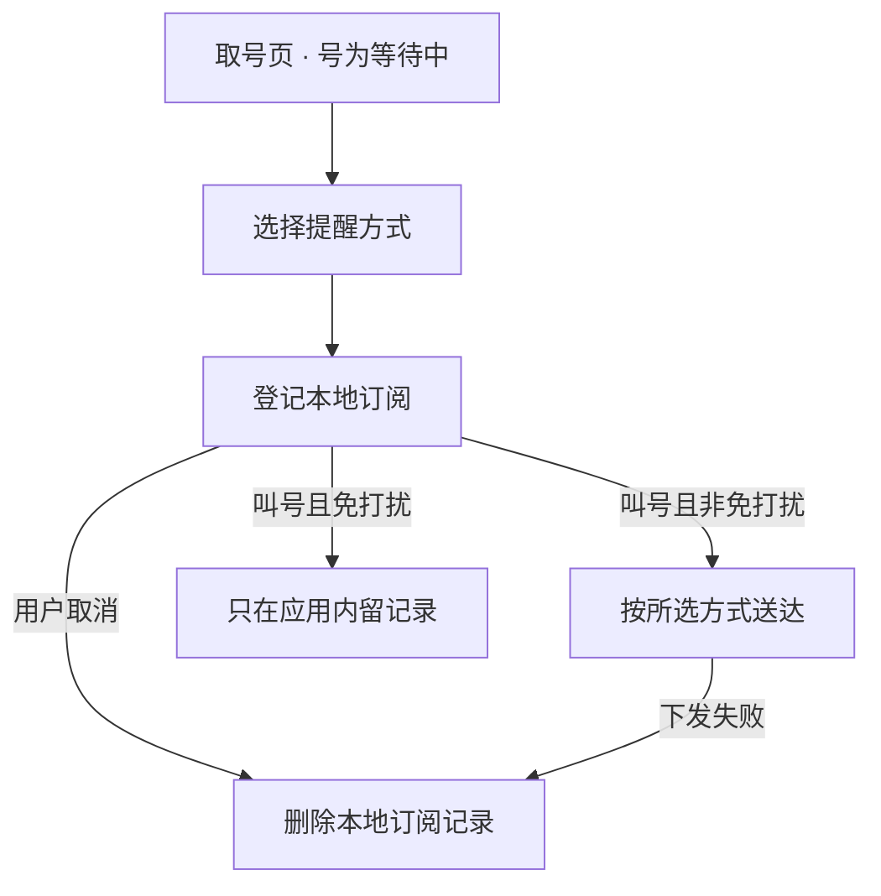

# 门店排队叫号提醒（QUE-2007）

## 背景

用户在门店取号后常常要离开等候区办别的事。现在他只能自己盯着叫号屏，或者反复回到店里确认，
回来晚了号就作废，只能重新取号排到队尾。

受影响的是所有取号后需要离开的到店用户，业务上表现为过号重取，门店的实际服务效率被拉低。

本需求让用户订阅这一号的叫号提醒，被叫到时收到通知。成功与否看两件事：等待中的号能不能订阅，
以及被叫到时提醒是否按用户选择的方式送达。

## 术语

| 术语 | 含义 |
|---|---|
| 号 | 用户在门店取到的排队凭据；排队服务上的状态为等待中、已办理或已过号 |
| 订阅 | 用户对某一个号登记的提醒意向，被叫到时触发一次提醒 |
| 夜间免打扰 | 用户设定的时段，其间不推送提醒，只在应用内留记录 |

容易混的是「订阅」与「提醒」：订阅是用户事先登记的意向，一个号只登记一次；
提醒是叫号发生时的一次送达动作，可能因为免打扰而不推送。

## 范围

整个需求不做跨门店的排队查询，也不做多个号一起订阅——用户一次只订阅当前这一个号。

### 特性分工

本部件承担取号页的订阅入口、方式选择与本地订阅记录。号的状态由排队服务提供，
本部件不本地推算叫号顺序。

### 依赖的既有能力

提醒依赖端侧已有的通知能力与短信通道，不新增系统权限；号的状态来自取号页已有的查询接口。
这些能力都是现成的，没有阻塞本部件的外部依赖，也不需要与其它特性对齐排期。

### 交接约定

排队服务保证号的状态在查询接口上稳定可取；本部件不缓存号的状态，每次进入取号页都重新查询。

## 业务方案

### 参与方与分工

| 参与方 | 输入 | 输出 | 失败影响 |
|---|---|---|---|
| 门店客户端 | 用户选择的提醒方式 | 本地订阅记录与一次提醒 | 用户收不到提醒，可重新订阅 |
| 排队服务 | 号标识 | 号的状态与叫号事件 | 无法判断能否订阅，页面提示稍后再试 |
| 通知与短信通道 | 提醒内容 | 送达结果 | 提醒未送达，本地记录清除，用户可再订阅 |

业务结果以排队服务返回的号状态为准：能不能订阅由那份状态决定，不由本地缓存决定。

关键取舍是**按号订阅而不是按门店常驻订阅**。常驻订阅的方案被否，原因是它要求长期保存用户与门店的
关联，而简报只描述了当前这一个号的提醒，没有跨次留存的要求。按号订阅的代价是每次到店都要
重新订阅一次，这一点用取号后直接展示订阅入口来抵消。

风险在这里成表，别的章不重复：

| 风险 | 触发条件 | 影响 | 已有控制 |
|---|---|---|---|
| 提醒送达延迟 | 通道排队 | 用户仍然过号 | 应用内同时留一条记录，回到应用可查 |
| 本地订阅记录残留 | 用户取消或下发失败 | 状态与事实不符 | 取消与失败都立即删除本地记录 |

## 业务流程

### 从取号到提醒送达

用户在等待中的号上点击订阅入口，选择应用内通知或短信，客户端查询号的状态并登记本地订阅记录；
叫号发生时按所选方式送达，处于夜间免打扰时段则不推送、只在应用内留记录。

订阅任务的状态从空闲进入已订阅，送达后转为已提醒；用户取消进入取消态，下发失败进入错误态。
取消态与错误态都不再重试。

## 功能说明

### 取号页订阅入口

只有等待中的号展示订阅入口。已办理与已过号不展示——它们的叫号已经发生或不会再发生，
订阅了也不会有提醒。

订阅入口在取号页的位置、已订阅与已提醒两种状态下的呈现差别、免打扰生效时的提示位置，
都以产品给的界面图为准。

### 提醒方式与免打扰

用户在订阅前选择应用内通知或短信。夜间免打扰生效时，叫号只在应用内留记录，不推送；
不在免打扰时段时按所选方式送达。方式在订阅前确定，订阅后要改只能取消重订。

### 页面状态

已订阅展示取消入口，用户可以主动取消，取消后本地订阅记录删除、回到可再次订阅的状态；
已提醒展示查看记录入口；下发失败时提示可以重新订阅。失败分类只进埋点，不展示给用户。

## 异常与恢复

| 异常 | 系统行为 | 用户可见结果 | 业务结果 | 恢复方式 |
|---|---|---|---|---|
| 号状态查询失败 | 不登记订阅 | 提示稍后再试 | 未订阅 | 用户重试 |
| 提醒下发失败 | 删除本地订阅记录，不重试 | 提示可以重新订阅 | 未收到提醒 | 用户重新订阅 |
| 埋点上报失败 | 不影响本次订阅与提醒 | 无 | 订阅照常成立 | 无需恢复 |

真正的异常与两种**设计内受限**不同：已办理与已过号没有订阅入口、用户主动取消订阅，
这两件都写在功能说明里。

## 验收

完整需求算完成的标志是：等待中的号能订阅并按所选方式收到提醒，免打扰时段不推送，
已办理与已过号没有入口且取消与失败都不留下本地记录。

| 编号 | 场景 | 可观察通过条件 | 主责 |
|---|---|---|---|
| QUEUE-001 | 等待中的号订阅提醒 | 应用内通知与短信两种方式均能在叫号时送达 | 门店客户端 |
| QUEUE-002 | 夜间免打扰 | 免打扰时段内不推送，应用内可查到叫号记录 | 门店客户端 |
| QUEUE-003 | 受限与失败路径 | 已办理与已过号无入口；取消或下发失败后本地订阅记录不存在 | 门店客户端 |

质量指标只有一条：叫号发生后提醒在数秒内发出。简报已注明它是工程设定，不是上游约束。

## 交付与上线

真实依赖只有取号页已有的查询接口与既有通知通道，无需与其他特性联调。本需求不新增远程开关，
沿用取号页现有的兼容范围与中英文资源，因此没有单独的开放顺序；界面文案沿用现有资源，
没有面向用户的资料或帮助文档要交付。

观察方式是三个订阅事件：开始、成功、失败。事件只带门店编号、订阅方式与失败分类，不带手机号——
简报对这一条有明文要求。

### 回退设计

出现问题时隐藏取号页的订阅入口即可回退——订阅记录只存在于端侧，入口隐藏之后不再产生新的记录，
已有的记录仍按原规则处置（取消与下发失败删除，叫号送达后保留），不留下需要清理的服务端状态。

## 附录

### 接口

| 接口 | 用途 | 失败语义 |
|---|---|---|
| GET /queue/tickets/{ticketId} | 取号的状态，判断能否订阅 | 失败不登记订阅，提示稍后再试 |

### 数据、配置与事件

| 类型 | 标识 | 完整约定 |
|---|---|---|
| 本地记录 | queue_sub_local | 订阅意向的端侧落点；取消与下发失败时删除，叫号送达后转为已提醒并保留，供用户回到应用查看这次叫号 |
| 配置 | quietHours | 夜间免打扰时段；其间不推送，只在应用内留记录 |
| 事件 | queue_sub_start | 订阅开始；带门店编号与方式 |
| 事件 | queue_sub_success | 订阅成功；带门店编号与方式 |
| 事件 | queue_sub_fail | 订阅失败；带门店编号、方式与失败分类 |

### 改动边界

- 不涉及：本需求只在取号页新增订阅入口与本地记录，不改排队与叫号本身。

### 规约判定

| 规约 | 命中 | 依据 |
|---|---|---|
| 敏感信息不落盘 | 命中 | 本地订阅记录不含手机号；取消与下发失败时删除，叫号送达后转为已提醒保留，不进业务存储 |
| 埋点不带敏感字段 | 命中 | 三个事件只带门店编号、方式与失败分类 |

### 材料清单

- 需求简报——产品提供的排队提醒简报：现状与问题、订阅条件、提醒方式与免打扰、状态与清理约定、三条验收意图。原文：[RR/prd.md](../RR/prd.md)
- 取号页界面图——随简报附的界面图：订阅入口的位置、两种状态下的呈现差别、免打扰提示的位置。原文：[assets/queue-entry.png](../assets/queue-entry.png)
