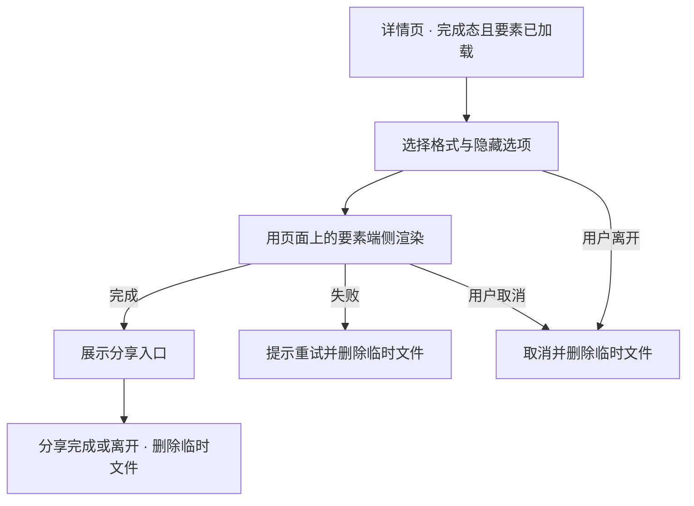

# 交易凭证下载（RCPT-1001）

## 背景

用户完成一笔交易后，常常需要把这笔交易的凭据留存下来：报销要交给财务，纠纷时要提供给客服，
个人记账也需要一份可以离线查看的记录。现在他只能在交易详情页截图，截图里既没有完整的交易要素，
也带着与凭据无关的界面元素，财务经常要求重新提供。

受影响的是所有需要留存交易记录的个人用户，业务上表现为客服重复答复「请提供正式凭据」，
而钱包侧一直给不出。

本需求让用户在交易详情页直接得到一份规整的凭证文件，成功与否看两件事：完成态交易能不能拿到凭证，
以及拿到的凭证与详情页所列的交易要素是否一致。

## 术语

| 术语 | 含义 |
|---|---|
| 凭证 | 由交易详情要素渲染出的一份可分享文件，格式为 PDF 或 PNG |
| 完成态交易 | 结果不再变化的交易，交易服务上的状态为 COMPLETED |
| 对方账号隐藏 | 渲染凭证时把对方账号中间若干位替换为掩码，只保留可辨识的首尾 |

容易混的是「凭证」与「交易详情」：详情是页面上可以继续操作的视图，随交易状态变化；
凭证是某一时刻的定格文件，生成之后不再更新。

## 范围

整个需求不做凭证的云端归档，也不做批量导出——用户一次只对一笔交易生成凭证。

### 特性分工

本部件承担交易详情页的凭证入口、格式与隐藏选项的选择、端侧渲染与分享。
交易要素由交易域提供，本部件不重新计算金额与手续费。

### 依赖的既有能力

渲染依赖端侧已有的文件写入与分享能力，不新增系统权限；交易要素来自交易详情已有的查询接口。
这些能力都是现成的，没有阻塞本部件的外部依赖，也不需要与其它特性对齐排期。

### 交接约定

交易域保证完成态交易的要素在详情页查询接口上稳定可取。凭证用的是**详情页当前展示的那份要素**，
生成时不再额外请求，也不另存一份——所以详情页已经打开之后，无网络同样能生成凭证；
要素尚未加载完成时不展示凭证入口。

## 业务方案

### 参与方与分工

| 参与方 | 输入 | 输出 | 失败影响 |
|---|---|---|---|
| 钱包客户端 | 用户选择的格式与隐藏选项 | 凭证文件与分享动作 | 用户拿不到凭证，可重试 |
| 交易服务 | 交易标识 | 详情页的交易要素 | 详情页取不到要素，凭证入口不展示 |
| 系统分享组件 | 凭证文件 | 分享结果 | 文件已生成但未送出，用户可再次分享 |

业务结果以交易服务返回的要素为准：凭证是那份要素的一次渲染，不引入本地推算的数值。

关键取舍是**端侧渲染而不是服务端生成**。服务端生成的方案被否，原因是它每次生成都要再上传
一次交易信息——而用户提出这项需求的场景里，有相当一部分正是不愿意把交易信息传出去。
端侧渲染的代价是设备差异会带来排版细节差异，简报里定的固定版式与内置字体就是为了压住它。

风险在这里成表，别的章不重复：

| 风险 | 触发条件 | 影响 | 已有控制 |
|---|---|---|---|
| 渲染耗时长 | 要素较多 | 用户等待中离开 | 渲染期间可取消，离开即取消 |
| 临时文件残留 | 渲染失败或用户离开 | 占用存储 | 失败与取消都立即删除临时文件 |

## 业务流程

### 从入口到文件送出

用户在完成态交易的详情页点击凭证入口，选择格式与是否隐藏对方账号，客户端用页面当前已加载的
交易要素在本地渲染，渲染成功后展示分享入口，分享完成或用户离开页面时删除临时文件。
整个过程不再访问网络，所以断网时只要详情页已经打开就能生成。

渲染任务的状态从空闲进入渲染中，成功转为就绪；失败进入错误态，用户离开页面进入取消态。
错误态与取消态都不展示分享入口。

## 功能说明

### 详情页凭证入口

只有完成态交易展示凭证入口。待处理与失败的交易不展示——它们的结果还可能变化，
定格出来的凭证会与后来的事实矛盾。

凭证的版式以产品给的界面图为准——页眉是交易结果与时间，中部是要素清单，页脚是凭据编号与
生成时间；隐藏对方账号时掩码落在要素清单里那一行。

### 格式与隐藏选项

用户在生成前选择 PDF 或 PNG，并决定是否隐藏对方账号。隐藏生效时，凭证上的对方账号只保留首尾，
中间以掩码代替；不隐藏时与详情页所见一致。两个选项都在生成前确定，生成后要改只能重新生成。

### 页面状态

详情页要素还没加载完时凭证入口不出现——入口出现即意味着渲染所需的要素已经在手上。
渲染中展示进度并允许取消；就绪展示分享入口；渲染失败时提示可以重试，用户可以重新发起
或换一种格式。失败分类只进埋点，不展示给用户。取消与失败都回到入口可再次发起的状态。

## 异常与恢复

| 异常 | 系统行为 | 用户可见结果 | 业务结果 | 恢复方式 |
|---|---|---|---|---|
| 渲染失败 | 删除临时文件，不展示分享入口 | 提示可以重试 | 未生成凭证 | 用户重试或换一种格式 |
| 用户中途离开 | 取消渲染并删除临时文件 | 无 | 未生成凭证 | 重新进入详情页发起 |
| 埋点上报失败 | 不影响本次渲染与分享 | 无 | 凭证照常生成 | 无需恢复 |

真正的异常与两种**设计内受限**不同：非完成态没有入口、详情页要素还没加载完时入口不出现，
这两件都写在功能说明里。

## 验收

完整需求算完成的标志是：完成态交易能生成与详情一致的凭证，隐藏选项生效，
非完成态交易没有入口且失败与离开都不留下文件。

| 编号 | 场景 | 可观察通过条件 | 主责 |
|---|---|---|---|
| RECEIPT-001 | 完成态交易生成凭证 | 选择 PDF 或 PNG 均生成成功，凭证要素与详情页一致 | 钱包客户端 |
| RECEIPT-002 | 隐藏对方账号 | 开启隐藏后凭证上的对方账号中间为掩码，不出现完整账号 | 钱包客户端 |
| RECEIPT-003 | 非完成态与失败路径 | 待处理与失败交易无入口；渲染失败或离开后临时文件不存在、无分享入口 | 钱包客户端 |

质量指标只有一条：常见要素规模下渲染在数秒内完成。简报已注明它是工程设定，不是上游约束。

## 交付与上线

真实依赖只有交易详情已有的查询接口，无需与其他特性联调。本需求不新增远程开关，
沿用交易详情页现有的兼容范围与中英文资源，因此没有单独的开放顺序；界面文案沿用现有资源，
没有面向用户的资料或帮助文档要交付。

观察方式是三个渲染事件：开始、成功、失败。事件只带不可逆的交易摘要、所选格式与失败分类。

### 回退设计

出现问题时隐藏详情页的凭证入口即可回退——凭证是端侧一次性生成的文件，不写业务数据，
入口隐藏之后不留下任何需要清理的状态。

## 附录

### 接口

| 接口 | 用途 | 失败语义 |
|---|---|---|
| GET /wallet/transactions/{transactionId} | 详情页取交易要素；凭证复用页面上这一份，不再另发请求 | 详情页取不到要素时凭证入口不展示 |

### 数据、配置与事件

| 类型 | 标识 | 完整约定 |
|---|---|---|
| 临时文件 | wallet_receipt_temp | 渲染产物的临时落点；失败、取消、分享完成与离开页面时删除 |
| 事件 | receipt_render_start | 渲染开始；带不可逆交易摘要与格式 |
| 事件 | receipt_render_success | 渲染成功；带不可逆交易摘要与格式 |
| 事件 | receipt_render_fail | 渲染失败；带不可逆交易摘要、格式与失败分类 |

### 改动边界

- 不涉及：本需求只在交易详情页新增入口与渲染，不改交易查询与清算。

### 规约判定

| 规约 | 命中 | 依据 |
|---|---|---|
| 敏感信息不落盘 | 命中 | 临时文件只在生成到分享或离开之间存在，四种时机删除；账号是否掩码由用户在生成前选择，不隐藏时与详情页所见一致，凭证不扩大已可见的信息范围 |
| 埋点不带敏感字段 | 命中 | 三个事件只带不可逆摘要、格式与失败分类 |

### 材料清单

- 需求简报——产品提供的凭证下载简报：现状与问题、入口条件、格式与隐藏选项、状态与清理约定、三条验收意图。原文：[RR/prd.md](../RR/prd.md)
- 凭证预览界面图——随简报附的界面图：凭证的三段版式与掩码在版式中的位置。原文：[assets/receipt-preview.png](../assets/receipt-preview.png)
