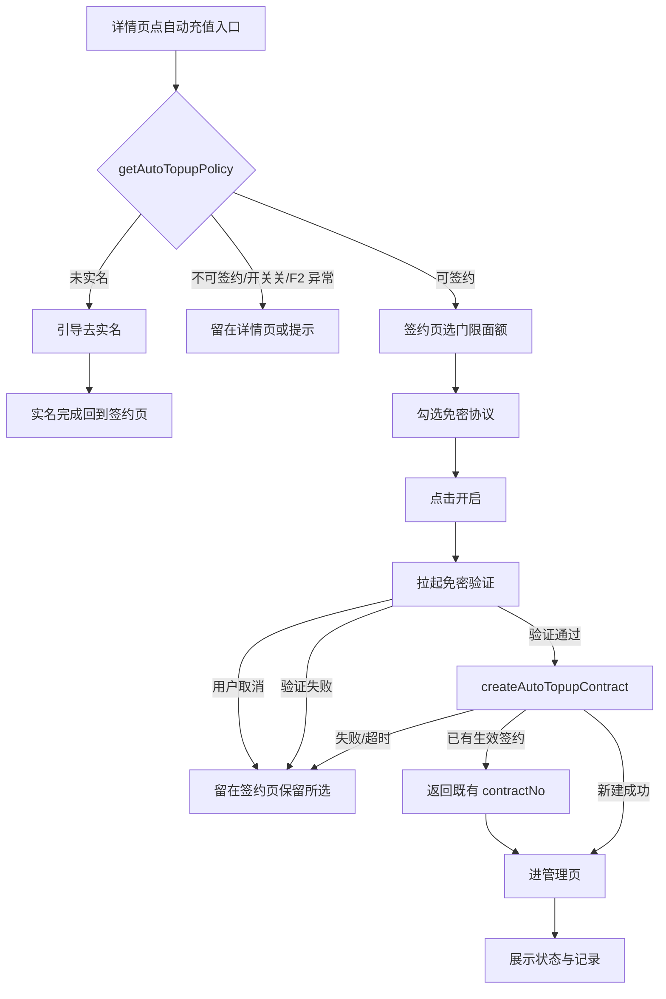
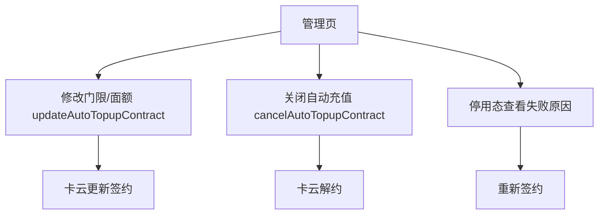

# 交通卡自动充值 — 需求规格（Spec）

> **模块标识**: `AR90006`
> **版本**: v1.0
> **创建日期**: 2026-09-25
> **最后更新**: 2026-09-25
> **状态**: 草稿

---

## 0. 术语映射表

> 所有原始需求业务名词映射到 `doc/module-catalog.yaml` 真实存在模块；全部「用户确认」列已人工逐条确认。

| 原始术语 | 权威模块 | 所属层 | 置信度（high / medium / low） | 易混项（必读） | 用户确认 | 解释 |
|---|---|---|---|---|---|---|
| 交通卡自动充值（自动充值） | WalletMain | 02-Feature | high | 钱包主功能 — 自动充值页/签约页是交通卡详情页派生页，属本 feature 新页面 | [x] | 本需求的核心功能，端侧承载入口、签约交互与状态展示 |
| 签约页 / 管理页 | WalletMain | 02-Feature | medium | 钱包主功能/卡包 — 与卡包（只读卡列表）不同，自动充值签约与管理是交通卡的可写操作页 | [x] | 两个新页面：签约页（门限面额、协议、开启）、管理页（状态、记录、修改、关闭） |
| 交通卡详情页 | WalletMain | 02-Feature | high | 卡包 — 详情页展示单卡信息，「自动充值」入口位于余额下、记录上 | [x] | 自动充值入口所在页面 |
| 脱敏 | CommFunc | 05-SystemBase | high | 账号管理 — 卡号脱敏是纯算法（MaskUtil），非账号会话 | [x] | 记录中的卡号按 MaskUtil 脱敏展示 |
| 未实名 / 实名引导 | AccountManager | 04-BusinessBase | medium | 未登录 — 实名是账号能力提供的结果；未实名用户点入口被引导去实名，二者不同（实名 ≠ 登录态） | [x] | 账号能力返回是否实名，未实名引导去实名 |
| 免密协议 / 免密验证 | WalletMain | 02-Feature | medium | 对外接口 — 端侧拉起支付部件验证并获取协议号，钱包不实现支付验证逻辑；建档需用户当场确认 | [x] | 免密扣款授权，由支付能力拉起，钱包透传 agreementNo |
| 停用（连续失败停用） | WalletMain | 02-Feature | low | 钱包主功能 — 云侧停用签约，端侧展示停用态与失败原因 | [x] | 连续 3 次扣款失败（上游约束：产品需求。产品规则）后云侧停用，管理页展示 |

---

## 1. 功能概述

让交通卡用户一次签约后，余额（以服务端记录为准）低于自己设定的门限时由系统自动完成充值，把「想起来充值」从用户身上移走。钱包端承担签约入口、门限/面额选择、免密协议确认、创建/修改/关闭签约与状态/记录展示；判定与扣款全部在服务端，端侧不存在「发起自动充值」的动作。

---

## Scope 声明

### Scope 模块清单

| 字段 | 取值 | 说明 |
|------|------|------|
| 本需求允许修改的模块 | `WalletMain` | 详情页入口、签约页、管理页三个新页面；状态/策略/契约相关的 Repository、领域模型、配置常量、index.ets 新增导出 |
| 本需求明确不修改的模块 | `Phone`（仅宿主注册新路由，不加模块级实现）、`AccountManager`、`CommUI`、`CommFunc` | 账号能力、公共组件、通用工具仅消费不改 |

### Scope 结构化字段（供 Spec 提取，必填）

```yaml
in_scope_modules:
  - WalletMain
out_of_scope_modules:
  - Phone
  - AccountManager
  - CommUI
  - CommFunc
rationale: |
  自动充值端侧能力（入口、签约、管理、状态查询与缓存）全部落在交通卡 feature，由 WalletMain 承载新增页面与数据层；
  Phone 只负责在宿主 navDestinationMap 注册新页面路由名（属既存装配面，不新增模块级实现）；
  AccountManager（实名结果）与 CommUI/CommFunc（Toast/组件/脱敏/日志/导航上下文）均即用不改；
  卡云/支付/运营台为服务端或外部能力，接口为外来契约，不属本部件。
  若未来需要把公共能力（如自动充值通用状态组件）提入 CommUI/CommFunc 公共层，须先发起 scope 扩展提议经用户确认。
```

### Visual Handoff（视觉交接，供 check-spec 读取）

```yaml
ui_change: new_or_changed
visual_handoff:
  kind: repo_assets
  authoritative_refs:
    - id: detail_entry
      path: doc/features/AR90006/ux-reference/交通卡详情页自动充值入口.png
    - id: signup_page
      path: doc/features/AR90006/ux-reference/自动充值签约页.png
    - id: verify_page
      path: doc/features/AR90006/ux-reference/免密验证页.png
    - id: manage_page
      path: doc/features/AR90006/ux-reference/自动充值管理页.png
    - id: disabled_state
      path: doc/features/AR90006/ux-reference/自动充值停用态.png
fidelity_target: semantic_layout
asset_acquisition_mode: approximate
```

### 最小改动原则

1. **默认就地实现**：所有逻辑优先实现在 `in_scope_modules` 列出的 `WalletMain` 内。
2. **禁止默默扩展**：若 plan/3 发现"需要在公共模块新增接口或能力"，必须停下来生成 scope 扩展提议给用户确认。
3. **公共能力优先复用**：脱敏用 `CommFunc.MaskUtil`、日志用 `CommFunc.Logger`、导航用 `CommFunc.NavPathContext`、UI 反馈用 `CommUI.showToast`，不新增公共接口。

---

## 2. 目标用户与使用场景

### 2.1 目标用户

| 用户角色 | 描述 |
|----------|------|
| 交通卡持卡用户（已实名） | 经常在闸机前才发现余额不足、希望自动补足余额的用户 |
| 交通卡持卡用户（未实名） | 通过实名引导完成实名后可签约的用户 |

### 2.2 使用场景

| 场景编号 | 场景名称 | 场景描述 | 前置条件 |
|----------|----------|----------|----------|
| S1 | 发起签约 | 用户在交通卡详情页点「自动充值」→ 选择门限与面额、勾选免密协议 → 开启 → 免密验证 → 签约建立 | 已实名、无生效签约、功能开关开启 |
| S2 | 修改门限/面额 | 已签约用户在管理页修改门限或面额，原签约关系不断 | 已有生效签约 |
| S3 | 关闭自动充值 | 已签约用户关闭自动充值，不再触发扣款 | 已有生效签约 |
| S4 | 查看管理页 | 用户进入管理页看到当前签约状态与最近自动充值记录（含失败原因、卡号脱敏） | 已有生效签约 |
| S5 | 已签约再进入 | 已签约卡再点详情页入口，直接进管理页而非重新签约 | 已有生效签约 |
| S6 | 未实名引导 | 未实名用户点入口，被引导去实名；实名完成后回到签约页，此前选择仍在 | 未实名 |
| S7 | 停用后处理 | 连续 3 次扣款失败（上游约束：产品需求。产品规则）云侧停用，用户打开管理页看到停用状态与失败原因，可重新签约 | 签约被停用 |

---

## 3. 功能清单

| 编号 | 功能名称 | 优先级 | 描述 | 关联场景 |
|------|----------|--------|------|----------|
| F1 | 详情页「自动充值」入口 | P0 | 交通卡详情页余额行之下、充值记录之上显示一整行入口；入口显示条件：未实名可见（点进引导实名）、已签约直进管理页、功能开关关闭只隐藏新签约入口且对已签约用户不隐藏 | S1, S5, S6 |
| F2 | 策略状态查询 `getAutoTopupPolicy` | P0 | 进入签约页/详情页查询可签约性、门限档位(5/10/20/30 元)、面额档位(20/50/100 元)、单日限额(200 元)与协议文案；未实名或不可签约时不拉起免密协议 | S1, S6 |
| F3 | 签约页 | P0 | 门限与面额均为单选；免密协议勾选后「开启」才可点击；点击开启拉起支付认证；失败/取消保留已选门限面额，可直接重试 | S1 |
| F4 | 免密验证与创建签约 `createAutoTopupContract` | P0 | 拉支付部件完成免密验证拿到 agreementNo ↓ 调卡云创建签约（账号、卡片、agreementNo、门限、面额）；同卡已有生效签约返回既有 contractNo（转管理页） | S1 |
| F5 | 签约状态查询 `getAutoTopupStatus` | P0 | 查询签约状态、当前门限面额、最近记录、连续失败次数与停用状态 | S4 |
| F6 | 管理页 | P0 | 顶部当前签约状态（含停用横幅与失败原因），下方最近的自动充值记录，失败记录展示失败原因，记录卡号按规则脱敏 | S4, S7 |
| F7 | 修改签约 `updateAutoTopupContract` | P1 | 修改门限或面额，原签约关系不断、不需解约重签；只改门限不动面额不需重新验证；调高面额验证行为待定（课题 T2） | S2 |
| F8 | 关闭自动充值 `cancelAutoTopupContract` | P1 | 解除后不回滚进行中的订单、不撤销已完成订单 | S3 |
| F9 | 本件缓存 `wallet_auto_topup_contract` | P1 | 缓存 contractNo、门限、面额与状态，仅免网展示；按账号隔离、退出登录清除、不参与备份恢复；缓存缺失以云侧查询为准 | S4 |
| F10 | 端侧事件记录 | P1 | 只记录去标识账号、卡片类型、阶段与结果分类；上报失败不改变业务结果 | S1-S7 |

---

## 4. 页面/界面描述

四个页面承接上游界面示意图（图 1 详情页入口、图 2 签约页、图 3 免密验证页、图 4 管理页、图 5 停用态），视觉沿用交通卡详情页现有列表样式，不新增控件类型。

### 4.1 页面总览

```
┌─────────────────────────────┐
│   交通卡详情页（既有）         │
│   余额行                    │
│   自动充值入口（一整行）      │ ← F1
│   充值记录                  │
└─────────────────────────────┘

┌─────────────────────────────┐
│   自动充值签约页（F3）        │
│   门限 单选(5/10/20/30 元)    │
│   面额 单选(20/50/100 元)     │
│   免密协议文案 + 勾选        │
│   [开启]（勾选后才可点）      │
└─────────────────────────────┘

┌─────────────────────────────┐
│   免密验证页（F4，支付拉起）   │  ← 外部能力，本部件展示结果
│   单笔额度说明              │
└─────────────────────────────┘

┌─────────────────────────────┐
│   自动充值管理页（F6）        │
│   顶部当前签约状态           │
│   最近充值记录（卡号脱敏）    │
│   返回                      │
└─────────────────────────────┘
┌─ 停用态：顶部换停用横幅 + 失败原因（F6/F7）─┐
```

### 4.2 UI 组件详细描述

#### 区域 1: 交通卡详情页自动充值入口（F1）

| 组件 | 类型 | 内容/数据 | 交互行为 |
|------|------|-----------|----------|
| 自动充值入口行 | 列表行（列表项） | 文案「自动充值」（语义图标可复用 chevron_right） | 点击后按签约状态分支：未实名→引导实名；已签约→进管理页；未签约→进签约页 |
| 入口显示控制 | 逻辑条件 | 基于 getAutoTopupPolicy（开关、实名、签约状态） | 开关关闭时隐藏新签约入口；已签约用户不受开关关闭影响，入口始终可见直进管理页 |

#### 区域 2: 自动充值签约页（F3）

| 组件 | 类型 | 内容/数据 | 交互行为 |
|------|------|-----------|----------|
| 触发门限单选组 | 单选组（logic_condition） | 5元 / 10元 / 20元 / 30元 | 单选；选中即暂存 |
| 单笔面额单选组 | 单选组（logic_condition） | 20元 / 50元 / 100元 | 单选；选中即暂存 |
| 免密协议文案 | 内容展示 | 协议全文（注明单日最多充值 200 元） | 只读展示；勾选状态 |
| 协议勾选 | 勾选框（action_button） | 勾选态 | 勾选后「开启」按钮才可点击 |
| 开启按钮 | 主按钮（action_button） | 「开启」 | 门限、面额、勾选齐备才可点；点击拉起支付认证 |

#### 区域 3: 免密验证页（F4，支付能力拉起）

| 组件 | 类型 | 内容/数据 | 交互行为 |
|------|------|-----------|----------|
| 单笔额度说明 | 内容展示 | 免密单笔额度随所选面额设置 | 只读展示，说明本次免密扣款额度 |
| 确认（支付侧） | 按钮（外部） | 由支付部件提供 | 用户当场确认授权 |

#### 区域 4: 自动充值管理页（F6）

| 组件 | 类型 | 内容/数据 | 交互行为 |
|------|------|-----------|----------|
| 顶部签约状态 | 内容展示 | 当前状态（开启中 / 停用中）、当前门限与面额 | 停用态换停用横幅并给失败原因 |
| 最近充值记录 | 列表 | 自动充值记录，卡号按 MaskUtil 规则脱敏 | 只读；失败记录展示失败原因 |
| 修改门限/面额入口 | 列表行 | 「修改门限或面额」 | 进入修改（update 接口） |
| 关闭自动充值入口 | 列表行 | 「关闭自动充值」 | 确认后调 cancel 解约 |

#### 区域 5: 停用态（F7 相关展示）

| 组件 | 类型 | 内容/数据 | 交互行为 |
|------|------|-----------|----------|
| 停用横幅 | 内容展示 | 停用状态 + 失败原因 | 只读展示；提供重新签约入口 |

### 4.3 页面状态

| 状态 | 描述 | 触发条件 |
|------|------|----------|
| 签约页-默认状态 | 门限/面额无选中、协议未勾、开启按钮不可点；若有暂存则回填 | 首次进入 / 上次未完成暂存回填 |
| 签约页-验证中 | 拉起支付验证 | 点击开启 |
| 签约页-验证失败/取消 | 保留已选门限面额，可重试 | 支付取消或验证未通过 |
| 管理页-开启中 | 顶部显示当前门限面额，下方记录 | getAutoTopupStatus 返回开启 |
| 管理页-停用中 | 顶部停用横幅 + 失败原因 | 连续 3 次扣款失败（上游约束：产品需求。产品规则）云侧停用 |
| 管理页-空记录 | 无最近记录展示 | 尚无自动充值记录 |
| 管理页-缓存缺失 | 以云侧查询结果展示 | 本件缓存被清除或首次 |
| 入口-开关关闭 | 未签约用户不可见入口；已签约用户仍可见 | 运营侧关闭功能开关 |

---

## 5. 业务流程图

### 5.1 核心业务流（主路径）



### 5.2 子流程：管理路径



---

## 6. 异常/边界场景处理

| 编号 | 异常场景 | 触发条件 | 处理方式 | 用户提示 |
|------|----------|----------|----------|----------|
| E1 | 未实名进入 | getAutoTopupPolicy 返回不可签约（未实名） | 引导去实名；实名完成回到签约页，此前选择仍在 | 「请先完成实名认证」+ 引导实名按钮 |
| E2 | 免密验证取消/失败 | 支付侧用户取消或验证失败 | 不创建签约，留在签约页，已选门限面额保留，可直接重试 | 留在页面 + 保留所选 |
| E3 | 创建签约失败/超时 | createAutoTopupContract 失败或超时 | 处理方式待定（课题 T6）：当前不实现协议号复用重试，返回签约页让用户重新发起 | 回到签约页 |
| E4 | 已有生效签约 | create 返回既有 contractNo | 不重复建档，转管理页改门限/面额或关闭 | 进入管理页 |
| E5 | 单日达到上限 | 当日自动充值已达单日上限 200 元 | 当日不再触发、不计入连续失败；次日零点恢复 | 记录中可见 |
| E6 | 连续失败停用 | 连续 3 次扣款失败（上游约束：产品需求。产品规则） | 云侧停用签约；管理页展示停用状态与失败原因；需重新签约 | 停用横幅 + 原因 |
| E7 | 扣款成功但写卡未完成 | 订单保持「充值中」 | 卡云下次读卡补写；端侧不提供重试也不重复下单 | 订单保持充值中 |
| E8 | 功能开关关闭 | 运营关闭签约入口或配置不可用 | 新用户看不到入口；已签约用户入口不隐藏、自动充值照常；支付能力不可用时隐藏新签约入口 | 未签约用户不显示入口 |
| E9 | 网络异常 | 策略/状态查询或签约操作失败 | 通用失败兜底，提示稍后重试；本件缓存缺失时以云侧查询为准 | 通用错误提示 |
| E10 | 缓存/数据清除 | 用户清除应用缓存或数据 | 缓存为可重建数据：清除后进管理页重查云侧自恢复，不崩溃不死循环；退出登录同步清除 | 正常回到管理页展示 |
| E11 | 重复点击开启 | 用户在签约页快速重复点击开启 | 开启按钮防抖防重入，一次点击只发一次 create；接口幂等由服务端保证（已有签约返回既有 contractNo） | 无重复弹窗/重复请求 |

---

## 7. 非功能性需求

### 7.1 性能要求

| 指标 | 要求 | 说明 |
|------|------|------|
| 签约/查询接口调用频次 | 用户动作驱动，同一会话单次 | 无定时任务、无后台轮询、无开机启动调用；进入签约页/管理页仅一次策略/状态查询，免网展示走本地缓存（上游约束：系统设计失败与恢复、数据保护两章） |
| 页面首屏加载 | 进入签约页/管理页 ≤ 2 秒 | 依赖单次接口返回；本工程性能基线补全前属工程设定值（本工程设定，无上游依据） |
| 交互响应 | 点击开启到拉起验证 ≤ 300ms | 本地表单校验与按钮态切换（本工程设定，无上游依据） |

### 7.2 兼容性要求

| 维度 | 要求 |
|------|------|
| 系统版本 | 与现有交通卡详情页一致（沿用当前最低支持版本） |
| 设备类型 | 手机（同现有 WalletMain 页面） |
| 屏幕适配 | 签约页/管理页为单页纵向布局，适配不同分辨率（同既有列表页规范） |
| RTL | 方向性参数用 start/end（UX-01） |

### 7.3 安全性要求

| 要求 | 说明 |
|------|------|
| 敏感字段脱敏 | 记录展示中的卡号按 `CommFunc.MaskUtil` 规则脱敏；脱敏在模型/数据出口做，不靠视图层过滤 |
| agreementNo 不持久化 | 免密协议号只透传给卡云，不在钱包落盘 |
| 端侧事件去标识 | 只记录去标识账号、卡片类型、阶段与结果分类，不记录卡号、金额明细、支付参数 |
| 缓存隔离 | `wallet_auto_topup_contract` 按账号隔离，退出登录清除，不参与备份恢复 |
| 免密授权当场确认 | 签约前必须由用户本人当场确认免密授权，钱包拿到验证结果才调 create |

---

## 8. 验收标准

### P0 功能验收标准

- [ ] **AC-1** (AC-R1, F1, F2): 未实名用户看到入口、点进被引导去实名；实名完成后回到签约页且此前选择仍在，可继续签约（口径按会议修正）
- [ ] **AC-2** (AC-R2, F2, F5, F6): 签约成功后余额低于门限时，用户不做任何操作即可完成充值，并能在管理页记录里看到这笔
- [ ] **AC-3** (AC-R3, F6): 扣款连续失败三次后自动停用，用户打开管理页能看到停用状态与失败原因，可重新签约
- [ ] **AC-4** (AC-R4, F1): 功能开关关闭后新用户看不到签约入口；已签约用户仍能看到入口进管理页，自动充值照常发生
- [ ] **AC-5** (AC-R5, F6): 充值记录中的卡号按现有规则脱敏展示
- [ ] **AC-7** (AC-R7, F3, F4): 用户在支付验证界面取消，回到签约页时刚才选的门限与面额仍在，可直接再次开启
- [ ] **AC-8** (AC-R8, F1, F2): 未实名用户被引导去实名，完成后回到签约页，此前选择仍在，可继续签约
- [ ] **AC-9** (AC-R9, F1, F4): 已有生效签约的卡再点入口，进入的是管理页而不是重新签约

### P1 功能验收标准

- [ ] **AC-6** (AC-R6, F7, F8): 签约后可修改门限面额并按新值生效；关闭后不再触发自动充值（修改走 update，关闭走 cancel，均不回滚/不撤销既有订单）
- [ ] **AC-10** (F9): 本件缓存可重建，清除数据后管理页自恢复，退出登录清除缓存
- [ ] **AC-11** (F10): 端侧事件记录只含去标识账号、卡片类型、阶段与结果分类，上报失败不改变业务结果

### 通用验收标准

- [ ] **AC-G1**: 页面在支持设备上正常显示，无布局错乱（含 RTL 镜像）
- [ ] **AC-G2**: 网络异常时有明确错误提示，不出现白屏或崩溃
- [ ] **AC-G3**: 清除数据/缓存后进管理页自恢复展示，不崩溃不死循环（ENV-01）
- [ ] **AC-G4**: 重复点击开启不产生重复弹窗或重复请求（ENV-02）
- [ ] **AC-G5**: 切阿拉伯语环境验证签约页/管理页布局镜像正确（UX-01）

---

## 9. 宿主扩展治理项

| 扩展项 | 是否涉及 | 承载位置 |
|---|---|---|
| 技术契约 | 是（走 /story） | 9.1 |
| 规约约束要求 | 是 | 9.2 |
| 设计模式候选登记 | 是 | 9.3 |
| 未决课题（调高面额重新验证 / create 失败处理） | 是 | 《决策与评审记录》T2、T6 |

### 9.1 技术契约

#### 9.1.1 端云接口

| 云侧接口 | 新增·复用·变更 | 入参 → 出参 | 错误码 | 代码现状 |
|---|---|---|---|---|
| `getAutoTopupPolicy` | 新增 | 账号、卡片 → 可签约性、门限档位[5/10/20/30元]、面额档位[20/50/100元]、单日限额[200元]、协议文案 | 无新增（通用失败码） | WalletMain data 层新建 Repository；当前无端云封装（检索 WalletMain data 层端云调用零命中，现为本地 mock） |
| `createAutoTopupContract` | 新增 | 账号、卡片、agreementNo、门限、面额 → 创建结果；同卡已有生效签约返回既有 contractNo | 不可签约 / 已有生效签约（兼容返回既有 contractNo）/ 创建失败 | 同上，新增 |
| `updateAutoTopupContract` | 新增（会议 T1 补） | contractNo、门限、面额 → 更新结果；原签约关系不断 | 签约不存在 / 更新失败 | 同上，新增 |
| `getAutoTopupStatus` | 新增 | 账号、卡片 → 签约状态、当前门限面额、最近记录、连续失败次数、停用状态 | 无新增 | 同上，新增 |
| `cancelAutoTopupContract` | 新增 | contractNo → 解约结果；不回滚进行中订单、不撤销已完成订单 | 签约不存在 / 解约失败 | 同上，新增 |

#### 9.1.2 数据存储

| 键名/表名 | 介质 | 值结构 | 有效期 | 用途 | 代码现状 |
|---|---|---|---|---|---|
| `wallet_auto_topup_contract` | localStorage/preferences | contractNo、门限、面额、状态 | 跟随登录会话（退出登录清除）；不参与备份恢复 | 免网展示已签约状态（本件缓存） | WalletMain shared 层新增 Constants 键 + 数据层读写；当前仓内无此键（检索零命中） |

#### 9.1.3 配置项

| 配置项 | 默认值 | 关闭态行为 | 历史版本兼容 | 代码现状 |
|---|---|---|---|---|
| 自动充值功能开关 | 开启 | 关闭时新签约入口隐藏，已签约用户入口与管理不受影响；支付能力不可用时隐藏新签约入口 | 旧版本无此开关概念，按开启处理 | 配置来自服务端策略返回值（getAutoTopupPolicy）或 WalletMain 常量兜底 |
| 触发门限档位 | 5/10/20/30 元 | 不可用时以策略返回为准 | — | 策略返回；本工程 demo 可预设常量 |
| 单笔面额档位 | 20/50/100 元 | 不可用时以策略返回为准 | — | 同上 |
| 单日上限 | 200 元 | 当日达上限不再触发，次日零点恢复 | — | 协议文案写明单日最多充 200 元 |
| 连续失败停用阈值 | 3 次（上游约束：产品需求。产品规则） | 连续失败停用签约，展示失败原因 | — | 云侧判断，端侧展示 |

#### 9.1.4 埋点

本需求为交通卡自动充值核心签约链路新增运维统计：观察签约是否成功、卡云建关系结果、失败分布。端侧事件按数据保护要求只记录去标识账号、卡片类型、阶段与结果分类，不记录卡号、金额明细与支付参数。现有采集能力：Charts（运维统计）与 VOC（定位）均由 `CommFunc` 统一封装；仓内当前仅模板枚举 `Wallet_COMMON`，没有流程/步骤/内码登记（检索 `WalletHAEventID` 仅有 `Wallet_COMMON`）。

##### 签约成功率

- 衡量：发起签约最终建约成功的比例。
- 怎么算：建约成功（云侧返回 contractNo）的尝试 / 全部签约尝试（含取消）。
- 每次上报带：结果分类（成功/失败/用户取消/请求失败）、去标识账号、卡片类型、失败原因（如适用）。
- 在哪打点：签约流程（策略查询、免密验证返回、创建签约三步）。

| 统计点 | 所在流程 | 业务动作 | 实际适用结果 | 本端获知时机 | 已有覆盖或新增 | 代码现状 |
|---|---|---|---|---|---|---|
| 策略查询 | 签约流程 | 查询可签约性 | 可签约 / 不可签约 / 请求失败 | getAutoTopupPolicy 响应或通信失败 | 新增 | WalletMain 事件编码待 plan 落实 |
| 免密验证返回 | 签约流程 | 用户确认/取消免密授权 | 通过 / 取消 / 失败 | 支付回调首知 | 新增 | 同上 |
| 创建签约全流程 | 签约流程 | 一次签约收敛 | 成功 / 失败 / 用户取消 | createAutoTopupContract 回调首次得知 | 新增 | 同上 |

边界：一次创建尝试只结算一次（`settle` 防重）；重试为新尝试；前端不可观察的（云侧扣款后写卡补写）由云侧统计，端侧不虚构结果。

#### 9.1.5 依赖变更

| 依赖 | 变更 | 体积影响 | 兼容风险 | 代码现状 |
|---|---|---|---|---|
| 编排 SDK（若选中 decision-tree/page-interaction） | 待 plan 选型；确认后以 `framework` har 声明于 WalletMain `oh-package.json5` | 无新增 hap 包；SDK 体积按现状评估 | 与现有 WalletMain 构建一致 | 当前依赖项清单见 WalletMain `oh-package.json5`；未新增 |
| 支付免密能力 | 外部能力，交互式拉起（不新增 SDK 依赖） | 无 | 支付侧协议号有效期待与卡云对齐（课题 T6） | 端侧不实现支付逻辑 |

### 9.2 规约约束要求

<!-- 由 spec/knowledge-use.yaml 生成的区，见文件渲染输出 -->

<!-- knowledge-use:begin 规约约束要求 · 由 spec/knowledge-use.yaml 生成，手改会被门禁拒绝 -->
| 编号 | 强制力 | 本需求的要求 | 落点契约名 | 验法 |
|---|---|---|---|---|
| UX-01 | 基线 | 签约页、管理页与详情页入口的方向性布局参数使用 start/end，禁止 left/right；文本对齐用 TextAlign.Start/End | 影响 · 签约页、管理页、详情页自动充值入口 | 模型 / 实机 |
| UX-01 | 基线 | 页面新增组件在 RTL 语言下镜像正确，实机以 ar 语言验证 | 影响 · 签约页、管理页、详情页自动充值入口 | 模型 / 实机 |
| SEC-01 | 红线 | 卡号在记录展示处脱敏（复用 CommFunc MaskUtil，按数据类型选封装）；脱敏在采集/模型出口做，不在视图层过滤 | 影响 · 自动充值记录列表、端侧事件、wallet_auto_topup_contract 缓存 | 模型 / 实机 |
| SEC-01 | 红线 | agreementNo 只透传不持久化；端侧事件只记录去标识账号、卡片类型、阶段与结果分类，不记录卡号、金额明细、支付参数 | 影响 · 自动充值记录列表、端侧事件、wallet_auto_topup_contract 缓存 | 模型 / 实机 |
| SEC-01 | 红线 | wallet_auto_topup_contract 缓存不落卡号明文，只存 contractNo、门限、面额与状态 | 影响 · 自动充值记录列表、端侧事件、wallet_auto_topup_contract 缓存 | 模型 / 实机 |
| DFX-01 | 基线 | 签约/查询/修改/关闭接口均由用户动作触发，频次评估为低频用户驱动（无定时任务、无开机启动、无后台轮询） | §9.1 · createAutoTopupContract | 模型 |
| DFX-01 | 基线 | 免网展示依赖 wallet_auto_topup_contract 缓存，避免重复拉取；进入签约页/管理页仅一次策略/状态查询 | §9.1 · createAutoTopupContract | 模型 |
| DFX-01 | 基线 | 同一次页面会话内不重复并发调用同一接口；创建签约按钮防抖防重入 | §9.1 · createAutoTopupContract | 模型 |
| DFX-02 | 基线 | 新增页面不引入预置图片资源（界面示意图仅 ux-reference 参考，不打包）；图标复用 sys.symbol 系统图标 | 影响 · 签约页、管理页、详情页入口 | 模型 |
| DFX-02 | 基线 | 新增用户可见字符串为文本资源，体积增量极小（预计 <1KB），无 SDK 依赖与 hap 包新增时按现状基线评估 | 影响 · 签约页、管理页、详情页入口 | 模型 |
| OBS-02 | 基线 | 签约、策略查询、状态查询、修改、关闭的关键结果用 CommFunc Logger 记录（阶段、结果分类），复用统一入口 | §9.1 · createAutoTopupContract | 模型 / 实机 |
| OBS-02 | 基线 | 定位点设在业务决定结果处：策略查询返回不可签约、创建返回 contractNo、状态查询变更、修改/关闭结果 | §9.1 · createAutoTopupContract | 模型 / 实机 |
| OBS-03 | 基线 | 签约成功率指标落实到创建签约流程：策略查询、免密验证返回、创建签约三个统计点，实际适用结果各记录一次 | 影响 · 签约流程策略查询、免密验证返回、创建签约三个统计点 | 模型 / 实机 |
| OBS-03 | 基线 | 同点位同次尝试不重复：一次签约尝试只结算一次，重试为新尝试 | 影响 · 签约流程策略查询、免密验证返回、创建签约三个统计点 | 模型 / 实机 |
| OBS-05 | 基线 | 上报字段映射：去标识账号（账号域脱敏串）、卡片类型、业务阶段、结果分类（成功/失败/用户取消/请求失败），缺席条件为字段不可得时不填或按协议默认 | 影响 · 签约流程策略查询、免密验证返回、创建签约三个统计点 | 模型 / 实机 |
| OBS-05 | 基线 | 字段取值来源真实：结果取自对应业务方法返回值或通信失败标记，不虚构 | 影响 · 签约流程策略查询、免密验证返回、创建签约三个统计点 | 模型 / 实机 |
| OBS-06 | 基线 | 新增统计点复用已有模板枚举 Wallet_COMMON；新流程/步骤/内码登记到特性 shared 层编码常量文件，编号不冲突、含义明确 | 影响 · 签约流程策略查询、免密验证返回、创建签约三个统计点 | 模型 / 实机 |
| OBS-06 | 基线 | 变更保持既有事件含义与消费方兼容；同语义事件不重复新建 | 影响 · 签约流程策略查询、免密验证返回、创建签约三个统计点 | 模型 / 实机 |
| OBS-07 | 基线 | 签约为独立运营采集的只有系统设计声明的端侧事件（去标识账号/卡片类型/阶段/结果分类），不超出该声明自行补造 BI 点位 | 影响 · 签约流程策略查询、免密验证返回、创建签约三个统计点 | 模型 |
| OBS-07 | 基线 | 事件时机与维度按系统设计的端侧事件口径，未定的（如上报渠道选 Chart 或 VOC）在 spec 记为待定并交由 plan 落实 | 影响 · 签约流程策略查询、免密验证返回、创建签约三个统计点 | 模型 |
| RES-01 | 基线 | 平台图标优先引用 sys.symbol；页面示意图为 ux-reference 参考不打包进应用资源；无新引入位图资源 | 影响 · 签约页、管理页、详情页入口 | 模型 |
| RES-02 | 基线 | 用户可见文案优先复用 Phone/WalletMain 已有 resources 键；确有新增的定义到所属模块 resources/base/element string，中英文齐备 | 影响 · 签约页、管理页、详情页入口 | 模型 |
| RES-02 | 基线 | 新增文案（如签约页标题、停用横幅文案、协议指引）逐条登记来源与复用/新增判定 | 影响 · 签约页、管理页、详情页入口 | 模型 |
| COMPAT-01 | 基线 | 新增 5 个端云接口（getAutoTopupPolicy/createAutoTopupContract/updateAutoTopupContract/getAutoTopupStatus/cancelAutoTopupContract）全部为新增，无删除既有字段 | §9.1 · createAutoTopupContract | 模型 |
| COMPAT-01 | 基线 | 逐问：不删除旧版依赖字段（ADD-only）；新增字段由服务端定义可空或默认值；不改变既有字段含义；create 遇已有签约返回既有 contractNo 为兼容行为 | §9.1 · createAutoTopupContract | 模型 |
| COMPAT-02 | 基线 | 新增签约相关错误码（如不可签约、单日上限、连续失败停用等）为新增，既有错误码编号与含义保持不变 | §9.1 · createAutoTopupContract | 模型 |
| COMPAT-02 | 基线 | 旧版本客户端收到新错误码时的兜底：按通用失败处理提示用户，不崩溃 | §9.1 · createAutoTopupContract | 模型 |
| ENV-01 | 基线 | wallet_auto_topup_contract 缓存为可重建数据：清除缓存/清除数据后进入管理页重查云侧，页面自恢复展示，不崩溃不死循环 | 影响 · wallet_auto_topup_contract 缓存、管理页 | 模型 / 实机 |
| ENV-01 | 基线 | 退出登录同步清除缓存 | 影响 · wallet_auto_topup_contract 缓存、管理页 | 模型 / 实机 |
| ENV-02 | 基线 | 创建签约按钮防抖防重入：同一次点击只发起一次 createAutoTopupContract；接口幂等由服务端保证（已有签约返回既有 contractNo） | §9.1 · createAutoTopupContract | 模型 / 实机 |
| ENV-02 | 基线 | 多入口重复进入签约页不产生重复弹窗或重复请求 | §9.1 · createAutoTopupContract | 模型 / 实机 |
| DLV-01 | 基线 | 新增用户可见字符串（签约页、管理页、停用横幅、协议指引）梳理成待翻译清单，登记翻译跟踪状态，回稿后合入资源 | 影响 · 签约页、管理页、详情页入口 | 模型 / 人工 |

不命中的依据：
- DLV-02：本需求新增页面为本部件 App 内部页面、调云端接口不构成对外开放；未新增交付给其他部件/应用/第三方使用的页面入口或 API，故不触发文档归档评审动作
<!-- knowledge-use:end -->

### 9.3 设计模式候选登记

<!-- 由 spec/knowledge-use.yaml 的 patterns 段生成 -->

<!-- knowledge-use:begin 设计模式候选登记 · 由 spec/knowledge-use.yaml 生成，手改会被门禁拒绝 -->
| 适用单元 | 候选 | 命中信号或反证 |
|---|---|---|
| 签约流程（入口 → 策略查询 → 免密验证 → 创建签约 → 结果展示） | decision-tree | 签约流程含多分支（未实名引导/已签约转管理/验证失败/创建失败），每分支多步且各有失败处理，适合节点表编排 |
| 签约页与管理页页面内交互 | page-interaction | 签约页交互序列由业务结果驱动（选中门限面额→勾协议→开启→拉起验证→回调回来续跑/停留），等待用户时需停机，适合动作表编排 |
<!-- knowledge-use:end -->

---

## 附录

### A. 术语表

业务名词解释见 §0 术语映射表的「解释」列。

### B. 参考资料

- RR90006 产品需求 — `doc/features/AR90006/RR/prd.md`
- SR90006 系统设计 — `doc/features/AR90006/SR/design.md`
- AR90006 开发需求提取件（S4 收口稿） — `doc/features/AR90006/AR/design.md`
- 会议结果（第二次澄清会，含 T1-T8 裁决） — `doc/features/AR90006/AR/story-src/doc-refresh.md`
- 界面示意图 — `doc/features/AR90006/ux-reference/`（图 1-5）

### C. 变更记录

| 日期 | 版本 | 变更内容 | 变更人 |
|------|------|----------|--------|
| 2026-09-25 | v1.0 | 初始版本 | 需求开发代理 |