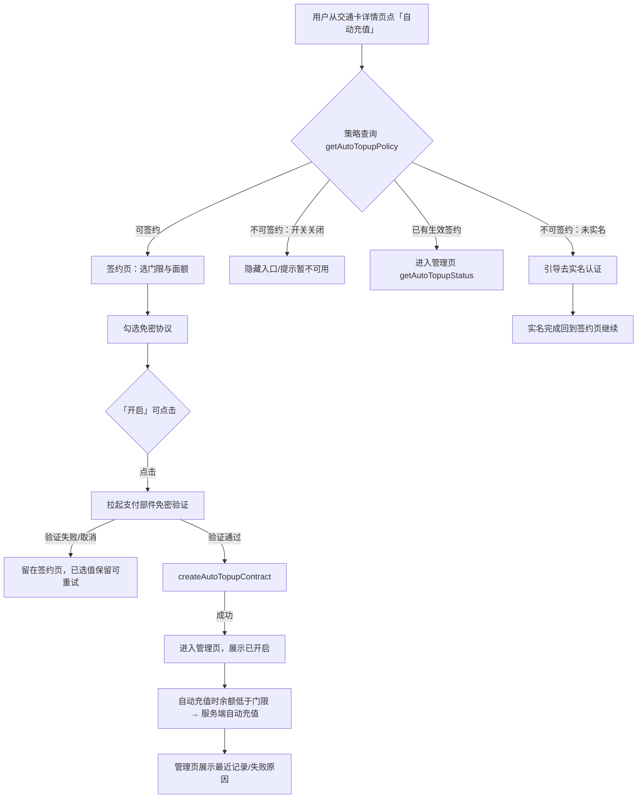
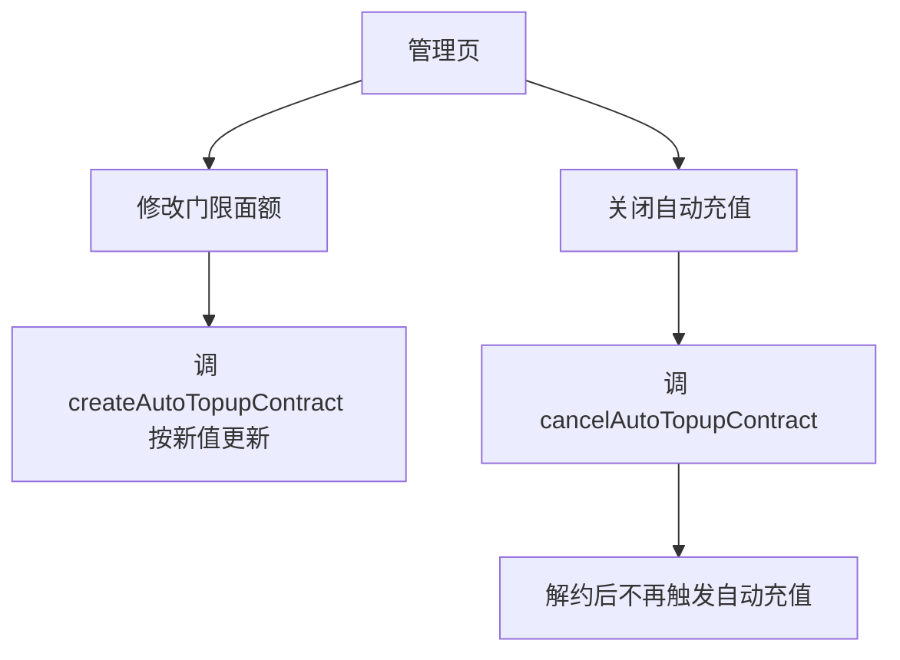

# 交通卡自动充值（钱包端）— 需求规格（Spec）

> **模块标识**: `AR90006`
> **版本**: v1.0
> **创建日期**: 2026-09-04
> **最后更新**: 2026-09-04
> **状态**: 草稿

---

## 0. 术语映射表（Terminology Mapping Table）

> 所有行已由用户逐条确认（2026-09-04）。

| 原始术语 | 权威模块 | 所属层 | 置信度（high / medium / low） | 易混项（必须亮出） | 用户确认 | 解释 |
|---------|---------|--------|-------------------------------|-------------------|---------|------|
| 交通卡 | WalletMain | 02-Feature | medium | 卡片在手机上的管理归 WalletMain（卡包域），非独立模块 | [x] | 本需求操作的卡片类型：余额低于门限时由系统自动充值 |
| 交通卡自动充值 | WalletMain | 02-Feature | medium | 「实名认证」易混——签约校验实名，但签约业务本身归本部件 feature 域 | [x] | 一次签约后余额低于门限自动充值的业务，钱包端承担入口、交互与状态展示 |
| 实名认证（实名） | AccountManager | 04-BusinessBase | medium | 「未登录」≠「未实名」：能否签约以账号侧实名结果为准 | [x] | 用户身份核验状态，未实名不可签约 |
| 登录 / 账号管理 | AccountManager | 04-BusinessBase | medium | 与 `MaskUtil` 纯脱敏易混：账号域真理在 `AccountService` 单例 | [x] | 登录/登出与账号态；退出登录清除自动充值缓存 |
| 通用日志 | CommFunc | 05-SystemBase | high | 与业务上报 VOC/Chart 易混：Logger 是纯日志，上报归可观测性封装 | [x] | `Logger`（hilog 封装），流程步骤记录用 |
| 脱敏 | CommFunc | 05-SystemBase | high | 与账号域登录态易混：脱敏是纯算法能力（MaskUtil），账号真理在 AccountService | [x] | 充值记录卡号展示前按既有脱敏规则处理 |
| 公共 UI 组件 / Toast | CommUI | 05-SystemBase | medium | 与 feature 专页易混：可复用积木归 CommUI，业务页面归 WalletMain | [x] | `ActionListItem` / `SectionCard` / `showToast` 等可复用界面积木 |
| 登出 | AccountManager | 04-BusinessBase | medium | 与纯导航「返回」易混：登出是账号域动作，清登录态 | [x] | 退出登录清除自动充值缓存与暂存 |
| 未登录 | AccountManager | 04-BusinessBase | medium | 与「未实名」易混：未登录是登录态，未实名是身份核验 | [x] | 登录态的一种：未登录用户无自动充值入口 |
| 卡包 | WalletMain | 02-Feature | high | 与交通卡详情页易混：卡包是卡证集中管理面，详情页是单卡页 | [x] | 交通卡所在的卡片管理入口 |

---

## 1. 功能概述

让交通卡用户一次签约之后，余额低于自己设定的门限时自动完成充值，把「想起来充值」从用户身上移走；
本 AR 承担钱包端的签约入口、签约交互与状态展示，判定与扣款全部在服务端完成，端侧不发起扣款。

---

## Scope 声明

> 本需求允许修改 `WalletMain`（承载签约页、管理页、仓储与缓存）与 `Phone`
> （注册新页面的 `navDestination` 路由入口）；其余模块仅被消费、不改。

### Scope 模块清单

| 字段 | 取值 | 说明 |
|------|------|------|
| 本需求允许修改的模块 | `WalletMain`、`Phone` | PascalCase，与 module-catalog 模块名一致 |
| 本需求明确不修改的模块 | `AccountManager`、`CommUI`、`CommFunc` | 仅消费既有能力（实名 / 公共 UI / 日志·脱敏），不改 |

### Scope 结构化字段（供 Spec 提取，必填）

```yaml
in_scope_modules:
  - WalletMain
  - Phone
out_of_scope_modules:
  - AccountManager
  - CommUI
  - CommFunc
rationale: |
  自动充值端侧能力（签约入口、签约页、管理页、策略/状态/解约数据层、wallet_auto_topup_contract 缓存）
  全部落 WalletMain；新增页面需要 Phone 在其 navDestination 注册路由，故 Phone 仅做路由装配级修改。
  AccountManager 的实名结果被消费但不改其定义（本工程无实名态字段，未实名依赖策略返回不可签约并引导）。
  CommUI / CommFunc 仅作为组件与工具被复用（ActionListItem / SectionCard / showToast / Logger / MaskUtil），不新增公共接口。
  若下游在编码中发现必须在 AccountManager / CommUI / CommFunc 新增公共能力，属 scope 扩展，须停下发起扩展提议。
```

### Visual Handoff（视觉交接，供 check-spec 读取）

```yaml
ui_change: new_or_changed
visual_handoff:
  kind: repo_assets
  authoritative_refs:
    - id: auto_topup_signup_page
      path: doc/features/AR90006/ux-reference/auto-topup-signup-page.png
    - id: auto_topup_manage_page
      path: doc/features/AR90006/ux-reference/auto-topup-manage-page.png
```

### 最小改动原则

1. **默认就地实现**：自动充值逻辑优先落在 `in_scope_modules` 内的 WalletMain。
2. **禁止默默扩展**：若编码中发现需要在公共模块新增接口，必须停下发起 scope 扩展提议。
3. **公共能力优先复用**：实名走 `AccountService`，卡片管理走 `CardRepository` 模式，
   日志/脱敏/导航走 `CommFunc`，UI 积木走 `CommUI`，不重复实现。

---

## 2. 目标用户与使用场景

### 2.1 目标用户

| 用户角色 | 描述 |
|----------|------|
| 交通卡持卡用户 | 经常使用交通卡、容易在闸机前发现余额不足的乘客；希望免去手动充值动作 |
| 未实名用户 | 想使用自动充值但尚未完成实名认证，需先完成实名 |

### 2.2 使用场景

| 场景编号 | 场景名称 | 场景描述 | 前置条件 |
|----------|----------|----------|----------|
| S1 | 首次签约 | 用户在交通卡详情页看到「自动充值」入口，选择门限与面额、同意免密扣款协议并拉起支付验证，验证通过后签约建立 | 已登录、已实名、该卡无生效签约、功能开关开启 |
| S2 | 自动充值发生 | 余额低于门限时系统自动完成充值，用户无感；可在管理页看到记录 | 已有生效签约、余额低于门限 |
| S3 | 管理与解约 | 用户查看签约状态、最近记录与失败原因，修改门限面额或关闭自动充值 | 已有生效签约 |
| S4 | 未实名引导 | 未实名用户点入口，被引导去完成实名后回到签约页继续 | 未实名 |

---

## 3. 功能清单

| 编号 | 功能名称 | 优先级 | 描述 | 关联场景 |
|------|----------|--------|------|----------|
| F1 | 交通卡详情页自动充值入口与去路分流 | P0 | 详情页展示「自动充值」入口；未实名/开关关闭不展示或拦截，已有生效签约直达管理页，可签约进入签约页 | S1, S4 |
| F2 | 策略查询与签约页交互 | P0 | 加载 `getAutoTopupPolicy` 返回可签约性、门限档位（5 元 / 10 元 / 20 元 / 30 元）、单笔面额（20 元 / 50 元 / 100 元）、单日限额与协议文案；门限与面额单选，协议勾选后「开启」才可点击 | S1 |
| F3 | 免密验证与创建签约 | P0 | 「开启」拉起支付部件免密验证，拿到授权后调 `createAutoTopupContract`；验证取消或失败留在签约页，已选值保留，可直接重试 | S1 |
| F4 | 签约缓存与断点回填 | P1 | `wallet_auto_topup_contract` 缓存 contractNo/门限/面额/状态，仅免网展示，按账号隔离、退出登录清除；已选门限面额端侧暂存，验证取消/中途退出/实名归来时回填 | S1, S4 |
| F5 | 管理页与状态查询 | P0 | 顶部展示签约状态、当前门限面额、连续失败次数与停用状态；下方最近自动充值记录，失败记录展示失败原因；调 `getAutoTopupStatus` | S2, S3 |
| F6 | 修改门限面额与关闭自动充值 | P0 | 管理页可修改门限面额并按新值生效；可关闭自动充值，关闭后不再触发；调 `cancelAutoTopupContract`，解约不干预进行中订单 | S3 |
| F7 | 记录卡号脱敏与去标识埋点 | P1 | 充值记录卡号按现有规则脱敏展示；端侧事件只记去标识账号、卡片类型、阶段与结果分类，不记卡号/金额明细/支付参数 | S2, S3 |

---

## 4. 页面/界面描述

### 4.1 页面总览

```
┌─────────────────────────────┐
│         签约页/管理页          │
│  （沿用交通卡详情页现有样式）    │
│  NavDestination 二级页        │
│  顶部标题 + 返回（chevron_left）│
├─────────────────────────────┤
│      签约页：门限单选          │
│              面额单选          │
│              协议勾选 →「开启」 │
│      管理页：签约状态          │
│              最近记录(失败原因)  │
├─────────────────────────────┤
│         无底部 Tab            │
└─────────────────────────────┘
```

### 4.2 UI 组件详细描述

#### 区域 1: 签约页

| 组件 | 类型 | 内容/数据 | 交互行为 |
|------|------|-----------|----------|
| 返回 | 按钮图标 | `sys.symbol.chevron_left` | 点击返回上一页 |
| 标题 | 文字 | 「自动充值」 | — |
| 触发门限单选组 | 单选 | 5 元 / 10 元 / 20 元 / 30 元 | 单选，默认按策略返回值 |
| 单笔面额单选组 | 单选 | 20 元 / 50 元 / 100 元 | 单选，默认按策略返回值 |
| 免密扣款协议 | 勾选 / 文本 | 协议正文与勾选框 | 勾选后才可点击「开启」 |
| 开启按钮 | 主按钮 | 「开启」 | 勾选协议后可用；点击拉起支付验证 |

#### 区域 2: 管理页

| 组件 | 类型 | 内容/数据 | 交互行为 |
|------|------|-----------|----------|
| 返回 | 按钮图标 | `sys.symbol.chevron_left` | 点击返回上一页 |
| 标题 | 文字 | 「自动充值」 | — |
| 签约状态区 | 内容展示 | 开启/停用状态、当前门限与面额、连续失败次数 | 停用时展示失败原因入口 |
| 最近记录列表 | 列表 | 每条记录的金额、时间；失败记录展示失败原因 | 滚动查看 |
| 修改门限面额 | 操作区 | 当前值 + 修改入口 | 点击进入修改，按新值生效 |
| 关闭自动充值 | 按钮 | 「关闭自动充值」 | 点击解约，关闭后不再触发 |

### 4.3 页面状态

| 组件 | 类型 | 交互行为 |
|------|------|----------|
| 加载中态 | 状态展示 | 拉取策略/状态时展示，数据就绪后消失 |
| 默认（可签约）态 | 状态展示 | 门限面额可选、协议未勾、开启不可点 |
| 已选待确认态 | 状态展示 | 门限面额已选、协议已勾、开启可点 |
| 已签约（管理态） | 状态展示 | 已有生效签约进入管理页，展示状态与记录 |
| 已停用态 | 状态展示 | 连续 3 次扣款失败后展示停用状态与失败原因 |
| 异常/不可达态 | 状态展示 | 未实名 / 开关关闭 / 策略失败时入口被拦截或提示 |

---

## 5. 业务流程图

### 5.1 核心业务流（主路径）



### 5.2 子流程（管理交互）



---

## 6. 异常/边界场景处理

| 编号 | 异常场景 | 触发条件 | 处理方式 | 用户提示 |
|------|----------|----------|----------|----------|
| E1 | 未实名 | 点入口时账号未实名 | 不展示可签约路径，引导去账号能力完成实名；实名回来回到签约页，已选值保留 | 提示先完成实名认证，并提供去实名的入口 |
| E2 | 已有生效签约 | 同一张卡已有生效签约 | 不重复签约，`createAutoTopupContract` 返回既有 contractNo，转入管理页 | 直接进入管理页 |
| E3 | 支付验证取消/失败 | 用户取消或以失败结束验证 | 不创建签约，留在签约页，已选门限面额保留，可直接重试 | — |
| E4 | 单日已达上限 | 当日累计充值达到 200 元 | 当日不再触发；不计入连续失败；次日零点恢复 | 记录/状态展示 |
| E5 | 连续失败停用 | 连续 3 次扣款失败 | 云侧停用签约；用户打开管理页看到停用状态与失败原因，可重新签约 | 展示停用状态与原因 |
| E6 | 扣款成功但未写卡 | 扣款成功、写卡未完成 | 订单保持「充值中」，卡云下次读卡补写；端侧不提供重试也不重复下单 | — |
| E7 | 功能开关关闭 | 运营侧关闭签约入口 | 隐藏新签约入口；已签约用户自动充值照常发生 | 不展示入口 |
| E8 | 策略/状态拉取失败或网络异常 | 网络断开或服务不可用 | 展示兜底提示，不崩溃；缓存缺失时按默认态展示 | 提示稍后重试（模拟承载下不阻塞主流程） |
| E9 | 清除缓存/数据 | 用户清除数据或退出登录 | `wallet_auto_topup_contract` 与暂存丢失；以云侧查询为准自恢复，不崩溃不死循环 | — |

---
## 7. 非功能性需求

### 7.1 性能要求

| 指标 | 要求 | 说明 |
|------|------|------|
| 签约页首屏可交互 | ≤ 1500 ms | 进入后门限/面额可选（本工程设定，无上游依据） |
| 管理页首屏可交互 | ≤ 1500 ms | 进入后状态与记录可见（本工程设定，无上游依据） |
| 端云调用频次 | 仅用户动作触发一次 | 无定时/后台轮询；状态展示优先读 `wallet_auto_topup_contract` 缓存降频（本工程设定，无上游依据） |
| 列表滚动帧率 | ≥ 54 FPS | 记录列表滚动流畅（本工程设定，无上游依据） |

### 7.2 兼容性要求

| 维度 | 要求 |
|------|------|
| 系统版本 | HarmonyOS 现有存量最低版本（沿用既有工程基线） |
| 设备类型 | 手机（沿用交通卡详情页现有适配） |
| 屏幕适配 | 沿用现有页面适配，不新增控件类型 |
| 数据结构 | 新增接口与缓存均为新键，不删改既有字段；缓存缺失回查云侧查询 | 
| .方向性/RTL | 布局方向参数用 start/end，文本用 TextAlign.Start/End，不写 left/right |

### 7.3 安全性要求

| 要求 | 说明 |
|------|------|
| 卡号脱敏 | 充值记录展示中的卡号按现有规则脱敏（复用 `MaskUtil.maskAccount` 类能力） |
| 凭据不透传 | `agreementNo` 只透传、不在钱包持久化；端侧事件/日志不记卡号、金额明细与支付参数 |
| 事件去标识 | 端侧事件只记录去标识账号、卡片类型、阶段与结果分类 |

---

## 8. 验收标准

### P0 功能验收标准

- [x] **AC-R1**(F1, F2): 未实名用户看不到签约入口，也无法通过任何路径完成签约；被引导去实名后回到签约页，此前选的门限与面额仍在，可继续签约。
- [x] **AC-R2**(F2, F3, F5): 签约后余额低于门限时自动充值，用户不做任何操作即完成，并能在管理页记录里看到这笔。
- [x] **AC-R3**(F5, F6): 连续 3 次扣款失败后自动停用，打开管理页能看到停用状态与失败原因。
- [x] **AC-R4**(F1, F7): 功能开关关闭后新用户看不到入口，已签约用户的自动充值照常发生。
- [x] **AC-R5**(F5, F7): 充值记录中的卡号按现有规则脱敏展示。
- [x] **AC-R6**(F6): 签约后可修改门限面额并按新值生效；关闭后不再触发自动充值。
- [x] **AC-R7**(F2, F3, F4): 用户在支付验证界面取消后回到签约页，已选门限面额仍在，可直接再次开启。
- [x] **AC-R8**(F1, F4): 未实名用户被引导去实名，完成后回到签约页，此前的选择仍在，可继续签约。
- [x] **AC-R9**(F1, F5): 已有生效签约的卡再点入口，进入的是管理页而不是重新签约。

### P1 功能验收标准

- [x] **AC-R10**(F4): `wallet_auto_topup_contract` 缓存按账号隔离；退出登录清除；缓存缺失时以云侧查询为准。

### 通用验收标准

- [x] **AC-G1**: 页面在 HarmonyOS 现有基线设备上正常显示，无布局错乱。
- [x] **AC-G2**: 所有交互操作反馈响应时间 ≤ 1500 ms（本工程设定，无上游依据）。
- [x] **AC-G3**: 网络异常时有明确错误提示，不出现白屏或崩溃。
- [x] **AC-G4**: 页面支持深色模式（沿用现有样式资源适配）。

---

## 9. 技术契约

### 9.1 端云接口

| 云侧接口 | 新增·复用·变更 | 入参 → 出参 | 错误码 | 代码现状 |
|---|---|---|---|---|
| getAutoTopupPolicy | 新增 | 账号、卡片 → 可签约性、门限档位、面额档位、单日限额(200 元)、协议文案 | 无新增 | 检索 @ohos.net.http｜rcp｜axios 于钱包相关模块零命中，云侧交互为新增域（本地模拟承载，真实服务接入后替换） |
| createAutoTopupContract | 新增 | 账号、卡片、agreementNo、门限、面额 → contractNo（同卡已生效签约返回既有值） | 无新增 | 同上 |
| getAutoTopupStatus | 新增 | 账号、卡片、contractNo → 签约状态、当前门限面额、最近记录、连续失败次数、停用状态 | 无新增 | 同上 |
| cancelAutoTopupContract | 新增 | 账号、卡片、contractNo → 解约结果 | 无新增 | 同上 |

### 9.2 数据存储

| 键名/表名 | 介质 | 值结构 | 有效期 | 用途 | 代码现状 |
|---|---|---|---|---|---|
| wallet_auto_topup_contract | AppStorage（内存态） | { contractNo, threshold, amount, status } | 会话（退出登录清除） | 仅免网展示签约状态；缓存缺失以云侧查询为准 | 现有 AppStorage 键先例见 `AccountConstants.STORAGE_IS_LOGGED_IN` 等（AccountService 同模式） |
| 签约暂存（门限/面额草稿） | AppStorage（内存态） | { threshold, amount } | 会话（按账号+本卡，退出登录清除） | 验证取消/中途退出/实名回来时回填 | 同上 |

### 9.3 配置项

| 配置项 | 默认值 | 关闭态行为 | 历史版本兼容 | 代码现状 |
|---|---|---|---|---|
| auto_topup_entry_enabled（功能开关/入口管控） | true（开启，本工程设定，无上游依据） | 隐藏新签约入口；已签约用户自动充值照常发生 | 旧版本读不到该键按开启处理 | 无远程配置封装（检索管理台/云侧下发零命中）；按 `HomeConstants` 常量开关形态承载 |

### 9.4 埋点

| 事件 | 触发节点 | 归属 | 报表影响 | 代码现状 |
|---|---|---|---|---|
| auto_topup_signup | 签约流程终态（成功/失败/停用） | 运营 | 新增维度 | 上报封装已有（CommFunc WalletHAManager），事件枚举 WalletHAEventID 新增 |
| auto_topup_status | 状态查询到达终态 | 运营 | 新增维度 | 同上 |
| auto_topup_cancel | 用户取消支付验证 | 运营 | 新增维度 | 同上 |
| auto_topup_disabled | 连续失败停用后打开管理页 | 运营 | 新增维度 | 同上 |
| auto_topup_entry_blocked | 入口不可达（未实名/开关关闭） | 运营 | 新增维度 | 同上 |

### 9.5 依赖变更

| 依赖 | 变更 | 体积影响 | 兼容风险 | 代码现状 |
|---|---|---|---|---|
| WalletMain → AccountManager/CommUI/CommFunc/framework | 不涉及 | 无 | 无 | 02-Feature/WalletMain/oh-package.json5 已声明；自动充值复用既有依赖，无新 SDK/TA |

---

## 10. 规约约束要求

<!-- knowledge-use:begin 规约约束要求 · 由 spec/knowledge-use.yaml 生成，手改会被门禁拒绝 -->
| 编号 | 本需求的要求 | 落点契约名 |
|---|---|---|
| UX-01 | 签约页与管理页（均为新增界面）中方向性布局参数一律用 start/end，文本对齐用 TextAlign.Start/End，禁止 left/right 硬编码；界面沿用交通卡详情页既有样式。 | — |
| SEC-01 | 充值记录展示中的卡号按既有 MaskUtil.maskAccount 类规则脱敏；端侧事件与日志只记录去标识账号、卡片类型、阶段、结果分类，不记录卡号、金额明细与支付参数；agreementNo 只透传、不在钱包持久化。 | — |
| DFX-01 | 端云接口调用仅在用户主动进入页面或操作时触发一次（getAutoTopupPolicy / createAutoTopupContract / getAutoTopupStatus / cancelAutoTopupContract），无定时或后台轮询；状态展示优先读 wallet_auto_topup_contract 缓存避免重复查询，缓存缺失才走云侧。 | wallet_auto_topup_contract |
| OBS-01 | 签约流程（策略查询→免密验证→创建签约）与状态查询/解约流程每一步的进入与结果、分支走向与异常用 Logger 记录，按日志可还原一次签约或管理操作的完整路径。 | — |
| OBS-02 | VOC 记关键路径事件：签约成功/失败、用户取消验证、签约停用、功能开关关闭时入口不可达，均上报一条 VOC 事件。 | auto_topup_signup |
| OBS-03 | 业务步骤到达终态时各记一条 Chart：签约结束终态集合互斥且穷尽（成功/停用/取消/失败），状态查询与解约同样各自有唯一终态上报。 | auto_topup_status |
| RES-02 | 签约页与管理页新增用户可见文案（门限/面额档位、协议勾选、开启按钮、停用状态、失败原因等）优先复用项目已有中文完全一致的 string 资源；确需新增按 string.json 惯例定义并中英文齐备，代码不硬编码中文字面量。 | — |
| COMPAT-01 | 四个端云接口与 wallet_auto_topup_contract 缓存键均为新增：不删除任何既有字段、不改既有字段类型与含义；新增接口字段均可空或有默认值（可签约性；档位列表）、不触发既有服务端校验；缓存缺失时以云侧 getAutoTopupStatus 查询为准，兼容无缓存的旧版本。 | wallet_auto_topup_contract |
| ENV-01 | 清除数据或清除缓存后，wallet_auto_topup_contract 与签约页暂存的门限面额均缺失：页面以云侧 getAutoTopupStatus/策略查询为准自恢复或回填默认，不崩溃、不死循环；退出登录即清除缓存与暂存。 | wallet_auto_topup_contract |
| ENV-02 | 同一张卡已有生效签约时入口直达管理页、不重复建立签约；签约提交对重复触发有幂等保护（createAutoTopupContract 对同卡已生效签约返回既有 contractNo），支付验证拉起不重复弹窗。 | createAutoTopupContract |
| DLV-01 | 签约页与管理页新增的中英文文案梳理成待翻译字符串清单，跟踪翻译回稿后合入对应 string 资源（zh_CN 与基础语言同步）。 | — |

不命中的依据：
- DFX-02：界面沿用交通卡详情页现有样式、不新增控件类型；导入的界面示意图与流程图仅作参考资料进 ux-reference/assets，不引入工程资源；无新增 SDK 依赖与 hap 包，无体积增量可量化对象。
- RES-01：本项目界面不新增图片或图标——沿用交通卡详情页现有样式与控件类型；产品原稿图仅作界面参考（ux-reference/）与流程说明（assets/），不进入工程资源目录。
- COMPAT-02：AR90006 全程未声明对既有错误码的修改或删除；四个端云接口全部为新增，不涉及复用或变更既有错误码定义，无错误码 diff 对象。
- DLV-02：签约页与管理页均为应用内 NavDestination 导航页面，无新增对外深链/对外接口；支付验证由既有支付部件能力拉起，不属于本部件对外开放面，无文档归档对象。
<!-- knowledge-use:end -->

## 11. 设计模式候选登记

<!-- knowledge-use:begin 设计模式候选登记 · 由 spec/knowledge-use.yaml 生成，手改会被门禁拒绝 -->
| 适用单元 | 候选 | 命中信号或反证 |
|---|---|---|
| 自动充值签约流程 | decision-tree | 签约前有策略查询分出的多条前置分支（未实名→引导实名后回签、已生效签约→直达管理页、可签约→签约页），签约中又有免密验证的结果分支（成功/取消/失败留页），每个分支各自多步、各有失败处理，串成 if/else 会难维护。 |
| 自动充值签约页与管理页交互 | page-interaction | 签约页门限与面额选择、协议勾选后「开启」才可点击、点开后才拉起支付验证、验证结果决定下一步，交互先后由业务结果驱动；管理页状态展示、修改、关闭同样由状态决定可用动作。 |
<!-- knowledge-use:end -->

---

## 宿主扩展治理项

> 本需求的治理项行动（管理台排期 / 打点归档 / 翻译回稿 / 联调）落《决策与评审记录》的上线决策与跨团队协同，此处不重复列举。

## 附录

### A. 术语表

业务名词解释见 §0 术语映射表的「解释」列。

### B. 参考资料

- 产品需求：RR90006（交通卡自动充值 产品需求说明）
- 系统设计：SR90006（交通卡自动充值系统设计）
- 产品原稿《交通卡自动充值 产品需求说明》（含界面示意图与流程图，已导入）

### C. 变更记录

| 日期 | 版本 | 变更内容 | 变更人 |
|------|------|----------|--------|
| 2026-09-04 | v1.0 | 初始版本（spec 阶段草稿） | AI |