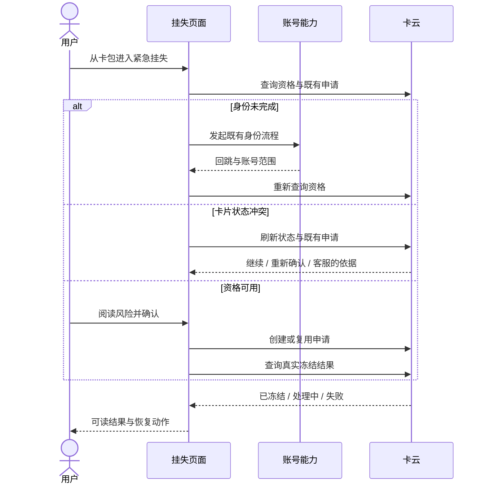
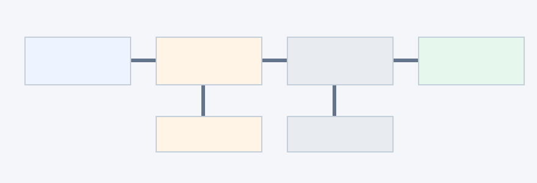

# AR90004 交通卡紧急挂失

## 1. 背景

用户发现实体交通卡遗失时，最要紧的是尽快阻止原卡继续被人使用。今天的卡包做不到：它只能展示卡片，一旦碰上账号没验证、卡片状态冲突或网络中断，用户只能离开钱包去找线下渠道，回来后也不知道上一轮办到了哪一步。

本需求在钱包里提供一条**可以中断后继续**的在线紧急挂失路径。它要同时照顾三种人：

| 用户 | 要达成什么 | 本轮给什么 |
|---|---|---|
| 已登录并实名的用户 | 立即提交挂失，拿到真实的冻结结果 | 资格查询、风险说明、申请提交、结果与恢复入口 |
| 登录或实名未完成的用户 | 补完身份后接着办，不从头再来 | 保留脱敏的卡片上下文，身份回来后回到原位置 |
| 卡片状态冲突的用户 | 看懂冲突，拿到最新状态和下一步 | 刷新云侧状态，给出继续、重新确认或客服动作 |

做成的标准：用户能尽快冻住原卡；身份校验和网络中断之后能回到有意义的检查点；重复操作不会产生第二份申请；「仍在处理」和「失败」永远不会被说成「已冻结」。

## 2. 术语

| 术语 | 在本需求里的意思 |
|---|---|
| 紧急挂失 | 用户发现交通卡遗失后，在钱包内发起的冻结原卡流程。 |
| 冻结结果 | 卡云对一份挂失申请给出的最终答复：已冻结、仍在处理、处理失败，三者互斥。 |
| 卡云 | 管理交通卡状态的云端服务，是「卡有没有资格挂失」「有没有冻上」这两件事的唯一裁判。 |
| 挂失申请 | 用户确认风险后向卡云提交的冻结请求。同一张卡同时只会有一份有效申请。 |
| 复用申请 | 提交或重试时发现同卡已有处理中的申请，就继续用它，而不是再建一份。 |
| 检查点 | 流程被打断时保存的位置记录（用户办到了哪一步）。回来后从这里继续，不从头再来。 |
| 恢复上下文 | 中断恢复用的整包本地留存：脱敏卡片标识、账号摘要、检查点、幂等标识与申请摘要。检查点是其中的位置部分。 |
| 幂等标识 | 同一次业务动作反复发送时带的同一个标记。云侧凭它认出「这是同一份申请」，重试不会变成第二份。 |
| 脱敏 | 界面和记录里只出现处理过的卡号与账号摘要，任何地方都拿不到完整卡号或身份信息。 |
| 冻结凭证 | 云侧确认冻结后发放的凭据。补卡流程凭它开始，没有它补卡不能启动。 |
| 补卡 | 原卡冻结后另办新卡的后续事项（地址、费用、订单、制卡），由兄弟开发单承载。 |

容易混淆的一对：**「已提交」不是「已冻结」**。提交只说明申请送出去了，卡有没有真的冻上，要等卡云的冻结结果。本需求全程守着这条线。

## 3. 范围

### 3.1 特性分工

完整的需求分成两段：先冻住旧卡，再办新卡。前一段是本特性，后一段由兄弟特性「补卡」承载，分工如下：

| | 本特性 · 紧急挂失 | 兄弟特性 · 补卡 |
|---|---|---|
| 用户看到的 | 卡包入口、挂失页面、风险说明与确认、结果展示 | 地址收集、费用确认、领取通知 |
| 流程处理 | 资格与既有申请查询、申请创建或复用、冻结结果确认 | 订单创建、支付、制卡进度跟踪 |
| 中断恢复 | 身份回跳、状态冲突、网络中断三类中断的恢复与检查点 | 支付中断后从既有订单继续 |
| 客服 | 页面保留「联系客服」入口 | 补卡客服交接 |
| 最终交出 | 冻结凭证 + 最终冻结状态 | 补卡订单结果 |

补卡入口放在哪个页面由产品后续确定，本轮页面不含补卡入口。

### 3.2 依赖的既有能力

本特性依赖三项既有能力，只使用、不修改：账号登录与实名流程（只调用既有身份能力）、卡云的冻结审核规则（端侧只消费云侧结论）、线下客服处理（页面只留入口，不提供处理能力）。

### 3.3 与补卡的交接约定

| 约定 | 内容 |
|---|---|
| 交接方向 | 单向：本特性在云侧确认冻结后，交出冻结凭证与最终冻结状态 |
| 补卡的开始条件 | 拿到有效交接才能开始；没有冻结凭证，补卡不得启动 |
| 反向影响 | 没有：补卡的支付中断、制卡异常、通知失败都不改变冻结事实 |
| 共享上下文 | 挂失上下文保留到补卡完成或取消——完成后清理；取消只结束补卡办理，原卡仍保持冻结 |

## 4. 业务方案

### 4.1 参与方与分工

一次挂失涉及五个参与方，责任边界如下：

| 参与方 | 拿到什么 | 给出什么 | 守住什么 |
|---|---|---|---|
| 钱包主应用 | 用户动作、脱敏卡片上下文、各方返回 | 页面状态、挂失请求、恢复动作 | 不绕过身份校验，不自行认定冻结成功 |
| 账号能力 | 身份请求与回跳上下文 | 登录实名结果、当前账号范围 | 失败时给明确结果，不持有挂失申请 |
| 卡云（经适配层） | 脱敏卡片标识、账号范围、幂等标识 | 资格、既有申请、创建结果、冻结状态 | 资格与冻结结果的唯一事实源 |
| 补卡流程 | 冻结凭证、最终冻结状态 | 补卡订单与进度 | 不复制挂失，不改变冻结状态 |
| 通用界面组件 | 页面状态与文案 | 加载、提示、按钮、结果组件 | 不承载挂失业务状态 |

### 4.2 两条底线

整个方案立在两条原则上，后面每个分支都能追溯到它们：

1. **云侧事实为准**。卡有没有资格、冻没冻上，只认卡云的返回：进入页面必查一次资格，不信任任何本地缓存；身份回来后重新查资格，不信任离开前的旧结果；只有云侧明确返回已冻结才展示成功，「已提交」和端侧缓存永远不算数。
2. **用户动作驱动**。风险说明、身份校验、冲突确认都要等用户操作，系统不自动越过任何一步：没读完风险说明，提交就不可用；身份没完成，页面停在身份说明等用户去办；页面停留期间不轮询、没有后台任务，每次云侧调用背后都有一次用户动作。

### 4.3 业务路径与状态收敛

资格可用、身份不完整、卡片状态冲突、已存在申请，这四种局面**不是一次判断的四种结果**——每条路径都有自己的查询、核验、外部能力调用、恢复方式和失败收敛点。方案把它们统一映射成用户可理解的页面状态：无论从哪条路走，用户看到的都是「我现在在哪一步、能做什么、出了问题怎么继续」，而不是内部调用的成功与失败。

### 4.4 关键取舍

| 取舍 | 选了什么 | 否了什么 | 为什么被否的不行 |
|---|---|---|---|
| 成功的判定 | 只有云侧明确返回已冻结才展示成功 | 端侧提交成功即宣告冻结 | 响应丢失、仍在处理时宣告成功是假冻结——用户以为卡安全了，原卡实际还能用，这是本需求最不可接受的失败。 |
| 重复提交 | 稳定幂等标识 + 先查既有申请再决定建或复用 | 每次提交都新建申请 | 响应丢失后用户必然重试，新建方案会在云侧堆出多份同卡申请，状态互相冲突，后续补卡不知道认哪一份。 |
| 页面形态 | 一页三段，随业务状态切换内容（产品原型已定） | 每个分支一个独立页面 | 身份回跳、冲突恢复都要跨页传上下文，中断点越多越难恢复；紧急场景要的是最短路径和唯一的检查点。 |
| 卡云对接 | 钱包主功能自建适配层承接卡云协议（已与开发确认） | 等待公共卡服务能力 | 当前工程没有现成的交通卡挂失接口和恢复上下文封装，等公共能力排期会阻塞这个安全刚需；自建能在本特性边界内管住脱敏映射与幂等。 |
| 交付切分 | 挂失先做先开放，补卡另单承接（上游已定） | 挂失与补卡一单做完 | 冻结是安全刚需，补卡是办理事项；合并交付会让支付、制卡的风险拖住冻结的上线节奏。 |

### 4.5 主要风险与控制

| 风险 | 触发场景 | 控制手段 |
|---|---|---|
| 身份回跳后账号变了 | 用户在身份流程里切换了账号 | 恢复上下文按账号隔离；账号不一致就清空旧上下文，重新选卡开始。 |
| 本地上下文过期或损坏 | 长时间未回来、版本升级、数据被清 | 恢复前校验账号、版本与有效期；不合格就清理，从资格查询重新开始，绝不拿旧缓存展示成功。 |
| 提交响应丢失 | 网络在提交或查询途中中断 | 请求期间禁用重复操作；重试先用同一幂等标识查既有申请，查到就复用。 |

## 5. 业务流程

一次挂失从卡包进入，到用户看到真实冻结结果结束。资格查询只发生在四个时机：打开页面、身份回跳、冲突恢复、用户重试——页面停留期间不轮询，也没有后台任务。各参与方的交互如下：

### 5.1 主路径

1. **进入与资格**：用户从卡包选择紧急挂失，页面查询资格与既有申请，同时展示冻结影响、当前卡片状态和数据使用说明。查询的结果决定去向：资格可用进入确认；需要身份先去补身份（见 5.2）；状态冲突或发现已有处理中的申请进入冲突处理（见 5.3）。
2. **风险确认**：用户读完冻结影响并勾选确认后，提交才可用。提交前系统再核对一次登录、实名和卡片状态——从进入页面到用户读完说明之间，这些都可能已经变了。
3. **提交**：创建申请，或复用已存在的申请。请求期间提交入口不可重复触发。
4. **结果**：云侧受理后，页面保存申请号摘要并查询一次真实冻结结果。明确返回已冻结才展示成功；仍在处理就展示可恢复的处理中状态；明确失败给出原因与下一步。

### 5.2 身份未完成的恢复

**时机**：查询资格时云侧返回需要登录或实名。

**方案**：保留脱敏卡片上下文与检查点，转入既有身份流程。

**走向**：重新查询资格——不信任离开前的旧结果，身份流程期间账号与卡片状态都可能变化；核验通过就回到离开时的确认位置。若回跳发现账号变了，清空旧上下文，重新选择卡片。

### 5.3 卡片状态冲突的处理

**时机**：云侧卡片状态已变化，或发现同卡已有处理中的申请。

**方案**：先刷新云侧状态，再结合已有申请判断，给出三种去向之一——

1. 云侧已有处理中的申请：**继续既有申请**，去确认它的结果；
2. 状态变化影响了此前的确认前提：**重新确认**后再提交；
3. 这张卡已无法在线处理：**转客服**。

**走向**：判断依据永远是刷新后的云侧状态，不用端侧缓存；三种去向都回到用户离开时的检查点。

### 5.4 网络中断与响应丢失的恢复

**时机**：查询、提交、结果确认的任何一步断网或响应丢失。

**方案**：保留最近一次安全检查点。

**走向**：用户重试时先用同一幂等标识查询既有申请——申请已在云侧就复用它继续确认结果，不存在才重新走提交。无论断在哪一步，都不会产生第二份申请。

## 6. 功能说明

### 6.1 一页三段

挂失页面在同一页内承载全流程，业务返回决定当前展示哪一段、能做什么。图 1 从左到右是三段内容的布局参考：

| 页面区域 | 用户看到什么 | 能做什么 |
|---|---|---|
| 资格与风险确认 | 脱敏卡片信息、当前卡片状态、冻结影响与数据使用说明——先讲影响，再要确认 | 读完风险说明并勾选确认后，提交才可用 |
| 身份与状态恢复 | 当前检查点、回来后接着做什么的明确说明、既有申请或冲突的处理结果 | 完成身份、继续既有申请、重新确认，或联系客服 |
| 云侧结果 | 提交中、已冻结、待确认或失败；三种结果各自可读，失败给得出原因和下一步 | 重试查询、联系客服；成功时看到冻结凭证与最终状态 |

### 6.2 页面状态

图 2 是页面对外状态的走向：主链是资格加载 → 等待确认 → 提交中 → 结果确认；身份回跳与状态冲突是两条恢复路径，处理完回到用户离开时的检查点：

页面对外共九个状态：

| 状态 | 什么时候进入 | 用户看到什么、能做什么 |
|---|---|---|
| 资格加载 | 打开页面、身份回跳、冲突恢复或重试 | 查询进行中，主操作不可用 |
| 等待风险确认 | 资格可用且无阻断 | 卡片、状态、冻结影响与数据使用说明齐全；勾选确认后可提交 |
| 等待身份 | 云侧返回需要身份 | 身份说明与检查点提示；去完成身份或退出 |
| 状态冲突 | 云侧卡片状态已变化，或发现同卡已有处理中的申请 | 最新状态与冲突说明；继续、重新确认或客服 |
| 提交中 | 用户确认并提交后 | 处理中提示；不可重复操作 |
| 结果确认中 | 申请受理后查询结果期间 | 确认中提示；等待或稍后重试 |
| 已冻结 | 云侧明确返回冻结成功 | 成功、冻结凭证与最终状态 |
| 处理中 | 云侧返回仍在处理或结果待确认 | 明确「尚未确认冻结」；重试查询或联系客服 |
| 失败 | 云侧明确返回失败 | 失败原因与下一步；重试或联系客服 |

两条状态设计原则：**内部调用步骤不做页面状态**——用户不需要知道系统正在查第几个接口；**每个失败只有一个收敛位置**——同类失败收敛到同一个状态，由它给出重试或客服动作，用户不会在不同入口看到互相矛盾的说法。

### 6.3 界面适配

大字体、深色主题、从右到左布局下，风险说明、主操作、返回、重试、客服和结果状态都保持可读、可见、可操作。所有用户可见文案登记为资源条目，页面代码只引用条目名，中文与英文成对维护。

## 7. 异常与恢复

先分清两类情况。

### 7.1 设计内的受限结果

**设计内的受限状态**不是故障——用户走到这里是流程设计的一部分，每个都有明确的出路：

| 受限状态 | 用户看到什么 | 出路 |
|---|---|---|
| 身份未完成 | 身份说明与检查点提示 | 完成既有身份流程，回来后从检查点继续 |
| 卡片状态冲突 | 最新状态与冲突说明 | 继续既有申请、重新确认，或联系客服 |
| 仍在处理 / 待确认 | 处理中说明，明确「尚未确认冻结」 | 保留重试查询与客服入口，不标记成功 |

### 7.2 需要处理的异常

**真正的异常**才是要防御的，每条都守住同一件事——不误报、不重复、不跨账号：

| 异常 | 用户看到什么 | 系统怎么处理 | 守住什么 |
|---|---|---|---|
| 身份取消或失败 | 停在身份说明，可重新发起或退出 | 清理一次性认证参数，保留脱敏检查点 | 不调用创建申请 |
| 提交响应丢失 | 处理中，可确认结果 | 用同一幂等标识查询或复用既有申请 | 不重复创建 |
| 结果查询失败 | 未确认状态与重试入口 | 保留申请摘要 | 不标记已冻结 |
| 页面销毁后重新进入 | 回到安全检查点，或重新开始 | 校验账号、版本与有效期，不合格就清理重来 | 不跨账号恢复 |
| 身份回跳后账号变化 | 重新选择卡片 | 清空旧账号的上下文 | 不把 A 账号的流程接到 B 账号上 |
| 上下文损坏或过期 | 从资格查询重新开始 | 清理后重建，不读旧缓存 | 不拿旧缓存展示成功 |

所有这些路径都不会创建补卡订单，也不会把任何失败解释成冻结成功。

## 8. 验收

验收条件按「要验的事」分组；编号沿用原始验收意图（AC-R 系列）、本轮细化（AC 系列）与通用质量（AC-G 系列），一条不少。

### 8.1 主流程与结果真实性

| 编号 | 可观察的通过条件 |
|---|---|
| AC-R1 | 正常用户按资格、风险说明、确认的顺序完成提交；只创建一次申请，展示云侧真实结果。 |
| AC-1 | 有资格的卡进入页面能看到脱敏卡片、当前状态、冻结影响与风险说明；未确认时提交不可用，确认后可进入提交中。 |
| AC-4 | 云侧返回冻结成功时展示成功、冻结凭证与最终状态；返回待确认或失败时不得显示已冻结。 |

### 8.2 中断与恢复

| 编号 | 可观察的通过条件 |
|---|---|
| AC-R2 | 登录或实名未完成时，完成既有身份流程后回到同一卡片和原检查点，重新核验资格后继续。 |
| AC-R7 | 页面销毁后在有效期内恢复安全检查点；账号变化或上下文失效时清空后重新开始。 |
| AC-2 | 身份失效、页面返回或重新进入时，恢复同账号同卡的上下文并回到最近检查点；身份恢复后不重新创建申请。 |
| AC-12 | 清除本地恢复数据后重新进入，从无上下文状态重建流程，不崩溃、不死循环。 |

### 8.3 防重与调用时机

| 编号 | 可观察的通过条件 |
|---|---|
| AC-R4 | 提交响应丢失时，重试先查询既有申请，不重复创建，并能继续确认冻结结果。 |
| AC-R6 | 请求期间重复点击不产生第二次创建请求。 |
| AC-3 | 同账号同卡连续点击确认或重试，最多创建一个申请；提交中按钮不可重复触发。 |
| AC-9 | 资格检查只在打开、身份返回、冲突恢复和重试时触发；页面停留期间不轮询。 |

### 8.4 失败路径

| 编号 | 可观察的通过条件 |
|---|---|
| AC-R3 | 卡片状态冲突时刷新云侧状态，给出继续既有申请、重新确认或客服动作，不误报成功。 |
| AC-R5 | 查询、提交或结果确认失败时，每个失败阶段都有可读原因、重试入口和安全停留状态。 |
| AC-6 | 失败或待确认时显示原因和下一步，保留重试与客服入口；客服入口不推进补卡流程。 |

### 8.5 与补卡的边界

| 编号 | 可观察的通过条件 |
|---|---|
| AC-R9 | 只有有效冻结凭证和最终冻结状态才能进入补卡；责任、顺序与共享上下文生命周期讲得清。 |
| AC-R10 | 本特性侧可观察：不发起任何支付与通知调用；付款、订单与通知的正式验收由补卡开发单承接。 |
| AC-5 | 冻结成功后对外交付冻结凭证、卡片标识与最终状态；本特性不创建补卡订单、不收地址、不发起支付。 |

### 8.6 可观测与隐私

| 编号 | 可观察的通过条件 |
|---|---|
| AC-7 | 每个阶段的进入、结果、分支和异常都能通过现有日志按一次流程标识还原。 |
| AC-8 | 进入、完成、状态变化、中止和失败均有关键路径事件，事件不含完整卡号、账号或身份凭据。 |
| AC-G3 | 页面文案经资源条目读取；日志与埋点不含完整卡号、账号或身份凭据。 |

### 8.7 资源、文案与依赖

| 编号 | 可观察的通过条件 |
|---|---|
| AC-10 | 不新增位图资源，图标优先用系统符号；确需新增时单张不超过 10KB 并记录来源与体积。 |
| AC-11 | 资源与依赖记录能说明体积变化；不新增三方 SDK 或独立安装包依赖。 |
| AC-13 | 新增文案均登记为资源条目，形成中英文翻译跟踪清单。 |

### 8.8 界面质量

| 编号 | 可观察的通过条件 |
|---|---|
| AC-R8 | 评审能看到本轮依据的界面参考，且从评审件点得开。 |
| AC-G1 | 目标手机配置下，加载、确认、提交、结果、返回恢复各状态无布局溢出或白屏。 |
| AC-G2 | 确认、重试、返回操作 300 毫秒内出现进行中或恢复反馈；单次云侧调用超 10 秒进入待确认。 |
| AC-G4 | 深色主题与从右到左布局下，风险说明、主操作、重试、客服、结果状态可读可见可操作。 |

**整体做成的样子**：资格允许且确认风险后才能提交；中断后能回到同账号同卡的检查点；同一动作最多一份申请；成功只认云侧事实；成功后交出冻结凭证；失败与待确认永远留着出路；补卡相关调用始终为零。

## 9. 交付与上线

### 9.1 上线路径

1. **联调**：先联调三条云侧链路——资格查询、申请创建或复用、冻结结果查询，覆盖正常、身份、冲突、响应丢失和失败五类路径；
2. **交接确认**：与补卡侧确认冻结交接的字段、时机与共享上下文约定；
3. **灰度观察**：开关保持关闭，观察资格、结果和恢复三类事件的错误分类，确认失败不会伪装成成功、恢复路径真实可用；
4. **开放**：观察达标后打开入口。

### 9.2 开关与兼容

入口由功能开关控制，默认关闭；读取开关失败按关闭处理，旧版本读不到该配置也按关闭处理——三种情况下用户都看不到入口，不会走进半可用的流程。

### 9.3 回退设计

**回退动作**：出问题时关闭开关即回退，回退只隐藏新入口。

**兼容性说明**：处理中的一切都保留——已提交的申请继续可查、未终结的上下文不删除、恢复能力不下线。

**可靠性说明**：挂失不可半途蒸发。用户的卡可能已经在冻结流程里，回退若清掉这些，用户既看不到入口也查不到结果，等于把最需要保护的人晾在中间。补卡侧的通知失败也不解释成冻结失败。

### 9.4 交付物

| 交付物 | 给谁、做什么用 |
|---|---|
| 文案翻译清单 | 翻译与资料侧跟踪中英文回译与合入 |
| 卡云适配结果覆盖说明 | 测试侧确认正常、身份、冲突、响应丢失、失败路径全部可被适配层结果覆盖 |
| 冻结交接字段说明 | 补卡侧按字段消费交接结果 |
| 恢复路径验证记录 | 评审与测试确认每条中断路径的恢复真实走通 |

### 9.5 与补卡的上线顺序

本特性未完成会**阻塞**补卡侧的联调与正式开放，顺序是硬约束：先有稳定的冻结与交接，才有补卡。反向不成立——补卡的支付、制卡、通知异常不影响已完成的冻结，也不改变本特性的任何结果。

## 10. 附录

工程细节的登记处：主叙事里的中文名在这里对应到具体接口、字段与条目，供实现、测试与后续维护按名查证。

### A. 接口

| 接口 | 性质 | 入参 → 出参 | 失败收敛 |
|---|---|---|---|
| `queryLossEligibility` | 新增（钱包侧卡云适配） | 脱敏 `cardId`、`accountScope` → `eligible`、`identityRequired`、`cardState`、`existingApplication`、`reason` | 查询失败收敛为页面可读失败状态 |
| `createOrReuseLossApplication` | 新增（同上） | `cardId`、`accountScope`、`userConfirmation`、`idempotencyKey` → `applicationId`、`submitted` | 有效申请返回原 `applicationId`；重试不得创建第二份 |
| `queryFreezeResult` | 新增（同上） | `applicationId` → `frozen` / `processing` / `failed`、`reason` | 仅 `frozen` 可映射为成功 |
| `TrafficCardFreezeHandoff`（交接） | 冻结成功后单向交出 | `accountId`、`cardId`、`freezeTicketId`、`finalFreezeState` | 不带补卡字段；非冻结终态不产生交接 |

### B. 数据、配置与事件

| 类别 | 条目 | 约定 |
|---|---|---|
| 存储 | `loss_report_recovery_context` | 保存 `maskedCardId`、`accountScopeHash`、`checkpoint`、`idempotencyKey`、`applicationIdDigest`、`updatedAt`；按账号隔离，不随备份恢复；最终成功、明确失败、账号变化或过期时清理，补卡协作期按上游共享约定保留 |
| 配置 | `traffic_card_emergency_loss_enabled` | 默认 `false`；关闭或读取失败时隐藏入口，旧版本读不到按关闭处理 |
| 事件 | `loss_flow_start` / `loss_flow_result` / `loss_flow_recovery` | 分别在进入、拿到结果、发生恢复时上报；只带匿名入口、阶段与结果分类；每阶段终态只记一次；上报失败不改变挂失结果 |

### C. 改动边界

给评审判断影响面：这次改了哪里、哪里保证不动。

| | 范围 | 对评审意味着什么 |
|---|---|---|
| 改动 | 钱包主功能：页面入口、状态编排、恢复上下文、卡云适配、冻结交接 | 变更影响收敛在钱包主功能内部 |
| 只复用 | 账号、通用界面组件、日志与脱敏工具的既有出口 | 这些公共能力不改动，其他业务不受影响 |
| 不新增 | 公共模块接口、三方 SDK、独立安装包依赖 | 无新增外部依赖面，无额外安全与体积评估项 |

### D. 规约判定

逐条回显本需求激活的工程规约判定结果，供评审确认合规面没有漏检；依据尽量指向上文可验的验收编号。

| 规约域 | 编号 | 判定 | 依据 |
|---|---|---|---|
| 界面一致性 | UX-01 | 命中 | 三段共用同一主操作区域；失败与待确认在同一可达区域给出重试或客服（AC-6、AC-G4 可验）。 |
| 安全隐私 | SEC-01 | 命中 | 页面、日志、事件、恢复记录只收脱敏标识与账号摘要，按账号隔离（AC-8、AC-G3 可验）。 |
| 性能功耗 | DFX-01 | 命中 | 调用只由四个明确时机触发，停留期间不轮询，失败各有收敛点（AC-9 可验）。 |
| 资源与依赖 | DFX-02 | 命中 | 交付时记录资源与依赖体积变化；本轮结论是「无新增」（AC-11 可验）。 |
| 可观测性 | OBS-01 | 命中 | 各阶段、分支、异常经现有日志按流程标识串联（AC-7 可验）。 |
| 可观测性 | OBS-02 | 命中 | 进入、完成、变化、中止、失败均有匿名关键事件（AC-8 可验）。 |
| 可观测性 | OBS-03 | 命中 | 每业务阶段终态只记录一次，重复回调不产生重复记录（附录 B 事件约定）。 |
| 资源使用 | RES-01 | 不命中 | 本轮不新增图片，图标全部使用系统符号（AC-10）；「新增图片须逐张登记」的义务未被触发。 |
| 资源使用 | RES-02 | 命中 | 新增文案统一登记资源条目，中英文成对（AC-13 可验）。 |
| 兼容性 | COMPAT-01 | 命中 | 旧版本或损坏上下文清理后从资格查询重来，不展示缓存成功（AC-12 可验）。 |
| 环境异常 | ENV-01 | 命中 | 清除恢复数据后能从无上下文状态重建流程（AC-12 可验）。 |
| 环境异常 | ENV-02 | 命中 | 重进、身份回跳、快速重复操作共享同一幂等状态（AC-3 可验）。 |
| 资料交付 | DLV-01 | 命中 | 新增文案形成翻译清单并跟踪回译合入（AC-13、交付物清单可验）。 |

### E. 材料清单

本轮依据的材料及其可定位信息，均随归档提供：

- **产品需求**——需求系统 RR90004《交通卡紧急挂失恢复》（产品，归档版）：用户旅程、产品规则、原始验收意图（AC-R 系列）。原文：[RR/prd.md](../RR/prd.md)；
- **系统设计**——需求系统 SR90004《交通卡紧急挂失与补卡系统设计》（系统设计，归档版）：两单拆分与分工、端到端时序、接口与存储约定、交付顺序。原文：[SR/design.md](../SR/design.md)；
- **开发需求分析**——需求系统 AR90004《交通卡紧急挂失（钱包端）》（开发）：本单承载范围、与兄弟单的边界、验收意图承接。原文：[AR/design.md](design.md)；
- **界面原型说明**——随归档附件《紧急挂失界面原型说明》（产品另行提供，未走需求系统）：一页三段布局、页面状态走向、文案与可读性要求；图 1、图 2 出自此件。原文：[inbox/紧急挂失界面原型说明.docx](../inbox/紧急挂失界面原型说明.docx)。
