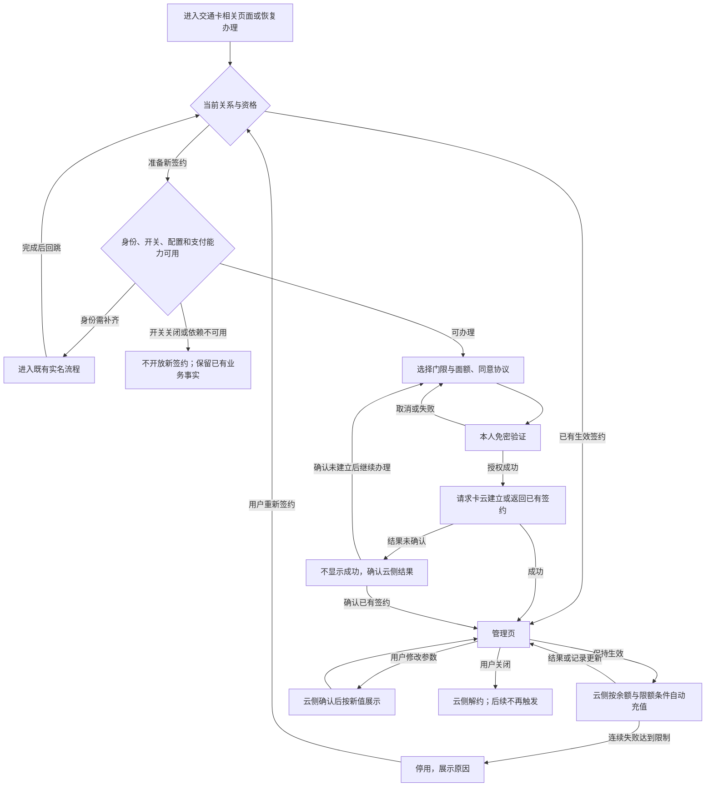
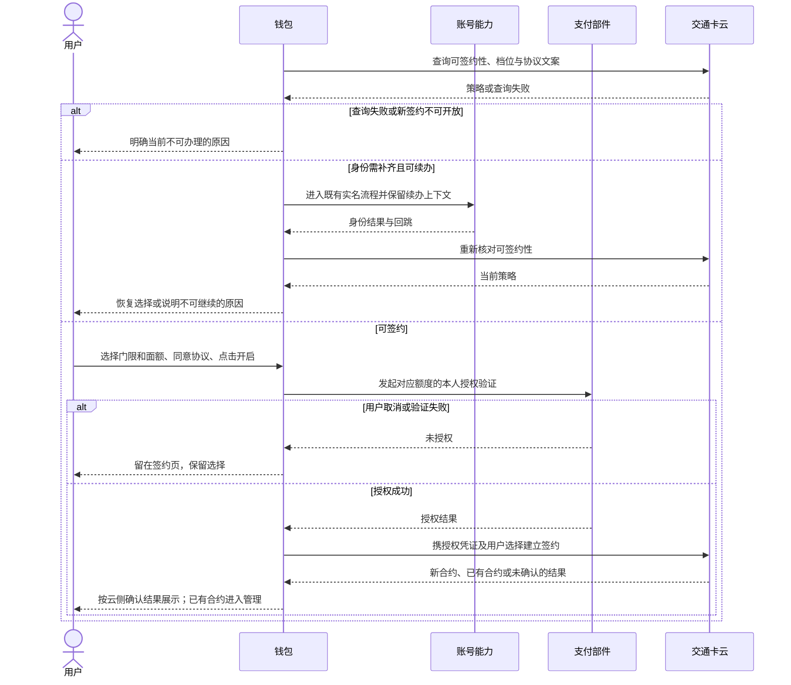
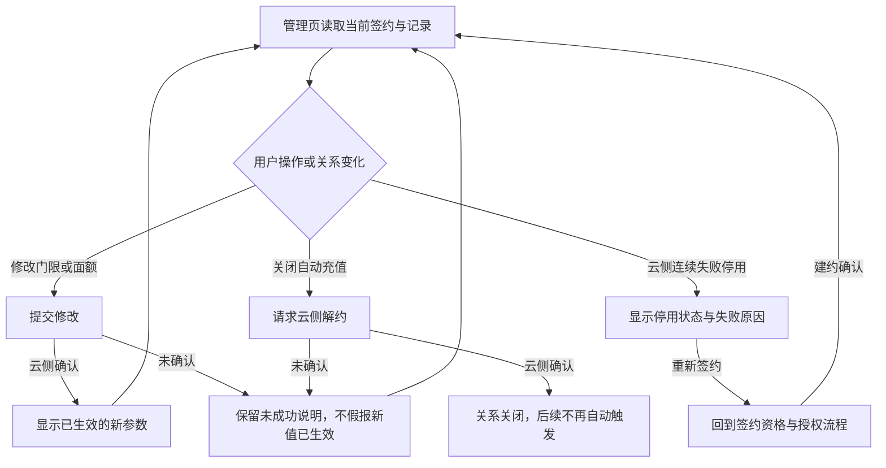

# AR90006 交通卡自动充值（钱包端）

## 1. 背景

交通卡余额不足，用户往往到闸机前才会发现，只能在人流中停下来充值。这是当前交通卡投诉量最高的场景。问题不在充值操作有多复杂，而在于余额还够时，用户很少主动想起充值。

本需求把“想起来充值”从用户身上移走：用户完成一次签约，余额低于自己选择的门限后，由服务端自动完成充值。钱包端负责让用户签得明白、看得清楚，并能修改或结束这份签约。

产品希望签约用户的闸机余额不足发生率降到万分之五以下，签约转化率不低于交通卡月活的8%。前者衡量自动充值是否减少出行中断，后者衡量用户是否愿意使用。端侧功能通过验收，是实现这些目标的必要条件；业务目标还需上线后观察。

## 2. 术语

| 术语 | 在本需求里的意思 |
|---|---|
| 自动充值 | 签约生效后，服务端在余额低于门限时发起的交通卡充值 |
| 触发门限 | 余额低于多少时开始充值，回答“什么时候充” |
| 单笔面额 | 一次充值多少，回答“每次充多少” |
| 免密授权 | 用户允许支付服务在约定条件和额度内扣款；首次签约时需本人确认 |
| 协议号 | 钱包交给卡云建立签约时使用的支付授权凭证；只在必要调用中透传 |
| 合约号 | 卡云登记自动充值签约关系的编号；与支付授权凭证是不同对象 |
| 签约状态 | 自动充值关系当前是否生效或已停用，以卡云返回为准 |
| 关闭自动充值 | 用户主动解除签约，停止此后的自动充值触发 |
| 停用 | 连续扣款失败达到限制后，由卡云停止这张卡的自动充值；需要用户重新签约 |
| 写卡与入账 | 把充值结果落实到交通卡可用余额；已经扣款不一定表示写卡已经完成 |

**授权验证不是当场充值。** 用户在签约时确认的是后续免密扣款的许可，真正的充值由服务端在条件成立时触发。钱包收到授权结果后才能申请建立业务签约，不能把打开验证界面当作授权成功。

**关闭、停用和关闭入口也不是同一件事。** 前两者影响某张卡的业务关系；运营关闭新签约入口，只限制新增签约，不终止已经生效的自动充值。

## 3. 范围

### 3.1 特性分工

本单一次交付钱包端的完整能力，不拆成签约与管理两张开发单。完整需求还包含交通卡服务端的工作；它不由钱包端实现，但必须参与端到端联调。

| 责任方 | 本需求中的责任 | 与本单的边界 |
|---|---|---|
| 钱包端（本单） | 签约入口与交互、授权拉起、签约建立、状态和记录展示、修改与关闭、停用重签、暂存与缓存 | 消费各方结果，不自行决定扣款，不保存支付授权凭证 |
| 交通卡云 | 签约关系、余额门限判定、充值订单、扣款与写卡协作、失败停用 | 服务端工作属于完整需求交付；钱包通过约定接口消费结果 |
| 支付部件 | 免密授权、额度校验与扣款能力 | 既有能力，只用不改；验证页面由支付部件承载 |
| 账号能力 | 登录与实名结果、实名流程及回跳 | 本单接入既有能力，不实现新的实名流程 |
| 运营管理台 | 配置新签约入口开关与档位 | 本单接收配置，不交付管理台页面；配置需与功能配套上线 |

### 3.2 依赖与当前承载

| 依赖 | 本单怎样使用 | 何时必须就绪 |
|---|---|---|
| 账号与实名 | 读取身份结果，进入既有实名流程并接收回跳 | 签约与实名续办联调前 |
| 交通卡云接口 | 查询策略、创建签约、查询状态、解约，并落实修改签约行为 | 本地开发可先用模拟承载；真实业务开放前必须完成真实服务联调 |
| 支付免密能力 | 拉起本人验证，取得授权结果 | 新签约开放前；不可用时隐藏新签约入口 |
| 运营配置 | 读取开关、门限与面额档位 | 与本需求同版本配套；配置不可用按关闭处理 |
| 既有界面、导航、日志与脱敏能力 | 复用已有组件和公共能力 | 页面与数据接入时，不另建同类公共模块 |

当前工程尚未接通四个端云接口，开发阶段由钱包内的本地仓储模拟承载。它用于验证页面和交互，不代表真实扣款、卡云签约或端到端业务已经可用。

### 3.3 本期不做

按日期或行程预约充值、多张卡共用一份签约、家庭成员代充，都需要新的账户模型，不在本期范围。余额提醒属于其它需求；管理台的开关配置页面也不属于本单交付。

## 4. 业务方案

### 4.1 业务结果以谁为准

自动充值的关键分工是：钱包收集用户意愿，支付部件确认授权，卡云建立并执行签约。签约后的余额判定、订单与扣款在服务端完成，钱包查询并展示结果。

| 信息或结果 | 权威来源 | 钱包的处理 |
|---|---|---|
| 登录、实名状态 | 账号能力 | 校验签约资格，必要时引导完成实名 |
| 可签约性、可选档位、协议文案 | 策略查询结果 | 决定入口和签约页可提供的操作 |
| 本人是否完成免密授权 | 支付部件返回 | 只有确认授权后才申请建立签约 |
| 签约关系、状态、充值记录 | 交通卡云 | 展示、请求修改或关闭，不用本地缓存代替业务结论 |
| 新签约入口开关 | 运营配置 | 按配置限制新签约；不可用按关闭处理 |

### 4.2 业务规则

本节统一定义全局规则；后文说明这些规则如何作用于流程、界面和验收。

| 规则 | 约定 | 边界 |
|---|---|---|
| 触发门限 | 5、10、20、30元，单选 | 签约后可修改；判定依据是服务端记录的余额 |
| 单笔面额 | 20、50、100元，单选 | 签约后可修改 |
| 免密单笔上限 | 随用户选择的面额设置 | 不能用固定的较大额度替代用户本次选择 |
| 单日充值上限 | 200元 | 达到后当日不再触发，次日零点恢复；不计入连续失败 |
| 连续失败 | 连续3次扣款失败后停用 | 显示失败原因，用户重新签约后恢复 |
| 同卡已有生效签约 | 返回既有合约，不重复建立 | 钱包转入管理页 |
| 扣款成功、写卡未完成 | 订单保持“充值中”，卡云在下次读卡时补写 | 钱包不提供再次充值重试，不重复下单 |
| 关闭新签约入口 | 隐藏新签约入口 | 既有签约仍由云侧执行；不是撤销签约或订单 |

### 4.3 关键取舍

**用服务端余额判定，不用手机显示余额。** 离线刷卡后，手机上的余额可能长时间未更新，按它触发会扣出用户预期之外的钱。因此上游已经否定“钱包监测本地余额并发起扣款”的方案。端侧缓存只用于展示。

**授权额度跟着用户选择走。** 用户选20元面额，却确认了100元的免密额度，会让实际授权超出本次选择。额度随面额设置，是产品给定的规则和理由，不是钱包可以自行放宽的参数。

**端侧整体交付，内部按依赖推进。** 需求方已选择签约与管理能力同单承载；实现和联调仍先打通策略与创建签约，再接状态查询和解约。整体承载不意味着这些依赖可以并行忽略。

**模拟承载服务于开发，真实开放以联调结果为准。** 模拟与真实服务使用相同业务契约；切换承载不应改变页面含义。不能在生产服务异常时把模拟结果作为真实签约或充值成功的替代品。

### 4.4 主要风险与控制

| 风险 | 触发条件 | 影响 | 控制 |
|---|---|---|---|
| 本地显示与云侧结果不一致 | 离线刷卡、查询失败或缓存过期 | 用户误解余额或签约状态 | 云侧结论为准；旧展示不用于签约、扣款判定 |
| 重复发起业务操作 | 连点开启、重复进入或结果未确认 | 重复调用、误判是否签成 | 提交中防重入；同卡生效签约复用；未确认结果不显示成功 |
| 依赖未就绪即开放 | 支付能力、真实接口或配置缺失 | 新用户无法完成签约 | 按依赖状态限制入口，真实服务联调通过后再开放 |
| 授权与业务参数不一致 | 面额变化但授权范围未对应 | 扣款超出用户理解 | 授权单笔上限与选定面额一致；修改涉及授权变化时需落实支付契约 |
| 界面只适合参考图尺寸 | 小屏、大字体或主题变化 | 条件、额度或按钮不可读 | 沿用既有样式；按实际设备检查关键信息和主操作 |

## 5. 业务流程

### 5.1 从签约到日常使用

签约是用户主动完成的一次授权与建约；自动充值则是签约生效后的服务端过程。管理页把两者连接起来，让用户知道当前状态，并能修改、关闭或重新签约。

图中的结果未确认不等于失败，也不等于成功。已发生的充值订单与签约关系分别处理；用户关闭自动充值，不撤销已经完成的订单。

### 5.2 签约时的跨方交接

下面展开钱包、账号、支付与卡云之间的调用和返回。它说明授权结果与业务合约的先后关系；页面内的选择条件见功能说明。

钱包不持久化支付授权凭证，也不在日志或事件里记录它。卡云返回业务合约后，钱包才把关系展示为已经建立；免密验证页面打开、验证完成和业务建约完成是三个不同节点。

### 5.3 管理、关闭与停用

管理页的操作都围绕当前卡的云侧签约展开。操作完成后回到同一管理入口，避免用户在多个页面寻找状态。

### 5.4 自动充值发生时

云侧在余额上报后依据门限、签约状态和当日限额决定是否创建充值订单。钱包不后台轮询余额、不发起扣款，只在用户查看相关页面时查询结果。

| 云侧处理结果 | 后续业务 | 钱包应当表达的含义 |
|---|---|---|
| 不满足触发条件或已达日限额 | 不产生本次充值 | 正常受限，不显示为扣款故障 |
| 扣款与写卡完成 | 余额和记录更新 | 该笔充值完成 |
| 扣款成功、写卡未完成 | 保持充值中，后续补写 | 已扣款但未完成入账，不提供重复充值动作 |
| 扣款失败 | 记录原因并处理连续失败次数 | 该笔失败；达到限制后展示签约停用 |

## 6. 功能说明

### 6.1 详情页入口与分流

“自动充值”是一整行入口，放在交通卡详情页的余额行之下、充值记录之上。已有签约的卡从同一业务入口进入管理；准备新签约时核对身份、功能开关、配置与支付能力。

| 情况 | 新签约表现 | 既有业务的边界 |
|---|---|---|
| 未完成实名 | 不展示可直接签约的入口；任何路径都不能绕过实名完成签约 | 合法续办流程可引导实名，回跳后重新核资格 |
| 功能开关关闭或配置不可用 | 不开放新签约入口 | 不因此解除既有签约 |
| 支付能力不可用 | 隐藏新签约入口 | 不把入口隐藏解释为云侧签约已结束 |
| 当前卡已有生效签约 | 进入管理页 | 不引导重复创建 |
| 条件满足且没有生效签约 | 进入签约页 | 取得当前可选档位与协议文案 |

### 6.2 签约页的选择与确认

签约在一屏内完成选择和确认，不采用分步向导。界面沿用交通卡详情页样式，不为本需求新增控件类型。

| 区域或动作 | 用户能做什么 | 条件与结果 |
|---|---|---|
| 门限 | 从可选档位中选一项 | 档位以策略结果为准，取值见4.2 |
| 面额 | 从可选档位中选一项 | 同时决定本次确认的免密单笔额度 |
| 协议 | 阅读并勾选同意 | 文案来自策略查询，不能仅因已有缓存就认定授权有效 |
| 开启按钮 | 发起本人验证 | 门限、面额、协议均完成后才可点击；提交中防止重复触发 |
| 取消验证或验证失败 | 留在原页继续办理 | 保留已选门限、面额，重新发起仍需本人验证 |

### 6.3 免密验证与建约结果

首次签约拉起支付部件的验证页面，明确展示本次单笔额度。该页面由支付部件提供，钱包负责传递必要上下文并接收结果。

未取得授权不创建业务签约，不显示半签约成功。授权后，钱包提交账号、卡片、授权凭证、门限与面额，由卡云创建关系；卡云发现同卡已有生效签约时返回原合约，钱包进入管理页。

创建响应未确认时，页面不能直接宣告已开启，也不能把网络错误解释为云侧肯定没有建约。先确认业务结果，再决定继续办理还是进入管理，具体查询与重试契约需与卡云一致。

### 6.4 管理页、修改与关闭

管理页顶部展示当前签约状态、门限和面额，下方展示最近自动充值记录。失败记录带可读原因，卡号按既有规则脱敏。

| 操作 | 生效依据 | 用户得到的结果 |
|---|---|---|
| 查看 | 云侧状态查询 | 当前关系、参数、记录、连续失败次数与停用状态 |
| 修改门限或面额 | 云侧确认更新 | 展示已生效的新参数，不把未确认的本地选择当成成功 |
| 关闭自动充值 | 云侧确认解约 | 此后不再自动触发；进行中订单继续按其业务状态处理，已完成订单不撤销 |

修改面额还涉及授权额度是否需要重新确认，不能只改页面数字。钱包、卡云和支付部件应按一致的修改契约落实，不假定现有创建接口天然承担更新。

### 6.5 停用与重新签约

连续扣款失败达到限制时，管理页顶部换成停用横幅，明确说明失败原因，并提供重新签约的入口。重签重新经过资格判断和本人授权，不能通过修改本地状态恢复自动充值。

### 6.6 暂存、缓存与授权凭证

这三个对象用途不同。暂存帮助用户接着选择，缓存帮助页面展示，授权凭证用于一次必要的业务调用；它们都不能代替云侧签约事实。

| 对象 | 保留什么 | 作用与范围 | 清理与恢复 |
|---|---|---|---|
| 签约选择暂存 | 门限、面额 | 本账号、本卡中途离开或实名回跳后回填选择 | 退出登录清除；丢失后重新选择，不假定仍有授权 |
| 签约展示缓存 | 合约号、门限、面额、状态 | 用于免网展示，按账号隔离，读取时对应当前卡 | 退出登录清除，不参与备份恢复；缺失时重新查询云侧 |
| 支付授权凭证 | 必要调用中的授权结果 | 只用于建立或处理相应签约 | 不持久化，不进入日志或事件 |

当前工程方案中的签约展示缓存为会话内存，因此免网展示依赖本次运行已经取得过数据；应用进程结束后，不能仅凭这份缓存恢复离线展示。选择暂存是否需要跨进程保留，与展示缓存的存储选型分别确定，不能因为二者都叫“本地数据”而共用生命周期。

### 6.7 观测与资源要求

日志记录关键步骤的进入和结果，业务事件用于了解签约转化、验证流失、管理操作与停用回访。上报只包含去标识账号、卡片类型、阶段与结果分类，不记录卡号明文、金额明细或支付参数；上报失败不改变业务结果。

一次操作的成功、失败、取消分别记为相应结果，不把“正在重试”当作已经成功。查询由用户进入页面等实际动作触发，不新增后台余额轮询。

页面优先使用系统图标，其次复用项目已有图片；确需新增的单张图片不超过10KB，并说明不能复用的原因，这是本工程规约。文案纳入翻译清单；方向性布局采用与阅读方向一致的起止对齐。小屏、大字体与深色主题下，额度、状态与主操作仍应可读可用。

## 7. 异常与恢复

### 7.1 设计内的受限与用户中止

这些情况不等于系统故障。先向用户说明当前结果，再给符合业务含义的继续方式。

| 情况 | 当前结果 | 怎样继续 |
|---|---|---|
| 身份未完成 | 不能签约 | 进入既有实名流程；回跳后重新核资格，并恢复本账号、本卡选择 |
| 用户取消验证 | 没有取得授权，没有创建签约 | 留在签约页，保留选择，可再次发起验证 |
| 用户中途离开签约页 | 本次办理未完成 | 返回后按有效暂存回填；没有暂存则重新选择 |
| 已有生效签约 | 不重复建立 | 进入管理页 |
| 日充值达到上限 | 当日不再触发，不累计为失败 | 次日零点恢复规则允许的触发 |
| 新签约入口关闭 | 本次不能新增签约 | 入口恢复后再办理；已有关系不因入口关闭改变 |

### 7.2 故障、未知结果与业务恢复

| 情况 | 不能误判成什么 | 处理与恢复 |
|---|---|---|
| 策略查询失败 | 有旧状态缓存就仍可新签约 | 显示不可取得当前策略的结果；重新获取有效策略后再办理 |
| 状态查询失败 | 签约不存在或已经关闭 | 有本次运行缓存时仅作展示参考；没有缓存则显示查询失败，恢复网络后重新查询 |
| 验证失败 | 已经授权或已经签约 | 留在签约页，保留选择，再次验证 |
| 建约、修改或解约结果未确认 | 操作肯定失败或肯定成功 | 不提前改变成功展示；按云侧契约确认已有结果后继续 |
| 扣款成功但写卡未完成 | 需要用户再次充值 | 显示充值中，由云侧后续补写；钱包不重复下单 |
| 连续扣款失败达到限制 | 仅页面临时错误 | 展示停用与原因，用户按重签流程恢复 |
| 清除应用数据或缓存缺失 | 应用崩溃、不断重试仍无结果 | 重新查询云侧展示；未完成选择丢失时重新选择 |
| 事件上报失败 | 业务操作失败 | 保持业务结果，观测异常单独处理 |

## 8. 验收

原始验收编号保持独立。钱包端单测或本地模拟可以验证页面行为，涉及真实扣款、写卡或跨方授权的条目必须联合验证，不能以模拟结果代替。

### 8.1 入口与签约

| 编号 | 场景与可观察的通过条件 | 主责 |
|---|---|---|
| AC-R1 | 未实名用户看不到可直接签约的入口，任何路径均不能绕过实名建立签约 | 钱包；账号与卡云配合 |
| AC-R8 | 已进入合法续办流程的用户完成实名后回到签约页，本账号、本卡的有效选择仍在，可继续办理 | 钱包；账号配合 |
| AC-R7 | 用户取消支付验证后回到签约页，门限与面额保留，可重新发起验证 | 钱包；支付配合 |
| AC-R9 | 已有生效签约的卡再次进入，显示管理页而非重复签约；不产生第二份生效关系 | 钱包与卡云 |

### 8.2 自动充值与管理

| 编号 | 场景与可观察的通过条件 | 主责 |
|---|---|---|
| AC-R2 | 签约有效且满足余额、限额条件时，用户不操作也能完成充值，钱包记录可查 | 卡云与支付负责执行；钱包验证展示 |
| AC-R3 | 连续3次扣款失败后签约停用，管理页展示停用状态与失败原因，并能进入重签 | 卡云负责判定；钱包负责展示与恢复入口 |
| AC-R6 | 修改经云侧确认后按新值生效；关闭确认后不再触发新充值，存量订单处理不被误撤销 | 钱包与卡云；额度变化时支付配合 |
| AC-R5 | 正常和失败记录都按既有规则脱敏卡号，页面不泄漏完整卡号 | 钱包 |

### 8.3 入口管控与数据保护

| 编号或检查项 | 可观察的通过条件 | 主责 |
|---|---|---|
| AC-R4 | 运营关闭新签约入口后，新用户无法从入口办理；已签约用户的自动充值继续由云侧执行 | 运营配置、钱包与卡云 |
| 依赖不可用 | 支付能力不可用或配置不可用时，新签约入口按约定关闭，不虚报既有关系已结束 | 钱包；支付与配置方配合 |
| 选择与账号隔离 | 中途退出和实名回跳恢复本账号、本卡的选择；登出后不带到下一账号 | 钱包 |
| 缓存丢失 | 清除数据后可以重新查询，既不崩溃也不循环假报成功 | 钱包 |
| 授权与上报 | 支付授权凭证不落存储、日志和事件；上报失败不改变业务结果 | 钱包 |

### 8.4 质量与上线后观察

| 项目 | 已有目标或约束 | 怎样评估 |
|---|---|---|
| 闸机余额不足发生率 | 签约用户低于万分之五，来自产品目标 | 上线后按产品确认的统计周期与口径观察，不能由一次页面测试证明 |
| 签约转化率 | 不低于交通卡月活的8%，来自产品目标 | 按产品确认的分母与统计周期观察，去重签约与月活口径应一致 |
| 页面可用性 | 沿用既有视觉与交互规范，关键内容可读可操作 | 在支持设备上走查小屏、大字体、深色主题及主操作状态 |
| 性能与资源 | 不增加后台余额轮询；新增图片单张不超过10KB（本工程规约） | 记录策略/状态查询次数、等待与交互响应；量化实际资源与依赖增量，检查无操作时后台活动 |

产品材料没有给页面响应时间和新增资源总体积的具体阈值。工程验收需明确测试条件、计时边界与阈值依据；单张新图片仍遵守本工程10KB限制。

## 9. 交付与上线

### 9.1 从开发到开放

| 阶段 | 本单交出什么 | 进入下一阶段的条件 |
|---|---|---|
| 本地开发 | 入口、签约、管理、暂存与展示能力，以本地仓储模拟接口 | 正常、受限和失败路径可重复验证；模拟边界明确 |
| 签约联调 | 策略、本人授权、创建或复用签约 | 账号、支付、卡云结果一致，授权额度与用户选择一致 |
| 管理联调 | 状态和记录、修改、解约、停用重签 | 签约结果可查询；修改与解约契约及存量影响验证通过 |
| 配套开放 | 真实服务与运营配置配套，翻译和设备走查完成 | 真实端到端验收通过，开关与异常处置可执行 |

先联调策略与创建，再开放状态查询与解约，是上游明确的依赖顺序。钱包页面完成不代表交通卡服务端完成；完整需求的开放还依赖云侧扣款与写卡结果。

### 9.2 回退设计与控制边界

当前有依据的主动收回措施是运营关闭新签约入口。它控制新增关系，不是整个自动充值业务的总停止开关。

| 对象与触发 | 动作或表现 | 影响范围 | 恢复条件 |
|---|---|---|---|
| 新签约暂不宜继续开放 | 运营关闭新签约入口 | 阻止新增签约；不撤销既有签约，不中断在途订单 | 相关问题处理并允许重新开放后打开入口 |
| 配置或支付能力不可用 | 钱包隐藏新签约入口 | 属于依赖不可用时的保护；不表示云侧签约已经停止 | 取得有效配置、支付能力恢复，并重新核准入 |

用户主动关闭某张卡、连续失败自动停用，是第6、7章中的业务动作，不列为版本回退措施。当前材料也没有证明“撤回钱包版本可以终止云侧自动充值”，因此不能用旧版本或模拟承载代替云侧处置。

如果需要停止已签约用户的后续自动充值，必须另行明确云侧可执行的措施、权限、存量与在途影响及恢复条件；在这些条件确认前，本单不能承诺已经具备全量业务停止能力。

### 9.3 交付物

| 交付物 | 给谁 | 用途 | 何时就绪 |
|---|---|---|---|
| 钱包端入口、页面、交互与本地数据处理 | 用户与客户端测试 | 签约、管理、恢复及结果展示 | 随本版本交付 |
| 接口接入与联调用例 | 卡云、账号、支付协作方 | 验证真实请求、结果与失败处置；替换开发期模拟 | 对应联调阶段前 |
| 验收结果与设备走查记录 | 测试与发布负责人 | 证明开放条件满足 | 开放前 |
| 新增文案与翻译清单 | 翻译及客户端开发 | 文案回稿、资源合入 | 发布前 |
| 业务事件及配置配合说明 | 运营与配置方 | 观察转化、定位失败、控制新签约开放 | 与功能同版本配套 |

## 10. 附录

### 10.1 技术约定

主叙事里的中文名在这里对应到具体接口、数据、配置与统计点，供实现、测试和后续维护按名查证。

#### 10.1.1 接口

| 接口 | 输入 → 输出 | 调用与结果边界 |
|---|---|---|
| `getAutoTopupPolicy` | 账号、卡片 → 可签约性、门限/面额档位、单日限额、协议文案 | 进入相关路径时取得当前策略；不可签约时不拉起免密协议 |
| `createAutoTopupContract` | 账号、卡片、`agreementNo`、门限、面额 → `contractNo` | 本人授权后调用；同卡已有生效签约返回既有合约 |
| `getAutoTopupStatus` | 账号、卡片 → 签约状态、门限/面额、最近记录、连续失败次数、停用状态 | 页面查询云侧当前结果；缓存不是结果确认接口 |
| `cancelAutoTopupContract` | `contractNo` → 解约结果 | 解约确认后停止后续触发；不撤销已完成订单，进行中订单按云侧业务处理 |

修改签约行为已经在需求范围内，但上游没有给出独立的更新接口或复用接口约定；支付验证的入参、协议号产生时点以及面额修改是否重新授权，也需要在联调契约中明确。错误码同样未给出，不以“无新增”替代失败语义。

#### 10.1.2 数据

| 对象 | 当前内容或名称 | 生命周期与限制 |
|---|---|---|
| 签约展示缓存 | `wallet_auto_topup_contract`；`contractNo`、门限、面额、状态 | 当前工程方案采用 AppStorage 会话内存；账号隔离、登出清除、不备份。读取应对应当前卡，不持有 `agreementNo` |
| 签约选择暂存 | 当前账号、当前卡的门限与面额选择 | 支持中途返回和实名回跳；登出清除。具体存储键和跨进程期限需在存储契约中确定 |

两个本地数据对象的业务区别见6.6。

#### 10.1.3 配置

| 配置 | 内容 | 不可用时 |
|---|---|---|
| 功能配置 | 运营下发的新签约入口开关与档位 | 按关闭处理；业务初始开放状态由运营配置确定，不在钱包私设默认开启 |

#### 10.1.4 埋点

页面进入与点击由项目自动采集覆盖，不重复列；本需求没有明确的运营采集要求，不新增运营点位；事件只带去标识账号、卡片类型、步骤与结果分类，上报失败不改变业务结果。

##### 10.1.4.1 签约成功率（签约流程·运维）

衡量从点击开启到卡云建签成功的比例（产品目标：签约转化率不低于月活 8%）。要算它，需要策略查询、免密验证、建签三步各自的结果。

| 统计点 | 业务动作 | 实际适用结果 | 本端何时得知 | 已有或新增 |
|---|---|---|---|---|
| 策略查询 | 进入签约路径时查可签约性与档位 | 可签约 / 不可签约 / 查询失败 | 策略请求返回时 | 新增 |
| 免密验证 | 拉起支付部件的免密授权 | 通过 / 失败 / 用户取消 | 支付部件返回时 | 新增 |
| 建签 | 携授权结果请求卡云建签 | 成功 / 失败 / 已有签约 | 建签请求返回时 | 新增 |

- 建签失败后重新走验证是新的一次尝试，分别记录。
- 自动扣款与停用在服务端发生，钱包端不采集。

##### 10.1.4.2 管理操作成功率（管理流程·运维）

衡量已签约用户修改门限或面额、关闭自动充值这两类操作提交后由卡云确认成功的比例，并观察停用后的回访与重签（功能说明 6.4、6.5 的管理与停用回访）。要算它，需要修改、关闭两个提交各自的结果，以及停用态的查看。

| 统计点 | 业务动作 | 实际适用结果 | 本端何时得知 | 已有或新增 |
|---|---|---|---|---|
| 修改提交 | 管理页提交新的门限或面额 | 云侧确认 / 未确认 / 用户取消（面额上调需再次授权时） | 修改请求返回时 | 新增 |
| 关闭提交 | 管理页提交解约 | 云侧确认 / 未确认 | 解约请求返回时 | 新增 |
| 停用态查看 | 停用后进入管理页看到原因 | 到达停用态 | 状态查询返回停用时 | 新增 |

- 停用本身由卡云在连续失败后判定，钱包端只记录用户看到停用态；停用后重新签约走签约流程的统计点，不另设。
- 修改与关闭未确认时不报成功，也不报失败，等云侧结果确认后再记。

### 10.2 改动边界

本表帮助评审者判断本单影响面，业务责任仍以第3章为准。

| 模块或承载面 | 本单改动 |
|---|---|
| WalletMain | 新增交通卡自动充值页面、交互、接口承载、暂存/缓存与事件接入 |
| Phone | 接入所需页面路由映射；不实现自动充值业务规则 |
| AccountManager | 复用既有登录实名能力，不修改其业务流程 |
| CommUI | 复用界面组件，不新增通用控件类型 |
| CommFunc | 复用日志、脱敏等能力，不新增同类公共封装 |

卡云与支付的真实实现不属于这张客户端开发单的代码范围；接口约定和联合验收仍是本单交付的依赖。

### 10.3 规约判定

本表说明规约如何改变本需求的实现或验证，不能以列出编号代替落实。

| 规约 | 判定 | 本需求的落实与检查位置 |
|---|---|---|
| UX-01 | 适用 | 新页面方向布局采用起止语义，检查小屏、大字体、深色主题下的关键内容与操作 |
| SEC-01 | 适用 | 卡号经既有脱敏能力处理；支付授权凭证不落存储、日志或事件；事件仅保留允许字段 |
| DFX-01 | 适用 | 策略与状态查询对应实际页面动作，不增加后台余额轮询 |
| DFX-02 | 适用 | 优先复用文案资源，量化实际新增资源和依赖体积；限制值须有工程依据 |
| OBS-01 | 适用 | 日志覆盖资格、授权、建约、查询、修改与解约的进入和结果，能定位失败阶段 |
| OBS-02 | 适用 | 业务事件覆盖签约进入、授权结果、建约、管理操作和停用回访 |
| OBS-03 | 适用 | 每个业务步骤的终态互斥且穷尽，同一次执行到达终态只记录一次；“重试中”不能冒充成功 |
| RES-01 | 适用 | 系统图标→项目已有图片→新引入；新增单张不超过10KB，给出必要性及实际体积 |
| RES-02 | 适用 | 新文案使用资源键并补齐翻译，避免把页面文字写死在代码中 |
| COMPAT-01 | 适用 | 接入新增字段时明确缺值处理，不删除旧字段或改变已有语义；不可用配置不误开入口 |
| COMPAT-02 | 当前未发现旧错误码改动 | 上游尚未给完整失败协议；联调确定后复核是否涉及已有错误语义 |
| ENV-01 | 适用 | 数据清除后走云侧查询恢复，不崩溃、不死循环、不以丢缓存认定解约 |
| ENV-02 | 适用 | 入口与开启操作防重入；同卡已有生效签约复用，结果未确认不盲目重建 |
| DLV-01 | 适用 | 新增文案进入翻译清单并跟踪回稿与合入 |
| DLV-02 | 本次没有新增公开开放面 | 不新增对外页面/API说明义务；不影响本开发单本身的评审与归档 |

### 10.4 材料清单

本篇据以写成的材料及原文位置。

- 产品需求《交通卡自动充值》v0.4，钱包产品组提供的[原始文档](../cases/auto-topup/supplements/交通卡自动充值.docx)：业务目标、界面、档位、限额和验收意图。
- [SR90006 系统设计](../cases/auto-topup/system/SR90006/design.md)：参与方、签约与管理流程、接口、失败恢复及交付依赖。
- [AR90006 原开发单](../cases/auto-topup/system/AR90006/design.md)：钱包端责任范围；本轮按已确认选择整体承载签约与管理能力。
