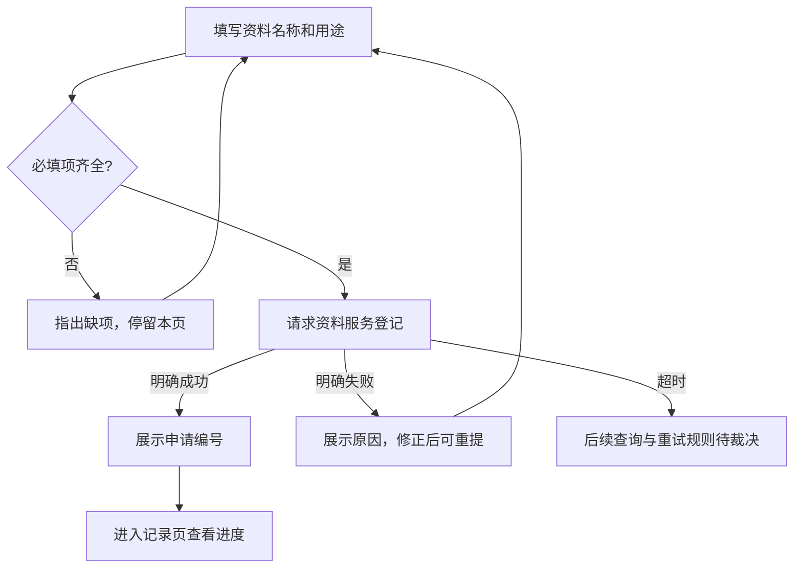
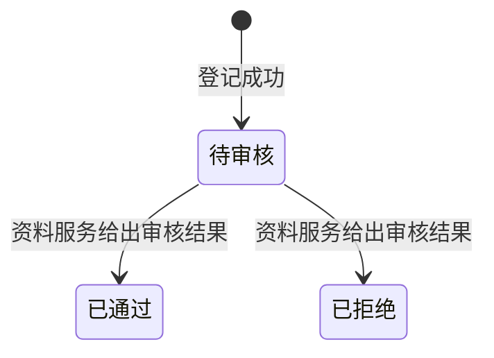
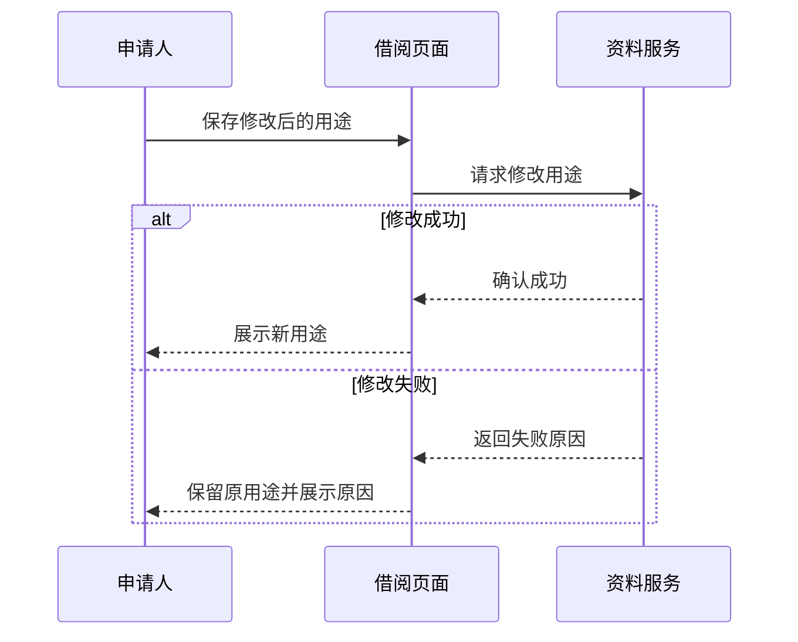

# 同源成品示范与保持核对

用途：维护者审视成品组织，不进入正式 Case、生产提示或消费模型输入。它展示目标效果，不证明模型已经能从材料生成该效果，也不是生产门禁 fixture。十章中的接口/知识示例采用本例给定事实，不替代真实产物的机器投影。

## 1. 本例全部事实

| 标识 | 唯一给定事实 |
|---|---|
| F01 | 资料借阅当前靠邮件申请；申请人难以查询处理进度。本次提供申请与进度查看 |
| F02 | 参与者为申请人、借阅页面、资料服务。管理员的审核规则与管理员界面本次不改 |
| F03 | 提交时必填资料名称与用途；缺项停留本页并指出缺项；填写齐全后页面请求资料服务登记 |
| F04 | 资料服务登记成功返回申请编号；页面展示编号，申请人可在记录页查看处理进度 |
| F05 | 登记失败由资料服务返回原因，页面展示原因，申请人修正后可以重新提交 |
| F06 | 登记后的状态为待审核，审核结束后变为已通过或已拒绝；状态由资料服务给出，页面不自行推定 |
| F07 | 只有待审核状态允许修改用途；申请人保存后由资料服务确认，成功后展示新用途；失败保留原用途并显示原因 |
| F08 | 页面退出不取消已经登记的申请，重新进入记录页仍可查询 |
| F09 | 登记超时后的查询、重试与去重规则尚未确定，由产品与资料服务负责人裁决；本次不写成已定行为 |
| F10 | AC-1 缺少必填项时留在本页并指出缺项；AC-2 登记成功显示编号且记录页可查；AC-3 非待审核状态不可修改用途；AC-4 退出后已登记申请仍可查询 |
| F11 | 上线前资料服务就绪并完成联调；入口关闭后不能发起新申请，已登记申请的查询不受影响；交付接口说明给联调人员 |
| F12 | 已明确的接口为登记、查询进度、修改用途；完整字段与错误码由资料服务提供，目前没有材料；本例没有提供界面图、日期或数值阈值 |

下面长段与改写的事实都来自此表；示范不新增“超时自动补偿”“用户无感”“撤销审核中”等听起来合理的规则。

## 2. 同一段内容怎样改

### 改前：内容混在一个段落

申请人填写资料名称和用途后提交，如果缺少必填项就停留在本页并指出缺项，填写齐全时借阅页面请求资料服务登记，登记成功时资料服务返回申请编号，借阅页面展示编号，申请人可以到记录页查看处理进度，登记失败时资料服务返回原因，借阅页面展示原因，申请人修正后可以重新提交，登记后的申请是待审核状态，审核结束后由资料服务给出已通过或已拒绝状态，借阅页面不能自己推定，只有待审核状态可以修改用途，修改成功显示新用途，失败时保留原用途并显示原因，页面退出不取消已经登记的申请，重新进入记录页仍可查询。

### 改后：在功能章按能力分节

#### 发起借阅申请

**先检查必填内容，再提交登记。** 缺少资料名称或用途时，页面指出缺项并保留当前页面；填写齐全后才请求资料服务登记。

| 登记结果 | 申请人看到什么 | 可以继续做什么 |
|---|---|---|
| 成功 | 资料服务返回的申请编号 | 到记录页查询进度 |
| 失败 | 资料服务返回的原因 | 修正后重新提交 |

登记超时后的处理仍待产品与资料服务负责人裁决，上表不将超时等同于明确失败。

#### 查看处理进度

**处理状态以资料服务为准。** 已登记申请先处于待审核，审核后变为已通过或已拒绝。退出页面不取消申请，重新进入记录页仍可查询。

#### 修改申请用途

只有待审核的申请可以修改用途。保存后等待资料服务确认：成功展示新用途，失败保留原用途并显示原因；已通过和已拒绝的申请不可修改用途。

改写没有为每条属性单独加标题，也没有把该段的所有句子再画一遍。跨方责任适合放流程章的时序图，状态迁移图用于理解生命周期；功能章保留独立判断需要的状态和结果。

## 3. 整篇十章的成品示范

以下从正文标题开始为连续阅读样稿。小需求的简单章可以很短；复杂章有自然子层级，不要求每章都分相同数量的节。

---

# 资料借阅申请与进度查看

## 1. 背景

资料借阅目前通过邮件申请，申请人不容易知道处理到哪一步。本次把申请与进度查看放到借阅页面，已登记的申请退出页面后仍可继续查询。

## 2. 术语

| 术语 | 在本需求里的意思 |
|---|---|
| 借阅申请 | 申请人提交的资料名称和用途，经资料服务登记后取得申请编号 |
| 待审核 | 已登记、尚未取得审核结果的状态，此时允许修改用途 |
| 资料服务 | 负责登记申请、提供进度和确认用途修改的服务方 |

## 3. 范围

| 参与方 | 本次承担 | 本次边界 |
|---|---|---|
| 申请人 | 发起申请、查看进度、在允许状态下修改用途 | 不改变管理员的审核工作 |
| 借阅页面 | 校验输入、发起请求、展示结果 | 不自行推定审核状态 |
| 资料服务 | 登记、返回申请编号和状态、确认用途修改 | 管理员审核规则与界面保持原有方式 |

## 4. 业务方案

### 4.1 登记结果与状态由资料服务确定

借阅页面负责收集申请和呈现结果，资料服务负责确认登记、处理状态与用途修改。页面只在收到成功结果后展示申请编号或新的用途，不把请求发出当作成功。

### 4.2 超时处理尚待裁决

登记超时后如何查询、是否可以重试以及怎样避免重复登记，需要产品与资料服务负责人决定。当前材料没有给出可执行规则，因此本文不承诺自动重试或补偿。

## 5. 业务流程

### 5.1 从申请到查看进度

图中明确失败和超时分开：前者有来源给出的修正重提路径，后者尚未确定。记录页显示资料服务给出的状态，状态变化见下一节。

### 5.2 申请的状态变化

图只表达材料给出的转移，不推定已通过/已拒绝之后的其他操作。只有待审核允许修改用途，修改用途不会在本文中被另造为审核状态。

## 6. 功能说明

### 6.1 发起申请

#### 提交前校验

申请人填写资料名称和用途。任一项缺失时留在当前页面，并指出缺失内容；填写齐全后请求资料服务登记。

#### 登记结果

成功时展示资料服务返回的申请编号，申请人可以进入记录页查询；明确失败时展示原因，申请人修正后可重提。超时边界见业务方案中的待裁决说明。

### 6.2 查看进度

记录页展示资料服务给出的待审核、已通过或已拒绝状态。退出页面不取消已登记申请，重新进入后仍可查询。

### 6.3 修改用途

只有待审核允许修改用途。下图说明保存后的责任与结果，页面没有自行确认成功的分支。

## 7. 异常与恢复

| 情况 | 页面行为 | 处理责任与后续 |
|---|---|---|
| 缺少必填项 | 指出缺项，停留本页 | 申请人补齐后提交，这是提交前受限结果 |
| 登记明确失败 | 展示资料服务给出的原因 | 申请人修正后可以重新提交 |
| 修改用途失败 | 保留原用途，展示原因 | 资料服务给出失败结果；材料未给出自动重试承诺 |
| 登记超时 | 当前未确定展示与后续处理规则 | 产品与资料服务负责人裁决查询、重试与去重边界 |

## 8. 验收

| 编号 | 验收点 | 可观察的通过条件 |
|---|---|---|
| AC-1 | 必填校验 | 缺少资料名称或用途时，留在本页并指出缺项 |
| AC-2 | 成功登记 | 展示申请编号，记录页能够查询该申请 |
| AC-3 | 修改限制 | 已通过或已拒绝状态不能修改用途 |
| AC-4 | 退出后查询 | 退出页面不取消已登记申请，再进入记录页仍可查询 |

## 9. 交付与上线

### 9.1 开放前提

资料服务就绪并完成联调后开放申请入口。当前材料没有日期，不给出推算的上线时间。

### 9.2 入口关闭后的影响

入口关闭后不能发起新申请，但已登记申请的查询不受影响。关闭入口不被描述成取消已有申请。

### 9.3 交付物

| 交付物 | 给谁 | 做什么用 | 什么时候要 |
|---|---|---|---|
| 接口说明 | 联调人员 | 联调登记、进度查询与用途修改 | 供上线前联调使用 |

## 10. 附录

### 10.1 接口信息边界

已明确涉及登记、查询进度和修改用途三类接口。完整字段及错误码尚待资料服务提供，本稿不虚构字段、错误码或响应时限。

### 10.2 材料来源

本示范全部依据维护示例的十二项给定事实。正式 Story 在这里使用实际来源清单及链接，本段不进入正式交付件。

---

## 4. 保持核对与执行者应观察什么

| 来源 | 正文落点 | 核对要点 |
|---|---|---|
| F01 | 背景 | 动机、改变、对象未丢 |
| F02 | 范围、方案 | 管理员侧仍不改，没有凭空增加参与方 |
| F03–F05 | 流程、功能、异常 | 校验、登记成功与明确失败路径完整 |
| F06 | 状态图、进度说明 | 由服务给状态，不新增撤销、超时等审核状态 |
| F07 | 功能 6.3、异常 | 状态前提、成功新值、失败原值、失败原因均在 |
| F08 | 背景、功能、验收 | 必要重现保留可独立验收性 |
| F09 | 方案、流程、异常 | 未决未变已定；图中待裁决节点不代表新增处理机制 |
| F10 | 验收 | 四条编号和通过含义保持，不因前文已有而省略 |
| F11 | 交付与上线 | 先联调、关入口不影响查询、交付说明均保持 |
| F12 | 附录及其他章 | 缺字段、错误码、日期、界面材料仍是缺口，没有补造 |

此表只用于核示例，不能成为生产要求模型逐条抄写的额外证明台账。原有作者回看与独立审查承担真实语义保持。成品变化允许自由：不用同标题、同图数、同表数，尤其简单需求不必复制本例全部子层级。
