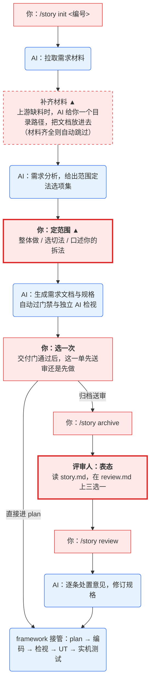

# /story 使用指南

> 面向使用 /story 做需求交付的开发人员。这一版提供哪些能力见
> [1.9.2.md](1.9.2.md)（上一版 [1.9.1.md](1.9.1.md)）;流程全景与演进方向见 [需求交付流程.md](需求交付流程.md);
> 模型的执行规则以仓内 `doc/extensions/skills/story/SKILL.md` 为准。

/story 把需求从「拿到单号」带到「规格定稿、评审归档」,随后由 framework 阶段链
接管实现。文档与规格都由 AI 生成——**你只在两处被需要:定范围、评审表态。**

---

## 一、命令

| 命令 | 干什么 |
|---|---|
| `/story init <编号>` | 起手:拉材料 → 和你确认范围 → 生成需求文档 → 自动进 /spec |
| `/story archive <AR>` | 归档送审:把评审材料上传需求系统 |
| `/story review <AR>` | 评审人表态后:拉回意见,AI 逐条处置并修订规格 |
| `/story restore <AR>` | 回退上一次归档对系统正文的覆盖 |
| `/story help` | 输出流程说明 |
| `/story adapt <目标工程>` | 工程运维,不在开发顺序内:把这套流程装到／升级到另一个工程(见第七节) |

编号也可以不是 AR 单(问题单号、工单号):入口相同,材料由你提供(见 Q2),
只是没有归档环节——交付终点是仓内的规格与评审件。

## 二、你在哪出现



红 = 你做,蓝 = AI 做;`▲` = 过渡环节(上游打通后消失)。
粗框那两处是真正需要你思考的,其余只是敲一条命令。

## 三、定范围(第一处)

AI 分析完材料后会摆出**范围定法选项集**:整体承载,以及它找到的可行切法(各附份表)。
**本次做多少、怎么拆,在这一步说。**

三种答法:

1. **整体做**——全量承载;
2. **选一个已摆出的切法**,再选本单承载哪份;
3. **口述你自己的拆法**——「本次只做签约链路,管理功能下期」。AI 会把话落成具体
   功能条目、判归属(其余归兄弟单还是待立项)、标注风险,给你一张份表确认。

说人话即可,不必背编号;有歧义时 AI 会复述理解找你确认。你的原话会被记录,
事后可查、可推翻。想省事就说「按推荐走,别逐个问」——AI 会代选并留痕,
但**拆分不会代做**:做多少是对后续单据的承诺,只在你明确指定时才拆。

定完之后 AI 生成 `AR/design.md`(需求范围的核心输入),**过目它的范围节**确认无误,
后续规格与代码都以此为界。

## 四、评审表态(第二处)

归档即送审。评审人在需求系统上:

- 读 **`story.md`**——十章需求叙事(背景、术语、范围、业务方案、业务流程、功能说明、
  异常与恢复、验收、交付与上线、附录),从规格自动装配,和实现依据永远一致;
- 在 **`review.md`** 上表态——AI 已把每个待决点整理成议题:决策点、依据、
  建议与影响、请谁确认。

议题分两种,填写位不同:

| 议题 | 填写位 | 要填什么 |
|---|---|---|
| 请你选方案(「可选的做法」列了编号选项、每项写了选它会怎样,「建议」写了推荐哪项) | 「方案选择:」 | 写选项编号;都不合适就写你的方案与理由。推荐不等于已选,不填就还是待定 |
| 请你复核已有结论 | 「审核结果:」 | 勾「确认」;或勾「不同意」并写原因与调整后的结论 |

**议题之外的发现**——缺的分支、该复用的组件、漏的埋点——写进末尾的
**「其他意见」**节,按 1. 2. 3. 编号,每条写清是什么、影响哪里。

表态完成后跑 `/story review`:AI 逐条处置——需求类修订规格,叙述类记台账,
每条意见的去向都记在需求目录的处置台账里;评审时点的 `story.md` 保持不变。

## 五、常见问题

**Q1 第一次用,提示需要 token?**
按提示到 DevOps 平台的令牌管理页申请,**把 token 直接发给 AI**,它会写入你的
用户级配置——一次配置,以后所有工程都不用再配。不需要你手动改任何文件。

**Q2 AI 说材料不全,我怎么给它?**
AI 会报出一个完整的目录路径,把文件放进去,回一句「放好了」即可——路径不用你记。
能直接放:`.docx`、文本文件(`.md` `.txt` `.log`,无后缀也行)、界面设计图。
`.pdf` `.doc` 这类读不开的,先另存为 `.docx` 或转成 `.md`。
放了不认识的格式会明确报错告诉你怎么办,不会被静默忽略;原件留档不会被改。

**Q3 中断了、换了会话,怎么继续?**
说一句 **「<编号> 继续」** 就行,**新开会话也一样**——流程状态记录在需求目录下的
契约文件里,不在对话里。AI 会先查当前走到哪、下一步是什么,然后直接从那一步接着做:
你不需要说明进度,也不需要敲任何脚本。

**Q4 已定的范围想调整?**
规格层面的调整走评审表态(写修改意见,回流时修订);范围本身要重定,
告诉 AI 重新定范围,它会重走范围确认并重生成受影响的产物。越早越省事——
范围确认放在流程最前端正是为此。

**Q5 story.md 能手工润色吗?**
正文可以改,但要让 AI 按章重新提交,它才会连同结构与引用一起核过再落盘;
那一章之外的字节原样不动。**附录里由机器投影的那几节不能手改**——改了会被逐行指出来,
并给出重新生成的出口。要改的是判断本身(规格、知识判断)时,改真源再重新投影,
这样才不会出现"评审看的和实现依据的不一致"。

**Q7 有需求澄清会的录音转写,怎么给?**
把转写 `.docx` 与其它材料一样放进 AI 报出的目录。AI 会先读会:只做字面纠偏并逐处留痕,
再按话题整理出判断;判不准归属、会上没收敛、要推翻旧决定的,会在**定范围那一处**一起摆给你,
每个话题给推荐与选项。你逐条表态后,AI 按原话与你的选择写出「当前会议结果」,后面的需求文档、
规格与 Story 都从它取;每条结论都指回转写原文的行。同一场会的新版本放进去会当作新版本,旧版本照旧可查。
范围定下之后才到的会,AI 会提示先重开范围再读会。

**Q6 规格之后的编码、检视归谁?**
framework 阶段链:plan → 编码 → 代码检视(AI 出发现清单,人裁决并合入)→ UT →
实机测试。衔接是自动的。

## 六、这套流程给你的三个保证

1. **你评审的是定稿那一版**——登记成文态之前重跑一次检查,附录的契约投影按登记时的
   规格与知识判断重算;登记之后 story 冻结,规格再改走评审回流,处置记录里查得到;
2. **到你手上的问题都值得你看**——结构、引用、编号这类机械问题由门禁清零,
   语义质量先过独立 AI 检视;
3. **你的每次拍板都有据可查**——摆过哪些选项、你选了什么、依据是什么全部留痕,
   每条评审意见处置到哪里都有记录,可追溯也可推翻。

## 七、安装、升级与跨工程复用

**在提供 Story 的来源工程中打开 AI 会话**，指定要接收这套流程的目标工程：

```text
/story adapt <目标工程根目录>
```

目标工程应已接入 Framework，并由 Git 管理。AI 会判断是首次安装还是升级，完成文件更新后自检。

**先选好来源工程**，它决定是否一并复制需求系统对接能力：

| 来源 → 目标 | 更新内容 | 对接脚本如何处理 |
|---|---|---|
| Demo 仓 → 内网业务仓 | 安装或更新 Story 流程与指定入口 | 保留目标已有实现；首次接入时需自行实现内网对接，或从已有业务仓取得 |
| 已有内网业务仓 → 其他业务仓 | 复用来源仓的 Story 版本及内网共用对接能力 | `scripts/adapters/` 随来源版本一起覆盖 |

**目标已有的知识及其激活清单始终保留**，包括工程事实、规约、设计模式和部件画像。
首次安装只创建知识说明骨架，并扫描目标代码生成部件画像（模块、交互方与职责边界），
不复制来源工程的业务知识。与你的业务无关的工程配置不在覆盖范围。

你需要参与的事情很少：

- **首次安装**：确认 AI 扫描出的部件画像、工程名称与描述，以及必要的扩展配置。
- **后续升级或复刻**：一次指令完成更新与自检，正常情况下无需逐项确认，也不重新扫描部件画像。
- **提示有未提交改动**：处理 AI 列出的待覆盖文件，自行提交或 stash 后重试；其他目录的改动无需一并清理。AI 不会替你提交或 stash。
