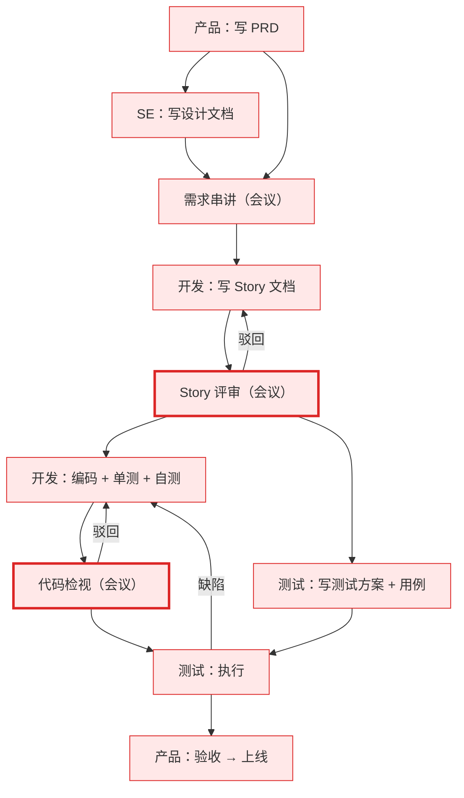
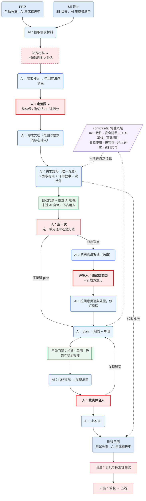

# 需求交付流程：传统流程与 AI 主导流程

需求交付的生产方式正在整体改变:**AI 接管内容生产,人退到判断与责任**。
产品、SE、开发、测试四方都在这条路上,只是进度不同。本文讲清传统流程怎么走、
现在走到哪、终态是什么。

两张流程图共用配色:
**红 = 人做** ·
**蓝 = AI 生成、人确认** ·
**浅蓝 = AI 生成推进中** ·
**绿 = 自动门禁**。

---

# 一 · 传统流程

**全链每个环节都是人**:四方各自手写产出——PRD、设计文档、Story、代码、用例;
质量判断集中在两个会议;跨需求的规范(DFX 基线、安全红线、兼容性要求)散落各处,
靠评审者记得。

---

# 二 · 现在怎么走

需求材料进来后,AI 完成分析并给出范围选项,**人定范围**;规格与评审材料一次产出,
经自动门禁与独立 AI 检视两层把关后归档送审,**评审人逐议题表态**,意见由 AI 拉回
逐条处置。实现侧同样由 AI 完成 plan、编码、检视,**人裁决合入**。
跨需求规范沉淀在 `constraints/` 八域,AI 每单自动加载、门禁自动核对。
上游的 PRD、SE 设计与下游的测试用例,四方各自的 AI 生成正在推进中。

---

# 三 · 四方的角色变化

| 角色 | AI 接管了什么 | 人保留什么判断 | 不再做什么 |
|---|---|---|---|
| **产品** | PRD 撰写(推进中) | 需求要不要做、验收意图、**上线决策** | 被反复拉去口头澄清——材料 AI 直读 |
| **SE** | 设计文档撰写(推进中) | 架构方案是否成立;`constraints/` 六域的建设与维护 | 每个需求重复讲一遍相同的规范要求 |
| **开发** | 需求规格、评审材料、plan、代码、单测、代码检视 | 本次做多少(定范围)、议题表态、**裁决合入** | 写 Story;逐行写代码;为评审通读全文 |
| **测试** | 验收标准随规格产出;用例生成(推进中);业务 UT | 可测性、场景完备性;实机与探索性测试 | 评审后才介入、从代码反推测试点 |
| **AI** | 上述全部生产,并独立检视自己的产出 | ——(无权定范围、无权豁免自己报的发现、无权合入) | —— |

四方的变化是同一个形状:**从产出内容,变为对内容负责**。
经验的沉淀方式也随之改变——过去资深者的判断("这类改动要查兼容性")靠每单到场
口头输出,现在写进 `constraints/` 一次,AI 每单自动执行、门禁自动核对。

---

# 四 · Story 文档的去向

传统 Story 由开发手写、一篇承载 13 项内容。现在**需求规格是唯一真源**,
评审叙事由它确定性装配而成——人从写文档变为评审文档,13 项内容全部有落点:

| Story 原内容 | 新载体 |
|---|---|
| A1 场景说明 / A2 流程图时序图 / B2 配置 / B3 接口 / B5 数据存储 / B6 打点 / B7 异常与测试建议 | 需求规格对应章节(接口/存储/配置/埋点归技术契约章),同步进评审叙事 |
| A3 实现方案 | 架构级 → SE 设计与需求文档;落地级 → plan |
| A4 模块类设计 / A6 改动点 | plan 与代码本身 |
| A5 关键接口 | 契约 → 需求规格技术契约章;实现 → 代码 |
| B1 DFX / B4 安全隐私 | 基线与红线 → `constraints/`(跨需求上提);本需求处置 → 规格 + 验收标准 |

---

# 五 · 演进方向

## 5.1 AI 化的推进程度

| 环节 | 现在 |
|---|---|
| 需求规格 · 评审材料 · plan · 代码 · 单测 · 代码检视 · 业务 UT | **已成体系**:AI 生成,门禁与独立检视把关,人拍板 |
| PRD · SE 设计 · 测试用例 | **推进中**:各方正逐步改用 AI 生成,成熟度不一 |

方向是**全链 AI 生成**。上游成熟后还会顺带消掉一个当前的过渡环节:
PRD 与 SE 设计由 AI 生成即天然结构化、可被下游直读,「补齐材料」不再需要。

## 5.2 人的锚点:哪些会撤,哪些不会

| 环节 | 性质 | 现在为什么要人 | 撤除条件 |
|---|---|---|---|
| 补齐材料 ▲ | 过渡 | 部分上游材料自动拿不到 | 上游 AI 化 + 系统打通,材料全量自动可读 |
| 定范围(含拆分) ▲ | 过渡 | AI 特性拆分尚需人逐单拍板 | AI 自动拆分成熟:AI 提案,人从逐单拍板退为抽查 |
| 交付门后选路 | 编排 | 归档送审与进入实现是两条路,这一单走哪条由人说了算 | ——(它是一次编排选择,不是质量判断) |
| 评审表态 | **永久** | 需求正确性的最终裁量属于人 | —— |
| 裁决合入 | **永久** | 责任锚点必须在人 | —— |
| 上线决策 | **永久** | 业务风险的承担者是人 | —— |

**终态**:全链由 AI 生成,需求自动拆分为可独立交付的特性、逐特性 loop
(规格 → 实现 → 检视 → 测试),人只在评审表态、裁决合入、上线决策三处出现。
