# Markdown 图型全量示例（预览用，非交付件）

> 历史表达手段探索；“全部/16 种”是当时整理范围，不是当前 Markdown/Mermaid 完整标准或目标平台支持声明。现有 Story 解析器、GitHub 与需求系统支持范围不同，不能据本页承诺“同一围栏、零机制改动就全部可用”。1.9.4 按[成品表达合同](../../../../plan/1.9.4/2026-09-20-版本实施/01-Story表达优化.md)选择适合关系与宿主的手段，本页不进入作者必读上下文。

> 用 VSCode 预览（Ctrl+Shift+V）或 Typora 打开。覆盖 md 在**不执行 JS** 的前提下能表达的全部手段，分四层：**基础排版**（列表/强调/引用/表格——它们本身就是可视化）、mermaid 全部 16 种图型（含 2 种实验性）、GFM 扩展、图片通道与 ASCII；每项一个可渲染实例，末尾给场景映射表。归档件（story.md）适用性逐项标注——story.md 上传需求系统，渲染环境未知，判定口径见各项。

**图例**：✅ 推荐进作者表达菜单 ｜ ⚪ 知道可选、按需用 ｜ 🔶 渲染器依赖、归档件慎用 ｜ ❌ 不引入归档件

---

## 第一部分：基础排版（最常用的「图形化」其实在这里）

### 1. 表格 ✅（属性比对与关键信息的主形态）

| 关键问题 | 答案 |
|---|---|
| 超时谁兜底 | 系统自动补偿 |
| 重复扣款 | 不会，同一请求只处理一次 |

**场景**：多对象逐项比对、关键问题速查。表前一句引导、表后需要时一句收束（story-write.md:33 已有规则）。

### 2. 无序列表 ✅（并列关系）

- 提交页面
- 记录页
- 失败提示

**场景**：并列要素、能力清单。一段里塞了几件并列的事，换成列表立即可扫。

### 3. 有序列表 ✅（真实先后）

1. 填写并提交；
2. 受理方登记；
3. 结果回执。

**场景**：有真实先后的步骤；与流程图的分工——线性短步骤用列表，有分支才用图。

### 4. 加粗强调 ✅（关键信息前置）

**补偿不会重复扣款**——这是超时路径的第一结论，段落第一句就说它。

**场景**：结论先行、段首引导词（「时机／方案／走向」）、关键数值。评审人扫读时靠加粗词定位。

### 5. 斜体 ✅（示例与出处）

_示例：`102.22.192.181`_

**场景**：示例值、材料出处、语气弱化的旁注；与正文叙述区分层级。

### 6. 引用块 ✅（原话与准则）

> 材料原话：「受理超时后应保证同一请求只处理一次。」

**场景**：引用需求方/评审的原话、规约准则摘录——归档件里「这句话是谁说的」的标准形态。

### 7. 删除线 ✅（明示否定）

~~客户端自动重试~~（受理方无去重承诺，已否）——现行做法是提示手动重试。

**场景**：被否定的做法明示出来再给现行做法，比「不采用」三个字信息量大。

### 8. 代码块 ✅（命令、字段、错误码的通用容器）

```text
错误码 ORDER_TIMEOUT：受理超时，可重新提交
```

**场景**：命令、字段、错误码、配置、ASCII 小图——等宽排版本身就是视觉分组。

---

## 第二部分：mermaid 图型（同一围栏，全部单文件承载）

### 9. 流程图 flowchart ✅

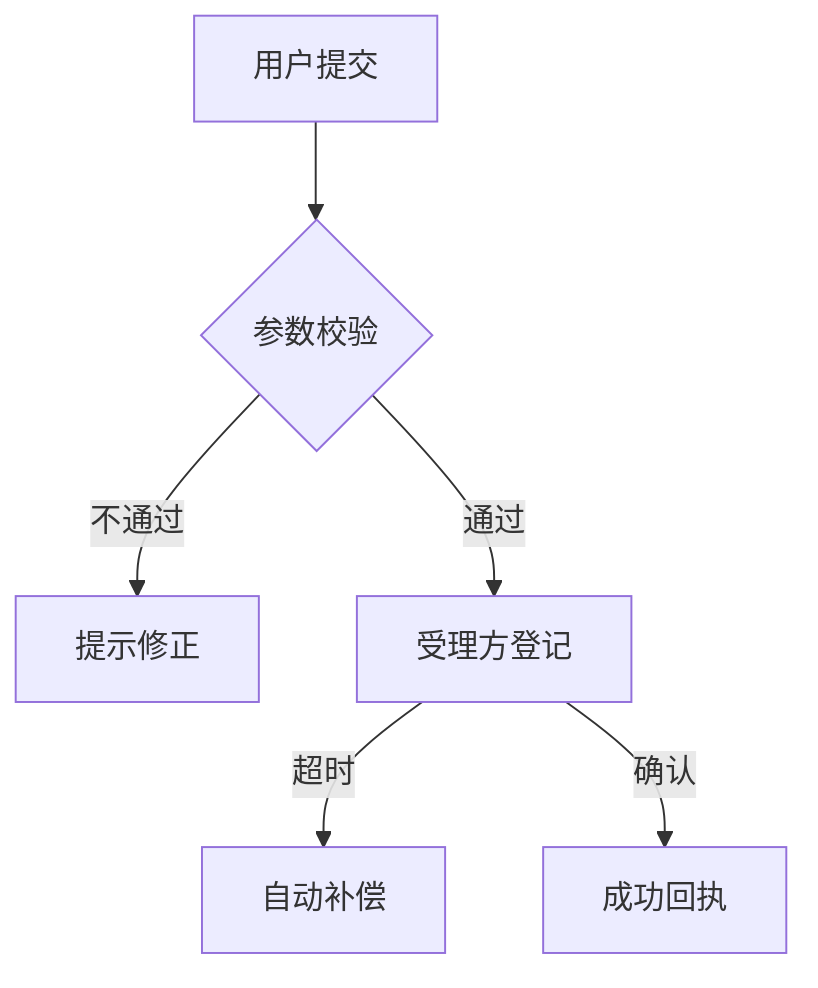

**场景**：先后与分支（业务流程章主形态）。总览图＋局部展开互补。

### 10. 时序图 sequenceDiagram ✅

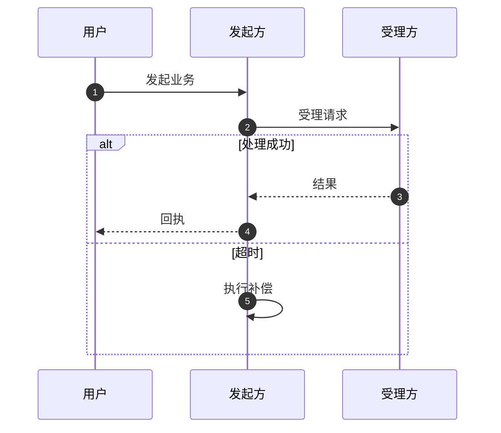

**场景**：跨方调用、返回与失败责任（次序本身要审时）。

### 11. 状态图 stateDiagram-v2 ✅

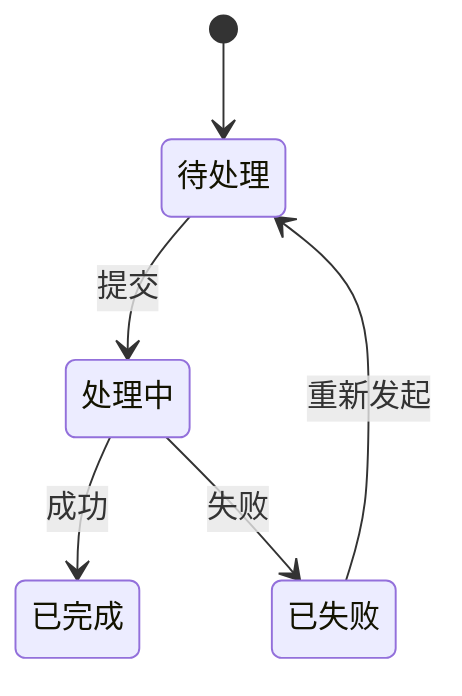

**场景**：一个对象的状态与转移（业务单据、页面状态机）。

### 12. 关系图/ER erDiagram ✅

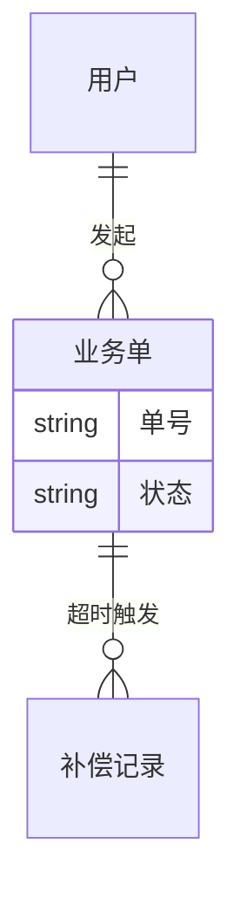

**场景**：数据对象归属与引用、一多基数（数据与缓存类需求）。基数是表格写不出的信息。
> **story 意见**：合适，但仅当真有「一单带出多条记录」这类基数要表达；单对象单表就够，别为一张表画 ER。

### 13. 用户旅程 journey ✅

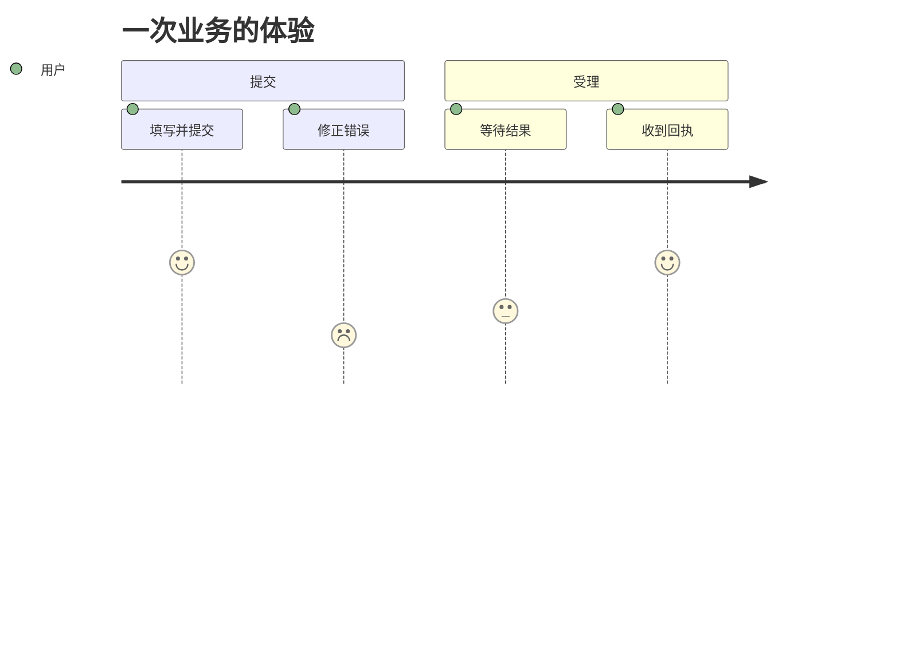

**场景**：多段体验、体验低谷定位（范围拆分类需求）。冒号后是顺畅度评分——**现状三图型都表达不了「体验好坏」**。
> **story 意见**：合适且独有价值；但顺畅度评分必须是材料/决定给的依据的转写，不是作者现场编分。

### 14. 时间线 timeline ✅

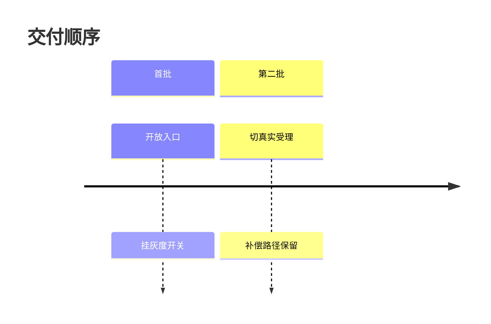

**场景**：交付顺序与协同、里程碑；前提是材料真给了顺序。

### 15. 思维导图 mindmap ✅

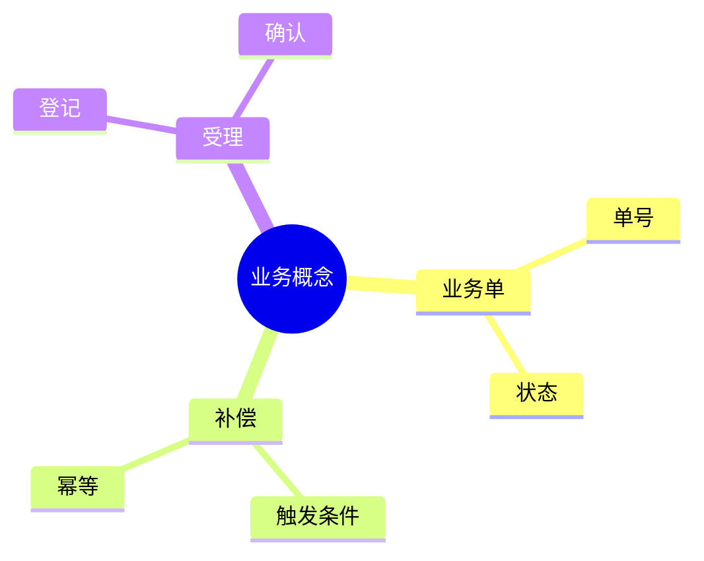

**场景**：概念域/功能分解的总览目录。注意它**表达不了约束**，只当目录，正文仍要讲。
> **story 意见**：收窄为「仅开篇导览」，不推荐进正文——它最容易被滥用成把术语表画成图，替代真叙述。我不再把它列进推荐菜单。

### 16. 类图 classDiagram ⚪

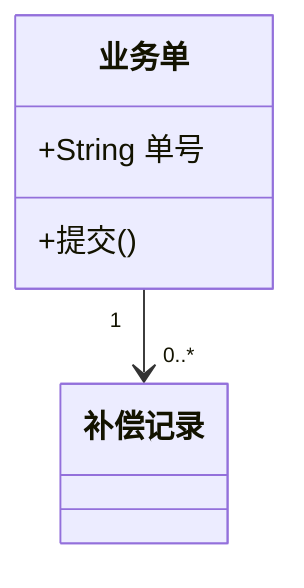

**场景**：实现侧的静态结构（读者是不看代码的评审人时慎用，容易工程味过重）。
> **story 意见**：不合适。类图是工程实现视角，读者是不看代码的评审人，出现它就是主叙事工程味；数据关系 ER 已够。

### 17. 象限图 quadrantChart ⚪

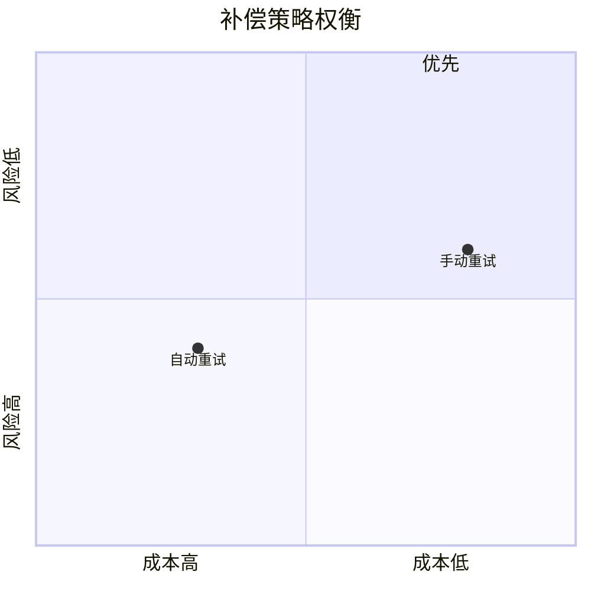

**场景**：多候选的两维权衡速览。决策件的辅助视角，**替代不了人话结论**。
> **story 意见**：story 正文不合适。坐标位置是作者主观打分，伪精确；取舍的结论与理由要人话讲（决策登记已有 choice/confirm 形态）。

### 18. 柱线图 xychart-beta ⚪

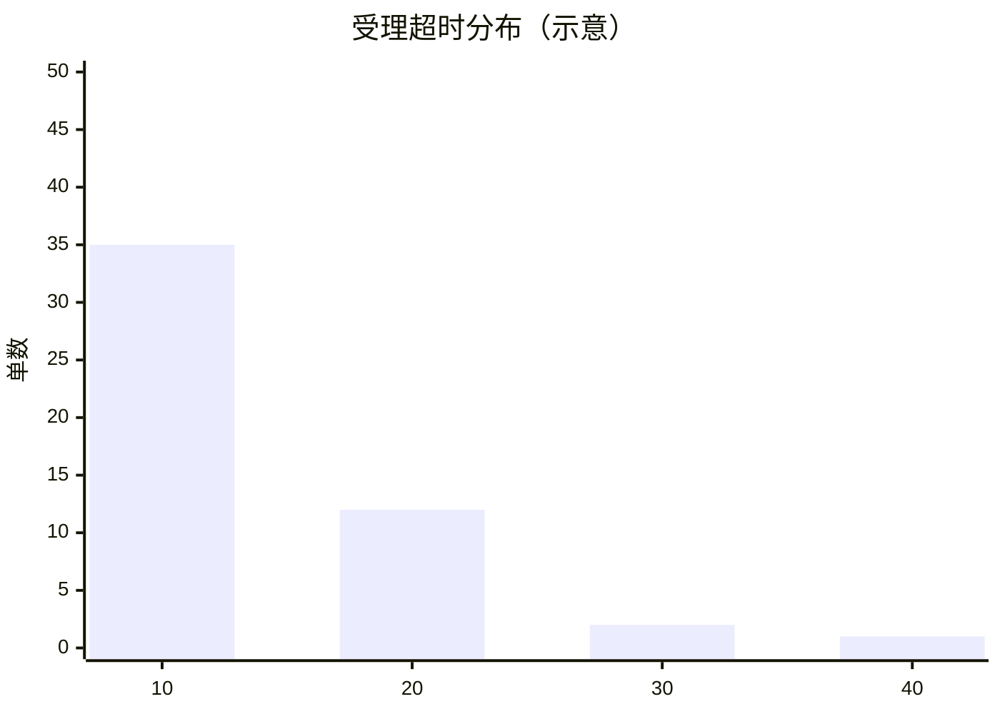

**场景**：材料真给了分布/容量数据时；示意数据必须标来源，无来源不画。
> **story 意见**：默认不合适——需求阶段很少有可信分布数据；仅当材料真给了分布且它直接决定阈值/规则理解时用。

### 19. 饼图 pie ⚪

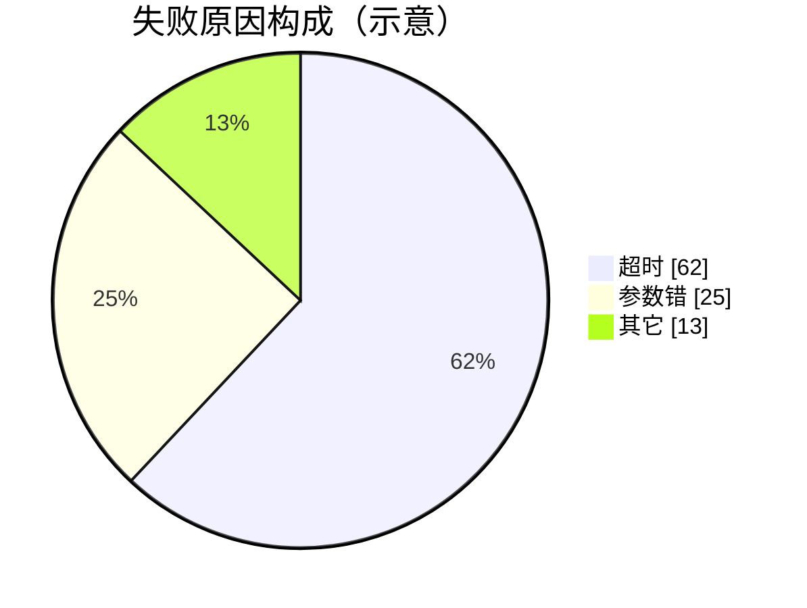

**场景**：构成占比；需求故事里少见，VOC/复盘类内容偶尔用。
> **story 意见**：不合适。构成占比是复盘/运营内容，需求材料不给，画出来就是编。

### 20. 甘特图 gantt ⚪

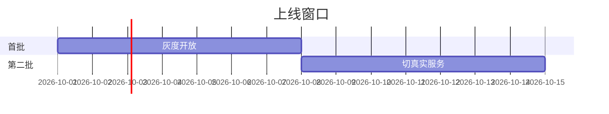

**场景**：真有排期承诺时；需求故事一般不承诺日期，**材料没给就不画**（timeline 更常用）。
> **story 意见**：不合适。需求故事不承诺日期，交付顺序 timeline（不带日期）已够。

### 21. 提交历史图 gitGraph ⚪

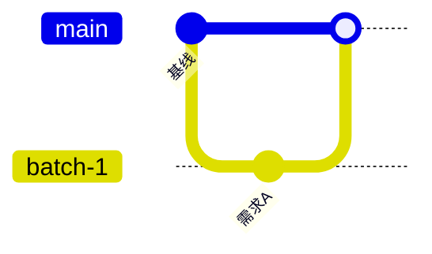

**场景**：分批交付的批次合并关系；极少用，多批次交付说明可考虑。
> **story 意见**：不合适。提交历史是实现过程，不是业务事实；批次关系用时间线或叙述。

### 22. 桑基图 sankey-beta ⚪

```mermaid
sankey-beta

用户请求,自动处理,70
用户请求,人工处理,30
人工处理,补偿,12
```

**场景**：流量/量级分布去向；有真实数据才有意义。
> **story 意见**：不合适，理由同饼图。

### 23. 需求图 requirementDiagram 🔶

```mermaid
requirementDiagram
    requirement r1 {
        id: 1
        text: 超时后不重复扣款
        risk: high
        verifymethod: test
    }
    element e1 {
        type: 补偿服务
    }
    e1 - satisfies - r1
```

**场景**：需求—实现—验证的追溯链；实验性语法，部分渲染器不支持，归档件慎用。
> **story 意见**：story 不合适。追溯链是工程管理视角，验收章的可观察条件表已承载同一信息；实验语法不进长期归档件。

### 24a. C4 上下文 C4Context 🔶（实验性，需较新 mermaid）

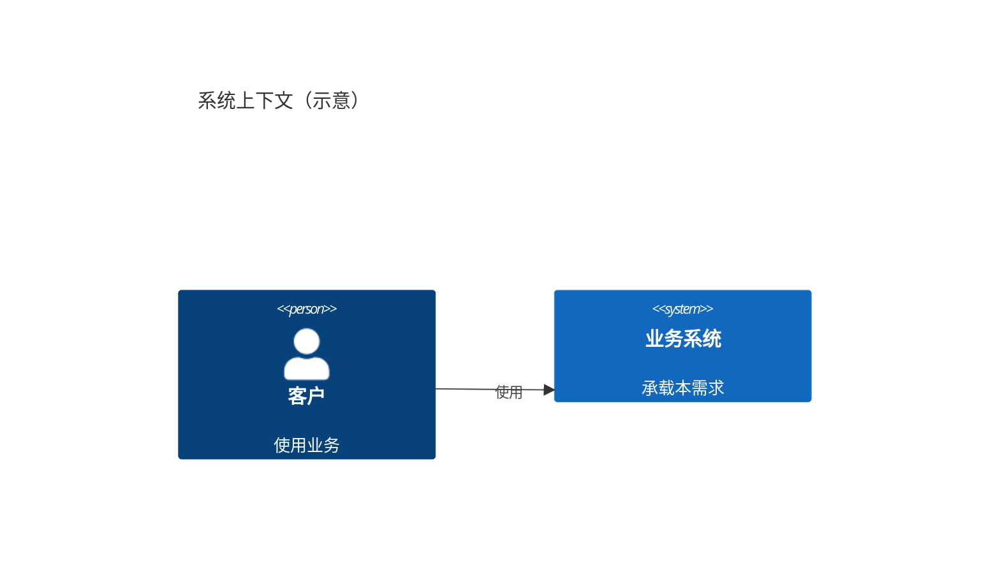

**场景**：系统边界与外部参与者；渲染器版本敏感，归档件慎用，维护文档可用。
> **story 意见**：归档件不合适——实验性语法随版本变，story 是长期文档，图会坏；维护文档可用。

### 24b. 块布局 block-beta 🔶（实验性）

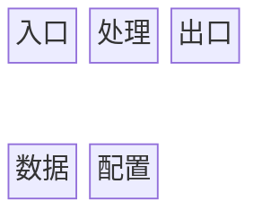

**场景**：模块/分区布局草图；语法仍在演进，归档件慎用。
> **story 意见**：同上，归档件不合适。

---

## 第三部分：GFM 扩展（渲染器能力加持）

### 25. 任务列表 ✅

- [x] 每条验收给可观察通过条件
- [ ] 超时阈值待评审定

**场景**：验收自查、回看清单项。

### 26. 提示块 🔶

> [!WARNING]
> 关闭入口不等于撤销业务。

**场景**：关键信息强调。GitHub/VSCode 渲染，**需求系统渲染未知**——归档件用「加粗段首」替代更稳。

### 27. 脚注 🔶

这里有一个注[^1]。

[^1]: 注释内容——渲染器支持度不一，归档件慎用，附录承载。

### 28. 键帽与行内代码 ✅

按 <kbd>Ctrl</kbd>+<kbd>V</kbd> 粘贴，配置项 `retry.limit` 生效。

### 29. 数学公式 🔶

$$超时时间 = 基准时间 \times 系数$$

**场景**：规则与数值类需求里有公式关系时；渲染依赖 KaTeX，归档件慎用。

### 30. ASCII 字符画与 sparkline ✅（代码块，零依赖）

```
用户 ──提交──▶ 发起方 ──受理──▶ 受理方
                 │                │
                 ◀────超时补偿────┘
利用率 ▁▂▃▅▇▇█
```

**场景**：两三个节点的小关系、内联小示意；任何渲染器都显示。
> **story 意见**：限三节点以内的小速写；再大就该 mermaid——ASCII 改起来易错，别让它长成正式图。

---

## 第四部分：不引入归档件的形式 ❌

| 手段 | 说明 | 为什么不引入 |
|---|---|---|
| 外链图表服务 | ``、kroki.io | 归档件自包含：读者无网络与仓库保证，外链必失效 |
| HTML/JS 交互图 | ECharts/Chart.js 片段 | md 不执行 JS；归档件渲染环境未知 |
| `<details>` 折叠 | 渐进披露 | 渲染环境未知；细节由附录投影区承载 |
| 行内样式着色 | `<span style="color:red">` | GitHub 过滤 style；换渲染器即掉 |

> 这些手段在 GitHub README/技术博客里常见且优秀，但 story.md 的归宿是**上传需求系统的自包含归档件**，判定标准不同。

---

## 维护设计者（GLM5.3Flash）意见汇总：不建议进 story.md 的图形（2026-09-20；仅意见，未经人逐条裁定，不改既有标注）

各图型下的「story 意见」标注同为本意见。

| 图形 | 不合适的根因 |
|---|---|
| 类图、需求图 | 实现侧/工程管理视角，评审人不看代码；信息已被 ER 与验收表承载 |
| 甘特图、提交历史图 | 排期与提交过程不是需求故事的事实；交付顺序用 timeline |
| 饼图、桑基图 | 构成/流量统计是复盘内容，需求材料不给，画出来就是编 |
| 象限图 | 主观打分伪精确，取舍结论要人话讲 |
| 柱线图（默认） | 仅材料真给分布且影响规则理解时例外 |
| 思维导图（正文） | 降级为仅开篇导览，防「把术语表画成图」替代真叙述 |
| 需求图、C4、块布局 | 实验性语法不进长期归档件——story.md 是要存多年的文档，图坏了比没图更糟 |
| 提示块、脚注、数学公式 | 渲染环境未知；归档件用加粗段首与附录替代 |

**贯穿判断**：story.md 的图形只有三问——①它解释的是业务关系还是实现过程？②信息在材料/决定里有据吗？③归档件多年后还能渲染吗？三问过不了就不进 story。

---

## 第五部分：场景映射总表

| 形式 | 需求故事场景（对应信息类型/章节） | 本仓结论 |
|---|---|---|
| 流程图 | 先后与分支——业务流程、功能说明 | ✅ 现状，主形态 |
| 时序图 | 跨方调用、返回与失败责任 | ✅ 现状，主形态 |
| 状态图 | 状态与转移——业务单据、页面状态 | ✅ 现状，主形态 |
| 关系图/ER | 数据对象归属、一多基数——数据与缓存、范围章责任边界 | ✅ 新增推荐 |
| 用户旅程 | 多段体验与体验低谷——范围拆分、异常与受限体验 | ✅ 新增推荐 |
| 时间线 | 交付顺序、模拟切真实——交付与上线 | ✅ 新增推荐 |
| 思维导图 | 概念域/功能分解目录——术语表邻域、业务方案开篇 | ✅ 新增推荐 |
| 表格/有序·无序列表/加粗强调/斜体/引用块/删除线/代码块 | 关键问题速查、并列与步骤、结论先行、原话与准则、明示否定、命令与错误码 | ✅ 现状基础形态 |
| ASCII 字符画 | 一两个节点的小关系速写 | ⚪ 知道可选 |
| 类图 | 实现侧静态结构（评审人读者慎用） | ⚪ 知道可选 |
| 象限图/柱线图/饼图/甘特/桑基/提交历史 | 权衡速览、数据分布、构成、真有排期、流量去向、批次合并 | ⚪ 知道可选，材料有数据才用 |
| 需求图/C4/块布局 | 追溯链、系统边界、布局草图 | 🔶 实验性，维护文档可用，归档件慎用 |
| 提示块/脚注/数学公式 | 关键强调、注、公式 | 🔶 渲染器依赖，归档件用加粗段首/附录替代 |
| 外链图表/HTML 交互图/details/行内样式 | —— | ❌ 与自包含归档件冲突 |

**全部 mermaid 图型走同一围栏，机制零改动**（骨架 `形式：` 已支持点名图种）；要做的是把这份菜单交给作者＋表达有效性自问（见 [00-需求与方案](../00-需求与方案.md) §3），**不设配额**。
