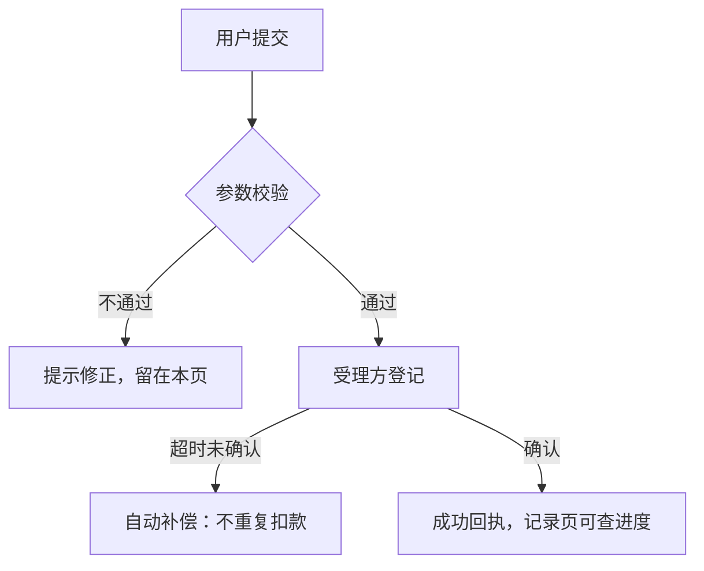
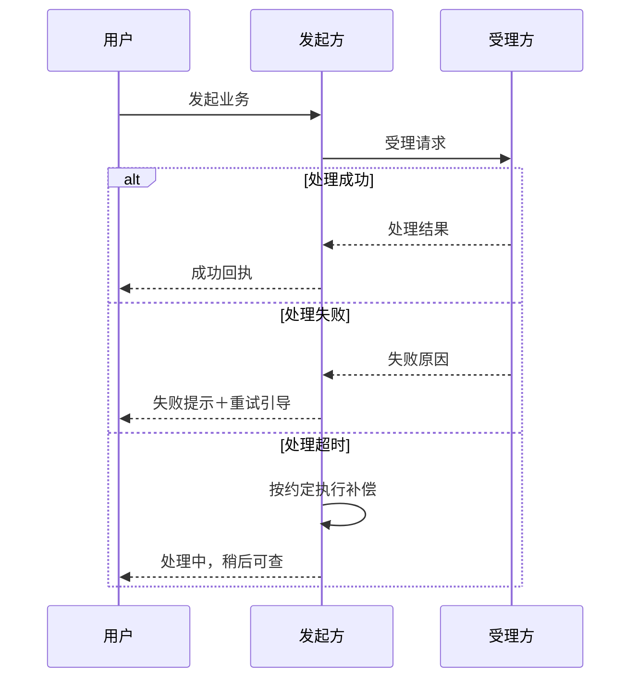
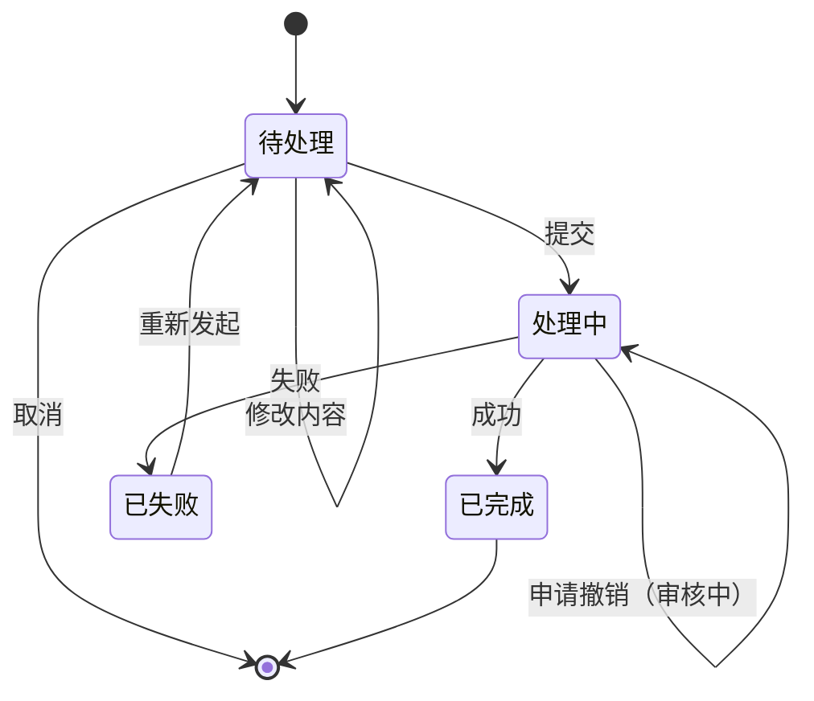
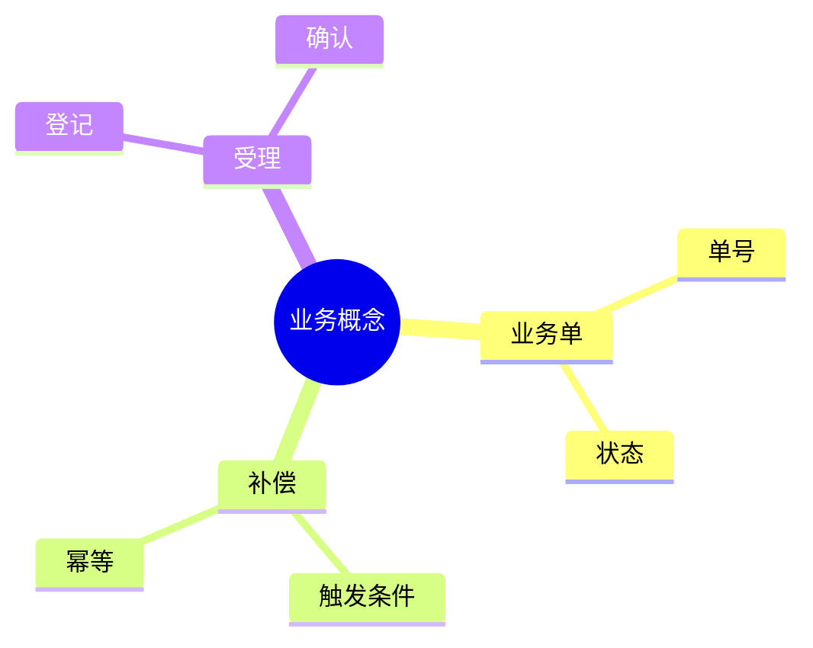
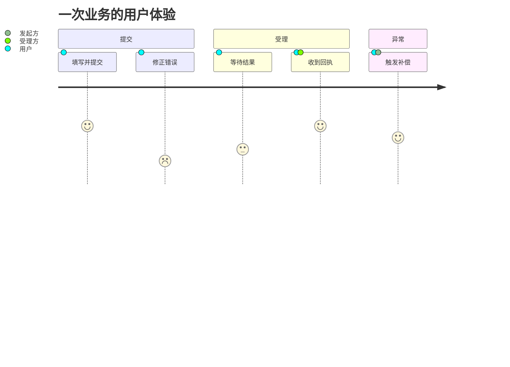
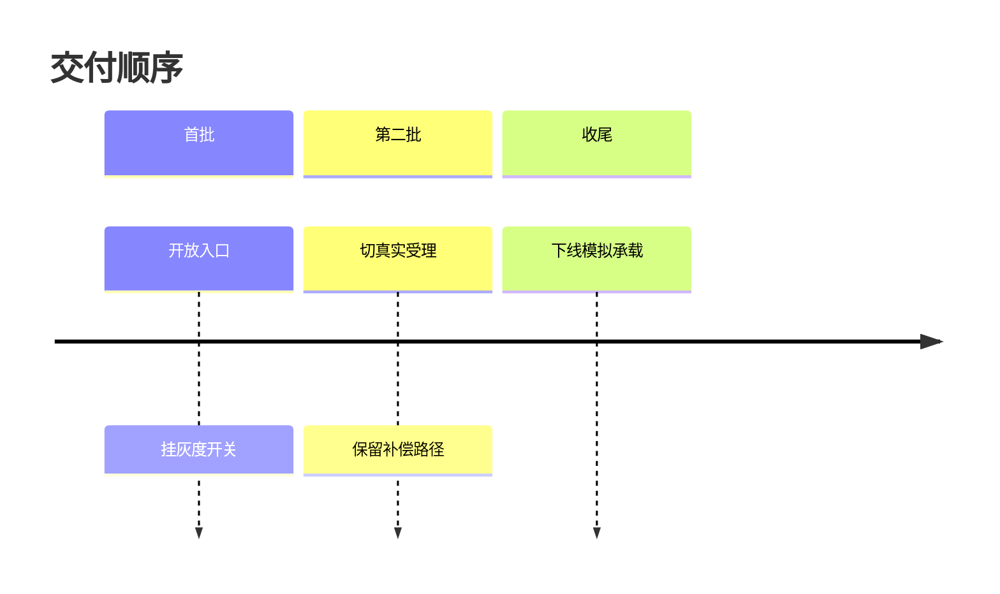
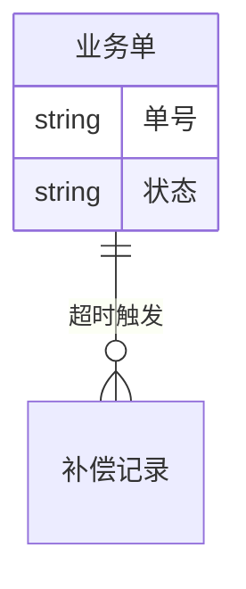
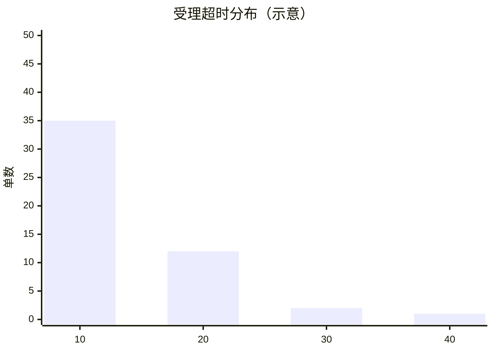
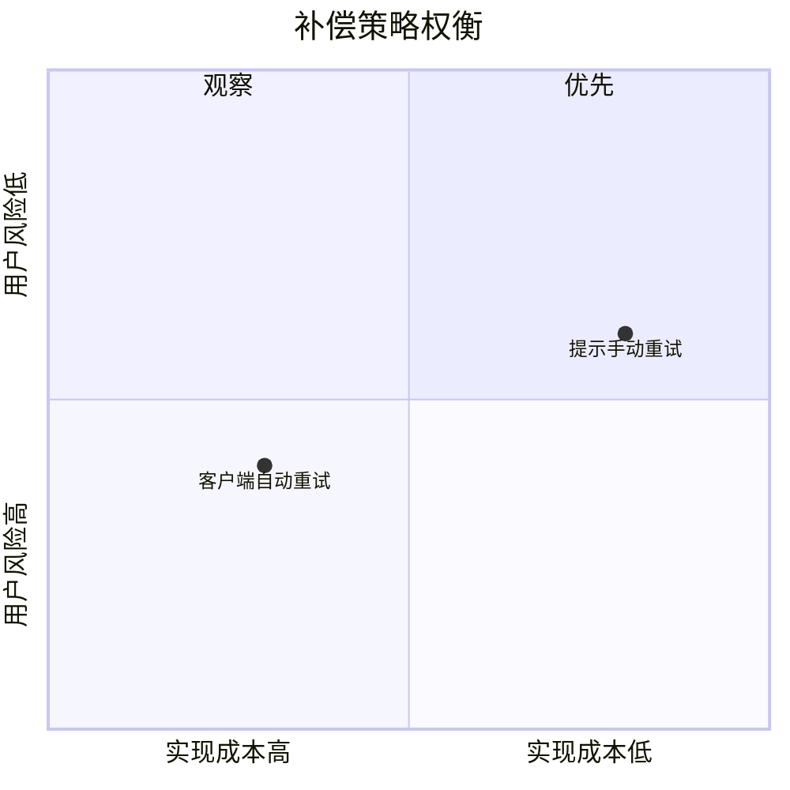

# 表达样式对照（预览用，非交付件）

> 历史探索材料，不是 1.9.4 的实施合同或通过金样。部分示例补入了源段没有给出的“用户无感”、补偿条件、审核中状态等事实，不能直接用于证明表达无损。当前设计与实施依据见 [成品表达合同](../../../../plan/1.9.4/2026-09-20-版本实施/01-Story表达优化.md)和[同源示范](../../../../plan/1.9.4/2026-09-20-版本实施/参考/02-同源成品示范与保持核对.md)。

> 用 VSCode 预览（Ctrl+Shift+V）或 Typora 打开本文件看渲染效果。每个例题给两种写法：**A 长文** 与 **B 图形＋简洁说明＋关键信息**。题材全部中性，与任何 Case 无关。
>
> **先说清目标**：图形不是目标，把需求讲清楚才是。三个例题都是**关系类内容**（流程/调用/状态），这类内容图形通常更快；**理由与取舍类内容的正确形态仍是叙述（结论先行）**，不在这份对照里装作图形更优。反向的一面——为画而画、图与文字重复讲同一件事——见文末红线，与本文件的正例同等重要。
>
> 本文件的对照点批注与手法评估均为维护设计者（GLM5.3Flash）意见，供维护者预览参考，未经人的逐条裁定。

---

## 例一：业务流程与分支

### A · 长文写法

用户在提交页面填写业务信息后点击提交，系统首先对参数进行校验，如果校验不通过，页面会提示用户修正错误并停留在当前页面，用户修正后可以再次提交。校验通过后系统将业务请求登记到受理方，受理方处理完成后会向系统返回确认结果，如果受理方在约定时限内没有返回确认，系统会自动发起补偿，补偿保证不会重复扣款，用户不需要人工干预。如果受理方正常确认，系统向用户展示成功回执，用户可以在记录页查看本次业务的处理进度。在整个过程中，如果用户中途退出页面，已经登记的请求不会丢失，用户重新进入后可以继续查询状态。

### B · 图形化写法

**一句话**：提交即校验，受理超时自动补偿，用户无感。



| 关键问题 | 答案 |
|---|---|
| 超时谁兜底 | 受理方超时后系统自动补偿 |
| 会不会重复扣款 | 不会，补偿按同一请求只处理一次 |
| 中途退出 | 已登记请求不丢失，重新进入可查状态 |

<details>
<summary>细节：补偿的三种触发条件（点开查看）</summary>

1. 受理方超时未返回确认；
2. 受理方明确返回受理失败且允许重试；
3. 网络中断导致确认回执丢失，且补偿窗口未关闭。

</details>

> 对照点：A 段 240 字要读到尾才知道「超时兜底」；B 用一张图＋一张两行表，**关键问题 10 秒内可扫到**，细节折叠不占视线。

---

## 例二：跨方调用与责任

### A · 长文写法

发起方在需要受理结果时调用受理方接口，受理方收到请求后进行业务处理，处理完成后返回处理结果。如果受理方处理失败，会返回失败原因，发起方负责把失败原因转达给用户并引导重试；如果受理方处理超时，发起方按照约定执行补偿。整个调用过程中，返回结果的归属由受理方保证，失败后的用户引导由发起方负责。

### B · 图形化写法

**责任一句话**：结果归属受理方保证，用户引导发起方负责。



> 对照点：三种结局、两方责任，图上一眼分层；A 段同样的信息埋在 180 字里，次序还要读者自己排。

---

## 例三：状态与恢复

### A · 长文写法

业务单据创建之后处于待处理状态，待处理状态下用户可以修改内容也可以取消；提交后进入处理中状态，处理中状态不能修改，只能等待处理结果或者申请撤销；处理成功进入已完成状态，已完成状态只能查看；处理失败进入已失败状态，已失败状态可以重新发起。

### B · 图形化写法



| 状态 | 用户能做什么 |
|---|---|
| 待处理 | 修改、取消 |
| 处理中 | 等结果、申请撤销 |
| 已完成 | 只读 |
| 已失败 | 重新发起 |

> 对照点：六个状态八条转移，状态图＋四行表全说清；A 段六个「状态」词排比读起来极易看漏一条。

---

## 例四起：现状之外的图型（story.md 当前实际只用流程/时序/状态三种）

> 以下全部走同一个 mermaid 围栏，**零机制改动、零新文件**——渲染链与现有图完全相同；价值差异在于「与需求故事的信息类型匹不匹配」。每型一句评估，文末汇总表。

### 4 · 概念与功能分解 → mindmap



**评估**：术语多、关系松的概念域一章，比列表快；但**它表达不了约束**（谁依赖谁、什么条件），只能当目录用——正文仍要讲。

### 5 · 多段体验与触点 → journey



**评估**：多段体验（范围拆分类需求的核心问题「体验在哪一段断开」）有独到表达力——冒号后是**顺畅度评分**，能标出体验低谷；现状三图型都画不了「体验好坏」。

### 6 · 交付顺序与上线阶段 → timeline



**评估**：交付顺序与协同章「谁先谁后、模拟何时切真实」比有序列表直观；**前提是材料真给了顺序**——材料没给就不该画。

### 7 · 数据对象关系 → erDiagram



**评估**：「数据与缓存」类需求（存什么、跟账号什么关系、一条单带出几条记录）比表格准；基数（`||--o{`）是表格写不出的信息。

### 8 · 数值与阈值 → xychart-beta



**评估**：规则与数值类需求里给过分布/容量的，一眼看出阈值该定哪；**示意数据必须标注来源**，没有数据来源就不画——需求故事里多数时候用不上。

### 9 · 简单关系速写 → ASCII 字符画（代码块，零依赖）

```
用户 ──提交──▶ 发起方 ──受理──▶ 受理方
                 │                │
                 ◀────超时补偿────┘
```

**评估**：两三个节点的小关系，比起 mermaid 围栏更轻；缺点是不能渲染成真图、改起来易错——只适合一两个节点的小场景。

### 10 · 权衡取舍 → quadrantChart



**评估**：决策件的候选方案对比可用；**story.md 正文慎用**——取舍结论要人话讲（决策登记已有 choice/confirm 形态），象限图是辅助视角不是替代。

### 不引入的形式（与归档件模型冲突）

| 形式 | 为什么不引入 |
|---|---|
| quickchart/kroki 等外链图表服务 | 归档件自包含红线：读者手上没有仓库与网络保证，外链图会失效 |
| HTML/JS 交互图（ECharts 等） | 归档件渲染环境未知且不执行 JS |
| `<details>` 折叠 | 渲染环境未知；story.md 靠附录投影承载细节，不用折叠 |
| gantt 甘特 | 需求故事不承诺排期；材料真给排期时用 timeline 即可 |
| gitGraph / sankey / pie | 与需求故事的信息类型基本不匹配（提交历史、流量分布、占比统计） |

### 汇总：建议进入作者「图型菜单」的

**流程图、时序图、状态图（现状）＋ 关系图/ER、用户旅程、时间线、思维导图（新增推荐）**；xychart/quadrant/ASCII 列为「知道可选」而非推荐；不引入外链与 HTML 类。菜单进 story-write.md 的形式类型说明（:92），**仍不设配额**——按表达有效性自问选。


| GitHub 手法 | story.md 现状 | 结论 |
|---|---|---|
| mermaid 内嵌承载关系 | 已支持（上游图搬运＋自画，骨架 `形式：` 预选） | 机制在位，缺偏置 |
| 表承载属性/对比 | 形态映射表 story-write.md:46-57 已定义「逐项比对→表」 | 同上 |
| 结论先行（TL;DR） | 「叙述，结论先行」:55 已写 | 需要成为骨架设计自问 |
| `<details>` 折叠 | story.md 是上传需求系统的归档件，**渲染环境未知** | 不引入归档件；演示文件仅供预览风格 |
| 预渲染 SVG/PNG | story.md 图片走登记路径引用 | 已在位 |
| 锚点 TOC | 十章结构固定，章内小节不多 | 不需要 |

**红线**：以上偏置全部走语义层（设计自问＋审查 advisory），不设图数/占比门禁（00-总览 §6「不以图数判语义」），不向某篇金样的形状对齐（12-审视教训）。
