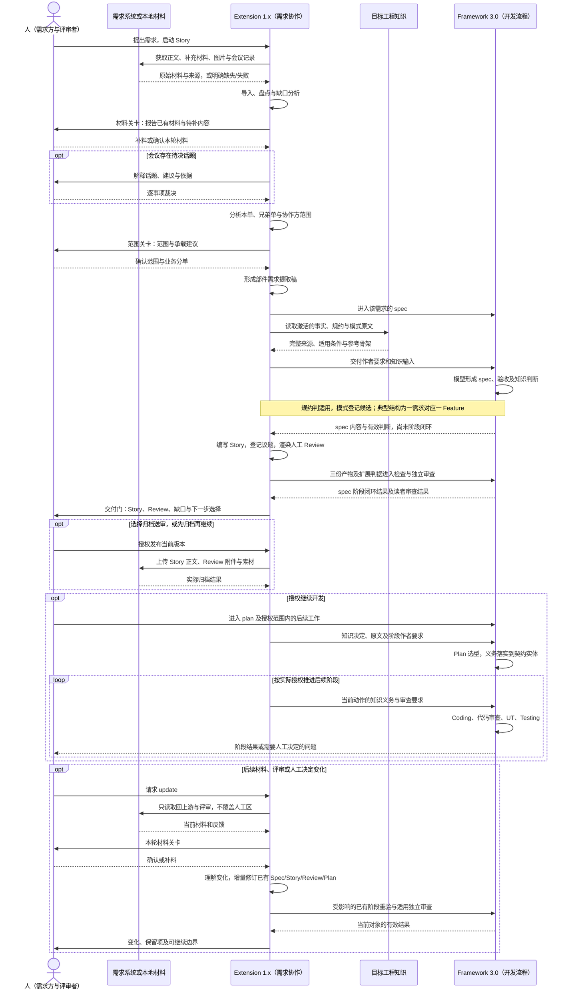
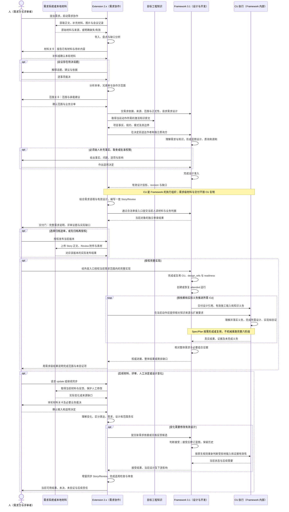

# Framework 与 Extension 交互时序对照

本文是 [目标规格](02-目标规格.md) 的图示，协作协议与待核实接线以 [协作分册](03-Framework协作与验收.md) 为准。

图中的“Extension 1.0 / 2.0”表示 1.x / 2.x 产品线。两图以同一套完整产品特性为基础，对照各自与 Framework 的协作方式；后图是 2.0.1 的目标流程，其接线与验证边界见协作分册。

参与者表示职责，不表示独立服务、进程或新增 Agent。执行模型依据相应产品指令完成箭头中的动作；Framework 的独立审查和运行机制合并在其泳道中。两图均以正式需求的完整主路径为例，可选分支按实际请求执行。

## 1. Framework 3.0 + Extension 1.0 产品线

本图展示 Story 1.x 的需求准备、人读交付、知识应用、人工评审、更新和归档如何与 Framework 3.0 配合。

此结构中，Extension 的目标已经是需求级，但实现将需求交付挂在 spec 闭环上，知识判断与选型分别落在 spec/plan。图中后续阶段并非一次 Story 请求自动授权；更新也不自动改代码或执行设备测试。

## 2. Framework 3.1 + Extension 2.0 产品线

此图从需求级目标推导协作。蓝图知识实际送达、无新 spec 的人读审查及义务跨施工输入传递，仍需按协作分册核实合法接线。

此图采用默认 Story 请求：设计准入后形成人读交付，授权实施后按需完成 CU 与施工准备。若用户明确请求完整设计交接，Framework 在该请求内完成 CU、design_refs 与 readiness 后交回，不启动运行；后续授权实施时复用有效结果。

E 到 C 的箭头表示扩展要求经 Framework 的实际执行上下文送达，不代表 Extension 选择或调度 CU。更新中的有效性核对也不表示重新实施；代码修复仍服从实际授权。独立人读审查箭头是目标合同，具体合法入口由 design 核实。

## 3. 两图共同的边界

- 两版都以需求为 Extension 的产品单位；取材、人工决定、人读交付、变化处理与发布职责保持。
- 知识均须看到、理解、应用、传递。旧版依赖 spec/plan 的固定承接；目标版按实际决策和执行责任承接，CU 拆分不能让义务丢失。
- 前图成文在 spec 阶段内完成；后图使用有效设计形成人读交付，不依赖 CU 新生成 spec/plan。蓝图准入、人工批准、实施授权与整体完成分别成立。
- 图示是 Story 完整主路径。直接进入 Framework 时，知识仍应生效，不强制启动取材、成文和归档；这一要求适用于两条产品线。
- 本地单跳过远端获取/发布；纯表达更新不修改蓝图；无变化不创建无用修订。发布失败保留本地结果，本地撤回与远端恢复不回滚 Framework 历史。
- 安装升级属于使用前的独立运维动作，两图未展开；其所有权与失败行为仍按特性 H 和目标规格执行。
