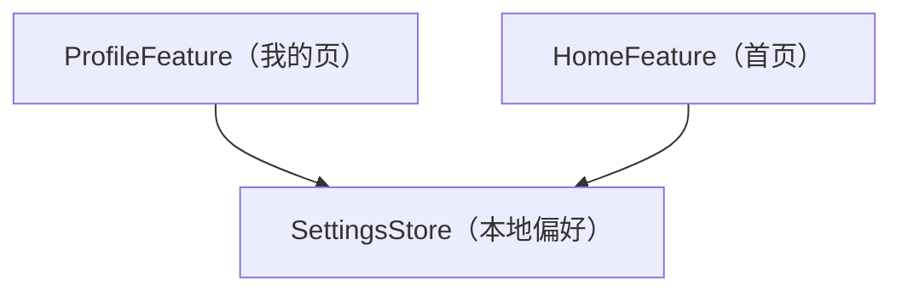

# PocketLedger — 模块与分层架构

> 机器可读结构见工程根目录 [framework.config.json](../framework.config.json) 的 `architecture` 段。
> 本工程是 verifier smoke 的合成最小工程：只为让 spec 阶段的架构守门、Scope 守门与术语守门有可校验基准，
> 不代表任何真实产品。

## 外层架构（outer_layers）

只有一个外层 `app`，同层策略 `dag`——模块之间允许无环依赖，没有跨层方向约束。

### 层间依赖表

| 外层 id | 允许依赖的其它外层（can_depend_on） | 同层策略（intra_layer_deps） |
|---------|--------------------------------------|------------------------------|
| `app` | （无） | dag |

## 业务模块清单

| 模块 | 一句话职责 |
|------|------------|
| `HomeFeature` | 首页：渲染总余额与最近交易摘要；总余额的显示形态在这里决定。 |
| `ProfileFeature` | 「我的」页：承载偏好设置的入口与控件，自身不持久化。 |
| `SettingsStore` | 用户偏好的本地持久化：读写、默认值、清数据后的行为；零界面。 |

## 模块内分层

`module_inner_layers` 只有一层 `content`，`inner_dependency_direction` 为 `upward`；
跨模块出口文件名为 `index`。

## 架构级变更记录

| 日期 | impact | 变更 |
|------|--------|------|
| 2026-09-02 | dsl_change | 建立合成工程初始架构（单外层 `app` + 三模块）。 |
